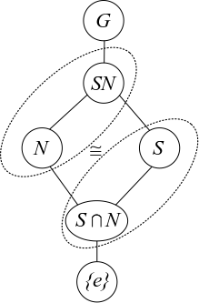

## Isomorphism Theorems

:::{.theorem title="1st Isomorphism Theorem"}
If $\phi:G\to H$ is a group morphism then \[G/\ker \phi \cong \im \phi.\]

Note: for this to make sense, we also have

- $\ker \phi \normal G$
- $\im \phi \leq G$
:::

:::{.corollary}
If $\phi: G\to H$ is surjective then $H\cong G/\ker \phi$.
:::

:::{.theorem title="Diamond Theorem / 2nd Isomorphism Theorem"}
If $S \leq G$ and $N \normal G$, then
\[
\frac{SN}{N} \cong \frac{S}{S\intersect N} \quad \text{ and }\quad \abs{SN} = \frac{\abs S \abs N}{\abs{S\intersect N}}
.\]

{width=350px}

:::

:::{.remark}
For this to make sense, we also have
    
- $SN \leq G$,
- $S\intersect N \normal S$,

If we relax the conditions to $S, N \leq G$ with $S \in N_G(N)$, then $S\intersect N \normal S$ (but is not normal in $G$) and the 2nd Isomorphism Theorem still holds.
:::

:::{.theorem title="Cancellation / 3rd Isomorphism Theorem"}
Suppose $N, K \leq G$ with $N \normal G$ and $N\subseteq K \subseteq G$.

1. If $K\leq G$ then $K/N \leq G/N$ is a subgroup
2. If $K\normal G$ then $K/N \normal G/N$.
3. Every subgroup of $G/N$ is of the form $K/N$ for some such $K \leq G$.
3. Every *normal* subgroup of $G/N$ is of the form $K/N$ for some such $K \normal G$.
4. If $K\normal G$, then we can cancel normal subgroups:
\[  
\frac{G/N}{K/N} \cong \frac{G}{K}
.\]
:::

:::{.theorem title="The Correspondence Theorem / 4th Isomorphism Theorem"}
Suppose $N \normal G$, then there exists a correspondence:

\[  
\left\{
H < G \suchthat N \subseteq H
\right\}
\mapstofrom
\left\{
H \suchthat H < \frac G N
\right\}
\\
\correspond{
  \text{Subgroups of $G$} \\
  \text{containing $N$}
} \mapstofrom
\correspond{
  \text{Subgroups of the } \\
  \text{quotient $G/N$}
}
.\]

In words, subgroups of $G$ containing $N$ correspond to subgroups of the quotient group $G/N$. This is given by the map $H \mapsto H/N$.
:::

Note: $N \normal G$ and $N \subseteq H < G \implies N \normal H$.

## Products

:::{.theorem title="Chinese Remainder Theorem"}
\[
\gcd(p, q) = 1 \implies \ZZ/p\ZZ \cross \ZZ/q\ZZ \cong \ZZ/pq\ZZ
.\]
:::

:::{.theorem title="Recognizing Direct Products"}
We have $G \cong H \times K$ when

- $H, K \normal G$

- $G = HK$.

- $H\intersect K = \theset{e} \subset G$

> Note: can relax to $[h,k] = 1$ for all $h, k$.

:::

:::{.theorem title="Recognizing Generalized Direct Products"}
We have $G \cong \prod_{i=1}^n H_i$ when

- $H_i \normal G$ for all $i$.

- $G = H_1 \cdots H_n$

- $H_k \intersect H_1 \cdots \hat{H_k} \cdots H_n = \emptyset$

> Note on notation: intersect $H_k$ with the amalgam *leaving out* $H_k$.

:::

:::{.theorem title="Recognizing Semidirect Products"}
We have $G \cong N \semidirect_\psi H$ when

- $N \normal G$

- $G =  NH$

- $H \actson N$ by conjugation via a map
  \[  
  \psi: H \to \Aut(N) \\
  h \mapsto h(\wait)h^{-1}
  .\]

> Relaxed condition: $H, N \normal G$ for direct product, or just $H\leq G$ for a semidirect product.

:::

:::{.proposition}
If $H,K \leq G$ and $H \leq N_G(K)$ (or $K \normal G$) then $HK \leq G$ is a subgroup.
:::

:::{.fact}
\envlist

-  If $\sigma \in \Aut(H)$, then \(N \semidirect_\psi H \cong N \semidirect_{\psi \circ \sigma} H\).

- $\Aut((\ZZ/(p)^n) \cong \GL(n, \FF_p)$, which has size 
\[  
\abs{\Aut(\ZZ/(p)^n)} = (p^n-1)(p^n-p)\cdots(p^n-p^{n-1})
.\]
  
  - If this occurs in a semidirect product, it suffices to consider similarity classes of matrices (i.e. just use canonical forms)

- \[ \Aut(\ZZ/(n)) \cong \ZZ/(n)\units \cong \ZZ/({\varphi(n)})\] where $\varphi$ is the totient function.

  - $\varphi(p^k) = p^{k-1}(p-1)$

- If $G, H$ have coprime order then $\Aut(G\oplus H) \cong \Aut(G) \oplus \Aut(H)$.

:::

## Sylow Theorems

:::{.definition}
A **$p\dash$group** is a group $G$ such that every element is order $p^k$ for some $k$.
  If $G$ is a finite $p\dash$group, then $\abs G = p^j$ for some $j$.
:::

Write

- $\abs{G} = p^k m$ where $(p, m) = 1$,
- $S_p$ a Sylow$\dash p$ subgroup, and
- $n_p$ the number of Sylow$\dash p$ subgroups.

### Sylow 1 (Cauchy for Prime Powers)

:::{.theorem title="Sylow 1"}
\[
\forall p^n \text{ dividing } \abs{G} \text{, there exists a subgroup of size } p^n
.\]
:::

Idea: Sylow $p\dash$subgroups exist for any $p$ dividing $\abs{G}$, and are maximal in the sense that every $p\dash$subgroup of $G$ is contained in a Sylow $p\dash$subgroup.

If $\abs G = \prod p_i^{\alpha_i}$, then there exist subgroups of order $p_i^{\beta_i}$ for every $i$ and every $0 \leq \beta_i \leq \alpha_i$.
In particular, Sylow $p\dash$subgroups always exist.

### Sylow 2 (Sylows are Conjugate)

:::{.theorem title="Sylow 2"}
All Sylow$\dash p$ subgroups $S_p$ are conjugate, i.e.
\[
S_p^i, S_p^j \in \mathrm{Syl}_p(G) \implies \exists g \text{ such that } g S_p^i g\inv = S_p^j
\]

:::

:::{.corollary}
\[
n_p = 1 \iff S_p \normal G
.\]
:::

### Sylow 3 (Numerical Constraints)

:::{.theorem title="Sylow 3"}
\envlist

1. $n_p \divides m~$ (in particular, $n_p \leq m$),

2. $n_p \equiv 1 \mod p$,

3. $n_p = [G : N_G(S_p)]$ where $N_G$ is the normalizer.

:::

:::{.corollary}
$p$ does not divide $n_p$.
:::

:::{.proposition}
Every $p\dash$subgroup of $G$ is contained in a Sylow $p\dash$subgroup.
:::
:::{.proof}
Let $H \leq G$ be a $p\dash$subgroup.
If $H$ is not *properly* contained in any other $p\dash$subgroup, it is a Sylow $p\dash$subgroup by definition.
Otherwise, it is contained in some $p\dash$subgroup $H^1$.
Inductively this yields a chain $H \subsetneq H^1 \subsetneq \cdots$, and by Zorn's lemma $H\definedas \union_i H^i$ is maximal and thus a Sylow $p\dash$subgroup.
:::

## Special Classes of Groups

:::{.definition title="2 out of 3 Property"}
The **"2 out of 3 property"** is satisfied by a class of groups $\mathcal{C}$ iff whenever $G \in \mathcal{C}$, then $N, G/N \in \mathcal{C}$ for any $N \normal G$.
:::

:::{.definition title="p-groups"}
If $\abs{G} = p^k$, then $G$ is a **p-group.**
:::

:::{.definition title="Normalizers Grow"}
If for every proper $H<G$, $H\normal N_G(H)$ is again proper, then "normalizers grow" in $G$.
:::

## Classification of Groups

General strategy: find a normal subgroup (usually a Sylow) and use recognition of semidirect products.

- [Keith Conrad: Classifying Groups of Order 12](https://kconrad.math.uconn.edu/blurbs/grouptheory/group12.pdf)
- Order $p$: cyclic.
- Order $p^2q$: ?

## Finitely Generated Abelian Groups

:::{.definition title="Invariant Factor Decomposition"}
$$
G \cong \ZZ^r \times \prod_{j=1}^m \ZZ/n_j\ZZ
\quad \text{ where } n_1 \divides \cdots \divides n_m
.$$
:::

**Invariant factors $\to$ Elementary Divisors:**

- Take prime factorization of each factor
- Split into coprime pieces

:::{.example}
\[
\ZZ_2 \times \ZZ_2 \times \ZZ_{2^3 \cdot 5^2 \cdot 7}
\cong
\ZZ_2 \times \ZZ_2 \times \ZZ_{2^3} \times \ZZ_{5^2} \times \ZZ_7
\]
:::

**Going from elementary divisors to invariant factors:**

- Bin up by primes occurring (keeping exponents)
- Take highest power from each prime as *last* invariant factor
- Take highest power from all remaining primes as next, etc

:::{.example}
Given the invariant factor decomposition
\[
G = {\ZZ_{2}\times\ZZ_{2}\times\ZZ_{2}\times\ZZ_{3}\times\ZZ_{3}\times\ZZ_{5^2}}
\]

| $p = 2$  | $p= 3$  | $p =5$ |
|---|---|---|
|  $2,2,2$ |  $3,3$ | $5^2$

$\implies n_m = 5^2 \cdot 3 \cdot 2$

| $p = 2$  | $p= 3$  | $p =5$ |
|---|---|---|
|  $2,2$ |  $3$ | $\emptyset$

$\implies n_{m-1} = 3 \cdot 2$

| $p = 2$  | $p= 3$  | $p =5$ |
|---|---|---|
|  $2$ |  $\emptyset$ | $\emptyset$

$\implies n_{m-2} = 2$

and thus
\[
G\cong \ZZ_2 \times \ZZ_{3\cdot 2} \times \ZZ_{5^2 \cdot 3 \cdot 2}
\]
:::

**Classifying Abelian Groups of a Given Order:**

Let $p(x)$ be the integer partition function.

> Example: $p(6) = 11$, given by $6, 5+1, 4+2, \cdots$.

Write $G = p_1^{k_1} p_2^{k_2} \cdots$; then there are $p(k_1) p(k_2) \cdots$ choices, each yielding a distinct group.

