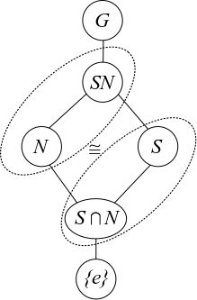

## Automorphism Groups

:::{.fact}
Some facts about common automorphism groups, and how to count and reason about them.
Homs among various cyclic groups $C_m$ and any of their automorphism groups $\Aut(C_m)$ are **completely** classified, so for example $\Hom(C_m, C_n), \Hom(C_m, \Aut(C_n)), \Hom(\Aut(C_m), C_n)$, etc.
There's a good reference here: <https://www.whitman.edu/documents/Academics/Mathematics/SeniorProject_BrianSloan.pdf>

Let $\varphi$ be the totient function, and note that a cyclic group $C_n$ has precisely $\phi(n)$ choices of generators.
One can compute
\[
\phi(p) &= p-1 \\
\phi(p^k) &= p^{k-1}(p - 1) \\
\phi(p^kq^\ell) &= \phi(p^k)\phi(q^\ell) \quad\text{when } \gcd(q, p) = 1
.\]

- Automorphisms of cyclic groups are completely known:
\[
\Aut(C_n) \cong C_n\units 
,\]
which has size $\phi(n)$ but is not generally isomorphic to $C_{\phi(n)}$

:::{.warnings}
Warning: $C_n\units$ is not always cyclic!! 
For example, $C_8\units \cong C_2^2 \neq C_{4}$.
In fact, $C_n\units$ cyclic iff $n=2,4,p^k, 2p^k$ for $p$ an odd prime.
:::

- For $p$ an odd prime, $\Aut(C_p) \cong C_p\units \cong C_{p-1}$ is cyclic. 

- For $p^k$ an odd prime power, $\Aut(C_{p^k}) \cong C_{\varphi(p^k)}$ is cyclic.

- For $2^k$ with $k\geq 1$, $C_{2^k}\units \cong C_{2}\times C_{2^{k-2}}$.

- If $G, H$ have coprime order then $\Aut(G \cross H) \cong \Aut(G) \cross  \Aut(H)$.
  One can then compute a general order by factoring $n = \prod_{k=1}^\ell p_k^{n_k}$ to get a decomposition 
\[
C_n= C_{\prod_{k=1}^\ell p_k^{n_k}}= \prod_{k=1}^{\ell} C_{p_k^{n_k}} 
,\]
  and thus
  \[
  \Aut(C_n) 
  &\cong \Aut\qty{\prod_{k=1}^{\ell} C_{p_k^{n_k}} }\\
  &\cong \prod_{k=1}^\ell \Aut\qty{C_{p_k^{n_k}}} \\
  &\cong \prod_{k=1}^\ell C_{p_k^{n_k}}\units \\
  &\cong C_{2^{\ell}}\units \cross \prod_{\substack{k=1 \\ p_k\neq 2} }^\ell C_{p_k^{n_k}}\units \\
  &\cong \qty{C_2 \cross C_{2^{\ell-2}} } \cross \prod_{\substack{k=1 \\ p_k\neq 2} }^\ell C_{m_k} && m_k \da \varphi(p_k^{n_k}) \\
  &\cong \qty{C_2 \cross C_{2^{\ell-2}} } \cross \prod_{\substack{k=1 \\ p_k\neq 2} }^\ell C_{m_k} &&  m_k \da p_k^{n_k-1}(p_k-1)  
  .\]

- $\Aut(C_p^n) \cong \GL_n(\FF_p)$ which has size 
\[
\# \GL_n(\FF_p) = \prod_{k=0}^{n-1}(p^n-p^k) = (p^n-1)(p^n-p)(p^n-p^2)\cdots(p^n-p^{n-1})
.\]

- Counting homs: $\# \Hom_\Grp(C_n, C_m) = \gcd(n ,m)$.

-  If $\sigma \in \Aut(H)$ and $\tau \in \Aut(N)$, then \(N \semidirect_\psi H \cong N \semidirect_{\tau \circ \psi \circ \sigma} H\).
  - So if $\GL_n$ shows up in a semidirect product, it suffices to consider similarity classes of matrices (i.e. just use canonical forms).

- $\Inn(G) \cong G/Z(G)$.

:::

:::{.example title="?"}
Some examples of writing automorphism groups as products of cyclic groups:
\[
\Aut(C_{2^2\cdot 3}) &\cong \Aut(C_{2^2})\cross \Aut(C_3) \cong \qty{C_2 \cross C_{2^{2-2}}} \cross C_{\phi(3)} = \qty{C_2}\cross C_2 \\
\Aut(C_{2^3\cdot 3}) &\cong \Aut(C_{2^3})\cross \Aut(C_3) \cong \qty{C_2 \cross C_{2^{3-2}}}\cross C_{\phi(3)} = \qty{C_2 \cross C_2}\cross C_2 \\
\Aut(C_{2^4\cdot 3}) &\cong \Aut(C_{2^4})\cross \Aut(C_3) \cong \qty{C_2 \cross C_{2^{4-2}}}\cross C_{\phi(3)} = \qty{C_2 \cross C_{2^2}}\cross C_2\\
\Aut(C_{2^2\cdot 7}) &\cong \Aut(C_{2^2})\cross \Aut(C_7) \cong \qty{C_2 \cross C_{2^{2-2}}}\cross C_{\phi(7)}\cong C_2 \cross C_6 \\
\Aut(C_{2\cdot 3\cdot 5}) &\cong \Aut(C_2) \cross \Aut(C_3) \cross \Aut(C_5) \cong 1\cross C_{\phi(3)}\cross C_{\phi(5)} \cong C_2 \cross C_4
.\]

Some concrete examples of $\Aut(C_m) \cong C_m\units$ for various $m$:

- $m=2: 0$
- $m=3: C_2$
- $m=4: C_2$
- $m=5: C_2$
- $m=6: C_2$
- $m=7: C_6$
- $m=8: C_2\times C_2$
- $m=9: C_6$
- $m=10: C_4$
- $m=11: C_{10}$
- $m=12: C_{2} \times C_{2}$
- $m=13: C_{12}$
- $m=14: C_{6}$
- $m=15: C_{4} \times C_{2}$
- $m=16: C_{4} \times C_{2}$
- $m=17: C_{16}$
- $m=18: C_{6}$
- $m=19: C_{18}$
- $m=20: C_{4} \times C_{2}$
- $m=21: C_{6} \times C_{2}$
- $m=22: C_{10}$
- $m=23: C_{22}$
- $m=24: C_{2} \times C_{2} \times C_{2}$
- $m=25: C_{20}$
- $m=26: C_{12}$
- $m=27: C_{18}$
- $m=28: C_{6} \times C_{2}$
- $m=29: C_{28}$
- $m=30: C_{4} \times C_{2}$
- $m=31: C_{30}$
- $m=32: C_{8} \times C_{2}$
- $m=33: C_{10} \times C_{2}$
- $m=34: C_{16}$
- $m=35: C_{12} \times C_{2}$
- $m=36: C_{6} \times C_{2}$
- $m=37: C_{36}$
- $m=38: C_{18}$
- $m=39: C_{12} \times C_{2}$
- $m=40: C_{4} \times C_{2} \times C_{2}$
- $m=41: C_{40}$
- $m=42: C_{6} \times C_{2}$
- $m=43: C_{42}$
- $m=44: C_{10} \times C_{2}$
- $m=45: C_{12} \times C_{2}$
- $m=46: C_{22}$
- $m=47: C_{46}$
- $m=48: C_{4} \times C_{2} \times C_{2}$
- $m=49: C_{42}$
- $m=50: C_{20}$

:::

## Isomorphism Theorems

:::{.theorem title="1st Isomorphism Theorem"}
If $\phi:G\to H$ is a group morphism then \[G/\ker \phi \cong \im \phi.\]

Note: for this to make sense, we also have

- $\ker \phi \normal G$
- $\im \phi \leq G$
:::

:::{.corollary}
If $\phi: G\to H$ is surjective then $H\cong G/\ker \phi$.
:::

:::{.theorem title="Diamond Theorem / 2nd Isomorphism Theorem"}
If $S \leq G$ and $N \normal G$, then
\[
\frac{SN}{N} \cong \frac{S}{S\intersect N} \quad \text{ and }\quad \abs{SN} = \frac{\abs S \abs N}{\abs{S\intersect N}}
.\]

{width=350px}

:::

:::{.remark}
For this to make sense, we also have
    
- $SN \leq G$,
- $S\intersect N \normal S$,

If we relax the conditions to $S, N \leq G$ with $S \in N_G(N)$, then $S\intersect N \normal S$ (but is not normal in $G$) and the 2nd Isomorphism Theorem still holds.
:::

:::{.theorem title="Cancellation / 3rd Isomorphism Theorem"}
Suppose $N, K \leq G$ with $N \normal G$ and $N\subseteq K \subseteq G$.

1. If $K\leq G$ then $K/N \leq G/N$ is a subgroup
2. If $K\normal G$ then $K/N \normal G/N$.
3. Every subgroup of $G/N$ is of the form $K/N$ for some such $K \leq G$.
3. Every *normal* subgroup of $G/N$ is of the form $K/N$ for some such $K \normal G$.
4. If $K\normal G$, then we can cancel normal subgroups:
\[  
\frac{G/N}{K/N} \cong \frac{G}{K}
.\]
:::

:::{.theorem title="The Correspondence Theorem / 4th Isomorphism Theorem"}
Suppose $N \normal G$, then there exists a correspondence:

\[  
\left\{
H < G \suchthat N \subseteq H
\right\}
\mapstofrom
\left\{
H \suchthat H < \frac G N
\right\}
\\
\correspond{
  \text{Subgroups of $G$} \\
  \text{containing $N$}
} \mapstofrom
\correspond{
  \text{Subgroups of the } \\
  \text{quotient $G/N$}
}
.\]

In words, subgroups of $G$ containing $N$ correspond to subgroups of the quotient group $G/N$. 
This is given by the map $H \mapsto H/N$.
:::

:::{.fact}
$N \normal G$ and $N \subseteq H < G \implies N \normal H$.
:::

## Products

:::{.proposition title="HK Subgroup Theorem"}
If $H,K \leq G$ and $H \leq N_G(K)$ (or $K \normal G$) then $HK \leq G$ is a subgroup.
:::

:::{.theorem title="Chinese Remainder Theorem"}
\[
\gcd(p, q) = 1 \implies \ZZ/p\ZZ \cross \ZZ/q\ZZ \cong \ZZ/pq\ZZ
.\]
:::

:::{.theorem title="Recognizing Direct Products"}
We have $G \cong H \times K$ when

1. $H, K \normal G$

2. $G = HK$.

3. $H\intersect K = \theset{e} \subset G$

> Note: can relax to $[h,k] = 1$ for all $h, k$.

:::

:::{.exercise title="?"}
Prove the "recognizing direct products" theorem.
Can the conditions be relaxed?
:::

:::{.remark}
Things are particularly nice when the orders of $H$ and $k$ are coprime.
For 3, $x\in H \intersect K$ implies that the order of $x$ divides $\gcd(\# H, \# K) = 1$, so $H \intersect K = \ts{e}$.
Thus for 2, one only needs that $\#(HK) = \# G$.
:::

:::{.proof title="?"}
With these conditions, the following map is an isomorphism:
\[
\Gamma: H\cross K &\to G \\
(h, k) &\mapsto hk
.\]

- This is a group morphism by condition (1):
\[
\Gamma(h_1, k_1) \Gamma(h_2, k_2) 
&\da (h_1 k_1) (h_2 k_2) = h_1 ({ \color{red} k_1 h_2 } ) k_2 \\
&= h_1 ( { \color{red} h_2 k_1 } ) k_2 \\
&= (h_1 h_2) ( k_1 k_2) \\
&\da \Gamma( (h_1, k_1)(h_2, k_2) )
.\]
- This is surjective by condition (2)
- This is injective by condition(3) and checking the kernel:
\[
\ker \Gamma = \ts{ (h,k) \st hk = 1_G,\, hk = 1_G} \implies h = k ^{-1} \implies hk \in K \intersect H = \ts{1_G}
.\]

:::

:::{.theorem title="Recognizing Generalized Direct Products"}
We have $G \cong \prod_{i=1}^n H_i$ when

- $H_i \normal G$ for all $i$.

- $G = H_1 \cdots H_n$

- $H_k \intersect H_1 \cdots \hat{H_k} \cdots H_n = \emptyset$

> Note on notation: intersect $H_k$ with the amalgam *leaving out* $H_k$.

:::

:::{.theorem title="Recognizing Semidirect Products"}
We have $G \cong N \semidirect_\psi H$ when

- $N \normal G$

- $G =  NH$

- $H \actson N$ by conjugation via a map
  \[  
  \psi: H \to \Aut(N) \\
  h \mapsto h(\wait)h^{-1}
  .\]

> Relaxed condition: $H, N \normal G$ for direct product, or just $H\leq G$ for a semidirect product.

:::

## Classification: Finitely Generated Abelian Groups

:::{.definition title="Invariant Factor Decomposition"}
If $G$ is a finitely generated abelian group, then there is a decomposition
$$
G \cong \ZZ^r \times \prod_{k=1}^m C_{n_k}
\quad \text{ where } n_1 \divides \cdots \divides n_m
,$$
into a free group and a finite number of cyclic groups,
where $r\in \ZZ^{\geq 0}$ is unique and the $n_i$ are uniquely determined.
:::

:::{.definition title="Elementary Divisor Decomposition"}
If $G$ is a finitely generated abelian group, then there is a unique list of **not necessarily distinct** prime powers $p_k^{e_k}$ such that
\[
G \cong \ZZ^r \cross \prod_{k=1}^m C_{p^k}^{e_k} 
,\]
where $r\in \ZZ^{\geq 0}$ is uniquely determined.

:::

:::{.proposition title="Converting between elementary divisors and invariant factors"}
Given any presentation of a group as a product of cyclic groups $G = \prod \ZZ_i/m_i$, with the $m_i$ not necessarily distinct, 

- Factor all of the $m_i$ into prime powers, keeping the exponents intact.
- Organize into a table whose columns correspond to individual primes $p_i$.
  - Within an individual column for the prime $p_k$, write all terms of the form $p_k^{e_k}$ (with exponents intact) 
  - Arrange the terms from lowest at the top to highest at the bottom.
    Push everything down so that the bottom-most rows are all filled out. 
- For **elementary divisors**, just list out all of elements of the table individually, running across rows.
- For **invariant factors**, iterate a process of taking the largest of each prime power (i.e. the bottom row) at each step, deleting that row, and continuing in the same fashion.

> Note: this sounds much more complicated than it actually is. Try it!

:::

:::{.example title="Abstract Example"}
\envlist

Suppose $G$ is given to you as a product of cyclic groups whose sizes factor in the following way
\[
p_1^{e_1}p_1^{e_2}p_1^{e_3} \cdot p_2^{f_1}p_2^{f_2} \cdot p_3^{g_1} p_3^{g_2} p_3^{g_3} \cdot p_4^{h_1}
.\]

Assemble these into a table, grouped by prime factor $p_i$, being careful not to separate primes from their exponents:

| $p_1$       | $p_2$       | $p_3$       | $p_4$       |
|-------------|-------------|-------------|-------------|
| $p_1^{e_1}$ |             | $p_3^{g_1}$ |             |
| $p_1^{e_2}$ | $p_2^{f_1}$ | $p_3^{g_2}$ |             |
| $p_1^{e_3}$ | $p_2^{f_2}$ | $p_3^{g_3}$ | $p_4^{h_1}$ |

For elementary divisors: take columns, which just amounts to listing them again:
\[
&\quad \ZZ/p_1^{e_1} \cross \ZZ/p_1^{e_2} \cross \ZZ/p_1^{e_3} \\
&\quad \cross \ZZ/p_2^{f_1} \cross \ZZ/p_2^{f_2} \\
&\quad \cross \ZZ/p_3^{g_1} \cross \ZZ/p_3^{g_2} \cross \ZZ/p_3^{g_3} \\
&\quad \cross \ZZ/p_4^{h_1} 
.\]

For invariant factors: take rows (grouped by CRT)
\[
& \quad \ZZ / \qty{p_1^{e_3} p_2^{f_2} p_3^{g_3} p_4^{h_1}} \\
&\quad \cross \ZZ/ \qty{p_1^{e_2} p_2^{f_1} p_3^{g_2}} \\
&\quad \cross \ZZ/\qty{p_1^{e_1} p_3^{g_1} }
.\]

:::

:::{.example title="of putting a group in invariant factor form"}
\[
G = {\ZZ_{2}\times\ZZ_{2}\times\ZZ_{2}\times\ZZ_{3}\times\ZZ_{3}\times\ZZ_{5^2}}
\]

I'll use a shortcut for the table: instead of listing columns, I just list the prime powers for a single $p$ in increasing order in the same cell. 
Then just always take the largest prime power in each cell at each stage:

| $p = 2$  | $p= 3$  | $p =5$ |
|---|---|---|
|  $2,2,2$ |  $3,3$ | $5^2$

$\implies n_m = 5^2 \cdot 3 \cdot 2$

| $p = 2$  | $p= 3$  | $p =5$ |
|---|---|---|
|  $2,2$ |  $3$ | $\emptyset$

$\implies n_{m-1} = 3 \cdot 2$

| $p = 2$  | $p= 3$  | $p =5$ |
|---|---|---|
|  $2$ |  $\emptyset$ | $\emptyset$

$\implies n_{m-2} = 2$

and thus the invariant factor form is
\[
G\cong \ZZ_2 \times \ZZ_{3\cdot 2} \times \ZZ_{5^2 \cdot 3 \cdot 2}
\]
:::

:::{.example}
\[
G \da \ZZ_2 \times \ZZ_2 \times \ZZ_{2^3} \times \ZZ_{5^2\cdot 7} 
\]
Make the table by factoring the order of each cyclic piece, being careful not to combine terms that come from distinct summands (e.g. not combining the two copies of $2^1$), and to keep exponents from factorizations intact as a single term (e.g. the $2^3$):

| $2$   | $5$   | $7$ |
|-------|-------|-----|
| $2$   |       |     |
| $2$   |       |     |
| $2^3$ | $5^2$ | $7$ |

Reading across rows from bottom to top (and using CRT to merge everything within a row) yields invariant factors on the LHS below.
Reading down columns, left to right (merging nothing) yields elementary divisors on the right-hand side below

\[
\ZZ_2 \times \ZZ_2 \times \ZZ_{2^3 \cdot 5^2 \cdot 7}
\cong
\ZZ_2 \times \ZZ_2 \times \ZZ_{2^3} \times \ZZ_{5^2} \times \ZZ_7
.\]

:::

:::{.proposition title="Number of abelian groups is given by products of partition numbers"}
If $\# G \da n = \prod_{k=1}^m p_k^{e_k}$, then there are exactly $\prod_{k=1}^m P(e_k)$ abelian groups of order $n$, where $P$ is the integer partition function.
:::

:::{.example title="of an integer partition"}
One can compute $P(6) = 11$, where all of the partitions are given by
\[
&[6], \\
&[5, 1], \\
&[4, 2], \\
&[4, 1, 1], \\
&[3, 3], \\
&[3, 2, 1], \\
&[3, 1, 1, 1], \\
&[2, 2, 2], \\
&[2, 2, 1, 1], \\
&[2, 1, 1, 1, 1], \\
&[1, 1, 1, 1, 1, 1]
.\]

:::

:::{.remark}
In practice, it is easy to list all of the partitions out for a given $n$, but it's also useful to have a systematic way to generate them and actually check that you have them all.
:::

:::{.proposition title="Formula for partitions"}
There is a recurrence relation
\[
P_k(n) = P_k(n-k) + P_{k-1}(n-1)
,\]
which follows from the fact that one can obtain a partition of $n$ with $k$ parts by either

- Taking a partition of $n-k$ into $k$ parts and adding 1 to each part, e.g. $[1,1,1,3] \mapsto [2,2,2,4]$
- Taking a partition of $n-1$ into $k-1$ parts and adding a new standalone part $1$, e.g. $[1,1,2,5] \mapsto [1,1,2,5,1]$.

Summing over $k$ yields the following, which can be recursed:
\[
P(n) 
&= \sum_{k=1}^n P_k(n-k) + P(n-1) \\
&= \sum_{k=1}^n P_k(n-k) + \sum_{k=1}^{n-1} P_k(n-1-k) + P(n-2) \\
&= \cdots
,\]
where $P_k(m) = 0$ for $k>m$ and $P_m(m) = 1$.
:::

:::{.example title="?"}
One can compute that $P(5) = 7$, and the formula recovers this:
\[
P(5) 
&= \sum_{k=1}^5 P_{k}(5-k) + P(4) \\
&= \qty{ P_1(4) + P_2(3) } + P(4) \\
&= \qty{ P_1(4) + P_2(3) } + \qty{P_1(3) + P_2(2)} + P(3) \\
&= \qty{ P_1(4) + P_2(3) } + \qty{P_1(3) + P_2(2)} + \qty{P_1(2)} + P(2) \\
&= \qty{ P_1(4) + P_2(3) } + \qty{P_1(3) + P_2(2)} + \qty{P_1(2)} + \qty{P_1(1) + P(1)} \\
&= \qty{1 + 1 } + \qty{1 + 1} + \qty{1} + \qty{1 + 1} \\
&= 7
.\]
Note that you could just stop at the third line, since $P(3) = 3$ is easy to enumerate: $[1,1,1], [1,2], [3]$.
:::

:::{.example title="Applying this to classifying groups"}
Suppose $\# G = n = p^3 q^4$. 
Compute that $p(3) = 3$ and $p(4) = 5$, so there should be 15 abelian groups of this order.
Enumerate the partitions:

- For 3: $[1,1,1], [1,2], [3]$
- For 4: $[1,1,1,1], [1,2,1], [1,3], [2,2], [4]$

Now for every distinct pair taking one from the first line and one from the second, we get a group of that order.
A partition of $m$ of the form $[a,b,c, \cdots]$ contributes a group of the form $\ZZ_{m^a} \cross \ZZ_{m^b} \cross \ZZ_{m^c} \cdots$.

Crossing $[1,1,1]$ with everything:

- $\qty{\ZZ_p \cross \ZZ_p \cross \ZZ_p} \cross \qty{\ZZ_q \cross \ZZ_q \cross \ZZ_q \cross \ZZ_q} \mapsfrom [1,1,1] \cross [1,1,1,1]$
- $\qty{\ZZ_p \cross \ZZ_p \cross \ZZ_p} \cross \qty{\ZZ_q \cross \ZZ_{q^2} \times \ZZ_q} \mapsfrom [1,1,1]\cross [1,2,1]$
- $\qty{\ZZ_p \cross \ZZ_p \cross \ZZ_p} \cross \qty{\ZZ_q \cross \ZZ_{q^3}} \mapsfrom [1,1,1] \cross [1,3]$
- $\qty{\ZZ_p \cross \ZZ_p \cross \ZZ_p} \cross \qty{\ZZ_{q^2} \cross \ZZ_{q^2}} \mapsfrom [1,1,1] \cross [2,2]$
- $\qty{\ZZ_p \cross \ZZ_p \cross \ZZ_p} \cross \ZZ_{q^4} \mapsfrom [1,1,1]\cross [4]$

Crossing $[1, 2]$ with everything:

- $\qty{ \ZZ_p \cross \ZZ_{p^2} } \cross \qty{\ZZ_q \cross \ZZ_q \cross \ZZ_q \cross \ZZ_q} \mapsfrom [1,2]\cross [1,1,1,1]$
- $\qty{ \ZZ_p \cross \ZZ_{p^2} }  \cross \qty{\ZZ_q \cross \ZZ_{q^2} \cross \ZZ_q} \mapsfrom [1,2] \cross [1,2,1]$
- $\qty{ \ZZ_p \cross \ZZ_{p^2} }  \cross \qty{\ZZ_q \cross \ZZ_{q^3}} \mapsfrom [1,2] \cross [1,3]$
- $\qty{ \ZZ_p \cross \ZZ_{p^2} } \cross \qty{\ZZ_{q^2} \cross \ZZ_{q^2}} \mapsfrom [1,2] \cross [2,2]$
- $\qty{ \ZZ_p \cross \ZZ_{p^2} }  \cross \ZZ_{q^4} \mapsfrom [1, 2]\cross [4]$

And so on!
:::

## Classification: Groups of Special Orders

General strategy: find a normal subgroup (usually a Sylow) and use recognition of semidirect products.

- [Keith Conrad: Classifying Groups of Order 12](https://kconrad.math.uconn.edu/blurbs/grouptheory/group12.pdf)
- Order $pqr$: ?
- Order $p^2q$: ?

:::{.proposition title="Classification of groups of order $p$"}
Every group $G$ of prime order $p\geq 2$ is cyclic and thus isomorphic to $\ZZ/p$.
:::

:::{.proof title="?"}
Supposing that $g\neq e$, it generates a cyclic subgroup $H \da \gens{g} \leq G$ of order dividing $p$ by Lagrange.
Since $g\neq e$, $\#H = p = \# G$.
:::

:::{.proposition title="Classification of groups of order $p^2$"}
Every group $G$ of order $p^2$ is abelian, and thus isomorphic to either $C_{p^2}$ or $C_p^2$.
:::

:::{.proof title="?"}
Quotient by the center to get $m\da \#G/Z(G) \in \ts{ 1, p, p^2 }$.
By cases:

- Since $G$ is a $p\dash$group, $G$ has nontrivial center, so $m\neq 1$
- If $m=p$, then $G/Z(G)$ is cyclic and thus $G$ is abelian by the $G/Z(G)$ theorem.
- If $m=p^2$, $Z(G) = G$ and $G$ is abelian, done.

:::

:::{.proposition title="Classification of groups of order $pq$"}
If $G$ is a group of order $pq$ where without loss of generality $q<p$, then

1. If $q\notdivides p-1$ then $G$ is cyclic and $G\cong S_p \cross S_q \cong C_{pq}$.
2. If $q\divides p-1$ then $G\cong S_q \semidirect_\psi S_p$ where $S_p \normal G$ and $\psi: S_q \to \Aut(S_p)$, and $G$ has a presentation 
\[
G\cong \gens{a, b \st a^p, b^q, bab\inv = a^\ell} \\ \\ 
\ell \not\equiv 1 \mod p && \ell^q \equiv 1 \mod p
.\]
:::

:::{.proof title="of $pq$ theorem, case 1"}
\envlist

- Suppose $q<p$.
- Apply the Sylow theorems to $p$:
  - $n_p \cong 1 \mod p \implies n_p \in \ts{ 1, p+1, 2p+1, \cdots }$.
  - $n_p \divides q \implies n_p \in \ts{ 1, q }$.
  - Since $1<q<p<p+1$, this forces $n_p = 1$
- Suppose $q\notdivides p-1$ and apply the Sylow theorems to $q$:
  - $n_q \equiv 1\mod q \implies n_q \in \ts{ 1, q+1, 2q+1,\cdots }$
  - $n_q \divides p \implies n_q\in \ts{ 1, p }$
  - Now note that if $n_q\neq 1$, then $n_q=p$ and $p$ is of the form $kq+1$ for some $k$.
  - **Use of assumption**: then $p=kq+1 \iff p-1 = kq \iff q\divides p-1$, which is precisely what we assumed is *not* the case.
- So $n_p = n_q = 1$ and $S_p, S_q \normal G$.
- Apply recognition of direct products:
  - $S_p, S_q \leq G$: check.
  - $S_p, S_q \normal G$: check.
  - $S_p \intersect S_q = \ts{ e }$: check, because they are coprime order.
  - $S_p S_q = G$: follows from a counting argument:
  \[
  \# S_pS_q = {\# S_p \# S_q \over \# \qty{S_p \intersect S_q}} = {pq \over 1} = \# G
  .\]
  If $G$ is finite, then $AB\leq G$ with $\#AB = \#G$ implies $AB = G$.
:::

:::{.proof title="of $pq$ theorem, case 2"}

- Suppose $q \divides p-1$, the previous argument for $S_p$ works, but the argument for $S_q$ doesn't, so we get a semidirect product.
- Work up to isomorphism:
\[
S_p \cong \ZZ/p = \gens{a\st a^p}
&\normal G \\ \\
S_q \cong \ZZ/q =\gens{b\st b^q}
&\leq G
.\]
- We have 
\[
G&\cong \ZZ/q \semidirect_{\psi} \ZZ/p
&& \psi: \ZZ/q \to \Aut\qty{\ZZ/p} \\ \\
\implies G &\cong\gens{a,b \st a^p, b^q,\,\, aba\inv = \psi(b) = b^\ell } && \text{for some }\ell
.\]
  - Since $\ZZ/q$ is cyclic, such a morphism is determined by the image of the generator $[1]_q \in \ZZ/q$.
  - Note that $[1]_q \mapsto \id_{\ZZ/p}$ is such a morphism, and yields the direct product again.
- Identify $\Aut(\ZZ/p) \cong \qty{\qty{\ZZ/p}\units, \times } \cong \qty{ \ZZ/(p-1), +}$.
- So we need to classify morphisms
\[
\psi: \ZZ/q\to \ZZ/(p-1)
.\]
  - Consider $\im\psi \leq \ZZ/(p-1)$.
  - Sending $[1]_q$ to the identity in $\Aut(\ZZ/p)$ yields the direct product again, so pick nontrivial morphisms.
  - Since $\# \im \psi \divides q$ which is prime, its order is equal to $q$.
  - Since $q\divides p-1$ and $\ZZ/(p-1)$ is cyclic of order $p-1$, by Cauchy's theorem there is a unique subgroup of order $q$, say $C_q \leq \ZZ(p-1)$
  - We can send $[1]_q$ to $[\alpha]_{p-1} \in \ZZ/(p-1)$ where $\alpha$ is any generator of $C_q$, of which there are $\phi(q) = q-1$ nontrivial choices.

- Thus there are $q-1$ distinct nontrivial choices for the action $\psi: \ZZ/q \to \ZZ/(p-1)$.

:::{.claim}
All choices yield isomorphic semidirect products.
:::

- Use that $G\da A\semidirect_{\psi} N$ with $\psi:A\to \Aut(N)$ is an $\Aut(N)$ and $\Aut(A)$ module, where $f \in \Aut(N)$ and $\pi\in \Aut(A)$ act in the following ways:
\[
\pi &\actson A\semidirect_\psi N = A \semidirect_{\psi \circ \pi } N \\
f &\actson A\semidirect_\psi N = A \semidirect_{\gamma_f \circ \psi } N
.\]
where
\[
\gamma_f: \Aut(N) &\to \Aut(N) \\
\psi &\mapsto f\circ \psi \circ f\inv
.\]
  - These actions preserve the group isomorphism type of $G$

- However, since $C_q \leq \ZZ/(p-1)$ and $\Aut(C_q) \cong \ZZ/(q-1)$, there are exactly $q-1$ automorphisms of the image $C_q$, say $\ts{\pi_k}_{k=1}^{q-1}$.
- So $\psi \circ \pi_k: \ZZ/q \to \ZZ/(p-1)$ for $1\leq k \leq q-1$ yields $q-1$ distinct actions, and we're done.
:::

:::{.lemma title="Frattini's Argument"}
If $N\normal G$ and $P\in \Syl_p(H)$ then $G = N_G(P)H$.
:::

:::{.proof title="?"}
\envlist

- Let $g\in G$, then since $P\leq H \normal G$ we have $gPg\inv \subseteq gHg\inv = H$.
- So $P' \da gPg\inv \in \Syl_p(H)$ for all $g$, and since Sylows in $H$ are all conjugate, we can write $P' = h\inv Ph\inv$ for some $h\in H$.
- This says $hPh\inv = gPg\inv$ and thus $P = (g\inv h)P (h\inv g) = (h\inv g)\inv P (h\inv g)$.
- But then $g\inv h \in N_G(P)$ so $g\in N_G(P)H$.

:::

:::{.lemma title="$p$ groups are solvable"}
Every finite $p$ group is solvable.
:::

:::{.proof title="?"}
\envlist

- By induction on $k$ in $\# G = p^k$: if $\# G = p$ then $G$ is abelian and automatically solvable. 
- Inductively, for $\# G = p^k$, now consider $Z(G)\neq 1$ since we're in a $p\dash$group.
- If $G/Z(G)$ is abelian, use the general fact: $H$ solvable and $G/H$ solvable implies $G$ solvable.
  - Here $Z(G)$ and $G/Z(G)$ are both abelian and thus solvable.
- Otherwise $G/Z(G)$ is a $p\dash$group of size $p^{k-1}$ and thus solvable by hypothesis.

:::

:::{.lemma title="$pq$ groups have normals the size of the biggest prime"}
If $\# G = pq$ with $p<q$ distinct primes, then $G$ has a normal subgroup of size $q$.

This is immediate from Sylow theory: $[n_q]_q = 1, n_q \divides p, p<q$ forces $n_q = 1$.
:::

:::{.proposition title="PQR Theorem"}
If $|G| = pqr$ where $p<q<r$ are distinct primes then $G$ is solvable.
:::

:::{.proof title="?"}
\envlist

Idea: 

- Get a normal subgroup $R$ of order $r$, so $\# (G/R) = pq$.
- Get a normal subgroup $Q_1$ of order $q$ in $G/R$, which corresponds to $Q\normal G$ of order $qr$ containing $R$.
  Note that $R\normal Q$ since normality descends to subgroups.
- Now $G\to Q\to R \to 1$ is a subnormal series whose quotients are all cyclic and thus abelian:
  - $\#(G/Q) = pqr/qr = p$,
  - $\#(Q/R) = qr/r = q$,
  - $\#(R/1) = r$,

:::

:::{.remark}
Proof of first claim: let $m\da \# G = pqr$, then $G$ has a normal subgroup of order $r$.

- Claim: at least one of the Sylows for $p,q,$ or $r$ is normal.
  - If none of the Sylow $p,q,r$ groups are normal, then $n_r \geq r$ and $n_p \geq q$.
    Counting the contributions from just $\Syl_q(G)$ and $\Syl_p(G)$ yields
  \[
  n_q(q-1) + n_r(r-1) \geq pr(q-1) + pq(r-1) = pqr + p(qr -q - r)
  .\]

  - If this is to be at most $m$, it must be that $qr-q-r$ is negative (since $p>1$ and otherwise this would yield more than $pqr$ elements).
  - But if this holds,
  \[
  qr-q-r \leq 0 \iff q(r-1) \leq r \iff q\leq {r\over r-1}
  .\]
    But $q>2$ be assumption, and $1\leq {r\over r-1}\leq 2$ for any number $r$. $\contradiction$.

  - So there is one of $S_p , S_q, S_r$ that is normal in $G$.

- Now if $S_r$ is normal we're done, so suppose not and $n_r > 1$.
  Claim: we can get another subgroup of order $r$ 

  - Let $N$ be the normal Sylow, so either $N\in \Syl_p(G)$ or $N\in \Syl_q(G)$.
  - Then $G/N$ has order $r\ell$ for either $\ell = q$ or $\ell = p$ respectively.
    
  - In either case, $\ell < r$.
    Using the lemma, $G/N$ has a normal subgroup of size $r$, say $R/N \leq G/N$.
  - Then by the subgroup correspondence theorem, $R$ corresponds to a normal subgroup $R'\normal G$ of size $r\ell$ with $r<\ell$.
  - Applying the same lemma to $R'$ immediately yields a normal subgroup $R''$ of order $r$ in $R'$
  - Now use that $R'' \operatorname{char} R'$ since Sylows are characteristic, and $R'\normal G$, so $R''\normal G$ too.
:::

