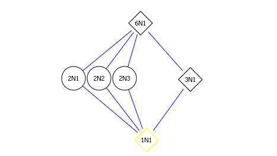
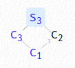
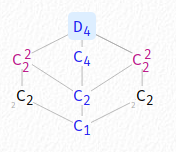
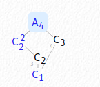
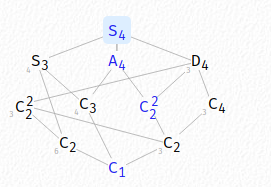
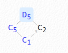
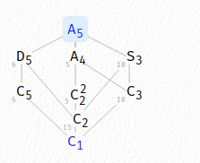
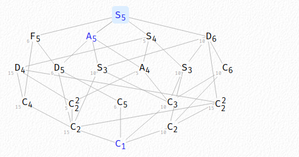
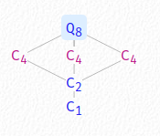

# Galois Theory

> Some useful exercises and solutions: <https://feog.github.io/chap4.pdf>

:::{.remark}
\envlist

- Given $x\da \sqrt{a} + \sqrt{b}$, to find a minimal polynomial consider $x^2, x^3,\cdots$ and try to get a linear combination.
  Then check if its irreducible.
  - General strategy here: try to isolate radicals on one side, then raise both sides to that power.

- Useful trick: for $x \da \sqrt{a} + \sqrt{b}$, compute $x,x^2, x^3, x^4$ and write them in terms of the basis $\ts{1, \sqrt{a}, \sqrt{b}, \sqrt{ab}}$.
 Then put this linear system into a matrix and invert:
 \[
   A\vector v = \vector c \da A \tv{1, \sqrt a, \sqrt b, \sqrt{ab} } = \tv{x, x^2, x^3, x^4}
 .\]
 Once you get $A\inv \vector x = \vector b$, read off the first row dotted against $\vector b$ to get a polynomial in $x$.
 - In general: take $\alpha$, sort out the degree $n$ of the extension $\QQ(\alpha)/\QQ$, and use the basis $1,\alpha,\alpha^2,\cdots, \alpha^{n-1}$.

- A trick to remember how degrees, indices and sizes match up: $L/K/F$ corresponds to $1/H/G$, and $[L:K] = [H:1] = \# H$, $[F:K] = [G:H]$, $[L:F] = [G:1] = \# G$, etc.

- Trick: once you find $\SF(f)/\QQ$, if any subextension is not normal over $\QQ$, then $G$ can not be abelian.
  - Example: $f(x) = x^3-2$ splits in $\QQ(\zeta_3, 2^{1\3})$ which is a non-normal extension $\QQ(2^{1\over 3})$, forcing $G= S_3$.

:::

:::{.remark}
Assume all extensions here are algebraic and finite.
Let $f\in \QQ[x]$ with $n \da \deg f$.
:::

:::{.theorem title="The Algorithm"}
\envlist

- Show your extension is Galois (normal and separable)
  - Show $f$ is irreducible and separable.
- Find the degree of the extension $d$, since then $\# G = d$.
  - Note that in general, $G\leq S_n$ and $n\neq d$, $\# G\neq n$.
- Obtain $n\divides d \da \# G \divides n!$ and $G\leq S_n$ is a transitive subgroup, list possibilities.
- Rule out cases or determine the group completely by finding cycle types.

:::

:::{.example title="Of using the algorithm"}
Consider $f(x) \da x^5-9x+3$, let $L\da \SF(f)/\QQ$.

- $f$ is irreducible:
  Apply Eisenstein with $p=3$.
- $f$ is separable:
  - $\QQ$ is perfect, so irreducible implies separable.
- $L$ is Galois:
  - $L/\QQ$ is a finite extension over a perfect field and thus automatically separable.
  - $L/\QQ$ is the splitting field of a separable polynomial, and thus normal.
- Since $L$ is Galois, $\# G = d \da [L: \QQ]$, so try to compute the degree by computing the splitting field (and its degree) explicitly.
  - Here: difficult! The roots are complicated.
- Since $L$ is Galois, $G\leq S_5$ is a transitive subgroup.
  Possibilities: 
  \[
  S_5, A_5 , F_5\cong C_5\rtimes C_4, D_5, C_5
  .\]
- Claim: $G = S_5$.
  - Reduce mod 2: $(x^2 + x + 1) (x^3 + x^2 + 1)$, yielding a cycle type $(2, 3)$.
  This rules out 
    - $C_5, D_5$ since $3\notdivides 5, 10$.
    - $A_5$, since this is an odd number of even length cycles.
    - $F_5$ since $3\notdivides 20$.
  - So this only leaves $S_5$.
:::

## Showing Extensions are Galois

:::{.fact}
Showing your polynomial is irreducible:

- Eisenstein (including shifting/inverting tricks, see section below)
- To show $f$ is irreducible, it suffices to show it is irreducible over any $\FF_p[x]$.
- A quadratic with no real roots is irreducible.

Showing your polynomial is separable:

- Show directly that $f$ has distinct roots in $\bar{k}$ by factoring it.
- For perfect fields, irreducibles are automatically separable.
- For $f$ irreducible, $f$ is separable iff $f'(x) \not\equiv 0$.

Showing your *extension* is separable:

- Splitting fields of separable polynomials are automatically separable *and* normal (and thus Galois).
- Algebraic extensions of a perfect field are automatically separable.
  - In particular, extensions over $\QQ$ or any $\ch k = 0$ are separable, and one only needs to show normality.
- (Hard) Show $[L:k]_s = [L:k]$.
- (Hard) Use that separability is a distinguished class.

Showing your extension is normal:

- Show that $L/k$ is finite and the splitting field of some separable polynomial.

Showing your extension $K/k$ is Galois: 

- Show normality and separability.
- Show $K$ is the splitting field of a separable polynomial ("separable splitting field")
- Automatic when $K/k$ is algebraic and a finite field, since it's the splitting field of $x^{p^n}-x$.

:::

## Irreducibility

:::{.proposition title="Consequence of Chebotarev density: checking irreducibility mod $p$"}
If $f\in \ZZ[x]$ is monic and there exists any prime $p$ such that $f\mod p$ is irreducible in $\FF_p[x]$, then $f$ irreducible in $\QQ[x]$.
:::

:::{.remark}
Finding a good prime for this is hard, but irreducibility can be checked exhaustively in small fields: just enumerate all polynomials and try polynomial long division.
:::

:::{.example title="using irreducibility mod $p$"}
$f(x) \da x^4 + x + 1$ is irreducible in $\ZZ[x]$, since checking manually in $\FF_2[x]$ shows that $0, 1$ are not roots $\mod 2$ so there is not linear factor.
Manually dividing $a_1 x^2 + a_2 x + a_3$ for $a_i\in 0, 1$ leaves remainders, so there are no quadratic factors.
:::

:::{.theorem title="Eisenstein's Criterion"}
If \[
f(x) = \sum_{i=0}^n \alpha_i x^i = a_nx^n + a_{n-1}x^{n-1} + \cdots + a_1 x + a_0 \in \QQ[x]
.\]
then $f$ will be irreducible over $\QQ[x]$ (and thus over $\ZZ[x]$ by Gauss' lemma) if
$\exists p$ such that

- $p$ divides every coefficient *except* $a_n$ and
- $p^2$ does not divide $a_0$.

Note that if $f$ is monic, it suffices to find any prime dividing all of the non-leading terms.
:::

:::{.remark title="Shifting"}
If $f(x+a)$ satisfies Eisenstein for any $p$, then $f$ is irreducible.
This is generally because $\Delta_{f(x)} = \Delta_{f(x + a)}$, and if $p$ works for Eisenstein on any $f$ then $p\divides \Delta_f$.
:::

:::{.example title="of shifting"}
Set $f(x) \da x^2+x+2$, then $f(x+3) = x^2 + 7x + 14$ and Eisenstein applies at $p=7$.

:::

:::{.remark title="Inverting"}
If $n \da \deg(f)$ and $x^n f(1/x)$ is irreducible, then $f$ is irreducible.
Note that this is just reversing the coefficients.
:::

:::{.example title="Of inverting"}
Take $f(x) \da 2x^5 -4x^2-3$, then for $g(x) \da 3x^5 +4x^2 - 2$ Eisenstein applies with $p=2$.
:::

:::{.remark title="mod $p$ reduction checks to find a good $p$ for Eisenstein"}
If $f(x) \equiv b(x+a)^n\mod p$ for some $p$ where $n\da \deg f$, then Eisenstein may work on $f(x-a)$ using the prime $p$.
Note the change in signs/reverse translation.

In other words, reduce mod $p$ for various $p$, and if any $p$ collapses $f$ to a power of a linear factor, use that $p$ for Eisenstein.
:::

:::{.example title="of mod $p$ reduction checks"}
Check
\[
f(x) \da x^3 + x^2 -48 x + 128 \leadsto f(x)\equiv (x-3)^3 \mod 5
,\]
and Eisenstein on $f(x+3)$ with $p=5$ works.
:::

## Computing

### Misc Useful Facts

Once you've confirmed that you have a Galois extension, some useful tricks are available:

:::{.fact title="Degrees of extensions"}
\envlist

- The size $\# G(f)$ is the degree $[\SF(f) : \QQ]$.
- The degree of $[\QQ(\alpha): \QQ]$ is the degree of $\min_{\alpha}(x)$, or any irreducible polynomial with $\alpha$ as a root.
  - Note that $\QQ(\alpha)\neq \SF(f)$ in general.
- If $f=\prod(x-r_i)$, then $\SF(f)$ contains every $\QQ(r_i)$.
  Thus 
  \[
[\QQ(r_i) : \QQ] = d \implies
d\divides [\SF(f): \QQ]
  .\]
  - Note that $d\neq \deg f$ in general!

:::

:::{.fact title="Random tricks"}
\envlist

- Reminder of rational roots test: for $f(x) = a_nx^n + \cdots + a_0$, rational roots are of the form $p_0/p_n$ where $p_i \divides a_i$.
- $\Gal(L/k)$ permutes the roots of any irreducible polynomial in $k[x]$.
  In particular, if $L=\SF(f)$ with $f$ reducible, then $G$ must send roots of irreducible factors to conjugates of the same factor.
- $\QQ(\zeta_a) = \QQ(\zeta_b) \iff a = 2b$ and $b$ is odd.
- If there are $k$ complex conjugate pairs (accounting for $2k$ roots) then $G$ contains a cycle $(1,2)(3,4)\cdots(2k-1,2k)$.
- If all exponents are even, $f(r) = 0 \iff f(-r) = 0$, so roots occur in pairs $(r, -r)$.
  - Pairs are preserved by $G$ in the sense that every $\sigma\in G$ satisfies either $\ts{r, -r}\mapsto \ts{r, -r}$ or $\ts{r, -r} \mapsto \ts{s, -s}$ for another pair.
  - Example: $x^4-5x^2+5$ has two pairs.
:::

### Transitive Subgroups

:::{.proposition title="Galois groups are transitive subgroups"}
If $f\in k[x]$ is irreducible, then $\Gal(\SF(f)/k) \leq S_n$ is **always** a transitive subgroup, i.e. it acts transitively on the set of roots.
:::

:::{.corollary}
\[
n\divides \# \Gal(K/\QQ) \divides n!
.\]

Why: $\Gal(K/\QQ) \cong G\leq S_n$, and Lagrange yields $\#H \divides n!$.
Note that $G$ acts on $R$ the set of $n$ roots, and since it acts transitively, $R$ is a single orbit.
By orbit stabilizer, $\OO_r \cong G/\Stab_G(r)$ and thus
\[
\# G = \# \OO_r \cdot \# \Stab_G(r)
,\]
so both terms on the right-hand side patently divide $\# G$
:::

:::{.fact title="Table of transitive subgroups of $S_n$ for qual-sized $n$"}
Write $C_n$ for the cyclic group of order $n$.
The following are transitive subgroups of $S_n$ for small $n$, where blue groups are nonabelian:

| $n \text{ in }S_n$ | Transitive Subgroups        | Sizes |
|--------------|-----------------------------------|-------|
| 1            | 1                                 |1      |
| 2            | $S_2 \cong C_2$                   |2      |
| 3            | ${\color{blue}S_3\cong D_3}, A_3 \cong C_3$              |6,3    |
| 4            | ${\color{blue}S_4, A_4, D_4}, C_4, C_2^2$       |24,12,8,4,4 |
| 5            | ${\color{blue}S_5, A_5 , F_5\cong C_5\semidirect C_4, D_5}, C_5$ | 120,60,20,10,5 |

Other useful facts:

- $\# D_n = 2n$, $\#S_n = n!, \# A_n = n!/2$, and $\# F_5 = 20$.
- For degree 8 extensions (which sometimes arise as quadratic extensions of degree 4 extensions): 
  $Q_8 \leq S_8$ is transitive and nonabelian of order 8, and has presentation
\[
Q_{8}=\left\langle\alpha, \beta \mid \alpha^{4}=\beta^{4}=1, \alpha \beta \alpha=\beta, \beta^{2}=\alpha^{2}\right\rangle
.\]
  Note that $Q_8 \leq S_8$ but $Q_8\not\leq S_{<7}$.

- $F_5$ has presentation 
\[
\gens{a,b \st a^5, b^4, bab\inv = a^2}
.\]

:::

### Distinguishing Groups

> Material borrowed from <https://kconrad.math.uconn.edu/blurbs/galoistheory/galoisSnAn.pdf>

:::{.remark title="Distinguishing groups"}
\envlist
By $n$ in $G\leq S_n$:

$n=4$:

- $C_2^2$ vs $C_4$: 

  - $C_2^2$ has two elements of order 2, the latter does not.
    So a cycle of type $(2, 2)$ forces $C_2^2$.

- $S_4$ vs $A_4$: 

  - $S_4$ contains a Sylow-2 subgroup of order 8 (which divides $4! = 24$) but $A_4$ does not since it's of order $4!/2 = 12$ and $8\not\divides 12$.
  - If $G$ contains a transposition, then $G= S_4$ or $D_4$, since $A_4$ doesn't contain a transposition.

- $D_4$ vs $Q_8$:

- 5 roots:
  - $S_5$ is generated by any transposition and any 5-cycle.
  - $S_n$ is generated by $(a,b)$ and $(1,2,\cdots,n) \iff \gcd(b-a, n) = 1$.
    In particular, the $(1, 2)$ and any length $n$ cycle works.

:::

:::{.fact title="Recognizing cycle types"}
The following are the cycle types that can occur:

- 

:::

:::{.proposition title="Recognizing $A_n$ or $S_n$"}
Useful fact: if $G \leq S_n$ for $n$ prime contains a 2-cycle and a $p\dash$cycle, then $G\cong S_n$.
Note that for $n$ not prime, a transposition and an $n\dash$cycle isn't enough, since one needs the specific $n\dash$cycle $(1,2,\cdots,n)$ in general.

If $n>2$ and $G$ contains a 3-cycle and an $n\dash$cycle, then $G = A_n$ or $S_n$.
Note that by Orbit-Stabilizer $n\divides \# G$, and if $n$ is prime then by Cauchy there is an $n\dash$cycle (but this is not always the case).
In fact, it suffices to find a $k\dash$cycle for any $k\geq n/2$, which can be found by reducing mod $p$ and examining cycle types.

Moreover, if $G$ contains a 2-cycle (transposition), then $G = S_n$.
:::

:::{.remark title="Other useful facts to reason about $A_n$"}
\envlist

- Alternating groups have even numbers of cycles of even length.
- Elements in $A_n$ either have cycle type with an even number of even lengths (including 0).
- $A_4$ does not contain a subgroup isomorphic to $C_2^2$.
:::

:::{.fact}
Some useful generating sets: see <https://kconrad.math.uconn.edu/blurbs/grouptheory/genset.pdf>

:::

### Density: Cycle Types

:::{.proposition title="A consequence of Chebotarev Density: reading cycles from reduction mod $p$"}
For any $p\not\divides \Delta$, writing $f(x) = \prod_{i=1}^m f_i(x) \mod p$, $G$ contains a cycle of type $(\deg f_1, \deg f_2, \cdots, \deg f_m)$.
Equivalently, if $\tilde f \da f\mod p$, then $G(\tilde f) \leq G(f)$ is a subgroup.
:::

:::{.warnings}
Warning: this only works if the $f_i$ are distinct, i.e. there are no repeated factors in the factorization $\mod p$.
:::

:::{.example title="Ruling out choices by existence of cycle types"}
You can use this to rule out types of groups using Lagrange's theorem: if you find a cycle of length $m$ which doesn't divide $\# H$, then $H$ isn't a possibility!
Example: $\deg f=5$ with exactly one conjugate pair of roots, then there is a 5-cycle $\sigma \da (1,2,3,4,5)$ because $5\divides \# G$ and a 2-cycle $\tau \da (1,2)$ coming from complex conjugation.
There check that $a_1 \da \sigma \tau \sigma\inv = (1, 5)$ and $a_1 \tau = (1, 5, 2)$ is a 3-cycle, so $3\divides \# G$.
This rules out $F_5$ which is of order 20, since $3\not\divides 20$.
:::

:::{.example title="Finding cycle types by reducing mod $p$"}
Consider $f(x) = x^5+2x+1$.
Reducing to $\FF_3$ yields no roots, so $f$ is irreducible, and moreover $G(f)$ contains a 5-cycle.
Reducing to $\FF_7$ splits $f$ as $(x+2)(x+3)(x^3+2x^2+5x+5)$, so $G(f)$ contains a 3-cycle.

:::

:::{.example title="of using density"}
Take $f(x) \da x^6 + x^4 + x + 3$, then

\[
f(x) &\equiv (x+1)(x^2 + \cdots)(x^3 + \cdots) \mod 2 &\implies \text{type } (1,2,3) \in G \\
f(x) &\equiv x(x+2)(x^4 + \cdots) \mod 3 &\implies \text{type } (1,1,4) \in G \\
.\]
:::

:::{.example title="of using density"}
Take $f(x) \da x^4+x+1$, then
\[
f(x) &\equiv x^4+x+1 \mod 2 &\implies \text{type } (4) \\
f(x) &\equiv (x-1)(x^3+x^2+x-1) \mod 3 &\implies \text{type } (1,3) \\
.\]

So $G$ contains a 4-cycle and a 3-cycle.
This is enough to show $G = A_4$.

:::

:::{.example title="?"}
Let $f(x) = x^6 + x^4 + x + 3$, reduce $\mod 11$ to get a cycle type $(1, 5)$.
So $G\leq S_6$ contains a 5-cycle, where $5>n/2 \da 6/2=3$, meaning $G = A_n, S_n$.
Now reduce $\mod p$ for various $p$ to look for a cycle type of the form $(2,1,1,\cdots)$ or $(3,1,1,\cdots)$.
This is hard, but $f\mod 2$ has type $(1,2,3)$ and $\qty{ (a,b)(c,d,e) }^3 = (a, b)$, so $G$ contains a transposition and thus $G = S_n = S_6$.
:::

:::{.example title="?"}
Let $f(x) = x^7-x-1$, reduce $\mod 2$ to get a 7-cycle, and $\mod 3$ to get $(2, 5)$.
Then use $(2, 5)^5 = (2,1,1,\cdots)$ to get a transposition, So $G = S_7$.
:::

:::{.example title="?"}
Let $f(x) \da x^7-7x+10$.
Reducing $\mod 3$ yields $(2, 5)$ and $(2, 5)^5 = (2, \cdots)$ and have a transposition.
Since $5>n/2=7/2$, $G = S_7$.

:::

### Discriminants

:::{.definition title="Discriminant"}
For $f = \sum a_k x^k$ monic,
\[
\Delta_f = \prod_{i < j} (r_i - r_j)^2
.\]

Note that $\Delta = 0$ when $f$ has a repeated root.

For cubics, 

- $\Delta > 0 \implies 3$ distinct real roots
- $\Delta < 0 \implies 1$ real root and 1 conjugate pair.
:::

:::{.example title="How to actually write this product"}
For $f$ a cubic:
\[
\Delta_f 
&= (r_1 - r_2)^2 (r_1 - r_3 )^2 \\
&\quad (r_2 - r_3)^2
.\]

For $f$ a quartic:
\[
\Delta_f 
&= (r_1 - r_2)^2(r_1 - r_3)^2 (r_1 - r_4)^2 \\
& \quad (r_2 - r_3)^2 (r_2 - r_4)^2 \\
& \quad (r_3 - r_4)^2
.\]

In general, for a degree $n$ polynomial this will have $n(n-1)/2$ terms.
:::

:::{.remark}
In general, 
\[
G \subseteq A_n \iff \sqrt{\Delta} \in k
,\]
i.e. $\Delta$ is a perfect square in the ground field $k$.

Some special cases of discriminant values:

- Quadratics: \[
f(x) = ax^2 + bx + c
\implies
\Delta = b^2-4ac
.\]
- Cubics:
  - General:
\[
f(x) = ax^3 + bx^2 + cx + d \implies \Delta = b²c² - 4ac³ - 4b³d - 27a²d² + 18abc
.\]
    - Note that you can depress a general cubic by substituting $t=x - {b\over 3a}$, yielding
\[
f(t) = t³ + pt + q \implies \Delta = -4p³-27q²
.\]

:::

:::{.remark}
Some useful facts:

- $\Delta = 0 \iff f$ has a repeated root.
- $G\injects A_n \iff \Delta$ is a perfect square in $k$.

:::

## Worked Examples 

:::{.fact}
\envlist

:::

:::{.example title="Indirect: exactly one conjugate pair of roots"}
If $\deg f = 5$ with exactly 3 real roots and one non-real complex conjugate pair, then $G(f) = S_5$.
$G$ contains a transposition, namely complex conjugation on the conjugate pair.
This already implies $G\neq A_5$, since a transposition is an odd number of even cycles.

The claim is that $G$ contains an element of order 5, i.e. a 5-cycle, which is enough to generate $S_5$.
This follows because 

- Galois acts transitively, so there is a length 5 orbit.
- By Orbit-Stabilizer, 5 divides $\# G$.
- By Sylow, there is an element of order 5.

So $G = S_5$.
:::

### Quadratics

:::{.example title="Classifying quadratics"}
Every degree 2 extension $L/k$ is Galois, except possibly in characteristic 2: 

- If \( \alpha\in L \sm k\) then \( \min_{\alpha}(x) \in L[x] \) must split in $L[x]$, so $L$ is automatically a splitting field.
  - Why? \( \alpha\in L \implies \min_{\alpha}(x) = (x- \alpha)g(x) \) which forces \( \deg(g) = 1 \).
- If $\ch(k) \neq 2$, then $L$ is separable since
\[
\min_{ \alpha}(x)' = 2x + \cdots \not\equiv 0
,\] 
:::

:::{.remark}
One can complete the square for quadratics:
\[
f(x)=x^{2}+\alpha x+\beta=\left(x-\frac{\alpha}{2}\right)^{2}+\beta-\frac{\alpha^{2}}{4} \text { . }
.\]

Thus it suffices to consider quadratics of the form $x^2+a$.
:::

:::{.example title="Quadratics"}
\envlist

- $G(x^2-m) = C_2$ for $m$ not a perfect square.
  - $x^2-m = (x+\sqrt{m})(x-\sqrt{m})$, so the splitting field is $\QQ(\sqrt{m})$ of degree 2.
  - Since $G\leq S_2$ and has order 2, $G= S_2 \cong C_2$.
  - Concretely, take $m=2$, then $G = \ts{\id, \tau}$ where $\tau: \sqrt{2} \mapsto -\sqrt{2}$, and correspondingly $a+b\sqrt{2} \mapsto a-b\sqrt{2}$.

- $G((x^2-2)(x^2-3)) = C_2\cross C_2$.
  - Since $G$ must permute irreducible factors, labeling the roots $r_1, r_2 = \pm \sqrt{2}$ and $r_3, r_4 = \pm \sqrt{3}$, we have 
  \[
G \subseteq \gens{(1, 2), (3, 4)} = \ts{\id, (1,2), (3,4), (1,2)(3,4)} \cong C_2\cross C_2
  .\]
  - $\# G = 4$, taking the tower $\QQ(\sqrt 2, \sqrt 3) / \QQ(\sqrt 2)/ \QQ$ and noting $\sqrt 3 \not\in \QQ(\sqrt 2)$ which makes each step degree 2.
  So this forces $G \cong C_2\cross C_2$.
:::

### Cubics

:::{.remark}
Tricks/reminders:

- Try the rational roots test to check irreducibility, since reducible implies there's a linear factor.
- Nice situation: one real and two complex roots.
  Try Calculus and MVT to reason about real roots.
  This immediately yields $S_3$.
- Otherwise, 3 real roots (or no easy way to check root types).
  Try discriminant classification: put in the form $t^3+pt+q$, potentially using $t=x-b/3a$, then $\Delta = -4p^3-27q^2$.
:::

:::{.remark title="Easy cycles in odd/prime degrees with basic Calculus"}
If $n \da \deg f$ is odd, then $f$ has at least one real root.
If $f$ has two non-real roots, then $G$ contains a transposition.
If $n$ is prime, then $G$ contains an $n\dash$cycle (by transitivity and Cauchy), forcing $G = S_n$.
:::

:::{.example title="Of using easy cycles to get $S_3$"}
Let $f(x) = x^3-2$.

Then $f'(x) = 3x^2$, so $f$ is monotone increasing.
By the MVT, checking $f(-2)<0$ and $f(2)>0$, $f$ has a single real root in $[-2, 2]$.
The other two must be a complex conjugate pair.

Alternatively, just factor the darn thing: $f(x) = (x-\omega)(x-\zeta_3\omega)(x-\zeta_3^2\omega)$ where $\omega \da 2^{1\over 3}$ and $\zeta_3^3=1$.

So $G(f)$ contains a transposition, and since $\deg f = 3$ is prime, $G$ contains a 3-cycle and $G(f) = S_3$.
:::

:::{.example title="Of using easy cycles to get $S_3$"}
Let $f(x) = x^3-4x+5$.

Then $f'(x) = 3x^2-4 = 0$ when $x = \pm \sqrt{4/3}$.
Checking $f''(x) = 6x$ yields a max at $-\sqrt{4/3}$ and a min at $\sqrt{4/3}$.
Checking 
\[
f(4/3) = (4/3)^3-4(4/3)+5 = (64/27)-(16/3)+5 = 55/27 > 0
,\]
so knowing the general shape of a cubic, there is exactly one real root, somewhere in $(-\infty ,-\sqrt{4/3})$.
So $G(f) = S_3$.
:::

:::{.proposition title="Classification for cubics"}
Away from $\ch k = 2$, Galois groups of cubics are entirely determined by discriminants:

**There are only two possibilities**: $S_3$ or $A_3 \cong C_3$.

- If $\sqrt{\Delta}\in k$, then $G\cong A_3$.
- Otherwise, $G\cong S_3$.
:::

:::{.example title="of discriminants of cubics"}

:::

:::{.example title="Cubics (manually)"}
\envlist

- $G(x^3+x+1) = S_3$:
  - Irreducible because it has no rational roots (by the rational roots test)
  - $f'(x) = 3x^2+1>0$ so $f$ increases everywhere and can only have one real root $r$, so $\QQ(r)/\QQ = \deg f = 3$.
  - The other roots are a non-real conjugate pair $w, \bar{w}$, so $\QQ(w, r)/\QQ(r) = \deg f(x)/(x-r) = 2$.
  - So $[\SF(f): \QQ] = 6$, and the only transitive subgroup of order 6 in $S_3$ is $S_3$ itself.

:::

:::{.example title="Cubics (using $\Delta$)"}
\envlist

- $G(x^3-x+1) = S_3$:
  - This is already a depressed cubic, so use $\Delta = -4 (-1)^3 - 27(1) = -23$.
  - $\Delta = -23 \not\in \QQ^2$, so $G\not\leq A_4$ which forces $G = S_4$.

- $G(x^3-3x+1) = A_3$:
  - This is already a depressed cubic, so $\Delta = -4(-3)^3 + 27(1) = -3(27) = 81$.
  - $\Delta = 81 \in \QQ^2$, so $G\leq A_3$.
:::

### Quartics

:::{.definition title="Resolvent of a quartic"}
If 
\[
f(x)=x^{4}+a_{3} x^{3}+a_{2} x^{2}+a_{1} x+a_{0}
\]
then define the **resolvent** of $f$ by
\[
R_{4}(t)=t^{3}-a_{2} t^{2}+\left(a_{1} a_{3}-4 a_{0}\right) t+4 a_{0} a_{2}-a_{1}^{2}-a_{0} a_{3}{ }^{2}
.\]

Alternatively, it can be defined in terms of the roots $r_i$:
\[
\left(x-\left(r_{1} r_{2}+r_{3} r_{4}\right)\right)\left(x-\left(r_{1} r_{3}+r_{2} r_{4}\right)\right)\left(x-\left(r_{1} r_{4}+r_{2} r_{3}\right)\right)
.\]

For depressed quartics,
\[
f(X)=X^{4}+c X+d \Longrightarrow R_{3}(X)=X^{3}-4 d X-c^{2}
.\]

:::

:::{.proposition title="Classification for quartics"}
The Galois groups of irreducible quartics can be determined using discriminants, resolvents, and checking irreducibility:

- If $\sqrt{\Delta}\in \QQ$, then $G = A_4, C_2^2$.
  - If resolvent is irreducible: $A_4$.
    Otherwise $C_2^2$.
- If $\sqrt{\Delta}\not\in \QQ$ then $G = S_4, D_4, C_4$.
  - Is resolvent is irreducible: $S_4$.
    Otherwise, $D_4$ or $C_4$, argue by cycle types (or if $f$ is irreducible in $\QQ(\sqrt{\Delta})$, $D_4$).
- Summary:
  

A flow chart summarizing the full process:

See Hungerford 273 for classification.
:::

:::{.example title="Quartics using resolvent cubics"}
\envlist

- $G(x^4-x-1) = S_4$:
  - Check $f$ is irreducible in $\FF_2[x]$.
  - $R_3(t) = t^4+4t-1$
- $G(x^4+8x+12) = A_4$:
  - The resolvent cubic is $x^3-48x+64$, which has no rational roots.
  - Now check
  \[
  \Delta = (-27)(8^4) + (256)(12^3)=(81)(2^{12}) \in \QQ^2
  ,\] 
  so $G=A_4$.

- $G(x^4+3x+3) = D_4$:
  - The resolvent cubic is $g(x) = x^3-12x+9=(x-3)(x^2+3x-3)$ and $\Delta = 3^3 5^2 7$, so $G = C_4, D_4$.
  - Check $D \da \Delta_g = 21$.
  - Check if $g$ is irreducible in $\QQ(\sqrt{21})$: suppose $x^{4}+3 x+3=\left(x^{2}+a x+b\right)\left(x^{2}-a x+c\right)$, then $-a^{2}+b+c=0, a(c-b)=0, b c=3$
    - From $a(c-b)=0$, if $a=0$ then $b=-c$ and $c^2=3$, but $\sqrt{-3}\not\in \QQ(D)$.
      Otherwise $c=b$ and $c^2 = 3$, but $\sqrt{3}\not\in\QQ(D)$.
  - So $G= D_4$.

:::

### Cyclotomic Fields

:::{.example title="Cyclotomic Fields"}
$\Gal(\QQ(\zeta_n)/\QQ) \cong (\ZZ/n)\units$ and is generated by maps of the form $\zeta_n \mapsto \zeta_n^j$ where $(j, n) = 1$.
I.e., the following map is an isomorphism:
\[
(\ZZ/n)\units &\to \Gal(\QQ(\zeta_n), \QQ) \\
[r] &\mapsto (\phi_r: \zeta_n \mapsto \zeta_n^r )
\]
:::

:::{.fact}
The splitting field of $x^p-1$ is $\QQ(\zeta_p)$, and the splitting field of $x^p+1$ is $\QQ(\zeta_{2p})$.

- $x^p - a$ factors as $\prod_{k=0}^{p-1} (x- \zeta_p^k \omega)$ where $\omega \da a^{1\over p}$, so this splits in $\QQ(\zeta_p, \omega)$ which has degree 
\[
\phi(p) \cdot \deg \min_\omega(x) = (p-1)p
.\]
  - This yields two cyclic subgroups $C_{p-1}, C_p$ where $C_p\normal G$, and thus some semidirect product $C_{p-1} \actson C_{p}$.
- $x^p+a$ factors as $\prod_{k=0}^{p-1}(x - \zeta_p^k \omega )$ for $\omega \da (-a)^{1\over p}$.

Also use that splitting fields over $\QQ$ are always normal, so it suffices to check that $f$ is separable and irreducible to show extensions are Galois.
:::

:::{.example title="$x^n-a$"}
Degree 3:

- $G(x^3-2): S_3$
  - The roots are $\zeta_3^k \omega$ for $0\leq k \leq 3$, $\omega \da 2^{1\over 3}$.
  - The splitting field is $\QQ(\omega, \zeta_3)$ which has degree $3\phi(3) =6$.
  - The possibilities are $G = A_3\cong C_3, S_3$, and order 6 forces $G=S_3$. 
  - Useful alternative:
    - Note that there is exactly one real root and one conjugate pair, so $G$ contains a transposition $(23)$.
    - There is a 3-cycle $(123)$ given by fixing $\omega$ and sending $\zeta_3 \mapsto \zeta_3\omega$, and this is enough to generate $D_3 \cong S_3$.

Degree 4:

- $G(x^4-1) = C_2$:
  - The roots are $\zeta_4^k$ for $0\leq k \leq 3$.
  - The splitting field is $\QQ(\zeta_4) = \QQ(i)$ which has degree $\phi(4) = 2$.
  - But this is not a reducible polynomial!
    Use that that Galois is defined as $\Aut(\SF(f) / \QQ)$ and quadratic extensions are Galois.

- $G(x^4-2) = D_4$: 
  - The roots are $\zeta_4^k \omega$ for $0\leq k \leq 3$, where $\zeta_4 = i, \omega = 2^{1\over 4}$.
    - Explicitly, $r_i \in \ts{\omega, i\omega, -\omega, -i\omega}$
  - The splitting field is $\QQ(\omega, \zeta_4)$, which has degree $4\phi(4) = 8$ since $\min_{\zeta_4} = x^2+1$, which is still irreducible over $\QQ(\omega) \subseteq \RR$.
  - $D_4 \leq S_4$ is the only transitive subgroup of order 8.
  - Useful note on bounding the size:
    - Any $\sigma \in G$ must preserves roots of $x^4-2$ but also $x^2+1$.
      So there are at most 4 possibilities for $\sigma(\omega)$, and at most 2 for $\sigma(\zeta_4)$, so $\# G \leq 8$ and $G\neq S_4$.
  - Explicitly, there is a 4-cycle $\sigma = (1,2,3,4)$ generated by $\omega \mapsto \zeta_4 \omega$ and a 2-cycle $(2,4)$ given by complex conjugation, and this generates $D_4$ since $\gcd(4-2, 4) \neq 1$.
    - Why this is a 4-cycle: check $\sigma(i)=i$, and:
  \[
  \sigma(r_1) &= r_2 = ir_1 \\
  \sigma(r_2) &= \sigma(ir_1) = ir_2 = r_3 \\
  \sigma(r_3) &= \sigma(ir_2) = ir_3 = i(ir_2) = -r_2 = r_4
    .\]

General cases:

- $G(x^p-1) = C_p\units$:
  - ?

:::

:::{.example title="$x^n+a$"}
\envlist

- $G(x^4+1) = C_2^2$:
  - This is irreducible because it is irreducible (by having no roots) mod $3$.
  - The roots are $\zeta_8^k$ for $k=1,3,5,7$ coprime to 8, since this is $\Phi_8(x)$.
  - The splitting field is $\QQ(\zeta_8) = \QQ(i, \sqrt 2)$, noting that $\zeta_8 = e^{2\pi i \over 8} = e^{\pi i \over 4} = \cos(\pi/4) + i\sin(\pi/4) = (1/2)(\sqrt 2 + i \sqrt{2})$ so we have containment and both are degree $\phi(8)=4$ extensions.
  - This restricts to $C_4, C_2^2$.
  - Reduce $\mod 5$ to get $(x^2+2)(x^2+2)$ of cycle type $(2, 2)$, forcing $C_2^2$.

- $G(x^4+2) = D_4$: 
  - The roots are $\zeta_8^k \omega$ for $\omega = 2^{1\over 4}, k = 1,3,5,7$ coprime to 8. 
  - The splitting field is $\QQ(\zeta_8, \omega) = \QQ(\zeta_4, \omega)$.

- $G(x^4+3) = D_4$:
  - The roots are $\zeta_8^k, \omega$ for $\omega = 3^{1\over 4}, k=1,3,5,7$ coprime to 8.
  - The splitting field is $\QQ(\omega, \zeta_8)$ of degree $\phi(8) = 8$

:::

### Finite Fields

:::{.example title="Finite Fields"}
$\Gal(\FF_{p^n}/\FF_p) \cong \ZZ/ \gens{ n }$, a cyclic group generated by powers of the Frobenius automorphism:
\[
\varphi_p: \FF_{p^n} &\to \FF_{p^n} \\
x &\mapsto x^p
\]

> See D&F p.566 example 7.

:::

## Lattices

:::{.fact title="Common lattices of subgroups"}

$n=2$:

- $D_2 \cong 1$
- $A_2 \cong 1$
- $S_2 \cong C_2$ 

$n=3$:

- $D_3 \cong S_3$
- $A_3 \cong C_3$.
- 
- 

$n=4$:

- 
- 
- 

$n=5$:

- 
- 
- 

Misc:

- 

:::
