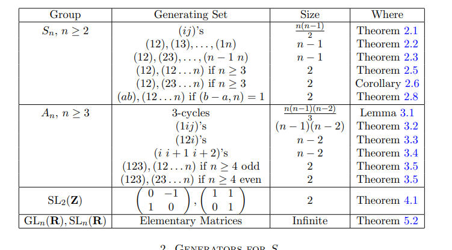
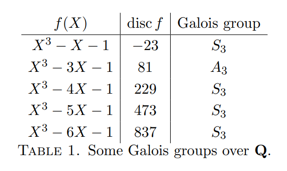
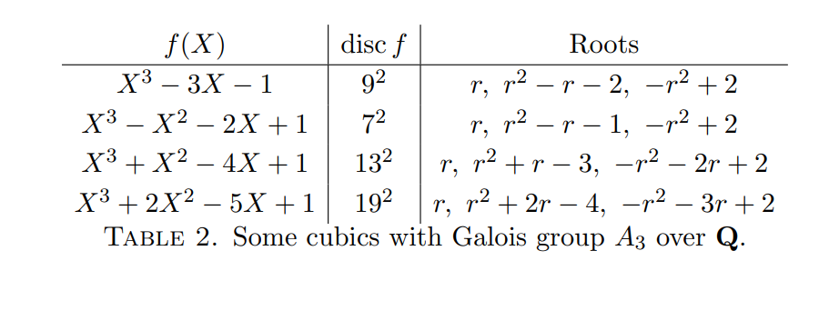
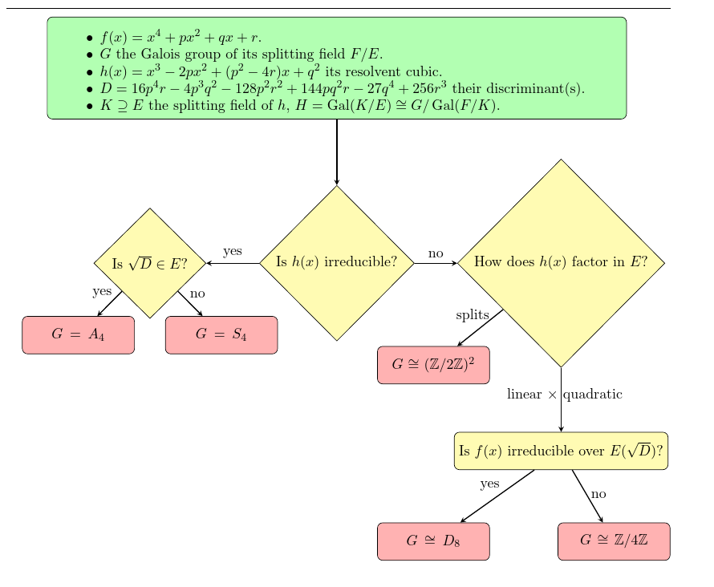
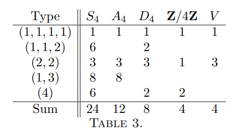
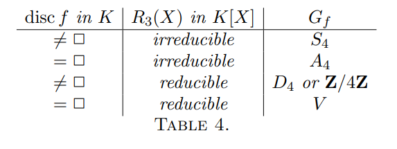

# Galois Theory: Computations

## Useful Facts

:::{.proposition}
If $L/k$ is algebraic, then $\Aut(L/k)$ permutes the roots of any irreducible polynomial.
:::

:::{.fact title="Random tricks"}
Some useful tricks:

- To show $f$ is irreducible, it suffices to show it is irreducible over any $\FF_p[x]$.
- A quadratic with no real roots is irreducible.
- The degree of $[\QQ(\alpha): \QQ]$ is the degree of $\min_{\alpha}(x)$, or any irreducible polynomial with $\alpha$ as a root.
- The size $\# G(f)$ is the degree $[\SF(f) : \QQ]$.
- $\QQ(\zeta_a) = \QQ(\zeta_b) \iff a = 3b$ and $b$ is odd.
- If $f=\prod(x-r_i)$, then $\SF(f)$ contains every $\QQ(r_i)$.
  Thus if $[\QQ(r_i) : \QQ] = d$, then $d$ divides $[\SF(f): \QQ]$.
- If all exponents are even, $f(r) = 0 \iff f(-r) = 0$, so roots occur in pairs $(r, -r)$.
  - Pairs are preserved by $G$ in the sense that every $\sigma\in G$ satisfies either $\ts{r, -r}\mapsto \ts{r, -r}$ or $\ts{r, -r} \mapsto \ts{s, -s}$ for another pair.
  - Example: $x^4-5x^2+5$ has two pairs.
- If there are $k$ complex conjugate pairs (accounting for $2k$ roots) then $G$ contains a cycle $(1,2)(3,4)\cdots(2k-1,2k)$.
- $G \subseteq A_n \iff \Delta \da \prod_{i < j} (r_i - r_j)^2$ is a perfect square in the ground field.
  - Elements in $A_n$ either have cycle type with an even number of even lengths (including 0).
  - $A_4$ does not contain a subgroup isomorphic to $\ZZ/2^2$.

- $G \leq A_n \iff \sqrt{\Delta} \in \QQ$.
  
- Recognizing cycle types:
  - $\ZZ/4: (2), (4)$.
  - $\ZZ/2^2: (2, 2)$.
  - $D_4: (4), (2,2), (2,1,1)$
  -$A_4: (2,2), (3,1)$.
:::

:::{.remark title="Distinguishing groups"}
\envlist

- Order 4:
  - Distinguishing $C_2^2$ from $C_4$: the former has two elements of order 2, the latter does not.
    So seeing a cycle of type $(2, 2)$ forces $C_2^2$.
- Order 8:
  - $S_4$ contains a Sylow-2 subgroup of order 8 (which divides $4! = 24$) but $A_4$ does not since it's of order $4!/2 = 12$ and $8\not\divides 12$.
- 5 roots:
  - $S_5$ is generated by any transposition and any 5-cycle.
  - $S_n$ is generated by $(a,b)$ and $(1,2,\cdots,n) \iff \gcd(b-a, n) = 1$.
    In particular, the $(1, 2)$ and any length $n$ cycle works.
:::

:::{.fact}
Some useful generating sets: see <https://kconrad.math.uconn.edu/blurbs/grouptheory/genset.pdf>

:::

## Transitive Subgroups

:::{.proposition title="Galois groups are transitive subgroups"}
If $f\in k[x]$ is irreducible, then $\Gal(\SF(f)/k) \leq S_n$ is a transitive subgroup, i.e. it acts transitively on the set of roots.
:::

:::{.corollary}
\[
n\divides \# \Gal(K/\QQ) \divides n!
.\]

Why: $\Gal(K/\QQ) \cong G\leq S_n$, and Lagrange yields $\#H \divides n!$.
$G$ acts on $R$ the set of $n$ roots, and since it acts transitively, $R$ is a single orbit.
The size of an orbit divides the size of the group by orbit stabilizer, since $\OO_r \cong G/\Stab_G(r)$, and the right-hand side has a size that must divide $\# G$.
:::

:::{.fact}
Write $C_n$ for the cyclic group of order $n$.
Transitive subgroups of $S_n$ for small $n$:

| $n \text{ in }S_n$ | Transitive Subgroups        |
|--------------|-----------------------------------|
| 1            | 1                                 |
| 2            | $S_2 \cong C_2$                   |
| 3            | $S_3, A_3 \cong C_3$              |
| 4            | $S_4, A_4, D_4, C_4, C_2^2$       |
| 5            | $S_5, A_5, F_5, D_5, C_5$         |

- Nonabelian groups of order 8: $D_4, Q_8$.

:::

> Material borrowed from <https://kconrad.math.uconn.edu/blurbs/galoistheory/galoisSnAn.pdf>

:::{.proposition title="Recognizing groups from cycles"}
\envlist

- For $n\geq 2$, if a transitive $G\leq S_n$ contains a transposition $(i, i+1)$ and a cycle of prime length $p> n/2$, then $G= S_n$.
- For $n\geq 3$, if a transitive $G\leq S_n$ contains a **three cycle** and a $p\dash$cycle with $p>n/2$ then $G=A_n, S_n$.

:::

:::{.example title="?"}
Let $f(x) = x^6 + x^4 + x + 3$, reduce $\mod 11$ to get a cycle type $(1, 5)$.
So $G\leq S_6$ contains a 5-cycle, where $5>n/2 \da 6/2=3$, meaning $G = A_n, S_n$.
Now reduce $\mod p$ for various $p$ to look for a cycle type of the form $(2,1,1,\cdots)$ or $(3,1,1,\cdots)$.
This is hard, but $f\mod 2$ has type $(1,2,3)$ and $\qty{ (a,b)(c,d,e) }^3 = (a, b)$, so $G$ contains a transposition and thus $G = S_n = S_6$.
:::

:::{.example title="?"}
Let $f(x) = x^7-x-1$, reduce $\mod 2$ to get a 7-cycle, and $\mod 3$ to get $(2, 5)$.
Then use $(2, 5)^5 = (2,1,1,\cdots)$ to get a transposition, So $G = S_7$.
:::

:::{.example title="?"}
Let $f(x) \da x^7-7x+10$.
Reducing $\mod 3$ yields $(2, 5)$ and $(2, 5)^5 = (2, \cdots)$ and have a transposition.
Since $5>n/2=7/2$, $G = S_7$.

:::

### Irreducibility

:::{.theorem title="Eisenstein's Criterion"}
If $f(x) = \sum_{i=0}^n \alpha_i x^i \in \QQ[x]$ and $\exists p$ such that

- $p$ divides every coefficient *except* $a_n$ and
- $p^2$ does not divide $a_0$,

then $f$ is irreducible over $\QQ[x]$, and by Gauss' lemma, over $\ZZ[x]$.
:::

:::{.remark}
Shifting: if $f(x+a)$ satisfies Eisenstein for any $p$, then $f$ is irreducible.
This is generally because $\Delta_{f(x)} = \Delta_{f(x + a)}$, and if $p$ works for Eisenstein on any $f$ then $p\divides \Delta_f$.

A useful trick: for any such $p$, if $f(x) \equiv b(x+a)^n\mod p$ for $n\da \deg f$, then Eisenstein may work on $f(x-a)$ using the prime $p$
:::

:::{.example title="of shifting"}
Set $f(x) \da x^2+x+2$, then $f(x+3) = x^2 + 7x + 14$ and Eisenstein applies at $p=7$.

:::

:::{.remark}
Inverting: if $n \da \deg(f)$ and $x^n f(1/x)$ is irreducible, then $f$ is irreducible.
Note that this is just reversing the coefficients.
:::

:::{.example title="Of inverting"}
Take $f(x) \da 2x^5 -4x^2-3$, then for $g(x) \da 3x^5 +4x^2 - 2$ Eisenstein applies with $p=2$.
:::

:::{.example title="mod p reduction checks for Eisenstein"}
Check
\[
f(x) \da x^3 + x^2 -48 x + 128 \leadsto f(x)\equiv (x-3)^3 \mod 5
,\]
and Eisenstein on $f(x+3)$ with $p=5$ works.
:::

:::{.remark}
General fact: if $f\in \ZZ[x]$ and there exists any prime $p$ such that $\deg(f) = \deg(f \mod p)$, then $f\mod p$ irreducible in $\ZZ/p[x]$ implies $f$ irreducible in $\QQ[x]$.
Finding a good prime for this is hard, but irreducibility can be checked exhaustively in small fields.
:::

:::{.example title="using irreducibility mod $p$"}
$f(x) \da x^4 + x + 1$ is irreducible in $\ZZ[x]$, since checking manually in $\ZZ/2[x]$ shows that $0, 1$ are not roots $\mod 2$.

:::

### Discriminants

:::{.definition title="Discriminant"}
For $f = \sum a_k x^k$ monic,
\[
\Delta_f = \prod_{i < j} (r_i - r_j)^2
.\]
:::

:::{.example title="?"}
For $f(x) = \prod_{i=1}^4(x-r_i)$, we have
\[
\Delta_f 
&= (r_1 - r_2)^2(r_1 - r_3)^2 (r_1 - r_4)^2 \\
& (r_2 - r_3)^2 (r_2 - r_4)^2 \\
& (r_3 - r_4)^2
.\]

In general, for a degree $n$ polynomial this will have $n(n-1)/2$ terms.
:::

:::{.remark}
Some useful facts:

- $\Delta = 0 \iff f$ has a repeated root.
- $G\injects A_n \iff \Delta$ is a perfect square in $k$.

:::

### Density

:::{.fact}
Density: for any $p\not\divides \Delta$, writing $f(x) = \prod_{i=1}^m f_i(x) \mod p$, $G$ contains a cycle of type $(\deg f_1, \deg f_2, \cdots, \deg f_m)$.

Warning: this only works if the $p_i$ are distinct, i.e. there are no repeated factors in the factorization $\mod p$.
:::

:::{.example title="of using density"}
Take $f(x) \da x^6 + x^4 + x + 3$, then

\[
f(x) &\equiv (x+1)(x^2 + \cdots)(x^3 + \cdots) \mod 2 &\implies \text{type } (1,2,3) \in G \\
f(x) &\equiv x(x+2)(x^4 + \cdots) \mod 3 &\implies \text{type } (1,1,4) \in G \\
.\]
:::

:::{.example title="of using density"}
Take $f(x) \da x^4+x+1$, then
\[
f(x) &\equiv x^4+x+1 \mod 2 &\implies \text{type } (4) \\
f(x) &\equiv (x-1)(x^3+x^2+x-1) \mod 3 &\implies \text{type } (1,3) \\
.\]

So $G$ contains a 4-cycle and a 3-cycle.
This is enough to show $G = A_4$.

:::

## Known Fully Classified Galois Groups

### Quadratics

:::{.example title="Classifying quadratics"}
Every degree 2 extension $L/k$ is Galois, except possibly in characteristic 2: 

- If \( \alpha\in L \sm k\) then \( \min_{\alpha}(x) \in L[x] \) must split in $L[x]$ 
  - Why? \( \alpha\in L \implies \min_{\alpha}(x) = (x- \alpha)g(x) \) which forces \( \deg(g) = 1 \).
- So $L$ is a splitting field.
- If $\ch(k) \neq 2$, then 
\[
\dd{}{x} \min_{ \alpha}(x) = 2x - \cdots \not\equiv 0
,\] making $L$ separable.
:::

:::{.remark}
One can complete the square for quadratics:
\[
f(x)=x^{2}+\alpha x+\beta=\left(x-\frac{\alpha}{2}\right)^{2}+\beta-\frac{\alpha^{2}}{4} \text { . }
.\]

Thus it suffices to consider quadratics of the form $x^2+a$.
:::

### Cubics

:::{.proposition title="Classifying cubics"}
Away from $\ch k = 2$, Galois groups of cubics are entirely determined by discriminants:
There are only two possibilities: $S_3, A_3 \cong C_3$:

- If $\sqrt{\Delta}\in k$, then $G\cong A_3$.
- Otherwise, $G\cong S_3$.
:::

:::{.example title="?"}

:::

### Quartics

:::{.proposition title="Quartics"}
The Galois groups of irreducible quartics can be determined using a bit of number theory:

The following are the cycle types that can occur:

- If $\sqrt{\Delta}\in \QQ$, then $G = A_4, C_2^2.
- If $\sqrt{\Delta}\not\in \QQ$ then $G = S_4, D_4, C_4$.

:::

### Cyclotomic Fields

:::{.example title="Cyclotomic Fields"}
$\Gal(\QQ(\zeta_n)/\QQ) \cong (\ZZ/n)\units$ and is generated by maps of the form $\zeta_n \mapsto \zeta_n^j$ where $(j, n) = 1$.
I.e., the following map is an isomorphism:
\[
(\ZZ/n)\units &\to \Gal(\QQ(\zeta_n), \QQ) \\
[r] &\mapsto (\phi_r: \zeta_n \mapsto \zeta_n^r )
\]
:::

:::{.example title="Finite Fields"}
$\Gal(\FF_{p^n}/\FF_p) \cong \ZZ/ \gens{ n }$, a cyclic group generated by powers of the Frobenius automorphism:
\[
\varphi_p: \FF_{p^n} &\to \FF_{p^n} \\
x &\mapsto x^p
\]

> See D&F p.566 example 7.

:::

## Worked Examples

:::{.exercise title="?"}
\envlist

:::

:::{.fact}
\envlist

- $G(f) = S_p$ for $f$ irreducible of degree $p$ with exactly two non-real roots $r_1, r_2$:
  - Conjugation of $r_1, r_2$ yields a transposition.
  - Galois acting transitively, yielding a $p\dash$cycle.
  
since conjugation is a transposition and Galois acts transitively, so there is a $p\dash$cycle, and these generate $S_p$.
  - Example: $x^3-2$ over $\QQ$.
  - Example: $x^5-4x+2$ over $\QQ$.

:::

:::{.example title="Quadratics"}
\envlist

- $G(x^2-n) = C_2$ for $m$ not a perfect square.
  - $x^2-m = (x+\sqrt{m})(x-\sqrt{m})$, so the splitting field is $\QQ(\sqrt{m})$ of degree 2.
  - Since $G\leq S_2$ and has order 2, $G= S_2 \cong C_2$.
  - Concretely, take $m=2$, then $G = \ts{\id, \tau}$ where $\tau: \sqrt{2} \mapsto -\sqrt{2}$, and correspondingly $a+b\sqrt{2} \mapsto a-b\sqrt{2}$.
:::

:::{.fact}
The splitting field of $x^p-1$ is $\QQ(\zeta_p)$, and the splitting field of $x^p+1$ is $\QQ(\zeta_{2p})$.

- $x^p - a$ factors as $\prod_{k=0}^{p-1} (x- \zeta_p^k \omega)$ where $\omega \da a^{1\over p}$, so this splits in $\QQ(\zeta_p, \omega)$ which has degree 
\[
\phi(p) \cdot \deg \min_\omega(x) = (p-1)p
.\]
  - This yields two cyclic subgroups $C_{p-1}, C_p$ where $C_p\normal G$, and thus some semidirect product $C_{p-1} \actson C_{p}$.
- $x^p+a$ factors as $\prod_{k=0}^{p-1}(x - \zeta_p^k \omega )$ for $\omega \da (-a)^{1\over p}$.

Also use that splitting fields over $\QQ$ are always normal, so it suffices to check that $f$ is separable and irreducible to show extensions are Galois.
:::

:::{.example title="$x^n-a$"}
Degree 3:

- $G(x^3-2): S_3$
  - The roots are $\zeta_3^k \omega$ for $0\leq k \leq 3$, $\omega \da 2^{1\over 3}$.
  - The splitting field is $\QQ(\omega, \zeta_3)$ which has degree $3\phi(3) =6$.
  - The possibilities are $G = A_3\cong C_3, S_3$, and order 6 forces $G=S_3$. 
  - Useful alternative:
    - Note that there is exactly one real root and one conjugate pair, so $G$ contains a transposition $(23)$.
    - There is a 3-cycle $(123)$ given by fixing $\omega$ and sending $\zeta_3 \mapsto \zeta_3\omega$, and this is enough to generate $D_3 \cong S_3$.

Degree 4:

- $G(x^4-1) = C_2$:
  - The roots are $\zeta_4^k$ for $0\leq k \leq 3$.
  - The splitting field is $\QQ(\zeta_4) = \QQ(i)$ which has degree $\phi(4) = 2$.
  - But this is not a reducible polynomial!
    Use that that Galois is defined as $\Aut(\SF(f) / \QQ)$ and quadratic extensions are Galois.

- $G(x^4-2) = D_4$: 
  - The roots are $\zeta_4^k \omega$ for $0\leq k \leq 3$, where $\zeta_4 = i, \omega = 2^{1\over 4}$.
    - Explicitly, $r_i \in \ts{\omega, i\omega, -\omega, -i\omega}$
  - The splitting field is $\QQ(\omega, \zeta_4)$, which has degree $4\phi(4) = 8$ since $\min_{\zeta_4} = x^2+1$, which is still irreducible over $\QQ(\omega) \subseteq \RR$.
  - $D_4 \leq S_4$ is the only transitive subgroup of order 8.
  - Useful note on bounding the size:
    - Any $\sigma \in G$ must preserves roots of $x^4-2$ but also $x^2+1$.
      So there are at most 4 possibilities for $\sigma(\omega)$, and at most 2 for $\sigma(\zeta_4)$, so $\# G \leq 8$ and $G\neq S_4$.
  - Explicitly, there is a 4-cycle $\sigma = (1,2,3,4)$ generated by $\omega \mapsto \zeta_4 \omega$ and a 2-cycle $(2,4)$ given by complex conjugation, and this generates $D_4$ since $\gcd(4-2, 4) \neq 1$.
    - Why this is a 4-cycle: check $\sigma(i)=i$, and:
  \[
  \sigma(r_1) &= r_2 = ir_1 \\
  \sigma(r_2) &= \sigma(ir_1) = ir_2 = r_3 \\
  \sigma(r_3) &= \sigma(ir_2) = ir_3 = i(ir_2) = -r_2 = r_4
    .\]

General cases:

- $G(x^p-1) = C_p\units$:
  - ?

:::

:::{.example title="$x^n+a$"}
\envlist

- $G(x^4+1) = C_2^2$:
  - This is irreducible because it is irreducible (by having no roots) mod $3$.
  - The roots are $\zeta_8^k$ for $k=1,3,5,7$ coprime to 8, since this is $\Phi_8(x)$.
  - The splitting field is $\QQ(\zeta_8) = \QQ(i, \sqrt 2)$, noting that $\zeta_8 = e^{2\pi i \over 8} = e^{\pi i \over 4} = \cos(\pi/4) + i\sin(\pi/4) = (1/2)(\sqrt 2 + i \sqrt{2})$ so we have containment and both are degree $\phi(8)=4$ extensions.
  - This restricts to $C_4, C_2^2$.
  - Reduce $\mod 5$ to get $(x^2+2)(x^2+2)$ of cycle type $(2, 2)$, forcing $C_2^2$.

- $G(x^4+2) = D_4$: 
  - The roots are $\zeta_8^k \omega$ for $\omega = 2^{1\over 4}, k = 1,3,5,7$ coprime to 8. 
  - The splitting field is $\QQ(\zeta_8, \omega) = \QQ(\zeta_4, \omega)$.

- $G(x^4+3) = D_4$:
  - The roots are $\zeta_8^k, \omega$ for $\omega = 3^{1\over 4}, k=1,3,5,7$ coprime to 8.
  - The splitting field is $\QQ(\omega, \zeta_8)$ of degree $\phi(8) = 8$

:::

:::{.example title="Quadratics"}
\envlist

- $G((x^2-2)(x^2-3)) = C_2\cross C_2$.
  - Since $G$ must permute irreducible factors, labeling the roots $r_1, r_2 = \pm \sqrt{2}$ and $r_3, r_4 = \pm \sqrt{3}$, we have $G \subseteq \ts{\id, (1,2), (3,4), (1,2)(3,4)} \cong C_2\cross C_2$.
  - $\# G = 4$, taking the tower $\QQ(\sqrt 2, \sqrt 3) / \QQ(\sqrt 2)/ \QQ$ and noting $\sqrt 3 \not\in \QQ(\sqrt 2)$ which makes each step degree 2.
  So this forces $G \cong C_2\cross C_2$.

:::

:::{.example title="Cubics"}
\envlist

- $G(x^3+x+1) = S_3$:
  - Irreducible because it has no rational roots (by the rational roots test)
  - $f'(x) = 3x^2+1>0$ so $f$ increases everywhere and can only have one real root $r$, so $\QQ(r)/\QQ = \deg f = 3$.
  - The other roots are a non-real conjugate pair $w, \bar{w}$, so $\QQ(w, r)/\QQ(r) = \deg f(x)/(x-r) = 2$.
  - So $[\SF(f): \QQ] = 6$, and the only transitive subgroup of order 6 in $S_3$ is $S_3$ itself.

- $G(x^3-x+1) = S_3$:
  - Just check $\Delta = -23$ is squarefree in $\QQ$.

- $G(x^3-3x+1) = A_3$:
  - Check $\Delta = 81$, a perfect square in $\QQ$.

:::

:::{.example title="Indirect"}
If $\deg f = 5$ with exactly 3 real roots and one non-real complex conjugate pair, then $G(f) = S_5$.
$G$ contains a transposition, namely complex conjugation on the conjugate pair.
The claim is that $G$ contains an element of order 5, i.e. a 5-cycle, which is enough to generate $S_5$.
This follows because 

- Galois acts transitively, so there is a length 5 orbit.
- By Orbit-Stabilizer, 5 divides $\# G$.
- By Sylow, there is an element of order 5.

:::

