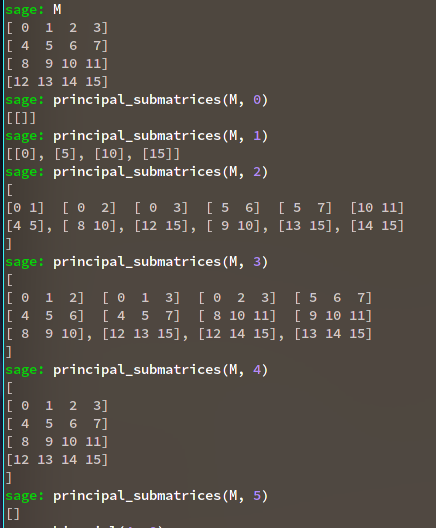
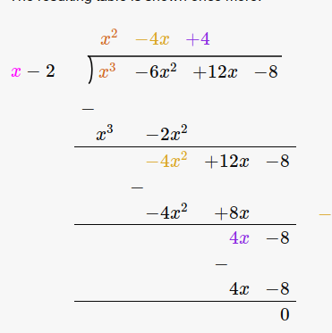

# Linear Algebra

:::{.remark}
Some definitions:

- $A^t$ is the usual transpose.
- $A^{\dagger}$ is the conjugate transpose.
- A matrix is $A^{\dagger}$ is **adjoint** to $A$ iff $\inner{A\vector x}{\vector y} = \inner{\vector x}{A^{\dagger} \vector y}$.
  - $A$ is **self-adjoint** iff $A$ is an adjoint for itself, so $\inner{A\vector x}{\vector y} = \inner{\vector x}{A \vector y}$.
- $A$ is **symmetric** iff $A = A^t$.
  - $A$ is **orthogonal** iff $A^tA = AA^t = I$
- $A$ is **Hermitian** iff $A^{\dagger} = A$.
  - $A$ is **normal** iff $AA^{\dagger} = A^{\dagger} A$.
  - $A$ is **unitary** iff $A^{\dagger}A = AA^{\dagger} = I$.
:::

:::{.fact title="Undergrad reminders"}
\[
\det M = \prod_{\sigma \in S_n} \eps(\sigma) \prod_{i=1}^n a_{i, \sigma(i)}
.\]

For example,

\[
\operatorname{det}\left(\begin{array}{ccc}
a_{11} & a_{12} & a_{13} \\
a_{21} & a_{22} & a_{23} \\
a_{31} & a_{32} & a_{33}
\end{array}\right)=\begin{gathered}
a_{11} a_{22} a_{33}+a_{12} a_{23} a_{31}+a_{13} a_{21} a_{32} \\
-a_{13} a_{22} a_{31}-a_{12} a_{21} a_{33}-a_{11} a_{23} a_{32}
\end{gathered}
.\]

Let $\minor_A(i, j)$ denote $A$ with the $i$th row, $j$th column deleted.

One can expand determinants along rows:
\[
\det(A) = \sum_{j=1}^n (-1)^{i+j} a_{ij} \det \minor_A(i, j)
.\]

Also useful, a matrix can be inverted by computing the adjugate:
\[
A\inv = {1\over \det A} \operatorname{adj}(A) && \adj(A)_{ij} \da (-1)^{i+j} \det \minor_A(j, i)
.\]

The eigenvalues of an upper-triangular matrix are exactly the diagonal entries, and the determinant is their product.
More generally, the determinant is always the product of the eigenvalues, and the trace is the sum of the eigenvalues, so $\tr(A) = \sum \lambda_i$ and $\det(A) = \prod \lambda_i$.

Matrices can be block-multiplied when all dimensions are compatible:
\[
\begin{bmatrix}
A & B \\
C & D 
\end{bmatrix}
\begin{bmatrix}
E & F \\
G & H 
\end{bmatrix}
= \matt{AE + BG}{AF + BH}{CE + DG}{ CF + DH}
.\]

> Note that if any of these matrix multiplications don't make sense, the results won't be valid!

If $A$ is upper triangular, some entries of $A^k$ can be computed easily:

\[
A\da\left(\begin{array}{ccc}
a_1 & & * \\
& \ddots & \\
0 & & a_n
\end{array}\right)
\implies
A^k\da\left(\begin{array}{ccc}
a_1^k & & * \\
& \ddots & \\
0 & & a_n^k
\end{array}\right)
.\]

Traces of products can be commuted: $\trace(AB) = \trace(BA)$, so similar matrices have identical traces since $\trace(PJP\inv) = \trace{PP\inv J} = \trace{J}$.

The coefficients of the characteristic polynomial are elementary symmetric functions in the eigenvalues:
\[
\chi_A(t) = t^n - \qty{\sum_i \lambda_i }t^{n-1} + \qty{\sum_{i < j} \lambda_i \lambda_j }t^{n-2} + \cdots \pm \qty{\prod_i \lambda_i}
.\]

:::

:::{.proposition title="Useful computational trick"}
A trick for finding characteristic polynomials:
\[
\chi_A(t) &= \sum_{k=0}^n (-1)^k \trace\qty{\Extpower^k A} t^{n-k} \\
&= t^n - \trace\qty{A} t^{n-1} + \trace\qty{\Extpower^2 A}t^{n-2} - \cdots \pm \trace\qty{\Extpower^{n-1} A} t \mp \det(A)
,\]
using that 

\[
{\Extpower^0 A} \da 1 \\
{\Extpower^1 A} \da A \\
\trace\qty{\Extpower^n A} = \det(A)
.\]

Moreover, the intermediate traces are easy to compute by hand:
\[
\trace\qty{\Extpower^\ell A} = \sum \det\qty{M^{\ell}}
,\]
where the sum is taken over all $\ell\times\ell$ **principal minors**: determinants of the $n \choose \ell$ principal matrices which are obtained by choosing $\ell$ diagonal entries to keep and and deleting the rows and columns for every entry not chosen.
Equivalently, one can select $n-\ell$ diagonal entries and delete the corresponding row/column for each. 

:::{.example title="?"}

:::

To factor this polynomial, the **rational roots test** can be useful: for $f(t) = a_nt^n + \cdots + a_1 t + a_0$, rational roots are of the form $p/q$ where $p \divides a_n$ and $q\divides a_0$.
Note that this simplifies greatly for $f$ monic!
Once you have a root, apply **polynomial long division** to get a smaller problem, and hopefully this continues to work until it's factored.
:::

:::{.example title="of polynomial long division"}
Consider $f(x) \da x^3-6x^2+12x-8$, then any rational root is in $\ts{\pm 8, \pm 4, \pm 2, \pm 1}$.
Testing $f(2) = 0$ works, and dividing by $x-2$ yields

The rest can be factored by inspection:
\[
f(x) = (x-2)(x^2-4x+4) = (x-2)^3
.\]

:::

## Definitions

:::{.remark}
The main powerhouse: for $T:V\to V$ a linear transformation for $V\in\Vect_k$, map to $V\in \modsleft{k[x]}$ by letting polynomials act via $p(x)\cdot \vector v \da p(T)(\vector v)$.
Using that $k[x]$ is a PID iff $k$ is a field, and we can apply the FTFGMPID to get two decompositions:
\[
V &\cong \bigoplus_{i=1}^n k[x]/ \gens{ q_i(x) } && q_{i}(x) \divides q_{i+1}(x) \divides \cdots  \\
V &\cong \bigoplus _{j=1}^m k[x] / \gens{ p_i(x)^{e_i} } && \text{ with } p_i \text{ not necessarily distinct.} 
\]

- The $q_i$ are the **invariant factors** of $T$
  - $q_i$ is the minimal polynomial of $T$ restricted to $V_i \da k[x] / \gens{ q_i(x) }$. 
  - The largest invariant factor $q_n$ is the **minimal polynomial** of $T$.
  - The product $\prod_{i=1}^n q_i(x)$ is the **characteristic polynomial** of $T$.
- The $p_i$ are the **elementary divisors** of $T$.
  - Todo: what can you read off of this...?

:::

:::{.definition title="Nondegenerate Bilinear Form"}
\todo[inline]{todo}
:::

:::{.definition title="Quadratic Form"}
\todo[inline]{todo}

:::

:::{.definition title="Gram Matrix"}
\todo[inline]{todo}

:::

:::{.definition title="Normal Matrix"}
A matrix $A\in \Mat(n\times n; \CC)$ is **normal** iff $A^{\dagger} A = AA^{\dagger}$ where $A^{\dagger}$ is the conjugate transpose.
:::

:::{.definition title="Semisimple"}
A matrix $A$ over $k$ is **semisimple** iff $A$ is diagonalizable over $k^\alg$, the algebraic closure.
:::

:::{.definition title="Nilpotent"}
A matrix $A$ over $k$ is **nilpotent** iff $A^k = 0$ for some $k\geq 1$.

> Idea: upper triangular matrices.

:::

:::{.definition title="Unipotent"}
A element $A$ in a ring $R$ is **unipotent** iff $A-1$ is nilpotent.

> Idea: an upper-triangular matrix with ones on the diagonal.

:::

:::{.proposition title="Triangular Decomposition"}
Any linear map $T:V\to V$ over a perfect field decomposes as $T = S + N$ with $S$ semisimple (diagonal), $N$ nilpotent, and $[DN] = 0$.
If $T$ is invertible, then $T$ decomposes as $T = SU$ where $S$ is semisimple, $U$ is unipotent, and $[UN] = 0$.
:::

:::{.proposition title="Perp of sum is intersection of perps"}
\[
\qty{ \sum  W_i}^\perp = \Intersect \qty{W_i^\perp}
.\]
:::

## Minimal / Characteristic Polynomials

:::{.remark}
Fix some notation:
\[
\min_A(x): \quad & \text{The minimal polynomial of } A \\
\chi_A(x): \quad & \text{The characteristic polynomial of } A
.\]

:::

:::{.definition title="?"}
The **minimal polynomial** of a linear map $T$ is the unique monic polynomial $\min_T(x)$ of minimal degree such that $\min_T(T) = 0$.
:::

:::{.definition title="?"}
The **characteristic polynomial** of $A$ is given by
$$
\chi_A(x) = \det(A - xI))= \det(SNF(A - xI))
.$$

:::

:::{.fact}
If $A$ is upper triangular, then $\det(A) = \prod_{i} a_{ii}$
:::

:::{.theorem title="Cayley-Hamilton"}
The minimal polynomial divides the characteristic polynomial, and in particular $\chi_A(A) = 0$.
:::

:::{.proof title="?"}
By minimality, $\min_A$ divides $\chi_A$. 
Every $\lambda_i$ is a root of $\min_A(x)$: 
Let $(\vector v_i, \lambda_i)$ be a nontrivial eigenpair. 
Then by linearity,
$$
\min_A(\lambda_i)\vector v_i = \min_A(A)\vector v_i = \vector 0
,$$ 
which forces $\min_A(\lambda_i) = 0$.
:::

:::{.definition title="Similar Matrices"}
Two matrices $A,B$ are **similar** (i.e. $A = PBP\inv$) $\iff A,B$ have the same Jordan Canonical Form (JCF).
:::

:::{.definition title="Equivalent Matrices"}
Two matrices $A, B$ are **equivalent** (i.e. $A = PBQ$) $\iff$

- They have the same rank,

- They have the same invariant factors, *and*

- They have the same (JCF)

:::

## Finding Minimal Polynomials

:::{.proposition title="How to find the minimal polynomial"}
Let $m(x)$ denote the minimal polynomial $A$.

1. Find the characteristic polynomial $\chi(x)$; this annihilates $A$ by Cayley-Hamilton. Then $m(x) \divides \chi(x)$, so just test the finitely many products of irreducible factors.

2. Pick any $\vector v$ and compute $T\vector v, T^2\vector v, \cdots T^k\vector v$ until a linear dependence is introduced. Write this as $p(T) = 0$; then $\min_A(x) \divides p(x)$.

:::

:::{.definition title="Companion Matrix"}
Given a monic $p(x) = a_0 + a_1 x + a_2 x^2 + \cdots + a_{n-1} x^{n-1} + x^n$, the **companion matrix** of $p$ is given by
\[
C_p \definedas 
\begin{bmatrix}
0 & 0 & \dots & 0 &-a_0 \\ 
1 & 0 & \dots & 0 & -a_1 \\ 
0 & 1 & \dots & 0 & -a_2 \\ 
\vdots & & \ddots & & \vdots \\ 
0 & 0 & \dots & 1 & -a_{n-1} 
\end{bmatrix}
.\]
:::

## Jordan Canonical Form

:::{.fact}
The JCF corresponds to **elementary divisors**.
:::

\todo[inline]{Make more precise..}

:::{.proposition title="JCF Algorithm for generalized eigenvectors"}
The following algorithm always works for computing $\JCF(A)$:

- Compute and factor the characteristic polynomial as $\chi_A(x) = \prod_{i} (x-\lambda_i)^{m_i}$.
- For each $\lambda_i$, find the constant $\ell_i$ such that
\[
\cdots 
\rank (A-\lambda_i I)^{\ell_i - 1} 
> \rank (A-\lambda_i I)^{\ell_i}
{\color{red} = }
\rank (A-\lambda_i I)^{\ell_i+1}
{\color{red} = }
\rank (A-\lambda_i I)^{\ell_i+1}
{\color{red} = } \cdots
.\]
- Find as many usual eigenvectors $\vector v_i$ as you can.
   The number of eigenvectors you find will be $\dim E_{\lambda_i}$.
  Suppose you just get one, $\vector v$.
- Solve the systems:
\[
(A - \lambda_i I)\vector v_1 = \vector v &\implies \vector v_1 = ? \\
(A - \lambda_i I)^2\vector v_2 = \vector v_1 &\implies \vector v_2 = ? \\
&\vdots \\
,\]
  which can be solved by putting the $\vector v_i$ in an augmented matrix and computing the RREF.
- This terminates in at most $\ell_i$ steps, and these vectors correspond to a single Jordan block.
- If there are other eigenvectors $\vector w, \cdots$ for $\lambda_i$, repeating this process yields a Jordan block for each of them.
  Assemble $P$ by placing these $\vector v_i$ in the appropriate columns.
:::

:::{.lemma title="JCF from Minimal and Characteristic Polynomials"}
Writing $\spec(A) = \theset{(\lambda_i, m_i)}$,
\[
\min_A(x) &= \prod_i (x- \lambda_i)^{\ell_i} \\
\chi_A(x) &= \prod (x- \lambda_i)^{m_i} \\
E_{\lambda_i} &= \dim(A - \lambda_i I)
\]

- The roots both polynomials are precisely the eigenvalues $\lambda_i$ of $A$.
  - $m_i$ are the *algebraic multiplicities*.
  - $\dim E_{\lambda_i}$ are the *geometric multiplicities*.

- $\ell_i \leq m_i$ by Cayley-Hamilton.

- $\ell_i$ is
  - The size of the **largest** Jordan block associated to $\lambda_i$, and 
  - The "stabilizing constant".

- $m_i$, associated to the characteristic polynomial, is
  - The **sum of sizes** of all Jordan blocks associated to $\lambda_i$, 
  - The number of times $\lambda_i$ appears on the diagonal of $JCF(A)$, 

- $\dim E_{\lambda_i}$ is 
  - The **number of Jordan blocks** associated to $\lambda_i$
  - The number of (usual) eigenvector associated to $\lambda_i$, i.e. the dimension of their span.

- $A$ is diagonalizable iff $\dim E_{\lambda_i} = m_i$ for all $i$.
:::

:::{.lemma title="?"}
The elementary divisors of $A$ are the minimal polynomials of the Jordan blocks.
:::

:::{.remark}
Writing $\Ann(\vector v)$ as the annihilator of $\vector v$, a generalized eigenvector for the pair $(\lambda_i, \vector v)$ for a matrix $A$ is any operator in the space $\sqrt{\Ann(\vector v)}$, where we view $V$ as a $k[x]\dash$module using $p(x) \actson \vector v \da p(A)(\vector v)$.
So 
\[
\Ann(\vector v) \da \ts{ q(x) \in k[x] \st q(x) \actson \vector v = 0} = \ts{q(x) \in k[x] \st q(A)(\vector v) = 0}
.\]
Now use that $\vector w$ is an eigenvector for $A$ with eigenvalue $\lambda_i \iff A-\lambda_i I \in \Ann(\vector w)$, and is a generalized eigenvector iff
\[
(A-\lambda_i I)^k\in \Ann(\vector w) &\text{ for some }k \iff A-\lambda_i I \in \sqrt{\Ann(\vector w)}
.\]

We can then write
\[
V^{\lambda_i} 
&\da \ts{\vector v\in V \st (A-\lambda_i I)^n \vector v = 0 \text{ for some }n } \\
&= \ts{\vector v\in V \st (A-\lambda_i I)^n \in \Ann(\vector v) } \\
&= \ts{\vector v\in V \st A-\lambda_i I \in \sqrt{\Ann(\vector v)} } 
,\]
and the theorem is that $V \cong \bigoplus_i V^{\lambda_i}$.
It also turns out that $V^{\lambda_i} = \ker (A-\lambda_i I)^n$ for $n\da \dim V$.
:::

## Other Canonical Forms

:::{.proposition title="?"}
Let $T:V\to V$ be a linear map where $n\da \dim_k V$.
TFAE:

- There exists a basis \( \ts{ e_i } \) of $V$ such that 
\[
T(e_i) = 
\begin{cases}
e_{i-1} &  i \geq 2
\\
0 & i=1.
\end{cases}
\]

- There exists a cyclic vector $\vector v$ such that \( \ts{ T^k \vector v \st k=1,2,\cdots, n} \) form a basis for $V$.

- $T^{n-1} \neq 0$
- $\dim_k \ker T^\ell = \ell$ for each $1\leq \ell \leq n$.
- $\dim_k \ker T = 1$.
:::

### Rational Canonical Form

Corresponds to the **Invariant Factor Decomposition** of $T$.

:::{.proposition title="Rational Canonical Form"}
$RCF(A)$ is a block matrix where each block is the companion matrix of an invariant factor of $A$.
:::

:::{.proof title="Derivation of RCF"}
\envlist

- Let $k[x] \actson V$ by $p(x) \actson \vector v \da p(T)(\vector v)$, making $V$ into a $k[x]\dash$module. 

- $k$ a field implies $k[x]$ a PID, so apply structure theorem to obtain an invariant factor decomposition 
\[
V \cong \bigoplus_{i=1}^m k[x] / \gens{ p_i(x) }
&& p_1(x) \divides p_2(x) \divides \cdots p_m(x)
.\]

- Each $p_i$ is an invariant factor of $T$, and the minimal polynomial of $T$ restricted to $V_i$.

- Write $V \cong \bigoplus_{i=1}^m V_i$ where $V_i \da k[x] / \gens{ p_i(x) }$, then $A$ is a block matrix $\bigoplus_{i=1}^m M_i$ where $M_i$ is the restriction of $T$ to $V_i$:
\[
\left(\begin{array}{ccccc}M_{1} & 0 & 0 & \cdots & 0 \\ 0 & M_{2} & 0 & \cdots & 0 \\ \vdots & & \ddots & & \vdots \\ 0 & \cdots & & & M_{n}\end{array}\right)
.\]

- It suffices to determine the form of $M_i$, so without loss of generality suppose $m=1$ so $V = V_1 = k[x] / \gens{ p(x) }$ is a cyclic $k[x]\dash$module where $\deg p(x) = n$.

- Claim: the set \( \ts{\vector v_i}_{i=0}^{n-1} \da \ts{ \vector v, T\vector v, T^2\vector v, \cdots, T^{n-1}\vector v } \) is a basis for $V_1$.
  - If there is any linear independence, this gives a polynomial relation $\sum_{i=1}^{n'} a_iT^i\vector v = 0$ for some $n'<n$, but then $q(x) \da \sum_{i=1}^{n'} a_i x^i$ is a polynomial annihilating $T$, contradicting the minimality of $p(x)$.
  - So this yields $n$ linearly independent vectors in $k^n$, so it's a basis.
- What is $M_i$ in this basis?
  Check where basis elements are mapped to by $T$, noting that 
  \[
p(T) = \sum_{i=1}^{n}a_i T^i\vector v = T^n + a_{n-1} T^{n-1}\vector v + a_{n-2} T^{n-2} + \cdots + a_1 T\vector v + a_0 \vector v = 0
  ,\]
  we can write
  - $T\vector v_0 = \vector v_1$
  - $T\vector v_2 = T^2 \vector v_0$
  - $T\vector v_3 = T^3 \vector v_0$
  - $\cdots$
  - $T\vector v_{n-2} = T^{n-1}\vector v$
  - $T\vector v_{n-1} = T^n\vector v = -a_{n-1}T^{n-1}\vector v - \cdots - a_1 T\vector v - a_0 \vector v$ 

  (using the minimal polynomial relation).

- So we have
\[
M_1 = 
\begin{bmatrix}
0 &  &  &  & -a_0 \\
1 & 0 &  &  & -a_1 \\
 &  1 &  0&  & -a_2 \\
 &  & \ddots &  0 & \vdots \\
 &  &  & 1 & -a_{n-1} 
\end{bmatrix}
.\]

:::

### Smith Normal Form

:::{.fact}
For $A\in \Mat(m\times n; R)$ over $R$ any PID, $\SNF(A)$ is a matrix whose diagonal entries are the invariant factors.
How to compute $\SNF(A)$: take $A = \diag(a_i)$ where $a_i = d_i/d_{i-1}$ and $d_i$ is the $\gcd$ of the determinants of all $i\times i$ minors of $A$.
$A\sim B$ are similar $\iff \SNF(A) = \SNF(B)$.
:::

### Using Canonical Forms

:::{.lemma title="?"}
The characteristic polynomial is the *product of the invariant factors*, i.e.
$$
\chi_A(x) = \prod_{j=1}^n f_j(x)
.$$
:::

:::{.lemma title="?"}
The minimal polynomial of $A$ is the *invariant factor of highest degree*, i.e.
$$
\min_A(x) = f_n(x)
.$$
:::

:::{.proposition title="?"}
For a linear operator on a vector space of nonzero finite dimension, TFAE:

- The minimal polynomial is equal to the characteristic polynomial.

- The list of invariant factors has length one.

- The Rational Canonical Form has a single block.

- The operator has a matrix similar to a companion matrix.

- There exists a *cyclic vector* $\vector v$ such that $\spanof_k\theset{T^j \vector v \suchthat j = 1, 2, \cdots} = V.$

- $T$ has $\dim V$ distinct eigenvalues

:::

## Diagonalizability

:::{.remark}
*Notation:*
$A^{\dagger}$ denotes the conjugate transpose of $A$.

:::

:::{.lemma title="?"}
Let $V$ be a vector space over $k$ an algebraically closed and $A \in \mathrm{End}(V)$.
Then if $W \subseteq V$ is an invariant subspace, so $A(W) \subseteq W$, the $A$ has an eigenvector in $W$.
:::

:::{.theorem title="The Spectral Theorem"}
\envlist

1. Hermitian (self-adjoint) matrices (i.e. $A^{\dagger} = A$) are diagonalizable over $\CC$.
2. Symmetric matrices (i.e. $A^t = A$) are diagonalizable over $\RR$.

:::

:::{.remark}
In fact, $A$ is symmetric $\iff \spec A$ forms an orthonormal basis.
:::

:::{.proof title="?"}
\envlist

- Suppose $A$ is Hermitian.
- Since $V$ itself is an invariant subspace, $A$ has an eigenvector $\vector v_1 \in V$.
- Let $W_1 = \spanof_k\theset{\vector v_1}\perp$.
- Then for any $\vector w_1 \in W_1$, 
$$
\inner{\vector v_1}{ A \vector w_1} =
\inner{A \vector v_1}{\vector w_1} =
\lambda \inner{\vector v_1}{\vector w_1} = 0,
$$
so $A(W_1) \subseteq W_1$ is an invariant subspace, etc.

- Suppose now that $A$ is symmetric.
- Then there is an eigenvector of norm 1, $\vector v \in V$.
\[
\lambda = \lambda\inner{\vector v}{\vector v} = \inner{A\vector v}{\vector v} = \inner{\vector v}{A\vector v} = \overline{\lambda} \implies \lambda \in \RR
.\]

:::

:::{.proposition title="Simultaneous Diagonalizability"}
A set of operators $\theset{A_i}$ pairwise commute $\iff$ they are all simultaneously diagonalizable.
:::

:::{.proof title="?"}
By induction on number of operators

- $A_n$ is diagonalizable, so $V = \bigoplus E_i$ a sum of eigenspaces
- Restrict all $n-1$ operators $A$ to $E_n$.
- The commute in $V$ so they commute in $E_n$
- **(Lemma)** They were diagonalizable in $V$, so they're diagonalizable in $E_n$
- So they're simultaneously diagonalizable by I.H.
- But these eigenvectors for the $A_i$ are all in $E_n$, so they're eigenvectors for $A_n$ too.
- Can do this for each eigenspace.

> [Full details here](https://kconrad.math.uconn.edu/blurbs/linmultialg/minpolyandappns.pdf#page=9)

:::

:::{.theorem title="Characterizations of Diagonalizability"}
$M$ is diagonalizable over $\FF \iff \min_M(x, \FF)$ splits into distinct linear factors over $\FF$, or equivalently iff all of the roots of $\min_M$ lie in $\FF$.
:::

:::{.proof title="?"}
$\implies$:
If $\min_A$ factors into linear factors, so does each invariant factor, so every elementary divisor is linear and $JCF(A)$ is diagonal.

$\impliedby$:
If $A$ is diagonalizable, every elementary divisor is linear, so every invariant factor factors into linear pieces. 
But the minimal polynomial is just the largest invariant factor.
:::

## Matrix Counterexamples

:::{.example title="?"}
A matrix that:

- Is not diagonalizable over $\RR$ but diagonalizable over $\CC$

- Has *no* eigenvalues over $\RR$ but has *distinct* eigenvalues over $\CC$

- $\min_M(x) = \chi_M(x) = x^2 + 1$

\[
M = \left(\begin{array}{rr}
0  & 1 \\
-1 & 0
\end{array}\right) \sim
\left(\begin{array}{r|r}
-1 \sqrt{-1} & 0 \\
\hline
0 & 1 \sqrt{-1}
\end{array}
\right)
.\]

:::

:::{.example title="?"}
A matrix that:

- Is not diagonalizable over $\CC$,

- Has eigenvalues $[1, 1]$ (repeated, multiplicity 2)

- $\min_M(x) = \chi_M(x) = x^2-2x+1$

\[
M = \left(\begin{array}{rr}
1 & 1 \\
0 & 1
\end{array}\right) 
\sim
\left(
\begin{array}{rr}
1 & 1 \\
0 & 1
\end{array}
\right)
.\]

:::

:::{.example title="?"}
Non-similar matrices with the same characteristic polynomial
\[
\left(\begin{array}{ll}
{0}  & {0} \\
{0} & {0}
\end{array}\right)
\text { and }
\left(\begin{array}{ll}
{0} & {0} \\
{0} & {0}
\end{array}\right)
\]
Here $\chi_A(x) = \chi_B(x) = x^2$, but they are not conjugate since their JCFs differ (note that they're already in JCF!)
:::

:::{.example title="?"}
A full-rank matrix that is not diagonalizable:
\[
\left(
\begin{array}{ccc}
1 & 1 & 0 \\
0 & 1 & 1 \\
0 & 0 & 1 \\
\end{array}
\right)
.\]

:::

:::{.example title="?"}
Matrix roots of unity, i.e. representations of $i$:
\[
M_1 
\da
\matt 0 {-1} 1 0 \quad
M_2
\da 
\matt 0 1 {-1} 0
.\]
:::

## Matrix Groups

:::{.definition title="General Linear Group"}
\[
\GL_n(\RR) = \ts{ A \st A = \bar{A} } 
.\]
:::

:::{.proposition title="Order of $\GL_n$"}
\todo[inline]{todo}
:::

:::{.definition title="Special Linear Group"}
\[
\SL_n(\CC) \da \ts{ A \st \det A = 1 } 
.\]
:::

:::{.definition title="Orthogonal Group"}
\[
O_n(\CC) \da \ts{ A \st A^tA = A A^t = I} 
.\]

Dimension: $n(n-1) / 2$.
:::

:::{.definition title="Special Orthogonal Group"}
\[
\SO_n(\RR) = \ts{ A \st  AA^t = I} = \ker(\GL_n(\RR) \to k\units)
.\]

:::

:::{.definition title="Unitary Group"}
\[
U_n(\CC) \da \ts{ A \st A^\dagger A = AA^\dagger = 1 } 
.\]
:::

:::{.definition title="Special Unitary Group"}
\[
\SU_n(\CC) \da \ts{ A \in U_n(\CC) \st \det A = 1  } 
.\]

:::

:::{.definition title="Symplectic Group"}
\[
\mathrm{Sp}_{2n}(\CC) \da \ts{ A \in \GL_{2n}(\CC) \st A^tJA = J } &&
J \da 
\begin{bmatrix}
0 & 1_n
\\
1_n & 0
\end{bmatrix}
.\]

:::

\todo[inline]{Matrix group definitions.}

### Counting

:::{.proposition title="Size of $\GL_n(\FF_p)$"}
\[
\abs{\GL_n(\FF_p)} = (p^n-1)(p^n-p)(p^n-p^2)\cdots(p^n - p^{n-1})
.\]

It suffices to count ordered bases of $\FF^p^n$:

- Choose $\vector v_1$: there are $p$ choices for each coefficient, but leave out the vector $0$, so $p^n-1$ choices.
- Choose any $\vector v_2 \neq \lambda \vector v_1$, so $p^n-p$ choices.
- Choose any nonzero $\vector v_3 \neq \lambda \vector v_1 + \eta \vector v_2$, so $p^n-p^2$ choices.
- Etc.

:::

## Exercises

:::{.exercise title="?"}
Show that normal matrices are diagonalizable.
:::

:::{.exercise title="?"}
Consider the Vandermonde matrix:
\[
A \da 
\left(\begin{array}{ccc}
1 & \cdots & 1 \\
\lambda_{1} & \cdots & \lambda_{k} \\
\vdots & & \vdots \\
\lambda_{1}^{k-1} & \cdots & \lambda_{k}^{k-1}
\end{array}\right)
.\]

Show that
\[
\det A = \prod_{i < j} (\lambda_i - \lambda_j)
.\]
:::

:::{.exercise title="?"}
Show that a nonzero nilpotent matrix $A$ is not diagonalizable over any field.
Some useful facts:

- $\spec A = \ts{0}$, since $Ax=\lambda x \implies A^n=\lambda^nx$, so $A^n=0$ forces $\lambda =0$.
  This forces $\JCF(A)$ to be strictly upper-triangular.
- $\min_A(x) = x^n$.
- If $A$ were diagonalizable, $\JCF(A) = 0$.

:::

:::{.exercise title="?"}
Prove Cayley-Hamilton in the following way.
Let $V = \spanof\ts{\vector v_1, \cdots, \vector v_n}$ and define the $i$th flag as $\Fil_i V \da \spenof\ts{\vector v_1, \cdots, \vector v_i}$ for all $1\leq i \leq n$, and set $\Fil_0 V \da \ts{0}$.
Show that if if $A$ is upper triangular, then $A(\Fil_i V) \subseteq \Fil_i V$.
Now supposing $\vector v_i$ are eigenvectors for $\lambda_i$, show that
\[
(A-\lambda_n I) \Fil_n V &\subseteq \Fil_{n-1} V \\
(A-\lambda_{n-1} I) (A-\lambda_n I ) \Fil_n V &\subseteq \Fil_{n-2} V \\
&\vdots
\prod_i (A-\lambda_{n-i} I) \Fil_n V &\subseteq \Fil_0 V = \ts{0}
.\]
Conclude that $\chi_A(A) = 0$.
:::

