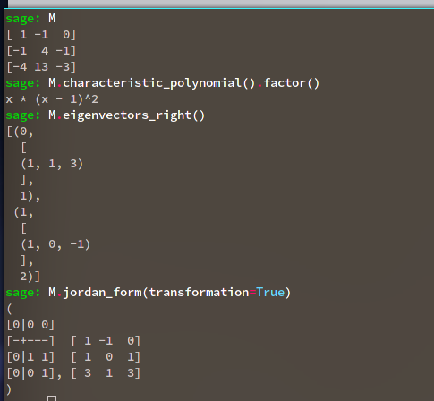

# Jordan Canonical Form

> Useful reference: <https://mattbaker.blog/2015/07/31/the-jordan-canonical-form/>

:::{.remark title="Sketch proof of existence of JCF"}
\envlist

- Let $f:V\to V$, say $f$ is decomposable iff $V$ splits into a direct sum of $f\dash$invariant subspaces.
- In this case, $f$ has a block form and restricts to an indecomposable map on the invariant subspaces, so only consider those.
- For any indecomposable $h$, there is an integer $m\geq 1$ such that $V = \ker h^m \oplus \im h^m$.
- Find an eigenvalue $fv = \lambda v$ and apply this fact to $h\da f - \lambda I$.
- Since $V$ is irreducible and $v\in \ker h$, this forces $V = \ker h^m$, making $h$ nilpotent of some minimal degree $k\leq m$, so $h^k = 0$.
- Then one can find a cyclic vector $w$ where $h^kw = 0$ but $h^{k-1}w \neq 0$, so $\ts{w, hw, \cdots, h^{k-1}w}$ is a basis for $V$.
  - That $k=\dim V$ follows because any $k< \dim v$ would yield a proper $f\dash$invariant subspace.
- The matrix of any cyclic vector is exactly a Jordan block.

:::

## Facts

:::{.fact}
The JCF corresponds to **elementary divisors**.
:::

\todo[inline]{Make more precise..}

:::{.proposition title="JCF Algorithm for generalized eigenvectors"}
The following algorithm always works for computing $\JCF(A)$:

- Compute and factor the characteristic polynomial as $\chi_A(x) = \prod_{i} (x-\lambda_i)^{m_i}$.
- For each $\lambda_i$, find the constant $\ell_i$ such that
\[
\cdots 
\rank (A-\lambda_i I)^{\ell_i - 1} 
> \rank (A-\lambda_i I)^{\ell_i}
{\color{red} = }
\rank (A-\lambda_i I)^{\ell_i+1}
{\color{red} = }
\rank (A-\lambda_i I)^{\ell_i+1}
{\color{red} = } \cdots
.\]
- Find as many usual eigenvectors $\vector v_i$ as you can.
   The number of eigenvectors you find will be $\dim E_{\lambda_i}$.
  Suppose you just get one, $\vector v$.
- Solve the systems:
\[
(A - \lambda_i I)\vector v_1 = \vector v &\implies \vector v_1 = ? \\
(A - \lambda_i I)^2\vector v_2 = \vector v_1 &\implies \vector v_2 = ? \\
&\vdots \\
,\]
  which can be solved by putting the $\vector v_i$ in an augmented matrix and computing the RREF.
- This terminates in at most $\ell_i$ steps, and these vectors correspond to a single Jordan block.
- If there are other eigenvectors $\vector w, \cdots$ for $\lambda_i$, repeating this process yields a Jordan block for each of them.
  Assemble $P$ by placing these $\vector v_i$ in the appropriate columns.
:::

:::{.lemma title="JCF from Minimal and Characteristic Polynomials"}
Writing $\spec(A) = \theset{(\lambda_i, m_i)}$,
\[
\min_A(x) &= \prod_i (x- \lambda_i)^{\ell_i} \\
\chi_A(x) &= \prod (x- \lambda_i)^{m_i} \\
E_{\lambda_i} &= \dim(A - \lambda_i I)
\]

- The roots both polynomials are precisely the eigenvalues $\lambda_i$ of $A$.
  - $m_i$ are the *algebraic multiplicities*.
  - $\dim E_{\lambda_i}$ are the *geometric multiplicities*.

- $\ell_i \leq m_i$ by Cayley-Hamilton.

- $\ell_i$ is
  - The size of the **largest** Jordan block associated to $\lambda_i$[^why_largest_block], and 
  - The "stabilizing constant".

- $m_i$, associated to the characteristic polynomial, is
  - The **sum of sizes** of all Jordan blocks associated to $\lambda_i$, 
  - The number of times $\lambda_i$ appears on the diagonal of $JCF(A)$, 
  - The dimension of the *generalized* eigenspace $V^{\lambda_i}$.

- $\dim E_{\lambda_i}$ is 
  - The **number of Jordan blocks** associated to $\lambda_i$
  - The number of (usual) eigenvector associated to $\lambda_i$, i.e. the dimension of their span.

- $A$ is diagonalizable iff $\dim E_{\lambda_i} = m_i$ for all $i$.

[^why_largest_block]: 
This is because $(x-\lambda_i)^{\ell_i}$ annihilates a Jordan block of size $\ell_i$, along with any blocks of size $k\leq \ell_i$.

:::

:::{.example title="?"}
Suppose $A$ is $5\times 5$ with 
\[
\min_A(t) &= (t-4)^2(t+6) \\
\chi_A(t) &= (t-4)^3(t+6)^2
.\]

Some deductions:

- For $\lambda = 4$:
  - The total size of all blocks is 3
  - The largest block is size 2
  - So this yields $J_1 \oplus J_2$.
- For $\lambda = -6$:
  - The total size of all blocks is 2
  - The largest block is size 1
  - So this must be $J_1 \oplus J_1$

:::

:::{.warnings}
The data of $\min_A(t), \chi_A(t)$ is **not** enough to uniquely determine $\JCF(A)$.
Counterexample: there are two distinct possibilities for $4\times 4$ matrices with $\min_A(t) = t^2$ and $\chi_A(t) = t^4$, namely $J_2 \oplus J_2$ and $J_2 \oplus J_1 \oplus J_1$.
:::

:::{.lemma title="?"}
The elementary divisors of $A$ are the minimal polynomials of the Jordan blocks.
:::

:::{.remark}
Writing $\Ann(\vector v)$ as the annihilator of $\vector v$, a generalized eigenvector for the pair $(\lambda_i, \vector v)$ for a matrix $A$ is any operator in the space $\sqrt{\Ann(\vector v)}$, where we view $V$ as a $k[x]\dash$module using $p(x) \actson \vector v \da p(A)(\vector v)$.
So 
\[
\Ann(\vector v) \da \ts{ q(x) \in k[x] \st q(x) \actson \vector v = 0} = \ts{q(x) \in k[x] \st q(A)(\vector v) = 0}
.\]
Now use that $\vector w$ is an eigenvector for $A$ with eigenvalue $\lambda_i \iff A-\lambda_i I \in \Ann(\vector w)$, and is a generalized eigenvector iff
\[
(A-\lambda_i I)^k\in \Ann(\vector w) &\text{ for some }k \iff A-\lambda_i I \in \sqrt{\Ann(\vector w)}
.\]

We can then write
\[
V^{\lambda_i} 
&\da \ts{\vector v\in V \st (A-\lambda_i I)^n \vector v = 0 \text{ for some }n } \\
&= \ts{\vector v\in V \st (A-\lambda_i I)^n \in \Ann(\vector v) } \\
&= \ts{\vector v\in V \st A-\lambda_i I \in \sqrt{\Ann(\vector v)} } 
,\]
and the theorem is that $V \cong \bigoplus_i V^{\lambda_i}$.
It also turns out that $V^{\lambda_i} = \ker (A-\lambda_i I)^n$ for $n\da \dim V$.
:::

:::{.proof title="of generalized eigenspace decomposition"}

- Suppose $\chi_A(x) = \prod (x-\lambda_i)^{n_i}$.
- Define $V^{j} \da \ker (A-\lambda_i I)^n$ as the generalized eigenspace for each $i$.
- Fix $j$ and define $h_j(x) = \prod_{i\neq j}(x-\lambda_i)^{n_i}$, the characteristic polynomial with the $\lambda_j$ term deleted.
- Define $W^j \da \im(h_j(A))$, then the claim is $W^j \subseteq V^j$
  - This follows because $0 = \chi_A(A) = (A-\lambda_j I)^{n_j} h_j(A)$, so in fact $W^j \subseteq \ker (A - \lambda_j)^{n_j}$.
- Claim: $\sum V^j = V$:
  - Let $\vector v\in V$ be arbitrary, then by Euclid's algorithm write $\sum_i f_i h_i = 1$ since the $h_i$ are coprime.
  - Thus $\sum f_i(A) h_i(A) = I \implies \qty{\sum f_i(A) h_i(A)}(\vector v) = \vector v \implies \vector v \in \sum W^j$
- Claim: the sum is direct.
  - It suffices to show $0=\sum w_i$ with $w_i \in W^i$ implies $w_i =0$ for all $i$.
  - Use that $h_j(w_i) = 0$ for $i\neq j$ since $w_i \in W^i \da \ker(A-\lambda_I I)^{n_i}$.
  - Write $\vector w_i = \sum f_j(A) h_j(A) \vector w_i$, which collapses to $f_i(A) h_i(A) \vector w_i$.
  - So $f_i(A) h_i(A) \qty{\sum w_i} = 0 \implies w_i = 0$.

:::

\todo[inline]{Messy indexing.}

## Exercises

:::{.exercise title="?"}
Prove Cayley-Hamilton using the JCF.
:::

:::{.exercise title="?"}
Prove the rank-nullity theorem using JCF.
:::

:::{.exercise title="?"}
Compute $\JCF(A)$ for 
\[
A \da 
\mattt{1}{-1}{0}{-1}{4}{-1}{-4}{13}{-3}
.\]

:::

:::{.solution}

- $\det(A) = 0$
- $\tr(A) = 2$
- $\tr(\Extpower^2 A) = 1$
- $\chi_A(t) = t^3 - 2t^2 + t$
- $e_1 = \tv{1,1,3}$
- $e_2 = \tv{1,0,-1}$
  - $e_{2, 1} = \tv{-3,-1, 0}$.

:::

:::{.exercise title="?"}
Determine $\JCF(B)$ for
\[
B \da
\left(\begin{array}{cccc}
5 & -1 & 0 & 0 \\
9 & -1 & 0 & 0 \\
0 & 0 & 7 & -2 \\
0 & 0 & 12 & -3
\end{array}\right)
.\]

:::

