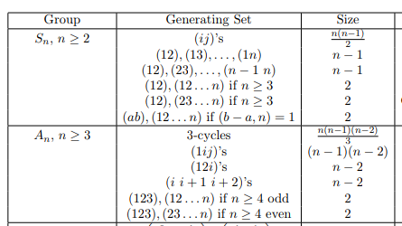

## Group Theory

### Centralizing and Normalizing

- Show that $C_G(H) \subseteq N_G(H) \leq G$.

- Show that $Z(G) \subseteq C_G(H) \subseteq N_G(H)$.
- Given $H\subseteq G$, let $S(H)= \bigcup_{g\in G} gHg^{-1}$, so $\abs{S(H)}$ is the number of conjugates to $H$. 
  Show that $\abs{S(H)} = [G : N_G(H)]$.
  - That is, the number of subgroups conjugate to $H$ equals the index of the normalizer of $H$.

- Show that $Z(G) = \bigcap_{a\in G} C_G(a)$.

- Show that the centralizer $G_G(H)$ of a subgroup is again a subgroup.

- Show that $C_G(H) \normal N_G(H)$ is a normal subgroup.

- Show that $C_G(G) = Z(G)$.

- Show that for $H\leq G$, $C_H(x) = H \intersect C_G(x)$.

- Let $H, K \leq G$ a finite group, and without using the normalizers of $H$ or $K$, show that $\abs{HK} = \abs{H} \abs{K}/\abs{H\intersect K}$.

- Show that if $H \leq N_G(K)$ then $HK \leq H$, and give a counterexample showing that this condition is necessary.

- Show that $HK$ is a subgroup of $G$ iff $HK = KH$.

- Prove that the kernel of a homomorphism is a normal subgroup.

### Primes in Group Theory

- Show that any group of prime order is cyclic and simple.
- Analyze groups of order $pq$ with $q<p$.

  > Hint: consider the cases when $p$ does or does not divide $q-1$.

  - Show that if $q$ does not divide $p-1$, then $G$ is cyclic.
  - Show that $G$ is never simple. 

- Analyze groups of order $p^2 q$.

  > Hint: Consider the cases when $q$ does or does not divide $p^2 - 1$.

- Show that no group of order $p^2 q^2$ is simple for $p<q$ primes.
- Show that a group of order $p^2 q^2$ has a normal Sylow subgroup. 
- Show that a group of order $p^2 q^2$ where $q$ does not divide $p^2-1$ and $p$ does not divide $q^2-1$ is abelian.
- Show that every group of order $pqr$ with $p<q<r$ primes contains a normal Sylow subgroup.
  - Show that $G$ is never simple.

- Let $p$ be a prime and $\abs{G} = p^3$. 
  Prove that $G$ has a normal subgroup $N$ of order $p^2$.
  - Suppose $N = \gens{h}$ is cyclic and classify all possibilities for $G$ if:
    - $\abs h = p^3$
    - $\abs h = p$.

    > Hint: Sylow and semidirect products.

- Show that any normal $p\dash$ subgroup is contained in every Sylow $p\dash$subgroup of $G$.

- Show that the order of $1+p$ in $\qty{\ZZ/p^2\ZZ}\units$ is equal to $p$.
  Use this to construct a non-abelian group of order $p^3$.

### p-Groups

- Show that every $p\dash$group has a nontrivial center.
- Show that every $p\dash$group is nilpotent.
- Show that every $p\dash$group is solvable.
- Show that every maximal subgroup of a $p\dash$group has index $p$.
- Show that every maximal subgroup of a $p\dash$group is normal.
- Show that every group of order $p$ is cyclic.
- Show that every group of order $p^2$ is abelian and classify them.
- Show that every normal subgroup of a $p\dash$group is contained in the center.
  
  > Hint: Consider $G/Z(G)$.

- Let $O_P(G)$ be the intersection of all Sylow $p\dash$subgroups of $G$.
  Show that $O_p(G) \normal G$, is maximal among all normal $p\dash$subgroups of $G$

- Let $P\in \syl_p(H)$ where $H\normal G$ and show that $P\intersect H \in \syl_p(H)$.

- Show that Sylow $p_i\dash$subgroups $S_{p_1}, S_{p_2}$ for distinct primes $p_1\neq p_2$ intersect trivially.

- Show that in a $p$ group, every normal subgroup intersects the center nontrivially.

### Symmetric Groups 

Specific Groups

- Show that the center of $S_3$ is trivial.
- Show that $Z(S_n) = 1$ for $n\geq 3$
- Show that $\Aut(S_3) = \Inn(S_3) \cong S_3$.
- Show that the transitive subgroups of $S_3$ are $S_3, A_3$
- Show that the transitive subgroups of $S_4$ are $S_4, A_4, D_4, \ZZ_2^2, \ZZ_4$.
- Show that $S_4$ has two normal subgroups: $A_4, \ZZ_2^2$.
- Show that $S_{n\geq 5}$ has one normal subgroup: $A_n$.
- $Z(A_n) = 1$ for $n\geq 4$
- Show that $[S_n, S_n] = A_n$
- Show that $[A_4, A_4] \cong \ZZ_2^2$
- Show that $[A_n, A_n] = A_n$ for $n\geq 5$, so $A_{n\geq 5}$ is nonabelian.

General Structure

- Show that an $m\dash$cycle is an odd permutation iff $m$ is an even number.
- Show that a permutation is odd iff it has an odd number of even cycles.
- Show that the center of $S_n$ for $n\geq 4$ is nontrivial.
- Show that disjoint cycles commute.
- Show directly that any $k\dash$cycle is a product of transpositions, and determine how many transpositions are needed.

Generating Sets

- Show that $S_n$ is generated by any of the following types of cycles:
  
  

  - Show that $S_n$ is generated by transpositions.
  - Show that $S_n$ is generated by *adjacent* transpositions.
  - Show that $S_n$ is generated by $\theset{(12), (12\cdots n)}$ for $n\geq 2$
  - Show that $S_n$ is generated by $\theset{(12), (23\cdots n)}$ for $n\geq 3$
  - Show that $S_n$ is generated by $\theset{(ab), (12\cdots n)}$ where $1\leq a<b\leq n$ iff $\gcd(b-a, n) = 1$.
  - Show that $S_p$ is generated by any arbitrary transposition and any arbitrary $p\dash$cycle.

### Alternating Groups

- Show that $A_n$ is generated $3\dash$cycles.
- Prove that $A_n$ is normal in $S_n$.
- Argue that $A_n$ is simple for $n \geq 5$.
- Show that $\Out(A_4)$ is nontrivial.

### Dihedral Groups

- Show that if $N\normal D_n$ is a normal subgroup of a dihedral group, then $D_n/N$ is again a dihedral group.

### Other Groups

- Show that $\QQ$ is not finitely generated as a group.
- Show that the Quaternion group has only one element of order 2, namely $-1$.

### Classification

- Show that no group of order 36 is simple.
- Show that no group of order 90 is simple.
- Classifying all groups of order 99.
- Show that all groups of order 45 are abelian.
- Classify all groups of order 10.
- Classify the five groups of order 12.
- Classify the four groups of order 28.
- Show that if $\abs{G} = 12$ and has a normal subgroup of order 4, then $G \cong A_4$.
- Suppose $\abs G = 240 = s^4 \cdot 3 \cdot 5$.
  - How many Sylow-$p$ subgroups does $G$ have for $p\in \theset{2, 3, 5}$?
  - Show that if $G$ has a subgroup of order 15, it has an element of order 15.
  - Show that if $G$ does not have such a subgroup, the number of Sylow-$3$ subgroups is either 10 or 40.

  > Hint: Sylow on the subgroup of order 15 and semidirect products.

### Group Actions

- Show that the stabilizer of an element $G_x$ is a subgroup of $G$.
- Show that if $x, y$ are in the same orbit, then their stabilizers are conjugate.
- Show that the stabilizer of an element need not be a normal subgroup?
- Show that if $G \actson X$ is a group action, then the stabilizer $G_x$ of a point is a subgroup.

### Series of Groups

- Show that $A_n$ is simple for $n\geq 5$
- Give a necessary and sufficient condition for a cyclic group to be solvable.
- Prove that every simple abelian group is cyclic.
- Show that $S_n$ is generated by disjoint cycles.
- Show that $S_n$ is generated by transpositions.
- Show if $G$ is finite, then $G$ is solvable $\iff$ all of its composition factors are of prime order.
- Show that if $N$ and $G/N$ are solvable, then $G$ is solvable.
- Show that if $G$ is finite and solvable then every composition factor has prime order.
- Show that $G$ is solvable iff its derived series terminates.
- Show that $S_3$ is not nilpotent.

- Show that $G$ nilpotent $\implies G$ solvable
- Show that nilpotent groups have nontrivial centers.
- Show that Abelian $\implies$ nilpotent
- Show that p-groups $\implies$ nilpotent

### Misc

- Prove Burnside's theorem.

- Show that $\Inn(G) \normal Aut(G)$

- Show that $\Inn(G) \cong G / Z(G)$

- Show that the kernel of the map $G\to \aut(G)$ given by $g\mapsto (h\mapsto ghg\inv)$ is $Z(G)$.

- Show that $N_G(H) / C_G(H) \cong A \leq Aut(H)$

- Give an example showing that normality is not transitive: i.e. $H\normal K \normal G$ with $H$ *not* normal in $G$.

### Nonstandard Topics

- Show that $H~\text{char}~G \Rightarrow H \unlhd G$
  
  > Thus "characteristic" is a strictly stronger condition than normality

- Show that $H ~\text{char}~ K ~\text{char}~G \Rightarrow H ~\text{char}~ G$
  
  > So "characteristic" is a transitive relation for subgroups.

- Show that if $H \leq G$, $K\normal G$ is a normal subgroup, and $H~\text{char}~K$ then $H$ is normal in  $G$.

  > So normality is not transitive, but strengthening one to "characteristic" gives a weak form of transitivity.

