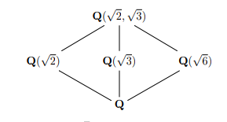

# Extra Problems

## Group Theory

### Basic Structure

- Show that any cyclic group is abelian.
- Show that if $G/Z(G)$ is cyclic then $G$ is abelian.
- Show that the intersection of two subgroups is again a subgroup.
- Show that if $G \actson X$ is a group action, then the stabilizer $G_x$ of a point is a subgroup.
- Show that $G=H\cross K$ iff the conditions for recognizing direct products hold.
- Show that if $H, K \normal G$ and $H\intersect K = \emptyset$, then $hk=kh$ for all $h\in H,k\in K$.
- Show that every normal subgroup of $G$ is contained in $Z(G)$.
- Show that $\abs{G}/\abs{H} = [G: H]$.
- Show that the order of any element in a group divides the order of the group.
- Show that $\phi(n) = n \prod{p\mid n}\qty{1 - {1\over p}}$.
- Show that $Z(G) \subseteq C_G(H) \subseteq N_G(H)$.
- Show that $G/N$ is abelian iff $[G, G] \leq N$.
- Give a counterexample where $H,K\leq G$ but $HK$ is not a subgroup of $G$.
- Show that if $H,K\normal G$ are normal subgroups that intersect trivially, then $[H, K] = 1$ (so $hk = kh$ for all $k$ and $h$).
- Give an example showing that normality is not transitive: i.e. $H\normal K \normal G$ with $H$ *not* normal in $G$.
- Show that the size of a conjugacy class divides the order of a group.
- Show that $C_G(H) \subseteq N_G(H) \leq G$.
- Given $H\subseteq G$, let $S(H)= \bigcup_{g\in G} gHg^{-1}$, so $\abs{S(H)}$ is the number of conjugates to $H$. 
  Show that $\abs{S(H)} = [G : N_G(H)]$.
  - That is, the number of subgroups conjugate to $H$ equals the index of the normalizer of $H$.

- Show that $Z(G) = \bigcap_{a\in G} C_G(a)$.

- Show that the centralizer $G_G(H)$ of a subgroup is again a subgroup.

- Show that $C_G(H) \normal N_G(H)$ is a normal subgroup.

- Show that $C_G(G) = Z(G)$.

- Show that for $H\leq G$, $C_H(x) = H \intersect C_G(x)$.

- Let $H, K \leq G$ a finite group, and without using the normalizers of $H$ or $K$, show that $\abs{HK} = \abs{H} \abs{K}/\abs{H\intersect K}$.

### Primes in Group Theory

- Show that any group of prime order is cyclic and simple.
- Analyze groups of order $pq$ with $q<p$.

  > Hint: consider the cases when $p$ does or does not divide $q-1$.

  - Show that if $q$ does not divide $p-1$, then $G$ is cyclic.
  - Show that $G$ is never simple. 

- Analyze groups of order $p^2 q$.
- Show that no group of order $p^2 q^2$ is simple for $p<q$ primes.
- Show that a group of order $p^2 q^2$ has a normal Sylow subgroup. 
- Show that a group of order $p^2 q^2$ where $q$ does not divide $p^2-1$ and $p$ does not divide $q^2-1$ is abelian.
- Show that every group of order $pqr$ with $p<q<r$ primes contains a normal Sylow subgroup.
  - Show that $G$ is never simple.

- Show that any normal $p\dash$ subgroup is contained in every Sylow $p\dash$subgroup of $G$.

### p-Groups

- Show that every $p\dash$group has a nontrivial center.
- Show that every $p\dash$group is nilpotent.
- Show that every $p\dash$group is solvable.
- Show that every group of order $p$ is cyclic.
- Show that every group of order $p^2$ is abelian and classify them.
  
  > Hint: Consider $G/Z(G)$.

- Let $O_P(G)$ be the intersection of all Sylow $p\dash$subgroups of $G$.
  Show that $O_p(G) \normal G$, is maximal among all normal $p\dash$subgroups of $G$
- Let $P\in \syl_p(H)$ where $H\normal G$ and show that $P\intersect H \in \syl_p(H)$.
- Show that Sylow $p_i\dash$subgroups $S_{p_1}, S_{p_2}$ for distinct primes $p_1\neq p_2$ intersect trivially.

### Specific Groups

- Show that the center of $S_3$ is trivial.
- Show that $\Aut(S_3) = \Inn(S_3) \cong S_3$.
- Show that $\Out(A_4)$ is nontrivial.
- Show that an $m\dash$cycle is an odd permutation iff $m$ is an even number.
- Show that a permutation is odd iff it has an odd number of even cycles.
- Show that the center of $S_n$ for $n\geq 4$ is nontrivial.
- Show that disjoint cycles commute.

### Classification

- Show that no group of order 36 is simple.
- Show that no group of order 90 is simple.
- Show that all groups of order 45 are abelian.
- Classify all groups of order 10.
- Classify the five groups of order 12.
- Classify the four groups of order 28.

### Group Actions

- Show that the stabilizer of an element $G_x$ is a subgroup of $G$.
- Show that if $x, y$ are in the same orbit, then their stabilizers are conjugate.
- Show that the stabilizer of an element need not be a normal subgroup?

### Series

- Show that $A_n$ is simple for $n\geq 5$
- Give a necessary and sufficient condition for a cyclic group to be solvable.
- Prove that every simple abelian group is cyclic.
- Show that $S_n$ is generated by disjoint cycles.
- Show that $S_n$ is generated by transpositions.
- Show if $G$ is finite, then $G$ is solvable $\iff$ all of its composition factors are of prime order.
- Show that if $N$ and $G/N$ are solvable, then $G$ is solvable.

### Misc

- Prove Burnside's theorem.

- Show that $\Inn(G) \normal Aut(G)$

- Show that $\Inn(G) \cong G / Z(G)$

- Show that the kernel of the map $G\to \aut(G)$ given by $g\mapsto (h\mapsto ghg\inv)$ is $Z(G)$.

- Show that $N_G(H) / C_G(H) \cong A \leq Aut(H)$

- Show that if $\abs{G} = 12$ and has a normal subgroup of order 4, then $G \cong A_4$.

### Nonstandard Topics

- Show that $H~\text{char}~G \Rightarrow H \unlhd G$
  
  > Thus "characteristic" is a strictly stronger condition than normality

- Show that $H ~\text{char}~ K ~\text{char}~G \Rightarrow H ~\text{char}~ G$
  
  > So "characteristic" is a transitive relation for subgroups.

- Show that if $H \leq G$, $K\normal G$ is a normal subgroup, and $H~\text{char}~K$ then $H$ is normal in  $G$.

  > So normality is not transitive, but strengthening one to "characteristic" gives a weak form of transitivity.

## Ring Theory

- Show that if $x\in R$ a PID, then $x$ is irreducible $\iff \gens{x}\normal R$ is maximal.

## Field Theory

- What is $[\QQ(\sqrt 2 + \sqrt 3): \QQ]$?
- What is $[\QQ(2^{3\over 2}) : \QQ]$?
- Show that every field is simple.
- Show that any field morphism is either 0 or injective.
- Show that if $p\in \QQ[x]$ and $r\in \QQ$ is a rational root, then in fact $r\in \ZZ$.
- If $\theset{\alpha_i}_{i=1}^n \subset F$ are algebraic over $K$, show that $K[\alpha_1, \cdots, \alpha_n] = K(\alpha_1, \cdots, \alpha_n)$.
- Show that the Galois group of $x^n - 2$ is $D_n$, the dihedral group on $n$ vertices.
- Compute all intermediate field extensions of $\QQ(\sqrt 2, \sqrt 3)$, show it is equal to $\QQ(\sqrt 2 + \sqrt 3)$, and find a corresponding minimal polynomial.
 

- Compute all intermediate field extensions of $\QQ(2^{1\over 4}, \zeta_8)$.
- Show that $\QQ(2^{1\over 3})$ and $\QQ(\zeta_3 2^{1\over 3})$
- Show that if $L/K$ is separable, then $L$ is normal $\iff$ there exists a polynomial $p(x) = \prod_{i=1}^n x- \alpha_i\in K[x]$ such that $L = K(\alpha_1, \cdots, \alpha_n)$ (so $L$ is the splitting field of $p$).
- Is $\QQ(2^{1\over 3})/\QQ$ normal? 
- Show that any finite integral domain is a field.
- Prove that if $R$ is an integral domain, then $R[t]$ is again an integral domain.
- Show that $ff(R[t]) = ff(R)(t)$.
- Prove that $x^{p^n}-x$ is the product of all monic irreducible polynomials in $\FF_p[x]$ with degree dividing $n$.
- Prove that an irreducible $\pi(x)\in \FF_p[x]$ divides $x^{p^n}-x \iff \deg \pi(x)$ divides $n$.
- Show that a field with $p^n$ elements has exactly one subfield of size $p^d$ for every $d$ dividing $n$.
- Show that  $\GF(p^n)$ is the splitting field of $x^{p^n} - x \in \FF_p[x]$.
- Show that $x^{p^d} - x \divides x^{p^n} - x \iff d \divides n$
- Show that $\GF(p^d) \leq \GF(p^n) \iff d\divides n$
- Show that $x^{p^n} - x = \prod f_i(x)$ over all irreducible monic $f_i$ of degree $d$ dividing $n$.
- Compute the Galois group of $x^n - 1 \in \QQ[x]$ as a function of $n$.
- Identify all of the elements of the Galois group of $x^p-2$ for $p$ an odd prime (note: this has a complicated presentation).
- Show that $\gal(x^{15}+2)/\QQ \cong S_2 \semidirect \ZZ/15\ZZ$ for $S_2$ a Sylow $2\dash$subgroup.
- Show that $\gal(x^3+4x+2)/\QQ \cong S_3$, a symmetric group.

## Modules and Linear Algebra

- Prove the Cayley-Hamilton theorem.
- Prove that the minimal polynomial divides the characteristic polynomial.
- Prove that the cokernel of $A\in \mat(n\times n, \ZZ)$ is finite $\iff \det A \neq 0$, and show that in this case $\abs{\coker(A)} = \abs{\det(A)}$.
- Show that a nilpotent operator is diagonalizable.
- Show that if $A,B$ are diagonalizable and $[A, B] = 0$ then $A,B$ are simultaneously diagonalizable.
- Does diagonalizable imply invertible? The converse?

## Commutative Algebra

- Show that a finitely generated module over a Noetherian local ring is flat iff it is free using Nakayama and Tor.
