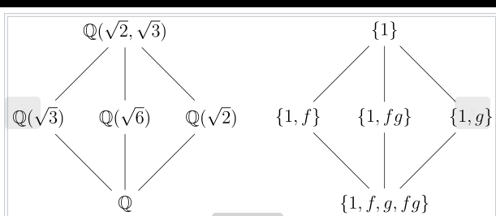

\newcommand{\dx}{\,dx}
\newcommand{\dt}{\,dt}
\newcommand{\dy}{\,dy}
\newcommand{\ds}{\,ds}
\newcommand{\dz}{\,dz}
\newcommand{\barz}{\bar{z} }
\newcommand{\dzbar}{\,d\bar{z} }
\newcommand{\zbar}{\bar{z} }
\newcommand{\du}{\,du}
\newcommand{\dw}{\,dw}
\newcommand{\dV}{\,dV}
\newcommand{\T}{\mathrm{T}}
\newcommand{\open}[1]{\overset{\circ}{#1}}
\newcommand{\textoperatorname}[1]{
  \operatorname{\textnormal{#1}}
}
\newcommand{\et}{\text{ét}}
\newcommand{\Et}{\text{Ét}}
\newcommand\stacksymbol[3]{
  \mathrel{\stackunder[2pt]{\stackon[4pt]{$#3$}{$\scriptscriptstyle#1$}}{
  $\scriptscriptstyle#2$}}
}
\renewcommand{\AA}[0]{{\mathbb{A}}}
\newcommand{\Af}[0]{{\mathbb{A}}}
\newcommand{\CC}[0]{{\mathbb{C}}}
\newcommand{\BB}[0]{{\mathbb{B}}}
\newcommand{\CP}[0]{{\mathbb{CP}}}
\newcommand{\DD}[0]{{\mathbb{D}}}
\newcommand{\FF}[0]{{\mathbb{F}}}
\newcommand{\fq}[0]{{\mathbb{F}_{q}}}
\newcommand{\fqr}[0]{{\mathbb{F}_{q^r}}}
\newcommand{\GF}[0]{{\mathbb{GF}}}
\newcommand{\GG}[0]{{\mathbb{G}}}
\newcommand{\KK}[0]{{\mathbb{K}}}
\newcommand{\kk}[0]{{\mathbb{k}}}
\newcommand{\bbm}[0]{{\mathbb{M}}}
\newcommand{\NN}[0]{{\mathbb{N}}}
\newcommand{\OP}[0]{{\mathbb{OP}}}
\newcommand{\LL}[0]{{\mathbb{L}}}
\newcommand{\PP}[0]{{\mathbb{P}}}
\newcommand{\QQ}[0]{{\mathbb{Q}}}
\newcommand{\RP}[0]{{\mathbb{RP}}}
\newcommand{\RR}[0]{{\mathbb{R}}}
\newcommand{\SpSp}[0]{{\mathbb{S}}}
\renewcommand{\SS}[0]{{\mathbb{S}}}
\newcommand{\TT}[0]{{\mathbb{T}}}
\newcommand{\ZZ}[0]{{\mathbb{Z}}}
\newcommand{\ZZG}[0]{{\mathbb{Z}G}}
\newcommand{\ZZH}[0]{{\mathbb{Z}H}}
\newcommand{\kG}[0]{{kG}}
\newcommand{\znz}[0]{\mathbb{Z}/n\mathbb{Z}}
\newcommand{\zpz}[0]{\mathbb{Z}/p\mathbb{Z}}
\newcommand{\zlz}[0]{\mathbb{Z}/\ell\mathbb{Z}}
\newcommand{\zlnz}[0]{\mathbb{Z}/\ell^n\mathbb{Z}}
\newcommand{\Qp}[0]{\mathbb{Q}_{(p)}}
\newcommand{\Zp}[0]{\mathbb{Z}_{(p)}}
\newcommand{\ZpZ}[0]{\mathbb{Z}/p}
\newcommand{\SF}[0]{\operatorname{SF}}
\newcommand{\vol}[0]{\operatorname{vol}}
\newcommand{\covol}[0]{\operatorname{covol}}
\newcommand{\Cx}[0]{\operatorname{Cx}}
\newcommand{\HF}[0]{\operatorname{HF}}
\newcommand{\CF}[0]{\operatorname{HF}}
\newcommand{\ZHS}[0]{\operatorname{ZHS}}
\newcommand{\QHS}[0]{\operatorname{QHS}}
\newcommand{\ZHB}[0]{\operatorname{ZHB}}
\newcommand{\QHB}[0]{\operatorname{QHB}}
\newcommand{\ks}[0]{\operatorname{ks}}
\newcommand{\lk}[0]{\operatorname{lk}}
\newcommand{\nd}[0]{\operatorname{nd}}
\newcommand{\Arg}[0]{\operatorname{Arg}}
\newcommand{\PGL}[0]{\operatorname{PGL}}
\newcommand{\GL}[0]{\operatorname{GL}}
\newcommand{\Gl}[0]{\operatorname{GL}}
\newcommand{\mat}[0]{\operatorname{Mat}}
\newcommand{\Mat}[0]{\operatorname{Mat}}
\newcommand{\Rat}[0]{\operatorname{Rat}}
\newcommand{\Gal}[0]{\operatorname{Gal}}
\newcommand{\Hilb}[0]{\operatorname{Hilb}}
\newcommand{\Quot}[0]{\operatorname{Quot}}
\newcommand{\Art}[0]{\operatorname{Art}}
\newcommand{\red}[0]{{ \text{red} }}
\newcommand{\Pic}[0]{{\operatorname{Pic}}}
\newcommand{\lcm}[0]{\operatorname{lcm}}
\newcommand{\maps}[0]{\operatorname{Maps}}
\newcommand{\maxspec}[0]{{\operatorname{maxSpec}}}
\newcommand{\Tr}[0]{\operatorname{Tr}}
\newcommand{\adj}[0]{\operatorname{adj}}
\newcommand{\ad}[0]{\operatorname{ad}}
\newcommand{\ann}[0]{\operatorname{Ann}}
\newcommand{\Ann}[0]{\operatorname{Ann}}
\newcommand{\arcsec}[0]{\operatorname{arcsec}}
\newcommand{\ch}[0]{\operatorname{ch}}
\newcommand{\Sp}[0]{{\operatorname{Sp}}}
\newcommand{\syl}[0]{{\operatorname{Syl}}}
\newcommand{\ff}[0]{\operatorname{ff}}
\newcommand{\txand}[0]{{\operatorname{ and }}}
\newcommand{\fppf}[0]{\mathrm{\operatorname{fppf}}}
\newcommand{\Fppf}[0]{\mathrm{\operatorname{Fppf}}}
\newcommand{\zar}[0]{{\mathrm{zar}}}
\newcommand{\afp}[0]{A_{/\FF_p}}
\newcommand{\Fp}[0]{{\FF_p}}
\newcommand{\HP}[0]{{\operatorname{HP}}}
\newcommand{\TP}[0]{{\operatorname{TP}}}
\newcommand{\HC}[0]{{\operatorname{HC}}}
\newcommand{\HH}[0]{{\mathbb{H}}}
\newcommand{\HoH}[0]{{\operatorname{HH}}}
\newcommand{\THoH}[0]{{\operatorname{THH}}}
\newcommand{\GW}[0]{{\operatorname{GW}}}
\newcommand{\TCH}[0]{{\operatorname{TCH}}}
\newcommand{\Zar}[0]{{\mathrm{Zar}}}
\newcommand{\codim}[0]{\operatorname{codim}}
\newcommand{\coim}[0]{\operatorname{coim}}
\newcommand{\dom}[0]{\operatorname{dom}}
\newcommand{\dR}[0]{\mathrm{dR}}
\newcommand{\txor}[0]{{\operatorname{ or }}}
\newcommand{\txt}[1]{{\operatorname{ {#1} }}}
\newcommand{\dcoset}[3]{
    {\textstyle #1}
    \mkern-4mu\scalebox{1.5}{$\diagdown$}\mkern-5mu^{\textstyle #2}
    \mkern-4mu\scalebox{1.5}{$\diagup$}\mkern-5mu{\textstyle #3} }
\newcommand{\grdim}[0]{{\operatorname{gr\,dim}}}
\newcommand{\Aut}[0]{{\operatorname{Aut}}}
\newcommand{\aut}[0]{\operatorname{Aut}}
\newcommand{\Inn}[0]{{\operatorname{Inn}}}
\newcommand{\Out}[0]{{\operatorname{Out}}}
\newcommand{\mltext}[1]{\left\{\begin{array}{c}#1\end{array}\right\}}
\newcommand{\SL}[0]{{\operatorname{SL}}}
\newcommand{\PSL}[0]{{\operatorname{PSL}}}
\newcommand{\SO}[0]{{\operatorname{SO}}}
\newcommand{\SU}[0]{{\operatorname{SU}}}
\newcommand{\SP}[0]{{\operatorname{SP}}}
\newcommand{\per}[0]{{\operatorname{Per}}}
\newcommand{\loc}[0]{{\operatorname{loc}}}
\newcommand{\Spin}[0]{{\operatorname{Spin}}}
\newcommand{\Sing}[0]{{\operatorname{Sing}}}
\newcommand{\sing}[0]{{\operatorname{Sing}}}
\newcommand{\Cat}[0]{\mathsf{Cat}}
\newcommand{\Fun}[0]{{\mathsf{Fun}}}
\newcommand{\mcTop}[0]{\mathcal{T}\mathsf{op}}
\newcommand{\poly}[0]{\mathsf{poly}}
\newcommand{\Vect}[0]{{\mathsf{Vect}}}
\newcommand{\Sh}[0]{{\mathsf{Sh}}}
\newcommand{\Ch}[0]{\mathsf{Ch}}
\newcommand{\Set}[0]{{\mathsf{Set}}}
\newcommand{\Sets}[0]{{\mathsf{Set}}}
\newcommand{\sets}[0]{{\mathsf{Set}}}
\newcommand{\Grp}[0]{{\mathsf{Grp}}}
\newcommand{\Groups}[0]{{\mathsf{Groups}}}
\newcommand{\Ab}[0]{{\mathsf{Ab}}}
\newcommand{\Ring}[0]{\mathsf{Ring}}
\newcommand{\CRing}[0]{\mathsf{CRing}}
\newcommand{\zmod}[0]{{\mathbb{Z}\dash\mathsf{Mod}}}
\newcommand{\rmod}[0]{{\mathsf{R}\dash\mathsf{Mod}}}
\newcommand{\liegmod}[0]{{\mathfrak{g}\dash\mathsf{Mod}}}
\newcommand{\mods}[1]{{\mathsf{#1}\dash\mathsf{Mod}}}
\newcommand{\modsright}[1]{\mathsf{Mod}\dash\mathsf{#1}}
\newcommand{\modsleft}[1]{\mathsf{#1}\dash\mathsf{Mod}}
\newcommand{\Gr}[0]{{\operatorname{Gr}}}
\newcommand{\gr}[0]{{\mathsf{gr}}}
\newcommand{\grMod}[0]{{\mathsf{grMod}}}
\newcommand{\Mod}[0]{{\mathsf{Mod}}}
\newcommand{\bimod}[2]{(\mathsf{#1}, \mathsf{#2})\dash\mathsf{biMod}}
\newcommand{\modr}[0]{{\mathsf{Mod}\dash\mathsf{R}}}
\newcommand{\mmod}[0]{{\dash\mathsf{Mod}}}
\newcommand{\kmod}[0]{{\mathsf{k}\dash\mathsf{Mod}}}
\newcommand{\kalg}[0]{{\mathsf{Alg}_{/k} }}
\newcommand{\ralg}[0]{{\mathsf{R}\dash\mathsf{Alg}}}
\newcommand{\liealg}[0]{{\mathsf{Lie}\dash\mathsf{Alg}}}
\newcommand{\alg}[0]{\mathsf{Alg}}
\newcommand{\scalg}[0]{\mathsf{sCAlg}}
\newcommand{\calg}[0]{\mathsf{CAlg}}
\newcommand{\VectBundle}[0]{{\mathsf{VectBundle}}}
\newcommand{\ssets}[0]{\mathsf{sSets}}
\newcommand{\Assoc}[0]{\mathsf{Assoc}}
\newcommand{\Unital}[0]{\mathsf{Unital}}
\newcommand{\Riem}[0]{\mathsf{Riem}}
\newcommand{\Comm}[0]{\mathsf{Comm}}
\newcommand{\Top}[0]{{\mathsf{Top}}}
\newcommand{\Mfd}[0]{{\mathsf{Mfd}}}
\newcommand{\hoTop}[0]{{\mathsf{hoTop}}}
\newcommand{\Sch}[0]{{\mathsf{Sch}}}
\newcommand{\sch}[0]{{\mathsf{Sch}}}
\newcommand{\qcoh}[0]{{\mathsf{QCoh}}}
\newcommand{\Qcoh}[0]{{\mathsf{QCoh}}}
\newcommand{\QCoh}[0]{{\mathsf{QCoh}}}
\newcommand{\Perv}[0]{\mathsf{Perv}}
\newcommand{\presh}[0]{{\mathsf{Presh}}}
\newcommand{\Presh}[0]{{\mathsf{Presh}}}

\newcommand{\Forget}[0]{{\operatorname{Forget}}}
\newcommand{\eul}[0]{{\operatorname{eul}}}
\newcommand{\ab}[0]{{\operatorname{ab}}}
\newcommand{\op}[0]{^{\operatorname{op}}}
\newcommand{\Op}[0]{{\operatorname{Op}}}
\newcommand{\Ob}[0]{{\operatorname{Ob}}}
\newcommand{\prim}[0]{{\operatorname{prim}}}
\newcommand{\Homeo}[0]{{\operatorname{Homeo}}}
\newcommand{\Diffeo}[0]{{\operatorname{Diffeo}}}
\newcommand{\MCG}[0]{{\operatorname{MCG}}}
\newcommand{\set}[0]{{\operatorname{Set}}}
\newcommand{\Tor}[0]{\operatorname{Tor}}
\newcommand{\ext}{\operatorname{Ext} }
\newcommand{\Ext}{\operatorname{Ext}}
\newcommand{\Sm}[0]{{\operatorname{Sm}}}
\newcommand{\fin}[0]{{\operatorname{fin}}}
\newcommand{\orr}[0]{{\operatorname{ or }}}
\newcommand{\annd}[0]{{\operatorname{ and }}}
\newcommand{\bung}[0]{\operatorname{Bun}_G}
\newcommand{\const}[0]{{\operatorname{const.}}}
\newcommand{\disc}[0]{{\operatorname{disc}}}
\newcommand{\discriminant}[0]{{\Delta}}
\newcommand{\id}[0]{\operatorname{id}}
\newcommand{\Id}[0]{\operatorname{Id}}
\newcommand{\im}[0]{\operatorname{im}}
\newcommand{\pt}[0]{{\{\operatorname{pt}\}}}
\newcommand{\sep}[0]{^\operatorname{sep}}
\newcommand{\tors}[0]{{\operatorname{tors}}}
\newcommand{\tor}[0]{\operatorname{Tor}}
\newcommand{\height}[0]{\operatorname{ht}}
\newcommand{\cpt}[0]{{ \text{compact} } }
\newcommand{\Kah}[0]{{ \text{Kähler} } }
\newcommand{\oriented}[0]{{ \text{oriented} } }
\newcommand\compact[0]{\text{cpt}}
\newcommand\Kahler[0]{\text{Kähler}}
\newcommand\hyp[0]{\text{hyp}}
\newcommand{\abs}[1]{{\left\lvert {#1} \right\rvert}}
\newcommand{\stack}[1]{\mathclap{\substack{ #1 }}} 
\newcommand{\qtext}[1]{{\quad \operatorname{#1} \quad}}
\newcommand{\qst}[0]{{\quad \operatorname{such that} \quad}}
\newcommand{\actsonl}[0]{\curvearrowleft}
\newcommand{\actson}[0]{\curvearrowright}
\newcommand{\bd}[0]{{\del}}
\newcommand{\bigast}[0]{{\mathop{\text{\Large $\ast$}}}}
\newcommand{\convolve}[0]{\ast}
\newcommand{\freeprod}[0]{\ast}
\newcommand{\Spinc}[0]{\mathrm{Spin}^{\mathbb{C} }}
\newcommand{\coker}[0]{\operatorname{coker}}
\newcommand{\Mor}[0]{\operatorname{Mor}}
\newcommand{\cone}[0]{\operatorname{cone}}
\newcommand{\cok}[0]{\operatorname{coker}}
\newcommand{\PD}[0]{\mathrm{PD}}
\newcommand{\conjugate}[1]{{\overline{{#1}}}}
\newcommand{\conj}[1]{{\overline{{#1}}}}
\newcommand{\converges}[1]{\overset{#1}}
\newcommand{\bundle}[1]{\mathcal{#1}}
\newcommand{\td}[0]{\mathrm{td}}
\newcommand{\correspond}[1]{\theset{\substack{#1}}}
\newcommand{\cross}[0]{\times}
\newcommand{\by}[0]{\times}
\newcommand{\dash}[0]{{\hbox{-}}}
\newcommand{\dd}[2]{{\frac{\partial #1}{\partial #2}\,}}
\newcommand{\ddd}[2]{{\frac{d #1}{d #2}\,}}
\newcommand{\definedas}[0]{\coloneqq}
\newcommand{\da}[0]{\coloneqq}
\newcommand{\del}[0]{{\partial}}
\newcommand{\directlim}[0]{\varinjlim}
\newcommand{\inverselim}[0]{\varprojlim}
\newcommand{\disjoint}[0]{{\coprod}}
\newcommand{\Disjoint}[0]{\displaystyle\coprod}
\newcommand{\dual}[0]{^\vee}
\newcommand{\sm}[0]{\setminus}
\newcommand{\smz}[0]{\setminus\theset{0}}
\newcommand{\smts}[1]{\setminus\theset{#1}}
\newcommand{\eps}[0]{\varepsilon}
\newcommand{\floor}[1]{{\left\lfloor #1 \right\rfloor}}
\newcommand{\up}[0]{\uparrow}
\newcommand{\generators}[1]{\left\langle{#1}\right\rangle}
\newcommand{\gs}[1]{\left\langle{#1}\right\rangle}
\newcommand{\homotopic}[0]{\simeq}
\newcommand{\injectivelim}[0]{\varinjlim}
\newcommand{\inner}[2]{{\left\langle {#1},~{#2} \right\rangle}}
\newcommand{\ip}[2]{{\left\langle {#1},~{#2} \right\rangle}}
\newcommand{\union}[0]{\cup}
\newcommand{\Union}[0]{\bigcup}
\newcommand{\intersect}[0]{\cap}
\newcommand{\Intersect}[0]{\bigcap}
\newcommand{\into}[0]{\to}
\newcommand{\inv}[0]{^{-1}}
\newcommand{\mfa}[0]{{\mathfrak{a}}}
\newcommand{\mfb}[0]{{\mathfrak{b}}}
\newcommand{\mfc}[0]{{\mathfrak{c}}}
\newcommand{\mff}[0]{{\mathfrak{f}}}
\newcommand{\mfi}[0]{{\mathfrak{I}}}
\newcommand{\mfm}[0]{{\mathfrak{m}}}
\newcommand{\mfn}[0]{{\mathfrak{n}}}
\newcommand{\mfp}[0]{{\mathfrak{p}}}
\newcommand{\mfq}[0]{{\mathfrak{q}}}
\newcommand{\mfr}[0]{{\mathfrak{r}}}
\newcommand{\mfs}[0]{{\mathfrak{s}}}
\newcommand{\lieg}[0]{{\mathfrak{g}}}
\newcommand{\liet}[0]{{\mathfrak{t}}}
\newcommand{\lieo}[0]{{\mathfrak{o}}}
\newcommand{\lied}[0]{{\mathfrak{d}}}
\newcommand{\liegl}[0]{{\mathfrak{gl}}}
\newcommand{\gl}[0]{{\mathfrak{gl}}}
\newcommand{\liesl}[0]{{\mathfrak{sl}}}
\newcommand{\Ug}[0]{{\mathcal{U}(\mathfrak{g}) }}
\newcommand{\Uh}[0]{{\mathcal{U}(\mathfrak{h}) }}
\newcommand{\lieb}[0]{{\mathfrak{b}}}
\newcommand{\lien}[0]{{\mathfrak{n}}}
\newcommand{\lieh}[0]{{\mathfrak{h}}}
\newcommand{\lieso}[0]{{\mathfrak{so}}}
\newcommand{\liesp}[0]{{\mathfrak{sp}}}
\newcommand{\lieu}[0]{{\mathfrak{u}}}
\newcommand{\Lie}[0]{\operatorname{Lie}}
\newcommand{\nilrad}[0]{{\mathfrak{N}}}
\newcommand{\jacobsonrad}[0]{{\mathfrak{J}}}
\newcommand{\mm}[0]{{\mathfrak{m}}}
\newcommand{\pr}[0]{{\operatorname{pr}}}
\newcommand{\mapsvia}[1]{\xrightarrow{#1}}
\newcommand{\fromvia}[1]{\xleftarrow{#1}}
\newcommand{\mapstovia}[1]{\xmapsto{#1}}
\newcommand{\ms}[0]{\xrightarrow{\sim}}
\newcommand{\from}[0]{\leftarrow}
\newcommand{\mapstofrom}[0]{\rightleftharpoons}
\newcommand{\mapscorrespond}[2]{\mathrel{\operatorname*{\rightleftharpoons}_{#2}^{#1}}}
\newcommand{\injects}[0]{\hookrightarrow}
\newcommand{\diagonal}[0]{\Delta}
\newcommand{\embeds}[0]{\hookrightarrow}
\newcommand{\embedsvia}[1]{\xhookrightarrow{#1}}
\newcommand{\injectsvia}[1]{\overset{#1}\injects}
\newcommand{\surjects}[0]{\twoheadrightarrow}
\newcommand{\surjectsvia}[2][]{
  \xrightarrow[#1]{#2}\mathrel{\mkern-14mu}\rightarrow
}
\newcommand{\adjoint}[0]{\leftrightarrows}
\newcommand{\kx}[1]{k[x_1, \cdots, x_{#1}]}
\newcommand{\kxn}[0]{k[x_1, \cdots, x_{n}]}
\newcommand{\MM}[0]{{\mathcal{M}}}
\newcommand{\OO}[0]{{\mathcal{O}}}
\newcommand{\OX}[0]{{\mathcal{O}_X}}
\newcommand{\imaginarypart}[1]{{\mathcal{Im}({#1})}}
\newcommand{\mca}[0]{{\mathcal{A}}}
\newcommand{\mcb}[0]{{\mathcal{B}}}
\newcommand{\mcc}[0]{{\mathcal{C}}}
\newcommand{\mcd}[0]{{\mathcal{D}}}
\newcommand{\mce}[0]{{\mathcal{E}}}
\newcommand{\mcf}[0]{{\mathcal{F}}}
\newcommand{\mcg}[0]{{\mathcal{G}}}
\newcommand{\mch}[0]{{\mathcal{H}}}
\newcommand{\mci}[0]{{\mathcal{I}}}
\newcommand{\mcj}[0]{{\mathcal{J}}}
\newcommand{\mck}[0]{{\mathcal{K}}}
\newcommand{\mcl}[0]{{\mathcal{L}}}
\newcommand{\mcm}[0]{{\mathcal{M}}}
\newcommand{\mcp}[0]{{\mathcal{P}}}
\newcommand{\mcs}[0]{{\mathcal{S}}}
\newcommand{\mct}[0]{{\mathcal{T}}}
\newcommand{\mcu}[0]{{\mathcal{U}}}
\newcommand{\mcv}[0]{{\mathcal{V}}}
\newcommand{\mcx}[0]{{\mathcal{X}}}
\newcommand{\mcz}[0]{{\mathcal{Z}}}
\newcommand{\kfq}[0]{K_{/\mathbb{F}_q}}
\newcommand{\cl}[0]{\operatorname{cl}}
\newcommand{\Cl}[0]{\operatorname{Cl}}
\newcommand{\St}[0]{\operatorname{St}}
\newcommand{\trdeg}[0]{\operatorname{trdeg}}
\newcommand{\dist}[0]{\operatorname{dist}}
\newcommand{\Dist}[0]{\operatorname{Dist}}
\newcommand{\crit}[0]{\operatorname{crit}}
\newcommand{\Crit}[0]{\operatorname{Crit}}
\newcommand{\diam}[0]{{\operatorname{diam}}}
\newcommand{\gal}[0]{\operatorname{Gal}}
\newcommand{\diff}[0]{\operatorname{Diff}}
\newcommand{\diag}[0]{\operatorname{diag}}
\newcommand{\soc}[0]{\operatorname{Soc}}
\newcommand{\hd}[0]{\operatorname{Head}}
\newcommand{\grad}[0]{\operatorname{grad}}
\newcommand{\hilb}[0]{\operatorname{Hilb}}
\newcommand{\minpoly}[0]{{\operatorname{minpoly}}}
\newcommand{\Frame}[0]{{\operatorname{Frame}}}
\newcommand{\Fr}[0]{{\operatorname{Fr}}}
\newcommand{\prin}[0]{{\operatorname{Prin}}}
\newcommand{\Taut}[0]{{\operatorname{Taut}}}
\newcommand{\OFrame}[0]{{\operatorname{OFrame}}}
\newcommand{\UFrame}[0]{{\operatorname{UFrame}}}
\newcommand{\smooth}[0]{{\operatorname{sm}}}
\newcommand{\shom}{ {\mathcal{H}}\kern-0.5pt{\operatorname{om}}}
\newcommand{\Hsh}{{ \mathcal{H} }}
\newcommand{\CY}{{ \text{CY} }}
\newcommand{\FS}{{ \text{FS} }}
\newcommand{\HHom}{\mathscr{H}\kern-2pt\operatorname{om}}
\newcommand{\Map}[0]{{\operatorname{Map}}}
\newcommand{\multinomial}[1]{\left(\!\!{#1}\!\!\right)}
\newcommand{\nil}[0]{{\operatorname{nil}}}
\newcommand{\normalneq}{\mathrel{\reflectbox{$\trianglerightneq$}}}
\newcommand{\normal}[0]{{~\trianglelefteq~}}
\newcommand{\norm}[1]{{\left\lVert {#1} \right\rVert}}
\newcommand{\pnorm}[2]{{\left\lVert {#1} \right\rVert}_{#2}}
\newcommand{\notimplies}[0]{\centernot\implies}
\newcommand{\onto}[0]{\twoheadhthtarrow}
\newcommand{\ord}[0]{{\operatorname{Ord}}}
\newcommand{\pic}[0]{{\operatorname{Pic}}}
\newcommand{\projectivelim}[0]{\varprojlim}
\newcommand{\rad}[0]{{\operatorname{rad}}}
\newcommand{\rank}[0]{\operatorname{rank}}
\newcommand{\realpart}[1]{{\mathcal{Re}({#1})}}
\newcommand{\Log}[0]{\operatorname{Log}}
\newcommand{\reg}[0]{\operatorname{Reg}}
\newcommand{\restrictionof}[2]{ {\left.{{#1}} \right|_{{#2}} } }
\newcommand{\ro}[2]{{ \left.{{#1}} \right|_{{#2}} }}
\newcommand{\rk}[0]{{\operatorname{rank}}}
\newcommand{\evalfrom}[0]{\Big|}
\renewcommand{\mod}{\pmod}
\newcommand{\rotate}[2]{{\style{display: inline-block; transform: rotate(#1deg)}{#2}}}
\newcommand{\selfmap}[0]{{\circlearrowleft}}
\newcommand{\semidirect}[0]{\rtimes}
\newcommand{\sgn}[0]{\operatorname{sgn}}
\newcommand{\sign}[0]{\operatorname{sign}}
\newcommand{\spanof}[0]{{\operatorname{span}}}
\newcommand{\spec}[0]{\operatorname{Spec}}
\newcommand{\mspec}[0]{\operatorname{mSpec}}
\newcommand{\Jac}[0]{\operatorname{Jac}}
\newcommand{\stab}[0]{{\operatorname{Stab}}}
\newcommand{\stirlingfirst}[2]{\genfrac{[}{]}{0pt}{}{#1}{#2}}
\newcommand{\stirling}[2]{\genfrac\{\}{0pt}{}{#1}{#2}}
\newcommand{\strike}[1]{{\enclose{horizontalstrike}{#1}}}
\newcommand{\st}[0]{{~\mathrel{\Big|}~}}
\newcommand{\supp}[0]{{\operatorname{supp}}}
\newcommand{\sym}[0]{\operatorname{Sym}}
\newcommand{\Sym}[0]{\operatorname{Sym}}
\newcommand{\Wedge}[0]{\bigwedge}
\newcommand{\wedgeprod}[0]{\vee}
\newcommand{\Wedgeprod}[0]{\bigvee}
\newcommand{\Vee}[0]{\bigvee}
\newcommand{\tensor}[0]{\otimes}
\newcommand\mypound{\scalebox{0.8}{\raisebox{0.4ex}{\#}}}
\newcommand{\connectsum}[0]{\mathop{ \Large\mypound }}
\newcommand{\theset}[1]{\left\{{#1}\right\}}
\newcommand{\ts}[1]{\left\{{#1}\right\}}
\newcommand{\infsum}[1]{\sum_{{#1=0}}^\infty}
\newcommand{\gens}[1]{\left\langle{#1}\right\rangle}
\newcommand{\thevector}[1]{{\left[ {#1} \right]}}
\newcommand{\tv}[1]{{\left[ {#1} \right]}}
\newcommand{\too}[1]{{\xrightarrow{#1}}}
\newcommand{\transverse}[0]{\pitchfork}
\newcommand{\trianglerightneq}{\mathrel{\ooalign{\raisebox{-0.5ex}{\reflectbox{\rotatebox{90}{$\nshortmid$}}}\cr$\triangleright$\cr}\mkern-3mu}}
\newcommand{\tr}[0]{\operatorname{Tr}}
\newcommand{\uniformlyconverges}[0]{\rightrightarrows}
\newcommand{\abuts}[0]{\Rightarrow}
\newcommand{\covers}[0]{\rightrightarrows}
\newcommand{\units}[0]{^{\times}}
\newcommand{\nonzero}[0]{^{\bullet}}
\newcommand{\wait}[0]{{-}}
\newcommand{\wt}[0]{{\operatorname{wt}}}
\renewcommand{\bar}[1]{\mkern 1.5mu\overline{\mkern-1.5mu#1\mkern-1.5mu}\mkern 1.5mu}
\renewcommand{\div}[0]{\operatorname{Div}}
\newcommand{\Div}[0]{\operatorname{Div}}
\newcommand{\Prin}[0]{\operatorname{Prin}}
\newcommand{\Frac}[0]{\operatorname{Frac}}
\renewcommand{\hat}[1]{\widehat{#1}}
\newcommand{\fourier}[1]{\widehat{#1}}
\renewcommand{\mid}[0]{\mathrel{\Big|}}
\renewcommand{\qed}[0]{\hfill\blacksquare}
\renewcommand{\too}[0]{\longrightarrow}
\renewcommand{\vector}[1]{\mathbf{#1}}
\newcommand{\complex}[1]{{#1}_{*}}
\newcommand*\dif{\mathop{}\!\operatorname{d}}
\newcommand{\ddt}{\tfrac{\dif}{\dif t}}
\newcommand{\ddx}{\tfrac{\dif}{\dif x}}
\renewcommand{\labelitemiii}{$\diamondsuit$}
\renewcommand{\labelitemiv}{$\diamondsuit$}
\newcommand\vecc[2]{\textcolor{#1}{\textbf{#2}}}
\newcommand*{\vertbar}{\rule[-1ex]{0.5pt}{2.5ex}}
\newcommand*{\horzbar}{\rule[.5ex]{2.5ex}{0.5pt}}
\newcommand\aug{\fboxsep=-\fboxrule\!\!\!\fbox{\strut}\!\!\!}
\newcommand\rref{\operatorname{RREF}}
\newcommand{\interior}[0]{^\circ}
\newcommand{\increasesto}[0]{\nearrow}
\newcommand{\decreasesto}[0]{\searrow}
\newcommand\jan{\operatorname{Jan}}
\DeclareMathOperator{\righttriplearrows} {{\; \tikz{ \foreach \y in {0, 0.1, 0.2} { \draw [-stealth] (0, \y) -- +(0.5, 0);}} \; }}
\DeclareMathOperator{\Exists}{\exists}
\DeclareMathOperator{\Forall}{\forall}
\DeclarePairedDelimiter{\ceil}{\lceil}{\rceil}
\DeclareMathOperator*{\hocolim}{hocolim}
\DeclareMathOperator*{\mapbackforth}{\rightleftharpoons}
\DeclareMathOperator*{\eq}{=}
\DeclareMathOperator{\Endo}{End}
\DeclareMathOperator{\Hom}{Hom}
\DeclareMathOperator{\proj}{Proj}
\DeclareMathOperator{\Proj}{Proj}
\DeclareMathOperator{\Hol}{Hol}
\DeclareMathOperator{\Bun}{Bun}
\DeclareMathOperator{\BiHol}{BiHol}
\DeclareMathOperator{\Br}{Br}
\DeclareMathOperator{\coh}{coh}
\DeclareMathOperator{\colspace}{colspace}
\DeclareMathOperator{\rowspace}{rowspace}
\DeclareMathOperator{\codom}{codom}
\DeclareMathOperator{\range}{range}
\DeclareMathOperator{\nullspace}{nullspace}
\DeclareMathOperator{\nullity}{nullspace}
\DeclareMathOperator{\projection}{Proj}
\DeclareMathOperator{\Der}{Der}
\DeclareMathOperator{\len}{len}
\newcommand{\Suchthat}[0]{\middle\vert}
\newcommand{\suchthat}[0]{{~\mathrel{\Big|}~}}
\newcommand{\delbar}[0]{\bar{\del}}

\newcommand{\contains}[0]{\supseteq}
\newcommand{\containing}[0]{\supseteq}

\newcommand{\cat}[1]{\mathcal{#1}}
\newcommand{\thecat}[1]{\mathbf{#1}}
\newcommand{\sheaf}[1]{\operatorname{\mathcal{#1}}}

\newcommand\rrarrows{\rightrightarrows}
\newcommand\rrrarrows{
    \mathrel{\substack{\textstyle\rightarrow\\[-0.6ex]
        \textstyle\rightarrow \\[-0.6ex]
        \textstyle\rightarrow}}
}

\newcommand\colim{\mathop{\mathrm{colim}}\nolimits}

\newcommand\fp[1]{\underset{\scriptscriptstyle {#1} }{\times}}
\newcommand\ul[1]{\underline{#1}}
\newcommand\constantsheaf[1]{\underline{#1}}
\newcommand\holomorphic[0]{\text{holo}}
\newcommand\std[0]{\text{std}}
\newcommand\Mero[0]{\operatorname{Mero}}
\newcommand\even[0]{\text{even}}
\newcommand\odd[0]{\text{odd}}
\newcommand\hodgestar[0]{\star}
\newcommand\stardstar[0]{\hodgestar {d} \mkern-5mu \hodgestar}
\newcommand\covariant[0]{\nabla}
\newcommand\ol[1]{\overline{#1}}
\newcommand\univcover[1]{\overline{#1}}
\newcommand\closure[1]{\overline{#1}}
\newcommand\capprod{\frown}
\newcommand\cupprod{\smile}
\newcommand\Path{\mathcal{P}}
\newcommand\gradient{\nabla}

\newcommand\Hc[0]{{\check{H}}}
\newcommand\Cc[0]{{\check{C}}}
\newcommand\cupp[0]{\smile}
\newcommand\capp[0]{\frown}
\newcommand\sig[0]{\operatorname{sig}}
\newcommand\ev[0]{\operatorname{ev}}

\newcommand{\RM}[1]{%
  \textup{\uppercase\expandafter{\romannumeral#1}}%
}
\newcommand{\divides}{\bigm|}
\newcommand{\notdivides}{%
  \mathrel{\mkern.5mu % small adjustment
    % superimpose \nmid to \big|
    \ooalign{\hidewidth$\big|$\hidewidth\cr$\nmid$\cr}%
  }%
}
\newcommand{\fractional}[1]{\theset{#1}}
\newcommand{\fractionalpart}[1]{\theset{#1}}
\newcommand{\integerpart}[1]{\left[ {#1}\right] }
\newcommand{\zadjoin}[1]{\mathbb{Z}\left[ {#1} \right]}
\newcommand{\Wedgepower}[0]{\bigwedge\nolimits}
\newcommand{\Bl}[0]{\operatorname{Bl}}
\newcommand{\Triv}[0]{{ \operatorname{Triv}}}
\def\multichoose#1#2{{\left(\kern-.3em\left(\genfrac{}{}{0pt}{}{#1}{#2}\right)\kern-.3em\right)}}
\newcommand\elts[2]{{ {#1}_1, {#1}_2, \cdots, {#1}_{#2}}}

\newcommand{\Tot}[0]{\operatorname{Tot}}
\newcommand{\Totsum}[0]{\Tot^{\oplus}}
\newcommand{\Totprod}[0]{\Tot^{\Pi}}
\newcommand{\equalsbecause}[1]{\overset{#1}{=}}
\newcommand{\congbecause}[1]{\overset{#1}{\cong}}
\newcommand{\ideal}[1]{\mathcal{#1}}
\newcommand{\forget}[0]{\mathrm{Forget}}
\newcommand{\adjoin}[1]{ { \left[ {#1} \right] } }
\newcommand{\xpn}[0]{ { x^{p^n} } }

\newcommand{\cores}[0]{\operatorname{cores}}
\newcommand{\res}[0]{\operatorname{res}}
\newcommand{\Res}[0]{\operatorname{Res}}
\newcommand{\infl}[0]{\operatorname{inf}}
\newcommand{\coinfl}[0]{\operatorname{coinf}}
\newcommand{\ind}[0]{\operatorname{ind}}
\newcommand{\Ind}[0]{\operatorname{Ind}}
\newcommand{\Coind}[0]{\operatorname{coInd}}

\newcommand{\submfds}{\operatorname{SubMfds}}

\newcommand{\quotright}[2]{ {}^{#1}\mkern-2mu/\mkern-2mu_{#2} }
\newcommand{\quotleft}[2]{ {}_{#2}\mkern-.5mu\backslash\mkern-2mu^{#1} }

# Group Theory: General

## Spring 2020 #2 $\work$
Let $H$ be a normal subgroup of a finite group $G$ where the order of $H$ and the index of $H$ in $G$ are relatively prime.
Prove that no other subgroup of $G$ has the same order as $H$.

\todo[inline]{Work this problem.}

## Spring 2019 #4 $\done$
For a finite group $G$, let $c(G)$ denote the number of conjugacy classes of $G$.

a.
Prove that if two elements of $G$ are chosen uniformly at random,then the probability they commute is precisely
$$
\frac{c(G)}{\abs G}
.$$

b.
State the class equation for a finite group.

c.
Using the class equation (or otherwise) show that the probability in part (a) is at most $$
\frac 1 2 + \frac 1 {2[G : Z(G)]}
.$$

> Here, as usual, $Z(G)$ denotes the center of $G$.

:::{.solution}
\envlist

\envlist
:::{.concept}
\envlist

- Notation: $X/G$ is the set of $G\dash$orbits
- Notation: $X^g = \theset{x\in x\suchthat g\cdot x = x}$
- Burnside's formula: $\abs G \abs{X/G} = \sum \abs {X^g}$.

:::

:::{.proof title="Part a"}
Strategy: Burnside.

- Define a sample space $\Omega = G \cross G$, so $\abs{\Omega} = \abs{G}^2$.

- Identify the event we want to analyze: $A \definedas \theset{(g,h) \in G\cross G \suchthat [g,h] = 1}$.
  - Define and note: 
    \[
    A_g \definedas \theset{(g, h) \suchthat h\in H, [g, h] = 1} \implies A = \disjoint_{g\in G} A_g
    .\]

- Set $n$ be the number of conjugacy classes, note we want to show $P(A) = n / \abs{G}$.
 
- Let $G$ act on itself by conjugation, which partitions $G$ into conjugacy classes.

  - What are the orbits? 
    $$
    \mathcal{O}_g = \theset{hgh\inv \suchthat h\in G}
    ,$$ 
    which is the conjugacy class of $g$.

  - What are the fixed points? 
    $$X^g = \theset{h\in G \suchthat hgh\inv = g},$$ 
    which are the elements of $G$ that commute with $g$, which is precisely $A_g$.

- Note $\abs{X/G} = n$, the number of conjugacy classes.

- Note that 
  $$
  \abs{A} = \abs{\disjoint_{g\in G} A_g} = \sum_{g\in G} \abs{A_g} = \sum_{g\in G}\abs{X^g}
  .$$

- Apply Burnside
$$
\abs{X / G} = \frac { 1 } { | G | } \sum _ { g \in G } \left| X ^ { g } \right|,
$$
- Rearrange and use definition:
$$
n \abs{G}
= \abs{X/G} \abs{G}
= \sum _ { g \in G } \left| X ^ { g } \right|
$$
- Compute probability:
\[
P(A)
= {\abs A \over \abs \Omega} 
= \frac{\sum_{ g \in G } \left| X ^ { g } \right|}{\abs{G}^2} 
= \frac{\abs{X/G}\abs{G}}{\abs{G}^2} 
= \frac{n \abs{G}}{\abs{G}^2} 
= \frac n {\abs G}
.\]

:::

:::{.proof title="Part b"}
Statement of the class equation:
\[
\abs G = Z(G) + \sum_{\substack{\text{One $x$ from each} \\ \text{conjugacy class}}}[G: Z(x)]
\]
where $Z(x) = \theset{g\in G \suchthat [g, x] = 1}$.
:::

:::{.proof title="Part c"}
As shown in part 1,
$$
\mathcal{O}_x = \theset{g\actson x \suchthat g\in G} = \theset{h\in G \suchthat ghg\inv = h} = C_G(g)
,$$
and by the class equation

$$
\abs{G} = \abs{Z(G)} + \sum_{\substack{\text{One $x$ from each} \\ \text{conjugacy class}}}[G: Z(x)]
$$

Now note

- Each element of $Z(G)$ is in its own conjugacy class, contributing $\abs{Z(G)}$ classes to $n$.

- Every other class of elements in $G\setminus Z(G)$ contains at least 2 elements
  - Claim: each such class contributes **at least** $\frac 1 2 \abs{G \setminus Z(G)}$.

Thus
\[
n &\leq \abs{Z(G)} + \frac 1 2\abs{G \setminus Z(G)} \\
&= \abs{Z(G)} + \frac 1 2\abs{G} - \frac 1 2 \abs{Z(G)} \\
&= \frac 1 2 \abs{G} + \frac 1 2 \abs{Z(G)} \\
\\
\implies \frac n {\abs G}
&\leq \frac 1 2 \frac{\abs{G}}{\abs{G}}  + \frac 1 2 \frac{\abs{Z(G)}}{\abs{G}} \\
&= \frac 1 2 + \frac 1 2 \frac 1 {[G: Z(G)]}
.\]

:::

\todo[inline]{Redo part c}

:::

## Spring 2012 #2 $\work$
Let $G$ be a finite group and $p$ a prime number such that there is a normal subgroup $H\normal G$ with $\abs{H} = p^i > 1$.

a.
Show that $H$ is a subgroup of any Sylow $p\dash$subgroup of $G$.

b.
Show that $G$ contains a nonzero abelian normal subgroup of order divisible by $p$.

## Spring 2017 #1 $\work$
Let $G$ be a finite group and $\pi: G\to \sym(G)$ the Cayley representation.

> (Recall that this means that for an element $x\in G$, $\pi(x)$ acts by left translation on $G$.)

Prove that $\pi(x)$ is an odd permutation $\iff$ the order $\abs{\pi(x)}$ of $\pi(x)$ is even and $\abs{G} / \abs{\pi(x)}$ is odd.

## Fall 2016 #1 $\work$
Let $G$ be a finite group and $s, t\in G$ be two distinct elements of order 2.
Show that subgroup of $G$ generated by $s$ and $t$ is a dihedral group.

> Recall that the dihedral groups of order $2m$ for $m\geq 2$ are of the form
\[
D_{2m} = \gens{\sigma, \tau \suchthat \sigma^m = 1 = \tau^2, \tau \sigma = \sigma\inv \tau}
.\]

## Fall 2015 #1 $\work$
Let $G$ be a group containing a subgroup $H$ not equal to $G$ of finite index.
Prove that $G$ has a normal subgroup which is contained in every conjugate of $H$ which is of finite index.

## Spring 2015 #1 $\work$
For a prime $p$, let $G$ be a finite $p\dash$group and let $N$ be a normal subgroup of $G$ of order $p$.
Prove that $N$ is contained in the center of $G$.

## Fall 2014 #6 $\work$
Let $G$ be a group and $H, K < G$ be subgroups of finite index.
Show that
\[
[G: H\intersect K] \leq [G: H] ~ [G:K]
.\]

## Spring 2013 #3 $\work$
Let $P$ be a finite $p\dash$group.
Prove that every nontrivial normal subgroup of $P$ intersects the center of $P$ nontrivially.

## Fall 2019 Midterm #1  $\work$
Let $G$ be a group of order $p^2q$ for $p, q$ prime. Show that $G$ has a nontrivial normal subgroup.

## Fall 2019 Midterm #4 $\work$
Let $p$ be a prime. Show that $S_p = \gens{\tau, \sigma}$ where $\tau$ is a transposition and $\sigma$ is a $p\dash$cycle.

## Fall 2019 Midterm #5 $\work$
Let $G$ be a nonabelian group of order $p^3$ for $p$ prime. Show that $Z(G) = [G, G]$.

## Spring 2021 #2 $\work$

Let $H \normal G$ be a normal subgroup of a finite group $G$, where the order of $H$ is the smallest prime $p$ dividing $\abs{G}$.
Prove that $H$ is contained in the center of $G$.

# Groups: Sylow Theory

## Fall 2019 #1 $\done$
Let $G$ be a finite group with $n$ distinct conjugacy classes.
Let $g_1 \cdots g_n$ be representatives of the conjugacy classes of $G$.
Prove that if $g_i g_j = g_j g_i$ for all $i, j$ then $G$ is abelian.

:::{.solution}

\envlist

:::{.concept}
\envlist

- Centralizer: 
  \[
  C_G(h) = Z(h) = \theset{g\in G \suchthat [g,h] = 1}
  \quad\text{Centralizer}
\]
- Class equation: 
  \[
  \abs{G} = \sum_{\substack{\text{One $h$ from each } \\ \text{ conjugacy class}}} \frac{\abs{G}}{\abs{Z(h)}}
  \]
- Notation:
  \[
  h^g &= ghg\inv \\
  h^G &= \theset{ h^g \suchthat g\in G} \quad\text{Conjugacy Class}\\
  H^g &= \theset{h^g \suchthat h\in H} \\
  N_G(H) &= \theset{g\in G \suchthat H^g = H} \supseteq H \quad\text{Normalizer}
  .\]

:::

:::{.claim title="1"}
\[
\abs{h^G} = [G: Z(h)]
.\]
:::

:::{.claim title="2"}
\[
\abs{\theset{H^g \suchthat g\in G}} = [G: N_G(H)]
.\]
:::

:::{.proof title="?"}
\envlist

- Let $G\actson \theset{H \suchthat H \leq G}$ by $H \mapsto gHg\inv$.
- Then the $\mathcal O_H$ is the set of conjugate subgroups, $\mathrm{Stab}(H) = N_G(H)$.
- So Orbit-Stabilizer says $\mathcal O_h \cong G/\mathrm{Stab}(H)$; then just take sizes.

:::

:::{.claim title="3"}
$\union_{g\in G} H^g = \union_{g\in G} gHg\inv \subsetneq G$ for any proper $H \leq G$.
:::

:::{.proof title="?"}
- By theorem 2, since each coset is of size $\abs{H}$, which only intersect at the identity, and there are exactly $[G: N_G(H)]$ of them
  \[
  \abs{\union_{g\in G} H^g} 
  &= \qty{ \abs{H} - 1} [G: N_G(H)] + 1\\
  &= \abs{H} [G: N_G(H)]  - [G:N_G(H)] + 1\\
  &= \abs{G} \frac{\abs G}{\abs{N_G(H)}} - \frac{\abs G}{\abs{N_G(H)}} + 1 \\
  &\leq \abs{H} \frac{\abs G}{\abs{H}} - \frac{\abs G}{\abs{H}} + 1 \\
  &= \abs{G} - ([G: H] - 1) \\
  &< \abs{G} 
  ,\]
  where we use the fact that $H \subseteq N_G(H) \implies \abs{H} \leq \abs{N_G(H)} \implies \frac{1}{\abs{N_G(H)}} \leq \frac{1}{\abs{H}}$, and since $H < G$ is proper, $[G:H] \geq 2$.

- Since $[g_i, g_j] = 1$, we have $g_i \in Z(g_j)$ for every $i, j$.

- Then
  \[
  g\in G 
  &\implies g = g_i^h \quad \text{ for some } h \\
  &\implies g \in Z(g_\mathbf{j})^h \quad\text{for every } j \text{ since }g_i \in Z(g_j) ~\forall j \\
  &\implies g \in \union_{h\in G} Z(g_j)^h \quad\text{for every } j\\
  &\implies G \subseteq \union_{h\in G} Z(g_j)^h \quad\text{for every } j
  ,\]

  which by Theorem 3, if $Z(g_j) < G$ were proper, then the RHS is properly contained in $G$. 
- So it must be the case that that $Z(g_j)$ is not proper and thus equal to $G$ for every $j$.

- But $Z(g_i) = G \iff g_i \in Z(G)$, and so each conjugacy class is size one.
- So for every $g\in G$, we have $g = g_j$ for some $j$, and thus $g = g_j \in Z(g_j) = Z(G)$, so $g$ is central.
- Then $G\subseteq Z(G)$ and $G$ is abelian.

:::

:::

## Fall 2019 Midterm #2 $\work$
Let $G$ be a finite group and let $P$ be a sylow $p\dash$subgroup for $p$ prime. Show that $N(N(P)) = N(P)$ where $N$ is the normalizer in $G$.

## Fall 2013 #2 $\work$
Let $G$ be a group of order 30.

a.
Show that $G$ has a subgroup of order 15.

b.
Show that every group of order 15 is cyclic.

c.
Show that $G$ is isomorphic to some semidirect product $\ZZ_{15} \semidirect \ZZ_2$.

d.
Exhibit three nonisomorphic groups of order 30 and prove that they are not isomorphic.
You are not required to use your answer to (c).

## Spring 2014 #2 $\work$
Let $G\subset S_9$ be a Sylow-3 subgroup of the symmetric group on 9 letters.

a.
Show that $G$ contains a subgroup $H$ isomorphic to $\ZZ_3 \cross \ZZ_3 \cross \ZZ_3$ by exhibiting an appropriate set of cycles.

b.
Show that $H$ is normal in $G$.

c.
Give generators and relations for $G$ as an abstract group, such that all generators have order 3.
Also exhibit elements of $S_9$ in cycle notation corresponding to these generators.

d.
Without appealing to the previous parts of the problem, show that $G$ contains an element of order 9.

## Fall 2014 #2 $\work$
Let $G$ be a group of order 96.

a.
Show that $G$ has either one or three 2-Sylow subgroups.

b.
Show that either $G$ has a normal subgroup of order 32, or a normal subgroup of order 16.

## Spring 2016 #3 $\work$

a.
State the three Sylow theorems.

b.
Prove that any group of order 1225 is abelian.

c.
Write down exactly one representative in each isomorphism class of abelian groups of order 1225.

## Spring 2017 #2 $\work$

a.
How many isomorphism classes of abelian groups of order 56 are there?
Give a representative for one of each class.

b.
Prove that if $G$ is a group of order 56, then either the Sylow-2 subgroup or the Sylow-7 subgroup is normal.

c.
Give two non-isomorphic groups of order 56 where the Sylow-7 subgroup is normal and the Sylow-2 subgroup is *not* normal.
Justify that these two groups are not isomorphic.

## Fall 2017 #2 $\work$

a.
Classify the abelian groups of order 36.

  > For the rest of the problem, assume that $G$ is a non-abelian group of order 36. 
  > You may assume that the only subgroup of order 12 in $S_4$ is $A_4$ and that $A_4$ has no subgroup of order 6.

b.
Prove that if the 2-Sylow subgroup of $G$ is normal, $G$ has a normal subgroup $N$ such that $G/N$ is isomorphic to $A_4$.

c.
Show that if $G$ has a normal subgroup $N$ such that $G/N$ is isomorphic to $A_4$ and a subgroup $H$ isomorphic to $A_4$ it must be the direct product of $N$ and $H$.

d.
Show that the dihedral group of order 36 is a non-abelian group of order 36 whose Sylow-2 subgroup is not normal.

## Fall 2012 #2 $\work$
Let $G$ be a group of order 30.

a.
Show that $G$ contains normal subgroups of orders 3, 5, and 15.

b.
Give all possible presentations and relations for $G$.

c.
Determine how many groups of order 30 there are up to isomorphism.

## Fall 2018 #1 $\done$ 
Let $G$ be a finite group whose order is divisible by a prime number $p$.
Let $P$ be a normal $p\dash$subgroup of $G$
(so $\abs P = p^c$ for some $c$).

a.
Show that $P$ is contained in every Sylow $p\dash$subgroup of $G$.

b.
Let $M$ be a maximal proper subgroup of $G$. Show that either $P \subseteq M$ or $|G/M | = p^b$ for some $b \leq c$.

:::{.solution}
\envlist

:::{.concept}
\envlist

- Sylow 2: All Sylow $p\dash$subgroups are conjugate.
- $\abs{HK} = \abs{H} \abs{K} / \abs{H\intersect K}$.
- Lagrange's Theorem: $H\leq G \implies \abs{H} \divides \abs{G}$

:::

:::{.proof title="of a"}
\envlist

- Every $p\dash$subgroup is contained in some Sylow $p\dash$subgroup, so $P \subseteq S_p^i$ for some $S_p^i \in \mathrm{Syl}_p(G)$.

- $P \normal G \iff gPg\inv = P$ for all $g\in G$.

- Let $S_p^j$ be any other Sylow $p\dash$subgroup, 
- Since Sylow $p\dash$subgroups are all conjugate $gS_p^i g\inv = S_p^j$ for *some* $g\in G$.

- Then 
\[
P = gPg\inv \subseteq gS_p^i g\inv = S_p^j
.\]

:::

:::{.proof title="of b"}
\envlist

- If $P$ is not contained in $M$, then $M < MP$ is a proper subgroup
- By maximality of $M$, $MP = G$
- Note that $M\intersect P \leq P$ and $\abs{P} = p^c$ implies $\abs{M\intersect P} = p^a$ for some $a\leq c$ by Lagrange
- Then write
  \[
  G = MP
  &\iff \abs{G} = \frac{\abs{M} \abs{P}}{\abs{M\intersect P}} \\ \\
  &\iff { \abs{G} \over \abs{M}} = {\abs{P}  \over \abs{M\intersect P}} = {p^c \over p^a} = p^{c-a} \definedas p^b
  \]

  where $a\leq c \implies 0 \leq c-b \leq c$ so $0\leq b \leq c$.

:::

:::

## Fall 2019 #2  $\done$
Let $G$ be a group of order 105 and let $P, Q, R$ be Sylow 3, 5, 7 subgroups respectively.

a.
Prove that at least one of $Q$ and $R$ is normal in $G$.

b.
Prove that $G$ has a cyclic subgroup of order 35.

c.
Prove that both $Q$ and $R$ are normal in $G$.

d.
Prove that if $P$ is normal in $G$ then $G$ is cyclic.

:::{.solution}
\envlist

:::{.concept}
\envlist

- The $pqr$ theorem.
- Sylow 3: $\abs{G} = p^n m$ implies $n_p \divides m$ and $n_p \cong 1 \mod p$.

- **Theorem**: If $H, K \leq G$ and any of the following conditions hold, $HK$ is a subgroup:
  - $H\normal G$ (wlog)
  - $[H, K] = 1$
  - $H \leq N_G(K)$ 

- **Theorem**: For a positive integer $n$, all groups of order $n$ are cyclic $\iff n$ is
squarefree and, for each pair of distinct primes $p$ and $q$ dividing $n$, $q - 1 \neq 0 \mod p$.

- **Theorem:** 
\[
A_i\normal G, \quad G = A_1 \cdots A_k,\quad A_k \intersect \prod_{i\neq k} A_i = \emptyset \implies G = \prod A_i
.\]

- The intersection of subgroups is a again a subgroup.
- Any subgroups of coprime order intersect trivially?

:::

:::{.proof title="of 1"}
We have 

- $n_3 \divides 5\cdot 7, \quad n_3 \cong 1 \mod 3 \implies n_3 \in \theset{1, 5, 7, 35} \setminus \theset{5, 35}$
- $n_5 \divides 3\cdot 7, \quad n_5 \cong 1 \mod 5 \implies n_5 \in \theset{1, 3, 7, 21}\setminus \theset{3, 7}$
- $n_7 \divides 3\cdot 5, \quad n_7 \cong 1 \mod 7 \implies n_7 \in \theset{1, 3, 5, 15}\setminus\theset{3, 5}$

Thus
\[
n_3 \in \theset{1, 7} \quad n_5 \in \theset{1, 21} \quad n_7 \in \theset{1, 15}
.\]

Toward a contradiction, if $n_5\neq 1$ and $n_7 \neq 1$, then 
\[
\abs{\syl(5) \union \syl(7)} = (5-1)n_5 + (7-1)n_7 + 1 
&= 4(21) + 6(15) = 174 > 105 \text{ elements}
\]
using the fact that Sylow $p\dash$subgroups for distinct primes $p$ intersect trivially (?).

:::

:::{.proof title="of 2"}
By (a), either $Q$ or $R$ is normal.
Thus $QR \leq G$ is a subgroup, and it has order $\abs{Q} \cdot \abs{R} = 5\cdot 7 = 35$.

By the $pqr$ theorem, since $5$ does not divide $7-1=6$, $QR$ is cyclic.

:::

\todo[inline]{Part (b) not finished!}

:::{.proof title="of 3"}
We want to show $Q, R\normal G$, so we proceed by showing $\textbf{not }\qty{n_5 = 21 \text{ or } n_7 = 15}$, which is equivalent to $\qty{n_5 = 1 \text{ and } n_7 = 1}$ by the previous restrictions.

Note that we can write
\[
G = \theset{\text{elements of order } n} \disjoint \theset{\text{elements of order not } n}
.\]
for any $n$, so we count for $n=5, 7$:

- Elements in $QR$ of order **not** equal to 5: $\abs{QR - Q\theset{\id} + \theset{\id}} = 35 - 5 + 1 = 31$
- Elements in $QR$ of order **not** equal to 7: $\abs{QR - \theset{\id}R + \theset{\id}} = 35 - 7 + 1 = 29$

Since $QR \leq G$, we have

- Elements in $G$ of order **not** equal to 5 $\geq 31$.
- Elements in $G$ of order **not** equal to 7 $\geq 29$.

Now both cases lead to contradictions:

- $n_5 = 21$:
\[
\abs{G}  &= \abs{\theset{\text{elements of order } 5} \disjoint \theset{\text{elements of order not } 5}} \\
&\geq n_5(5-1) + 31 = 21(4) + 31 = 115 > 105 = \abs{G}
.\]

- $n_7 = 15$:
\[
\abs{G}  &= \abs{\theset{\text{elements of order } 7} \disjoint \theset{\text{elements of order not } 7}} \\
&\geq n_7(7-1) + 29 = 15(6) + 29 = 119 > 105 = \abs{G}
.\]

:::

:::{.proof title="of 4"}
Suppose $P$ is normal and recall $\abs{P} = 3, \abs{Q} = 5, \abs{R} = 7$.

- $P\intersect QR = \theset{e}$ since $(3, 35) = 1$ 
- $R\intersect PQ = \theset{e}$ since $(5, 21) = 1$ 
- $Q\intersect RP = \theset{e}$ since $(7, 15) = 1$ 

We also have $PQR = G$ since $\abs{PQR} = \abs{G}$ (???).

We thus have an internal direct product 
\[
G \cong P\cross Q \cross R \cong \ZZ_3 \cross \ZZ_5 \cross \ZZ_7 \cong \ZZ_{105}
.\]
by the Chinese Remainder Theorem, which is cyclic.

:::

:::

## Spring 2021 #3 $\work$

a. Show that every group of order $p^2$ with $p$ prime is abelian.

b. State the 3 Sylow theorems.

c. Show that any group of order $4225 = 5^2 13^2$ is abelian.

d. Write down one representative from each isomorphism class of abelian groups of order 4225.

## Fall 2020 #1 $\work$

a. Using Sylow theory, show that every group of order $2p$ where $p$ is prime is not simple.

b. Classify all groups of order $2p$ and justify your answer.
  For the nonabelian group(s), give a presentation by generators and relations.

## Fall 2020 #2 $\work$

Let $G$ be a group of order 60 whose Sylow 3-subgroup is normal.

a. Prove that $G$ is solvable.

b. Prove that the Sylow 5-subgroup is also normal.

# Groups: Group Actions

## Fall 2012 #1 $\work$
Let $G$ be a finite group and $X$ a set on which $G$ acts.

a.
Let $x\in X$ and $G_x \definedas \theset{g\in G \suchthat g\cdot x = x}$. 
Show that $G_x$ is a subgroup of $G$.

b.
Let $x\in X$ and $G\cdot x \definedas \theset{g\cdot x \suchthat g\in G}$.
Prove that there is a bijection between elements in $G\cdot x$ and the left cosets of $G_x$ in $G$.

## Fall 2015 #2 $\work$
Let $G$ be a finite group, $H$ a $p\dash$subgroup, and $P$ a sylow $p\dash$subgroup for $p$ a prime.
Let $H$ act on the left cosets of $P$ in $G$ by left translation.

Prove that this is an orbit under this action of length 1.

Prove that $xP$ is an orbit of length 1 $\iff H$ is contained in $xPx\inv$.

## Spring 2016 #5 $\work$
Let $G$ be a finite group acting on a set $X$.
For $x\in X$, let $G_x$ be the stabilizer of $x$ and $G\cdot x$ be the orbit of $x$.

a.
Prove that there is a bijection between the left cosets $G/G_x$ and $G\cdot x$.

b.
Prove that the center of every finite $p\dash$group $G$ is nontrivial by considering that action of $G$ on $X=G$ by conjugation.

## Fall 2017 #1 $\work$
Suppose the group $G$ acts on the set $A$. 
Assume this action is faithful (recall that this means that the kernel of the homomorphism from $G$ to $\sym(A)$ which gives the action is trivial) and transitive (for all $a, b$ in $A$, there exists $g$ in $G$ such that $g \cdot a = b$.)

a.
For $a \in A$, let $G_a$ denote the stabilizer of $a$ in $G$. 
Prove that for any $a \in A$, 
$$
\Intersect_{\sigma\in G} \sigma G_a \sigma\inv = \theset{1}
.$$

b.
Suppose that $G$ is abelian. Prove that $|G| = |A|$. Deduce that every abelian transitive subgroup of $S_n$ has order $n$.

## Fall 2018 #2 $\done$

a.
Suppose the group $G$ acts on the set $X$ . Show that the stabilizers of elements in the same orbit are conjugate.

b.
Let $G$ be a finite group and let $H$ be a proper subgroup. Show that the union of the conjugates of $H$ is strictly smaller than $G$, i.e.
\[
\Union_{g\in G} gHg\inv \subsetneq G
\]

c.
Suppose $G$ is a finite group acting transitively on a set $S$ with at least 2 elements. Show that there is an element of $G$ with no fixed points in $S$.

:::{.solution}

\envlist
:::{.concept}
\envlist

- Orbit: $G\cdot x \definedas \theset{g\cdot x \suchthat g\in G} \subseteq X$
- Stabilizer: $G_x \definedas \theset{g\in G\suchthat g\cdot x = x} \leq G$
- Orbit-Stabilizer: $G\cdot x \simeq G/G_x$.
- $abc\in H \iff b\in a\inv H c\inv$
- Set of orbits for $G\actson X$, notated $X/G$.
- Set of fixed points for $G\actson X$, notated $X^g$.
- Burnside's Lemma: $\abs{X/G} \cdot \abs{G} = \sum_{g\in G} \abs{X^g}$ 
  - Number of orbits equals average number of fixed points.

:::

:::{.proof title="of a"}
\envlist

- Fix $x$ and let $y\in G_x$ be another element in the orbit of $x$.
- Then there exists a $g\in G$ such that $g\cdot x = y$, so $x = g\inv \cdot y$
- Then
\[
h \in G\cdot x 
&\iff h\cdot x = x && \text{by being in the stabilizer} \\
&\iff h\cdot (g\inv \cdot y) = g\inv \cdot y && \text{using that $x, y$ are in the same orbit} \\
&\iff (g h g\inv) \cdot y = y \\
&\iff ghg\inv \in G_y && \text{by the defn of the stabilizer}\\
&\iff h\in g ^{-1}  G_y g
,\]

so every $h\in G\cdot x$ is conjugate to some element in $G_y$.

:::

:::{.proof title="of b"}
Let $G$ act on its subgroups by conjugation, 

- The orbit $G\cdot H$ is the set of all subgroups conjugate to $H$, and

- The stabilizer of $H$ is $G_H = N_G(H)$.

- By orbit-stabilizer,
\[
G\cdot H = [G: G_H] = [G: N_G(H)]
.\]

- Since $\abs H = n$, and all of its conjugate also have order $n$.

- Note that 
\[
H\leq N_G(H) \implies \abs{H} \leq \abs{N_G(H)} \implies {1\over \abs{N_G(H)}} \leq {1\over \abs{H}}
,\]

- Now *strictly* bound the size of the union by overcounting their intersections at the identity:
\[
\abs{\Union_{g\in G}gHg\inv} 
&< (\text{Number of Conjugates of } H) \cdot (\text{Size of each conjugate}) \\ 
& \text{strictly overcounts since they intersect in at least the identity} \\
&= [G: N_G(H)] \abs{H} \\
&= {\abs{G} \over \abs{N_G(H)}} \abs{H} \\
& \text{since $G$ is finite} \\
&\leq {\abs G \over \abs H} \abs H \\
&= \abs{G}
.\]

:::

:::{.proof title="of c"}
\envlist

- Let $G\actson X$ transitively where $\abs{X} \geq 2$
- An action is transitive iff there is only one orbit, so $\abs{X/G} = 1$.
- Apply Burnside's Lemma
\[
1 = \abs{X/G} = \frac{1}{\abs G} \sum_{g\in G} \abs{X^g} \implies \abs{G} = \sum_{g\in G} \abs{X^g}
\]
- Note that $X^e = X$, since the identity must fix every element, so $\abs{X^e} \geq 2$.
- Not *every* other term in the sum can be greater than 1, otherwise the RHS is greater than the size of $G$
- Thus we must have $\abs{X^g} = 0$ for some $g\in G$, i.e. $g$ has no fixed points in $X$.

:::

:::

# Groups: Classification

## Spring 2020 #1 $\work$

a.
Show that any group of order 2020 is solvable.

a.
Give (without proof) a classification of all abelian groups of order 2020.

c.
Describe one nonabelian group of order 2020.

\todo[inline]{Work this problem.}

## Spring 2019 #3 $\done$
How many isomorphism classes are there of groups of order 45?

Describe a representative from each class.

:::{.solution}

\envlist
:::{.concept}
\envlist

- Sylow theorems:
- $n_p \cong 1 \mod p$
- $n_p \divides m$.

:::

- It turns out that $n_3 = 1$ and $n_5 = 1$, so $G \cong S_3 \cross S_5$ since both subgroups are normal.

- There is only one possibility for $S_5$, namely $S_5\cong \ZZ/(5)$.

- There are two possibilities for $S_3$, namely $S_3 \cong \ZZ/(3^2)$ and $\ZZ/(3)^2$.

- Thus

- $G \cong \ZZ/(9) \cross \ZZ/(5)$, or
- $G \cong \ZZ/(3)^2 \cross \ZZ/(5)$.

:::

\todo[inline]{Revisit, seems short.}

## Spring 2012 #3 $\work$
Let $G$ be a group of order 70.

a.
Show that $G$ is not simple.

a.
Exhibit 3 nonisomorphic groups of order 70 and prove that they are not isomorphic.

## Fall 2016 #3 $\work$
How many groups are there up to isomorphism of order $pq$ where $p<q$ are prime integers?

## Spring 2018 #1 $\done$

a.
Use the Class Equation (equivalently, the conjugation action of a group on itself) to prove that any $p\dash$group (a group whose order is a positive power of a prime integer $p$) has a nontrivial center.

b.
Prove that any group of order $p^2$ (where $p$ is prime) is abelian.

c.
Prove that any group of order $5^2 \cdot 7^2$ is abelian.

d.
Write down exactly one representative in each isomorphism class of groups of order $5^2 \cdot 7^2$.

:::{.solution}

\envlist
:::{.concept}
\envlist

- Centralizer: $C_G(x) = \theset{g\in G \suchthat [gx] = 1}$.
- Class Equation: $\abs{G} = \abs{Z(G)} + \sum [G: C_G(x_i)]$
- $G/Z(G)$ cyclic $\iff G$ is abelian.
  \[
  G/Z(G) = \generators{xZ} 
  &\iff g\in G \implies gZ = x^mZ \\
  &\iff g(x^m)\inv \in Z \\
  &\iff g = x^m z \qtext{for some}z\in Z\\
  &\implies gh = x^mz_1 x^n z_2 = x^n z_2 x^m z_1 = hg
  .\]

- Every group of order $p^2$ is abelian.
- Classification of finite abelian groups.

:::

:::{.proof title="of a"}
Strategy: get $p$ to divide $\abs{Z(G)}$.

- Apply the class equation:
\[
\abs{G} = \abs{Z(G)} + \sum [G: C_G(x_i)]
.\]

- Since $C_G(x_i) \leq G$ and $\abs{G} = p^k$, by Lagrange $\abs{C_G(x_i)} = p^\ell$ for some $0\leq \ell \leq k$.
- Since $\abs{G} = p^k$ for some $k$ and $Z(G), C_G(x_i) \leq G$ are subgroups, their orders are powers of $p$.
- Use $$[G: C_G(x_i)] = 1 \iff C_G(x_i) = G \iff \theset{g\in G\suchthat gx_ig\inv = x_i} = G \iff x_i \in Z(G).$$
  - Thus every index appearing in the sum is greater than 1, and thus equal to $p^{\ell_i}$ for some $1\leq \ell_i \leq k$
  - So $p$ divides every term in the sum

- Rearrange 
\[
\abs{G} -  \sum [G: C_G(x_i)]
= \abs{Z(G)} 
.\]

- $p$ divides both terms on the LHS, so must divide the RHS, so $\abs{Z(G)} \geq p$.

:::

:::{.proof title="of b"}
Strategy: examine $\abs{G/Z(G)}$ by cases.

- $1$: Then $G = Z(G)$ and $G$ is abelian.
- $p$: Then $G/Z(G)$ is cyclic so $G$ is abelian
- $p^2$: Not possible, since $\abs {Z(G)} > 1$ by (a).

:::

:::{.proof title="of c"}
\envlist 

- By Sylow

  - $n_5 \divides 7^2,\quad n_5\cong 1\mod 5 \implies n_5\in\theset{1, 7, 49}\setminus\theset{7, 49} = \theset{1} \implies n_5 = 1$
  - $n_7 \divides 5^2, \quad n_7 \cong 1 \mod 7 \implies n_7 \in \theset{1, 5, 25}\setminus\theset{5, 25} =\theset{1} \implies n_7 = 1$

- By recognition of direct products, $G = S_5 \cross S_7$
  - By above, $S_5, S_7\normal G$
  - Check $S_5\intersect S_7 = \theset{e}$ since they have coprime order.
  - Check $S_5S_7 = G$ since $\abs{S_5 S_7} = 5^2 7^2 = \abs{G}$

- By (b), $S_5, S_7$ are abelian since they are groups of order $p^2$
- The direct product of abelian groups is abelian.

:::

:::{.proof title="of d"}
\envlist

- $\ZZ_{5^2} \cross \ZZ_{7^2}$
- $\ZZ_{5}^2 \cross \ZZ_{7^2}$
- $\ZZ_{5^2} \cross \ZZ_{7}^2$
- $\ZZ_{5}^2 \cross \ZZ_{7}^2$

:::

:::

# Groups: Simple and Solvable

## $\star$ Fall 2016 #7 $\work$

a.
Define what it means for a group $G$ to be *solvable*.

a.
Show that every group $G$ of order 36 is solvable.

> Hint: you can use that $S_4$ is solvable.

## Spring 2015 #4 $\work$
Let $N$ be a positive integer, and let $G$ be a finite group of order $N$.

a.
Let $\sym G$ be the set of all bijections from $G\to G$ viewed as a group under composition.
Note that $\sym G \cong S_N$.
Prove that the Cayley map 
\[
C: G&\to \sym G\\
g &\mapsto (x\mapsto gx)
\]
is an injective homomorphism.

b.
Let $\Phi: \sym G\to S_N$ be an isomorphism.
For $a\in G$ define $\eps(a) \in \theset{\pm 1}$ to be the sign of the permutation $\Phi(C(a))$.
Suppose that $a$ has order $d$.
Prove that $\eps(a) = -1 \iff d$ is even and $N/d$ is odd.

c.
Suppose $N> 2$ and $n\equiv 2 \mod 4$.
Prove that $G$ is not simple.

> Hint: use part (b).

## Spring 2014 #1 $\work$
Let $p, n$ be integers such that $p$ is prime and $p$ does not divide $n$.
Find a real number $k = k (p, n)$ such that for every integer $m\geq k$, every group of order $p^m n$ is not simple.

## Fall 2013 #1 $\work$
Let $p, q$ be distinct primes.

a.
Let $\bar q \in \ZZ_p$ be the class of $q\mod p$ and let $k$ denote the order of $\bar q$ as an element of $\ZZ_p\units$.
Prove that no group of order $pq^k$ is simple.

b.
Let $G$ be a group of order $pq$, and prove that $G$ is not simple.

## Spring 2013 #4  $\work$
Define a *simple group*.
Prove that a group of order 56 can not be simple.

## Fall 2019 Midterm #3 $\work$
Show that there exist no simple groups of order 148.

# Commutative Algebra

## Spring 2020 #5 $\done$
Let $R$ be a ring and $f: M\to N$ and $g: N\to M$ be $R\dash$module homomorphisms such that $g\circ f = \id_M$.
Show that $N \cong \im f \oplus \ker g$.

## Fall 2019 #3 $\work$
Let $R$ be a ring with the property that for every $a \in R, a^2 = a$.

a.
Prove that $R$ has characteristic 2.

b.
Prove that $R$ is commutative.

:::{.solution}
\envlist

\envlist
:::{.concept}
\envlist

- Todo
:::

:::{.strategy}
\envlist

- Just fiddle with direct computations.
- Context hint: that we should be considering things like $x^2$ and $a+b$.

:::

:::{.proof title="of a"}
\[
2a  = (2a)^2 = 4a^2 = 4a \implies 2a = 0
.\]
Note that this implies $x = -x$ for all $x\in R$.
:::

:::{.proof title="of b"}
\[
a+b = (a+b)^2 &= a^2 + ab + ba + b^2 = a + ab + ba + b \\
&\implies ab + ba = 0 \\
&\implies ab = -ba \\
&\implies ab = ba \quad\text{by (a)}
.\]

:::

:::

## Fall 2019 #6 $\done$
Let $R$ be a commutative ring with multiplicative identity. Assume Zorn's Lemma.

a.
Show that
$$
N = \{r \in R \mid r^n = 0 \text{ for some } n > 0\}
$$
is an ideal which is contained in any prime ideal.

b.
Let $r$ be an element of $R$ not in $N$.
Let $S$ be the collection of all proper ideals of $R$ not containing any positive power of $r$. Use Zorn's Lemma to prove that
there is a prime ideal in $S$.

c.
Suppose that $R$ has exactly one prime ideal $P$ . Prove that every element $r$ of $R$ is either nilpotent or a unit.

:::{.solution}

\envlist
:::{.concept}
\envlist

- Prime ideal: $\mathfrak{p}$ is prime iff $ab \in \mathfrak{p} \implies a\in \mathfrak{p}$ or $b\in \mathfrak{p}$.
- Silly fact: 0 is in every ideal!
 
- **Zorn's Lemma:** Given a poset, if every chain has an upper bound, then there is a maximal element. (Chain: totally ordered subset.)
 
- **Corollary:** If $S\subset R$ is multiplicatively closed with $0\not\in S$ then $\theset{I \normal R \suchthat J\intersect S = \emptyset}$ has a maximal element.

  \todo[inline]{Prove this}

- **Theorem:** If $R$ is commutative, maximal $\implies$ prime for ideals.

  \todo[inline]{Prove this}

- **Theorem:** Non-units are contained in a maximal ideal. (See HW?)

:::

:::{.proof title="of a"}
\envlist

- Let $\mathfrak{p}$ be prime and $x\in N$.
- Then $x^k = 0 \in \mathfrak{p}$ for some $k$, and thus $x^k = x x^{k-1} \in \mathfrak p$.
- Since $\mathfrak p$ is prime, inductively we obtain $x\in\mathfrak p$.
:::

:::{.proof title="of b"}
\envlist

- Let $S = \theset{r^k \mid k\in \NN}$ be the set of positive powers of $r$. 

- Then $S^2 \subseteq S$, since $r^{k_1}r^{k_2} = r^{k_1+k_2}$ is also a positive power of $r$, and $0\not\in S$ since $r\neq 0$ and $r\not\in N$.

- By the corollary, $\theset{I \normal R \suchthat I\intersect S = \emptyset}$ has a maximal element $\mathfrak{p}$.

- Since $R$ is commutative, $\mathfrak{p}$ is prime.

:::

:::{.proof title="of c"}
\envlist

- Suppose $R$ has a unique prime ideal $\mathfrak{p}$.

- Suppose $r\in R$ is not a unit, and toward a contradiction, suppose that $r$ is also not nilpotent.

- Since $r$ is not a unit, $r$ is contained in some maximal (and thus prime) ideal, and thus $r \in \mathfrak{p}$.

- Since $r\not\in N$, by (b) there is a maximal ideal $\mathfrak{m}$ that avoids all positive powers of $r$. 
Since $\mathfrak{m}$ is prime, we must have $\mathfrak{m} = \mathfrak{p}$.
  But then $r\not\in \mathfrak{p}$, a contradiction.

:::

:::

## Spring 2019 #6 $\done$
Let $R$ be a commutative ring with 1.

> Recall that $x \in R$ is nilpotent iff $xn = 0$ for
some positive integer $n$.

a.
Show that every proper ideal of $R$ is contained within a maximal ideal.

b.
Let $J(R)$ denote the intersection of all maximal ideals of $R$.
Show that $x \in J(R) \iff 1 + rx$ is a unit for all $r \in R$.

c.
Suppose now that $R$ is finite. Show that in this case $J(R)$ consists precisely
of the nilpotent elements in R.

:::{.solution}

\envlist
:::{.concept}
\envlist

- Definitions:
\[
N(R) &\da \theset{x\in R \suchthat x^n = 0 \text{ for some } n} \\
J(R) &\da \intersect _{\mfm \in \mspec} \mfm
.\]

- Zorn's lemma: if $P$ is a poset in which every chain has an upper bound, $P$ contains a maximal element.

:::

:::{.proof title="of a"}
Define the set of proper ideals
$$
S = \theset{J \suchthat I   \subseteq J < R}
,$$

which is a poset under set inclusion.

Given a chain $J_1 \subseteq \cdots$, there is an upper bound $J \definedas \union J_i$, so Zorn's lemma applies.

:::

:::{.proof title="of b, $\implies$"}
$\implies$:

- We will show that $x\in J(R) \implies 1+x \in R\units$, from which the result follows by letting $x=rx$.

- Let $x\in J(R)$, so it is in every maximal ideal, and suppose toward a contradiction that $1+x$ is **not** a unit.

- Then consider $I = \generators{1+x} \normal R$. 
Since $1+x$ is not a unit, we can't write $s(1+x) = 1$ for any $s\in R$, and so $1 \not\in I$ and $I\neq R$

- So $I < R$ is proper and thus contained in some maximal proper ideal $\mathfrak{m} < R$ by part (1), and so we have $1+x \in \mathfrak{m}$.
Since $x\in J(R)$, $x\in \mathfrak{m}$ as well.

- But then $(1+x) - x = 1 \in \mathfrak{m}$ which forces $\mathfrak{m} = R$.

:::

:::{.proof title="of b, $\impliedby$"}
$\impliedby$

- Fix $x\in R$, and suppose $1+rx$ is a unit for all $r\in R$.

 
- Suppose towards a contradiction that there is a maximal ideal $\mathfrak{m}$ such that $x\not \in \mathfrak{m}$ and thus $x\not\in J(R)$.

- Consider 
\[
M' \definedas \theset{rx + m \suchthat r\in R,~ m\in M}
.\]

- Since $\mathfrak{m}$ was maximal, $\mathfrak{m} \subsetneq M'$ and so $M' = R$.

- So every element in $R$ can be written as $rx + m$ for some $r\in R, m\in M$.
But $1\in R$, so we have 
\[
1 = rx + m
.\] 

- So let $s = -r$ and write $1 = sx - m$, and so $m = 1 + sx$.

- Since $s\in R$ by assumption $1+sx$ is a unit and thus $m \in \mathfrak{m}$ is a unit, a contradiction.

- So $x\in \mathfrak{m}$ for every $\mathfrak{m}$ and thus $x\in J(R)$.

:::

:::{.proof title="of c"}
- We want to show $J(R) = \mathfrak N(R)$.

$\mathfrak N(R) \subseteq J(R)$:

- We'll use the fact $x\in \mathfrak N(R) \implies x^n = 0 \implies 1 + rx$ is a unit $\iff x\in J(R)$ by (b):
$$
\sum_{k=1}^{n-1} (-x)^k = \frac{1 - (-x)^n}{1- (-x)} = (1+x)\inv
.$$

- $J(R) \subseteq \mathfrak N(R)$:

- Let $x \in J(R) \setminus \mathfrak N(R)$.

- Since $R$ is finite, $x^m = x$ for some $m > 0$.

- Without loss of generality, we can suppose $x^2 = x$ by replacing $x^m$ with $x^{2m}$.

- If $1-x$ is not a unit, then $\generators{1-x}$ is a nontrivial proper ideal, which by (a) is contained in some maximal ideal $\mm$. 
But then $x\in \mm$ and $1-x \in \mm \implies x + (1-x) = 1 \in \mm$, a contradiction.

- So $1-x$ is a unit, so let $u = (1-x)\inv$.

- Then
\[
(1-x)x &= x - x^2 = x - x = 0 \\
&\implies u (1-x)x = x = 0 \\
&\implies x=0
.\]

:::

:::

## Fall 2018 #7 $\done$
Let $R$ be a commutative ring.

a.
Let $r \in R$. Show that the map
\[
r\bullet : R &\to R \\
x &\mapsto r x
.\]
is an $R\dash$module endomorphism of $R$.

b.
We say that $r$ is a **zero-divisor** if $r\bullet$ is not injective.
Show that if $r$ is a zero-divisor and $r \neq 0$, then the kernel and image of $R$ each consist of zero-divisors.

c.
Let $n \geq 2$ be an integer. Show: if $R$ has exactly $n$ zero-divisors, then $\#R \leq n^2$ .

d.
Show that up to isomorphism there are exactly two commutative rings $R$ with precisely 2 zero-divisors.

> You may use without proof the following fact: every ring of order 4 is isomorphic to exactly one of the
following:
\[
\frac{ \ZZ }{ 4\ZZ}, \quad
\frac{ \frac{  \ZZ }{ 2\ZZ} [t]}{(t^2 + t + 1)}, \quad
\frac{ \frac{ \ZZ }{ 2\ZZ} [t]}{ (t^2 - t)}, \quad
\frac{ \frac{ \ZZ}{2\ZZ}[t]}{(t^2 )}
.\]

:::{.solution}

\envlist
:::{.concept}
\envlist

- Todo
- See 1964 Annals "Properties of rings with a finite number of zero divisors"
:::

:::{.proof title="of a"}
Let $\phi$ denote the map in question, it suffices to show that $\phi$ is $R\dash$linear, i.e. $\phi(s\vector x + \vector y) = s\phi(\vector x) + \phi(\vector y)$:

\[
\phi(s\vector x + \vector y) 
&= r(s\vector x + \vector y) \\
&= rs\vector x + r\vector y \\
&= s(r\vector x) + (r\vector y) \\
&= s\phi(\vector x) + \phi(\vector y)
.\]
:::

:::{.proof title="of b"}
\envlist

- We identify $\ker \phi = \theset{x\in R \suchthat rx = 0}$, and since $r\neq 0$ by assumption, this implies each such $x$ is a zero divisor by definition (and $\ker \phi$ is nonempty by assumption).

- Similarly, we identify $\im \phi = \theset{y = rx \suchthat x\in R}$. 
  So let $y\in \im \phi$.

- Since $r$ is a zero divisor, there exists some $z\in R$ such that $rz = 0$.

- But then 
\[
yz = rxz = xrz = x\cdot 0 = 0
\]
since $R$ is commutative, so $y$ is a zero divisor.
:::

:::{.proof title="of c"}
\envlist

- Let $Z \definedas \theset{z_i}_{i=1}^n$ be the set of $n$ zero divisors in $R$.
- Let $\phi_i$ be the $n$ maps $x \mapsto z_i x$, and let $K_i = \ker \phi_i$ be the corresponding kernels.
- Fix an $i$.
- By (b), $K_i$ consists of zero divisors, so 
\[
\abs{K_i} \leq n < \infty \quad \text{for each } i
.\]

- Now consider $R/K_i \definedas \theset{r + K_i}$.
- By the first isomorphism theorem, $R/K_i \cong \im \phi$, and by (b) every element in the image is a zero divisor, so 
\[
[R: K_i] = \abs{R/K_i} = \abs{\im \phi_i} \leq n 
.\]

- But then 
\[
\abs{R} = [R:K_i]\cdot \abs{K_i} \leq n\cdot n = n^2 
.\]

:::

:::{.proof title="of d"}
\envlist

- By (c), if there are exactly 2 zero divisors then $\abs{R} \leq 4$.
Since every element in a finite ring is either a unit or a zero divisor, and $\abs{R\units} \geq 2$ since $\pm 1$ are always units, we must have $\abs{R} = 4$.

- Since the characteristic of a ring must divide its size, we have $\ch R = 2$ or $4$.

- Using the hint, we see that only $\ZZ/(4)$ has characteristic 4, which has exactly 2 zero divisors given by $[0]_4$ and $[2]_4$.

- If $R$ has characteristic 2, we can check the other 3 possibilities.

- We can write $\ZZ/(2)[t]/(t^2) = \theset{a + bt \suchthat a,b\in \ZZ/(2)}$, and checking the multiplication table we have
\[
\begin{array}{c|cccc}
			& 0 & 1 	& t & 1+t 	\\ \hline
0 		& 0 & 0 	& 0 & 0   	\\ 
1 		& 0 & 1 	& t & 1+t 	\\ 
t 		& 0 & t 	& \mathbf{0} & t   	\\ 
1 + t & 0 & 1+t & t & 1   	\\ 
\end{array}
,\]

  and so we find that $t, 0$ are the zero divisors.

- In $\ZZ/(2)[t]/(t^2 - t)$, we can check that $t^2 = t \implies t t^2 = t^2 \implies t(t^2 + 1) = 0 \implies t(t+1) = 0$, so both $t$ and $t+1$ are zero divisors, along with zero, so this is not a possibility.

- Similarly, in $\ZZ/(2)[t]/(t^2 + t + 1)$, we can check the bottom-right corner of the multiplication table to find
\[
\left[\begin{array}{c|cc}
	& t 	& 1 +t \\ \hline
t & 1+t & 1 \\
t & 1 	& t \\
\end{array}\right]
,\]

  and so this ring only has one zero divisor.

- Thus the only possibilities are:
\[
R &\cong \ZZ/(4) \\
R &\cong \ZZ/(2)[t] / (t^2)
.\]

:::

:::

## Spring 2018 #5 $\work$
Let 
$\[
M=\left(\begin{array}{ll}{a} & {b} \\ {c} & {d}\end{array}\right)
\quad \text{and} \quad 
N=\left(\begin{array}{cc}{x} & {u} \\ {-y} & {-v}\end{array}\right)
\]

over a commutative ring $R$, where $b$ and $x$ are units of $R$. 
Prove that
\[
M N=\left(\begin{array}{ll}{0} & {0} \\ {0} & {*}\end{array}\right)
\implies MN = 0
.\]

## Spring 2018 #8 $\work$
Let $R = C[0, 1]$ be the ring of continuous real-valued functions on the interval $[0, 1]$. Let I be an ideal of $R$.

a.
Show that if $f \in I, a \in [0, 1]$ are such that $f (a) \neq 0$, then there exists $g \in I$ such that $g(x) \geq 0$ for all $x \in [0, 1]$, and $g(x) > 0$ for all $x$ in some open neighborhood of $a$.

b.
If $I \neq R$, show that the set $Z(I) = \{x \in [0, 1] \suchthat f(x) = 0 \text{ for all } f \in I\}$ is nonempty.

c.
Show that if $I$ is maximal, then there exists $x_0 \in [0, 1]$ such that $I = \{ f \in R \suchthat f (x_0 ) = 0\}$.

## Fall 2017 #5 $\work$
A ring \( R \) is called *simple* if its only two-sided ideals are $0$ and $R$.

a.
Suppose $R$ is a commutative ring with 1. Prove $R$ is simple if and only if $R$ is a field.

b.
Let $k$ be a field. Show the ring $M_n (k)$, $n \times n$ matrices with entries in $k$, is a simple ring.

## Fall 2017 #6 $\work$
For a ring $R$, let $U(R)$ denote the multiplicative group of units in $R$. Recall that in an integral domain $R$, $r \in R$ is called *irreducible* if $r$ is not a unit in R, and the only divisors of $r$ have the form $ru$ with $u$ a unit in $R$. 

We call a non-zero, non-unit $r \in R$ *prime* in $R$ if $r \divides ab \implies r \divides a$ or $r \divides b$. 
Consider the ring $R = \{a + b \sqrt{-5}\suchthat a, b \in Z\}$.

a.
Prove $R$ is an integral domain.

b.
Show $U(R) = \{\pm1\}$.

c.
Show $3, 2 + \sqrt{-5}$, and $2 - \sqrt{-5}$ are irreducible in $R$.

d.
Show 3 is not prime in $R$.

e.
Conclude $R$ is not a PID.

## Spring 2017 #3 $\work$
Let $R$ be a commutative ring with 1.
Suppose that $M$ is a free $R\dash$module with a finite basis $X$.

a.
Let $I \normal R$ be a proper ideal.
Prove that $M/IM$ is a free $R/I\dash$module with basis $X'$, where $X'$ is the image of $X$ under the canonical map $M\to M/IM$.

b.
Prove that any two bases of $M$ have the same number of elements.
You may assume that the result is true when $R$ is a field.

## Spring 2017 #4 $\work$

a.
Let $R$ be an integral domain with quotient field $F$.
Suppose that $p(x), a(x), b(x)$ are monic polynomials in $F[x]$ with $p(x) = a(x) b(x)$ and with $p(x) \in R[x]$, $a(x)$ not in $R[x]$, and both $a(x), b(x)$ not constant.

  Prove that $R$ is not a UFD.

  > (You may assume Gauss' lemma)

b.
Prove that $\ZZ[2\sqrt{2}]$ is not a UFD.

  > Hint: let $p(x) = x^2-2$.

## Spring 2016 #8 $\work$
Let $R$ be a simple rng (a nonzero ring which is not assume to have a 1, whose only two-sided ideals are $(0)$ and $R$) satisfying the following two conditions:

i. $R$ has no zero divisors, and
ii. If $x\in R$ with $x\neq 0$ then $2x\neq 0$, where $2x\definedas x+x$.

Prove the following:

a.
For each $x\in R$ there is one and only one element $y\in R$ such that $x = 2y$.

b.
Suppose $x,y\in R$ such that $x\neq 0$ and $2(xy) = x$, then $yz = zy$ for all $z\in R$.

> You can get partial credit for (b) by showing it in the case $R$ has a 1.

## Fall 2015 #3 $\work$
Let $R$ be a rng (a ring without 1) which contains an element $u$ such that for all $y\in R$, there exists an $x\in R$ such that $xu=y$.

Prove that $R$ contains a maximal left ideal.

> Hint: imitate the proof (using Zorn's lemma) in the case where $R$ does have a 1.

## Fall 2015 #4 $\work$
Let $R$ be a PID and $(a_1) < (a_2) < \cdots$ be an ascending chain of ideals in $R$.
Prove that for some $n$, we have $(a_j) = (a_n)$ for all $j\geq n$.

## Spring 2015 #7 $\work$
Let $R$ be a commutative ring, and $S\subset R$ be a nonempty subset that does not contain 0 such that for all $x, y\in S$ we have $xy\in S$.
Let $\mci$ be the set of all ideals $I\normal R$ such that $I\intersect S = \emptyset$.

Show that for every ideal $I\in \mci$, there is an ideal $J\in \mci$ such that $I\subset J$ and $J$ is not properly contained in any other ideal in $\mci$.

Prove that every such ideal $J$ is prime.

## Fall 2014 #7 $\work$
Give a careful proof that $\CC[x, y]$ is not a PID.

## Fall 2014 #8 $\work$
Let $R$ be a nonzero commutative ring without unit such that $R$ does not contain a proper maximal ideal.
Prove that for all $x\in R$, the ideal $xR$ is proper.

> You may assume the axiom of choice.

## Spring 2014 #5 $\work$
Let $R$ be a commutative ring and $a\in R$.
Prove that $a$ is not nilpotent $\iff$ there exists a commutative ring $S$ and a ring homomorphism $\phi: R\to S$ such that $\phi(a)$ is a unit.

> Note: by definition, $a$ is nilpotent $\iff$ there is a natural number $n$ such that $a^n = 0$.

## Spring 2014 #6 $\work$
Let $R$ be a commutative ring with identity and let $n$ be a positive integer.

a.
Prove that every surjective $R\dash$linear endomorphism $T: R^n \to R^n$ is injective.

b.
Show that an injective $R\dash$linear endomorphism of $R^n$ need not be surjective.

## Fall 2013 #3 $\work$

a.
Define *prime ideal*, give an example of a nontrivial ideal in the ring $\ZZ$ that is not prime, and prove that it is not prime.

b.
Define *maximal ideal*, give an example of a nontrivial maximal ideal in $\ZZ$ and prove that it is maximal.

## Fall 2013 #4 $\work$
Let $R$ be a commutative ring with $1\neq 0$.
Recall that $x\in R$ is *nilpotent* iff $x^n = 0$ for some positive integer $n$.

a.
Show that the collection of nilpotent elements in $R$ forms an ideal.

b.
Show that if $x$ is nilpotent, then $x$ is contained in every prime ideal of $R$.

c.
Suppose $x\in R$ is not nilpotent and let $S = \theset{x^n \suchthat n\in \NN}$.
There is at least on ideal of $R$ disjoint from $S$, namely $(0)$.

By Zorn's lemma the set of ideals disjoint from $S$ has a maximal element with respect to inclusion, say $I$.
In other words, $I$ is disjoint from $S$ and if $J$ is any ideal disjoint from $S$ with $I\subseteq J \subseteq R$ then $J=I$ or $J=R$.

Show that $I$ is a prime ideal.

d. 
Deduce from (a) and (b) that the set of nilpotent elements of $R$ is the intersection of all prime ideals of $R$.

## Spring 2013 #1 $\work$
Let $R$ be a commutative ring.

a.
Define a *maximal ideal* and prove that $R$ has a maximal ideal.

b.
Show than an element $r\in R$ is not invertible $\iff r$ is contained in a maximal ideal.

c.
Let $M$ be an $R\dash$module, and recall that for $0\neq \mu \in M$, the *annihilator* of $\mu$ is the set
\[
\ann(\mu) = \theset{r\in R \suchthat r\mu = 0}
.\]
Suppose that $I$ is an ideal in $R$ which is maximal with respect to the property that there exists an element $\mu \in M$ such that $I = \ann(\mu)$ for some $\mu \in M$.
In other words, $I = \ann(\mu)$ but there does not exist $\nu\in M$ with $J = \ann(\nu) \subsetneq R$ such that $I\subsetneq J$.

Prove that $I$ is a prime ideal.

## Spring 2013 #2 $\work$

a.
Define a *Euclidean domain*.

b.
Define a *unique factorization domain*.

c.
Is a Euclidean domain an UFD? 
Give either a proof or a counterexample with justification.

d.
Is a UFD a Euclidean domain?
Give either a proof or a counterexample with justification.

## Spring 2021 #5 $\work$

Suppose that $f(x) \in (\ZZ/n\ZZ)[x]$ is a zero divisor.
Show that there is a nonzero $a\in \ZZ/n\ZZ$ with $af(x) = 0$.

## Spring 2021 #6

a. Carefully state the definition of **Noetherian** for a commutative ring $R$.

b. Let $R$ be a subset of $\ZZ[x]$ consisting of all polynomials 
\[
f(x) = a_ 0 + a_1 x + a_2 x^2 + \cdots + a_nx^n
\]
such that $a_k$ is even for $1\leq k \leq n$.
Show that $R$ is a subring of $\ZZ[x]$.

c. Show that $R$ is not Noetherian.

  > *Hint: consider the ideal generated by \( \ts{ 2x^k \st 1\leq k \in \ZZ } \).*

# Fields and Galois Theory

## $\star$ Fall 2016 #5 $\work$
How many monic irreducible polynomials over $\FF_p$ of prime degree $\ell$ are there?
Justify your answer.

## $\star$ Fall 2013 #7 $\work$
Let $F = \FF_2$ and let $\bar F$ denote its algebraic closure.

a.
Show that $\bar F$ is not a finite extension of $F$.

b.
Suppose that $\alpha \in \bar F$ satisfies $\alpha^{17} = 1$ and $\alpha\neq 1$.
Show that $F(\alpha)/F$ has degree 8.

## Fall 2019 #4 $\done$
Let $F$ be a finite field with $q$ elements.

Let $n$ be a positive integer relatively prime to $q$ and let $\omega$ be a primitive $n$th root of unity in an extension field of $F$.

Let $E = F [\omega]$ and let $k = [E : F]$.

a.
Prove that $n$ divides $q^{k}-1$.

b. 
Let $m$ be the order of $q$ in $\ZZ/n\ZZ\units$.
Prove that $m$ divides $k$.

c.
Prove that $m = k$.

\todo[inline]{Revisit, tricky!}

:::{.solution}

\envlist
:::{.concept}
\envlist

- Theorem: $F\units$ is always cyclic for $F$ a field.

:::

:::{.proof title="of a"}
\envlist

- Since $\abs{F} = q$ and $[E:F] = k$, we have $\abs{E} = q^k$ and $\abs{E\units} = q^k-1$.

- Noting that $\zeta \in E\units$ we must have $n = o(\zeta) \divides \abs{E\units} = q^k-1$ by Lagrange's theorem.

:::

:::{.proof title="of b"}
\envlist

- Rephrasing (a), we have 
\[
n \divides q^k-1 
&\iff q^k-1 \cong 0 \mod n \\
&\iff q^k \cong 1 \mod n \\
&\iff m \definedas o(q) \divides k
.\]

:::

:::{.proof title="of c"}
\envlist

- Since $m\divides k \iff k = \ell m$, (**claim**) there is an intermediate subfield $M$ such that
\[
E \leq M \leq F \quad k = [F:E] = [F:M] [M:E] = \ell m
,\]

  so $M$ is a degree $m$ extension of $E$.

- Now consider $M\units$. 
- By the argument in (a), $n$ divides $q^m - 1 = \abs{M\units}$, and $M\units$ is cyclic, so it contains a cyclic subgroup $H$ of order $n$.

- But then $x\in H \implies p(x)\definedas x^n-1 = 0$, and since $p(x)$ has at most $n$ roots in a field. 

- So $H = \theset{x \in M \suchthat x^n-1 = 0}$, i.e. $H$ contains all solutions to $x^n-1$ in $E[x]$.

- But $\zeta$ is one such solution, so $\zeta \in H \subset M\units \subset M$.

- Since $F[\zeta]$ is the smallest field extension containing $\zeta$, we must have $F = M$, so $\ell = 1$, and $k = m$.

:::

:::

## Fall 2019 #7 $\done$
Let $\zeta_n$ denote a primitive $n$th root of 1 $\in \QQ$.
You may assume the roots of the minimal polynomial $p_n(x)$ of $\zeta_n$ are exactly the primitive $n$th roots of 1.

Show that the field extension $\QQ(\zeta_n )$ over $\QQ$ is Galois and prove its Galois group is $(\ZZ/n\ZZ)\units$.

How many subfields are there of $\QQ(\zeta_{20} )$?

:::{.solution}

\envlist
:::{.concept}
\envlist

- **Galois** = normal + separable.

- **Separable**: Minimal polynomial of every element has distinct roots.

- **Normal (if separable)**: Splitting field of an irreducible polynomial.

- $\zeta$ is a primitive root of unity $\iff o(\zeta) = n$ in $\FF\units$.
 
- $\phi(p^k) = p^{k-1}(p-1)$

- The lattice: 

  

:::

Let $K = \QQ(\zeta)$. 
Then $K$ is the splitting field of $f(x) = x^n - 1$, which is irreducible over $\QQ$, so $K/\QQ$ is normal.
We also have $f'(x) = nx^{n-1}$ and $\gcd(f, f') = 1$ since they can not share any roots.

> Or equivalently, $f$ splits into distinct linear factors $f(x) = \prod_{k\leq n}(x-\zeta^k)$.

Since it is a Galois extension, $\abs{\Gal(K/\QQ)} = [K: \QQ] = \phi(n)$ for the totient function.

We can now define maps
\[
\tau_j: K &\to K \\
\zeta &\mapsto \zeta^j 
\]
and if we restrict to $j$ such that $\gcd(n, j) = 1$, this yields $\phi(n)$ maps.
Noting that if $\zeta$ is a primitive root, then $(n, j) = 1$ implies that that $\zeta^j$ is also a primitive root, and hence another root of $\min(\zeta, \QQ)$, and so these are in fact automorphisms of $K$ that fix $\QQ$ and thus elements of $\Gal(K/\QQ)$.

So define a map
\[
\theta: \ZZ_n\units &\to K \\
[j]_n &\mapsto \tau_j
.\]

from the *multiplicative* group of units to the Galois group.

The claim is that this is a surjective homomorphism, and since both groups are the same size, an isomorphism.

:::{.proof title="of surjectivity"}
Letting $\sigma \in K$ be arbitrary, noting that $[K: \QQ]$ has a basis $\theset{1, \zeta, \zeta^2, \cdots, \zeta^{n-1}}$, it suffices to specify $\sigma(\zeta)$ to fully determine the automorphism.
(Since $\sigma(\zeta^k) = \sigma(\zeta)^k$.)

In particular, $\sigma(\zeta)$ satisfies the polynomial $x^n - 1$, since $\sigma(\zeta)^n = \sigma(\zeta^n) = \sigma(1) = 1$, which means $\sigma(\zeta)$ is another root of unity and $\sigma(\zeta) = \zeta^k$ for some $1\leq k \leq n$.

Moreover, since $o(\zeta) = n \in K\units$, we must have $o(\zeta^k) = n \in K\units$ as well. Noting that $\theset{\zeta^i}$ forms a cyclic subgroup $H\leq K\units$, then $o(\zeta^k) = n \iff (n, k) = 1$ (by general theory of cyclic groups).

Thus $\theta$ is surjective.

:::

:::{.proof title="of being a homomorphism"}
\[
\tau_j \circ \tau_k (\zeta) =\tau_j(\zeta^k) = \zeta^{jk} \implies
\tau_{jk} = \theta(jk) = \tau_j \circ \tau_k
.\]

:::

:::{.proof title="of part 2"}
We have $K \cong \ZZ_{20}\units$ and $\phi(20) = 8$, so $K \cong \ZZ_8$, so we have the following subgroups and corresponding intermediate fields:

- $0 \sim \QQ(\zeta_{20})$
- $\ZZ_2 \sim \QQ(\omega_1)$
- $\ZZ_4 \sim \QQ(\omega_2)$
- $\ZZ_8 \sim \QQ$

For some elements $\omega_i$ which exist by the primitive element theorem.
:::

:::

## Spring 2019 #2 $\done$
Let $F = \FF_p$ , where $p$ is a prime number.

a.
Show that if $\pi(x) \in F[x]$ is irreducible of degree $d$, then $\pi(x)$ divides $x^{p^d} - x$.

b.
Show that if $\pi(x) \in F[x]$ is an irreducible polynomial that divides $x^{p^n} - x$, then $\deg \pi(x)$ divides $n$.

:::{.solution}

\envlist
:::{.concept}
\envlist

- Go to a field extension.
  - Orders of multiplicative groups for finite fields are known.
- $\GF(p^n)$ is the splitting field of $x^{p^n} - x \in \FF_p[x]$.
- $x^{p^d} - x \divides x^{p^n} - x \iff d \divides n$
- $\GF(p^d) \leq \GF(p^n) \iff d\divides n$
- $x^{p^n} - x = \prod f_i(x)$ over all irreducible monic $f_i$ of degree $d$ dividing $n$.

:::

:::{.proof title="of a"}
We can consider the quotient $K = \displaystyle{\frac{\FF_p[x]}{\generators{\pi(x)}}}$, which since $\pi(x)$ is irreducible is an extension of $\FF_p$ of degree $d$ and thus a field of size $p^d$ with a natural quotient map of rings $\rho: \FF_p[x] \to K$.

Since $K\units$ is a group of size $p^d-1$, we know that for any $y \in K\units$, we have by Lagrange's theorem that the order of $y$ divides $p^d-1$ and so $y^{p^d} = y$.

So every element in $K$ is a root of $q(x) = x^{p^d}-x$.

Since $\rho$ is a ring morphism, we have

\[
\rho(q(x)) = \rho(x^{p^d} - x) = \rho(x)^{p^d} - \rho(x)
&= 0 \in K \\
&\iff q(x) \in \ker \rho \\
&\iff q(x) \in \generators{\pi(x)} \\
&\iff \pi(x) \divides q(x) = x^{p^d}-x \quad\text{"to contain is to divide"}
.\]

:::

:::{.proof title="of b"}

:::{.claim}
$\pi(x)$ divides $x^{p^n}-x \iff \deg \pi$ divides $n$.
:::

:::{.proof title="of claim, $\implies$"}
Let $L \cong \GF(p^n)$ be the splitting field of $\phi_n(x) \definedas x^{p^n}-x$; then since $\pi \divides \phi_n$ by assumption, $\pi$ splits in $L$.
Let $\alpha \in L$ be any root of $\pi$; then there is a tower of extensions $\FF_p \leq \FF_p(\alpha) \leq L$.

Then $\FF_p \leq \FF_p(\alpha) \leq L$, and so
\[
n &= [L: \FF_p] \\
&= [L: \FF_p(\alpha)]~[\FF_p(\alpha): \FF_p] \\
&= \ell d
,\]

for some $\ell \in \ZZ^{\geq 1}$, so $d$ divides $n$.

:::

:::{.proof title="of claim, $\impliedby$"}
$\impliedby$:
If $d\divides n$, use the fact (claim) that $x^{p^n} - x = \prod f_i(x)$ over all irreducible monic $f_i$ of degree $d$ dividing $n$. 
So $f = f_i$ for some $i$.

:::

:::

:::

## Spring 2019 #8 $\done$
Let $\zeta = e^{2\pi i/8}$.

a.
What is the degree of $\QQ(\zeta)/\QQ$?

b.
How many quadratic subfields of $\QQ(\zeta)$ are there?

c.
What is the degree of $\QQ(\zeta, \sqrt[4] 2)$ over $\QQ$?

:::{.solution}

\envlist
:::{.concept}
\envlist

- $\zeta_n \definedas e^{2\pi i \over n}$, and $\zeta_n^k$ is a primitive $n$th root of unity $\iff \gcd(n, k) = 1$
  - In general, $\zeta_n^k$ is a primitive ${n \over \gcd(n, k)}$th root of unity.
- $\deg \Phi_n(x) = \phi(n)$
- $\phi(p^k) = p^k - p^{k-1} = p^{k-1}(p-1)$ 
  - Proof: for a nontrivial gcd, the possibilities are 
  \[
  p, 2p, 3p, 4p, \cdots, p^{k-2}p, p^{k-1}p
  .\]

- $\Gal(\QQ(\zeta)/\QQ) \cong \ZZ/(n)\units$

:::

Let $K = \QQ(\zeta)$.

:::{.proof title="of a"}
\envlist

- $\zeta \definedas e^{2\pi i / 8}$ is a primitive $8$th root of unity
- The minimal polynomial of an $n$th root of unity is the $n$th cyclotomic polynomial $\Phi_n$
- The degree of the field extension is the degree of $\Phi_8$, which is
\[
\phi(8) = \phi(2^3) = 2^{3-1} \cdot (2-1) = 4
.\]
- So $[\QQ(\zeta): \QQ] = 4$.

:::

:::{.proof title="of b"}
\envlist

- $\Gal(\QQ(\zeta)/\QQ) \cong \ZZ/(8)\units \cong \ZZ/(4)$ by general theory 
- $\ZZ/(4)$ has exactly one subgroup of index 2.
- Thus there is exactly **one** intermediate field of degree 2 (a quadratic extension).

:::

:::{.proof title="of c"}
\envlist

- Let $L = \QQ(\zeta, \sqrt[4] 2)$.

- Note $\QQ(\zeta) = \QQ(i, \sqrt 2)$
  - $\QQ(i, \sqrt{2})\subseteq \QQ(\zeta)$
    - $\zeta_8^2 = i$, and $\zeta_8 = \sqrt{2}\inv + i\sqrt{2}\inv$ so $\zeta_8 + \zeta_8 \inv = 2/\sqrt{2} = \sqrt{2}$.
  - $\QQ(\zeta) \subseteq \QQ(i, \sqrt{2})$: 
    - $\zeta = e^{2\pi i / 8} = \sin(\pi/4) + i\cos(\pi/4) = {\sqrt 2 \over 2}\qty{1+i}$.

- Thus $L = \QQ(i, \sqrt{2})(\sqrt[4]{2}) = \QQ(i, \sqrt 2, \sqrt[4] 2) = \QQ(i, \sqrt[4]{2})$.
  - Uses the fact that $\QQ(\sqrt 2) \subseteq \QQ(\sqrt[4] 2)$ since $\sqrt[4]{2}^2 = \sqrt{2}$ 

- Conclude
\[
[L: \QQ] = [L: \QQ(\sqrt[4] 2)] ~[\QQ(\sqrt[4] 2): \QQ] = 2 \cdot 4 = 8
\]
  using the fact that the minimal polynomial of $i$ over any subfield of $\RR$ is always $x^2 + 1$, so $\min_{\QQ(\sqrt[4] 2)}(i) = x^2 + 1$ which is degree 2.

:::

:::

## Fall 2018 #3 $\done$
Let $F \subset K \subset L$ be finite degree field extensions.
For each of the following assertions, give a proof or a counterexample.

a.
If $L/F$ is Galois, then so is $K/F$.

b.
If $L/F$ is Galois, then so is $L/K$.

c.
If $K/F$ and $L/K$ are both Galois, then so is $L/F$.

:::{.solution}

\envlist
:::{.concept}
\envlist

- Every quadratic extension over $\QQ$ is Galois.
:::

Let $L/K/F$.

:::{.proof title="of a"}
**False**: 
Take $L/K/F = \QQ(\zeta_2, \sqrt[3] 2) \to \QQ(\sqrt[3] 2) \to \QQ$.

Then $L/F$ is Galois, since it is the splitting field of $x^3 - 2$ and $\QQ$ has characteristic zero.

But $K/F$ is not Galois, since it is not the splitting field of any irreducible polynomial.
:::

:::{.proof title="of b"}
**True**: 
If $L/F$ is Galois, then $L/K$ is normal and separable:

- $L/K$ is normal, since if $\sigma: L \injects \overline K$ lifts the identity on $K$ and fixes $L$, i-t also lifts the identity on $F$ and fixes $L$ (and $\overline K = \overline F$).

- $L/K$ is separable, since $F[x] \subseteq K[x]$, and so if $\alpha \in L$ where $f(x) \definedas \min(\alpha, F)$ has no repeated factors, then $f'(x) \definedas \min(\alpha, K)$ divides $f$ and thus can not have repeated factors.

:::

:::{.proof title="of c"}
**False**: 
Use the fact that every quadratic extension is Galois, and take $L/K/F = \QQ(\sqrt[4] 2) \to \QQ(\sqrt 2) \to \QQ$.

Then each successive extension is quadratic (thus Galois) but $\QQ(\sqrt[4] 2)$ is not the splitting field of any polynomial (noting that it does not split $x^4 - 2$ completely.)

:::

:::

## Spring 2018 #2 $\done$
Let $f(x) = x^4 - 4x^2 + 2 \in \QQ[x]$.

a.
Find the splitting field $K$ of $f$, and compute $[K: \QQ]$.

b.
Find the Galois group $G$ of $f$, both as an explicit group of automorphisms, and as a familiar abstract group to which it is isomorphic.

c.
Exhibit explicitly the correspondence between subgroups of $G$ and intermediate fields between $\QQ$ and $k$.

\todo[inline]{Not the nicest proof! Would be better to replace the ad-hoc computations at the end.}

:::{.solution}

\envlist
:::{.concept}
\envlist

- Todo

:::

:::{.proof title="of a"}
Note that $g(x) = x^2 - 4x + 2$ has roots $\beta = 2 \pm \sqrt{2}$, and so $f$ has roots 
\[
\alpha_1 &= \sqrt{2 + \sqrt 2} \\
\alpha_2 &= \sqrt{2 - \sqrt 2} \\
\alpha_3 &= -\alpha_1 \\
\alpha_4 &= -\alpha_2
.\]

and splitting field $K = \QQ(\theset{\alpha_i})$.

:::

:::{.proof title="of b"}
$K$ is the splitting field of a separable polynomial and thus Galois over $\QQ$.
Moreover, Since $f$ is irreducible by Eisenstein with $p=2$, the Galois group is a transitive subgroup of $S^4$, so the possibilities are:

- $S_4$
- $A_4$
- $D_4$
- $\ZZ/(2) \cross \ZZ/(2)$
- $\ZZ/(4)$

We can note that $g$ splits over $L \definedas \QQ(\sqrt 2)$, an extension of degree 2.

We can now note that $\min(\alpha, L)$ is given by $p(x) = x^2 - (2 + \sqrt 2)$, and so $[K: L] = 2$.

We then have
\[
[K: \QQ] = [K: L] [L : \QQ] = (2)(2) = 4
.\]

This $\abs{\Gal(K/\QQ)} = 4$, which leaves only two possibilities:

- $\ZZ/(2) \cross \ZZ/(2)$
- $\ZZ/(4)$

We can next check orders of elements.
Take
\[
\sigma &\in \Gal(K/\QQ) \\
\alpha_1 &\mapsto \alpha_2
.\]

Computations show that 

- $\alpha_1^2 \alpha_2^2 = 2$, so $\alpha_1 \alpha_2 = \sqrt 2$
- $\alpha_1^2 = 2 + \sqrt 2 \implies \sqrt 2 = \alpha_1^2 - 2$

and thus
\[
\sigma^2(\alpha_1) &= \sigma(\alpha_2) \\
&= \sigma\left(\frac{\sqrt 2}{\alpha_1}\right) \\
&= \frac{\sigma(\sqrt 2)}{\sigma(\alpha_1)} \\
&= \frac{\sigma(\alpha_1^2 - 2)}{\alpha_2} \\
&= \frac{\alpha_2^2 - 2}{\alpha_2} \\
&= \alpha_2 -2\alpha_2\inv \\
&= \alpha_2 - \frac{2\alpha_1}{\sqrt 2} \\
&= \alpha_2 -\alpha_1 \sqrt 2 \\
&\neq \alpha_1
,\]

and so the order of $\sigma$ is strictly greater than 2, and thus 4, and thus $\Gal(K/\QQ) = \theset{\sigma^k \suchthat 1\leq k \leq 4} \cong \ZZ/(4)$.

:::

:::{.proof title="of c"}
?? The subgroup of index 2 $\generators{\sigma^2}$ corresponds to the field extension $Q(\sqrt 2) / \QQ$.
:::

\todo[inline]{Finish (c)}

:::

## Spring 2018 #3 $\done$
Let $K$ be a Galois extension of $\QQ$ with Galois group $G$, and let $E_1 , E_2$ be intermediate fields of $K$ which are the splitting fields of irreducible $f_i (x) \in \QQ[x]$. 

Let $E = E_1 E_2 \subset K$. 

Let $H_i = \Gal(K/E_i)$ and $H = \Gal(K/E)$.

a.
Show that $H = H_1 \cap H_2$.

b.
Show that $H_1 H_2$ is a subgroup of $G$.

c.
Show that 
$$
\Gal(K/(E_1 \cap E_2 )) = H_1 H_2
.$$

:::{.solution}

\envlist
:::{.concept}
\envlist

- The rough correspondence:
  - $H_1 \intersect H_2 \mapstofrom E_1 E_2$, 
  - $H_1 H_2 \mapstofrom E_1 \intersect E_2$.
:::

:::{.proof title="of a"}
By the Galois correspondence, it suffices to show that the fixed field of $H_1 \intersect H_2$ is $E_1 E_2$.

Let $\sigma \in H_1 \intersect H_2$; then $\sigma \in \Aut(K)$ fixes both $E_1$ and $E_2$.

> Not sure if this works -- compositum is not literally product..?

Writing $x \in E_1E_2$ as $x=e_1 e_2$, we have 
$$
\sigma(x) = \sigma(e_1 e_2) = \sigma(e_1) \sigma(e_2) = e_1 e_2  =x,
$$

so $\sigma$ fixes $E_1 E_2$.

:::

:::{.proof title="of b"}
That $H_1 H_2 \subseteq G$ is clear, since if $\sigma = \tau_1 \tau_2 \in H_1 H_2$, then each $\tau_i$ is an automorphism of $K$ that fixes $E_i \supseteq \QQ$, so each $\tau_i$ fixes $\QQ$ and thus $\sigma$ fixes $\QQ$.

:::{.claim}
All elements in this subset commute.
:::

:::{.proof title="of claim"}
\envlist

- Let $\sigma = \sigma_1 \sigma_2 \in H_1 H_2$.

- Note that $\sigma_1(e) = e$ for all $e\in E_1$ by definition, since $H_1$ fixes $E_1$, and $\sigma_2(e) \in E_1$ (?).

- Then 
  \[
  \sigma_1(e) = e \quad \forall e \in E_1 \implies \sigma_1(\sigma_2(e)) = \sigma_2(e) 
  \]
  and substituting $e = \sigma_1(e)$ on the RHS yields
  \[
  \sigma_1 \sigma_2(e) = \sigma_2 \sigma_1(e)
  ,\]
  where a similar proof holds for $e\in E_2$ and thus for arbitrary $x\in E_1 E_2$.

:::
 

:::

:::{.proof title="of c"}
By the Galois correspondence, the subgroup $H_1H_2 \leq G$ will correspond to an intermediate field $E$ such that $K/E/\QQ$ and $E$ is the fixed field of $H_1 H_2$.

But if $\sigma \in H_1 H_2$, then $\sigma = \tau_1 \tau_2$ where $\tau_i$ is an automorphism of $K$ that fixes $E_i$, and so $\sigma(x) = x \iff \tau_1\tau_2(x) = x \iff \tau_2(x) = x ~\&~ \tau_1(x) = x \iff x \in E_1 \intersect E_2$.

:::

:::

## Spring 2020 #4 $\work$
Let $f(x) = x^4-2 \in \QQ[x]$.

a.
Define what it means for a finite extension field $E$ of a field $F$ to be a Galois extension.

b.
Determine the Galois group $\gal(E/\QQ)$ for the polynomial $f(x)$, and justify your answer carefully.

c.
Exhibit a subfield $K$ in $(b)$ such that $\QQ \leq K \leq E$ with $K$ not a Galois extension over $\QQ$. Explain.

## Spring 2020 #3 $\work$
Let $E$ be an extension field of $F$ and $\alpha\in E$ be algebraic of odd degree over $F$.

a.
Show that $F(\alpha) = F(\alpha^2)$.

b.
Prove that $\alpha^{2020}$ is algebraic of odd degree over $F$.

## Fall 2017 #4 $\work$

a.
Let $f (x)$ be an irreducible polynomial of degree 4 in $\QQ[x]$ whose splitting field $K$ over $\QQ$ has Galois group $G = S_4$. 

  Let $\theta$ be a root of $f(x)$. Prove that $\QQ[\theta]$ is an extension of $\QQ$ of degree 4 and that there are no intermediate fields between $\QQ$ and $\QQ[\theta]$.

b.
Prove that if $K$ is a Galois extension of $\QQ$ of degree 4, then there is an intermediate subfield between $K$ and $\QQ$.

## Fall 2017 #3 $\work$
Let $F$ be a field. Let $f(x)$ be an irreducible polynomial in $F[x]$ of degree $n$ and let $g(x)$
be any polynomial in $F[x]$. Let $p(x)$ be an irreducible factor (of degree $m$) of the polynomial $f(g(x))$.

Prove that $n$ divides $m$. Use this to prove that if $r$ is an integer which is not a perfect square, and $n$ is a positive integer then every irreducible factor of $x^{2n} - r$ over $\QQ[x]$ has even degree.

## Spring 2017 #7 $\work$
Let $F$ be a field and let $f(x) \in F[x]$.

a.
Define what a splitting field of $f(x)$ over $F$ is.

b.
Let $F$ now be a finite field with $q$ elements.
Let $E/F$ be a finite extension of degree $n>0$.
Exhibit an explicit polynomial $g(x) \in F[x]$ such that $E/F$ is a splitting field of $g(x)$ over $F$.
Fully justify your answer.

c.
Show that the extension $E/F$ in (b) is a Galois extension.

## Spring 2017 #8 $\work$

a.
Let $K$ denote the splitting field of $x^5 - 2$ over $\QQ$.
Show that the Galois group of $K/\QQ$ is isomorphic to the group of invertible matrices
\[
\left(\begin{array}{ll}
a & b \\
0 & 1
\end{array}\right) 
\qtext{where} a\in \FF_5\units \text{ and } b\in \FF_5
.\]

b.
Determine all intermediate fields between $K$ and $\QQ$ which are Galois over $\QQ$.

## Fall 2016 #4 $\work$
Set $f(x) = x^3 - 5 \in \QQ[x]$.

a.
Find the splitting field $K$ of $f(x)$ over $\QQ$.

b.
Find the Galois group $G$ of $K$ over $\QQ$.

c.
Exhibit explicitly the correspondence between subgroups of $G$ and intermediate fields between $\QQ$ and $K$.

## Spring 2016 #2 $\work$
Let $K = \QQ[\sqrt 2 + \sqrt 5]$.

a.
Find $[K: \QQ]$.

b.
Show that $K/\QQ$ is Galois, and find the Galois group $G$ of $K/\QQ$.

c.
Exhibit explicitly the correspondence between subgroups of $G$ and intermediate fields between $\QQ$ and $K$.

## Spring 2016 #6 $\work$
Let $K$ be a Galois extension of a field $F$ with $[K: F] = 2015$.
Prove that $K$ is an extension by radicals of the field $F$.

## Fall 2015 #5 $\work$
Let $u = \sqrt{2 + \sqrt{2}}$, $v = \sqrt{2 - \sqrt{2}}$, and $E = \QQ(u)$.

a.
Find (with justification) the minimal polynomial $f(x)$ of $u$ over $\QQ$.

b.
Show $v\in E$, and show that $E$ is a splitting field of $f(x)$ over $\QQ$.

c.
Determine the Galois group of $E$ over $\QQ$ and determine all of the intermediate fields $F$ such that $\QQ \subset F \subset E$.

## Fall 2015 #6 $\work$

a.
Let $G$ be a finite group.
Show that there exists a field extension $K/F$ with $\gal(K/F) = G$.

  > You may assume that for any natural number $n$ there is a field extension with Galois group $S_n$.

b.
Let $K$ be a Galois extension of $F$ with $\abs{\gal(K/F)} = 12$.
Prove that there exists an intermediate field $E$ of $K/F$ with $[E: F] = 3$.

c.
With $K/F$ as in (b), does an intermediate field $L$ necessarily exist satisfying $[L: F] = 2$?
Give a proof or counterexample.

## Spring 2015 #2 $\work$
Let $\FF$ be a finite field.

a.
Give (with proof) the decomposition of the additive group $(\FF, +)$ into a direct sum of cyclic groups.

b.
The *exponent* of a finite group is the least common multiple of the orders of its elements.
Prove that a finite abelian group has an element of order equal to its exponent.

c.
Prove that the multiplicative group $(\FF\units, \cdot)$ is cyclic.

## Spring 2015 #5 $\work$
Let $f(x) = x^4 - 5 \in \QQ[x]$.

a.
Compute the Galois group of $f$ over $\QQ$.

b.
Compute the Galois group of $f$ over $\QQ(\sqrt{5})$.

## Fall 2014 #1 $\work$
Let $f\in \QQ[x]$ be an irreducible polynomial and $L$ a finite Galois extension of $\QQ$.
Let $f(x) = g_1(x)g_2(x)\cdots g_r(x)$ be a factorization of $f$ into irreducibles in $L[x]$.

a.
Prove that each of the factors $g_i(x)$ has the same degree.

b.
Give an example showing that if $L$ is not Galois over $\QQ$, the conclusion of part (a) need not hold.

## Fall 2014 #3 $\work$
Consider the polynomial $f(x) = x^4 - 7 \in \QQ[x]$ and let $E/\QQ$ be the splitting field of $f$.

a.
What is the structure of the Galois group of $E/\QQ$?

b.
Give an explicit description of all of the intermediate subfields $\QQ \subset K \subset E$ in the form $K = \QQ(\alpha), \QQ(\alpha, \beta), \cdots$ where $\alpha, \beta$, etc are complex numbers.
Describe the corresponding subgroups of the Galois group.

## Spring 2014 #3 $\work$
Let $F\subset C$ be a field extension with $C$ algebraically closed.

a.
Prove that the intermediate field $C_{\text{alg}} \subset C$ consisting of elements algebraic over $F$ is algebraically closed.

b.
Prove that if $F\to E$ is an algebraic extension, there exists a homomorphism $E\to C$ that is the identity on $F$.

## Spring 2014 #4 $\work$
Let $E\subset \CC$ denote the splitting field over $\QQ$ of the polynomial $x^3 - 11$.

a.
Prove that if $n$ is a squarefree positive integer, then $\sqrt{n}\not\in E$.

  > Hint: you can describe all quadratic extensions of $\QQ$ contained in $E$.

b.
Find the Galois group of $(x^3 - 11)(x^2 - 2)$ over $\QQ$.

c.
Prove that the minimal polynomial of $11^{1/3} + 2^{1/2}$ over $\QQ$ has degree 6.

## Fall 2013 #5 $\work$
Let $L/K$ be a finite extension of fields.

a.
Define what it means for $L/K$ to be *separable*.

b.
Show that if $K$ is a finite field, then $L/K$ is always separable.

c.
Give an example of a finite extension $L/K$ that is not separable.

## Fall 2013 #6 $\work$
Let $K$ be the splitting field of $x^4-2$ over $\QQ$ and set $G = \gal(K/\QQ)$.

a.
Show that $K/\QQ$ contains both $\QQ(i)$ and $\QQ(\sqrt[4]{2})$ and has degree 8 over $\QQ$/

b.
Let $N = \gal(K/\QQ(i))$ and $H = \gal(K/\QQ(\sqrt[4]{2}))$.
Show that $N$ is normal in $G$ and $NH = G$.

  > Hint: what field is fixed by $NH$?

c.
Show that $\gal(K/\QQ)$ is generated by elements $\sigma, \tau$, of orders 4 and 2 respectively, with $\tau \sigma\tau\inv = \sigma\inv$.

  > Equivalently, show it is the dihedral group of order 8.

d.
How many distinct quartic subfields of $K$ are there? 
Justify your answer.

## Spring 2013 #7 $\work$
Let $f(x) = g(x) h(x) \in \QQ[x]$ and $E,B,C/\QQ$ be the splitting fields of $f,g,h$ respectively.

a.
Prove that $\gal(E/B)$ and $\gal(E/C)$ are normal subgroups of $\gal(E/\QQ)$.

b.
Prove that $\gal(E/B) \intersect \gal(E/C) = \theset{1}$.

c.
If $B\intersect C = \QQ$, show that $\gal(E/B) \gal(E/C) = \gal(E/\QQ)$.

d.
Under the hypothesis of (c), show that $\gal(E/\QQ) \cong \gal(E/B) \times \gal(E/C)$.

e.
Use (d) to describe $\gal(\QQ[\alpha]/\QQ)$ where $\alpha = \sqrt 2 + \sqrt 3$.

## Spring 2013 #8 $\work$
Let $F$ be the field with 2 elements and $K$ a splitting field of $f(x) = x^6 + x^3 + 1$ over $F$.
You may assume that $f$ is irreducible over $F$.

a.
Show that if $r$ is a root of $f$ in $K$, then $r^9 = 1$ but $r^3\neq 1$.

b.
Find $\gal(K/F)$ and express each intermediate field between $F$ and $K$ as $F(\beta)$ for an appropriate $\beta \in K$.

## Fall 2012 #3 $\work$
Let $f(x) \in \QQ[x]$ be an irreducible polynomial of degree 5.
Assume that $f$ has all but two roots in $\RR$.
Compute the Galois group of $f(x)$ over $\QQ$ and justify your answer.

## Fall 2012 #4 $\work$
Let $f(x) \in \QQ[x]$ be a polynomial and $K$ be a splitting field of $f$ over $\QQ$.
Assume that $[K:\QQ] = 1225$ and show that $f(x)$ is solvable by radicals.

## Spring 2012 #1 $\work$
Suppose that $F\subset E$ are fields such that $E/F$ is Galois and $\abs{\gal(E/F)} = 14$.

a.
Show that there exists a unique intermediate field $K$ with $F\subset K \subset E$ such that $[K: F] = 2$.

b.
Assume that there are at least two distinct intermediate subfields $F \subset L_1, L_2 \subset E$ with $[L_i: F]= 7$.
Prove that $\gal(E/F)$ is nonabelian.

## Spring 2012 #4 $\work$
Let $f(x) = x^7 - 3\in \QQ[x]$ and $E/\QQ$ be a splitting field of $f$ with $\alpha \in E$ a root of $f$.

a.
Show that $E$ contains a primitive 7th root of unity.

b.
Show that $E\neq \QQ(\alpha)$.

## Fall 2019 Midterm #6  $\work$
Compute the Galois group of $f(x) = x^3-3x -3\in \QQ[x]/\QQ$.

## Fall 2019 Midterm #7  $\work$
Show that a field $k$ of characteristic $p\neq 0$ is perfect $\iff$ for every $x\in k$ there exists a $y\in k$ such that $y^p=x$.

## Fall 2019 Midterm #8  $\work$
Let $k$ be a field of characteristic $p\neq 0$ and $f\in k[x]$ irreducible. 
Show that $f(x) = g(x^{p^d})$ where $g(x) \in k[x]$ is irreducible and separable. 

Conclude that every root of $f$ has the same multiplicity $p^d$ in the splitting field of $f$ over $k$.

## Fall 2019 Midterm #9  $\work$
Let $n\geq 3$ and $\zeta_n$ be a primitive $n$th root of unity. Show that $[\QQ(\zeta_n + \zeta_n\inv): \QQ] = \phi(n)/2$ for $\phi$ the totient function.
10. 

Let $L/K$ be a finite normal extension.

a.
Show that if $L/K$ is cyclic and $E/K$ is normal with $L/E/K$ then $L/E$ and $E/K$ are cyclic.

b.
Show that if $L/K$ is cyclic then there exists exactly one extension $E/K$ of degree $n$ with $L/E/K$ for each divisor $n$ of $[L:K]$.

## Spring 2021 #4 $\work$

Define
\[
f(x) \da x^4 + 4x^2 + 64 \in \QQ[x]
.\]

a. Find the splitting field $K$ of $f$ over $\QQ$.

b. Find the Galois group $G$ of $f$.

c. Exhibit explicitly the correspondence between subgroups of $G$ and intermediate fields between $\QQ$ and $K$.

## Spring 2021 #7 $\work$

Let $p$ be a prime number and let $F$ be a field of characteristic $p$.
Show that if $a\in F$ is not a $p$th power in $F$, then $x^p-a \in F[x]$ is irreducible.

## Fall 2020 #3 $\work$

a. Define what it means for a finite extension of fields $E$ over $F$ to be a *Galois* extension.

b. Determine the Galois group of $f(x) = x^3 - 7$ over $\QQ$, and justify your answer carefully.

c. Find all subfields of the splitting field of $f(x)$ over $\QQ$.

## Fall 2020 #4 $\work$

Let $K$ be a Galois extension of $F$, and let $F \subset E \subset K$ be inclusions of fields.
Let $G \da \Gal(K/F)$ and $H \da \Gal(K/E)$, and suppose $H$ contains $N_G(P)$, where $P$ is a Sylow $p$-subgroup of $G$ for $p$ a prime.
Prove that \( [E: F] \equiv 1 \mod p \).

# Modules

## General Questions

### Fall 2018 #6 $\done$
Let $R$ be a commutative ring, and let $M$ be an $R\dash$module. 
An $R\dash$submodule $N$ of $M$ is maximal if there is no $R\dash$module $P$ with $N \subsetneq P \subsetneq M$.

a.
Show that an $R\dash$submodule $N$ of $M$ is maximal $\iff M /N$ is a simple $R\dash$module: i.e., $M /N$ is nonzero and has no proper, nonzero $R\dash$submodules.

b.
Let $M$ be a $\ZZ\dash$module. Show that a $\ZZ\dash$submodule $N$ of $M$ is maximal $\iff \#M /N$ is a prime number.

c.
Let $M$ be the $\ZZ\dash$module of all roots of unity in $\CC$ under multiplication.
Show that there is no maximal $\ZZ\dash$submodule of $M$.

:::{.solution}

\envlist
:::{.concept}
\envlist

- Todo
:::

:::{.proof title="of a"}
By the correspondence theorem, submodules of $M/N$ biject with submodules $A$ of $M$ containing $N$.

So 

- $M$ is maximal:

- $\iff$ no such (proper, nontrivial) submodule $A$ exists 

- $\iff$ there are no (proper, nontrivial) submodules of $M/N$ 

- $\iff M/N$ is simple.

:::

:::{.proof title="of b"}
Identify $\ZZ\dash$modules with abelian groups, then by (a), $N$ is maximal $\iff$ $M/N$ is simple $\iff$ $M/N$ has no nontrivial proper subgroups.
\

By Cauchy's theorem, if $\abs{M/N} = ab$ is a composite number, then $a\divides ab \implies$ there is an element (and thus a subgroup) of order $a$.
In this case, $M/N$ contains a nontrivial proper cyclic subgroup, so $M/N$ is not simple.
So $\abs{M/N}$ can not be composite, and therefore must be prime.

:::

:::{.proof title="of c"}
Let $G = \theset{x \in \CC \suchthat x^n=1 \text{ for some }n\in \NN}$, and suppose $H < G$ is a proper subgroup.

Then there must be a prime $p$ such that the $\zeta_{p^k} \not \in H$ for all $k$ greater than some constant $m$ -- otherwise, we can use the fact that if $\zeta_{p^k} \in H$ then $\zeta_{p^\ell} \in H$ for all $\ell \leq k$, and if $\zeta_{p^k} \in H$ for all $p$ and all $k$ then $H = G$.

But this means there are infinitely many elements in $G\setminus H$, and so $\infty = [G: H] = \abs{G/H}$ is not a prime. 
Thus by (b), $H$ can not be maximal, a contradiction.

:::

:::

### Fall 2019 Final #2  $\work$
Consider the $\ZZ\dash$submodule $N$ of $\ZZ^3$ spanned by 
\[
f_1 &= [-1, 0, 1], \\
f_2 &= [2,-3,1], \\
f_3 &= [0, 3, 1], \\
f_4 &= [3,1,5]
.\] 
Find a basis for $N$ and describe $\ZZ^3/N$.

### Spring 2018 #6 $\work$
Let
\[
M &= \{(w, x, y, z) \in \ZZ^4 \suchthat w + x + y + z \in 2\ZZ\} \\
N &= \ts{
(w, x, y, z) \in \ZZ^4 \suchthat 4\divides (w - x),~ 4\divides (x - y),~ 4\divides ( y - z)
}
.\]

a.
Show that $N$ is a $\ZZ\dash$submodule of $M$ .

b.
Find vectors $u_1 , u_2 , u_3 , u_4 \in \ZZ^4$ and integers $d_1 , d_2 , d_3 , d_4$ such that
\[
\{
u_1 , u_2 , u_3 , u_4 
\} 
&& \text{is a free basis for }M
\\
\{
d_1 u_1,~ d_2 u_2,~ d_3 u_3,~ d_4 u_4 
\}
&& \text{is a free basis for }N
\]

c.
Use the previous part to describe $M/N$ as a direct sum of cyclic $\ZZ\dash$modules.

### Spring 2018 #7 $\work$
Let $R$ be a PID and $M$ be an $R\dash$module. Let $p$ be a prime element of $R$. The module $M$ is called *$\generators{p}\dash$primary* if for every $m \in M$ there exists $k > 0$ such that $p^k m = 0$.

a.
Suppose M is $\generators{p}\dash$primary. Show that if $m \in M$ and $t \in R, ~t \not\in \generators{p}$, then there exists $a \in R$ such that
$atm = m$.

b.
A submodule $S$ of $M$ is said to be *pure* if $S \cap r M = rS$ for all $r \in R$. Show that if $M$ is $\generators{p}\dash$primary, then $S$ is pure if and only if $S \cap p^k M = p^k S$ for all $k \geq 0$.

### Fall 2016 #6 $\work$
Let $R$ be a ring and $f: M\to N$ and $g: N\to M$ be $R\dash$module homomorphisms such that $g\circ f = \id_M$.
Show that $N\cong \im f \oplus \ker g$.

### Spring 2016 #4 $\work$
Let $R$ be a ring with the following commutative diagram of $R\dash$modules, where each row represents a short exact sequence of $R\dash$modules:

\begin{tikzcd}
0 \ar[r] & A \ar[d, "\alpha"] \ar[r, "f"] & B \ar[d, "\beta"] \ar[r, "g"] & C \ar[r] \ar[d, "\gamma"] & 0 \\
0 \ar[r] & A' \ar[r, "f'"] & B'\ar[r, "g'"] & C' \ar[r] & 0 
\end{tikzcd}

Prove that if $\alpha$ and $\gamma$ are isomorphisms then $\beta$ is an isomorphism.

### Spring 2015 #8 $\work$
Let $R$ be a PID and $M$ a finitely generated $R\dash$module.

a.
Prove that there are $R\dash$submodules 
\[
0 = M_0 \subset M_1 \subset \cdots \subset M_n = M
\]
such that for all $0\leq i \leq n-1$, the module $M_{i+1}/M_i$ is cyclic.

b.
Is the integer $n$ in part (a) uniquely determined by $M$? 
Prove your answer.

### Fall 2012 #6 $\work$
Let $R$ be a ring and $M$ an $R\dash$module.
Recall that $M$ is *Noetherian* iff any strictly increasing chain of submodule $M_1 \subsetneq M_2 \subsetneq \cdots$ is finite.
Call a proper submodule $M' \subsetneq M$ *intersection-decomposable* if it can not be written as the intersection of two proper submodules $M' = M_1\intersect M_2$ with $M_i \subsetneq M$.

Prove that for every Noetherian module $M$, any proper submodule $N\subsetneq M$ can be written as a finite intersection $N = N_1 \intersect \cdots \intersect N_k$ of intersection-indecomposable modules.

### Fall 2019 Final #1  $\work$
Let $A$ be an abelian group, and show $A$ is a $\ZZ\dash$module in a unique way.

### Fall 2020 #6 $\work$
Let $R$ be a ring with $1$ and let $M$ be a left \(R\dash\)module.
If $I$ is a left ideal of $R$, define 
\[
IM \da \ts{ \sum_{i=1}^{N < \infty} a_i m_i \st a_i \in I, m_i \in M, n\in \NN}
,\]
i.e. the set of finite sums of of elements of the form $am$ where \( a\in I, m\in M \).

a. Prove that $IM \leq M$ is a submodule.

b. Let $M, N$ be left \(R\dash\)modules, $I$ a nilpotent left ideal of $R$, and $f: M\to N$ an \(R\dash\)module morphism.
Prove that if the induced morphism \( \bar{f}: M/IM \to N/IN \) is surjective, then $f$ is surjective.

## Torsion and the Structure Theorem

### $\star$ Fall 2019 #5 $\done$
Let $R$ be a ring and $M$ an $R\dash$module.

> Recall that the set of torsion elements in M is defined by
\[
\tor(M) = \{m \in M \suchthat \exists r \in R, ~r \neq 0, ~rm = 0\}
.\]

a.
Prove that if $R$ is an integral domain, then $\Tor(M )$ is a submodule of $M$ .

b.
Give an example where $\Tor(M )$ is not a submodule of $M$.

c.
If $R$ has zero-divisors, prove that every non-zero $R\dash$module has non-zero torsion elements.

:::{.solution}

\envlist
:::{.concept}
\envlist

- One-step submodule test.
:::

:::{.proof title="of a"}
It suffices to show that 
$$
r\in R, ~t_1, t_2\in \Tor(M) \implies rt_1 + t_2 \in \Tor(M)
.$$

We have
\[
t_1 \in \Tor(M) &\implies \exists s_1 \neq 0 \text{ such that } s_1 t_1  = 0 \\
t_2 \in \Tor(M) &\implies \exists s_2 \neq 0 \text{ such that } s_2 t_2  = 0 
.\]

Since $R$ is an integral domain, $s_1 s_2 \neq 0$.
Then
\[
s_1 s_2(rt_1 + t_2) 
&= s_1 s_2 r t_1 + s_1 s_2t_2 \\
&= s_2 r (s_1 t_1) + s_1 (s_2 t_2)  \quad\text{since $R$ is commutative} \\
&=  s_2 r(0) + s_1(0) \\
&= 0
.\]

:::

:::{.proof title="of b"}
Let $R = \ZZ/6\ZZ$ as a $\ZZ/6\ZZ \dash$module, which is not an integral domain as a ring.

Then $[3]_6\actson [2]_6 = [0]_6$ and $[2]_6\actson [3]_6 = [0]_6$, but $[2]_6 + [3]_6 = [5]_6$, where 5 is coprime to 6, and thus $[n]_6\actson [5]_6 = [0] \implies [n]_6 = [0]_6$. So $[5]_6$ is *not* a torsion element.

So the set of torsion elements are not closed under addition, and thus not a submodule.

:::

:::{.proof title="of c"}
Suppose $R$ has zero divisors $a,b \neq 0$ where $ab = 0$.
Then for any $m\in M$, we have $b\actson m \definedas bm \in M$ as well, but then 
$$
a\actson bm = (ab)\actson m = 0\actson m = 0_M
,$$ 
so $m$ is a torsion element for any $m$.

:::

:::

### $\star$ Spring 2019 #5 $\done$
Let $R$ be an integral domain. Recall that if $M$ is an $R\dash$module, the *rank* of $M$ is
defined to be the maximum number of $R\dash$linearly independent elements of $M$ .

a.
Prove that for any $R\dash$module $M$, the rank of $\tor(M )$ is 0.

b.
Prove that the rank of $M$ is equal to the rank of of $M/\tor(M )$.

c.
Suppose that M is a non-principal ideal of $R$.

Prove that $M$ is torsion-free of rank 1 but not free.

:::{.solution}

\envlist
:::{.concept}
\envlist

- Todo
:::

:::{.proof title="of a"}
\envlist

- Suppose toward a contradiction $\tor(M)$ has rank $n \geq 1$.
- Then $\tor(M)$ has a linearly independent generating set $B = \theset{\vector r_1, \cdots, \vector r_n}$, so in particular
\[  
\sum_{i=1}^n s_i \vector r_i = 0 \implies s_i = 0_R \,\forall i
.\]
- Let $\vector r$ be any of of these generating elements.
- Since $\vector r\in \tor(M)$, there exists an $s\in R\setminus 0_R$ such that $s\vector r = 0_M$.
- Then $s\vector r = 0$ with $s\neq 0$, so $\theset{\vector r} \subseteq B$ is *not* a linearly independent set, a contradiction.

:::

:::{.proof title="of b"}
\envlist

- Let $n = \rank M$, and let $\mathcal B = \theset{\vector r_i}_{i=1}^n \subseteq R$ be a generating set.
- Let $\tilde M \definedas M/\tor(M)$ and $\pi: M \to M'$ be the canonical quotient map.

:::{.claim}
\[
\tilde \mcb \definedas \pi(\mathcal B) = \theset{\vector r_i + \tor(M)}
\]
is a basis for $\tilde M$.
:::

Note that the proof follows immediately.

:::

:::{.proof title="of claim: linearly independent"}
\envlist

- Suppose that
\[
\sum_{i=1}^n s_i (\vector r_i + \tor(M)) = \vector 0_{\tilde M}
.\]

- Then using the definition of coset addition/multiplication, we can write this as
\[  
\sum_{i=1}^n \qty { s_i \vector r_i + \tor(M)} = 
\qty{ \sum_{i=1}^n  s_i \vector r_i} + \tor(M)  = 0_{\tilde M}
.\]

- Since $\tilde{\vector x} = 0 \in \tilde M \iff \tilde{\vector x} = \vector x + \tor(M)$ where $\vector x \in \tor(M)$, this forces $\sum s_i \vector r_i \in \tor(M)$.

- Then there exists a scalar $\alpha\in R\nonzero$ such that $\alpha \sum s_i \vector r_i = 0_M$.

- Since $R$ is an integral domain and $\alpha \neq 0$, we must have $\sum s_i \vector r_i = 0_M$.

- Since $\theset{\vector r_i}$ was linearly independent in $M$, we must have $s_i = 0_R$ for all $i$.

:::

:::{.proof title="of claim: spanning"}
\envlist

- Write $\pi(\mathcal B) = \theset{\vector r_i + \Tor(M)}_{i=1}^n$ as a set of cosets.

- Letting $\vector x \in M'$ be arbitrary, we can write $\vector x = \vector m + \tor(M)$ for some $\vector m \in M$ where $\pi(\vector m) = \vector x$ by surjectivity of $\pi$.

- Since $\mathcal B$ is a basis for $M$, we have $\vector m = \sum_{i=1}^n s_i \vector r_i$, and so
\[
\vector x
&= \pi(\vector m) \\
&\definedas \pi\qty{ \sum_{i=1}^n s_i \vector r_i} \\
&= \sum_{i=1}^n s_i \pi(\vector r_i) \quad\text{since $\pi$ is an $R\dash$module morphism}\\
&\definedas \sum_{i=1}^n s_i \vector (\vector r_i + \tor(M))
,\]
  which expresses $\vector{x}$ as a linear combination of elements in $\mathcal B'$.

:::

:::{.proof title="of c"}

> Notation: Let $0_R$ denote $0\in R$ regarded as a ring element, and $\vector 0 \in R$ denoted $0_R$ regarded as a module element (where $R$ is regarded as an $R\dash$module over itself)

:::{.proof title="that $M$ is not free"}
\envlist
- **Claim**: If $I\subseteq R$ is an ideal *and* a free $R\dash$module, then $I$ is principal .

  - Suppose $I$ is free and let $I = \generators{B}$ for some basis, we will show $\abs{B} = 1$>
  
  - Toward a contradiction, suppose $\abs{B} \geq 2$ and let $m_1, m_2\in B$.
  
  - Then  since $R$ is commutative, $m_2 m_1 - m_1 m_2 = 0$ and this yields a linear dependence
  
  - So $B$ has only one element $m$.

  - But then $I = \gens{m} = R_m$ is cyclic as an $R\dash$ module and thus principal as an ideal of $R$. 

  - Now since $M$ was assumed to *not* be principal, $M$ is not free (using the contrapositive of the claim).

:::

:::{.proof title="that $M$ is rank 1"}
\envlist

- For any module, we can take an element $\vector m\in M\nonzero$ and consider the cyclic submodule $R\vector m$.

- Since $M$ is not principle, it is not the zero ideal, and contains at least two elements. So we can consider an element $\vector m\in M$.

- We have $\rank_R(M) \geq 1$, since $R\vector m \leq M$ and $\theset{m}$ is a subset of some spanning set.

- $R\vector m$ can not be linearly dependent, since $R$ is an integral domain and $M\subseteq R$, so $\alpha \vector m = \vector 0 \implies \alpha = 0_R$.

- Claim: since $R$ is commutative, $\rank_R(M) \leq 1$.

  - If we take two elements $\vector m, \vector n \in M\nonzero$, then since $m, n\in R$ as well, we have $nm = mn$ and so
\[
(n)\vector m + (-m)\vector n = 0_R = \vector 0
\]
  is a linear dependence.

**$M$ is torsion-free**:

- Let $\vector x \in \tor M$, then there exists some $r\neq 0\in R$ such that $r\vector x = \vector 0$.

- But $\vector x\in R$ as well and $R$ is an integral domain, so $\vector x=0_R$, and thus $\tor(M) = \theset{0_R}$.

:::

:::

### $\star$ Spring 2020 #6 $\done$
Let $R$ be a ring with unity.

a.
Give a definition for a free module over $R$.

b.
Define what it means for an $R\dash$module to be torsion free.

c.
Prove that if $F$ is a free module, then any short exact sequence of $R\dash$modules of the following form splits:
\[
0 \to N \to M \to F \to 0
.\]

d.
Let $R$ be a PID. 
Show that any finitely generated $R\dash$module $M$ can be expressed as a direct sum of a torsion module and a free module.
  
> You may assume that a finitely generated torsionfree module over a PID is free.

:::{.solution}
Let $R$ be a ring with 1.

:::{.proof title="of a"}
An $R\dash$module $M$ is **free** if any of the following conditions hold:

- $M$ admits an $R\dash$linearly independent spanning set $\theset{\vector b_\alpha}$, so $$m\in M \implies m = \sum_\alpha r_\alpha \vector b_\alpha$$ and $$\sum_\alpha r_\alpha \vector b_\alpha = 0_M \implies r_\alpha = 0_R$$ for all $\alpha$.
- $M \cong \bigoplus_{\alpha} R$ are isomorphic as $R\dash$modules.
- There is a nonempty set $X$ and an inclusion $X\injects M$ such that for every $R\dash$modules $N$, every map $X\to N$ lifts to a unique map $M\to N$, so the following diagram commutes:

\begin{tikzcd}
M \ar[rd, dotted, "\exists ! \tilde f"] & \\
X \ar[u, hook] \ar[r, "f"] & N
\end{tikzcd}

:::

:::{.proof title="of b"}
$M$ is **torsionfree** iff $M_t \definedas \theset{m\in M \suchthat \ann(m) \neq 0} \leq M$ is the trivial submodule, where $\ann(m) \definedas \theset{r\in R \suchthat r\cdot m = 0_M} \normal R$.
:::

:::{.proof title="of c"}
\envlist

- Let the following be an SES where $F$ is a free $R\dash$module:
\[
0 \to N \to M \mapsvia{\pi} F \to 0
.\]

- Since $F$ is free, there is a generating set $X = \theset{x_\alpha}$ and a map $\iota:X\injects M$ satisfying the 3rd property from (a).
  If we construct a map $f: X\to M$, then the universal property of free modules will give a lift $\tilde f: F\to M$
- $\theset{\iota(x_\alpha)} \subseteq F$ and $\pi$ is surjective, so choose fibers $\theset{y_\alpha} \subseteq M$ such that $\pi(y_\alpha) = \iota(x_\alpha)$ and define
\[
f: X&\to M \\
x_\alpha &\mapsto y_\alpha
.\]
- The universal property yields $h: F\to M$:

\begin{tikzcd}
& & & X=\theset{x_\alpha} \ar[dd, hook, "\iota"]\ar[ddl, "f"'] &  \\ \\
0 \ar[r]& N \ar[r] & M\ar[r, "\pi"'] & \ar[l, bend right, dotted ,"\exists ! h"'] F \ar[r] & 0
\end{tikzcd}

- It remains to check that it's a section:
\[
f\in F \implies f = \sum_\alpha r_\alpha { \iota(x_\alpha) } \\
\implies (\pi \circ h)(f) 
&= \pi \qty{h\qty{\sum_\alpha r_\alpha \iota(x_\alpha) }}  \\
&= \pi\qty{\sum_\alpha r_\alpha h(\iota(x_\alpha))} \\
&= \pi\qty{ \sum_\alpha r_\alpha y_\alpha} \\
&= \sum_\alpha r_\alpha \pi(y_\alpha) \\
&= \sum_\alpha r_\alpha \iota(x_\alpha) \\
&\definedas f
\]
- Both $\pi\circ h$ and $\id_F$ are two maps that agree on the spanning set $\theset{\iota(x_\alpha)}$, so in fact they are *equal*.

:::

:::{.proof title="of c, shorter proof"}
\envlist

- Free implies projective

- Universal property of projective modules: for every surjective $\pi:M\to N$ and every $f:P\to N$ there exists a unique lift $\tilde f: P\to M$:

\begin{tikzcd}
 & P\ar[d, "f"] \ar[dl, dotted, "\exists ! \tilde f"'] \\
M \ar[r, "\pi"] & N
\end{tikzcd}

- Take the identity map:

\begin{tikzcd}
 & & & F\ar[d, "\id_F"]\ar[dl, "\exists ! h"'] & \\
0 \ar[r] & N\ar[r] & M\ar[r] & F \ar[r] & 0
\end{tikzcd}

:::

:::{.proof title="of d"}
\envlist

- Claim: if $R$ is a PID and $M$ is a finitely generated $R\dash$module, then $M \cong M_t \oplus M/M_t$ where $M_t \leq M$ is the torsion submodule.
- Claim: $M/M_t$ is torsionfree, and since a f.g. torsion free module over a PID is free, $M/M_t$ is free.
  - Let $m+M_t \in M/M_t$ and suppose it is torsion, we will show that is must be the zero coset.
  - Then there exists an $r\in R$ such that $r(m + M_t) = M_t$
  - Then $rm + M_t = M_t$, so $rm\in M_t$.
  - By definition of $M_t$, every element is torsion, so there exists some $s\in R$ such $s(rm) = 0_M$.
  - Then $(sr)m = 0_M$ which forces $m\in M_t$
  - Then $m + M_t = M_t$, so $m+ M_t$ is the zero coset.
- There is a SES

\begin{tikzcd}
0 \ar[r] & M_t \ar[r] & M \ar[r] & M/M_t \ar[r] & 0
\end{tikzcd}

  and since $M/M_t$ is free, by (c) this sequence splits and $M \cong M \oplus M/M_t$.

:::

:::

### Spring 2012 #5 $\work$
Let $M$ be a finitely generated module over a PID $R$.

a.
$M_t$ be the set of torsion elements of $M$, and show that $M_t$ is a submodule of $M$.

b.
Show that $M/M_t$ is torsion free.

c.
Prove that $M \cong M_t \oplus F$ where $F$ is a free module.

### Spring 2017 #5 $\work$
Let $R$ be an integral domain and let $M$ be a nonzero torsion $R\dash$module.

a.
Prove that if $M$ is finitely generated then the annihilator in $R$ of $M$ is nonzero.

b.
Give an example of a non-finitely generated torsion $R\dash$module whose annihilator is $(0)$, and justify your answer.

### Fall 2019 Final #3 $\work$
Let $R = k[x]$ for $k$ a field and let $M$ be the $R\dash$module given by
\[
M=\frac{k[x]}{(x-1)^{3}} \oplus \frac{k[x]}{\left(x^{2}+1\right)^{2}} \oplus \frac{k[x]}{(x-1)\left(x^{2}+1\right)^{4}} \oplus \frac{k[x]}{(x+2)\left(x^{2}+1\right)^{2}}
.\]
Describe the elementary divisors and invariant factors of $M$.

### Fall 2019 Final #4 $\work$
Let $I = (2, x)$ be an ideal in $R = \ZZ[x]$, and show that $I$ is not a direct sum of nontrivial cyclic $R\dash$modules.

### Fall 2019 Final #5 $\work$
Let $R$ be a PID. 

a.
Classify irreducible $R\dash$modules up to isomorphism.

b.
Classify indecomposable $R\dash$modules up to isomorphism.

### Fall 2019 Final #6 $\work$
Let $V$ be a finite-dimensional $k\dash$vector space and $T:V\to V$ a non-invertible $k\dash$linear map. Show that there exists a $k\dash$linear map $S:V\to V$ with $T\circ S = 0$ but $S\circ T\neq 0$. 

### Fall 2019 Final #7 $\work$
Let $A\in M_n(\CC)$ with $A^2 = A$. Show that $A$ is similar to a diagonal matrix, and exhibit an explicit diagonal matrix similar to $A$.

### Fall 2019 Final #10 $\work$
Show that the eigenvalues of a Hermitian matrix $A$ are real and that $A = PDP\inv$ where $P$ is an invertible matrix with orthogonal columns.

### Fall 2020 #7 $\work$

Let $A \in \Mat(n\times n, \RR)$ be arbitrary.
Make $\RR^n$ into an $\RR[x]\dash$module by letting $f(x).\vector{v} \da f(A)(\vector{v})$ for $f(\vector{v})\in \RR[x]$ and $\vector{v} \in \RR^n$.
Suppose that this induces the following direct sum decomposition:
\[
\RR^n \cong
{ \RR[x] \over \gens{ (x-1)^3 } }
\oplus
{ \RR[x] \over \gens{ (x^2+1)^2 } }
\oplus
{ \RR[x] \over \gens{ (x-1)(x^2-1)(x^2+1)^4 } }
\oplus
{ \RR[x] \over \gens{ (x+2)(x^2+1)^2 } }
.\]

a. Determine the elementary divisors and invariant factors of $A$.

b. Determine the minimal polynomial of $A$.

c. Determine the characteristic polynomial of $A$.

# Linear Algebra: Diagonalizability

## Fall 2017 #7 $\work$
Let $F$ be a field and let $V$ and $W$ be vector spaces over $F$ . 

Make $V$ and $W$ into $F[x]\dash$modules via linear operators $T$ on $V$ and $S$ on $W$ by defining $X \cdot v = T (v)$ for all $v \in V$ and $X \cdot w = S(w)$ for all w $\in$ W . 

Denote the resulting $F[x]\dash$modules by $V_T$ and $W_S$ respectively.

a.
Show that an $F[x]\dash$module homomorphism from $V_T$ to $W_S$ consists of an $F\dash$linear transformation $R : V \to W$ such that $RT = SR$.

b.
Show that $VT \cong WS$ as $F[x]\dash$modules $\iff$ there is an $F\dash$linear isomorphism $P : V \to W$ such that $T = P\inv SP$.

c.
Recall that a module $M$ is *simple* if $M \neq 0$ and any proper submodule of $M$ must be zero. Suppose that $V$ has dimension 2. Give an example of $F$, $T$ with $V_T$ simple.

d.
Assume $F$ is algebraically closed. Prove that if $V$ has dimension 2, then any $V_T$ is not simple.

## Spring 2015 #3 $\work$
Let $F$ be a field and $V$ a finite dimensional $F\dash$vector space, and let $A, B: V\to V$ be commuting $F\dash$linear maps.
Suppose there is a basis $\mcb_1$ with respect to which $A$ is diagonalizable and a basis $\mcb_2$ with respect to which $B$ is diagonalizable.

Prove that there is a basis $\mcb_3$ with respect to which $A$ and $B$ are both diagonalizable.

## Fall 2016 #2 $\work$
Let $A, B$ be two $n\times n$ matrices with the property that $AB = BA$.
Suppose that $A$ and $B$ are diagonalizable.
Prove that $A$ and $B$ are *simultaneously* diagonalizable.

## Spring 2019 #1 $\done$

Let $A$ be a square matrix over the complex numbers.
Suppose that $A$ is nonsingular
and that $A^{2019}$ is diagonalizable over $\CC$.

Show that $A$ is also diagonalizable over $\CC$.

:::{.solution}

\envlist
:::{.concept}
\envlist

- $A$ is diagonalizable iff $\min_A(x)$ is separable.
  - See [further discussion here](https://math.stackexchange.com/questions/3027664/if-a-is-invertible-and-an-is-diagonalizable-then-a-is-diagonalizable).

:::

:::{.claim}
If $A \in \Gl(m, \FF)$ is invertible and $A^n/\FF$ is diagonalizable, then $A/\FF$ is diagonalizable.
:::

Let $A \in \Gl(m, \FF)$. 
Since $A^n$ is diagonalizable, $\min_{A^n}(x) \in \FF[x]$ is separable and thus factors as a product of $m$ **distinct** linear factors:

$$
\min_{A^n}(x) = \prod_{i=1}^m (x-\lambda_i), \quad \min_{A^n}(A^n) = 0
$$

where $\theset{\lambda_i}_{i=1}^m \subset \FF$ are the **distinct** eigenvalues of $A^n$.

Moreover $A\in \GL(m,\FF) \implies A^n \in \GL(m,\FF)$: $A$ is invertible $\iff \det(A) = d \in \FF\units$, and so $\det(A^n) = \det(A)^n = d^n \in \FF\units$ using the fact that the determinant is a ring morphism $\det: \mat (m\times m) \to\FF$ and $\FF\units$ is closed under multiplication.

So $A^n$ is invertible, and thus has trivial kernel, and thus zero is not an eigenvalue, so $\lambda_i \neq 0$ for any $i$.

Since the $\lambda_i$ are distinct and nonzero, this implies $x^k$ is not a factor of $\mu_{A^n}(x)$ for any $k\geq 0$. 
Thus the $m$ terms in the product correspond to precisely $m$ **distinct linear** factors.

We can now construct a polynomial that annihilates $A$, namely
$$
q_A(x) \definedas \min_{A^n}(x^n) = \prod_{i=1}^m (x^n-\lambda_i) \in \FF[x],
$$

where we can note that $q_A(A) = \min_{A^n}(A^n) = 0$, and so $\min_A(x) \divides q_A(x)$ by minimality.

We now claim that $q_A(x)$ has exactly $n\cdot m$ distinct linear factors in $\bar \FF[x]$, which reduces to showing that no pair $x^n-\lambda_i, x^n-\lambda_j$ share a root.
and that $x^n-\lambda_i$ does not have multiple roots.

- For the first claim, we can factor
  \[
  x^n - \lambda_i = \prod_{k=1}^n (x - \lambda_i^{1\over n} e^{2\pi i k \over n}) \definedas \prod_{k=1}^n (x-\lambda^{1\over n} \zeta_n^k)
  ,\]
  where we now use the fact that $i\neq j \implies \lambda_i^{1\over n} \neq \lambda_j^{1\over n}$. 
  Thus no term in the above product appears as a factor in $x^n - \lambda_j$ for $j\neq i$.

- For the second claim, we can check that $\dd{}{x}\qty{x^n - \lambda_i} = nx^{n-1}\neq 0\in \FF$, and $\gcd(x^n-\lambda_i, nx^{n-1}) = 1$ since the latter term has only the roots $x=0$ with multiplicity $n-1$, whereas $\lambda_i\neq 0 \implies$ zero is not a root of $x^n-\lambda_i$.

But now since $q_A(x)$ has exactly distinct linear factors in $\bar \FF[x]$ and $\min_A(x) \divides q_A(x)$, $\min_A(x) \in \FF[x]$ can only have distinct linear factors, and $A$ is thus diagonalizable over $\FF$.

:::

# Linear Algebra: Misc

## $\star$ Spring 2012 #6 $\work$
Let $k$ be a field and let the group $G = \GL(m, k) \cross \GL(n, k)$ acts on the set of $m\times n$ matrices $M_{m, n}(k)$ as follows:
\[
(A, B) \cdot X = AXB\inv
\]
where $(A, B) \in G$ and $X\in M_{m, n}(k)$.

a.
State what it means for a group to act on a set.
Prove that the above definition yields a group action.

b.
Exhibit with justification a subset $S$ of $M_{m, n}(k)$ which contains precisely one element of each orbit under this action.

## $\star$ Spring 2014 #7 $\work$
Let $G = \GL(3, \QQ[x])$ be the group of invertible $3\times 3$ matrices over $\QQ[x]$.
For each $f\in \QQ[x]$, let $S_f$ be the set of $3\times 3$ matrices $A$ over $\QQ[x]$ such that $\det(A) = c f(x)$ for some nonzero constant $c\in \QQ$.

a.
Show that for $(P, Q) \in G\cross G$ and $A\in S_f$, the formula
\[
(P, Q)\cdot A \definedas PAQ\inv
\]
gives a well defined map $G\cross G \cross S_f \to S_f$ and show that this map gives a group action of $G\cross G$ on $S_f$.

b.
For $f(x) = x^3(x^2+1)^2$, give one representative from each orbit of the group action in (a), and justify your assertion.

## Fall 2012 #7 $\work$
Let $k$ be a field of characteristic zero and $A, B \in M_n(k)$ be two square $n\times n$ matrices over $k$ such that $AB - BA = A$.
Prove that $\det A = 0$.

Moreover, when the characteristic of $k$ is 2, find a counterexample to this statement.

## Fall 2012 #8 $\work$
Prove that any nondegenerate matrix $X\in M_n(\RR)$ can be written as $X = UT$ where $U$ is orthogonal and $T$ is upper triangular.

## Fall 2012 #5 $\work$
Let $U$ be an infinite-dimensional vector space over a field $k$, $f: U\to U$ a linear map, and $\theset{u_1, \cdots, u_m} \subset U$ vectors such that $U$ is generated by $\theset{u_1, \cdots, u_m, f^d(u_1), \cdots, f^d(u_m)}$ for some $d\in \NN$.

Prove that $U$ can be written as a direct sum $U \cong V\oplus W$ such that 

1. $V$ has a basis consisting of some vector $v_1, \cdots v_n, f^d(v_1), \cdots, f^d(v_n)$ for some $d\in \NN$, and
2. $W$ is finite-dimensional.

Moreover, prove that for any other decomposition $U \cong V' \oplus W'$, one has $W' \cong W$.

## Fall 2015 #7 $\work$

a.
Show that two $3\times 3$ matrices over $\CC$ are similar $\iff$ their characteristic polynomials are equal and their minimal polynomials are equal.

b.
Does the conclusion in (a) hold for $4\times 4$ matrices?
Justify your answer with a proof or counterexample.

## Fall 2014 #4 $\work$
Let $F$ be a field and $T$ an $n\times n$ matrix with entries in $F$.
Let $I$ be the ideal consisting of all polynomials $f\in F[x]$ such that $f(T) =0$.

Show that the following statements are equivalent about a polynomial $g\in I$:

a. $g$ is irreducible.

b. If $k\in F[x]$ is nonzero and of degree strictly less than $g$, then $k[T]$ is an invertible matrix.

## Fall 2015 #8 $\work$
Let $V$ be a vector space over a field $F$ and $V\dual$ its dual.
A *symmetric bilinear form* $(\wait, \wait)$ on $V$ is a map $V\cross V\to F$ satisfying
\[
(av_1 + b v_2, w) = a(v_1, w) + b(v_2, w) \qtext{and} (v_1, v_2) = (v_2, v_1)
\]
for all $a, b\in F$ and $v_1, v_2 \in V$.
The form is *nondegenerate* if the only element $w\in V$ satisfying $(v, w) = 0$ for all $v\in V$ is $w=0$.

Suppose $(\wait, \wait)$ is a nondegenerate symmetric bilinear form on $V$.
If $W$ is a subspace of $V$, define
\[
W\perp \definedas \theset{v\in V \suchthat (v, w) = 0 \text{ for all } w\in W}
.\]

a.
Show that if $X, Y$ are subspaces of $V$ with $Y\subset X$, then $X\perp \subseteq Y\perp$.

b.
Define an injective linear map 
\[
\psi: Y\perp/X\perp \injects (X/Y)\dual
\]
which is an isomorphism if $V$ is finite dimensional.

##  Fall 2018 #4 $\done$ 
Let $V$ be a finite dimensional vector space over a field (the field is not necessarily algebraically closed).

Let $\phi : V \to V$ be a linear transformation. Prove that there exists a decomposition of $V$ as $V = U \oplus W$ , where $U$ and $W$ are $\phi\dash$invariant subspaces of $V$ , $\restrictionof{\phi}{U}$ is nilpotent, and $\restrictionof{\phi}{W}$ is nonsingular.

\todo[inline]{Revisit.}

:::{.solution}
Let $m(x)$ be the minimal polynomial of $\phi$.
If the polynomial $f(x) = x$ doesn't divide $m$, then $f$ does not have zero as an eigenvalue, so $\phi$ is nonsingular and since $0$ is nilpotent, $\phi + 0$ works.

Otherwise, write $\phi(x) = x^m \rho(x)$ where $\gcd(x, \rho(x)) = 1$.

Then
\[
V \cong \frac{k[x]}{m(x)} \cong \frac{k[x]}{(x^m)} \oplus \frac{k[x]}{(\rho)}
\definedas U \oplus W
\]
by the Chinese Remainder theorem.

We can now note that $\restrictionof{\phi}{U}$ is nilpotent because it has characteristic polynomial $x^m$, and $\restrictionof{\phi}{W}$ is nonsingular since $\lambda = 0$ is not an eigenvalue by construction.

:::

## Fall 2018 #5 $\done$
Let $A$ be an $n \times n$ matrix.

a.
Suppose that $v$ is a column vector such that the set $\{v, Av, . . . , A^{n-1} v\}$ is linearly independent. Show that any matrix $B$ that commutes with $A$ is a polynomial in $A$.

b.
Show that there exists a column vector $v$ such that the set $\{v, Av, . . . , A^{n-1} v\}$ is linearly independent $\iff$ the characteristic polynomial of $A$ equals the minimal polynomial of A.

:::{.solution}

\envlist
:::{.concept}
\envlist

- Powers of $A$ commute with polynomials in $A$.
- The image of a linear map is determined by the image of a basis
:::

:::{.strategy}
\envlist

- Use Cayley-Hamilton to relate the minimal polynomial to a linear dependence.
- Get a lower bound on the degree of the minimal polynomial.
- Use $A\actson k[x]$ to decompose into cyclic $k[x]\dash$modules, and use special form of denominators in the invariant factors.
- Reduce to monomials.
:::

:::{.proof title="of a"}
Letting $\vector v$ be fixed, since $\theset{A^j \vector v}$ spans $V$ we have A
\[
B\vector v = \sum_{j=0}^{n-1}c_j A^j \vector v
.\]

So let $p(x) = \sum_{j=0}^{n-1}c_jx^j$.
Then consider how $B$ acts on any basis vector $A^k \vector v$.

We have 
\[
BA^k \vector v 
&= A^k B\vector v \\
&= A^k p(A) \vector v \\
&= p(A) A^k \vector v
,\]

so $B = p(A)$ as operators since their actions agree on every basis vector in $V$.

:::

:::{.proof title="of b, $\implies$"}
$\implies$:

If $\theset{A^j \vector v_k \suchthat 0\leq j \leq n-1}$ is linearly independent, this means that $A$ does satisfy any polynomial of degree $d < n$.

So $\deg m_A(x) = n$, and since $m_A(x)$ divides $\chi_A(x)$ and both are monic degree polynomials of degree $n$, they must be equal.

:::

:::{.proof title="of b, $\impliedby$"}
$\impliedby$:

Let $A\actson k[x]$ by $A \actson p(x) \definedas p(A)$.
This induces an invariant factor decomposition $V =\cong \bigoplus k[x]/(f_i)$.
Since the product of the invariant factors is the characteristic polynomial, the largest invariant factor is the minimal polynomial, and these two are equal, there can only be one invariant factor and thus the invariant factor decomposition is
$$
V\cong \frac{k[x]}{(\chi_A(x))}
$$
as an isomorphism of $k[x]\dash$modules.

So $V$ is a cyclic $k[x]$ module, which means that $V = k[x]\actson \vector v$ for some $\vector v\in V$ such that $\ann(\vector v) = \chi_A(x)$, i.e. there is some element $\vector v\in V$ whose orbit is all of $V$.

But then noting that monomials span $k[x]$ as a $k\dash$module, we can write
\[
V &\cong
k[x] \actson \vector v \\
&\definedas \theset{f(x) \actson \vector v \suchthat f \in k[x]} \\
&= \spanof_k \theset{x^k \actson \vector v \suchthat k \geq 0} \\
&\definedas \spanof_k \theset{A^k\vector v \suchthat k \geq 0}
.\]

Moreover, we can note that if $\ell \geq \deg \chi_A(x)$, then $A^\ell$ is a linear combination of $\theset{A^j \mid 0 \leq j \leq n-1}$, and so
\[
V &\cong \spanof_k \theset{A^\ell\vector v \suchthat \ell \geq 0} \\
&= \spanof_k \theset{A^\ell \vector v \suchthat 1 \leq \ell \leq n-1}
.\]

:::

:::

## Fall 2019 #8 $\work$
Let $\{e_1, \cdots, e_n \}$ be a basis of a real vector space $V$ and let
\[
\Lambda \definedas \theset{ \sum r_i e_i \mid r_i \in \ZZ}
\]

Let $\cdot$ be a non-degenerate ($v \cdot w = 0$ for all $w \in V \iff v = 0$) symmetric bilinear form on $V$ such that the Gram matrix $M = (e_i \cdot e_j )$ has integer entries.

Define the dual of $\Lambda$ to be
\[
\Lambda \dual \definedas \{v \in V \suchthat v \cdot x \in \ZZ \text{ for all } x \in \Lambda
\}
.\]

a.
Show that $\Lambda \subset \Lambda \dual$.

b.
Prove that $\det M \neq 0$ and that the rows of $M\inv$ span $\Lambda\dual$.

c.
Prove that $\det M = |\Lambda\dual /\Lambda|$.

\todo[inline]{Todo, missing part (c).}

:::{.solution}
\envlist

:::{.proof title="of a"}
Let $\vector v \in \Lambda$, so $\vector v = \sum_{i=1}^n r_i \vector e_i$ where $r_i \in \ZZ$ for all $i$.

Then if $\vector x = \sum_{j=1}^n s_j \vector e_j \in \Lambda$ is arbitrary, we have $s_j \in \ZZ$ for all $j$ and 
\[
\inner{\vector v}{\vector x} 
&= \inner{\sum_{i=1}^n r_i \vector e_i}{\sum_{j=1}^n s_j \vector e_j } \\
&= \sum_{i=1}^n \sum_{j=1}^n r_i s_j \inner{\vector e_i}{\vector e_j }  \in \ZZ
\]

since this is a sum of products of integers (since $\inner{\vector e_i}{\vector e_j} \in \ZZ$ for each $i, j$ pair by assumption) so $\vector v \in \Lambda\dual$ by definition.

:::

:::{.proof title="of b"}
**The determinant is nonzero**:

Suppose $\det M = 0$. Then $\ker M \neq \vector 0$, so let $\vector v \in \ker M$ be given by $\vector v = \sum_{i=1}^n v_i \vector e_i \neq \vector 0$. 

Note that 
\[
M\vector v = 0 &\implies
\left[
\begin{array}{ccc}
\vector e_1 \cdot \vector e_1 & \vector e_1 \cdot \vector e_2 & \cdots \\
\vector e_2 \cdot \vector e_1 & \vector e_2 \cdot \vector e_2 & \cdots \\
\vdots & \vdots & \ddots
\end{array}
\right]
\left[\begin{array}{c}
v_1 \\ v_2 \\ \vdots
\end{array}\right] = \vector 0 \\ \\
&\implies \sum_{j=1}^n v_j\inner{\vector e_k}{\vector e_j} = 0 \qtext{for each fixed} k
.\]

We can now note that $\inner{\vector e_k}{\vector v} = \sum_{j=1}^n v_j \inner{\vector e_k}{\vector e_j} = 0$ for every $k$ by the above observation, which forces $\vector v = 0$ by non-degeneracy of $\inner{\wait}{\wait}$, a contradiction. 
:::

:::{.proof title="of c"}
\envlist

??? 

\todo[inline]{Missing work!}

:::

:::

:::{.solution title="Alternative"}
Write $M = A^tA$ where $A$ has the $\vector e_i$ as columns. Then
\[
M\vector x = 0 
&\implies A^t A \vector x = 0 \\
&\implies \vector x^t A^t A \vector x = 0 \\
&\implies \norm{A \vector x}^2  = 0 \\
&\implies A\vector x = 0 \\
&\implies \vector x = 0
,\]

since $A$ has full rank because the $\vector e_i$ are linearly independent.

Let $A = [\vector e_1^t, \cdots, \vector e_n^t]$ be the matrix with $\vector e_i$ in the $i$th column.

**The rows of $A\inv$ span $\Lambda\dual$**:

Equivalently, the columns of $A^{-t}$ span $\Lambda\dual$.

Let $B = A^{-t}$ and let $\vector b_i$ denote the columns of $B$, so $\im B = \spanof{\theset{\vector b_i}}$.

Since $A \in \GL(n, \ZZ)$, $A\inv, A^t, A^{-t} \in \GL(n, \ZZ)$ as well.

\[
\vector v \in \Lambda\dual 
&\implies \inner{\vector e_i}{\vector v} = z_i \in \ZZ \quad \forall i \\
&\implies A^t \vector v = \vector z \definedas [z_1, \cdots, z_n] \in \ZZ^n \\
&\implies \vector v = A^{-t} \vector z \definedas B\vector z \in \im B \\
&\implies \vector v \in \im B \\
&\implies \Lambda\dual \subseteq \im B
,\]

and

\[
B^t A = (A^{-t})^t A = A\inv A = I \\
\implies \vector b_i \cdot \vector e_j = \delta_{ij} \in \ZZ \\
\implies \im B \subseteq \spanof~ \Lambda\dual
.\]

:::

## Spring 2013 #6 $\done$
Let $V$ be a finite dimensional vector space over a field $F$ and let $T: V\to V$ be a linear operator with characteristic polynomial $f(x) \in F[x]$.

a.
Show that $f(x)$ is irreducible in $F[x] \iff$ there are no proper nonzero subspaces $W< V$ with $T(W) \subseteq W$.

b.
If $f(x)$ is irreducible in $F[x]$ and the characteristic of $F$ is 0, show that $T$ is diagonalizable when we extend the field to its algebraic closure.

\todo[inline]{Is there a proof without matrices? What if $V$ is infinite dimensional?}
\todo[inline]{How to extend basis?}

:::{.solution}

\envlist
:::{.concept}
\envlist

- Every $\vector v\in V$ is $T\dash$cyclic $\iff \chi_T(x)/\kk$ is irreducible.
  - $\implies$: Same as argument below.
  - $\impliedby$: Suppose $f$ is irreducible, then $f$ is equal to the minimal polynomial of $T$.

- Characterization of diagonalizability: $T$ is diagonalizable over $F \iff \min_{T, F}$ is squarefree in $\bar{F}[x]$?

:::

Let $f$ be the characteristic polynomial of $T$.

:::{.proof title="of a, $\implies$. Matrix-dependent"}
$\implies$:

- By contrapositive, suppose there is a proper nonzero invariant subspace $W<V$ with $T(W) \subseteq W$, we will show the characteristic polynomial $f \definedas \chi_{V, T}(x)$ is reducible.
- Since $T(W)\subseteq W$, the restriction $g\definedas \chi_{V, T}(x) \mid_W: W\to W$ is a linear operator on $W$.

:::{.claim}
$g$ divides $f$ in $\FF[x]$ and $\deg(g) < \deg(f)$.
:::

- Choose an ordered basis for $W$, say $\mcb_W \definedas \theset{\vector w_1, \cdots, \vector w_k}$ where $k=\dim_F(W)$
- Claim: this can be extended to a basis of $V$, say $\mcb_V \definedas \theset{\vector w_1, \cdots, \vector w_k, \vector v_1, \cdots, \vector v_j}$ where $k+j = \dim_F(V)$.
  - Note that since $W<V$ is proper, $j\geq 1$.
- Restrict $T$ to $W$ to get $T_W$, then let $B = [T_W]_{\mcb_W}$ be the matrix representation of $T_W$ with respect to $\mcb_W$.
- Now consider the matrix representation $[T]_{\mcb_V}$, in block form this is given by
\[
[T]_{\mcb_V} = 
\begin{bmatrix}
B & C \\
0 & D
\end{bmatrix}
\]
  where we've used that $W<V$ is proper to get the existence of $C, D$ (there is at least one additional row/column since $j\geq 1$ in the extended basis.)
\todo[inline]{Why?}

- Now expand along the first column block to obtain
\[
\chi_{T, V}(x) \definedas \det([T]_{\mcb_V} - xI) = \det(B - xI)\cdot \det(D - xI) \definedas \chi_{T, W}(x) \cdot \det(D-xI)
.\]

- Claim: $\det(D - xI) \in xF[x]$ is nontrivial

- The claim follows because this forces $\deg(\det(D-xI)) \geq 1$ and so $\chi_{T, W}(x)$ is a proper divisor of $\chi_{T, V}(x)$.

- Thus $f$ is reducible.

:::

:::{.proof title="of a, $\impliedby$"}
$\impliedby$

- Suppose $f$ is reducible, then we will produce a proper $T\dash$invariant subspace.
- Claim: if $f$ is reducible, there exists a nonzero, noncyclic vector $\vector v$.
- Then $\spanof_k\theset{T^j\vector v}_{j=1}^d$ is a $T\dash$invariant subspace that is nonzero, and not the entire space since $\vector v$ is not cyclic.

:::

:::{.proof title="of b"}
\envlist

- Let $\min_{T, F}(x)$ be the minimal polynomial of $T$ and $\chi_{T, F}(x)$ be its characteristic polynomial.
- By Cayley-Hamilton, $\min_{T, F}(x)$ divides $\chi_{T, F}$
- Since $\chi_{T, F}$ is irreducible, these polynomials are equal.
- Claim: $T/F$ is diagonalizable $\iff \min_{T, F}$ splits over $F$ and is squarefree.
- Replace $F$ with its algebraic closure, then $\min_{T, F}$ splits.
- Claim: in characteristic zero, every irreducible polynomial is separable
  - Proof: it must be the case that either $\gcd(f, f') = 1$ or $f' \equiv 0$, where the second case only happens in characteristic $p>0$.
  - The first case is true because $\deg f' < \deg f$, and if $\gcd(f, f') = p$, then $\deg p < \deg f$ and $p\divides f$ forces $p=1$ since $f$ is irreducible.
- So $\min_{T, F}$ splits into distinct linear factors
- Thus $T$ is diagonalizable.

:::

:::

## Fall 2020 #8 $\work$

Let $A\in \Mat(n\times n, \CC)$ such that the group generated by $A$ under multiplication is finite.
Show that
\[
\Tr(A\inv) =\conj{\Tr(A) }
,\]
where $\conj{(\wait)}$ denotes taking the complex conjugate and $\Tr(\wait)$ is the trace.

# Linear Algebra: Canonical Forms

## $\star$ Spring 2012 #8 $\work$
Let $V$ be a finite-dimensional vector space over a field $k$ and $T:V\to V$ a linear transformation.

a.
Provide a definition for the *minimal polynomial* in $k[x]$ for $T$.

b. 
Define the *characteristic polynomial* for $T$.

c. 
Prove the Cayley-Hamilton theorem: the linear transformation $T$ satisfies its characteristic polynomial.

## $\star$ Spring 2020 #8 $\work$
Let $T:V\to V$ be a linear transformation where $V$ is a finite-dimensional vector space over $\CC$.
Prove the Cayley-Hamilton theorem: if $p(x)$ is the characteristic polynomial of $T$, then $p(T) = 0$.
You may use canonical forms.

## $\star$ Spring 2012 #7 $\work$
Consider the following matrix as a linear transformation from $V\definedas \CC^5$ to itself:
\[
A=\left(\begin{array}{ccccc}
-1 & 1 & 0 & 0 & 0 \\
-4 & 3 & 1 & 0 & 0 \\
0 & 0 & 1 & 0 & 1 \\
0 & 0 & 0 & 1 & 0 \\
0 & 0 & 0 & 0 & 2
\end{array}\right)
.\]

a. 
Find the invariant factors of $A$.

b. 
Express $V$ in terms of a direct sum of indecomposable $\CC[x]\dash$modules.

c.
Find the Jordan canonical form of $A$.

## Fall 2019 Final #8 $\work$
Exhibit the rational canonical form for

  - $A\in M_6(\QQ)$ with minimal polynomial $(x-1)(x^2 + 1)^2$.
  - $A\in M_{10}(\QQ)$ with minimal polynomial $(x^2+1)^2(x^3 + 1)$.

## Fall 2019 Final #9 $\work$
Exhibit the rational and Jordan canonical forms for the following matrix $A\in M_4(\CC)$:
  \[
  A=\left(\begin{array}{cccc}
  2 & 0 & 0 & 0 \\
  1 & 1 & 0 & 0 \\
  -2 & -2 & 0 & 1 \\
  -2 & 0 & -1 & -2
  \end{array}\right)
  .\]

## Spring 2016 #7 $\work$
Let $D = \QQ[x]$ and let $M$ be a $\QQ[x]\dash$module such that
\[
M \cong \frac{\mathbb{Q}[x]}{(x-1)^{3}} \oplus \frac{\mathbb{Q}[x]}{\left(x^{2}+1\right)^{3}} \oplus \frac{\mathbb{Q}[x]}{(x-1)\left(x^{2}+1\right)^{5}} \oplus \frac{\mathbb{Q}[x]}{(x+2)\left(x^{2}+1\right)^{2}}
.\]

Determine the elementary divisors and invariant factors of $M$.

## Spring 2020 #7 $\work$
Let
\[
A=\left[\begin{array}{ccc}
2 & 0 & 0 \\
4 & 6 & 1 \\
-16 & -16 & -2
\end{array}\right] \in M_{3}(\mathrm{C})
.\]

a.
Find the Jordan canonical form $J$ of $A$.

b.
Find an invertible matrix $P$ such that $P\inv A P = J$. 
You should not need to compute $P\inv$.

c.
Write down the minimal polynomial of $A$.

## Spring 2019 #7 $\done$ 
Let $p$ be a prime number.
Let $A$ be a $p \times p$ matrix over a field $F$ with 1 in all
entries except 0 on the main diagonal.

Determine the Jordan canonical form (JCF) of $A$

a. 
When $F = \QQ$,

b.
When $F = \FF_p$.

> Hint: In both cases, all eigenvalues lie in the ground field. In each case find a
matrix $P$ such that $P\inv AP$ is in JCF.

:::{.strategy}
\envlist

- Work with matrix of all ones instead.
- Eyeball eigenvectors.
- Coefficients in minimal polynomial: size of largest Jordan block
- Dimension of eigenspace: number of Jordan blocks
:::

:::{.solution}

\envlist
:::{.concept}
\envlist

- Todo
:::

:::{.strategy}
We can always read off the *characteristic* polynomial from the spectrum.
:::

:::{.proof title="of a"}
Let $A$ be the matrix in the question, and $B$ be the matrix containing 1's in every entry.

- Noting that $B = A+I$, we have
  \[
  &B\vector x = \lambda \vector x \\
  &\iff (A+I) \vector x = \lambda \vector x \\
  &\iff A \vector x = (\lambda - 1) \vector x
  ,\]
    so we will find the eigenvalues of $B$ and subtract one from each.

- Note that $B\vector v = \thevector{\sum v_i, \sum v_i, \cdots, \sum v_i}$, i.e. it has the effect of summing all of the entries of $\vector v$ and placing that sum in each component.

- We proceed by finding $p$ eigenvectors and eigenvalues, since the JCF and minimal polynomials will involve eigenvalues and the transformation matrix will involve (generalized) eigenvectors.

:::{.claim title="1"}
Each vector of the form $\vector p_i \definedas \vector e_1 - \vector e_{i+1} = \thevector{1, 0, 0,\cdots, 0 -1, 0, \cdots, 0 }$ where $i\neq j$ is also an eigenvector with eigenvalues $\lambda_0 = 0$, and this gives $p-1$ linearly independent vectors spanning the eigenspace $E_{\lambda_0}$
:::

:::{.claim title="2"}
$\vector v_1 = \thevector{1, 1, \cdots, 1}$ is an eigenvector with eigenvalue $\lambda_1 = p$.
:::

- Using that the eigenvalues of $A$ are $1+\lambda_i$ for $\lambda_i$ the above eigenvalues for $B$,
\[
\spec(B) \definedas \theset{(\lambda_i, m_i)} &=  \theset{(p, 1), (0, p-1)}  \implies \chi_{B}(x) = (x-p)x^{p-1} \\ 
\implies \spec(A) &= \theset{(p-1,1), (-1, p-1) }  \implies \chi_{A}(x) = (x- p+1)(x+1)^{p-1} \\
\]

- The dimensions of eigenspaces are preserved, thus
\[
JCF_\QQ(A)
=  J_{p-1}^{1} \oplus (p-1)J_{-1}^1
=
\left[\begin{array}{r|r|r|r|r|r}
p-1 & 0 & 0 & \cdots & 0 & 0 \\
\hline
0& -1 & 0 & 0 & 0 & 0 \\ \hline
0& 0 & -1 & 0 & 0 & 0 \\ \hline
0& 0 & 0 & \ddots & \ddots & 0 \\ \hline
0& 0 & 0 & \cdots & -1 & 0 \\ \hline
0& 0 & 0 & \cdots & 0 & -1 \\
\end{array}\right]
.\]

- The matrix $P$ such that $A = PJP\inv$ will have columns the bases of the generalized eigenspaces.
- In this case, the generalized eigenspaces are the usual eigenspaces, so
\[
P = [\vector v_1, \vector p_1, \cdots, \vector p_{p-1}] =
\left[\begin{array}{rrrrrr}
1 & 1 & 1 & 1 & 1 & 1  \\
1 & -1 & 0 & 0 & 0 & 0 \\
1 & 0 & -1 & 0 & 0 & 0 \\
1 & 0 & 0 & -1 & 0 & 0 \\
1 & \vdots & \vdots & \vdots & \ddots & \vdots\\
1 & 0 & 0 & 0 & 0 & -1 \\
\end{array}\right]
.\]

:::

:::{.proof title="of claim 1"}
\envlist

- Compute $$B \vector p_i = \thevector{ 1 + 0 + \cdots + 0 + (-1) + 0 + \cdots + 0} = \thevector{0, 0, \cdots, 0}$$
- So every $\vector p_i \in \ker(B)$, so they are eigenvectors with eigenvalue 0.
- Since the first component is fixed and we have $p-1$ choices for where to place a $-1$, this yields $p-1$ possibilities for $\vector p_i$
- These are linearly independent since the $(p-1)\times (p-1)$ matrix $\thevector{ \vector p_1^t, \cdots, \vector p_{p-1}^t}$ satisfies
\[
\det 
\begin{bmatrix}
1 & 1 & 1 & \cdots & 1\\
-1 & 0  & 0 & \cdots & 0\\
0 & -1  & 0 & \cdots & 0\\
0 & 0 & -1 & \cdots & 0\\
\vdots & \vdots  & \vdots & \ddots & \vdots \\
0 & 0  & 0 & \cdots & -1\\
\end{bmatrix}
&= (1) \cdot \det 
\begin{bmatrix}
-1 & 0  & 0 & \cdots & 0\\
0 & -1  & 0 & \cdots & 0\\
0 & 0 & -1 & \cdots & 0\\
\vdots & \vdots  & \vdots & \ddots & \vdots \\
0 & 0  & 0 & \cdots & -1\\
\end{bmatrix}
\\
&= (-1)^{p-2} \neq 0
.\]

where the first equality follows from expanding along the first row and noting this is the first minor, and every other minor contains a row of zeros.

:::

:::{.proof title="of claim 2"}
\envlist

- Compute $$B\vector v = \thevector{\sum_{i=1}^p 1, \sum_{i=1}^p 1, \cdots, \sum_{i=1}^p 1} = \thevector{p, p, \cdots, p} = p \thevector{1, 1, \cdots, 1} = p\vector{v}_1,$$ thus $\lambda_1 = p$
- $\dim E_{\lambda_1} = 1$ since the eigenspaces are orthogonal and $E_{\lambda_0} \oplus E_{\lambda_1} \leq F^p$ is a subspace, so $p > \dim(E_{\lambda_0}) + \dim E_{\lambda_1} = p-1 + \dim E_{\lambda_1}$ and it isn't zero dimensional.

:::

:::{.proof title="of b"}
For $F = \FF_p$, all eigenvalues/vectors still lie in $\FF_p$, but now $-1 = p-1$, making $(x-(p-1))(x+1)^{p-1} = (x+1)(x+1)^{p-1}$, so $\chi_{A, \FF_p}(x) = (x+1)^p$, and the Jordan blocks may merge.

- A computation shows that $(A+I)^2 = pA = 0 \in M_p(\FF_p)$ and $(A+I) \neq 0$, so $\min_{A, \FF_p}(x) = (x+1)^2$.
  - Thus the largest Jordan block corresponding to $\lambda = -1$ is of size 2
- Can check that $\det(A) = \pm 1 \in \FF_p\units$, so the vectors $\vector e_1 - \vector e_i$ are still linearly independent and thus $\dim E_{-1} = p-1$
  - So there are $p-1$ Jordan blocks for $\lambda = 0$.

Summary:
\[
\min_{A, \FF_p}(x) &= (x+1)^2 \\
\chi_{A, \FF_p}(x) &\equiv (x+1)^p \\
\dim E_{-1} &= p-1
.\]

Thus
\[
JCF_{\FF_p}(A)
=  J_{-1}^{2} \oplus (p-2)J_{-1}^1
= \left[\begin{array}{rr|r|r|r|r}
-1 & 1 & 0 & \cdots & 0 & 0 \\
0& -1 & 0 & 0 & 0 & 0 \\
\hline
0& 0 & -1 & 0 & 0 & 0 \\ \hline
0& 0 & 0 & \ddots & \ddots & 0 \\ \hline
0& 0 & 0 & \cdots & -1 & 0 \\ \hline
0& 0 & 0 & \cdots & 0 & -1 \\
\end{array}\right]
.\]

To obtain a basis for $E_{\lambda = 0}$, first note that the matrix $P = [\vector v_1, \vector p_1, \cdots , \vector p_{p-1}]$ from part (a) is singular over $\FF_p$, since
\[
\vector v_1 + \vector p_1 + \vector p_2 + \cdots + \vector p_{p-2}
&= [p-1, 0, 0, \cdots, 0, 1] \\
&= [-1, 0,0,\cdots, 0, 1] \\
&= - \vector p_{p-1}
.\]

We still have a linearly independent set given by the first $p-1$ columns of $P$, so we can extend this to a basis by finding one linearly independent generalized eigenvector.

Solving $(A-I\lambda)\vector x = \vector v_1$ is our only option (the others won't yield solutions).
This amounts to solving $B\vector x = \vector v_1$, which imposes the condition $\sum x_i = 1$, so we can choose $\vector x = [1, 0, \cdots, 0]$.

Thus
\[
P = [\vector v_1, \vector x, \vector p_1, \cdots, \vector p_{p-2}] =
\left[\begin{array}{rrrrrr}
1 & 1 & 1 & 1 & 1 & 1  \\
1 & 0 & -1 & 0 & 0 & 0 \\
1 & 0 & 0 & -1 & 0 & 0 \\
1 & \vdots & \vdots & \vdots & \ddots & \vdots \\
1 & 0 & 0 & 0 & 0 & -1\\
1 & 0 & 0 & 0 & 0 & 0 \\
\end{array}\right]
.\]

:::

:::

## Spring 2018 #4 $\work$
Let
\[
A=\left[\begin{array}{lll}{0} & {1} & {-2} \\ {1} & {1} & {-3} \\ {1} & {2} & {-4}\end{array}\right] \in M_{3}(\mathbb{C})
\]

a. 
Find the Jordan canonical form J of A.

b.
Find an invertible matrix $P$ such that $P\inv AP = J$. 

> You should not need to compute $P\inv$.

## Spring 2017 #6 $\work$
Let $A$ be an $n\times n$ matrix with all entries equal to $0$ except for the $n-1$ entries just above the diagonal being equal to 2.

a.
What is the Jordan canonical form of $A$, viewed as a matrix in $M_n(\CC)$?

b.
Find a nonzero matrix $P\in M_n(\CC)$ such that $P\inv A P$ is in Jordan canonical form.

## Spring 2016 #1 $\work$
Let
\[
A=\left(\begin{array}{ccc}
-3 & 3 & -2 \\
-7 & 6 & -3 \\
1 & -1 & 2
\end{array}\right) \in M_{3}(\mathrm{C})
.\]

a.
Find the Jordan canonical form $J$ of $A$.

b.
Find an invertible matrix $P$ such that $P\inv A P = J$.
You do not need to compute $P\inv$.

## Spring 2015 #6 $\work$
Let $F$ be a field and $n$ a positive integer, and consider
\[
A=\left[\begin{array}{ccc}
1 & \dots & 1 \\
& \ddots & \\
1 & \dots & 1
\end{array}\right] \in M_{n}(F)
.\]

Show that $A$ has a Jordan normal form over $F$ and find it.

> Hint: treat the cases $n\cdot  1 \neq 0$ in $F$ and $n\cdot 1 = 0$ in $F$ separately.

## Fall 2014 #5 $\work$
Let $T$ be a $5\times 5$ complex matrix with characteristic polynomial $\chi(x) = (x-3)^5$ and minimal polynomial $m(x) = (x-3)^2$.
Determine all possible Jordan forms of $T$.

## Spring 2013 #5 $\work$
Let $T: V\to V$ be a linear map from a 5-dimensional $\CC\dash$vector space to itself and suppose $f(T) = 0$ where $f(x) = x^2 + 2x + 1$.

a.
Show that there does not exist any vector $v\in V$ such that $Tv = v$, but there *does* exist a vector $w\in V$ such that $T^2 w= w$.

b.
Give all of the possible Jordan canonical forms of $T$.

## Spring 2021 #1 $\work$

Let m
\[
A \da 
\begin{bmatrix}
r & 1 & -1 \\
-6 & -1 & 2 \\
2 & 1 & 1
\end{bmatrix}
\in \Mat(3\times 3, \CC)
.\]

a. Find the Jordan canonical form $J$ of $A$.

b. Find an invertible matrix $P$ such that $J = P \inv A P$.

  *(You should not need to compute $P\inv$)*

c. Write down the minimal polynomial of $A$.

## Fall 2020 #5 $\work$

Consider the following matrix:
\[
B \da 
\begin{bmatrix}
1 & 3 & 3
\\
2 & 2 & 3
\\
-1 & -2 & -2
\end{bmatrix}
.\]

a. Find the minimal polynomial of $B$.

b. Find a $3\times 3$ matrix $J$ in Jordan canonical form such that $B = JPJ\inv$ where $P$ is an invertible matrix.

