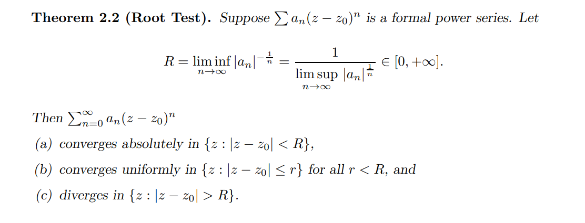

# Calculus Preliminaries

## Definitions

:::{.definition title="Locally uniform convergence"}
A sequence of functions $f_n$ is said to converge **locally uniformly** on $\Omega \subseteq \CC$ iff $f_n\to f$ uniformly on every compact subset $K \subseteq \Omega$.
:::

:::{.definition title="Equicontinuous Family"}
A family of functions $f_n$ is **equicontinuous** iff for every $\eps$ there exists a $\delta = \delta(\eps)$ (not depending on $n$ or $f_n$) such that $\abs{x-y}<\eps \implies \abs{f_n(x) - f_n(y)} < \eps$ for all $n$.
:::

:::{.remark}
Recall Arzelà-Ascoli, an analog of Heine-Borel: for $X$ compact Hausdorff, consider the the Banach space $C(X; \RR)$ equipped with the *uniform norm* $\norm{f}_{\infty, X} \da \sup_{x\in X} \abs{f(x)}$.
Then a subset $A \subseteq X$ is compact iff $A$ is closed, uniformly bounded, and equicontinuous.
As a consequence, if $A$ is a sequence, it contains a subsequence converging uniformly to a continuous function.
The proof is an $\eps/3$ argument.
:::

:::{.definition title="Normal Family"}

:::

:::{.remark}
A continuous function on a compact set is uniformly continuous.
:::

## Theorems

:::{.theorem title="Implicit Function Theorem"}

:::

:::{.theorem title="Inverse Function Theorem"}
For $f \in C^1(\RR; \RR)$ with $f'(a) \neq 0$, then $f$ is invertible in a neighborhood $U \ni a$, $g\da f\inv \in C^1(U; \RR)$, and at $b\da f(a)$ the derivative of $g$ is given by
\[
g'(b) = {1 \over f'(a)}
.\]
For $F \in C^1(\RR^n, \RR^n)$ with $D_f$ invertible in a neighborhood of $a$, so $\det(J_f)\neq 0$, then setting $b\da F(a)$,
\[
J_{F\inv}(q) = \qty{J_F(p)}\inv
.\]

The version for holomorphic functions: if $f\in \Hol(\CC; \CC)$ with $f'(p)\neq 0$ then there is a neighborhood $V\ni p$ with that $f\in \Bihol(V, f(V))$.

:::

:::{.theorem title="Green's Theorem"}
If $\Omega \subseteq \CC$ is bounded with $\bd \Omega$ piecewise smooth and $f, g\in C^1(\bar \Omega)$, then $$\int_{\bd \Omega} f\, dx + g\, dy = \iint_{\Omega} \qty{ \dd{g}{x} - \dd{f}{y} } \, dA.$$
:::

## Convergence

:::{.remark}
Recall that absolutely convergent implies convergent, but not conversely: $\sum k\inv = \infty$ but $\sum (-1)^k k\inv < \infty$.
This converges because the even (odd) partial sums are monotone increasing/decreasing respectively and in $(0, 1)$, so they converge to a finite number.
Their difference converges to 0, and their common limit is the limit of the sum.
:::

:::{.proposition title="Uniform Convergence of Series"}
A series of functions $\sum_{n=1}^\infty f_n(x)$ converges uniformly iff 
\[  
\lim_{n\to \infty} \norm{ \sum_{k\geq n} f_k }_\infty = 0
.\]
:::

:::{.theorem title="Weierstrass $M\dash$Test"}
If $\theset{f_n}$ with $f_n: \Omega \to \CC$ and there exists a sequence $\theset{M_n}$ with $\norm{f_n}_\infty \leq M_n$ and $\sum_{n\in \NN} M_n < \infty$, then $f(x) \definedas \sum_{n\in \NN} f_n(x)$ converges absolutely and uniformly on $\Omega$. 
Moreover, if the $f_n$ are continuous, by the uniform limit theorem, $f$ is again continuous.
:::

## Series and Sequences

:::{.remark}
Note that if a power series converges uniformly, then summing commutes with integrating or differentiating.
:::

:::{.proposition title="Ratio Test"}
Consider $\sum c_k z^k$, set $R = \lim \abs{c_{k+1} \over c_k}$, and recall the **ratio test**:

- $R\in (0, 1) \implies$ convergence.
- $R\in (1, \infty] \implies$ divergence.
- $R=1$ yields no information.
:::

:::{.proposition title="Root Test"}

:::

:::{.proposition title="Radius of Convergence by the Root Test"}
For $f(z) = \sum_{k\in \NN} c_k z^k$, defining
\[
{1\over R} \da \limsup_{k} \abs{a_k}^{1\over k}
,\]
then $f$ converges absolutely and uniformly for $D_R \da\abs{z} < R$ and diverges for $\abs{z} > R$.
Moreover $f$ is holomorphic in $D_R$, can be differentiated term-by-term, and $f' = \sum_{k\in \NN} n c_k z^k$.
:::

:::{.fact}
Recall the **$p\dash$test**:
\[
\sum n^{-p} < \infty \iff p \in (1, \infty)
.\]
:::

:::{.fact}
The product of two sequences is given by the Cauchy product
\[
\sum a_kz^k \cdot \sum b_k z^k = \sum c_k z^k,\quad c_k \da \sum_{j\leq k} a_k b_{k-j}
.\]
:::

:::{.fact}
Recall how to carry out polynomial long division:

\todo[inline]{Polynomial long division}

:::

:::{.fact title="Partial Fraction Decomposition"}
\envlist

- For every root $r_i$ of multiplicity 1, include a term $A/(x-r_i)$.
- For any factors $g(x)$ of multiplicity $k$, include terms $A_1/g(x), A_2/g(x)^2, \cdots, A_k / g(x)^k$.
- For irreducible quadratic factors $h_i(x)$, include terms of the form ${Ax+B \over h_i(x)}$.
:::

## Exercises

:::{.exercise title="?"}
Find the radius of convergences for the power series expansion of $\sqrt{z}$ about $z_0 = 4 +3i$.
:::

