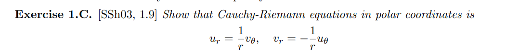
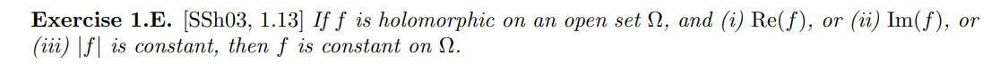
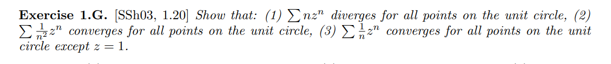

# Preliminaries

## Complex Arithmetic and Calculus

:::{.definition title="Analytic"}
A function $f:\Omega \to \CC$ is *analytic* at $z_0\in \Omega$ iff there exists a power series $g(z) = \sum a_n (z-z_0)^n$ with radius of convergence $R>0$ and a neighborhood $U\ni z_0$ such that $f(z) = g(z)$ on $U$.
:::

:::{.definition title="Complex Differentiable"}
A function $f: \CC\to \CC$ is **complex differentiable** at $z_0$ iff the following limit exists:
\[
\lim_{h\to 0} { f(z_0 + h) - f(h) \over h  } 
.\]

:::

:::{.definition title="Cauchy-Riemann Equations"}
\[
u_x = v_y \quad\text{and}\quad u_y = -v_x \\
\frac{\partial u}{\partial r}=\frac{1}{r} \frac{\partial v}{\partial \theta} \quad \text { and } \quad \frac{\partial v}{\partial r}=-\frac{1}{r} \frac{\partial u}{\partial \theta} \\
.\]
:::

:::{.definition title="Holomorphic"}
A function $f:\CC\to \CC$ is *holomorphic* at $z_0$ if the following limit converges:
\[  
\lim_{h\to 0} {1\over h} \qty{f(z_0 + h) - f(z_0)} \definedas f'(z_0)
.\]
:::

:::{.example title="holomorphic vs non-holomorphic"}
\envlist
- $f(z) = {1\over z}$ is holomorphic on $\CC\smz$.
- $f(z) = \bar{z}$ is *not* holomorphic, since $\bar h \over h$ does not converge (but is real differentiable).
:::

:::{.definition title="del and delbar operators"}
\[
\del 
\da \frac{\partial}{\partial z} 
\da \frac{1}{2}\left(\frac{\partial}{\partial x}-i \frac{\partial}{\partial y}\right) 
\quad 
\delbar 
\da \frac{\partial}{\partial \bar{z}} 
\da \frac{1}{2}\left(\frac{\partial}{\partial x}+i \frac{\partial}{\partial y}\right)
.\]

:::

:::{.proposition title="Holomorphic iff delbar vanishes"}
$f$ is holomorphic at $z_0$ iff $\delbar f(z_0) = 0$.
:::

:::{.definition title="Entire"}
A function that is holomorphic on $\CC$ is said to be *entire*.
:::

:::{.definition title="Laplacian and Harmonic Functions"}
A real function of two variables $u(x, y)$ is *harmonic* iff its Laplacian vanishes:
\[  
\Delta u \definedas \qty{\dd{^2}{x^2} + \dd{^2}{y^2}}u = 0
.\]
:::

:::{.theorem title="Green's Theorem"}
If $\Omega \subseteq \CC$ is bounded with $\bd \Omega$ piecewise smooth and $f, g\in C^1(\bar \Omega)$, then $$\int_{\bd \Omega} f\, dx + g\, dy = \iint_{\Omega} \qty{ \dd{g}{x} - \dd{f}{y} } \, dA.$$
:::

## Power Series

:::{.proposition title="Radius of Convergence by the Root Test"}
For $f(z) = \sum_{k\in \NN} c_k z^k$, defining
\[
{1\over R} \da \limsup_{k} \abs{a_k}^{1\over k}
,\]
then $f$ converges absolutely and uniformly for $D_R \da\abs{z} < R$ and diverges for $\abs{z} > R$.
Moreover $f$ is holomorphic in $D_R$, can be differentiated term-by-term, and $f' = \sum_{k\in \NN} n c_k z^k$.
:::

:::{.proposition title="Ratio test"}

:::

\todo[inline]{todo}

:::{.theorem title="Summation by Parts"}
Define the forward difference operator $\Delta f_k = f_{k+1} - f_k$, then
\[
\sum_{k=m}^n f_k \Delta g_k  + \sum_{k=m}^{n-1} g_{k+1}\Delta f_k = f_n g_{n+1} - f_m g_m
\]

> Note: compare to $\int_a^b f \, dg  + \int_a^b g\, df = f(b) g(b) - f(a) g(a)$.

:::

:::{.theorem title="Abel's Theorem"}
If $\sum_{k=1}^\infty c_k$ converges, then 
\[
\lim_{z\to 1^-} \sum_{k\in \NN} c_k z^k = \sum_{k\in \NN} c_k
.\]

:::

## Exercises

- 
- 
- 
