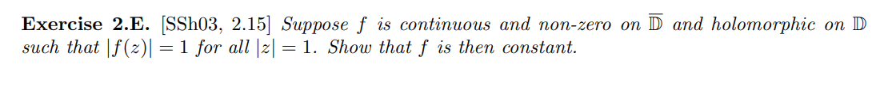
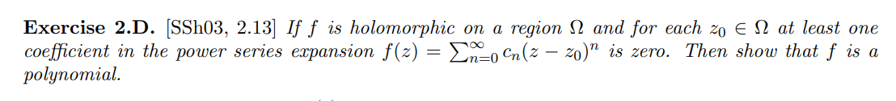

# Cauchy's Theorem

## Basic Results

:::{.definition title="Complex Integral"}
\[
\int_{\gamma} f d z:=\int_{I} f(\gamma(t)) \gamma^{\prime}(t) \dt
= \int_\gamma (u+iv)\dx \wedge (-v+iu)\dy
.\]
:::

:::{.proposition title="Crude integral estimate"}
Define the *length* of a curve by
\[
\operatorname{len}(\gamma) \da\int_\gamma \abs{\dz} = \int_I \abs{\gamma'(t)} \dt
.\]

Then there is an estimate of the following form:
\[
\left|\int_{\gamma} f d z\right| \leq \int_{\gamma}|f||d z| \leq\left(\sup _{\gamma}|f|\right) \cdot \operatorname{len}(\gamma)
.\]

:::

:::{.exercise title="Primitives imply vanishing integral"}
Show that if $f$ has a primitive $F$ on $\Omega$ then $\int_\gamma f = 0$ for every closed curve $\gamma \subseteq \Omega$.
:::

:::{.theorem title="Goursat"}
If $f$ is analytic on a rectangle $R$ with horizontal and vertical sides, then $\int_{\bd R} f = 0$.
:::

:::{.theorem title="Cauchy's Theorem" ref="CauchyTheorem"}
If $f$ is holomorphic on a simply-connected region $\Omega$, then for any closed path $\gamma \subseteq \Omega$,
\[  
\int_{\gamma} f(z) \dz = 0
.\]
:::

:::{.slogan}
Closed path integrals of holomorphic functions vanish.
:::

## Applications of Cauchy's Theorem

:::{.theorem title="Cauchy Integral Formula" ref="CauchyIntegral"}
Suppose $f$ is holomorphic on $\Omega$, then for any $z_0 \in \Omega$ and any open disc $\closure{D_R(z_0)}$ such that $\gamma \da \bd \closure{D_R(z_0)} \subseteq \Omega$,
\[
f(z_0) = {1 \over 2\pi i} \int_{\gamma} {f(\xi) \over \xi-z_0}\ \dxi
\]
and
\[
\dd{^nf }{z^n}(z_0) = {n! \over 2\pi i} \int_{\gamma} {f(\xi) \over (\xi - z_0)^{n+1}} \dxi
.\]
:::

:::{.theorem title="Cauchy's Inequality" ref="CauchyInequality"}
For $z_0 \in D_R(z_0) \subset \Omega$, we have
\[
\abs{ f^{(n)} (z_0) } 
\leq \frac{n !}{2 \pi} \int_{0}^{2 \pi} \frac{ \norm{f}_{\infty} } {R^{n+1}} R \,d\theta
= \frac{n !\norm{f}_{\infty}}{R^n} 
,\]
where $\norm{f}_{\infty}\definedas \sup_{z\in C_R} \abs{f(z)}$.
:::

:::{.slogan}
The $n$th Taylor coefficient of an analytic function is at most $\sup_{\abs z = R} \abs{f}/R^n$.
:::

:::{.theorem title="Mean Value Theorem for Holomorphic Functions"}
If $f$ is holomorphic on $D_r(z_0)$ 
\[
f(z_0) 
= {1\over 2\pi} \int_0^{2\pi} f(z_0 + re^{i\theta}) \dtheta
= {1\over \pi r^2} \iint_{D_r(z_0)} f(z)\, dA
.\]

:::

:::{.theorem title="Liouville's Theorem" ref="Liouville"}
If $f$ is entire and bounded, $f$ is constant.
:::

:::{.proof title="?"}
Use Cauchy's inequality to show $f'\equiv 0$.
:::

:::{.exercise title="?"}

:::

:::{.theorem title="Continuation Principle / Identity Theorem"}
If $f$ is holomorphic on a bounded connected domain $\Omega$ and there exists a sequence $\theset{z_i}$ with a limit point in $\Omega$ such that $f(z_i) = 0$, then $f\equiv 0$ on $\Omega$.
:::

:::{.slogan}
Two functions agreeing on a set with a limit point are equal on a domain.
:::

:::{.proof title="?"}
Apply Improved Taylor Theorem?
\todo[inline]{todo}
:::

:::{.exercise title="?"}

:::

## Morera

:::{.theorem title="Morera's Theorem" ref="Morera"}
If $f$ is continuous on a domain $\Omega$ and $\int_T f = 0$ for every triangle $T\subset \Omega$, then $f$ is holomorphic.
:::

:::{.slogan}
If every integral along a triangle vanishes, implies holomorphic.
:::

:::{.corollary title="?"}
If \( \ts{ f_n }_{n\in \NN} \) is a holomorphic sequence on a region \( \Omega  \) which uniformly converges to $f$ on every compact subset $K \subseteq \Omega$, then $f$ is holomorphic, and $f_n' \to f'$ uniformly on every such compact subset $K$.
:::

:::{.proof title="?"}
Commute limit with integral and apply Morera's theorem.
:::

:::{.remark}
This can be applied to series of the form $\sum_k f_k(z)$.
:::

### Symmetric Regions

In this section, take $\Omega$ to be a region symmetric about the real axis, so $z\in \Omega \iff \bar{z} \in \Omega$.
Partition this set as $\Omega^+ \subseteq \HH, I \subseteq \RR, \Omega^- \subseteq \bar{\HH}$.

:::{.theorem title="Symmetry Principle"}
Suppose that $f^+$ is holomorphic on $\Omega^+$ and $f^-$ is holomorphic on $\Omega^-$, and $f$ extends continuously to $I$ with $f^+(x) = f^-(x)$ for $x\in I$.
Then the following piecewise-defined function is holomorphic on $\Omega$:
\[
f(z) 
\da
\begin{cases}
f^+(z) & z\in \Omega^+ 
\\
f^-(z) & z\in \Omega^-
\\
f^+(z) = f^-(z) & z\in I.
\end{cases}
\]
:::

:::{.proof title="?"}
Apply Morera?
:::

:::{.theorem title="Schwarz Reflection " ref="SchwarzReflection"}
If $f$ is continuous and holomorphic on $\HH^+$ and real-valued on $\RR$, then the extension defined by $F^-(z) = \bar{f(\bar{z})}$ for $z\in \HH^-$ is a well-defined holomorphic function on $\CC$.
:::

:::{.proof title="?"}
Apply the symmetry principle.
:::

:::{.remark}
$\HH^+, \HH^-$ can be replaced with any region symmetric about a line segment $L\subseteq \RR$.
:::

