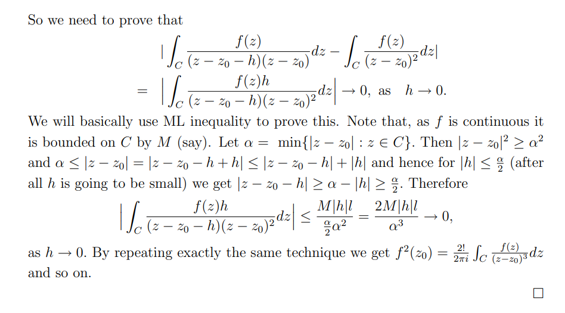

# Cauchy's Theorem

## Complex Integrals

:::{.definition title="Complex Integral"}
\[
\int_{\gamma} f d z:=\int_{I} f(\gamma(t)) \gamma^{\prime}(t) \dt
= \int_\gamma (u+iv)\dx \wedge (-v+iu)\dy
.\]
:::

:::{.theorem title="Goursat"}
If $f$ is analytic on a rectangle $R$ with horizontal and vertical sides, then $\int_{\bd R} f = 0$.
:::

:::{.theorem title="Cauchy's Theorem" ref="CauchyTheorem"}
If $f$ is holomorphic on a simply-connected region $\Omega$, then for any closed path $\gamma \subseteq \Omega$,
\[  
\int_{\gamma} f(z) \dz = 0
.\]
:::

:::{.slogan}
Closed path integrals of holomorphic functions vanish.
:::

:::{.exercise title="Primitives imply vanishing integral"}
Show that if $f$ has a primitive $F$ on $\Omega$ then $\int_\gamma f = 0$ for every closed curve $\gamma \subseteq \Omega$.
:::

:::{.exercise title="?"}
Prove the uniform limit theorem for holomorphic functions: if $f_n\to f$ locally uniformly and each $f_n$ is holomorphic then $f$ is holomorphic.
:::

:::{.solution}
This is S&S Theorem 5.2.
Statement: if $f_n\to f$ uniformly locally uniformly on $\Omega$ then $f$ is holomorphic on $\Omega$.

\envlist

- Let $D \subset \Omega$ with $\bar\DD \subset \Omega$ and $\Delta \subset D$ be a triangle.
- Apply Goursat: $\int_\Delta f_n = 0$.
- $f_n\to f$ uniformly on $\Delta$ since it is closed and bounded and thus compact by Heine-Borel, so $f$ is continuous and
\[
\lim_n \int_\Delta f_n = \int_\Delta \lim_n f_n \da \int_\Delta f
.\]
- Apply Morera's theorem: $\int_\Delta f$ vanishes on every triangle in $\Omega$, so $f$ is holomorphic on $\Omega$.

:::

:::{.exercise title="?"}
Prove that if $f_n\to f$ locally uniformly with $f_n$ holomorphic, then $f_n'\to f'$ locally uniformly and $f'$ is holomorphic.
:::

:::{.solution}
\envlist

- Simplifying step: for some reason, it suffices to assume $f_n\to f$ uniformly on all of $\Omega$?
- Take $\Omega_R$ to be $\Omega$ with a buffer of $R$, so $d(z, \bd \Omega) > R$ for every $z \in \bar{\Omega_R}$.
- It suffices to show the following bound for $F$ any holomorphic function on $\Omega$:
\[
\sup_{z\in \Omega_R} \abs{F'(z)} \leq {1\over R} \sup_{\zeta \in \Omega} \abs{F(\zeta)} && \forall R
,\]
where on the right we take the sup over all $\Omega$.
  - Then take $F \da f_n-f$ and $R\to 0$ to conclude, since the right-hand side is a constant not depending on $\Omega_R$.
- For any $z\in \Omega_R$, we have $\bar{D_R(z)} \subseteq \Omega_R$, so Cauchy's integral formula can be applied:
-
\[
\abs{F'(z)} 
&= \abs{ {1\over 2\pi i} \int_{\bd D_R(z)} {F(\xi) \over (\xi-z)^2 } \dxi  } \\
&\leq {1\over 2\pi} \int_{\bd D_R(z)} { { \abs{F(\xi)} \over \abs{\xi-z}^2 }} \dxi   \\
&\leq {1\over 2\pi} \int_{\bd D_R(z)} { { \sup_{\zeta\in \Omega} \abs{F(\zeta)} \over \abs{\xi-z}^2 }} \dxi   \\
&= {1\over 2\pi} \sup_{\zeta\in \Omega} \abs{F(\zeta)}  \int_{\bd D_R(z)} { { 1 \over R^2 }} \dxi   \\
&= {1\over 2\pi} \sup_{\zeta\in \Omega} \abs{F(\zeta)}  {1\over R^2} \int_{\bd D_R(z)} \dxi   \\
&= {1\over 2\pi} \sup_{\zeta\in \Omega} \abs{F(\zeta)}  {1\over R^2} 2\pi R   \\
&\leq {1\over 2\pi} \sup_{\zeta\in \Omega} \abs{F(\zeta)}  {1\over R^2}\qty{ 2\pi R}   \\
&= {1\over R} \sup_{\zeta \in \Omega}\abs{F(\zeta)}
.\]

- Now
\[
\norm{f_n' - f'}_{\infty, \Omega_R} \leq {1\over R} \norm{f_n - f}_{\infty, \Omega}
,\]
where if $R$ is fixed then by uniform convergence of $f_n\to f$, for $n$ large enough $\norm{f_n - f} < \eps/R$.

:::

## Applications of Cauchy's Theorem

### Integral Formulas and Estimates

> See [reference](http://home.iitk.ac.in/~psraj/mth102/lecture_notes/comp8.pdf)

:::{.theorem title="Cauchy Integral Formula" ref="CauchyIntegral"}
Suppose $f$ is holomorphic on $\Omega$, then for any $z_0 \in \Omega$ and any open disc $\closure{D_R(z_0)}$ such that $\gamma \da \bd \closure{D_R(z_0)} \subseteq \Omega$,
\[
f(z_0) = {1 \over 2\pi i} \int_{\gamma} {f(\xi) \over \xi-z_0}\ \dxi
\]
and
\[
\dd{^nf }{z^n}(z_0) = {n! \over 2\pi i} \int_{\gamma} {f(\xi) \over (\xi - z_0)^{n+1}} \dxi
.\]
:::

:::{.proof title="?"}

:::

:::{.proof title="?"}

:::

:::{.theorem title="Cauchy's Inequality / Cauchy's Estimate" ref="CauchyInequality"}
For $z_0 \in D_R(z_0) \subset \Omega$, setting $M \da \sup_{z\in \gamma}\abs{f(z)}$ so $\abs{f(z)}\leq M$ on $\gamma$
\[
\abs{ f^{(n)} (z_0) } 
\leq \frac{n !}{2 \pi} \int_{0}^{2 \pi} \frac{ M } {R^{n+1}} R \dtheta
= \frac{M n ! }{R^n} 
.\]
:::

:::{.proof title="of Cauchy's inequality"}
\envlist
- Given $z_0\in \Omega$, pick the largest disc $D_R(z_0) \subset \Omega$ and let $C = \bd D_R$.
- Then apply the integral formula.

\[
\left|f^{(n)}(z_0)\right|
&= \abs{ \frac{n !}{2 \pi i} \int_{C} \frac{f(\zeta) }{(\zeta-z_0)^{n+1}} \dzeta } \\
&=\left|\frac{n !}{2 \pi i} \int_{0}^{2 \pi} \frac{f\left(z_0 + r e^{i \theta}\right) r i e^{i \theta} }{\left(r e^{i \theta}\right)^{n+1}} \dtheta \right| \\
&\leq \frac{n !}{2 \pi} \int_{0}^{2 \pi}\left|\frac{f\left( z_0 +r e^{i \theta}\right) r i e^{i \theta}}{\left(r e^{i \theta}\right)^{n+1}}\right| \dtheta \\ 
&=\frac{n !}{2 \pi} \int_{0}^{2 \pi} \frac{\left|f\left(z_0 +r e^{i \theta}\right)\right|}{r^{n}} \dtheta \\
&\leq \frac{n !}{2 \pi} \int_{0}^{2 \pi} \frac{M}{r^{n}} \dtheta \\
&=\frac{M n !}{r^{n}} 
.\]

:::

:::{.slogan}
The $n$th Taylor coefficient of an analytic function is at most $\sup_{\abs z = R} \abs{f}/R^n$.
:::

:::{.theorem title="Mean Value Property for Holomorphic Functions"}
If $f$ is holomorphic on $D_r(z_0)$ 
\[
f(z_0) 
= {1\over 2\pi} \int_0^{2\pi} f(z_0 + re^{i\theta}) \dtheta
= {1\over \pi r^2} \iint_{D_r(z_0)} f(z)\, dA
.\]
Taking the real part of both sides, one can replace $f=u+iv$ with $u$.
:::

### Liouville

:::{.theorem title="Liouville's Theorem" ref="Liouville"}
If $f$ is entire and bounded, $f$ is constant.
:::

:::{.proof title="of Liouville"}
\envlist

- Since $f$ is bounded, $f(z) \leq M$ uniformly on $\CC$.
- Apply Cauchy's estimate for the 1st derivative:
\[
\abs{f'(z)} \leq { 1! \norm{f}_{C_R} \over R } \leq {M \over R}\converges{R\to\infty}\too 0
,\]
  so $f'(z) = 0$ for all $z$.
:::

:::{.exercise title="?"}

:::

### Continuation Principle

:::{.theorem title="Continuation Principle / Identity Theorem"}
If $f$ is holomorphic on a bounded connected domain $\Omega$ and there exists a sequence $\theset{z_i}$ with a limit point in $\Omega$ such that $f(z_i) = 0$, then $f\equiv 0$ on $\Omega$.
:::

:::{.slogan}
Two functions agreeing on a set with a limit point are equal on a domain.
:::

:::{.proof title="?"}
Apply Improved Taylor Theorem?
\todo[inline]{todo}
:::

:::{.exercise title="?"}

:::

