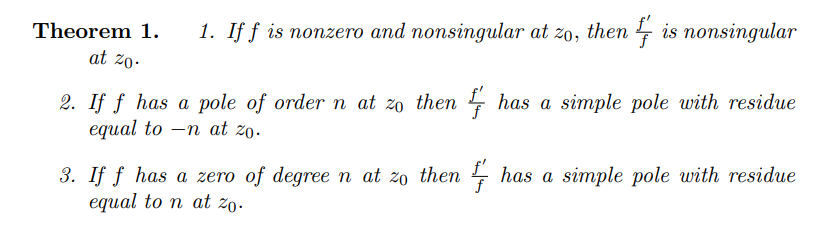

# Counting Zeros and Poles

## Argument Principle

:::{.definition title="Winding Number"}
For $\gamma \subseteq \Omega$ a closed curve not passing through a point $z_0$, the **winding number of $\gamma$ about $z_0$** is defined as
\[
n_\gamma(z_0) \da {1\over 2\pi i} \int_\gamma {1\over \xi -z_0}\dxi
.\]

:::

:::{.definition title="The logarithmic derivative"}
The **logarithmic derivative** is defined as 
\[
\del_{\log} f \da {f' \over f}
.\]
It converts all poles and zeros of $f$ into simple poles of $\del_{\log f}$.
:::

:::{.exercise title="?"}
Show that $\del_{\log}(fg) = \del_{\log} f + \del_{\log} g$, i.e. 
\[
{ (fg)' \over fg} = {f'\over f} + {g' \over g}
.\]
:::

:::{.theorem title="Argument Principle"}
For $f$ meromorphic in $\Omega$ with multisets of zeros \( Z_f \da \ts{ z_j } \) and poles \( P_f\da \ts{ p_k } \) (so repeated with multiplicity) 
for $\gamma \da \bd \Omega$ not intersect
\[  
\Delta_\gamma \arg f(z) &\da {1\over 2\pi i} \int_\gamma {f'(z) \over f(z)} \dz \\
&= \sum_{j} n_\gamma(z_j) - \sum_k n_\gamma(p_k) \\ 
&= \# Z_f - \# P_f
,\]
where $\# Z_f$ and $\# P_f$ are the number of zeros and poles respectively, counted with multiplicity.
:::

:::{.proof title="?"}
Residue formula applied to $f'\over f$?

- If $z_0$ is a zero of $f$ of order $m$, write $f(z) = (z-z_0)^m g(z)$ with $g(z)$ holomorphic and nonzero on some neighborhood of $z_0$.
- Compute
\[
\del_{\log} f(z)
&=
\frac{m\left(z-z_{0}\right)^{m-1} g(z)+\left(z-z_{0}\right)^{m} g^{\prime}(z)}{\left(z-z_{0}\right)^{m} g(z)} \\
&= {m \over z-z_0} + \del_{\log} g(z)
,\]
so $z_0$ is a simple pole of $\del_{\log} f$ and $\res_{z=z_0} \del_{\log} f = m$.

- If $z_0$ is a pole of $f$ of order $m$, write $f(z) = (z-z_0)^{-m} g(z)$, then
\[
\del_{\log} f = {-m \over z-z_0} + \del_{\log} g
,\]
  so $z_0$ is a simple pole.

:::

:::{.remark}
This is useful in numerical computation: if you can compute this integral within an error $E < \pi$ where you know it doesn't contain a pole, you can determine if the contour contains a zero.
Canonical example: integrals in rectangles around $\Re(z) = 1/2$ for $\zeta(s)$.
:::

## Rouché 
:::{.corollary title="Rouché's Theorem" ref="Rouche"}
If $f, g$ are analytic on a domain $\Omega$ with finitely many zeros in $\Omega$ and $\gamma \subset \Omega$ is a closed curve surrounding each point exactly once, where $\abs{g} < \abs{f}$ on $\gamma$, then $f$ and $f+g$ have the same number of zeros.

Alternatively:

Suppose $f = g + h$ with $g \neq 0, \infty$ on $\gamma$ with $\abs g > \abs h$ on $\gamma$.
Then $$\Delta_\gamma \arg(f) = \Delta_\gamma \arg(h)\quad\text{ and } Z_f - P_f = Z_g - P_g.$$
:::

\todo[inline]{Prove}

:::{.corollary title="Open Mapping"}
Any holomorphic non-constant map is an open map.
:::

\todo[inline]{Prove}

:::{.corollary title="Maximum Modulus" ref="MaximumModulus"}
If $f$ is holomorphic and nonconstant on an open connected region $\Omega$, then $\abs{f}$ can not attain a maximum on $\Omega$.
If $\Omega$ is bounded and $f$ is continuous on $\bar \Omega$, then $\max_{\bar \Omega} \abs{f}$ occurs on $\bd \Omega$.
Conversely, if $f$ attains a local supremum at $z_0 \in \Omega$, then $f$ is constant on $\Omega$.
:::

\todo[inline]{Prove}

:::{.corollary title="?"}
If $f$ is nonzero on $\Omega$, then $f$ attains a minimum on $\bd \Omega$.
This follows from applying the MMP to $1/f$.
:::

## Counting Zeros 

:::{.example}
\envlist

- Take $P(z) = z^4 + 6z + 3$.
- On $\abs{z} < 2$:
  - Set $f(z) = z^4$ and $g(z) = 6z + 3$, then $\abs{g(z)} \leq 6\abs{z} + 3 = 15 < 16= \abs{f(z)}$.
  - So $P$ has 4 zeros here.
- On $\abs{z} < 1$:
  - Set $f(z) = 6z$ and $g(z) = z^4 + 3$.
  - Check $\abs{g(z)} \leq \abs{z}^4 + 3 = 4 < 6 = \abs{f(z)}$.
  - So $P$ has 1 zero here.
:::

:::{.example}
\envlist 

- Claim: the equation $\alpha z e^z = 1$ where $\abs{\alpha} > e$ has exactly one solution in $\DD$.
- Set $f(z) = \alpha z$ and $g(z) = e^{-z}$.
- Estimate at $\abs{z} =1$ we have $\abs{g} =\abs{e^{-z}} = e^{-\Re(z)} \leq e^1 < \abs{\alpha} = \abs{f(z)}$
- $f$ has one zero at $z_0 = 0$, thus so does $f+g$.
:::

