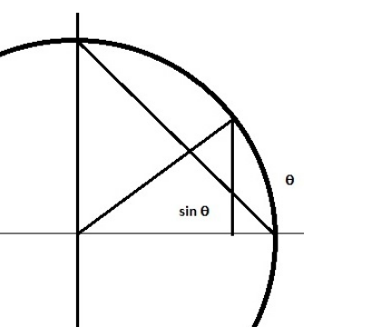
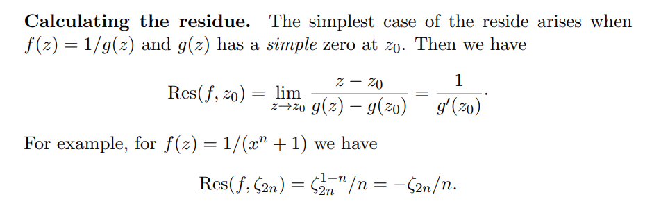
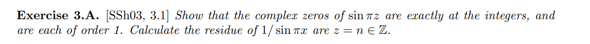
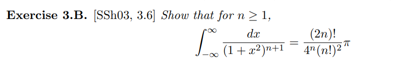
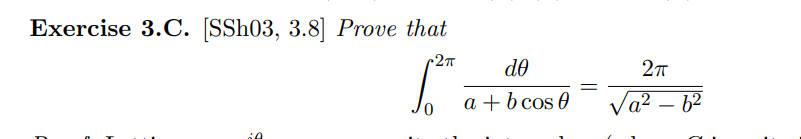
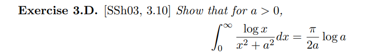
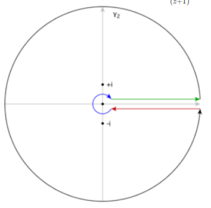
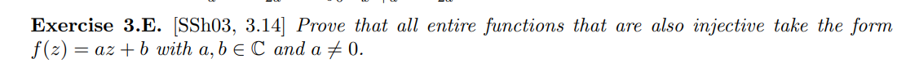

# Residues

:::{.remark}
Pedantic warning: $\Res_{z=p}(f)$ should really be $\Res_{z=p}(df)$ for $df = f(z) \dz$, since it's only an invariant of the 1-form $df$ and not necessarily $f$ itself.
We freely abuse notation!

What to use when:

- $f(z) = p(z)/q(z)$: if $f\in L^1(\RR)$, integrate over semicircle in Q1 or a pie slice $[0, R] \union S_1(R) \union \zeta[0, R]$.
  E.g. $\int_{\RR_{\geq 0} } {1\over 1 + x^n}\dx = {(\pi / n) \over \sin\qty{\pi \over n}}$
- $f(z) = R(\cos\theta, \sin\theta)$ a rational function of sines/cosines: set $z= e^{i\theta}$ and integrate over $S^1$.
  E.g.
  \[
  \int_{0}^{2 \pi} \frac{d \theta}{1+a^{2}-2 a \cos \theta}=\int_{S^{1}} \frac{i d z}{(z-a)(a z-1)}=2 \pi i\left(i /\left(a^{2}-1\right)\right)=\frac{2 \pi}{1-a^{2}}
  .\]

- $f(z) = z^a g(z)$ with $g$ rational: semicircle $[0,R] \union S_1(R) \union i[0, R]$ to get $(1-i^a)\int f$
  E.g. setting $w \da e^{\pi i a \over 2}$, 
  \[
  \int_{0}^{\infty} \frac{x^{a}}{1+x^{2}} d x =
  \frac{\pi\left(i^{a}-(-i)^{a}\right)}{\left(1-1^{a}\right)}=\pi \frac{\omega-\omega^{3}}{1-\omega^{4}}=\frac{\pi}{\omega+\omega^{-1}}=\frac{\pi}{2 \cos (\pi a / 2)}
  ,\]
  where for $a = 1/3$ this yields $\pi/\sqrt 3$.

:::

## Basics

:::{.remark}
Check: do you need residues at all??
You may be able to just compute an integral!

- Directly by parameterization:
\[
\int_\gamma f \dz = \int_a^b f(z(t))\, z'(t) \dt && \text{for } z(t) \text{ a parameterization of } \gamma
,\]

- Finding a primitive $F$, then 
\[
\int_\gamma f = F(b) - F(a)
.\]

  - Note: you can parameterize a circle around $z_0$ using
  \[
  z= z_0 + re^{i \theta }
  .\]

:::

:::{.fact title="Integrating $z^k$ around $S^1$ powers residues"}
The major fact that reduces integrals to residues: 
\[
\int_\gamma z^k \dz = \int_0^{2\pi} e^{ik\theta} ie^{i\theta } \dtheta = i\int_0^{2\pi} e^{i(k+1)\theta \dtheta }
=
\begin{cases}
2\pi i & k=-1 
\\
0 & \text{else}.
\end{cases}
\]
Thus
\[
\int \sum_{k\geq -M} c_k z^k = \sum_{k\geq -M} \int c_k z^k = 2\pi i c_{-1}
,\]
i.e. the integral picks out the $c_{-1}$ coefficient in a Laurent series expansion.
:::

:::{.example title="?"}
Consider
\[
f(z) \da {e^{iz} \over 1 + z^2}
\]
where $z\neq \pm i$, and attempt to integrate
\[
\int_\RR f(z) \dz
.\]
Use a semicircular contour $\gamma_R$ where $z = Re^{it}$
and check
\[
\sup_{z\in \gamma_R} \abs{f(z)} 
&= \max_{t\in [0, \pi} {1 \over 1 + (Re^{it})^2 } \\
&= \max_{t\in [0, \pi} {1 \over 1 + R^2e^{2it} } \\
&= {1\over R^2 - 1}
.\]

:::

## Estimates

:::{.proposition title="Length bound / ML Estimate"}
\[
\abs{ \int_\gamma f} \leq ML \da \sup_{z\in \gamma} \abs{f} \cdot \mathrm{length}(\gamma)
.\]
:::

:::{.proof title="?"}
\[
\left|\int_{\gamma} f(z) d z\right| \leq \sup _{t \in[a, b]}|f(z(t))| \int_{a}^{b}\left|z^{\prime}(t)\right| d t \leq \sup _{z \in \gamma}|f(z)| \cdot \operatorname{length}(\gamma)
.\]

:::

:::{.proposition title="Jordan's Lemma"}
Suppose that $f(z) = e^{iaz}g(z)$ for some $g$, and let $C_R \da \ts{ z=Re^{it} \st t\in [0, \pi] }$. Then
\[
\abs{\int_{C_R} f(z) \dz} \leq {\pi M_R \over a}
\]
where $M_R \da \sup_{t\in [0, \pi]} \abs{g(Re^{it})}$.
:::

:::{.proof title="?"}
\[
\abs{ \int_{C_R} f(z)\dz }
&= \abs{ \int_{C_R} e^{iaz}g(z) \dz} \\
&= \abs{ \int_{[0, \pi]} e^{ia\qty{Re^{it}}}g(Re^{it}) iRe^{it} \dt} \\
&\leq \int_{[0, \pi]} \abs{ e^{ia\qty{Re^{it}}}g(Re^{it}) iRe^{it}} \dt \\
&=R \int_{[0, \pi]} \abs{ e^{ia\qty{Re^{it}}}g(Re^{it})} \dt \\
&\leq R M_R \int_{[0, \pi]} \abs{ e^{ia\qty{Re^{it}}}} \dt \\
&= R M_R \int_{[0, \pi]} e^{\Re\qty{iaRe^{it}}}   \dt \\
&= R M_R \int_{[0, \pi]} e^{\Re\qty{iaR\qty{\cos(t) + i\sin(t) } }}   \dt \\
&= R M_R \int_{[0, \pi]} e^{-aR\sin(t) }   \dt \\
&= 2 R M_R \int_{[0, \pi/2]} e^{-aR\sin(t) }   \dt \\
&\leq 2R M_R \int_{[0, \pi/2]} e^{-aR\qty{2t\over \pi} }   \dt \\
&= 2RM_R \qty{\pi \over 2aR}\qty{1-e^{-aR}} \\
&= {\pi M_R \over a}
.\]

where we've used that on $[0, \pi/2]$, there is an inequality $2t/\pi \leq \sin(t)$.
This is obvious from a picture, since $\sin(t)$ is a height on $S^1$ and $2t/\pi$ is a height on a diagonal line:

:::

## Residue Formulas

:::{.theorem title="The Residue Theorem"}
Let $f$ be meromorphic on a region $\Omega$ with poles \( \ts{ \elts{z}{N} } \).
Then for any $\gamma \in \Omega\sm \ts{ \elts{z}{N} }$, 
\[
{1 \over 2\pi i } \int_\gamma f(z) \dz = \sum_{j=1}^N n_\gamma(z_j) \Res_{z=z_j} f
.\]
If $\gamma$ is a toy contour, then  
\[
{1\over 2\pi i}\int_\gamma f\dz = \sum_{j=1}^N \Res_{z=z_j}f
.\]

:::

:::{.proposition title="Residue formula for higher order poles"}
If $f$ has a pole $z_0$ of order $n$, then
\[  
\Res_{z=z_0} f = \lim_{z\to z_0} {1 \over (n-1)!} \qty{\dd{}{z}}^{n-1} (z-z_0)^n f(z)
.\]
:::

:::{.proposition title="Residue formula for simple poles"}
As a special case, if $z_0$ is a simple pole of $f$, then
\[  
\Res_{z=z_0}f = \lim_{z\to z_0} (z-z_0) f(z)
.\]
:::

:::{.corollary title="Better derivative formula that sometimes works for simple poles"}

If additionally $f=g/h$ where $h(z_0) = 0$ and $h'(z_0)\neq 0$, 
\[
\Res_{z=z_0} {g(z) \over h(z)} = {g(z_0) \over h'(z_0)}
.\]

:::

:::{.proof title="?"}
Apply L'Hopital:
\[
(z-z_0) {g(z) \over h(z)} = {(z-z_0) g(z) \over h(z) } \equalsbecause{LH}
{g(z) + (z-z_0) g'(z) \over h'(z)} \converges{z\to z_0}\too {g(z_0) \over h'(z_0)}
.\]
:::

:::{.example title="Residue of a simple pole (order 1)"}
Let $f(z) = \frac{1}{1+z^2}$, then $g(z) = 1, h(z) = 1+z^2$, and $h'(z) = 2z$ so that $h'(i) = 2i \neq 0$. Thus
\[
\Res_{z=i}{1\over 1+z^2} = \frac{1}{2i}
.\]
:::

:::{.proposition title="Residue at infinity"}

\[
\Res_{z=\infty}f(z) = \Res_{z=0} g(z) && g(z) \da -{1 \over z^2}f\qty{1\over z} 
.\]

:::

### Exercises

> Some good computations [here](https://math.mit.edu/~jorloff/18.04/notes/topic9.pdf).

:::{.exercise}
Show that the complex zeros of $f(z) \da \sin(\pi z)$ are exactly $\ZZ$, and each is order 1.
Calculate the residue of $1/\sin(\pi x)$ at $z=n\in \ZZ$.
:::

:::{.exercise title="?"}
\[
\int_\RR {1 \over (1+x^2)^2} \dx
.\]
:::

:::{.solution}
\envlist

- Factor $(1+z^2)^2 = ((z-i)(z+i))^2$, so $f$ has poles at $\pm i$ of order 2.
- Take a semicircular contour $\gamma \da I_R \union D_R$, then $f(z) \approx 1/z^4 \to 0$ for large $R$ and $\int_{D_R} f \to 0$.
- Note $\int_{I_R} f \to \int_\RR f$, so $\int_\gamma f \to \int_\RR f$.
- $\int_\gamma f = 2\pi i \sum_{z_0} \Res_{z=z_0} f$, and $z_0 = i$ is the only pole in this region.
- Compute
\[
\Res_{z=i} f 
&= \lim_{z\to i} {1\over (2-1)!} \dd{}{z} (z-i)^2 f(z) \\
&= \lim_{z\to i} \dd{}{z} {1\over (z+i)^2 } \\
&= \lim_{z\to i} {-2 \over (z+i)^3 } \\
&= -{2 \over (2i)^3 } \\
&= {1\over 4i} \\ \\
\implies
\int_\gamma f &= {2\pi i \over 4i} = \pi/2
,\]

:::

:::{.exercise title="?"}
Use a direct Laurent expansion to show
\[
\Res_{z=0} {1\over z-\sin(z)} = {3! \over 5\cdot 4}
.\]

> Note the necessity: one doesn't know the order of the pole at zero, so it's unclear how many derivatives to take.

:::

:::{.solution}
Expand:
\[
{1\over z - \sin(z)}
&= z\inv \qty{1 - z\inv \sin(z) }\inv \\
&= z\inv \qty{1 - z\inv\qty{ z - {1\over 3!}z^3 + {1\over 5!} z^5 - \cdots}}\inv\\
&= z\inv \qty{1 - \qty{ 1 - {1\over 3!}z^2 + {1\over 5!} z^4 - \cdots}}\inv \\
&= z\inv \qty{{1\over 3!}z^2 - {1\over 5!}z^4 + \cdots}\inv \\
&= z\inv \cdot 3! z^{-2} \qty{1 - {1\over 5!/3!}z^2 + \cdots}\inv \\
&= {3!\over z^3} \qty{1 \over 1 - \qty{ {1\over 5\cdot 4}z^2 + \cdots}} \\
&= {3!\over z^3}\qty{1 + \qty{{1\over 5\cdot 4}z^2} + \qty{{1\over 5\cdot 4}z^2}^2 + \cdots} \\
&= 3! z^{-3} + {3!\over 5\cdot 4}z\inv + O(z) \\
.\]

:::

:::{.exercise title="?"}
Compute
\[
\Res_{z=0} {1\over z^2 \sin(z)}
.\]
:::

:::{.solution}
First expand $(\sin(z))\inv$:
\[
{1\over \sin(z)}
&= \qty{z - {1\over 3!}z^3 + {1\over 5!}z^5 -\cdots }\inv \\
&= z\inv \qty{1 - {1\over 3!}z^2 + {1\over 5!}z^4 - \cdots }\inv \\
&= z\inv \qty{1 + 
\qty{{1\over 3!}z^2 - {1\over 5!} z^4 + \cdots} 
+
\qty{{1\over 3!}z^2 - \cdots}^2 + \cdots
} \\
&= z\inv\qty{1 + {1\over 3!}z^2 \pm O(z^4) }
,\]
using that $(1-x)\inv = 1 + x + x^2 + \cdots$.

Thus
\[
z^{-2}\qty{\sin(z)}\inv 
&= z^{-2} \cdot
z\inv\qty{1 + {1\over 3!}z^2 \pm O(z^4) } \\
&= z^{-3} + {1\over 3!}z\inv + O(z)
.\]
:::

:::{.exercise title="Keyhole contour and ML estimate"}
Compute
\[
\int_{[0, \infty]} {\log(x) \over (1+x^2)^2}\dx 
.\]
:::

:::{.solution}
Factor $(1+z^2)^2 = (z+i^2(z-i)^2$.
Take a keyhole contour similar to the following:

Show that outer radius $R$ and inner radius $\rho$ circles contribute zero in the limit by the ML estimate?
Compute the residues by just applying the formula and manually computing derivatives:
\[
\Res_{z= \pm i} f(z) 
&= \lim_{z\to \pm i} \dd{}{z} {\log^2(z) \over (z\pm i)^2} \\
&= \lim_{z\to \pm i} {2\log(z) (z\pm i)^2 - 2(z\pm i)^2 \log^2(z) \over \qty{(z\pm i )^2}^2} \\
&= {
2\log(\pm i)(\pm 2i)^2 - 2(\pm 2i)^2 \log^2(\pm i)
\over {\qty{\pm 2i}}^4 } \\
&=_? {\pi \over 4}\pm {i\pi^2 \over 16}
.\]

> See p.4: <http://www.math.toronto.edu/mnica/complex1.pdf>

:::

:::{.exercise title="Sinc Function"}
Show
\[
\int_{(0, \infty)} {\sin(x) \over x }\dx = {\pi \over 2}
.\]
:::

:::{.solution}
Take an indented semicircle.
Let $I$ be the original integral, then 
\[
I = {1\over 2i} \int_\RR {e^{iz} - 1 \over z } \dz
.\]

:::

