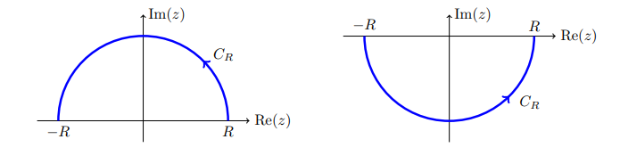
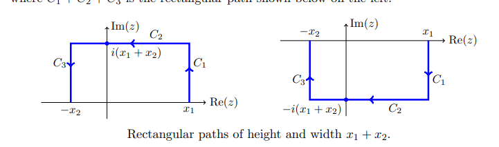
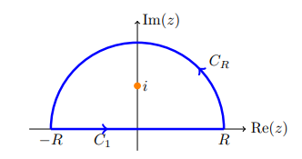
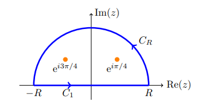
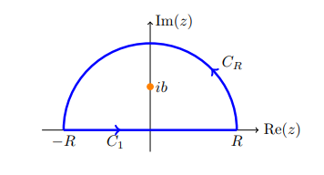

# Integrals

- For integrals that decay faster than $1/z^\alpha, \alpha>1$: semicircular contours.

  

-  For integrals that decay like $1/z$: rectangular contours.

  

- If a trigonometric function is in the numerator, check if $I \approx \Re(\tilde I)$ where $\tilde I$ replaces cosines/sines with $e^{iz}$.

:::{.exercise title="?"}
\[
\int_\RR {1 \over (1+x)^2} = {\pi \over 2}
.\]

Use that $f(z) \sim 1/z^4$.
:::

:::{.solution}

:::

:::{.exercise title="?"}
\[
\int_\RR {1 \over x^4 + 1} = {\pi \sqrt{2} \over 2}
.\]

:::

:::{.solution}

:::

:::{.exercise title="?"}
\[
\int_{0}^{\infty} \frac{\cos (x)}{x^{2}+b^{2}} d x=\frac{\pi \mathrm{e}^{-b}}{2 b} .
.\]
:::

:::{.solution}
Extend to $\int_\RR$ using that $f$ is even.

:::

