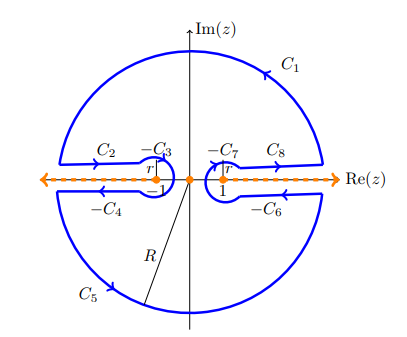

# Integrals

[See this very detailed note](https://math.mit.edu/~jorloff/18.04/notes/topic9.pdf).

- For integrals that decay faster than $1/z^\alpha, \alpha>1$: semicircular contours.

  

-  For integrals that decay like $1/z$: rectangular contours.

  

- If a trigonometric function is in the numerator, check if $I \approx \Re(\tilde I)$ where $\tilde I$ replaces cosines/sines with $e^{iz}$.

- For rational functions of $\cos, \sin$: set $2\cos(z) = z + z\inv, 2\sin(z) = z - z\inv, \dtheta = {\dz\over iz}$ to reduce to a residue count in $\abs{z} \leq 1$.

:::{.exercise title="?"}
\[
\int_\RR {1 \over (1+x)^2} = {\pi \over 2}
.\]

Use that $f(z) \sim 1/z^4$.
:::

:::{.solution}

:::

:::{.exercise title="?"}
\[
\int_\RR {1 \over x^4 + 1} = {\pi \sqrt{2} \over 2}
.\]

:::

:::{.solution}

:::

:::{.exercise title="?"}
\[
\int_{0}^{\infty} \frac{\cos (x)}{x^{2}+b^{2}} d x=\frac{\pi \mathrm{e}^{-b}}{2 b} .
.\]
:::

:::{.solution}
Extend to $\int_\RR$ using that $f$ is even.

:::

:::{.exercise title="Trigonometric functions"}
\[
\int_{0}^{2 \pi} \frac{d \theta}{1+a^{2}-2 a \cos (\theta)}
= \begin{cases}\frac{2 \pi}{a^{2}-1} & \text { if }|a|>1 \\ \frac{2 \pi}{1-a^{2}} & \text { if }|a|<1\end{cases}
.\]
:::

:::{.solution}
Write $2\cos(z) = z + z\inv$ on $S^1$ to get
\[
=\int_{|z|=1} \frac{1}{i\left(\left(1+a^{2}\right) z-a\left(z^{2}+1\right)\right)} d z
.\]

:::

## Branch Cuts

:::{.exercise title="?"}
\[
\int_0^\infty {x^{1\over 3} \over 1 + x^2} \dx = {\pi \over \sqrt 3}
.\]
:::

:::{.solution}

:::

:::{.exercise title="?"}
\[
\int_{1}^{\infty} \frac{d x}{x \sqrt{x^{2}-1}} = {\pi \over 2}
.\]
:::

:::{.solution}

:::

