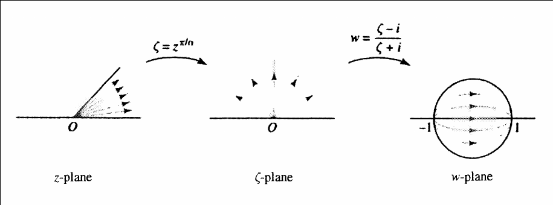

# Conformal Maps

## Linear Fractional Transformations

:::{.definition title="Conformal Map / Biholomorphism"}
A map $f$ is **conformal** on $\Omega$ iff $f$ is complex-differentiable, $f'(z)\neq 0$ for $z\in \Omega$, and $f$ preserves signed angles (so $f$ is orientation-preserving).
Conformal implies holomorphic, and a bijective conformal map has a holomorphic inverse.
A bijective conformal map $f:U\to V$ is called a **biholomorphism**, and we say $U$ and $V$ are **biholomorphic**.
Self-biholomorphisms of a domain $\Omega$ form a group $\Aut_\CC(\Omega)$.
:::

:::{.remark}
There is an oft-used weaker condition that $f'(z) \neq 0$ for any point.
Note that that this condition alone doesn't necessarily imply $f$ is holomorphic, since anti-holomorphic maps may have nonzero derivatives.
For example, take $f(z) = \bar{z}$, so $f(x+iy) = x-iy$ -- this does not satisfy the Cauchy-Riemann equations.
:::

:::{.remark}
A bijective holomorphic map automatically has a holomorphic inverse.
This can be weakened: an injective holomorphic map satisfies $f'(z) \neq 0$ and $f ^{-1}$ is well-defined on its range and holomorphic.
:::

:::{.definition title="Linear fractional transformation / Mobius transformation"}
A map of the following form is a *linear fractional transformation*:
\[  
T(z) = {az + b \over cz + d}
,\]
where the denominator is assumed to not be a multiple of the numerator.
These have inverses given by
\[  
T^{-1}(w) = {dw-b \over -cw + a}
.\]
:::

:::{.proposition title="?"}
Given any three points $z_1, z_2, z_3$, the following Mobius transformation sends them to $1, 0, \infty$ respectively:
\[
f(z) \da { (z-z_2) (z_1-z_3) \over (z-z_3) (z_1 - z_2)}
.\]
Such a map is sometimes denoted $(z, z_1, z_2, z_3)$.

:::

:::{.example title="?"}
\envlist

- $(z, i, 1, -1): \DD\to \HH$
- $(z, 0, -1, 1): \DD \intersect \HH \to Q_1$.

:::

:::{.theorem title="Cayley Transform"}
The fractional linear transformation given by $F(z) = {i - z \over i + z}$ maps $\DD\to \HH$ with inverse $G(w) = i {1-w \over 1 + w}$.
:::

:::{.theorem title="Characterization of conformal maps"}
Conformal maps $\DD\to\DD$ have the form
\[
g(z) = \lambda {1-a \over 1 - \bar a z}, \quad \abs{a} < 1, \quad \abs{\lambda} = 1
.\]
:::

:::{.theorem title="Riemann Mapping"}
If $\Omega$ is simply connected, nonempty, and not $\CC$, then for every $z_{0}\in \Omega$ there exists a unique conformal map $F:\Omega \to \DD$ such that $F(z_{0}) = 0$ and $F'(z_{0}) > 0$.

Thus any two such sets $\Omega_{1}, \Omega_{2}$ are conformally equivalent.
:::

## By Type

:::{.remark title="Notation"}

| Notation                                                     | Definition                                             |
|--------------------------------------------------------------|--------------------------------------------------------|
| $\DD \da \ts{z \st \abs{z} \leq 1}$                          | The unit disc                                          |
| $\HH \da \ts{x+iy \st y > 0}$                                | The upper half-plane                                   |
| $X_{1\over 2}$                                               | A "half version of $X$", see examples                  |
| $\HH_{1\over 2}$                                             | The first quadrant                                     |
| $\DD_{1\over 2}$                                             | The portion of the first quadrant inside the unit disc |
| $L \definedas \theset{x + iy \suchthat x\in \RR,\, 0<y<\pi}$ | The horizontal strip                                   |
|                                                              |                                                        |
|                                                              |                                                        |

:::

:::{.theorem title="Classification of Conformal Maps"}
There are 8 major types of conformal maps:

| Type/Domains                                            | Formula                                   |
| ------------                                            | -------                                   |
| Translation                                             | $z\mapsto z + h$            |
| Dilation                                                | $z\mapsto cz$            |
| Rotation                                                | $z\mapsto e^{i\theta}$            |
| Sectors to sectors                                      | $z\mapsto z^n$                            |
| $\DD_{1\over 2} \to \HH_{1\over 2}$, the first quadrant | $z\mapsto {1+z \over 1-z}$                |
| $\HH\to S$                                              | $z\mapsto \log(z)$                        |
| $\DD_{1\over 2} \to L_{1\over 2}$                       | $z\mapsto \log(z)$                        |
| $S_{1\over 2} \to \DD_{1\over 2}$                       | $z\mapsto e^{iz}$                         |
| $\DD_{1\over 2} \to \HH$                                | $z\mapsto {1\over 2}\qty{z + {1\over z}}$ |
| $L_{1\over 2} \to \HH$                                  | $z\mapsto \sin(z)$                        |

:::

\todo[inline]{Pictures!}

:::{.proposition title="Half-plane to Disc"}
\[
F: \HH^\circ &\mapstofrom \DD^\circ \\
\ts{z\st \Im(z) > 0 } &\mapstofrom \ts{w\st \abs{w} < 1 } \\
z &\mapsto {i-z \over i+z} \\
i \qty{1-w \over 1+w} &\mapsfrom w
.\]

**Boundary behavior:**
This maps $\RR\to \bd \DD$, where $F(\infty) = -1$, and as $x\in \RR$ ranges from $-\infty\to\infty$, $F(x)$ travels from $z=-1$ counter-clockwise through $S^1$ (starting at $z=-1$ and moving through the lower half first).
So this extends to a map $\HH\to \DD$.
:::

:::{.proposition title="Sector to sector"}
\[
F_\alpha: S_{\pi \over \alpha }^\circ &\mapstofrom S_{\pi}^\circ = \HH^\circ \\
\ts{z\st 0 < \Arg(z) < {\pi\over \alpha} } &\mapstofrom \ts{w\st 0 < \Arg(w) < \pi } \\
z &\mapsto z^\alpha \\
w^{1\over \alpha} &\mapsfrom w
.\]
Note that if you look at the image of $\HH$ under $z\mapsto z^{\alpha}$, you get
\[
\ts{z \st 0 < \Arg(z) < \pi } &\mapstofrom \ts{0 < \Arg(w) < \alpha \pi } \\
.\]
For the inverse, choose a branch cut of $\log$ deleting the negative real axis, or more generally fix $0 < \arg w < w^{1\over \alpha}$.

**Boundary behavior:**

- As $x$ travels from $-\infty\to 0$, $F_\alpha(x)$ travels *away* from infinity along the ray $\theta = \alpha \pi$, so $L = \ts{ e^{t \alpha \pi } \st t\in (0, \infty) }$, from $\infty\to 0$.
- As $x$ travels from $0\to \infty$, $F_\alpha(x)$ travels from $0\to \infty$ along $\RR$.

:::

For $S_\alpha \da \theset{z\in\CC \suchthat 0 < \arg(z) < \alpha }$ an open sector for $\alpha$ some angle, first map the sector to the half-plane:
\[
g: S_\alpha &\to \HH \\
g(z) &= z^{\pi \over \alpha}
.\]

Then compose with a map $\HH\to\DD$:
\[
f: S_\alpha &\to \DD \\
f(z) &= (\phi \circ g)(z) = {z^{\pi\over \alpha} - i \over z^{\pi\over\alpha} + i}
.\]

### Strip to Disc

- Map to horizontal strip by rotation $z\mapsto \lambda z$.
- Map horizontal strip to sector by $z \mapsto e^z$
- Map sector to $\HH$ by $z\mapsto z^{\pi\over\alpha}$.
- Map $\HH\to\DD$.

\[
e^z: \RR \cross (0, \pi) \to \RR \cross (0, \infty)
.\]

## Schwarz

:::{.theorem title="Schwarz Lemma" ref="SchwarzzLemma"}
If $f: \DD \to \DD$ is holomorphic with $f(0) = 0$, then

1. $\abs{f(z)} \leq \abs z$ for all $z\in \DD$
2. $\abs{f'(0)} \leq 1$.

Moreover, if 

- $\abs{f(z_0)} = \abs{z_0}$ for any $z_0\in \DD$, or 
- $\abs{f'(0)} = 1$, 

then $f$ is a rotation.
:::

:::{.proof title="?"}
Apply the maximum modulus principle to $f(z)/z$.
:::

:::{.exercise title="?"}
Show that $\Aut_\CC(\CC) = \ts{ z \mapsto az+b\st a\in \CC\units, b\in \CC }$.
:::

:::{.theorem title="Biholomorphisms of the disc"}
\[
\Aut_\CC(\DD) = \ts{ z\mapsto e^{i\theta} \qty{\alpha - z \over 1 - \bar{\alpha} z} }
.\]
:::

:::{.proof title="?"}
Schwarz lemma.
:::

:::{.theorem title="?"}
\[
\Aut_\CC(\HH) = \ts{ z \mapsto {az+b \over cz+d} \st a,b,c,d\in \CC, ad-bc=1 } \cong\PSL_2(\RR)
.\]
:::

