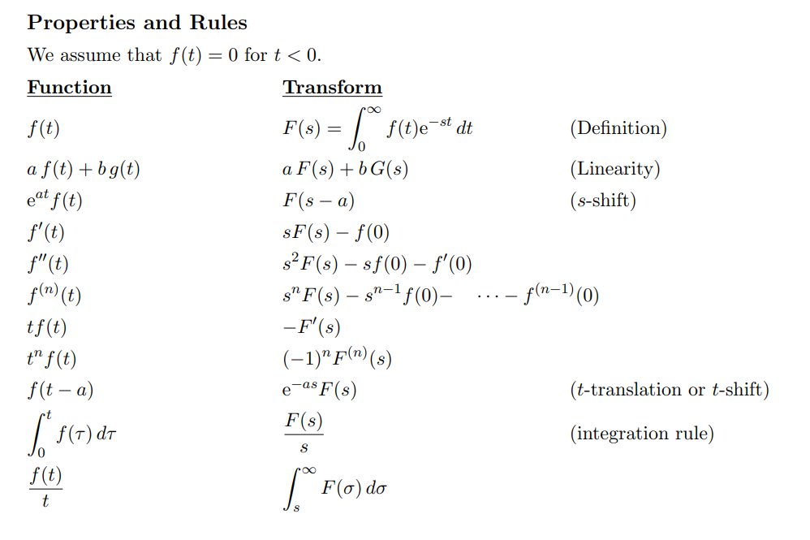
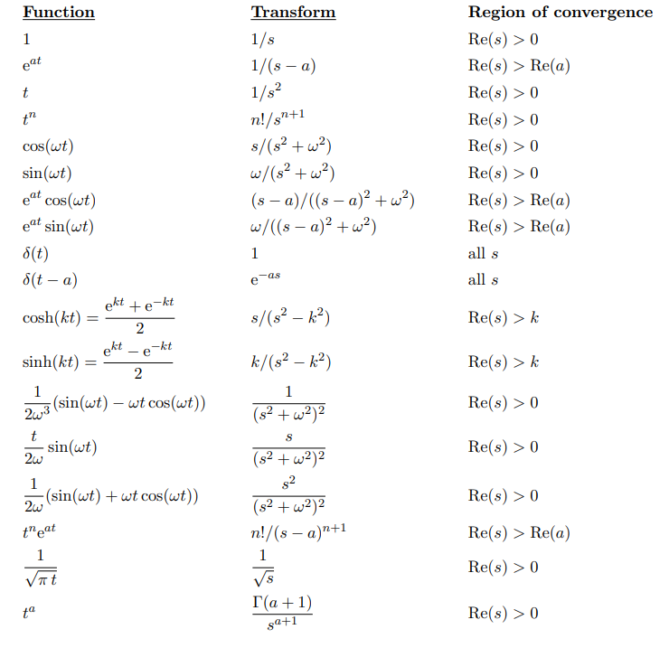

# Appendix

:::{.theorem title="Uniformization"}
Every Riemann surface $S$ is the quotient of a free proper holomorphic action of a group $G$ on the universal cover $\tilde S$ of $S$, so $S\cong \tilde S/G$ is a biholomorphism.
Moreover, $\tilde S$ is biholomorphic to either 

- $\CP^1$
- $\CC$
- $\DD$

:::

## Misc Basic Algebra

:::{.fact title="Standard forms of conic sections"}
\envlist

- Circle: $x^2 + y^2 = r^2$
- Ellipse: $\qty{\frac x a}^2  + \qty{\frac y b}^2 = 1$
- Hyperbola: $\qty{\frac x a}^2  - \qty{\frac y b}^2 = 1$
  - Rectangular Hyperbola: $xy = \frac{c^2}{2}$.
- Parabola: $-4ax + y^2 = 0$.

Mnemonic:
Write $f(x, y) = Ax^2 + Bxy + Cy^2 + \cdots$, then consider the discriminant $\Delta = B^2 - 4AC$:

- $\Delta < 0 \iff$ ellipse
  - $\Delta < 0$ and $A=C, B=0 \iff$ circle
- $\Delta = 0 \iff$ parabola
- $\Delta > 0 \iff$ hyperbola
:::

:::{.fact title="Completing the square"}
\[
x^2 - bx = (x - s)^2 - s^2 \quad\text{where} s = \frac{b}{2} \\
x^2 + bx = (x + s)^2 - s^2 \quad\text{where} s = \frac{b}{2}
.\]
:::

:::{.fact}
The sum of the interior angles of an $n\dash$gon is $(n-2)\pi$, where each angle is $\frac{n-2}{n}\pi$.
:::

:::{.definition title="The Dirichlet Problem"}
Given a bounded piecewise continuous function $u:S^1\to \RR$, is there a unique extension to a continuous harmonic function $\tilde u: \DD\to \RR$?

:::

:::{.remark}
More generally, this is a boundary value problem for a region where the *values* of the function on the boundary are given.
Compare to prescribing conditions on the normal vector on the boundary, which would be a Neumann BVP.
Why these show up: a harmonic function on a simply connected region has a harmonic conjugate, and solutions of BVPs are always analytic functions with harmonic real/imaginary parts.
:::

:::{.example title="Dirichlet problem on the strip"}
See section 27, example 1 in Brown and Churchill.
On the strip $(x, y)\in (0, \pi) \cross (0, \infty)$, set up the BVP for temperature on a thin plate with no sinks/sources:
\[
\laplacian T = 0 && T(0, y) = 0,\, T(\pi, y) = 0 \,\,\forall y \\ \\
T(x, 0) = \sin(x) && T(x, y) \converges{y\to\infty}\too 0
.\]

Then the following function is harmonic on $\RR^2$ and satisfies that Dirichlet problem:
\[
T(x ,y) = e^{-y} \sin(x) = \Re(-ie^{iz}) = \Im(e^{iz})
.\]
:::

:::{.exercise title="?"}
Show that there is no continuous square root function defined on all of $\CC$.
:::

:::{.solution}
Suppose $f(z)^2 = z$. 
Then $f$ is a section to the covering map
\[
p: \CC\units &\to \CC\units \\
z & \mapsto z^2
,\]
so $p\circ f = \id$.
Using $\pi_1(\CC\units) = \ZZ$, the induced maps are $p_*(1) = 2$ and $f_*(1) = n$ for some $n\in \ZZ$.
But then $p_* \circ f_*$ is multiplication by $2n$, contradicting $p_* \circ f_* = \id$ by functoriality.
:::

:::{.definition title="Laplace Transform"}
\[
\mcl(f, \xi) \da \int_\RR e^{-\xi x} f(x) \dx
.\]

- $f(t) = c \mapstofrom F(s) = cs\inv$
- $f(t) = e^{at} \mapstofrom F(s) = (s-a)\inv$.
- $f(t) = t \mapstofrom F(s) = s^{-2}$.
- $f(t) = \cos(at) \mapstofrom F(s) = s(s^2 + a^2)\inv$.

:::

:::{.remark}
\[
\hat{f}(\xi) \da \mcl(f, i\xi) \da \int_\RR f(x) e^{-i\xi x} \dx
.\]
:::

:::{.fact title="Table of Laplace Transforms"}

:::
