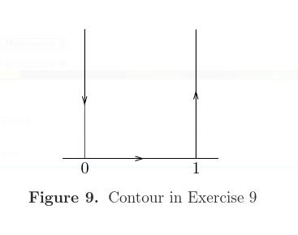
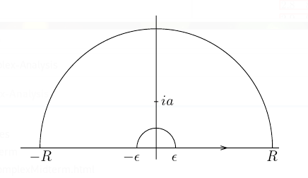

# Residues

## $\work$

:::{.problem title="?"}
Calculate
\[
\int_0^\infty {1 \over (1+z)^2 (z+9x^2)} \, dx
.\]
:::

## $\work$

:::{.problem title="?"}
Let $a>0$ and calculate
\[
\int_0^\infty {x\sin(x) \over x^2 + a^2} \,dx
.\]

:::

## $\work$

:::{.problem title="?"}
Calculate
\[
\int_0^\infty {\sqrt x \over (x+1)^2} \,dx
.\]

:::

## $\work$

:::{.problem title="?"}
Calculate
\[
\int_0^\infty {\cos(x) - \cos(4x) \over x^2} \, dx
.\]
:::

## $\work$

:::{.problem title="?"}
Let $a>0$ and calculate
\[
\int_0^\infty {x^2 \over (x^2 + a^2)^2} \, dx
.\]
:::

## $\work$

:::{.problem title="?"}
Calculate
\[
\int_0^\infty {\sin(x) \over x}\, dx
.\]
:::

## $\work$

:::{.problem title="?"}
Calculate
\[
\int_0^\infty {\sin(x) \over x(x^2+1)}\, dx
.\]

:::

## $\work$

:::{.problem title="?"}
Calculate
\[
\int_0^\infty {\sqrt x \over 1 + x^2} \, dx
.\]

:::

## $\work$

:::{.problem title="?"}
Calculate
\[
\int_{-\infty}^\infty {1+x^2 \over 1+x^4}\, dx
.\]

:::

## $\work$

:::{.problem title="?"}
Let $a>0$ and calculate
\[
\int_0^\infty {\cos(x) \over (x^2 + a^2)^2}\, dx
.\]
:::

## $\work$

:::{.problem title="?"}
Calculate
\[
\int_0^\infty {\sin^3(x) \over x^3} \, dx
.\]
:::

## $\work$

:::{.problem title="?"}
Let $n\in \ZZ^{\geq 1}$ and $0<\theta<\pi$ and show that
\[
{1\over 2\pi i} \int_{\abs z = 2} {z^n \over 1 -3z\cos(\theta) + z^2} \,dz = {\sin(n\theta) \over \sin(\theta)}
.\]
:::

## $\work$

:::{.problem title="?"}
Suppose $a>b>0$ and calculate
\[
\int_0^{2\pi} {1 \over (a+b\cos(\theta))^2} \,d\theta
.\]

:::

# Extra Questions

## $\work$

:::{.problem title="?"}
Suppose that $f$ is an analytic function in the region $D$ which
contains the point $a$. Let
$$F(z)= z-a-qf(z),\quad \text{where}\quad q \ \text{is a complex
parameter}.$$ 

1.
Let $K\subset D$ be a circle with the center at
point $a$ and also we assume that $f(z)\not =0$ for $z\in K$. Prove
that the function $F$ has one and only one zero $z=w$ on the closed
disc $\bar{K}$ whose boundary is the circle $K$ if 
\[
\displaystyle{ |q|<\min_{z\in K} \frac{|z-a|}{|f(z)|}.}
.\]

2.
Let $G(z)$ be an analytic function on the disk $\bar{K}$. Apply
the residue theorem to prove that
\[
\displaystyle{ \frac{G(w)}{F'(w)}=\frac{1}{2\pi i}\int_K \frac{G(z)}{F(z)} dz,}
\]
where $w$ is the zero from (1).

:::

## $\work$

:::{.problem title="?"}
Evaluate 
\[
\displaystyle{ \int_{0}^{\infty}\frac{x\sin x}{x^2+a^2} \, dx }
.\]

:::

## $\work$

:::{.problem title="?"}
Show that 
$$
\displaystyle \int_0^\infty \frac{x^{a-1}}{1+x^n} dx=\frac{\pi}{n\sin \frac{a\pi}{n}}
$$ 
using complex analysis, $0< a <
n$. Here $n$ is a positive integer.

:::

## $\done$

:::{.problem title="?"}
Show that
\[
\int_0^{\infty} {\cos(x) \over x^2 + b^2}\dx = {\pi e^{-b} \over 2b}
.\]
:::

:::{.solution}
\envlist

- Let $I$ be the integral over $\RR$.
  Since $f(x)$ is even, the original integral is ${1\over 2}I$.

- Write $f(z) = e^{iz} / (z^2 + b^2)$.
  Take a semicircular contour $\Gamma \da \gamma_1 + \gamma_2$ where $\gamma_1$ is $[-R, R]$ on $\RR$ and $\gamma_2$ is the usual half-circle of radius $R$.

- Claim: $\int_{\gamma_2} f \converges{R\to\infty}\too 0$, so $\int_\Gamma \to \int_\RR f(z)$.
  - Easy estimate, just be careful with the $i$ in the exponent:
  \[
  \abs{f} = { \abs{e^{iz} } \over \abs{z^2 + b^2} } = {e^{-\Re z} \over \abs{z^2 + b^2} } \leq {1\over \abs{z^2 + b^2}} \converges{R\to\infty}\too 0
  .\]

- Compute $\int_\Gamma f$ by residues: factor $z^2 + b^2 = (z+ib)(z-ib)$, so the contour only contains the order 1 pole $z_0 = ib$.

- Compute the residue:
\[
\Res_{z=ib}f = \lim_{z\to ib} (z-ib) {e^{iz} \over (z+ib)(z-ib) } = { e^{iz} \over z+ib} \evalfrom_{z=ib} = {e^{i(ib)} \over 2ib} = {e^{-b} \over 2ib}
.\]
- So the intermediate integral is $I$ is $2\pi i$ times this, i.e. $I = \pi e^{-b} / b$.
- And the original integral is ${1\over 2}I = \pi e^{-b} \over 2b$.

:::

### Tie's Extra Questions: Fall 2009

Suppose that $f$ is an analytic function in the region $D$ which
contains the point $a$. Let
$$F(z)= z-a-qf(z),\quad \text{where}~ q \ \text{is a complex parameter}.$$

(1) Let $K\subset D$ be a circle with the center at
point $a$ and also we assume that $f(z)\not =0$ for $z\in K$. Prove
that the function $F$ has one and only one zero $z=w$ on the closed
disc $\bar{K}$ whose boundary is the circle $K$ if $\displaystyle{
|q|<\min_{z\in K} \frac{|z-a|}{|f(z)|}.}$\

(2) Let $G(z)$ be an analytic function on the disk $\bar{K}$. Apply
the residue theorem to prove that
$\displaystyle{ \frac{G(w)}{F'(w)}=\frac{1}{2\pi
i}\int_K \frac{G(z)}{F(z)} dz,}$ where $w$ is the zero from (1).\

(3) If $z\in K$, prove that the function
$\displaystyle{\frac{1}{F(z)}}$ can be represented as a convergent
series with respect to $q$: $\displaystyle{
\frac{1}{F(z)}=\sum_{n=0}^{\infty} \frac{(qf(z))^n}{(z-a)^{n+1}}.}$

### Tie's Extra Questions: Fall 2009

Evaluate $$\displaystyle{ \int_{0}^{\infty}\frac{x\sin x}{x^2+a^2} \,
dx }.$$

### Tie's Extra Questions: Fall 2009

Show that 
\[
\displaystyle \int_0^\infty \frac{x^{a-1}}{1+x^n} \dx 
= \frac{\pi}{n\sin \frac{a\pi}{n}}
\]
using complex analysis, $0 < a \leq n$. Here $n$ is a positive integer.

### Spring 20202 HW 2 #  2.6.1

Show that
\[
\int_{0}^{\infty} \sin \left(x^{2}\right) d x=\int_{0}^{\infty} \cos \left(x^{2}\right) d x=\frac{\sqrt{2 \pi}}{4}
.\]

> Hint: integrate $e^{-x^2}$ over the following contour, using the fact that $\int_{-\infty}^{\infty} e^{-x^{2}} d x=\sqrt{\pi}$:

\

### Spring 20202 HW 2 #  2.6.2

Show that

\[
\int_{0}^{\infty} \frac{\sin x}{x} d x=\frac{\pi}{2}
.\]

> Hint: use the fact that this integral equals $\frac{1}{2 i} \int_{-\infty}^{\infty} \frac{e^{i x}-1}{x} d x$, and integrate around an indented semicircle.

### Spring 20202 HW 3 #  3.8.1
Use the following formula to show that the complex zeros of $\sin(\pi z)$ are exactly the integers, and they are each of order 1:
\[
\sin \pi z=\frac{e^{i \pi z}-e^{-i \pi z}}{2 i}
.\]

Calculate the residue of ${1\over \sin(\pi z)}$ at $z=n\in \ZZ$.

### Spring 20202 HW 3 #  3.8.2

Evaluate the integral
\[
\int_\RR {dx \over 1 + x^4}
.\]

What are the poles of ${1\over 1 + z^4}$ ?

### Spring 20202 HW 3 #  3.8.4
Show that
\[
\int_{-\infty}^{\infty} \frac{x \sin x}{x^{2}+a^{2}} d x=\pi e^{-a}, \quad \text { for all } a>0
.\]

### Spring 20202 HW 3 #  3.8.5
Show that if $\xi\in \RR$, then
\[
\int_{-\infty}^{\infty} \frac{e^{-2 \pi i x \xi}}{\left(1+x^{2}\right)^{2}} d x=\frac{\pi}{2}(1+2 \pi|\xi|) e^{-2 \pi|\xi|}
.\]

### Spring 20202 HW 3 #  3.8.6
Show that
\[
\int_{-\infty}^{\infty} \frac{d x}{\left(1+x^{2}\right)^{n+1}}=\frac{1 \cdot 3 \cdot 5 \cdots(2 n-1)}{2 \cdot 4 \cdot 6 \cdots(2 n)} \cdot \pi
.\]

### Spring 20202 HW 3 #  3.8.7
Show that
\[
\int_{0}^{2 \pi} \frac{d \theta}{(a+\cos \theta)^{2}}=\frac{2 \pi a}{\left(a^{2}-1\right)^{3 / 2}}, \quad \text { whenever } a>1
.\]

### Spring 20202 HW 3 #  3.8.8
Show that if $a,b\in \RR$ with $a > \abs{b}$, then
\[
\int_{0}^{2 \pi} \frac{d \theta}{a+b \cos \theta}=\frac{2 \pi}{\sqrt{a^{2}-b^{2}}}
.\]

### Spring 20202 HW 3 #  3.8.9
Show that
\[
\int_{0}^{1} \log (\sin \pi x) d x=-\log 2
.\]

> Hint: use the following contour.
>
> 

### Spring 20202 HW 3 #  3.8.10
Show that if $a>0$, then
\[
\int_{0}^{\infty} \frac{\log x}{x^{2}+a^{2}} d x=\frac{\pi}{2 a} \log a
.\]

> Hint: use the following contour.
>
> 

### Spring 20202 HW 3 #  6

a. 
Show (without using 3.8.9 in the S&S) that
\[
\int_0^{2\pi} \log\abs{1 - e^{i\theta}}~d\theta = 0
\]

b. 
Show that this identity is equivalent to S&S 3.8.9:
\[
\int_0^1 \log(\sin(\pi x)) ~dx = -\log 2
.\]

### Spring 20202 HW 3 #  7

Let $0<a<4$ and evaluate 
\[
\int_0^\infty \frac{x^{\alpha-1}}{1+x^3} ~dx
\]

### Spring 20202 HW 3 #  10

For $a> 0$, evaluate
\[
\int_0^{\pi/2} \frac{d\theta}{a + \sin^2 \theta}
\]

