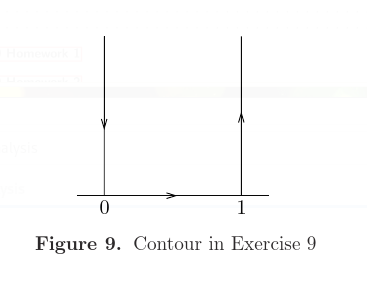
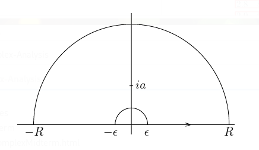

# Spring 2020 Homework 3

## Stein and Shakarchi

### Spring 20202 HW 3 #  3.8.1
Use the following formula to show that the complex zeros of $\sin(\pi z)$ are exactly the integers, and they are each of order 1:
\[
\sin \pi z=\frac{e^{i \pi z}-e^{-i \pi z}}{2 i}
.\]

Calculate the residue of ${1\over \sin(\pi z)}$ at $z=n\in \ZZ$.

### Spring 20202 HW 3 #  3.8.2

Evaluate the integral
\[
\int_\RR {dx \over 1 + x^4}
.\]

What are the poles of ${1\over 1 + z^4}$ ?

### Spring 20202 HW 3 #  3.8.4
Show that
\[
\int_{-\infty}^{\infty} \frac{x \sin x}{x^{2}+a^{2}} d x=\pi e^{-a}, \quad \text { for all } a>0
.\]

### Spring 20202 HW 3 #  3.8.5
Show that if $\xi\in \RR$, then
\[
\int_{-\infty}^{\infty} \frac{e^{-2 \pi i x \xi}}{\left(1+x^{2}\right)^{2}} d x=\frac{\pi}{2}(1+2 \pi|\xi|) e^{-2 \pi|\xi|}
.\]

### Spring 20202 HW 3 #  3.8.6
Show that
\[
\int_{-\infty}^{\infty} \frac{d x}{\left(1+x^{2}\right)^{n+1}}=\frac{1 \cdot 3 \cdot 5 \cdots(2 n-1)}{2 \cdot 4 \cdot 6 \cdots(2 n)} \cdot \pi
.\]

### Spring 20202 HW 3 #  3.8.7
Show that
\[
\int_{0}^{2 \pi} \frac{d \theta}{(a+\cos \theta)^{2}}=\frac{2 \pi a}{\left(a^{2}-1\right)^{3 / 2}}, \quad \text { whenever } a>1
.\]

### Spring 20202 HW 3 #  3.8.8
Show that if $a,b\in \RR$ with $a > \abs{b}$, then
\[
\int_{0}^{2 \pi} \frac{d \theta}{a+b \cos \theta}=\frac{2 \pi}{\sqrt{a^{2}-b^{2}}}
.\]

### Spring 20202 HW 3 #  3.8.9
Show that
\[
\int_{0}^{1} \log (\sin \pi x) d x=-\log 2
.\]

> Hint: use the following contour.
>
> 

### Spring 20202 HW 3 #  3.8.10
Show that if $a>0$, then
\[
\int_{0}^{\infty} \frac{\log x}{x^{2}+a^{2}} d x=\frac{\pi}{2 a} \log a
.\]

> Hint: use the following contour.
>
> 

### Spring 20202 HW 3 #  3.8.14
Prove that all entire functions that are injective are of the form $f(z) = az + b$ with $a,b\in \CC$ and $a\neq 0$.

> Hint: Apply the Casorati-Weierstrass theorem to $f(1/z)$.

### Spring 20202 HW 3 #  3.8.15
Use the Cauchy inequalities or the maximum modulus principle to solve the following problems:

a. Prove that if $f$ is an entire function that satisfies
    \[
    \sup _{|z|=R}|f(z)| \leq A R^{k}+B
    \]
    for all $R>0$, some integer $k\geq 0$, and some constants $A, B > 0$, then $f$ is a polynomial of degree $\leq k$.

b. Show that if $f$ is holomorphic in the unit disc, is bounded, and converges uniformly to zero in the sector $\theta < \arg(z) < \phi$ as $\abs{z} \to 0$, then $f \equiv 0$.

c. Let $w_1, \cdots w_n$ be points on $S^1 \subset \CC$.
    Prove that there exists a point $z\in S^1$ such that the product of the distances from $z$ to the points $w_j$ is at least 1.

    Conclude that there exists a point $w\in S^1$ such that the product of the above distances is *exactly* 1.

d. Show that if the real part of an entire function is bounded, then $f$ is constant.

### Spring 20202 HW 3 #  3.8.17

Let $f$ be non-constant and holomorphic in an open set containing the closed unit disc.

a. Show that if $\abs{f(z)} = 1$ whenever $\abs{z} = 1$, then the image of $f$ contains the unit disc.

    > Hint: Show that $f(z) = w_0$ has a root for every $w_0 \in \DD$, for which it suffices to show that $f(z) = 0$ has a root.
    > Conclude using the maximum modulus principle.

b. If $\abs{f(z)} \geq 1$ whenever $\abs{z} = 1$ and there exists a $z_0\in \DD$ such that $\abs{f(z_0)} < 1$, then the image of $f$ contains the unit disc.

### Spring 20202 HW 3 #  3.8.19

Prove that maximum principle for harmonic functions, i.e.

a. If $u$ is a non-constant real-valued harmonic function in a region $\Omega$, then $u$ can not attain a maximum or a minimum in $\Omega$.

b. Suppose $\Omega$ is a region with compact closure $\bar \Omega$.
    If $u$ is harmonic in $\Omega$ and continuous in $\bar \Omega$, then 
    \[
    \sup _{z \in \Omega}|u(z)| \leq \sup _{z \in \bar \Omega -\Omega}|u(z)|
    .\]

> Hint: to prove (a), assume $u$ attains a local maximum at $z_0$.
> Let $f$ be holomorphic near $z_0$ with $\Re(f) = u$, and show that $f$ is not an open map.
> Then (a) implies (b).

## Extra Problems

### Spring 20202 HW 3 #  1

Problem
: Prove that if $f$ has two Laurent series expansions,
  \[
  f(z) = \sum c_n(z-a)^n \quad\text{and}\quad f(z) = \sum c_n'(z-a)^n
  \]
  then $c_n = c_n'$.

### Spring 20202 HW 3 #  2

Problem
: Find Laurent series expansions of
  \[
  \frac{1}{1-z^2} + \frac{1}{3-z}
  \]
  How many such expansions are there? In what domains are each valid?

### Spring 20202 HW 3 #  3

Problem
: Let $P, Q$ be polynomials with no common zeros. Assume $a$ is a root of
$Q$.
  Find the principal part of $P/Q$ at $z=a$ in terms of $P$ and $Q$ if $a$ is (1) a simple root, and (2) a double root.

### Spring 20202 HW 3 #  4

Problem
:   Let $f$ be non-constant, analytic in $\abs{z} > 0$, where $f(z_n) = 0$
for infinitely many points $z_n$ with $\lim_{n\to\infty} z_n = 0$.

    Show that $z=0$ is an essential singularity for $f$.

    > Example: $f(z) = \sin(1/z)$.

### Spring 20202 HW 3 #  5

Problem
: Show that if $f$ is entire and $\lim_{z\to\infty}f(z) = \infty$, then
$f$ is a polynomial.

### Spring 20202 HW 3 #  6

Problem
:   \hfill
    a. Show (without using 3.8.9 in the S&S) that
    \[
    \int_0^{2\pi} \log\abs{1 - e^{i\theta}}~d\theta = 0
    \]
    b. Show that this identity is equivalent to S&S 3.8.9:
    \[
    \int_0^1 \log(\sin(\pi x)) ~dx = -\log 2
    .\]

### Spring 20202 HW 3 #  7

Problem
: Let $0<a<4$ and evaluate 
  \[
  \int_0^\infty \frac{x^{\alpha-1}}{1+x^3} ~dx
  \]

### Spring 20202 HW 3 #  8

Problem
:   Prove the fundamental theorem of Algebra using

    a.  Rouche's Theorem.
    b. The maximum modulus principle.

### Spring 20202 HW 3 #  9

Problem
:   Let $f$ be analytic in a region $D$ and $\gamma$ a rectifiable curve in
$D$ with interior in $D$.

    Prove that if $f(z)$ is real for all $z\in \gamma$, then $f$ is constant.

### Spring 20202 HW 3 #  10

Problem
: For $a> 0$, evaluate
  \[
  \int_0^{\pi/2} \frac{d\theta}{a + \sin^2 \theta}
  \]

### Spring 20202 HW 3 #  11

Problem
: Find the number of roots of $p(z) = 4z^4 - 6z + 3$ in $\abs{z} < 1$ and
$1 < \abs{z} < 2$ respectively.

### Spring 20202 HW 3 #  12

Problem
: Prove that $z^4 + 2z^3 -2z + 10$ has exactly one root in each open
quadrant.

### Spring 20202 HW 3 #  13

Problem
: Prove that for $a> 0$, $z\tan z - a$ has only real roots.

### Spring 20202 HW 3 #  14

Problem
:   Let $f$ be nonzero, analytic on a bounded region $\Omega$ and continuous
on its closure $\overline \Omega$.

    Show that if $\abs{f(z)} \equiv M$ is constant for $z\in \partial \Omega$, then $f(z) \equiv Me^{i\theta}$ for some real constant $\theta$.
