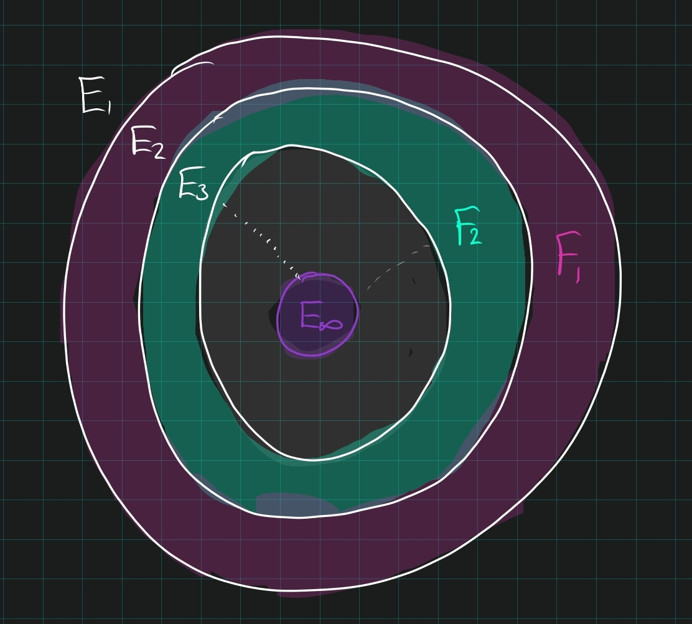

# Measure Theory

:::{.fact}
Some useful tricks:

- $\mu(A\sm B) = \mu(A) - \mu(B)$ if $\mu(B) < \infty$
- Write $f = f-f_n + f_n$
- If $G$ is measurable, then there exists an $E \supseteq G$ such $m(G) \leq m(E) + \eps$
- If $E$ is measurable,
  - $E = F_{\delta} \disjoint N$ for $N$ a null set.
  - $E \disjoint N = G_{\delta}$ for $N$ a null set.
:::

## Theorems

:::{.proposition title="Opens are unions of almost disjoint intervals."}
Every open subset of $\RR$ (resp $\RR^n$) can be written as a unique countable union of disjoint (resp. almost disjoint) intervals (resp. cubes).
:::

:::{.proposition title="Properties of Outer Measure"}
\envlist

1. Monotonicity: $E\subseteq F \implies m_*(E) \leq m_*(F)$.
2. Countable Subadditivity: $m_*(\union E_{i}) \leq \sum m_*(E_{i})$.
3. Approximation: For all $E$ there exists a $G \supseteq E$ such that $m_*(G) \leq m_*(E) + \varepsilon$.
4. Disjoint[^1] Additivity: $m_*(A \disjoint B) = m_*(A) + m_*(B)$. 

[^1]: This holds for outer measure **iff** $\mathrm{dist}(A, B) > 0$.

:::

:::{.proposition title="Subtraction of Measures"}
$$m(A) = m(B) + m(C) \qtext{and} m(C) < \infty \implies m(A) - m(C) = m(B).$$
:::

:::{.proposition title="Continuity of Measure"}
\[
\text{Continuity from below:} \quad 
E_{n} \nearrow E &\implies m(E_{n}) \to m(E) \\
\text{Continuity from above:} \quad 
m(E_{1}) < \infty \text{ and } E_{i} \searrow E &\implies m(E_{i}) \to m(E)
.\]

Mnemonic: $\lim_n \mu(E_n) = \mu(\lim E_n)$.
:::

:::{.proof title="sketches"}
\envlist

- From below: break into disjoint annuli $A_{2} = E_{2}\setminus E_{1}$, 
  - Apply countable disjoint additivity to $E = \disjoint A_{i}$.

- From above: funny step, use $E_{1} = (\disjoint E_{j}\setminus E_{j+1}) \disjoint (\intersect E_{j})$.
  - Taking measures yields a telescoping sum, and use countable additivity, then finiteness to subtract.

:::

:::{.proof title="of continuity of measure from below, detailed"}
For any measure $\mu$,
\[
\mu(F_1) < \infty,\, F_k \decreasesto F \implies \lim_{k\to\infty}\mu(F_k) = \mu(F)
,\]
  where $F_k \searrow F$ means $F_1 \supseteq F_2 \supseteq \cdots$ with $\intersect_{k=1}^\infty F_k = F$.
  - Note that $\mu(F)$ makes sense: each $F_k \in \mathcal{B}$, which is a $\sigma\dash$algebra and closed under countable intersections.

- Take disjoint annuli by setting $E_k \da F_k \sm F_{k+1}$
- Funny step: write
\[
F_1 = F \disjoint \Disjoint_{k=1}^{\infty} E_k
.\]

  - This is because $x\in F_1$ iff $x$ is in every $F_k$, so in $F$, **or**
  - $x\not \in F_1$ but $x\in F_2$, noting incidentally $x\in F_3, F_4,\cdots$, **or**,
  - $x\not\in F_2$ but $x\in F_3$, and so on.

- Now take measures, and note that we get a telescoping sum:
\[
\mu(F_1) 
&= \mu(F) + \sum_{k=1}^\infty \mu(E_k) \\
&= \mu(F) + \lim_{N\to\infty} \sum_{k=1}^N \mu(E_k) \\
&\da \mu(F) + \lim_{N\to\infty} \sum_{k=1}^N \mu(F_k \sm F_{k+1} ) \\
&\da \mu(F) + \lim_{N\to\infty} \sum_{k=1}^N \mu(F_k) - \mu(F_{k+1} ) \hspace{5em}\text{to be justified}\\
&= \mu(F) + \lim_{N\to\infty} 
[
(\mu(F_1) - \mu(F_2)) +  
(\mu(F_2) - \mu(F_3)) +  
\cdots \\ 
& \hspace{8em} + (\mu(F_{N-1}) - \mu(F_N)) +  
(\mu(F_N) - \mu(F_{N+1})) 
] \\ \\
&= \mu(F) + \lim_{N\to\infty} \mu(F_1) - \mu(F_{N+1}) \\
&= \mu(F) + \mu(F_1) - \lim_{N\to\infty} \mu(F_{N+1})
.\]

- Justifying the measure subtraction: the general statement is that for any pair of sets $A\subseteq X$, $\mu(X\sm A) = \mu(X) - \mu(A)$ when $\mu(A) < \infty$:
  \[
  X &= A \disjoint (X\sm A) \\
  \implies \mu(X) &= \mu(A) + \mu(X\sm A) && \text{countable additivity} \\
  \implies \mu(X) -\mu(A) &= \mu(X\sm A) && \text{if } \mu(A) < \infty 
  .\]

- Now use that $\mu(F_1)<\infty$ to justify subtracting it from both sides:
\[
\mu(F_1)
&= \mu(F) + \mu(F_1) - \lim_{N\to\infty} \mu(F_{N+1}) \\
\implies
0
&= \mu(F_1) - \lim_{N\to\infty} \mu(F_{N+1}) \\
\lim_{N\to\infty} \mu(F_{N+1})
&= \mu(F_1) 
.\]

- Now use that $\lim_{N\to\infty}\mu(F_{N+1}) = \lim_{N\to\infty} \mu(F_N)$ to conclude.
:::

:::{.theorem title="Measurable sets can be approximated by open/closed/compact sets."}
Suppose $E$ is measurable; then for every $\eps>0$,

1. There exists an open $O\supset E$ with $m(O\setminus E) < \eps$
2. There exists a closed $F\subset E$ with $m(E\setminus F) < \eps$
3. There exists a compact $K\subset E$ with $m(E\setminus K) < \eps$.
:::

:::{.proof title="that measurable sets can be approximated"}
\envlist

- (1): Take $\theset{Q_{i}} \covers E$ and set $O = \union Q_{i}$.
- (2): Since $E^c$ is measurable, produce $O\supset E^c$ with $m(O\setminus E^c) < \eps$.
  - Set $F = O^c$, so $F$ is closed.
  - Then $F\subset E$ by taking complements of $O\supset E^c$
  - $E\setminus F = O\setminus E^c$ and taking measures yields $m(E\setminus F) < \eps$
- (3): Pick $F\subset E$ with $m(E\setminus F) < \eps/2$.
  - Set $K_{n} = F\intersect \DD_{n}$, a ball of radius $n$ about $0$.
  - Then $E\setminus K_{n} \searrow E\setminus F$
  - Since $m(E) < \infty$, there is an $N$ such that $n\geq N \implies m(E\setminus K_{n}) < \eps$.
:::

:::{.proposition title="Translation and Dilation Invariance"}
Lebesgue measure is translation and dilation invariant.
:::

:::{.proof title="(Todo) of translation/dilation invariance"}
Obvious for cubes; if $Q_{i} \rightrightarrows E$ then $Q_{i} + k \rightrightarrows E + k$, etc.
<!--\todo{Flesh out this proof.}-->
:::

:::{.theorem title="Non-measurable sets exist"}
There is a non-measurable set.
:::

:::{.proof title="Constructing a non-measurable set"}
\envlist

- Use AOC to choose one representative from every coset of $\RR/\QQ$ on $[0, 1)$, which is countable, and assemble them into a set $N$
- Enumerate the rationals in $[0, 1]$ as $q_{j}$, and define $N_{j} = N + q_{j}$. These intersect trivially.
- Define $M \da \disjoint N_{j}$, then $[0, 1) \subseteq  M \subseteq [-1, 2)$, so the measure must be between 1 and 3.
- By translation invariance, $m(N_{j}) = m(N)$, and disjoint additivity forces $m(M) = 0$, a contradiction.
:::

:::{.proposition title="Borel Characterization of Measurable Sets"}
If $E$ is Lebesgue measurable, then $E = H \disjoint N$ where $H \in F_\sigma$ and $N$ is null.
:::

:::{.proof title="of Borel characterization"}
For every $\frac 1 n$ there exists a closed set $K_{n} \subset E$ such that $m(E\setminus K_{n}) \leq \frac 1 n$.
Take $K = \union K_{n}$, wlog $K_{n} \nearrow K$ so $m(K) = \lim m(K_{n}) = m(E)$.
Take $N\da E\setminus K$, then $m(N) = 0$.
:::

:::{.proposition title="Limsups/infs of measurable sets are measurable."}
If $A_{n}$ are all measurable, $\limsup A_{n}$ and $\liminf A_{n}$ are measurable.
:::

:::{.proof title="That limsups/infs are measurable"}
Measurable sets form a sigma algebra, and these are expressed as countable unions/intersections of measurable sets.
:::

:::{.theorem title="Borel-Cantelli"}
Let $\{E_{k}\}$ be a countable collection of measurable sets.
Then
$$
\sum_{k} m(E_{k}) < \infty \implies \text{ almost every } x\in \RR \text{ is in at most finitely many } E_{k}
.$$
:::

:::{.proof title="of Borel-Cantelli"}
\envlist

- If $E = \limsup_{j} E_{j}$ with $\sum m(E_{j}) < \infty$ then $m(E) = 0$.
- If $E_{j}$ are measurable, then $\limsup_{j} E_{j}$ is measurable.
- If $\sum_{j} m(E_{j}) < \infty$, then $\sum_{j=N}^\infty m(E_{j}) \converges{N\to\infty}\to 0$ as the tail of a convergent sequence.
- $E = \limsup_{j} E_{j} = \intersect_{k=1}^\infty \union_{j=k}^\infty E_{j} \implies E \subseteq \union_{j=k}^\infty$ for all $k$
- $E \subset \union_{j=k}^\infty \implies m(E) \leq \sum_{j=k}^\infty m(E_{j}) \converges{k\to\infty}\to 0$.
:::

:::{.proposition title="Extending the class of measurable functions."}

- Characteristic functions are measurable
- If $f_{n}$ are measurable, so are $\abs{f_{n}}, \limsup f_{n}, \liminf f_{n}, \lim f_{n}$, 
- Sums and differences of measurable functions are measurable, 
- Cones $F(x,y) = f(x)$ are measurable, 
- Compositions $f\circ T$ for $T$ a linear transformation are measurable,
- "Convolution-ish" transformations $(x,y) \mapsto f(x-y)$ are measurable
:::

:::{.proof title="Convolution"}
Take the cone on $f$ to get $F(x, y) = f(x)$, then compose $F$ with the linear transformation $T = [1, -1; 1, 0]$.
:::

