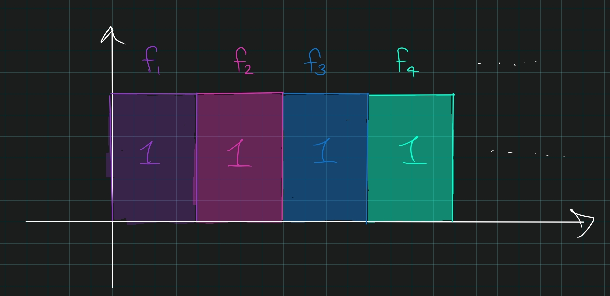
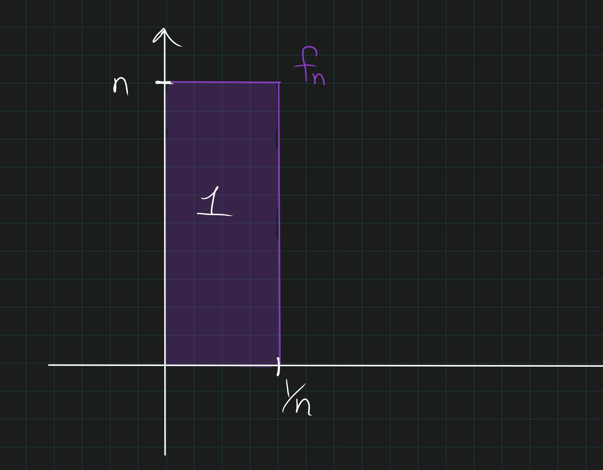

# Integration

## Unsorted 

:::{.remark title="A common proof technique"}
\envlist

- Show something holds for indicator functions.
- Show it holds for simple functions by linearity.
- Use $s_k \increasesto f$ and apply MCT to show it holds for $f$.
:::

:::{.remark title="on notation"}
\envlist

- $L^+$: measurable functions
- $L^1$: Lebesgue integral functions
:::

:::{.definition title="Simple Function"}
A **simple function** $s: \CC\to X$ is a finite linear combination of indicator functions of measurable sets, i.e. 
\[
s(x) = \sum_{j=1}^n c_j \chi_{E_j}(x)
.\]
:::

:::{.definition title="Lebesgue Integral"}
\[
\int_X f \da \sup \ts{ \int s(x) \dmu \st 0\leq s \leq f, s\text{ simple } } 
.\]

Note that if $s = \sum c_j \chi_{E_j}$ is simple, then
\[
\int_X s(x) \dmu \da \sum_{j=1}^n c_j \mu(E_j)
.\]

:::

:::{.remark title="Integrals split across disjoint sets"}
A useful fact: for $(X, \mathcal{M})$ a measure space, integrals split across disjoint sets:
\[
\int_X f = \int_{X\sm A} f + \int_A f && \forall\, A \in \mathcal{M} 
.\]

:::

:::{.definition title="Essential supremum and infimum, essentially bounded"}
An **essential lower bound** $b$ on a function $f$ is any real number such that $S_{b} \da \ts{x\st f(x) < b } = f\inv(-\infty, b)$ has measure zero.
The **essential infimum** is the supremum of all essential lower bounds, i.e. $\ess\inf f \da \sup_{b} \ts{b\st \mu S_b = 0}$.
This is the greatest lower bound almost everywhere.

Similarly an **essential upper bound** $c$ is any number such that $S^c \da f\inv(c, \infty)$ has measure zero, and the **essential supremum** is $\ess\sup f \da \inf_{c} \ts{c\st \mu S^c = 0}$, which is the least upper bound almost everywhere.

A function is **essentially bounded** if $\norm{f}_\infty \da \ess\sup f < \infty$.
These are functions which are bounded almost everywhere.
:::

:::{.example title="An essentially bounded but not bounded function"}
$f(x) = x\chi_\QQ(x)$ is essentially bounded but not bounded.
:::

:::{.proposition title="$L^\infty$ functions are equivalent to bounded almost-everywhere functions"}
If $f\in L^\infty(X)$, then $f$ is equal to some bounded function $g$ almost everywhere.
:::

:::{.theorem title="p-Test for Integrals"}
\[
\int_0^1 {1\over x^p} < \infty \iff  p < 1 \\
\int_1^\infty {1\over x^p} < \infty \iff  p > 1 
.\]
:::

:::{.slogan}
Large powers of $x$ help us in neighborhoods of infinity and hurt around zero.
:::

:::{.theorem title="Monotone Convergence"}
If $f_n: X\to [0, \infty) \in L^+$ and $f_n \nearrow f$ almost everywhere, then
$$
\lim \int f_n
= \int \lim f_n = \int f
\quad \text{i.e.}~~ \int f_n \to \int f
.$$

:::

:::{.slogan}
Measurable, non-negative, increasing pointwise a.e. allows commuting limits and integrals.
:::

:::{.proof title="of MCT"}
\todo[inline]{todo}

:::

:::{.theorem title="Dominated Convergence"}
If $f_n \in L^1$ and $f_n \to f$ almost everywhere with $\abs {f_n} \leq g$ for some $g\in L^1$, then $f\in L^1$ and
$$
\lim \int f_n = \int \lim f_n = \int f \quad \text{i.e.}~~ \int f_n \to \int f < \infty
,$$

and more generally,
$$
\int \abs{f_n - f} \to 0
.$$

> Positivity *not* needed.

:::

:::{.proof title="of DCT"}
\todo[inline]{todo}

:::

:::{.theorem title="Generalized DCT"}
If 

- $f_n \in L^1$ with $f_n \to f$ almost everywhere, 
- There exist $g_n \in L^1$ with $\abs{f_n} \leq g_n$, $g_n \geq 0$.
- $g_n\to g$ almost everywhere with $g\in L^1$, and 
- $\lim \int g_n = \int g$, 

then $f\in L^1$ and $\lim \int f_n = \int f < \infty$.

> Note that this is the DCT with $\abs{f_n} < \abs{g}$ relaxed to $\abs{f_n} < g_n \to g\in L^1$.

:::

:::{.proof}
Proceed by showing $\limsup \int f_n \leq \int f \leq \liminf \int f_n$:

- $\int f \geq \limsup \int f_n$:
\[
\int g - \int f 
&= \int \qty{g-f} \\
&\leq \liminf \int \qty{g_n - f_n} \quad \text{Fatou} \\
&= \lim \int g_n + \liminf \int (-f_n) \\
&= \lim \int g_n - \limsup \int f_n \\
&= \int g - \limsup \int f_n \\
\\
\implies \int f &\geq \limsup \int f_n
.\]

  - Here we use $g_n - f_n \converges{n\to\infty} g-f$ with $0 \leq \abs{f_n} - f_n \leq g_n - f_n$, so $g_n - f_n$ are nonnegative (and measurable) and Fatou's lemma applies.

- $\int f \leq \liminf \int f_n$:
\[
\int g + \int f 
&= \int(g+f) \\
&\leq \liminf \int \qty{g_n + f_n} \\
&= \lim \int g_n + \liminf \int f_n \\
&= \int g + \liminf f_n \\
\\
\int f &\leq \liminf \int f_n
.\]

  - Here we use that $g_n + f_n \to g+f$ with $0 \leq \abs{f_n} + f_n \leq g_n + f_n$ so Fatou's lemma again applies.
:::

:::{.proposition title="Convergence in $L^1$ implies convergence of $L^1$ norm"}
If $f\in L^1$, then
\[
\int\abs{f_n - f} \to 0 \iff \int \abs{f_n} \to \int \abs{f}
.\]
:::

:::{.proof}
Let $g_n = \abs{f_n} - \abs{f_n - f}$, then $g_n \to \abs{f}$ and 
\[
\abs{g_n} = \abs{ \abs{f_n} - \abs{f_n - f} } \leq \abs{f_n - (f_n - f)} = \abs{f} \in L^1
,\]
so the DCT applies to $g_n$ and
\[
\norm{f_n - f}_1 = \int \abs{f_n - f} + \abs{f_n} - \abs{f_n}
= \int \abs{f_n} - g_n\\
\to_{DCT} \lim \int \abs{f_n} - \int \abs{f}
.\]
:::

:::{.theorem title="Fatou"}
If $f_n$ is a sequence of nonnegative measurable functions, then
\[
\liminf_n \int f_n 
&\geq \int \liminf_n f_n \\
\limsup_n \int f_n &\leq \int \limsup_n f_n
.\]
:::

:::{.proof title="of Fatou"}
\todo[inline]{Prove Fatou}

:::

:::{.theorem title="Tonelli (Non-Negative, Measurable)"}
For $f(x, y)$ **non-negative and measurable**, for almost every $x\in \RR^n$, 

- $f_x(y)$ is a **measurable** function
- $F(x) = \int f(x, y) ~dy$ is a **measurable** function,
- For $E$ measurable, the slices $E_x \definedas \theset{y \suchthat (x, y) \in E}$ are measurable.
- $\int f = \int \int F$, i.e. any iterated integral is equal to the original.
:::

:::{.theorem title="Fubini (Integrable)"}
For $f(x, y)$ **integrable**, for almost every $x\in \RR^n$, 

- $f_x(y)$ is an **integrable** function
- $F(x) \definedas \int f(x, y) ~dy$ is an **integrable** function,
- For $E$ measurable, the slices $E_x \definedas \theset{y \suchthat (x, y) \in E}$ are measurable.
- $\int f = \int \int f(x,y)$, i.e. any iterated integral is equal to the original

:::

:::{.theorem title="Fubini-Tonelli"}
If any iterated integral is **absolutely integrable**, i.e. $\int \int \abs{f(x, y)} < \infty$, then $f$ is integrable and $\int f$ equals any iterated integral.
:::

:::{.proposition title="Measurable Slices"}
Let $E$ be a measurable subset of $\RR^n$. Then

- For almost every $x\in \RR^{n_1}$, the slice $E_x \definedas \theset{y \in \RR^{n_2} \mid  (x,y) \in E}$ is measurable in $\RR^{n_2}$.
- The function

\[
F: \RR^{n_1} &\to \RR \\
x &\mapsto m(E_x) = \int_{\RR^{n_2}} \chi_{E_x} ~dy
\]
is measurable and 
\[
m(E) = \int_{\RR^{n_1}} m(E_x) ~dx 
= \int_{\RR^{n_1}} \int_{\RR^{n_2}} \chi_{E_x} ~dy ~dx
.\]
:::

:::{.proof title="of measurable slices"}
\envlist

$\implies$:

- Let $f$ be measurable on $\RR^n$.
- Then the cylinders $F(x, y) = f(x)$ and $G(x, y) = f(y)$ are both measurable on $\RR^{n+1}$.
- Write $\mathcal{A} = \theset{G \leq F} \intersect \theset{G \geq 0}$; both are measurable.

$\impliedby$:

- Let $A$ be measurable in $\RR^{n+1}$.
- Define $A_x = \theset{y\in \RR \mid (x, y) \in \mathcal{A}}$, then $m(A_x) = f(x)$.
- By the corollary, $A_x$ is measurable set, $x \mapsto A_x$ is a measurable function, and $m(A) = \int f(x) ~dx$.
- Then explicitly, $f(x) = \chi_{A}$, which makes $f$ a measurable function.
:::

:::{.proposition title="Differentiating Under an Integral"}
If $\abs{\dd{}{t}f(x, t)} \leq g(x) \in L^1$, then letting $F(t) = \int f(x, t) ~dt$,
\[
\dd{}{t} F(t)
&\definedas \lim_{h \rightarrow 0} \int \frac{f(x, t+h)-f(x, t)}{h} d x \\
&\eq^{\scriptstyle\text{DCT}} \int \dd{}{t} f(x, t) ~dx
.\]

To justify passing the limit, let $h_k \to 0$ be any sequence and define
$$
f_k(x, t) = \frac{f(x, t+h_k)-f(x, t)}{h_k}
,$$
so $f_k \converges{k\to\infty}\too \dd{f}{t}$ pointwise.

Apply the MVT to $f_k$ to get $f_k(x, t) = f_k(\xi, t)$ for some $\xi \in [0, h_k]$, and show that $f_k(\xi, t) \in L_1$.
:::

:::{.proposition title="Commuting Sums with Integrals (non-negative)"}
If $f_n$ are non-negative and $\sum \int \abs f_n < \infty$, then $\sum \int f_n = \int \sum f_n$.
:::

:::{.proof}
- Idea: MCT. 
- Let $F_N = \sum^N f_n$ be a finite partial sum; 
- Then there are simple functions $\phi_n \nearrow f_n$ 
- So $\sum^N \phi_n \nearrow F_N$ and MCT applies
:::

:::{.theorem title="Commuting Sums with Integrals (integrable)"}
If $\theset{f_n}$ integrable with either $\sum \int \abs{f_n} < \infty$ or $\int\sum \abs{f_n} < \infty$, then
\[  
\int\sum f_n = \sum \int f_n
.\]
:::

:::{.proof}
\envlist

- By Tonelli, if $f_n(x) \geq 0$ for all $n$, taking the counting measure allows interchanging the order of "integration".
- By Fubini on $\abs{f_n}$, if either "iterated integral" is finite then the result follows.
:::

:::{.proposition title="?"}
If $f_k \in L^1$ and $\sum \norm{f_k}_1 < \infty$ then $\sum f_k$ converges almost everywhere and in $L^1$.
:::

:::{.proof title="?"}
Define $F_N = \sum^N f_k$ and $F = \lim_N F_N$, then $\norm{F_N}_1 \leq \sum^N \norm{f_k} < \infty$ so $F\in L^1$ and $\norm{F_N - F}_1 \to 0$ so the sum converges in $L^1$.
Almost everywhere convergence: ?
:::

## Examples of (Non)Integrable Functions

:::{.example title="Examples of integrable functions"}
\envlist
- $\int {1\over 1 + x^2} = \arctan(x) \converges{x\to\infty}\to \pi/2 < \infty$

- Any bounded function (or continuous on a compact set, by EVT)
- $\int_0^1 {1 \over \sqrt{x}} < \infty$
- $\int_0^1 {1\over x^{1-\eps}} < \infty$
- $\int_1^\infty {1\over x^{1+\eps}} < \infty$

:::

:::{.example title="Examples of non-integrable functions"}
\envlist

- $\int_0^1 {1\over x} = \infty$.
- $\int_1^\infty {1\over x} = \infty$.
- $\int_1^\infty {1 \over \sqrt{x}} = \infty$
- $\int_1^\infty {1\over x^{1-\eps}} = \infty$
- $\int_0^1 {1\over x^{1+\eps}} = \infty$

:::

## $L^1$ Facts

:::{.proposition title="Zero in $L^1$ iff zero almost everywhere"}
For $f\in L^+$, 
\[  
\int f = 0 \quad\iff\quad f \equiv 0 \text{ almost everywhere}
.\]
:::

:::{.proof}
\envlist

- Obvious for simple functions:
  - If $f(x) = \sum_{j=1}^n c_j \chi_{E_j}$, then $\int f = 0$ iff for each $j$, either $c_j=0$ or $m(E_j) = 0$.
  - Since nonzero $c_j$ correspond to sets where $f\neq 0$, this says $m\qty{\theset{f\neq 0}} = 0$.
- $\impliedby$:
  - If $f= 0$ almost everywhere and $\phi \nearrow f$, then $\phi = 0$ almost everywhere since $\phi(x) \leq f(x)$
  -Then
  \[  
  \int f = \sup_{\phi \leq f} \int \phi = \sup_{\phi \leq f} 0 = 0
  .\]
- $\implies$:
  - Instead show negating "$f=0$ almost everywhere" implies $\int f \neq 0$.
  - Write $\theset{f\neq 0} = \union_{n\in \NN} S_n$ where $S_n \definedas \theset{x\suchthat f(x) \geq {1\over n}}$.
  - Since "not $f=0$ almost everywhere", there exists an $n$ such that $m(S_n) > 0$.
  - Then
  \[  
  0 < {1\over n} \chi_{E_n} \leq f \implies 
  0 < \int {1\over n} \chi_{E_n} \leq \int f
  .\]
:::

:::{.proposition title="Translation Invariance"}
The Lebesgue integral is translation invariant, i.e.
\[
\int f(x) ~dx = \int f(x + h) ~dx &&\text{for any} h
.\]

:::

:::{.proof}
\envlist

- Let $E\subseteq X$; for characteristic functions, 
\[
\int_X \chi_E(x+h) 
= \int_{X} \chi_{E+h}(x) = m(E+h) = m(E) = \int_X \chi_E(x)
\] 
  by translation invariance of measure.
- So this also holds for simple functions by linearity.
- For $f\in L^+$, choose $\phi_n \nearrow f$ so $\int \phi_n \to \int f$.
- Similarly, $\tau_h \phi_n \nearrow \tau_h f$ so $\int \tau_h f \to \int f$
- Finally $\theset{\int \tau_h \phi} = \theset{\int \phi}$ by step 1, and the suprema are equal by uniqueness of limits.
:::

:::{.proposition title="Integrals distribute over disjoint sets"}
If $X \subseteq A \union B$, then $\int_X f \leq \int_A f + \int_{A^c} f$ with equality iff $X = A\disjoint B$.
:::

:::{.proposition title="Uniformly continuous $L^1$ functions vanish at infinity."}
If $f \in L^1$ and $f$ is uniformly continuous, then $f(x) \converges{\abs{x}\to\infty}\to 0$.
:::

:::{.warnings}
This doesn't hold for general $L^1$ functions, take any train of triangles with height 1 and summable areas.
:::

:::{.theorem title="Small Tails in $L^1$"}
If $f\in L^1$, then for every $\varepsilon$ there exists a radius $R$ such that if $A = B_R(0)^c$, then $\int_A \abs f < \varepsilon$. 
:::

:::{.proof}
\envlist

- Approximate with compactly supported functions.
- Take $g\converges{L_1}\to f$ with $g\in C_c$
- Then choose $N$ large enough so that $g=0$ on $E\definedas B_N(0)$
- Then \[ \int_E \abs{f} \leq \int_E\abs{f-g} + \int_E \abs{g}.\]
:::

:::{.proposition title="$L^1$ functions are absolutely continuous."}
$m(E) \to 0 \implies \int_E f \to 0$.
:::

:::{.proof title="?"}
Approximate with compactly supported functions.
Take $g\converges{L_1}\to f$, then $g \leq M$ so $\int_E{f} \leq \int_E{f-g} + \int_E g \to 0 + M \cdot m(E) \to 0$.
:::

:::{.proposition title="$L^1$ functions are finite almost everywhere."}
If $f\in L^1$, then $m(\theset{f(x) = \infty}) = 0$.
:::

:::{.proof title="?"}
Idea: Split up domain
Let $A = \theset{f(x) = \infty}$, then $\infty > \int f = \int_A f + \int_{A^c} f = \infty \cdot m(A) + \int_{A^c} f \implies m(X) =0$.
:::

:::{.theorem title="Continuity in $L^1$"}
\[ 
\norm{\tau_h f - f}_1 \converges{h\to 0}\to 0
\]
:::

:::{.proof}
\envlist

Approximate with compactly supported functions.
Take $g\converges{L_1}\to f$ with $g\in C_c$.
\[
\int f(x+h) - f(x) 
&\leq \int f(x+h) - g(x+h) + \int g(x+h) - g(x) + \int g(x) - f(x) \\
&\converges{?\to?}\to 2 \varepsilon + \int g(x+h) - g(x) \\
&= \int_K g(x+h) - g(x) + \int_{K^c} g(x+h) - g(x)\\
&\converges{??}\to 0
,\]
which follows because we can enlarge the support of $g$ to $K$ where the integrand is zero on $K^c$, then apply uniform continuity on $K$.
:::

:::{.proposition title="Integration by parts, special case"}
\[
F(x):=\int_{0}^{x} f(y) d y \quad \text { and } \quad G(x):=\int_{0}^{x} g(y) d y \\ 
\implies
\int_{0}^{1} F(x) g(x) d x=F(1) G(1)-\int_{0}^{1} f(x) G(x) d x
.\]

:::

:::{.proof title="?"}
Fubini-Tonelli, and sketch region to change integration bounds.
:::

:::{.theorem title="Lebesgue Density"}
\[
A_{h}(f)(x):=\frac{1}{2 h} \int_{x-h}^{x+h} f(y) d y
\implies \norm{A_h(f) - f} \converges{h\to 0}\to 0
.\]
:::

:::{.proof title="?"}
Fubini-Tonelli, and sketch region to change integration bounds, and continuity in $L^1$.
:::

## Lp Facts

:::{.proposition title="Dense subspaces of $L^2(I)$ "}
The following are dense subspaces of $L^2([0, 1])$:

- Simple functions
- Step functions
- $C_0([0, 1])$
- Smoothly differentiable functions $C_0^\infty([0, 1])$
- Smooth compactly supported functions $C_c^\infty$
:::

:::{.theorem title="?"}
\[
m(X) < \infty \implies \lim_{p\to\infty} \norm{f}_p = \norm{f}_\infty 
.\]
:::

:::{.proof title="?"}
Let $M = \norm{f}_\infty$.

- For any $L < M$, let $S = \theset{\abs{f} \geq L}$. 
- Then $m(S) > 0$ and

\[
\pnorm{f}p 
&= \left( \int_X \abs{f}^p \right)^{\frac 1 p} \\
&\geq \left( \int_S \abs{f}^p \right)^{\frac 1 p} \\
&\geq L ~m(S)^{\frac 1 p} \converges{p\to\infty}\to L \\
&\implies \liminf_p \pnorm{f}p \geq M
.\]

We also have
\[
\pnorm{f}p 
&=  \left( \int_X \abs{f}^p \right)^{\frac 1 p} \\
&\leq \left( \int_X M^p \right)^{\frac 1 p} \\
&= M ~m(X)^{\frac 1 p} \mapsvia{p\to\infty} M \\
&\implies \limsup_p \pnorm{f}p \leq M
.\]

:::

:::{.theorem title="Duals for $L^p$ spaces"}
For $1\leq p< \infty$, $(L^p)\dual \cong L^q$.
:::

:::{.proof title="$p=1$ case"}
?
:::

\todo[inline]{todo}

:::{.proof title="$p=2$ case"}
Use Riesz Representation for Hilbert spaces.
:::

:::{.proposition title="$L^1$ is not quite the dual of $L^\infty$."}
$L^1 \subset (L^\infty)\dual$, since the isometric mapping is always injective, but *never* surjective.
:::

## Counterexamples

:::{.proposition title="a.e. convergence never implies $L^p$ convergence"}
Sequences $f_k \converges{a.e.}\to f$ but $f_k \converges{L^p}{\not\to} f$:

- For $1\leq p < \infty$:
	The skateboard to infinity, $f_k = \chi_{[k, k+1]}$.

	Then $f_k \converges{a.e.}\to 0$ but $\norm{f_k}_p = 1$ for all $k$.

	> Converges pointwise and a.e., but not uniformly and not in norm.

- For $p = \infty$:
  The sliding boxes $f_k = k \cdot \chi_{[0, \frac 1 k]}$.

	Then similarly $f_k \converges{a.e.}\to 0$, but $\norm{f_k}_p = 1$ and $\norm{f_k}_\infty = k \to \infty$

	> Converges a.e., but not uniformly, not pointwise, and not in norm.
:::

:::{.proposition title="The four big counterexamples in convergence"}
\envlist

1. Uniform: $f_n \uniformlyconverges f: \forall \varepsilon ~\exists N \suchthat ~n\geq N \implies \abs{f_N(x) - f(x)} < \varepsilon \quad \forall x.$
2. Pointwise: $f_n(x) \to f(x)$ for all $x$. (This is just a sequence of numbers)
3. Almost Everywhere: $f_n(x) \to f(x)$ for almost all $x$.
4. Norm: $\norm{f_n - f}_1 = \int \abs{f_n(x) - f(x)} \to 0$.

We have $1 \implies 2 \implies 3$, and in general no implication can be reversed, but (**warning**) none of $1,2,3$ imply $4$ or vice versa.

- $f_n = (1/n) \chi_{(0, n)}$. This converges uniformly to 0, but the integral is identically 1. So this satisfies 1,2,3 and not 4.

  

- $f_n = \chi_{(n, n+1)}$ (skateboard to infinity). This satisfies 2,3 but not 1, 4.

  

- $f_n = n\chi_{(0, \frac 1 n)}$. This satisfies 3 but not 1,2,4.

  

- $f_n:$ one can construct a sequence where $f_n \to 0$ in $L^1$ but is not 1,2, or 3.
  The construction:

  - Break $I$ into $2$ intervals, let $f_1$ be the indicator on the first half, $f_2$ the indicator on the second.
  - Break $I$ into $2^2=4$ intervals, like $f_3$ be the indicator on the first quarter, $f_4$ on the second, etc.
  - Break $I$ into $2^k$ intervals and cyclic through $k$ indicator functions.

  

  - Then $\int f_n = 1/2^n \to 0$, but $f_n\not\to 0$ pointwise since for every $x$, there are infinitely many $n$ for which $f_n(x) = 0$ and infinitely many for which $f_n(x) = 1$.

:::

