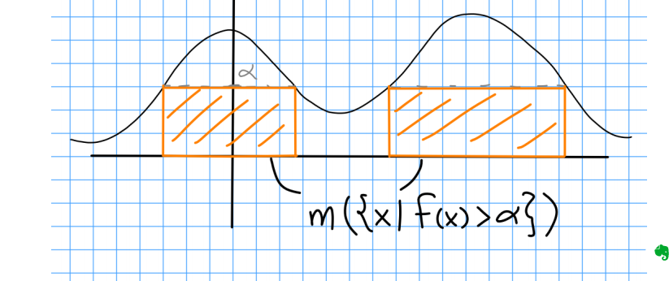

# Common Inequalities

:::{.proposition title="Reverse Triangle Inequality"}
\[  
\abs{\norm{x} - \norm{y}} \leq \norm{x - y}
.\]

:::

:::{.proposition title="Chebyshev's Inequality"}
The most often used form here:
\[  
\mu \qty{ f\inv\qty{(\alpha, \infty)} } \da \mu\qty{\ts{ x\in X \st \abs{f(x)} > \alpha  }} \leq {1\over \alpha} \norm{f}_1 \da {1\over \alpha} \int_X \abs{f}
.\]
Proof: let $S_\alpha$ be the set appearing, then $\alpha \mu(S_\alpha)$ is the sum of areas of certain boxes below the graph of $f$.
Interpret $\int_X f$ as the total area under the graph to make the inequality obvious.

The probability interpretation: $\PP(X\geq \alpha) \leq {1\over \alpha} \EE(X)$.

The more general version:
\[
\mu \qty{ f\inv\qty{(\alpha, \infty)} } \da \mu\qty{\ts{ x\in X \st \abs{f(x)} > \alpha }  } \leq {1\over \alpha^p} \norm{f}_p^p \da{1\over \alpha^p} \int_X \abs{f}^p 
.\]
Proof:
\[
\norm{f}_p^p = \int \abs{f}^p \geq \int_{S_\alpha} \abs{f}^p \geq \alpha^p \int_{S_\alpha} 1 = \alpha^p \mu(S_\alpha)
.\]

:::

:::{.proposition title="Markov's Inequality"}

:::

:::{.proposition title="Holder's Inequality"}
\[  
\frac 1 p + \frac 1 q = 1 \implies \pnorm{f g}{1} \leq \pnorm{f}{p} \pnorm{g}{q}
.\]

With integrals:
\[
\int_X \abs{fg} \leq \qty{\int_X \abs{f}^p}^{1\over p} \qty{\int_X \abs{f}^q}^{1\over q}
.\]

:::

:::{.proof title="of Holder's inequality"}
It suffices to show this when $\norm{f}_p = \norm{g}_q = 1$, since
\[  
\|f g\|_{1} \leq\|f\|_{p}\|f\|_{q} \Longleftrightarrow \int \frac{|f|}{\|f\|_{p}} \frac{|g|}{\|g\|_{q}} \leq 1
.\]

Using $AB \leq \frac 1 p A^p + \frac 1 q B^q$, we have
\[  
\int|f \| g| \leq \int \frac{|f|^{p}}{p} \frac{|g|^{q}}{q}=\frac{1}{p}+\frac{1}{q}=1
.\]

:::

:::{.example title="Application of Holder's inequality: containment of $L^p$ spaces"}
For finite measure spaces,
\[
1 \leq p < q \leq \infty \implies L^q \subset L^p \quad (\text{ and } \ell^p \subset \ell^q)
.\]

:::

:::{.proof title="of containment of $L^p$ spaces"}
Fix $p, q$, let $r = \frac q p$ and $s = \frac{r}{r-1}$ so $r\inv + s\inv = 1$.
Then let $h = \abs{f}^p$:

\[  
\pnorm{f}{p}^p 
= \pnorm{h\cdot 1}1 \leq \pnorm{1}s \pnorm{h}r 
= \mu(X)^{\frac 1 s} \pnorm{f}q^{\frac q r}
\implies \pnorm{f}p 
\leq \mu(X)^{\frac 1 p - \frac 1 q} \pnorm{f}q
.\]

> Note: doesn't work for $\ell_p$ spaces, but just note that $\sum \abs{x_n} < \infty \implies x_n < 1$ for large enough $n$, and thus $p<q \implies \abs{x_n}^q \leq \abs{x_n}^q$.

:::

:::{.proposition title="Cauchy-Schwarz Inequality"}
\[  
\abs{\inner{f}{g}} = \leq \pnorm{f}2 \pnorm{g}2
&& \text{with equality} \iff f = \lambda g
.\]

:::

:::{.remark}
In general, Cauchy-Schwarz relates inner product to norm, and only happens to relate norms in $L^1$.
Some other useful forms:
\[
\left(\sum_{k=1}^{n} a_{k} b_{k}\right)^{2} \leq\left(\sum_{k=1}^{n} a_{k}^{2}\right)\left(\sum_{k=1}^{n} b_{k}^{2}\right)
.\]

:::

:::{.proposition title="Minkowski's Inequality"}
\[  
1\leq p < \infty \implies \pnorm{f+g}{p} \leq \pnorm{f}{p}+ \pnorm{g}{p}
.\]

:::

:::{.remark}
This does not handle $p=\infty$ case.
Use to prove $L^p$ is a normed space.
:::

:::{.proof title="?"}
\envlist

- We first note
\[  
\abs{f+g}^p = \abs{f+g}\abs{f+g}^{p-1} \leq \left( \abs{f} + \abs{g}\right) \abs{f+g}^{p-1}
.\]

- Note that if $p,q$ are conjugate exponents then
\[  
\frac 1 q &= 1 - \frac 1 p = \frac{p-1} p \\
q &= \frac p {p-1} 
.\]

- Then taking integrals yields
\[  
\norm{f+g}_p^p &=
\int \abs{f+g}^p \\
&\leq \int \left( \abs{f} + \abs{g}\right) \abs{f+g}^{p-1} \\ 
&= \int \abs{f} \abs{f+g}^{p-1} + \int \abs{g} \abs{f+g}^{p-1} \\
&= \norm{f(f+g)^{p-1}}_1 + \norm{g(f+g)^{p-1}}_1 \\
&\leq \norm{f}_p ~\norm{(f+g)^{p-1})}_q + \norm{g}_p ~\norm{(f+g)^{p-1})}_q \\
&= \left( \norm{f}_p + \norm{g}_p \right) \norm{ (f+g)^{p-1})}_q \\
&= \left( \norm{f}_p + \norm{g}_p \right) \left( \int \abs{f+g}^{(p-1)q} \right)^{\frac 1 q} \\
&= \left( \norm{f}_p + \norm{g}_p \right) \left( \int \abs{f+g}^{p} \right)^{1 - \frac 1 p} \\
&= \left( \norm{f}_p + \norm{g}_p \right) \frac{\int \abs{f+g}^{p} }{\left( \int \abs{f+g}^{p} \right)^{\frac 1 p}} \\
&= \left( \norm{f}_p + \norm{g}_p \right)  \frac{\norm{f+g}_p^p}{\norm{f+g}_p}
.\]

- Cancelling common terms yields
\[  
1 &\leq \left( \norm{f}_p + \norm{g}_p \right) \frac{1}{\norm{f+g}_p} \\
&\implies 
\norm{f+g}_p
\leq \norm{f}_p + \norm{g}_p 
.\]

:::
  
:::{.proposition title="Young's Inequality"}
\[
\frac 1 p + \frac 1 q = \frac 1 r + 1 \implies
\|f \ast g\|_{r} \leq\|f\|_{p}\|g\|_{q}
\]

:::

:::{.remark title="some useful special cases"}
\[  
\norm{f\ast g}_1      & \leq \norm{f}_1 \norm{g}_1 \\
\|f * g\|_{p}         & \leq \norm{f}_1 \norm{g}p, \\
\norm{f\ast g}_\infty & \leq \norm{f}_2 \norm{g}_2 \\
\norm{f\ast g}_\infty & \leq \norm{f}_p \norm{g}_q
.\]

:::

:::{.proposition title="Bessel's Inequality"}
For $x\in H$ a Hilbert space and $\theset{e_k}$ an orthonormal sequence,
\[  
\sum_{k=1}^{\infty}\| \inner{x}{e_{k} } \|^{2} \leq \|x\|^{2}
.\]

> Note that this does not need to be a basis.

:::

:::{.proposition title="Parseval's Identity"}
Equality in Bessel's inequality, attained when $\theset{e_k}$ is a *basis*, i.e. it is complete, i.e. the span of its closure is all of $H$.
:::

# Less Explicitly Used Inequalities

:::{.proposition title="AM-GM Inequality"}
\[
\sqrt{ab} \leq \frac{a+b}{2}
.\]

:::

:::{.proposition title="Jensen's Inequality"}
\[
f(tx + (1-t)y) \leq tf(x) + (1-t)f(y)
.\]

:::

:::{.proposition title="Young's Product Inequality"}
\[
AB \leq {A^p \over p} + {B^q \over q}
.\]

:::

:::{.proposition title="?"}
\[
(a+b)^p \leq 2^{p-1} (a^p + b^p)
.\]

:::

:::{.proposition title="Bernoulli's Inequality"}
\[
(1 + x)^n \geq 1 +nx \quad x\geq -1, \text{ or } n\in 2\ZZ \text{ and } \forall x
.\]

As a consequence,
\[
1-x \leq e^{-x}
.\]

:::

:::{.proposition title="Exponential Inequality"}
\[  
\forall t\in \RR,\quad 1 + t \leq  e^t
.\]
:::

:::{.proof}
\envlist

- It's an equality when $t=0$.
- $\dd{}{t} 1+ t < \dd{t}e^t \iff t<0$
:::

:::{.proposition title="Young's Convolution Inequality"}
\[
{1\over r} \da {1\over p} + {1\over q} - 1 \implies \pnorm{f \ast g}{r} \leq \pnorm{f}{p} \norm{g}{q}
.\]

:::

