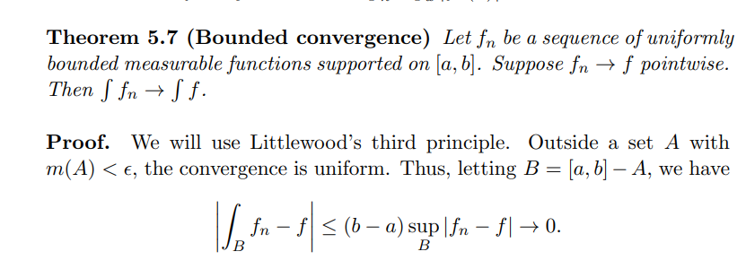
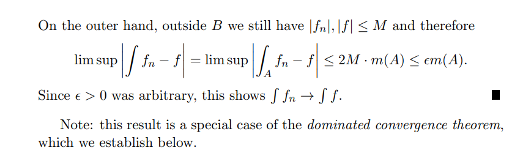
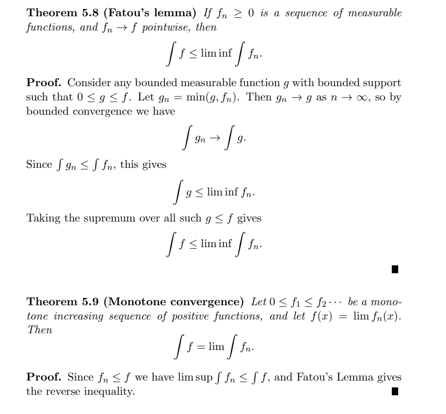

# Appendix: Undergrad Material

:::{.definition title="limsup"}
\[
\limsup x_{n}=\lim _{N \rightarrow \infty} \sup _{n>N} x_{n}
.\]
:::

:::{.example title="?"}
\envlist

- For $(x_n) \da \qty{n+1\over n}$, $\sup_n x_n = 2$ but $\limsup_n x_n = 1$.

:::

:::{.theorem title="Bounded Convergence"}

:::

