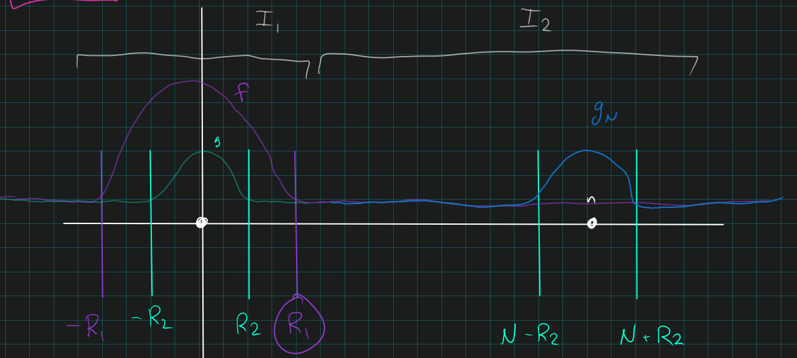

# Integrals: Approximation

## Spring 2018 # 3 $\done$
Let $f$ be a non-negative measurable function on $[0, 1]$. 

Show that
\[
\lim _{p \rightarrow \infty}\left(\int_{[0,1]} f(x)^{p} d x\right)^{\frac{1}{p}}=\|f\|_{\infty}.
\]

:::{.concept}
\envlist
- $\norm{f}_\infty \definedas \inf_t {\theset{ t\suchthat m\qty{\theset{x\in \RR^n \suchthat f(x) > t}} = 0 } }$, i.e. this is the lowest upper bound that holds almost everywhere.
:::

:::{.solution}
\envlist

- $\norm{f}_p \leq \norm{f}_\infty$:
  - Note $\abs{f(x)} \leq \norm{f}_\infty$ almost everywhere and taking $p$th powers preserves this inequality.
  - Thus
  \[
  \abs{f(x)} &\leq \norm{f}_\infty \quad\text{a.e. by definition} \\
  \implies 
  \abs{f(x)}^p &\leq \norm{f}_\infty^p \quad\text{for } p\geq 0 \\  
  \implies
  \norm{f}_p^p 
  &= \int_X \abs{f(x)}^p ~dx \\
  &\leq \int_X \norm{f}_\infty^p ~dx  \\
  &= \norm{f}_\infty^p \int_X 1\,dx \\ 
  &= \norm{f}_\infty^p \cdot m(X) \quad\text{since the norm doesn't depend on }x \\
  &= \norm{f}_\infty^p \qquad \text{since } m(X) = 1
  .\]

    - Thus $\norm{f}_p \leq \norm{f}_\infty$ for all $p$ and taking $\lim_{p\to\infty}$ preserves this inequality.

- $\norm{f}_p \geq \norm{f}_\infty$:
  - Fix $\varepsilon > 0$.

  - Define 
  \[
  S_\varepsilon \definedas \theset{x\in \RR^n \suchthat \abs{f(x)} \geq \norm{f}_\infty - \varepsilon}
  .\]

    - Note that $m(S_\eps) > 0$; otherwise if $m(S_\eps) = 0$, then $t\definedas \norm{f}_\infty - \eps < \norm{f}_\eps$.
    But this produces a *smaller* upper bound almost everywhere than $\norm{f}_\eps$, contradicting the definition of $\norm{f}_\eps$ as an infimum over such bounds.
    

  - Then
  \[
  \norm{f}_p^p 
  &= \int_X \abs{f(x)}^p ~dx \\
  &\geq \int_{S_\varepsilon} \abs{f(x)}^p ~dx \quad\text{since } S_\eps \subseteq X \\
  &\geq \int_{S_\varepsilon} \abs{\norm{f}_\infty - \varepsilon}^p ~dx \quad\text{since on } S_\eps, \abs{f} \geq \norm{f}_\infty - \eps \\
  &= \abs{\norm{f}_\infty - \varepsilon}^p \cdot m(S_\varepsilon) \quad\text{since the integrand is independent of }x \\
  & \geq 0 \quad\text{since } m(S_\eps) > 0
  \]
  
  - Taking $p$th roots for $p\geq 1$ preserves the inequality, so
  \[
  \implies \norm{f}_p &\geq \abs{\norm{f}_\infty - \varepsilon} \cdot m(S_\varepsilon)^{\frac 1 p} 
  \converges{p\to\infty}\to \abs{\norm{f}_\infty - \varepsilon} 
  \converges{\varepsilon \to 0}\to \norm{f}_\infty
  \]
  where we've used the fact that above arguments work 

  - Thus $\norm{f}_p \geq \norm{f}_\infty$.

:::

## Spring 2018 # 4 $\done$
Let $f\in L^2([0, 1])$ and suppose
$$
\int _{[0,1]} f(x) x^{n} d x=0 \text { for all integers } n \geq 0.
$$
Show that $f = 0$ almost everywhere.

:::{.concept}
\envlist
- Weierstrass Approximation: A continuous function on a compact set can be uniformly approximated by polynomials.
- $C^1([0, 1])$ is dense in $L^2([0, 1])$
- Polynomials are dense in $L^p(X, \mathcal{M}, \mu)$ for any $X\subseteq \RR^n$ compact and $\mu$ a finite measure, for all $1\leq p < \infty$.
  - Use Weierstrass Approximation, then uniform convergence implies $L^p(\mu)$ convergence by DCT.
:::

:::{.solution}
\envlist

:::{.proof title="using Fourier transforms"}
\envlist

- Fix $k \in \ZZ$.
- Since $e^{2\pi i k x}$ is continuous on the compact interval $[0, 1]$, it is uniformly continuous.
- Thus there is a sequence of polynomials $P_\ell$ such that 
$$
P_{\ell, k} \converges{\ell\to\infty}\to e^{2\pi i k x} \text{ uniformly on } [0,1]
.$$

- Note applying linearity to the assumption $\int f(x) \, x^n$, we have
$$
\int f(x) x^n \,dx = 0 ~\forall n \implies \int f(x) p(x) \,dx = 0 
$$
  for any polynomial $p(x)$, and in particular for $P_{\ell, k}(x)$ for every $\ell$ and every $k$.

- But then  
\[
\inner{f}{e_k} 
&= \int_0^1 f(x) e^{-2\pi i k x} ~dx \\
&= \int_0^1 f(x) \lim_{\ell \to \infty} P_\ell(x) \\
&= \lim_{\ell \to \infty}  \int_0^1 f(x) P_\ell(x) \quad\quad \text{by uniform convergence on a compact interval} \\
&= \lim_{\ell \to \infty} 0 \quad\text{by assumption}\\
&= 0 \quad \forall k\in \ZZ
,\]
 so $f$ is orthogonal to every $e_k$. 

- Thus $f\in S^\perp \definedas \spanof_\CC\theset{e_k}_{k\in \ZZ}^\perp \subseteq L^2([0, 1])$, but since this is a basis, $S$ is dense and thus $S^\perp = \theset{0}$ in $L^2([0, 1])$.

- Thus $f\equiv 0$ in $L^2([0, 1])$, which implies that $f$ is zero almost everywhere.

:::

:::{.proof title="Alternative"}
\envlist

- By density of polynomials, for $f\in L^2([0, 1])$ choose $p_\eps(x)$ such that $\norm{f - p_\eps} < \eps$ by Weierstrass approximation.
- Then on one hand,
\[
\norm{f(f-p_\eps)}_1 
&= \norm{f^2}_1 - \norm{f\cdot p_\eps}_1 \\
&= \norm{f^2}_1 - 0 \quad\text{by assumption} \\
&= \norm{f}_2^2
.\]

  - Where we've used that $\norm{f^2}_1 = \int \abs{f^2} = \int \abs{f}^2 = \norm{f}_2^2$.

- On the other hand
\[
\norm{f(f-p_\eps)} 
&\leq \norm{f}_1 \norm{f-p_\eps}_\infty \quad\text{by Holder} \\
&\leq \eps \norm{f}_1  \\
&\leq \eps \norm{f}_2 \sqrt{m(X)} \\ 
&= \eps \norm{f}_2 \quad\text{since } m(X)= 1
.\]
  - Where we've used that $\norm{fg}_1 = \int \abs{fg} = \int \abs{f}\abs{g} \leq \int \norm{f}_\infty \abs{g} = \norm{f}_\infty \norm{g}_1$.

- Combining these,
\[
\norm{f}_2^2 \leq \norm{f}_2 \eps \implies \norm{f}_2 < \eps \to 0,
.\]
  so $\norm{f}_2 = 0$, which implies $f=0$ almost everywhere.

:::

:::

## Spring 2015 # 2 $\work$
Let $f: \RR \to \CC$ be continuous with period 1. 
Prove that
\[
\lim _{N \rightarrow \infty} \frac{1}{N} \sum_{n=1}^{N} f(n \alpha)=\int_{0}^{1} f(t) d t \quad \forall \alpha \in \RR\setminus\QQ.
\]

> Hint: show this first for the functions $f(t) = e^{2\pi i k t}$ for $k\in \ZZ$.

## Fall 2014 # 4 $\work$
Let $g\in L^\infty([0, 1])$
Prove that
\[
\int _{[0,1]} f(x) g(x)\, dx = 0 
\quad\text{for all continuous } f:[0, 1] \to \RR 
\implies g(x) = 0 \text{ almost everywhere. }
\]

# $L^1$

## Spring 2020 # 3 $\done$

a. Prove that if $g\in L^1(\RR)$ then
\[
\lim_{N\to \infty} \int _{\abs{x} \geq N} \abs{f(x)} \, dx = 0
,\]
and demonstrate that it is not necessarily the case that $f(x) \to 0$ as $\abs{x}\to \infty$.

b. Prove that if $f\in L^1([1, \infty])$ and is decreasing, then $\lim_{x\to\infty}f(x) =0$ and in fact $\lim_{x\to \infty} xf(x) = 0$.

c. If $f: [1, \infty) \to [0, \infty)$ is decreasing with $\lim_{x\to \infty} xf(x) = 0$, does this ensure that $f\in L^1([1, \infty))$?

:::{.concept}
\envlist
- Limits
- Cauchy Criterion for Integrals: $\int_a^\infty f(x) \,dx$ converges iff for every $\eps>0$ there exists an $M_0$ such that $A,B\geq M_0$ implies $\abs{\int_A^B f} < \eps$, i.e. $\abs{\int_A^B f} \converges{A\to\infty}\to 0$.
- Integrals of $L^1$ functions have vanishing tails: $\int_{N}^\infty \abs{f} \converges{N\to\infty}\to 0$.
- Mean Value Theorem for Integrals: $\int_a^b f(t)\, dt = (b-a) f(c)$ for some $c\in [a, b]$.
:::

:::{.solution title="of a"}
Stated integral equality: 

- Let $\eps > 0$
- $C_c(\RR^n) \injects L^1(\RR^n)$ is dense so choose $\theset{f_n} \to f$ with $\norm{f_n - f}_1 \to 0$.
- Since $\theset{f_n}$ are compactly supported, choose $N_0\gg 1$ such that $f_n$ is zero outside of $B_{N_0}(\vector 0)$.
- Then
\[
N\geq N_0 \implies \int_{\abs x > N} \abs{f} &= \int_{\abs x > N} \abs{f - f_n + f_n} \\
&\leq \int_{\abs x > N} \abs{f-f_n} + \int_{\abs x > N} \abs{f_n} \\
&= \int_{\abs x > N} \abs{f-f_n} \\ 
&\leq \int_{\abs x > N} \norm{f-f_n}_1 \\
&= \norm{f_n-f}_1 \qty{\int_{\abs x > N} 1} \\
&\converges{n\to\infty}\to 0 \qty{\int_{\abs x > N} 1} \\
&= 0\\
&\converges{N\to\infty}\to 0
.\]

To see that this doesn't force $f(x)\to 0$ as $\abs{x} \to \infty$:

- Take $f(x)$ to be a train of rectangles of height 1 and area $1/2^j$ centered on even integers.
- Then $$\int_{\abs x > N} \abs{f} = \sum_{j=N}^\infty 1/2^j \converges{N\to\infty}\to 0$$ as the tail of a convergent sum. 
- However $f(x) = 1$ for infinitely many even integers $x > N$, so $f(x) \not\to 0$ as $\abs{x}\to\infty$.
:::

:::{.solution title="of b"}
\envlist

:::{.proof title="Solution 1, a slight trick"}
\envlist

- Since $f$ is decreasing on $[1, \infty)$, for any $t\in [x-n, x]$ we have
\[
x-n \leq t \leq x \implies f(x) \leq f(t) \leq f(x-n)
.\]

- Integrate over $[x, 2x]$, using monotonicity of the integral:
\[
\int_x^{2x} f(x) \,dt \leq 
\int_x^{2x} f(t) \,dt \leq 
\int_x^{2x} f(x-n) \,dt \\ 
\implies 
f(x) \int_x^{2x} \,dt \leq 
\int_x^{2x} f(t) \,dt \leq 
f(x-n) \int_x^{2x} \,dt  \\
\implies xf(x) \leq \int_x^{2x} f(t) \, dt \leq xf(x-n)
.\]

- By the Cauchy Criterion for integrals, $\lim_{x\to \infty} \int_x^{2x} f(t)~dt = 0$.
- So the LHS term $xf(x) \converges{x\to\infty}\to 0$.
- Since $x>1$, $\abs{f(x)} \leq \abs{xf(x)}$ 
- Thus $f(x) \converges{x\to\infty}\to 0$ as well.

:::

:::{.proof title="Solution 2: Variation on the trick"}
\envlist

- Use mean value theorem for integrals:
\[
\int_x^{2x} f(t)\, dt = xf(c_x) \quad\text{for some $c_x \in [x, 2x]$ depending on $x$}
.\]

- Since $f$ is decreasing, 
\[
x\leq c_x \leq 2x 
&\implies f(2x)\leq f(c_x) \leq f(x) \\
&\implies 2xf(2x)\leq 2xf(c_x) \leq 2xf(x) \\
&\implies 2xf(2x)\leq 2x\int_x^{2x} f(t)\, dt \leq 2xf(x) \\
.\]

- By Cauchy Criterion, $\int_x^{2x} f \to 0$.
- So $2x f(2x) \to 0$, which by a change of variables gives $uf(u) \to 0$.
- Since $u\geq 1$, $f(u) \leq uf(u)$ so $f(u) \to 0$ as well.

:::

:::{.proof title="Solution 3: Contradiction"}
Just showing $f(x) \converges{x\to \infty}\to 0$:

- Toward a contradiction, suppose not.
- Since $f$ is decreasing, it can not diverge to $+\infty$
- If $f(x) \to -\infty$, then $f\not\in L^1(\RR)$: choose $x_0 \gg 1$ so that $t\geq x_0 \implies f(t) < -1$, then 
- Then $t\geq x_0 \implies \abs{f(t)} \geq 1$, so
 \[
\int_1^\infty \abs{f} \geq \int_{x_0}^\infty \abs{f(t) } \, dt \geq \int_{x_0}^\infty 1 =\infty
 .\]

- Otherwise $f(x) \to L\neq 0$, some finite limit.
- If $L>0$:
  - Fix $\eps>0$, choose $x_0\gg 1$ such that $t\geq x_0 \implies L-\eps \leq f(t) \leq L$
  - Then $$\int_1^\infty f \geq \int_{x_0}^\infty f \geq \int_{x_0}^\infty \qty{L-\eps}\,dt = \infty$$
- If $L<0$:
  - Fix $\eps > 0$, choose $x_0\gg 1$ such that $t\geq x_0 \implies L \leq f(t) \leq L + \eps$.
  - Then $$\int_1^\infty f \geq \int_{x_0}^\infty f \geq \int_{x_0}^\infty \qty{L}\,dt = \infty$$

Showing $xf(x) \converges{x\to \infty}\to 0$.

- Toward a contradiction, suppose not.
- (How to show that $xf(x) \not\to + \infty$?)
- If $xf(x)\to -\infty$
  - Choose a sequence $\Gamma = \theset{\hat x_i}$ such that $x_i \to \infty$ and $x_i f(x_i) \to -\infty$.
  - Choose a subsequence $\Gamma' = \theset{x_i}$ such that $x_if(x_i) \leq -1$ for all $i$ and $x_i \leq x_{i+1}$.
  - Choose a further subsequence $S = \theset{x_i \in \Gamma' \suchthat 2x_i  < x_{i+1}}$.
  - Then since $f$ is always decreasing, for $t\geq x_0$, $\abs f$ is increasing, and $\abs{f(x_i)} \leq \abs{f(2x_i)}$, so
  \[
  \int_1^{\infty} \abs{f} \geq \int_{x_0}^\infty \abs{f} \geq \sum_{x_i \in S} \int_{x_i}^{2x_i} \abs{f(t)} \, dt \geq 
  \sum_{x_i \in S} \int_{x_i}^{2x_i} \abs{f(x_i)} &= \sum_{x_i \in S} x_i f(x_i) \to \infty
  .\]

- If $xf(x) \to L \neq 0$ for $0 < L< \infty$:
  - Fix $\eps> 0$, choose an infinite sequence $\theset{x_i}$ such that $L-\eps \leq x_i f(x_i) \leq L$ for all $i$.
\[
\int_1^\infty \abs{f} \geq \sum_S \int_{x_i}^{2x_i} \abs{f(t)}\,dt \geq \sum_S \int_{x_i}^{2x_i} f(x_i) \,dt = \sum_S x_i f(x_i) \geq \sum_S \qty{L-\eps} \to \infty
.\]
- If $xf(x) \to L \neq 0$ for $-\infty < L < 0$:
  - Fix $\eps> 0$, choose an infinite sequence $\theset{x_i}$ such that $L \leq x_i f(x_i) \leq L + \eps$ for all $i$.
\[
\int_1^\infty \abs{f} \geq \sum_S \int_{x_i}^{2x_i} \abs{f(t)}\,dt \geq \sum_S \int_{x_i}^{2x_i} f(x_i) \,dt = \sum_S x_i f(x_i) \geq \sum_S \qty{L} \to \infty
.\]

:::

:::{.proof title="Solution 4: Akos' suggestion"}
For $x\geq 1$, 
\[
\abs{xf(x)} = \abs{ \int_x^{2x} f(x) \, dt } \leq \int_x^{2x} \abs{f(x)} \, dt \leq \int_x^{2x} \abs{f(t)}\, dt \leq \int_x^{\infty} \abs{f(t)} \,dt \converges{x\to\infty}\to 0
\]
  where we've used 
  
  - Since $f$ is decreasing and $\lim_{x\to\infty}f(x) =0$ from part (a), $f$ is non-negative.
  - Since $f$ is positive and decreasing, for every $t\in[a, b]$ we have $\abs{f(a)} \leq \abs{f(t)}$.
  - By part (a), the last integral goes to zero.

:::

:::{.proof title="Solution 5: Peter's"}
\envlist

- Toward a contradiction, produce a sequence $x_i\to\infty$ with $x_i f(x_i) \to \infty$ and $x_if(x_i) > \eps > 0$, then
\[
\int f(x) \, dx 
&\geq \sum_{i=1}^\infty \int_{x_i}^{x_{i+1}} f(x) \, dx \\
&\geq \sum_{i=1}^\infty \int_{x_i}^{x_{i+1}} f(x_{i+1}) \, dx \\
&=    \sum_{i=1}^\infty f(x_{i+1}) \int_{x_i}^{x_{i+1}} \, dx \\
&\geq \sum_{i=1}^\infty (x_{i+1} - x_i) f(x_{i+1}) \\
&\geq \sum_{i=1}^\infty (x_{i+1} - x_i) {\eps \over x_{i+1}} \\
&= \eps \sum_{i=1}^\infty \qty{ 1 - {x_{i-1} \over x_i}} \to \infty
\]
  which can be ensured by passing to a subsequence where $\sum {x_{i-1} \over x_i} < \infty$.

:::

:::

:::{.solution title="of c"}
\envlist

- No: take $f(x) = {1\over x\ln x}$
- Then by a $u\dash$substitution,
  \[
  \int_0^x f = \ln\qty{\ln (x)} \converges{x\to\infty}\to \infty
  \]
  is unbounded, so $f\not\in L^1([1, \infty))$.
- But 
  \[
  xf(x) = { 1 \over \ln(x)} \converges{x\to\infty} \to 0
  .\]

:::

## Fall 2019 # 5. $\done$

a.
Show that if $f$ is continuous with compact support on $\RR$, then 
\[
\lim _{y \rightarrow 0} \int_{\mathbb{R}}|f(x-y)-f(x)| d x=0
\]

b. 
Let $f\in L^1(\RR)$ and for each $h > 0$ let 
\[
\mathcal{A}_{h} f(x):=\frac{1}{2 h} \int_{|y| \leq h} f(x-y) d y
\]

  - Prove that $\left\|\mathcal{A}_{h} f\right\|_{1} \leq\|f\|_{1}$ for all $h > 0$.

  - Prove that $\mathcal{A}_h f \to f$ in $L^1(\RR)$ as $h \to 0^+$.

\todo[inline]{Walk through.}

:::{.concept}
\envlist
- Continuity in $L^1$ (recall that DCT won't work! Notes 19.4, prove it for a dense subset first).
- Lebesgue differentiation in 1-dimensional case. See HW 5.6.
:::

:::{.solution}
\envlist

:::{.proof title="of a"}

- Fix $\varepsilon > 0$.
  If we can find a set $A$ such that the following calculation holds for $h$ small enough, we're done:
  \[
  \int_\RR \abs{f(x-h) - f(x)} \dx 
  &= \int_A \abs{f(x-h) - f(x)} \dx \\
  &\leq \int_A \eps \\
  &= \eps \mu(A) \too 0
  ,\]
  provided $h\to 0$ as $\eps\to 0$, which we can arrange if $\abs{h} < \eps$.

- Choose $A\contains \supp f$ compact such that $\supp f \pm 1 \subseteq A$
  - Why this can be done: $\supp f$ is compact, so closed and bounded, and contained in some compact interval $[-M, M]$.
  So e.g. $A\da [-M-1, M+1]$ suffices.
- Note that $f$ is still continuous on $A$, since it is zero on $A\sm \supp f$, and thus uniformly continuous (by Heine-Cantor, for example).
- We can rephrase the usual definition of uniform continuity:
\[
\forall \eps \exists \delta = \delta(\eps) \text{ such that } \abs{x - y} < \delta \implies \abs{f(x) - f(y)} < \eps \quad \forall x, y\in A
\]
as
\[
\forall \eps \exists \delta = \delta(\eps) \text{ such that } \abs{h} < \delta \implies \abs{f(x-h) - f(x)} < \eps \quad \forall x \text{ such that }x, x\pm h \in A
\]

- So fix $\eps$ and choose such a $\delta$ for $A$, and choose $h$ such that $\abs{h} < \min(1, \delta)$.
  Then the desired computation goes through by uniform continuity of $f$ on $A$.

:::

:::{.proof title="of b"}
We have
\[
\int_\RR \abs{A_h(f)(x)} ~dx 
&= \int_\RR \abs{\frac{1}{2h} \int_{x-h}^{x+h} f(y)~dy} ~dx \\
&\leq \frac{1}{2h} \int_\RR \int_{x-h}^{x+h} \abs{f(y)} ~dy ~dx    \\
&=_{FT} \frac{1}{2h} \int_\RR \int_{y-h}^{y+h} \abs{f(y)} ~\mathbf{dx} ~\mathbf{dy}    \\
&= \int_\RR \abs{f(y)} ~{dy} \\
&= \norm{f}_1
,\]

and (rough sketch)

\[
\int_\RR \abs{A_h(f)(x) - f(x)} ~dx 
&= \int_\RR \abs{ \left(\frac{1}{2h} \int_{B(h, x)} f(y)~dy\right) - f(x)}~dx \\
&= \int_\RR \abs{ \left(\frac{1}{2h} \int_{B(h, x)} f(y)~dy\right) - \frac{1}{2h}\int_{B(h, x)} f(x) ~dy}~dx \\
&\leq_{FT} \frac{1}{2h} \int_\RR  \int_{B(h, x)}\abs{ f(y-x) - f(x)} ~\mathbf{dx} ~\mathbf{dy} \\
&\leq \frac 1 {2h} \int_\RR \norm{\tau_x f - f}_1 ~dy \\
&\to 0 \quad\text{by (a)}
.\]

:::

:::

:::{.remark}
This works for arbitrary $f\in L^1$, using approximation by continuous functions with compact support:

- Choose $g\in C_c^0$ such that $\norm{f- g}_1 \to 0$.

- By translation invariance, $\norm{\tau_h f - \tau_h g}_1 \to 0$.

- Write
\[
\norm{\tau f - f}_1 
&= \norm{\tau_h f - g + g - \tau_h g + \tau_h g - f}_1 \\
&\leq \norm{\tau_h f - \tau_h g} + \norm{g - f} + \norm{\tau_h g - g} \\
&\to \norm{\tau_h g - g}
,\]

  so it suffices to show that $\norm{\tau_h g - g} \to 0$.

:::

## Fall 2017 # 3 $\done$
Let 
$$
S = \spanof_\CC\theset{\chi_{(a, b)} \suchthat a, b \in \RR},
$$
the complex linear span of characteristic functions of intervals of the form $(a, b)$.

Show that for every $f\in L^1(\RR)$, there exists a sequence of functions $\theset{f_n} \subset S$ such that 
\[
\lim _{n \rightarrow \infty}\left\|f_{n}-f\right\|_{1}=0
\]

\todo[inline]{Walk through.}

:::{.concept}
\envlist
- From homework: $E$ is Lebesgue measurable iff there exists a finite union of closed cubes $A$ such that $m(E\Delta A) < \varepsilon$.
:::

:::{.solution}
\envlist

- It suffices to show that $S$ is dense in simple functions, and since simple functions are *finite* linear combinations of characteristic functions, it suffices to show this for $\chi_A$ for $A$ a measurable set.

- Let $s = \chi_{A}$.
- By regularity of the Lebesgue measure, choose an open set $O \supseteq A$ such that $m(O\setminus A) < \varepsilon$.

- $O$ is an open subset of $\RR$, and thus $O = \disjoint_{j\in \NN} I_j$ is a disjoint union of countably many open intervals.

- Now choose $N$ large enough such that $m(O \Delta I_{N, n}) < \varepsilon = \frac 1 n$ where we define $I_{N, n} \definedas \disjoint_{j=1}^N I_j$.

- Now define $f_n = \chi_{I_{N, n}}$, then
\[
\norm{s - f_n}_1 = \int \abs{\chi_A - \chi_{I_{N, n}}} = m(A \Delta I_{N, n}) \converges{n\to\infty}\longrightarrow 0
.\]

- Since any simple function is a finite linear combination of $\chi_{A_i}$, we can do this for each $i$ to extend this result to all simple functions.
- But simple functions are dense in $L^1$, so $S$ is dense in $L^1$.
:::

## Spring 2015 # 4 $\work$
Define
$$
f(x, y):=\left\{\begin{array}{ll}{\frac{x^{1 / 3}}{(1+x y)^{3 / 2}}} & {\text { if } 0 \leq x \leq y} \\ {0} & {\text { otherwise }}\end{array}\right.
$$

Carefully show that $f \in L^1(\RR^2)$.

## Fall 2014 # 3 $\work$
Let $f\in L^1(\RR)$. Show that
\[
\forall\varepsilon > 0 \exists \delta > 0 \text{ such that } \qquad 
m(E) < \delta 
\implies 
\int _{E} |f(x)| \, dx < \varepsilon
\]

## Spring 2014 # 1 $\work$

1. Give an example of a continuous $f\in L^1(\RR)$ such that $f(x) \not\to 0$ as$\abs x \to \infty$.

2. Show that if $f$ is *uniformly* continuous, then
\[
\lim_{\abs x \to \infty} f(x) = 0.
\]

## Spring 2021 # 4 $\done$

Let $f, g$ be Lebesgue integrable on $\RR$ and let $g_n(x) \da g(x- n)$.
Prove that
\[
\lim_{n\to \infty } \norm{f + g_n}_1 = \norm{f}_1 + \norm{g}_1
.\]

:::{.concept}
\envlist

- For $f\in L^1(X)$, $\norm{f}_1 \da \int_X \abs{f(x)} \dx < \infty$.

- Small tails in $L_1$: if $f\in L^1(\RR^n)$, then for every $\eps>0$ exists some radius $R$ such that
\[
\norm{f}_{L^1(B_R^c)} < \eps
.\]

- Shift $g$ to the right far enough so that the two densities are mostly disjoint:

- Any integral $\int_a^b f$ can be written as $\norm{f}_1 - O(\text{err})$.

- Bounding technique: 
\[
a-\eps \leq b \leq a+\eps \implies b=a
.\]

:::

:::{.solution}
\envlist

- Fix $\eps$.
- Using small tails for $f, g \in L^1$, choose $R_1, R_2 \gg 0$ so that
\[
\int_{B_{R_1}(0)^c} \abs{f} &< \eps \\
\int_{B_{R_2}(0)^c} \abs{g} &< \eps
.\]

  - Note that this implies
  \[
  \int_{-R_1}^{R_1} \abs{f} &= \norm{f}_1 - 2\eps \\
  \int_{-R_2}^{R_2} \abs{g_N} &= \norm{g_N} - 2\eps 
  .\]

  - Also note that by translation invariance of the Lebesgue integral, $\norm{g}_1 = \norm{g_N}_1$.

- Now use $N$ to make the densities almost disjoint: choose $N\gg 1$ so that $N-R_2 > R_1$:

- Consider the change of variables $x\mapsto x-N$:
\[
\int_{-R_2}^{R_2} \abs{g(x)}\dx 
= \int_{N-R_2} ^{N+R_2} \abs{g(x-N)} \dx
\da \int_{N-R_2} ^{N+R_2} \abs{g_N(x)} \dx
.\]
  - Use this to conclude that
  \[
  \int_{N-R_2}^{N+R_2} \abs{g_N} = \norm{g_N} - 2\eps
  .\]

- Now split the integral in the problem statement at $R_1$:

\[
\norm{f + g_N}_1 
= \int_\RR \abs{f+g_N} 
= \int_{-\infty}^{R_1} \abs{f+ g_N}
+ \int_{R_1}^{\infty} \abs{f+ g_N}
\da I_1 + I_2
.\]

- **Idea**: from the picture, 

  - On $I_1$, $f$ is big and $g_N$ is small
  - On $I_2$, $f$ is small and $g_N$ is big

- Casework: estimate $I_1, I_2$ separately, bounding from above and below.

- $I_1$ upper bound:
  \[
  I_1 
  &\da \int_{-\infty}^{R_1} \abs{f + g_N} \\
  &\leq \int_{-\infty}^{R_1} \abs{f} + \abs{g_N} \\
  &= \int_{-\infty}^{R_1} \abs{f} + \int_{-\infty}^{R_1} \abs{g_N} \\
  &\leq \int_{-\infty}^{R_1} \abs{f} + \int_{-\infty}^{\color{green} N - R_2} \abs{g_N} && R_1 < N-R_2 \\
  &= \norm{f}_1 - \int_{R_1}^{\infty} \abs{f} + \int_{-\infty}^{N - R_2} \abs{g_N} \\
  &\leq \norm{f}_1 - \int_{R_1}^{\infty} \abs{f} + \eps \\
  &\leq \norm{f}_1 + \eps
  .\]
  
  - In the last step we've used that we're subtracting off a positive number, so forgetting it only makes things larger.
  
  - We've also used monotonicity of the Lebesgue integral: if $A\leq B$, then $(c, A) \subseteq (c, B)$ and $\int_{c}^A \abs f \leq \int_c^B \abs{f}$ since $\abs f$ is positive.

- $I_1$ lower bound:
\[
I_1 
&\da \int_{-\infty}^{R_1} \abs{f + g_N} \\
&\geq \int_{-\infty}^{R_1} \abs{f} - \abs{g_N} \\
&= \int_{-\infty}^{R_1} \abs{f} - \int_{-\infty}^{R_1} \abs{g_N} \\
&\geq \int_{-\infty}^{R_1} \abs{f} - \int_{-\infty}^{\color{green} N-R_2} \abs{g_N} && R_1 < N-R_2 \\
&= \norm{f}_1 - \int_{R_1}^{ \infty } \abs f - \int_{- \infty }^{N-R_2} \abs {g_N} \\
&\geq \norm{f}_1 - \eps - \eps \\
&= \norm{f}_1 - 2\eps
.\]

  - Now we've used that the integral with $g_N$ comes in with a negative sign, so extending the range of integration only makes things *smaller*.
  We've also used the $\eps$ bound on both $f$ and $g_N$ here, and both are tail estimates.

- Taken together we conclude
\[
\norm{f}_1 - 2\eps
\leq I_1
\leq \norm{f}_1 && \eps\to 0 \implies  I_1 = \norm{f}_1
.\]

- $I_2$ lower bound:
\[
I_2 
&\da \int_{R_1}^{\infty} \abs{f + g_N} \\
&\leq \int_{R_1}^{\infty} \abs{f} + \int_{R_1}^{\infty} {g_N} \\
&\leq \int_{R_1}^{\infty} \abs{f} + \norm{g_N}_1 - \int_{-\infty}^{R_1} \abs{g_N} \\
&\leq \eps + \norm{g_N}_1 - \int_{-\infty}^{R_1} \abs{g_N} \\
&\leq \eps + \norm{g_N}_1 \\
&= \eps + \norm{g}_1 
.\]

  - Here we've again thrown away negative terms, only increasing the bound, and used the tail estimate on $f$.

- $I_2$ upper bound:

\[
I_2 
&\da \int_{R_1}^{\infty} \abs{f + g_N} \\
&= \int_{R_1}^{\infty} \abs{g_N + f} \\
&\geq \int_{R_1}^{\infty} \abs{g_N} - \int_{R_1}^{\infty} \abs{f} \\
&=  \norm{g_N} - \int_{-\infty}^{R_1} \abs{g_N} - \int_{R_1}^{\infty} \abs{f} \\
&\geq  \norm{g_N} - 2\eps
.\]

  - Here we've swapped the order under the absolute value, and used the tail estimates on both $g$ and $f$.

- Taken together:
\[
\norm{g}_1 - \eps \leq I_2 \leq \norm{g}_1 + 2\eps 
.\]

- Note that we have two inequalities:
\[
\norm{f}_1 - 2\eps &\leq \int_{-\infty}^{R_1} \abs{f -g_N} \leq \norm{f}_1 + \eps \\
\norm{g}_1 - 2\eps &\leq \int^{\infty}_{R_1} \abs{f -g_N} \leq \norm{g}_1 + \eps 
.\]

- Add these to obtain
\[
\norm{f}_1 + \norm{g}_1 - 4\eps \leq I_1 + I_2 \da \norm{f - g_N}_1 \leq \norm{f} + \norm{g}_1 + 2\eps
.\]

- Check that as $N\to \infty$ as $\eps\to 0$ to yield the result.

:::

## Fall 2020 \# 4 $\work$
Prove that if $xf(x) \in L^1(\RR)$, then
\[  
F(y) \da \int f(x) \cos(yx)\,  dx
\]
defines a $C^1$ function.

