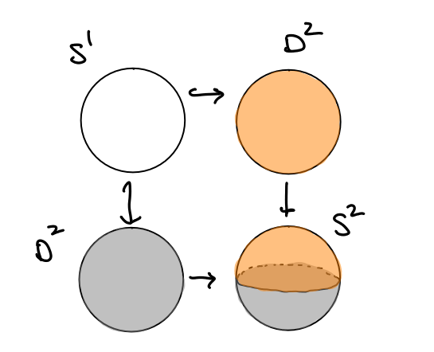

# Theorems: Algebraic Topology

## Examples

## Fundamental Group

Conjugacy in $\pi_1$:

- See Hatcher 1.19, p.28
- See Hatcher's proof that $\pi_1$ is a group
- See change of basepoint map

## Homotopy

> Todo: Merge the two van Kampen theorems.

Note: Van Kampen critically requires the intersection to be path connected!

Theorem (Van Kampen)
:   The pushout is the northwest colimit of the following diagram
    \begin{center}
    \begin{tikzcd}
    A \disjoint_Z B   & A \ar[d] \ar[l] \\
    B \ar[u]\ar[r]          & Z \ar[l, "\iota_B"] \ar[u, "\iota_A"]
    \end{tikzcd}
    \end{center}

    For groups, the pushout is given by the amalgamated free product: if $A = \generators{G_A \suchthat R_A}, B = \generators{G_B \suchthat R_B}$, then $$A \ast_Z B = \generators{G_A, G_B \suchthat R_A, R_B, T}$$ where $T$ is a set of relations given by $$T = \theset{\iota_A(z) \iota_B(z)\inv \suchthat z\in Z}.$$

    Suppose $X = U_1 \union U_2$ such that $U_1\intersect U_2 \neq \emptyset$ is **path connected** (necessary condition).
    Then taking $x_0 \in U\definedas U_1 \intersect U_2$ yields a pushout of fundamental groups

    \begin{align*}
    \pi_1(X; x_0) = \pi_1(U_1;x_0) \ast_{\pi_1(U; x_0)} \pi_1(U_2; x_0)
    .\end{align*}

Theorem (Van Kampen)
:   If $X = U \union V$ where $U, V, U\intersect V$ are all path-connected then

    \begin{align*}
    \pi_1(X) = \pi_1 U \ast_{\pi_1(U \intersect V)} \pi_1 V
    ,\end{align*}

    where the amalgamated product can be computed as follows: 
    If we have presentations

    \begin{align*} 
    \pi_{1}(U, w) &=
    \left\langle u_{1}, \cdots, u_{k} \suchthat \alpha_{1}, \cdots, \alpha_{l}\right\rangle \\ 
    \pi_{1}(V, w) &=\left\langle v_{1}, \cdots, v_{m} \suchthat \beta_{1}, \cdots, \beta_{n}\right\rangle \\ 
    \pi_{1}(U \cap V, w) &=\left\langle w_{1}, \cdots, w_{p} \suchthat \gamma_{1}, \cdots, \gamma_{q}\right\rangle 
    \end{align*}

    then

    \begin{align*}
    \pi_{1}(X, w) 
    &= \left\langle u_{1}, \cdots, u_{k}, v_{1}, \cdots, v_{m}\right\rangle \\ 
    &\mod 
    \left\langle \alpha_{1}, \cdots, \alpha_{l}, \beta_{1}, \cdots, \beta_{n}, I\left(w_{1}\right) J\left(w_{1}\right)^{-1}, \cdots, I\left(w_{p}\right) J\left(w_{p}\right)^{-1}\right\rangle \\
    &= \frac{\pi_1(U) \ast \pi_1(B)} {\generators{\theset{I(w_i) J(w_i)\inv \suchthat 1\leq i \leq p}}}
    \end{align*}

    where

    \begin{align*}
    I: \pi_{1}(U \cap V, w) &\rightarrow \pi_{1}(U, w) \\
    J: \pi_{1}(U \cap V, w) &\rightarrow \pi_{1}(V, w)
    .\end{align*}

Theorem (Seifert-van Kampen Theorem)
:   Suppose $X = U_1 \union U_2$ where $U \definedas U_1 \intersect U_2 \neq \emptyset$ is path-connected, and let $\pt \in U$. Then the maps $i_1: U_1 \into X$ and $i_2: U_2 \into X$ induce the following group homomorphisms:

    $$
    i_1^*: \pi_1(U_1 ,\pt) \into \pi_1(X, \pt) \\
    i_2^*: \pi_1(U_2 ,\pt) \into \pi_1(X, \pt)
    $$

    and letting $P = \pi_1(U), \pt$, there is a natural isomorphism

    $$
    \pi_1(X, \pt) \cong \pi_1(U_1, \pt) ~\bigast_P~ \pi_1(U_2, \pt)
    $$
    where $\bigast_P$ is the amalgamated free product over $P$.

    \todo[inline]{Formulate in terms of pushouts.}

    

Note that the hypothesis that $U\cap V$ is path-connected is necessary: take $S^1$ with $U,V$ neighborhoods of the poles, whose intersection is two disjoint components.

Example (of pushing out with Van Kampen)
:   $A = \ZZ/4\ZZ = \gens{x \suchthat x^4}, B = \ZZ/6\ZZ = \gens{y \suchthat x^6}, Z = \ZZ/2\ZZ = \gens{z \suchthat z^2}$.
  
  Then we can identify $Z$ as a subgroup of $A, B$ using $\iota_A(z) = x^2$ and $\iota_B(z) = y^3$.
  
  So $$A\ast_Z B = \gens{x, y \suchthat x^4, y^6, x^2y^{-3}}$$.

Theorem (Whitehead)
: A map $X \mapsvia{f} Y$ on CW complexes that is a weak homotopy equivalence (inducing isomorphisms in homotopy) is in fact a homotopy equivalence.

Warning
: Individual maps may not work: take $S^2 \cross \RP^3$ and $S^3 \cross \RP^2$ which have isomorphic homotopy but not homology.

Theorem (Hurewicz)
: The Hurewicz map on an $n-1\dash$connected space $X$ is an isomorphism $\pi_{k\leq n}X \to H_{k\leq n} X$.

Theorem (Cellular Approximation)
: Any continuous map between CW complexes is homotopy equivalent to a cellular map.

### Applications:

- $\pi_{k\leq n}S^n = 0$
- $\pi_n(X) \cong \pi_n(X^{(n)})$

Theorem (Freudenthal Suspension)
:   \todo[inline]{Todo}

## Homology

- $H_n(X/A) \cong \tilde H_n(X, A)$ when $A\subset X$ has a neighborhood that deformation retracts onto it.
- $H_n(\bigvee_\alpha X_\alpha) = \bigoplus_\alpha H_n X_\alpha$

- Useful fact: since $\ZZ$ is free, any exact sequence of the form $0 \to \ZZ^n \to A \to \ZZ^m \to 0$ splits and $A\cong \ZZ^{n}\cross \ZZ^m$.

- Useful fact: $\tilde H_*(A\vee B) \cong H_*(A) \times H_*(B)$.

- $H_n(\bigvee_\alpha X_\alpha) = \bigoplus_\alpha H_n X_\alpha$
- $H_n(X, A) \cong H_n(X/A)$
- $H_n(X) = 0 \iff X$ has no $n\dash$cells.
- $C^0 X = \pt \implies d_1: C^1 \to C^0$ is the zero map.
- $H^*(X; \FF) = \hom(H_*(X; \FF),\FF)$ for a field.

### Constructing a CW Complex with Prescribed Homology

- Given $G = \bigoplus G_i$, and want a space such that $H_i X = G$? Construct $X = \bigvee X_i$ and then $H_i (\bigvee X_i) = \bigoplus H_i X_i$. Reduces problem to: given a group $H$, find a space $Y$ such that $H_n(Y) = G$.
  - Attach an $e^n$ to a point to get $H_n = \ZZ$
  - Then attach an $e^{n+1}$ with attaching map of degree $d$ to get $H_n = \ZZ_d$

Theorem (Mayer Vietoris)
:   Let $X = A^\circ \union B^\circ$; then there is a SES of chain complexes
    \begin{align*}
    0 \to C_n(A\intersect B) \mapsvia{x\mapsto (x, -x)} C_n(A) \oplus C_n(B) \mapsvia{(x, y) \mapsto x+y} C_n(A + B) \to 0
    \end{align*}
    
    where $C_n(A+B)$ denotes the chains that are sums of chains in $A$ and chains in $B$.
    This yields a LES in homology:

    \begin{align*}
    \cdots \to H_n(A\intersect B) \mapsvia{x\mapsto (x, -x)} H_n(A) \oplus H_n(B) \mapsvia{(x, y) \mapsto x+y} H_n(X) \to \cdots
    .\end{align*}

Theorem (Eilenberg-Zilber)
:   Given two spaces $X, Y$, there are chain maps

    \begin{align*}
    F: C_*(X\cross Y; R)              &\to C_*(X; R) \tensor_R C_*(Y; R) \\
    G: C_*(X; R) \tensor_R C_*(Y; R)  &\to C_*(X\cross Y; R) 
    \end{align*}

    such that $FG = \id$ and $GF \homotopic \id$.
    In particular,
    \begin{align*}
    H_*(X\cross Y; R) &\cong H_*(X; R) \tensor_R H_*(Y; R)
    .\end{align*}

Theorem (Kunneth)
:   There exists a short exact sequence
    $$
    0 \to \bigoplus_{i+j=k} H_j(X; R) \tensor_R H_{i}(Y; R) \to H_k(X\cross Y; R) \to \bigoplus_{i+j=k-1} \tor_R^1(H_i(X; R), H_{j}(Y; R))
    $$
    It has a non-canonical splitting given by
    $$
    H_k (X\cross Y) = \left( \bigoplus_{i+j = k} H_i X \oplus H_j Y\right) \oplus \bigoplus_{i+j = k-1}\tor(H_iX, H_j Y)
    $$

Theorem (Universal Coefficients for Change of Group)
:   For changing coefficients from $\ZZ$ to $G$ an arbitrary group, there are short exact sequences
    $$
    0 \to H_i X \tensor G \to H_i(X; G) \to \tor(H_{i-1}X, G) \to 0
    $$

    $$
    0 \to \ext (H_{i-1} X, G) \to H^i(X;G) \to \hom(H_i X, G) \to 0
    $$

    which split unnaturally:
    $$
    H_i(X;G) = (H_iX\tensor G) \oplus \tor(H_{i-1}X; G)
    $$

    $$
    H^i(X; G) = \hom(H_iX, G) \oplus \ext(H_{i-1}X; G)
    $$

    When $H_iX$ are all finitely generated, write $H_i(X; \ZZ) = \ZZ^{\beta_i} \oplus T_i$. Then
    $$
    H^i(X; \ZZ) = \ZZ^{\beta_i} \oplus T_{i-1}.
    $$

### Useful long exact sequences

$$
\cdots \to H^{i}(X)\to H^{i}(U)\oplus H^{i}(V)\to H^{i}(U\cap V)\mapsvia{\delta} H^{i+1}(X)\to \cdots
$$

$$
\cdots \to H_{i}(A)\to H_{i}(X)\to H_{i}(X,A){\stackrel{\delta }{\to }}H_{{i-1}}(A)\to \cdots
$$

### Useful Short Exact Sequences

> Note that $\ext_R^0 = \hom_R$ and $\tor_R^0 = \tensor_R$

Homology to cohomology:
$$
\displaystyle 0\to \tor_\ZZ^0 (H_{i}(X;\ZZ), A)\,{\to }\,H_{i}(X;A)\to \operatorname {Tor}_\ZZ^1 (H_{i-1}(X;\ZZ ),A)\to 0
.$$

Cohomology to dual space:
$$
0\to \ext_{\ZZ}^{1}(H_{i-1}(X; \ZZ),A)\to H^{i}(X; A)\to \ext_{\ZZ}^{0}(H_{i}(X; \ZZ),A) \to 0
.$$

Product of spaces to tensor product of homology:
$$
0\to \bigoplus _{{i+j=k}}H_{i}(X;R)\otimes _{R}H_{j}(Y;R)\to H_{k}(X\times Y;R)\to \bigoplus _{{i+j=k-1}}{\mathrm  {Tor}}_{1}^{R}(H_{i}(X;R),H_{j}(Y;R))\to 0
$$

### Useful Shortcuts

* Cohomology: If $A$ is a field, then $$H^i(X; A) \cong \hom(H_i(X; A), A)$$

* Kunneth: If $R$ is a freely generated free $R\dash$module (or a PID or a field), then
$$ 
H_{k}(X\times Y) \cong \bigoplus _{{i+j=k}}H_{i}(X)\otimes H_{j}(Y) \bigoplus_{i+j=k-1}\tor(H_i(X), H_j(X))
$$

* Universal Coefficients Theorem: If $X$ is a finite CW complex then
$$
H^i(X; \ZZ) = F(H_i(X; \ZZ)) \times T(H_{i-1}(X; \ZZ))\\
H_i(X; \ZZ) = F(H^i(X; \ZZ)) \times T(H^{i+1}(X; \ZZ))
$$

## Homological Algebra

**Free Resolutions**:

The canonical example:
$$
0 \to \ZZ \mapsvia{\times m} \ZZ \mapsvia{\mod m} \ZZ_m \to 0
$$

Or more generally for a finitely generated group $G = \generators{g_1, g_2, \cdots, g_n}$,
$$
\cdots \to \ker(f) \to F[g_1, g_2, \cdots, g_n] \mapsvia{f} G \to 0
$$ 
where $F$ denotes taking the free group.

Every abelian groups has a resolution of this form and length 2.

## Computing Tor

$$
\tor(A, B) = h[\cdots \to A_n \tensor B \to A_{n-1}\tensor B \to \cdots A_1\tensor B \to 0]
$$ 
where $A_*$ is any free resolution of $A$.

Shorthand/mnemonic: 
$$
\tor: \mathcal{F}(A) \to (\wait \tensor B) \to H_*
$$

## Computing Ext
$$
\ext(A, B) = h[\cdots \hom(A, B_n) \to \hom(A, B_{n-1}) \to \cdots \to \hom(A, B_1) \to 0 ]
$$ 
where $B_*$ is a any free resolution of $B$.

Shorthand/mnemonic: 
$$
\ext: \mathcal{F}(B) \to \hom(A, \wait) \to H_*
$$

## Properties of Tensor Product

- $A\tensor B \cong B\tensor A$
- $(\wait) \tensor_R R^n = \id$
- $\bigoplus_i A_i \tensor \bigoplus_j B_j = \bigoplus_i\bigoplus_j(A_i \tensor B_j)$
- $\ZZ_m \tensor \ZZ_n = \ZZ_d$
- $\ZZ_n \tensor A = A/nA$

## Properties of Hom

- $\hom_R (\bigoplus_i A_i, \prod B_j) = \bigoplus_i \prod_j \hom(A_i, B_j)$
- Contravariant in first slot, covariant in second
- Exact over vector spaces

## Properties of Tor

- $\tor_R^0(A, B) = A \tensor_R B$
- $\tor(\bigoplus_i A_i, \bigoplus_j B) = \bigoplus_i \bigoplus_j \tor(\mathbf{T}A_i, \mathbf{T}B_j)$  where $\mathbf{T}G$ is the torsion component of $G$.
- $\tor(\ZZ_n, G) = \ker (g \mapsto ng) = \theset{g\in G\mid ng = 0}$
- $\tor(A, B) = \tor(B, A)$

## Properties of Ext

- $\ext_R^0(A, B) = \hom_R(A, B)$
- $\ext(\bigoplus_i A_i, \prod_j B_j) = \bigoplus_i \prod_j \ext(\mathbf{T}A_i, B_j)$
- $\ext(F, G) = 0$ if $F$ is free
- $\ext(\ZZ_n, G) \cong G/nG$

## Hom/Ext/Tor Tables

$\hom$    | $\ZZ_m$  | $\ZZ$  | $\QQ$
--|---|---|--
$\ZZ_n$   | $\ZZ_d$  | $0$    | $0$
$\ZZ$     | $\ZZ_m$  | $\ZZ$  | $\QQ$
$\QQ$     | $0$      | $0$    | $\QQ$

$\tor$    | $\ZZ_m$ | $\ZZ$ | $\QQ$
--|---|---|--
$\ZZ_n$   | $\ZZ_d$ | $0$   | $0$
$\ZZ$     | $0$     | $0$   | $0$
$\QQ$     | $0$     | $0$   | $0$

$\ext$    | $\ZZ_m$   | $\ZZ$                 | $\QQ$
--|---|---|--
$\ZZ_n$   | $\ZZ_d$   | $\ZZ_n$               | $0$
$\ZZ$     | $0$       | $0$                   | $0$
$\QQ$     | $0$       | $\mathcal{A_p}/\QQ$   | $0$

Where $d = \gcd(m, n)$ and $\ZZ_0 \definedas 0$.

Things that behave like "the zero functor":

- $\ext(\ZZ, \wait)$
- $\tor(\wait, \ZZ), \tor(\ZZ, \wait)$
- $\tor(\wait, \QQ), \tor(\QQ, \wait)$

Thins that behave like "the identity functor":

- $\hom(\ZZ, \wait)$
- $\wait \tensor_\ZZ \ZZ$ and $\ZZ \tensor_\ZZ \wait$

For description of $\mathcal{A_p}$, see [here](http://math.jhu.edu/~jmb/note/torext.pdf). 
This is a certain ring of adeles.

# Cellular Homology
How to compute:

1. Write cellular complex $$0 \to C^n \to C^{n-1} \to \cdots C^2 \to C^1 \to C^0 \to 0$$
2. Compute differentials $\del_i: C^i \to C^{i-1}$
    3. *Note: if $C^0$ is a point, $\del_1$ is the zero map.*
    4. *Note: $H_n X = 0 \iff C^n = \emptyset$.*
    5. Compute degrees: Use $\del_n(e_i^n) = \sum_i d_i e_i^{n-1}$ where $$d_i = \deg(\text{Attach }e_i^n \to \text{Collapse } X^{n-1}\dash\text{skeleton}),$$ which is a map $S^{n-1} \to S^{n-1}$.
	    1. Alternatively, choose orientations for both spheres. Then pick a point in the target, and look at points in the fiber. Sum them up with a weight of +1 if the orientations match and -1 otherwise.
    6. Note that $\ZZ^m \mapsvia{f} \ZZ^n$ has an $n\times m$ matrix
    7. Row reduce, image is span of rows with pivots. Kernel can be easily found by taking RREF, padding with zeros so matrix is square and has all diagonals, then reading down diagonal - if a zero is encountered on $n$th element, take that column vector as a basis element with $-1$ substituted in for the $n$th entry.
    e.g.
    
    \begin{align*}
    \begin{matrix}
    \mathbf1&2&0&2\\0&0&\mathbf1&-1\\0&0&0&\mathbf0
    \end{matrix} 
    \to
    \begin{matrix}
    \mathbf1&2&0&2\\0&\mathbf0&0&0\\0&0&\mathbf1&-1\\0&0&0&\mathbf0
    \end{matrix}
    \begin{matrix}
    \mathbf1&2&0&2\\0&\mathbf0&0&0\\0&0&\mathbf1&-1\\0&0&0&\mathbf0
    \end{matrix} \\
    \ker = 
    \begin{matrix}
    2\\-1\\0\\0
    \end{matrix} 
    \begin{matrix}
    3\\0\\-1\\-1
    \end{matrix}\\
    \im = \generators{a+2b+2d,c-d}
    .\end{align*}
     
    6. Or look at elementary divisors, say $n_i$, then the image is isomorphic to $\bigoplus n_i \ZZ$

## Fixed Points and Degree

Theorem (Lefschetz Fixed Point)
: If $\Lambda_f \neq 0$ then $f$ has a fixed point, where $X\selfmap_f$ and $\Lambda_f = \sum_{k \geq 0} (-1)^k ~\mathrm{Tr}(H_k(X; \QQ) \selfmap_{f_*})$.

Theorem: (Brouwer Fixed Point)
: Every $B^n \selfmap_f$ has a fixed point.

Theorem (Hairy Ball)
: There is no non-vanishing tangent vector field on even dimensional spheres.

Theorem (Borsuk-Ulam)
: For every $S^n \mapsvia{f} \RR^n \exists x\in S^n$ such that $f(x) = f(-x)$.

Theorem (Ham Sandwich)
:   \todo[inline]{Todo}
