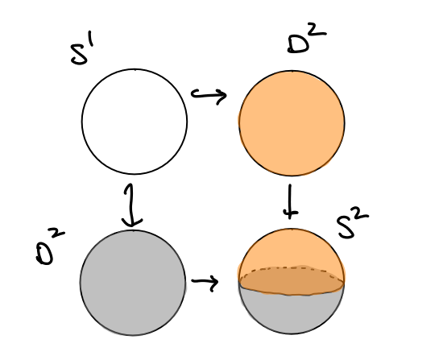

# Theorems: Algebraic Topology

:::{.fact title="Contracting Spaces in Products"}
\[
X\cross \RR^n \homotopic X \cross \pt \cong X
.\]
:::

## Fundamental Group

:::{.definition title="The Fundamental Group"}
Given a pointed space $(X,x_{0})$, we define the fundamental group $\pi_{1}(X)$ as follows:

- Take the set $L = \theset{\alpha: S^1\into X \mid \alpha(0) = \alpha(1) = x_{0}}$.
- Define an equivalence relation $\alpha \sim \beta$ iff there exists a homotopy 
\[
H: &S^1 \cross I  \to X \\ 
&\begin{cases}
H(s, 0) = \alpha(s)\\
H(s, 1) = \beta(s),
\end{cases}
\]
i.e. if $f\homotopic g$ in $X$.
  - Symmetric:
  - Reflexive:
  - Transitive:
- Define $L/\sim$, which contains elements like $[\alpha]$ and $[\id_{x_{0}}]$, the equivalence classes of loops after quotienting by this relation.
- Define a product structure: for $[\alpha], [\beta] \in L/\sim$, define $[\alpha][\beta] = [\alpha \cdot \beta]$, where we just need to define a product structure on bona fide loops. Just do this by reparameterizing:
  $(f\cdot g)(s) = \mathbb{1}[s \in \left[0, \frac{1}{2}]\right]f(2s) + \mathbb{1}[s \in \left[\frac{1}{2}, 1]\right]g(2s-1)$
  - Continuous: by the pasting lemma and assumed continuity of $f, g$
  - Well-defined:
- Check that this is actually a group
  - Identity element:
  - Closure:
  - Associativity:
  - Inverses:
- Summary:
  - Elements of the fundamental group are *homotopy classes of loops*.
  - Continuous maps between spaces induce *some* homomorphism on fundamental groups.

:::

:::{.fact}
\envlist

- $H_{1}$ is the abelianization of $\pi_{1}$.

- Homotopy commutes with products: $\pi_{k} \prod X_{i} = \prod \pi_{k} X_{i}$.

- Homotopy splits wedge products: $\pi_{1} \bigvee X_{i} = \ast \pi_{1} X_{i}$.

:::

:::{.proposition title="$\pi_1$ detects simply-connectedness"}
$\pi_{1}(X) = 1$ iff $X$ is simply connected.
:::

:::{.proof title="?"}
$\Rightarrow$: Suppose $X$ is simply connected. Then every loop in $X$ contracts to a point, so if $\alpha$ is a loop in $X$, $[\alpha] = [\id_{x_{0}}]$, the identity element of $\pi_{1}(X)$. But then there is only one element in in this group.

$\Leftarrow$: Suppose $\pi_{1}(X) = 0$. Then there is just one element in the fundamental group, the identity element, so if $\alpha$ is a loop in $X$ then $[\alpha] = [\id_{x_{0}}]$. So there is a homotopy taking $\alpha$ to the constant map, which is a contraction of $\alpha$ to a point.

:::

### Conjugacy in $\pi_{1}$:

- See Hatcher 1.19, p.28
- See Hatcher's proof that $\pi_{1}$ is a group
- See change of basepoint map

### Calculating $\pi_1$ 

:::{.proposition title="Using universal covers"}
If $\tilde X \to X$ the universal cover of $X$ and $G\actson \tilde X$ with $\tilde X/G = X$ then $\pi_1(X) = G$. 
:::

:::{.proposition title="Killing homotopy"}
$\pi_1 X$ for $X$ a CW-complex only depends on the 2-skeleton $X^{2}$, and in general $\pi_k(X)$ only depends on the $k+2$-skeleton.
Thus attaching $k+2$ or higher cells does not change $\pi_k$.
:::

:::{.theorem title="Seifert-van Kampen"}
Suppose $X = U_{1} \union U_{2}$ where $U_1, U_2$, and $U \da U_{1} \intersect U_{2} \neq \emptyset$ are open and path-connected 
[^path_connected_necessary]

, and let $x_0 \in U$. 

Then the inclusion maps $i_{1}: U_{1} \injects X$ and $i_{2}: U_{2} \injects X$ induce the following group homomorphisms:
\[
i_{1}^*: \pi_{1}(U_{1}, x_0) \into \pi_{1}(X, x_0) \\
i_{2}^*: \pi_{1}(U_{2}, x_0) \into \pi_{1}(X, x_0)
\]

There is a natural isomorphism
\[
\pi_{1}(X) \cong \pi_{1} U \ast_{\pi_{1}(U \intersect V)} \pi_{1} V
,\]

where the amalgamated product can be computed as follows:
A **pushout** is the colimit of the following diagram

\begin{tikzcd}
A \Disjoint_{Z} B   & A \ar[d] \ar[l] \\
B \ar[u]\ar[r]          & Z \ar[l, "\iota_{B}"] \ar[u, "\iota_{A}"]
\end{tikzcd}

For groups, the pushout is realized by the amalgamated free product: if 
\[
\begin{cases}
\pi_1 U_1 = A = \generators{G_{A} \suchthat R_{A}} \\
\pi_1 U_2 = B = \generators{G_{B} \suchthat R_{B}}
\end{cases}
\implies 
A \ast_{Z} B \da \gens{ G_{A}, G_{B} \suchthat R_{A}, R_{B}, T}
\]
where $T$ is a set of relations given by 
\[
T = \theset{\iota_{1}^*(z) \iota_{2}^*  (z) ^{-1}   \suchthat z\in \pi_1 (U_1 \intersect U_2)}
,\]
where $\iota_2^*(z) ^{-1}$ denotes the inverse group element.
If we have presentations

\[ 
\pi_{1}(U, x_0) &=
\left\langle u_{1}, \cdots, u_{k} \suchthat \alpha_{1}, \cdots, \alpha_{l}\right\rangle \\ 
\pi_{1}(V, w) &=\left\langle v_{1}, \cdots, v_{m} \suchthat \beta_{1}, \cdots, \beta_{n}\right\rangle \\ 
\pi_{1}(U \cap V, x_0) 
&=\left\langle w_{1}, \cdots, w_{p} \suchthat \gamma_{1}, \cdots, \gamma_{q}\right\rangle 
\]

then
\[
\pi_{1}(X, w) 
&= \left\langle 
u_{1}, \cdots, u_{k}, v_{1}, \cdots, v_{m} 
\middle\vert
\begin{cases}
\alpha_{1}, 
\cdots, 
\alpha_{l}
\\
\beta_{1}, 
\cdots, 
\beta_{n}
\\
  I\left(w_{1}\right) J\left(w_{1}\right)^{-1}, 
  \cdots, 
  I\left(w_{p}\right) J\left(w_{p}\right)^{-1}
\\ 
\end{cases}
\right\rangle \\ \\
&= 
\frac{
  \pi_{1}(U_1) \ast \pi_{1}(U_2)
} {
  \generators{
    \theset{\iota_1^*(w_{i}) \iota_2^*(w_{i})\inv \suchthat 1\leq i \leq p}
  }
}
\]

[^path_connected_necessary]: 
Note that the hypothesis that $U_1 \intersect U_2$ is path-connected is necessary: take $S^1$ with $U,V$ neighborhoods of the poles, whose intersection is two disjoint components.

:::

:::{.example title="Pushing out with van Kampen"}
$A = \ZZ/4\ZZ = \gens{x \suchthat x^4}, B = \ZZ/6\ZZ = \gens{y \suchthat x^6}, Z = \ZZ/2\ZZ = \gens{z \suchthat z^2}$.
Then we can identify $Z$ as a subgroup of $A, B$ using $\iota_{A}(z) = x^2$ and $\iota_{B}(z) = y^3$.
So $$A\ast_{Z} B = \gens{x, y \suchthat x^4, y^6, x^2y^{-3}}$$.

:::

## General Homotopy Theory

:::{.theorem title="Whitehead's Theorem"}
A map $X \mapsvia{f} Y$ on CW complexes that is a weak homotopy equivalence (inducing isomorphisms in homotopy) is in fact a homotopy equivalence.
:::

:::{.warnings}
Individual maps may not work: take $S^2 \cross \RP^3$ and $S^3 \cross \RP^2$ which have isomorphic homotopy but not homology.
:::

:::{.theorem title="Hurewicz"}
The Hurewicz map on an $n-1\dash$connected space $X$ is an isomorphism $\pi_{k\leq n}X \to H_{k\leq n} X$.

> I.e. for the minimal $i\geq 2$ for which $\pi_{iX} \neq 0$ but $\pi_{\leq i-1}X = 0$, $\pi_{iX} \cong H_{iX}$.

:::

:::{.theorem title="Cellular Approximation"}
Any continuous map between CW complexes is homotopy equivalent to a cellular map.
:::

:::{.example title="Applications of cellular approximation"}
\envlist

- $\pi_{k\leq n}S^n = 0$
- $\pi_{n}(X) \cong \pi_{n}(X^{(n)})$
:::

:::{.theorem title="Freudenthal Suspension"}

:::
\todo[inline]{Theorem}

## Unsorted Facts

- For a graph $G$, we always have $\pi_{1}(G) \cong \ZZ^n$ where $n = |E(G - T)|$, the complement of the set of edges in any maximal tree. Equivalently, $n = 1-\chi(G)$. Moreover, $X \homotopic \bigvee^n S^1$ in this case.

- $\pi_{i\geq 2}(X)$ is always abelian.

* The ranks of $\pi_{0}$ and $H_{0}$ are the number of path components, and $\pi_{0}(X) = \ZZ$ iff $X$ is simply connected.

	* $X$ simply connected $\implies \pi_{k}(X) \cong H_{k}(X)$ up to and including the first nonvanishing $H_{k}$
  * $H_{1}(X) = \mathrm{Ab}(\pi_{1} X)$, the abelianization.

* $\pi_{k} \bigvee X \neq \prod \pi_{k} X$ (counterexample: $S^1 \vee S^2$)
  * Nice case: $\pi_{1}\bigvee X = \ast \pi_{1} X$ by Van Kampen.

* $\pi_{i}(\hat X) \cong \pi_{i}(X)$ for $i\geq 2$ whenever $\hat X \surjects X$ is a universal cover.

* $\pi_{i}(S^n) = 0$ for $i < n$, $\pi_{n}(S^n) = \ZZ$
  * Not necessarily true that $\pi_{i}(S^n) = 0$ when $i > n$!!!
    * E.g. $\pi_{3}(S^2) = \ZZ$ by Hopf fibration

* $S^n / S^k \homotopic S^n \vee \Sigma S^{k}$
  * $\Sigma S^n = S^{n+1}$

* General mantra: homotopy plays nicely with products, homology with wedge products.[^pullbacks]
* $\pi_{k}\prod X = \prod \pi_{k} X$ by LES.[^homotopyproduct]

- In general, homotopy groups behave nicely under homotopy pull-backs (e.g., fibrations and products), but not homotopy push-outs (e.g., cofibrations and wedges). Homology is the opposite.

- Constructing a $K(\pi, 1)$: since $\pi = \left< S \mid R\right> = F(S)/R$, take $\bigvee^{|S|} S^1 \union_{|R|} e^2$. In English, wedge a circle for each generator and attach spheres for relations.

---

# The Fundamental Group (Unsorted)

:::{.theorem title="?"}
Any two continuous functions into a convex set are homotopic.
:::

:::{.proof title="?"}
The linear homotopy. Supposing $X$ is convex, for any two points $x,y\in X$, the line $tx + (1-t)y$ is contained in $X$ for every $t\in[0,1]$.
So let $f, g: Z \into X$ be any continuous functions into $X$. Then define $H: Z \cross I \into X$ by $H(z,t) = tf(z) + (1-t)g(z)$, the linear homotopy between $f,g$. By convexity, the image is contained in $X$ for every $t,z$, so this is a homotopy between $f,g$.
:::

## Definition: The Fundamental Group / 1st Homotopy Group

[^pullbacks]: More generally, in $\mathbf{Top}$, we can look at $A \from \pt \to B$ -- then $A\cross B$ is the pullback and $A \vee B$ is the pushout. In this case, homology $h: \mathbf{Top} \to \mathbf{Grp}$ takes pushouts to pullbacks but doesn't behave well with pullbacks. Similarly, while $\pi$ takes pullbacks to pullbacks, it doesn't behave nicely with pushouts.

[^homotopyproduct]: This follows because $X\cross Y \surjects X$ is a fiber bundle, so use LES in homotopy and the fact that $\pi_{i\geq 2} \in \mathbf{Ab}$.

