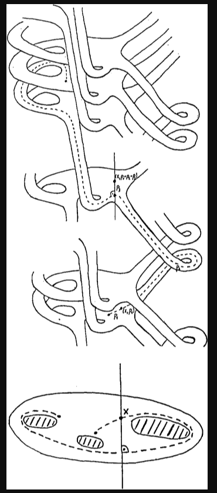
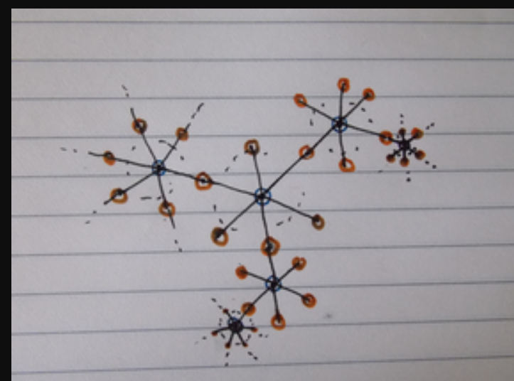

# Covering Spaces

When covering spaces are involved in any way, try computing Euler characteristics - this sometimes yields nice numerical constraints.

Picture to keep in mind 

<!---->

Path lifting: 

## Useful Covering Spaces

- $\RR \mapsvia{\pi} S^1 \leftarrow \ZZ$
- $\RR^n \mapsvia{\pi} T^n \leftarrow \ZZ^n$
- $\RP^n \mapsvia{\pi} S^n \leftarrow \ZZ_2$
- $\vee_n S^1 \mapsvia{\pi} C^n \leftarrow \ZZ^{\ast n}$ where $C^n$ is the $n\dash$valent Cayley Graph

- $M \mapsvia{\pi} \tilde M \leftarrow \ZZ_2$, the orientation double cover
- $T^2 \mapsvia{\times 2} \KK$
- $L_{p/q} \mapsvia{\pi} S^3 \leftarrow \ZZ_q$
- $\CC^* \mapsvia{z^n} \CC \leftarrow \ZZ_n$
- For $A \mapsvia{\pi(\times d)} B$, we have $\chi(A) = d\chi(B)$
- Covering spaces of orientable manifolds are orientable.

## Theorems

:::{.theorem title="Lifts to Universal Cover (H. 1.33)"}
If $f: Y\to X$ with $Y$ path-connected and locally path-connected, then there is a unique lift $\hat f: Y\to \hat X \iff f_*(\pi_1 Y) \subset \pi_*(\pi_1 \hat X)$.
:::

## Useful Facts

- Covering maps inject fundamental groups.
	- If $\tilde X \surjects_p X$ is a covering space, then $\pi_1(\tilde X) \injects \pi_1 (X)$ as a subgroup.
- The preimage of a boundary point under a covering map must also be a boundary point
- An $n\dash$sheeted covering space $\tilde X \surjects X$ satisfies $\chi(\tilde X) = n\chi(X)$ when $\tilde X$ is compact.
- For surfaces, covering spaces satisfy $\Sigma_{ij + 1} \surjects \Sigma_{i+1}$ for some $i, j$.
- $\mathrm{Deck}(\tilde X) \definedas \theset{\varphi \in \hom_{\mathbf{Top}}(\tilde X, \tilde X): p\circ \varphi = p}  \cong \pi_1(X)$
- $\tilde X \surjects_{\times k} X \implies [\pi_1(\tilde X) : \pi_1(X)] = k$ where $k =|p^{-1}(x_0)|$
- Normal subgroups correspond to regular coverings (where automorphisms act freely/transitively, so highly symmetric)

## Definition: Covering Maps

A covering map of a space is a map $p: \tilde X \into X$ such that each open set $U\in X$ pulls back to a disjoint union of open sets (called sheets) in $\tilde X$ (referred to as the covering space). That is, $p^{-1}(U) = \coprod_i V_i \subseteq \tilde X$.

If $\tilde X$is simply connected, it is the universal covering space - that is, for any other covering space $Y$ of $X$, $\tilde X$ is also a cover of $Y$. 
We also have $\text{Aut}(\tilde X) \cong \pi_1(X)$ for universal covers - for other covers, $\text{Aut}(\tilde X) \cong N(\Gamma) / \Gamma$ where $N(\cdot)$ is the normalizer and $\Gamma$ is the set of homotopy classes of loops in $\tilde X$ that are lifted from loops in $X$.

Covering spaces of $X$ are in (contravariant) galois correspondence with subgroups of $\pi_1(X)$, i.e. the covering map induces an injective map on fundamental groups.

The number of sheets of a covering space is equal to $[p^*(\pi_1(\tilde X)): \pi_1(X)]$.

### Example: Covering spaces

Identify $S^1 \subset \CC$, then every map $p_n: S^1 \into S^1$ given by $z\mapsto z^n$ a yields a covering space $\tilde X_n$.
Note the induced map $p_n^*: \pi_1(S^1) \into \pi_1(S^1)$ is given by $[\omega_1] \mapsto [\omega_n] = n[\omega_1]$ and so $p_n^*(\pi_1(S^1)) = \ZZ_n = \text{Aut}(\tilde X_n)$. (This can also be seen the other way, by looking at deck transformations which are rotations of the circle by $2\pi/n$)

The universal cover of $S^1$ is $\RR$; this is an infinitely sheeted cover. The fiber above $x_0$ is equal to $\ZZ$. $A:=B$

The universal cover of $\RP^n$ is $S^n$; this is a two-sheeted cover. The fiber above $x_0$ contains the two antipodal points.

The universal cover of $T = S^1 \cross S^1$ is $\tilde X =\RR \cross \RR$. The fiber above the base point contains every point on the integer lattice $\ZZ \cross \ZZ = \pi_1(T) = \text{Aut}(\tilde X)$

## Theorem: Homotopy Lifting

The setup: given $p: \tilde X \surjects X$ a covering space of $X$, a map $f: Y \into X$, and a homotopy $H: Y\cross I \into X$ such that $f_0 \definedas H(y, 0)$ has a lift $\tilde f_0: Y\into \tilde X$.

Then there is a unique homotopy $\tilde H: Y \cross I \into \tilde X$ satisfying $p\circ \tilde H = H$
In other words, if the $t=0$ portion of a homotopy can be lifted to a cover, the entire homotopy can.

## Theorem: Lifting Criterion

Let $p:\tilde X \surjects X$ be a covering of $X$, and let $f:Y \into X$ be a map. Then there is an induced homomorphism $f^*: \pi_1(Y) \into \pi_1(X)$. There is also an induced map $p^*: \pi_1(\tilde X) \into \pi_1(X)$. We then have the following condition:

There exists a lift $\tilde f: Y \into \tilde X$ satisfying $p\circ\tilde f = f$ iff $f^*(\pi_1(Y)) \subseteq p^*(\pi_1(\tilde X))$, i.e. when the fundamental group of $Y$ injects into the projected fundamental group of the cover.

Note that if $Y$ is simply connected, then $\pi_1(Y) = 0$ and this holds automatically!

Moreover, lifts are *unique* if they agree at a single point.

(Technically you need the base space to be connected and "locally pathwise connected")

## Theorem: Fundamental theorem of covering spaces
For every subgroup $G \leq \pi_1(X)$, there is a corresponding covering space $X_G \surjects X$ such that $\pi_1(X_G) = G$. The universal cover is obtained by taking $G$ to be the trivial group.

Alternative phrasing: there is a contravariant, inclusion-reversing map from subgroups of $\pi_1(X)$ to covering spaces of $X$.

## Theorem: If $Y$ is contractible, every map $f: X \into Y$ is nullhomotopic.

If $Y$ is contractible, then $Y$ has the homotopy type of a point. So there is a homotopy $H: Y\cross I \into Y$ between $\id_Y$ and a constant map $c: y \mapsto y_0$. So construct $H': X\cross I \into Y$ as $H'(x, t) = H(f(x), t)$; then $H'(x, 0) = H(f(x), 0) = (\id_x \circ f)(x) = f(x)$ and $H'(x, 1) = H(f(x), 1) = (c \circ f)(x) = c(y) = y_0$ for some $y$. So $H'$ is a homotopy between $f$ and a constant map, and $f$ is nullhomotopic.

## Theorem: Any map that factors through a contractible space is nullhomotopic.

Suppose we have the following commutative diagram:

Then $f = p \circ \tilde f$. Every map into a contractible space is nullhomotopic, so if $Z$ is contractible, then there is a homotopy $\tilde H: X\cross I \into Z$ from $\tilde f$ to a constant map $c$. But then $p\circ \tilde H: X \cross I \into Y$ is also a homotopy from $f$ to the constant map $p\circ c$.

## Application: Showing when there is no covering map $f: X \into Y$

This can be done by lifting $f$ to $\tilde f: X \into \tilde Y$, the universal cover. If the covering space happens to be contractible, you get that $\tilde f$ is nullhomotopic. So there is a homotopy $\tilde H: X\cross I \into \tilde Y$ - but then $p\circ\tilde H: X \into Y$ descends to a homotopy of $f$. If you leave $f$ arbitrary, this would force $\pi_1(Y) = 0$.

# Definition: Monodromy Action

Given $X$ connected and locally connected, $p:\tilde X \to X$ a covering, and $\alpha$ a loop at $x\in X$, let $\tilde \alpha$ be its lift and $\tilde x\in p^{-1}(x)$ be the lifted point in the fiber above $x$. Then $\alpha$ acts on $\tilde x$ from the right, by the rule $\tilde x \curvearrowleft \alpha = \tilde\alpha(1)$.

Then $\text{stab}(\tilde x) = p_*(\pi_1(\tilde X, \tilde x)) \subseteq \pi_1(X, x)$, and this induces a homomorphism $\pi_1(X, x) \into \text{Aut}(p^{-1}(x))$ which is a permutation of elements in the fiber above $x$.

## Definition: Freely and Properly Discontinuous Group Actions
Todo

## Theorem: If $G$ induces a free and properly discontinuous group action on $X$, then $p: X \rightarrow X/G$ is a covering space

Here $X/G$ denotes $X/\sim$  where $\forall x,y\in X, x\sim y \iff \exists g\in G \mid g.x = y$, i.e. all elements in a single orbit are identified.

### Proof:

Construct a map $\phi: G \rightarrow \pi_1(X/G, G.x_0)$ by $g \mapsto [p \circ \gamma_g]$

where $\gamma_g(0) = x_0$ and $\gamma_g(1) = G.x_0$.

- This is homomorphism:
- This is well-defined:

## Application: Fundamental group of the circle
## Application: Fundamental group of the real projective plane

## Constructing Covering Spaces
For a wedge product $X = \bigvee_i^n \tilde X_i$, the covering space $\tilde X$ is constructed as a tree in which each $\tilde X_i$ is a vertex with one of $i$ colors denoting which space it covers. The neighborhood of each colored vertex has edges corresponding to $\pi_1(X_i)$.

> If X and Y are two reasonable spaces with universal covers $\tilde X$ and $\tilde Y$, there is a nice picture of the universal cover $\widetilde{X\vee Y}$ which has the combinatorial pattern of an infinite tree.
> The tree is bipartite with vertices labeled by the symbols $X$ and $Y$. 
> The edges from an $X$ vertex are bijective correspondence with the fundamental group $\pi_1(X)$, and likewise for $Y$ vertices and $\pi_1(Y)$.
> To make $\widetilde{X\vee Y}$, replace each $X$ vertex by $\tilde X$ and each $Y$ vertex by $\tilde Y$. 
> The base point of $X$ lifts to $\abs{\pi_1(X)}$ points in $\tilde X$, and likewise for $Y$. 
> In $\widetilde{X\vee Y}$, copies of $\tilde X$ are attached to copies of $\tilde Y$ at lifts of base points.

**Example**: $S^1 \vee S^1 \to \ZZ \ast \ZZ$

**Example**: $\RP^2 \vee \RP^2 \to \ZZ_2 \ast \ZZ_2$

**Example**: $\RP^2 \vee T^2 \to \ZZ_2 \ast \ZZ$

## Application: Every subgroup of a free group is free
Idea for a particular case: use the fact that $\pi_1(\bigvee^k S^1) = \ZZ^{\ast k}$, so if $G \leq \ZZ^{\ast k}$ then there is a covering space $X \surjects \bigvee^k S^1$ such that $\pi_1(X) = G$. Since $X$ can be explicitly constructed as a graph, i.e. a CW complex with only a 1-skeleton, $\pi_1(X)$ is free on its maximal tree. $\qed$
