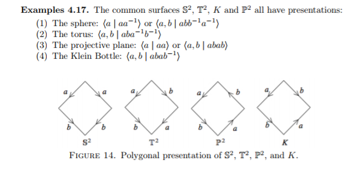
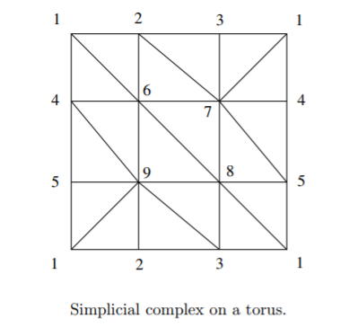
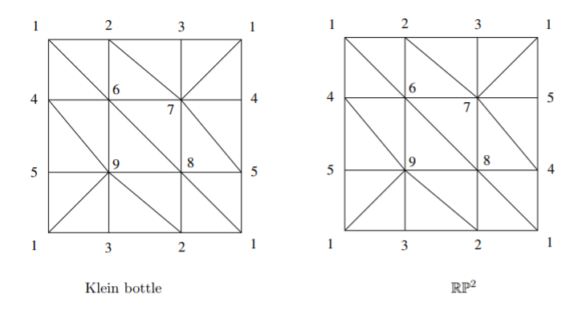
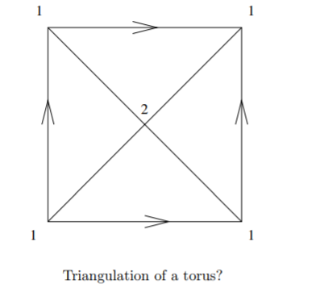

#  CW and Simplicial Complexes

\todo[inline]{Missing a lot on CW complexes}

## Degrees 

:::{.fact title="Useful properties of the degree of a map between spheres"}
\envlist

- $\text{deg}~\id_{S^n} = 1$

- $\text{deg} (f\circ g) = \text{deg}~f \cdot \text{deg}~g$

- $\text{deg}~r = -1$ where $r$ is any rotation about a hyperplane, i.e. $r(\thevector{x_1 \cdots x_i \cdots x_n}) = \thevector{x_1 \cdots -x_i \cdots x_n}$.

- The antipodal map on $S^n\subset \RR^{n+1}$ is the composition of $n+1$ reflections, so $\text{deg}~\alpha = (-1)^{n+1}$.
:::

## Examples of CW Complexes/Structures 

:::{.example title="Spheres"}
$S^n = e^0 \union e^n$: a point and an $n\dash$cell.
:::

:::{.example title="Real Projective Space"}
$\RP^n = e^1 \cup e^2 \cup \cdots \cup e^n$: one cell in each dimension.
:::

:::{.example title="Complex Projective Space"}
$\mathbb{CP}^n =e^2 \cup e^4 \cup \cdots e^{2n}$
:::

:::{.example title="Surfaces"}

:::

## Examples of Simplicial Complexes

:::{.remark}
To write down a simplicial complex, label the vertices with increasing integers. 
Then each $n$-cell will correspond to a set of $n+1$ of these integers - throw them in a list.
:::

:::{.example title="Torus"}

:::

:::{.example title="Klein Bottle and $\RP^2$"}

:::

:::{.example title="Non-example"}
For counterexamples, note that this fails to be a triangulation of $T$:

This fails - for example, the specification of a simplex $[1,2,1]$ does not uniquely determine a triangle in the this picture.
:::

## Constructing a CW Complex with Prescribed Homology

Given $G = \bigoplus G_{i}$, and want a space such that $H_{i} X = G$? Construct $X = \bigvee X_{i}$ and then $H_{i} (\bigvee X_{i}) = \bigoplus H_{i} X_{i}$. Reduces problem to: given a group $H$, find a space $Y$ such that $H_{n}(Y) = G$.
By the structure theorem of finitely generated abelian groups, it suffices to know how to do this for $\ZZ$ and $\ZZ/n\ZZ$, since their powers are just obtained by wedging (previous remark).
Recipe:

1. Attach an $e^n$ to a point to get $H_{n} = \ZZ$

2. Attach an $e^{n+1}$ with attaching map of degree $d$ to get $H_{n} = \ZZ_{d}$

