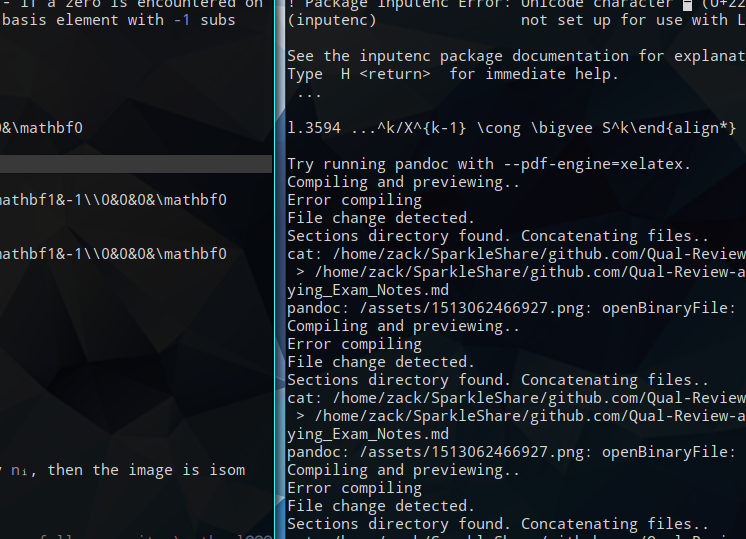

#  CW and Simplicial Complexes

## Examples

- $\mathbb{RP}^n = e^1 \cup e^2 \cup \cdots \cup e^n$
- $\mathbb{CP}^n =e^2 \cup e^4 \cup \cdots e^{2n}$
- $S^\infty = \varinjlim S^n$

# Definition: The Degree of  Map $S^n \into S^n$

Properties and examples:

- $\text{deg}~\id_{S^n} = 1$
- $\text{deg} (f\circ g) = \text{deg}~f \cdot \text{deg}~g$
- $\text{deg}~r = -1$ where $r$ is any rotation about a hyperplane, i.e. $r(\thevector{x_1 \cdots x_i \cdots x_n}) = \thevector{x_1 \cdots -x_i \cdots x_n}$.
- The antipodal map on $S^n\subset \RR^{n+1}$ is the composition of $n+1$ reflections, so $\text{deg}~\alpha = (-1)^{n+1}$.

# Definition: Simplicial Complex

Given a simplex $\sigma = [v_1 \cdots v_n]$, define the face map $\del_i:\Delta^n \into \Delta^{n-1}$, where $\del_i\sigma = [v_1 \cdots \hat v_i \cdots v_n]$.

A simplicial complex is a set $K$ satisfying

1. $\sigma \in K \implies \del_i\sigma \in K$
2. $\sigma,\tau\in K \implies \sigma\intersect\tau = \emptyset,~ \del_i\sigma,~\text{or}~\del_i\tau$
   1. This amounts to saying that any collection of $(n-1)$-simplices uniquely determines an $n$-simplex (or its lack thereof), or that that map $\Delta^k \into X$ is a continuous injection from the standard simplex in $\RR^n$.
3. $\abs{K\intersect B_\varepsilon(\sigma)} < \infty$ for every $\sigma\in K$, identifying $\sigma \subseteq \RR^n$.

To write down a simplicial complex, label the vertices with increasing integers. Then each $n$-cell will correspond to a set of $n+1$ of these integers - throw them in a list.

## Examples of Simplicial Complexes

For counterexamples, note that this fails to be a triangulation of $T$:

This fails - for example, the simplex $[1,2,1]$ does not uniquely determine a triangle in the above picture.

## Templates for Triangulation

You can always triangulate a space by triangulating something homeomorphic, so for common spaces you can work with these fundamental domains:

