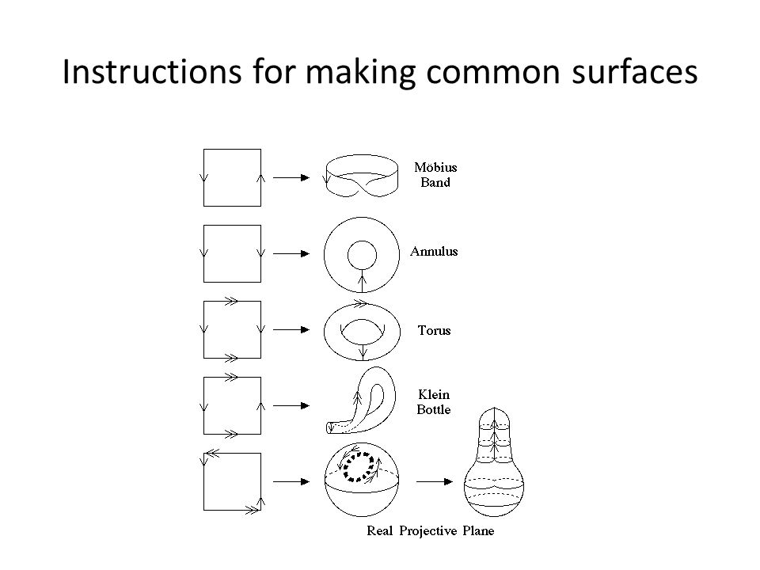

# Surfaces and Manifolds

The most common spaces appearing in this theory:

- $\SS ^2$, 
- $\TT^2 \definedas  S^1\cross S^1$, 
- $\RP^2$
- $\KK$ the Klein bottle
- $\bbm$ the Möbius Strip
- $\Sigma_n \definedas \#_{i=1}^n \TT^2$.

The first 4 can be obtained from the following pasting diagrams:

## Classification of Surfaces

:::{.theorem title="Classification of Surfaces"}
The set of surfaces under connect sum forms a monoid with the presentation
\[  
\gens{ \SS^2, \RP^2, \TT \suchthat \SS^2 = 0, 3\RP^2 = \RP^2 + \TT^2}
.\]

Surfaces are classified up to homeomorphism by orientability and $\chi$, or equivalently "genus" 

- In orientable case, actual genus, $g$ equals the number of copies of $\TT^2$.
- In nonorientable case, $k$ equals the number of copies of $\RP^2$.

In each case, there is a formula
\[  
\chi(X) = 
\begin{cases}
2-2g - b & \text{orientable} \\
2 - k & \text{non-orientable}.
\end{cases}
\]
:::

:::{.fact table="Table of surfaces possible for a given Euler characteristic"}

| Orientable?  | $-4$       | $-3$        | $-2$       | $-1$        | $0$                  | $1$     | $2$         |
| ------------ | ---        | ----        | ----       | ---         | ---                  | ---     | ---         |
| Yes          | $\Sigma_3$ | $\emptyset$ | $\Sigma_2$ | $\emptyset$ | $\TT^2, S^1\cross I$ | $\DD^2$ | $\SS^2$     |
| No           | ?          | ?           | ?          | ?           | $\KK, \bbm$          | $\RP^2$ | $\emptyset$ |

:::

:::{.proposition title="Inclusion-Exclusion"}
\[  
X = U\cup V \implies \chi(X) = \chi(U) + \chi(V) - \chi (U\cap V)
.\]
:::
:::{.proof}
Todo
:::
\todo{Proof.}

:::{.corollary title="Euler for Connect Sums"}
\[  
\chi(A \# B) = \chi(A) + \chi(B) - 2
.\]
:::
:::{.proof}
Set $U= A, B=V$, then by definition of the connect sum, $A\cap B = \SS^2$ where $\chi(\SS^2) = 2$
:::

:::{.proposition title="Decomposing $\RP^2$"}
\[  
\RP^2 = \bbm \disjoint_{\id_{\bd \bbm}} \bbm
.\]
:::

:::{.proposition title="Decomposing a Klein Bottle"}
\[  
\KK \cong \RP^2 \# \RP^2
.\]
:::
:::{.proof}
Todo
:::
\todo{Proof.}

:::{.proposition title="Rewriting a Klein Bottle"}
\[  
\RP^2 \# \KK \cong \RP^2 \# \TT^2
.\]
:::
:::{.proof}
Todo
:::
\todo{Proof.}

## Manifolds

:::{.remark}
To show something is not a manifold, try looking at local homology. 
Can use point-set style techniques like removing points, i.e. $H_1(X, X-\pt)$; this should essentially always yield $\ZZ$ by excision arguments.
:::

:::{.proposition title="Topology homology for manifolds"}
If $M^n$ is a closed connected manifold, then $H_n = \ZZ$ and $\tor(H_{n-1}) = 0$.
More generally, 
\[
\begin{cases}
\ZZ & M^n \text{ is orientable } 
\\
0 & \text{else}.
\end{cases}
\]
:::

:::{.proposition title="Homology of 3-manifolds"}
Let $M^3$ be a 3-manifold, then its homology is given by the following (by cases):

- Orientable: $H_* = (\ZZ, \ZZ^r, \ZZ^r, \ZZ)$

- Nonorientable: $H_* = (\ZZ, \ZZ^r, \ZZ^{r-1} \oplus \ZZ_2, \ZZ)$

:::

* Poincaré Duality: $H_i M^n =\cong H^{n-i} M^n$ iff $M^n$ is closed and orientable.

On the complements of spaces in $\RR^3$:

> My personal crutch is to just think about complements in $S^3$, which are usually easier since knot complements in $S^3$ are always $K(\pi, 1)$s. 
> Now if $K$ is a knot and $X$ is its complement in $S^3$, then you can prove that its complement in $\RR^3$ is homotopy equivalent to $S^2\vee X$

If $M$ is a closed 3-manifold and $K$ is a nullhomologous knot in $M$, then $H_1(X -n(K)) \cong H_1(X) \times \ZZ$ where $n(K)$ is a tubular neighborhood.

:::{.proposition title="Homology of Sphere minus a knot"}
For $M = S^3 \setminus K$, $H_*(M) = [\ZZ, \ZZ, 0, 0, \cdots]$.
:::
:::{.proof}
Apply Mayer-Vietoris, taking $S^3 = n(K) \cup (S^3-K)$, where $n(K) \homotopic S^1$ and $S^3-K \cap n(K) \homotopic T^2$. 
Use the fact that $S^3-K$ is a connected, open 3-manifold, so $H^3(S^3-K) =0$.

:::

- Every $\CC\dash$manifold is canonically orientable.
- If $M^n$ is **closed and connected**, then $H_{\geq n}(X) = 0$ and $M^n$ is orientable iff $H_n(X) = \ZZ$.
- If $M^n$ is a **closed orientable manifold without boundary**, then $H^k(M^n; F) \cong H_{n-k}(M^n; F)$ for a field $F$.
- This is a strict implication, so failure of the RHS implies missing conditions on the LHS.
- The intersection pairing is nondegenerate modulo torsion.
- If $M^n$ is a **closed orientable manifold with boundary** then  $H_k(M^n; \ZZ) \cong H^{n-k}(M^n, \del M^n; \ZZ)$
- $M^n$ closed, connected, and orientable $\implies H_n = \ZZ$ and $\tor(H_{n-1}) = 0$
- $M^n$ closed and $n$ odd implies $\chi(M^n) = 0$.
- Any map $X \to Y$ with $X$ factors through the orientation cover $\tilde Y_o$.
  - If $Y$ is non-orientable, this is a double cover.
- If $n$ is odd, $\chi(M^n) = 0$ by Poincaré Duality.

:::{.theorem title="Poincare Duality"}
Todo
:::

:::{.theorem title="Lefschetz Duality"}
Todo
:::

