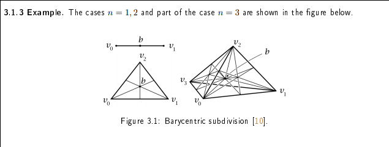
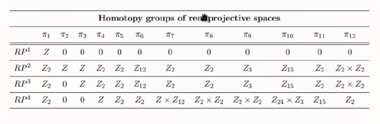
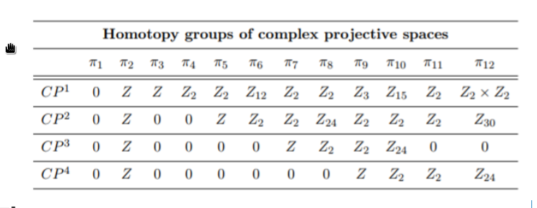
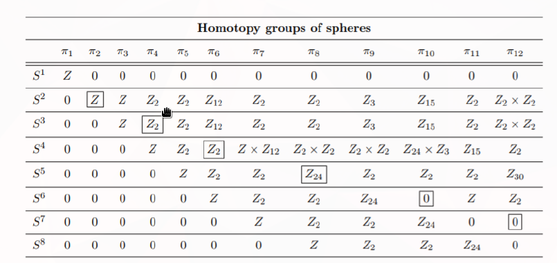
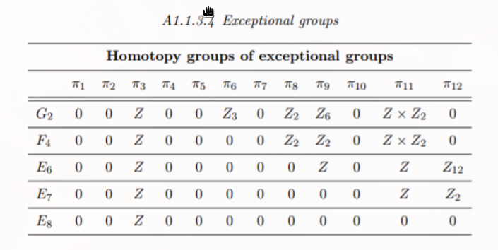

# Appendix: ?

* Assorted info about other Lie Groups:
 * $O_n, U_n, SO_n, SU_n, Sp_n$

* $\pi_k(U_n) = \ZZ\cdot\indic{k~\text{odd}}$
  * $\pi_1(U_n) = 1$

* $\pi_k(SU_n) = \ZZ\cdot\indic{k~\text{odd}}$
  * $\pi_1(SU_n) = 0$

* $\pi_k(U_n) = \ZZ/2\ZZ\cdot\indic{k = 0,1\mod 8} + \ZZ\cdot\indic{k = 3,7 \mod 8}$

* $\pi_k(SP_n) = \ZZ/2\ZZ\cdot\indic{k = 4,5\mod 8} + \ZZ\cdot\indic{k = 3,7 \mod 8}$

* Groups and Group Actions
	* $\pi_0(G) = G$ for $G$ a discrete topological group.
	* $\pi_k(G/H) = \pi_k(G)$ if $\pi_k(H) = \pi_{k-1}(H) = 0$.
	* $\pi_1(X/G) = \pi_0(G)$ when $G$ acts freely/transitively on $X$.

## Cap and Cup Products

$$
\cup: H^p \cross H^q \to H^{p+q}; (a^p \cup b^q)(\sigma) = a^p(\sigma \circ F_p) b^q(\sigma \circ B_q)
$$ 
where $F_p, B_q$ is embedding into a $p+q$ simplex.

For $f$ continuous, $f^*(a\cup b) = f^*a \cup f^*b$

It satisfies the Leibniz rule
$$\del(a^p \cup b^q) = \del a^p \cup b^q + (-1)^p(a^p\cup \del b^q)$$ 

$$
\cap: H_p \cross H^q \to H_{p-q}; \sigma \cap \psi = \psi(F\circ\sigma)(B\circ \sigma)
$$ 
where $F,B$ are the front/back face maps.

Given $\psi \in C^q, \phi \in C^p, \sigma: \Delta^{p+q} \to X$, we have
$$
\psi(\sigma \cap \phi) = (\phi \cup \psi)(\sigma)\\
\inner{\phi\cup \psi}{\sigma} = \inner{\psi}{\sigma \cap \phi}
$$

Let $M^n$ be a closed oriented smooth manifold, and $A^{\hat i}, B^{\hat j} \subseteq X$ be submanifolds of codimension $i$ and $j$ respectively that intersect transversely (so $\forall p\in A\intersect B$, the inclusion-induced map $T_pA \times T_p B \to T_p X$ is surjective.)

Then $A\cap B$ is a submanifold of codimension $i+j$ and there is a short exact sequence
$$
0 \to T_p(A\intersect B) \to T_p A \times T_p B \to T_p X \to 0
$$

which determines an orientation on $A\intersect B$.

Then the images under inclusion define homology classes

- $[A] \in H_{\hat i}X$
- $[B] \in H_{\hat j}X$
- $[A\intersect B] \in H_{\widehat{i+j}}X$.

Denoting their Poincare duals by

- $[A]\dual \in H^i X$
- $[B]\dual \in H^j X$
- $[A\intersect B]\dual \in H^{i+j}X$

We then have
$$
[A]\dual \smile [B]\dual = [A\intersect B]\dual \in H^{i+j} X
$$

Example: in $\CP^n$, each even-dimensional cohomology $H^{2i}\CP^n$ has a generator $\alpha_i$ with is Poincare dual to an $\hat i$ plane. A generic $\hat i$ plane intersects a $\hat j$ plane in a $\widehat{i+j}$ plane, yielding $\alpha_i \smile \alpha_j = \alpha_{i+j}$ for $i+j \leq n$.

Example: For $T^2$, we have
- $H_1T^2 = \ZZ^2$ generated by $[A], [B]$, the longitudinal and meridian circles.
- $H_0T^2 = \ZZ$ generated by $[p]$, the class of a point.

Then $A\cap B = \pm [p]$, and so
$$
[A]\dual \smile [B]\dual = [p]\dual\\
[B]\dual \smile [A]\dual = -[p]\dual
$$

## The Long Exact Sequence of a Pair

LES of pair $(A,B) \implies \cdots H_n(B) \into H_n(A) \into H_n(A,B) \into H_{n-1}(B) \cdots$

\begin{align*}
\begin{matrix}
  && B & \\
&\large\diagup &  & \large\diagdown \\
(A,B) & & \large\longleftarrow &  & A
\end{matrix}
.\end{align*}

## Tables

## Homotopy Groups of Lie Groups

- $O(n)$: $\pi_k O_n = ?$
- $U(n): \pi_k U_n$ is $\ZZ$ in odd degrees and $\pi_1 U_n = 1$
\todo[inline]{Check}
- $SU(n): \pi_k U_n$ is $\ZZ$ in odd degrees and $\pi_1 U_n = 0$.
- $U_n: \pi_k(U_n)$ is $\ZZ/2\ZZ$ in degrees?
