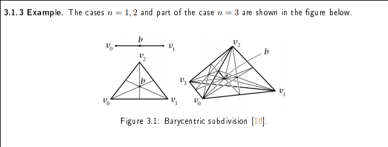

# Summary

* Algebraic topology topics:
	* Classification of compact surfaces
	* Euler characteristic
	* Connect sum
	* Homology and cohomology groups
	* Fundamental group
	* Singular/cellular/simplicial homology
	* Mayer-Vietoris long exact sequences for homology and cohomology
	* Diagram chasing
	* Degree of maps from $S^n \to S^n$
	* Orientability, compactness
	* Top-level homology and cohomology
	* Reduced homology and cohomology
	* Relative homology
	* Homotopy and homotopy invariance
	* Deformation retract
	* Retract
	* Excision
	* Kunneth formula
	* Factoring maps
	* Fundamental theorem of algebra
* Algebraic topology theorems:
	* Brouwer fixed point theorem
	* Poincare lemma
	* Poincare duality
	* de Rham theorem
	* Seifert-van Kampen theorem
* Covering space theory topics:
	* Covering maps
	* Free actions
	* Properly discontinuous action
	* Universal cover
	* Correspondence between covering spaces and subgroups of the fundamental group of the base.
	* Lifting paths
	* Homotopy lifting property
	* Deck transformations
	* The action of the fundamental group
	* Normal/regular cover

# Unsorted

## Useful long exact sequences
$$
\cdots \to H^{i}(X)\to H^{i}(U)\oplus H^{i}(V)\to H^{i}(U\cap V)\mapsvia{\delta} H^{i+1}(X)\to \cdots
$$

$$
\cdots \to H_{i}(A)\to H_{i}(X)\to H_{i}(X,A){\stackrel{\delta }{\to }}H_{{i-1}}(A)\to \cdots
$$

## Useful Short Exact Sequences

> Note that $\ext_R^0 = \hom_R$ and $\tor_R^0 = \tensor_R$

Homology to cohomology:
$$
\displaystyle 0\to \tor_\ZZ^0 (H_{i}(X;\ZZ), A)\,{\to }\,H_{i}(X;A)\to \operatorname {Tor}_\ZZ^1 (H_{i-1}(X;\ZZ ),A)\to 0
.$$

Cohomology to dual space:
$$
0\to \ext_{\ZZ}^{1}(H_{i-1}(X; \ZZ),A)\to H^{i}(X; A)\to \ext_{\ZZ}^{0}(H_{i}(X; \ZZ),A) \to 0
.$$

Product of spaces to tensor product of homology:
$$
0\to \bigoplus _{{i+j=k}}H_{i}(X;R)\otimes _{R}H_{j}(Y;R)\to H_{k}(X\times Y;R)\to \bigoplus _{{i+j=k-1}}{\mathrm  {Tor}}_{1}^{R}(H_{i}(X;R),H_{j}(Y;R))\to 0
$$

## Useful shortcuts

* Cohomology: If $A$ is a field, then $$H^i(X; A) \cong \hom(H_i(X; A), A)$$

* Kunneth: If $R$ is a freely generated free $R\dash$module (or a PID or a field), then
$$ 
H_{k}(X\times Y) \cong \bigoplus _{{i+j=k}}H_{i}(X)\otimes H_{j}(Y) \bigoplus_{i+j=k-1}\tor(H_i(X), H_j(X))
$$

* Universal Coefficients Theorem: If $X$ is a finite CW complex then
$$
H^i(X; \ZZ) = F(H_i(X; \ZZ)) \times T(H_{i-1}(X; \ZZ))\\
H_i(X; \ZZ) = F(H^i(X; \ZZ)) \times T(H^{i+1}(X; \ZZ))
$$

## Whitehead Theorem

A map $X \mapsvia{f} Y$ on CW complexes that is a weak homotopy equivalence (inducing isomorphisms in homotopy) is in fact a homotopy equivalence.

**Counterexample:**
Individual maps may not work, take $S^2 \cross \RP^3$ and $S^3 \cross \RP^2$ which have isomorphic homotopy but not homology.

## Hurewicz Theorem
The Hurewicz map on an $n-1\dash$connected space $X$ is an isomorphism $\pi_{k\leq n}X \to H_{k\leq n} X$.

## Cellular approximation theorem
Any continuous map between CW complexes is homotopy equivalent to a cellular map.

### Applications:

- $\pi_{k\leq n}S^n = 0$
- $\pi_n(X) \cong \pi_n(X^{(n)})$

## Commuting Homology/Homotopy Products

- $H_n(X/A) \cong \tilde H_n(X, A)$ when $A\subset X$ has a neighborhood that deformation retracts onto it.
- $H_n(\bigvee_\alpha X_\alpha) = \bigoplus_\alpha H_n X_\alpha$

## Results for Manifolds

- Every $\CC\dash$manifold is canonically orientable.
- If $M^n$ is **closed and connected**, then $H_{\geq n}(X) = 0$ and $M^n$ is orientable iff $H_n(X) = \ZZ$.
- Poincare Duality
- If $M^n$ is a **closed orientable manifold without boundary**, then $H^k(M^n; F) \cong H_{n-k}(M^n; F)$ for a field $F$.
- This is a strict implication, so failure of the RHS implies missing conditions on the LHS.
- The intersection pairing is nondegenerate modulo torsion.
- Lefschetz Duality
- If $M^n$ is a **closed orientable manifold with boundary** then  $H_k(M^n; \ZZ) \cong H^{n-k}(M^n, \del M^n; \ZZ)$
- $M^n$ closed, connected, and orientable $\implies H_n = \ZZ$ and $\mathbf{T}(H_{n-1}) = 0$
- $M^n$ closed and $n$ odd implies $\chi(M^n) = 0$.
- Any map $X \to Y$ with $X$ factors through the orientation cover $\tilde Y_o$.
- If $Y$ is non-orientable, this is a double cover.
- If $n$ is odd, $\chi(M^n) = 0$ by Poincare Duality.
- $M$ is orientable if $\pi_1(M)$ has no subgroup of index 2.
- If $M^\text{orientable} \mapsvia{\pi_k} M^\text{non-orientable}$ is a $k\dash$fold cover, then $k$ is even or $\infty$.

# Major Results

* Lefschetz Fixed Point Theorem
	- If $\Lambda_f \neq 0$ then $f$ has a fixed point, where $X\selfmap_f$ and $\Lambda_f = \sum_{k \geq 0} (-1)^k ~\mathrm{Tr}(H_k(X; \QQ) \selfmap_{f_*})$.

* Brouwer Fixed Point Theorem
	- Every $B^n \selfmap_f$ has a fixed point.

* Hairy Ball Theorem
	- There is no non-vanishing tangent vector field on even dimensional spheres.

* Borsuk-Ulam Theorem
	- For every $S^n \mapsvia{f} \RR^n \exists x\in S^n$ such that $f(x) = f(-x)$.

* Ham Sandwich Theorem

* Eilenberg-Zilberg

* Freudenthal Suspension

##  The Universal Coefficient Theorems

For changing coefficients from $\ZZ$ to $G$ an arbitrary group, there are short exact sequences
$$
0 \to H_i X \tensor G \to H_i(X; G) \to \tor(H_{i-1}X, G) \to 0
$$

$$
0 \to \ext (H_{i-1} X, G) \to H^i(X;G) \to \hom(H_i X, G) \to 0
$$

which split unnaturally:
$$
H_i(X;G) = (H_iX\tensor G) \oplus \tor(H_{i-1}X; G)
$$

$$
H^i(X; G) = \hom(H_iX, G) \oplus \ext(H_{i-1}X; G)
$$

When $H_iX$ are all finitely generated, write $H_i(X; \ZZ) = \ZZ^{\beta_i} \oplus T_i$. Then
$$
H^i(X; \ZZ) = \ZZ^{\beta_i} \oplus T_{i-1}.
$$

## The Kunneth Formula
$$
0 \to \bigoplus_{i+j=k} H_j(X; R) \tensor_R H_{i}(Y; R) \to H_k(X\cross Y; R) \to \bigoplus_{i+j=k-1} \tor_R^1(H_i(X; R), H_{j}(Y; R))
$$

Non-canonical splitting:
$$
H_k (X\cross Y) = \left( \bigoplus_{i+j = k} H_i X \oplus H_j Y\right) \oplus \bigoplus_{i+j = k-1}\tor(H_iX, H_j Y)
$$

## Free Resolutions

The canonical example:
$$
0 \to \ZZ \mapsvia{\times m} \ZZ \mapsvia{\mod m} \ZZ_m \to 0
$$

Or more generally for a finitely generated group $G = \generators{g_1, g_2, \cdots, g_n}$,
$$
\cdots \to \ker(f) \to F[g_1, g_2, \cdots, g_n] \mapsvia{f} G \to 0
$$ 
where $F$ denotes taking the free group.

Every abelian groups has a resolution of this form and length 2.

## Computing Tor

$$
\tor(A, B) = h[\cdots \to A_n \tensor B \to A_{n-1}\tensor B \to \cdots A_1\tensor B \to 0]
$$ 
where $A_*$ is any free resolution of $A$.

Shorthand/mnemonic: 
$$
\tor: \mathcal{F}(A) \to (\wait \tensor B) \to H_*
$$

## Computing Ext
$$
\ext(A, B) = h[\cdots \hom(A, B_n) \to \hom(A, B_{n-1}) \to \cdots \to \hom(A, B_1) \to 0 ]
$$ 
where $B_*$ is a any free resolution of $B$.

Shorthand/mnemonic: 
$$
\ext: \mathcal{F}(B) \to \hom(A, \wait) \to H_*
$$

## Properties of Tensor Product

- $A\tensor B \cong B\tensor A$
- $(\wait) \tensor_R R^n = \id$
- $\bigoplus_i A_i \tensor \bigoplus_j B_j = \bigoplus_i\bigoplus_j(A_i \tensor B_j)$
- $\ZZ_m \tensor \ZZ_n = \ZZ_d$
- $\ZZ_n \tensor A = A/nA$

## Properties of Hom

- $\hom_R (\bigoplus_i A_i, \prod B_j) = \bigoplus_i \prod_j \hom(A_i, B_j)$
- Contravariant in first slot, covariant in second
- Exact over vector spaces

## Properties of Tor

- $\tor_R^0(A, B) = A \tensor_R B$
- $\tor(\bigoplus_i A_i, \bigoplus_j B) = \bigoplus_i \bigoplus_j \tor(\mathbf{T}A_i, \mathbf{T}B_j)$  where $\mathbf{T}G$ is the torsion component of $G$.
- $\tor(\ZZ_n, G) = \ker (g \mapsto ng) = \theset{g\in G\mid ng = 0}$
- $\tor(A, B) = \tor(B, A)$

## Properties of Ext

- $\ext_R^0(A, B) = \hom_R(A, B)$
- $\ext(\bigoplus_i A_i, \prod_j B_j) = \bigoplus_i \prod_j \ext(\mathbf{T}A_i, B_j)$
- $\ext(F, G) = 0$ if $F$ is free
- $\ext(\ZZ_n, G) \cong G/nG$

## Hom/Ext/Tor Tables

$\hom$    | $\ZZ_m$  | $\ZZ$  | $\QQ$
--|---|---|--
$\ZZ_n$   | $\ZZ_d$  | $0$    | $0$
$\ZZ$     | $\ZZ_m$  | $\ZZ$  | $\QQ$
$\QQ$     | $0$      | $0$    | $\QQ$

$\tor$    | $\ZZ_m$ | $\ZZ$ | $\QQ$
--|---|---|--
$\ZZ_n$   | $\ZZ_d$ | $0$   | $0$
$\ZZ$     | $0$     | $0$   | $0$
$\QQ$     | $0$     | $0$   | $0$

$\ext$    | $\ZZ_m$   | $\ZZ$                 | $\QQ$
--|---|---|--
$\ZZ_n$   | $\ZZ_d$   | $\ZZ_n$               | $0$
$\ZZ$     | $0$       | $0$                   | $0$
$\QQ$     | $0$       | $\mathcal{A_p}/\QQ$   | $0$

Where $d = \gcd(m, n)$ and $\ZZ_0 \definedas 0$.

Things that behave like "the zero functor":

- $\ext(\ZZ, \wait)$
- $\tor(\wait, \ZZ), \tor(\ZZ, \wait)$
- $\tor(\wait, \QQ), \tor(\QQ, \wait)$

Thins that behave like "the identity functor":

- $\hom(\ZZ, \wait)$
- $\wait \tensor_\ZZ \ZZ$ and $\ZZ \tensor_\ZZ \wait$

For description of $\mathcal{A_p}$, see [here](http://math.jhu.edu/~jmb/note/torext.pdf). 
This is a certain ring of adeles.

# Low Dimensional Homology Examples

\begin{align*}
\begin{array}{cccccccccc}
S^1   &=  &[&\ZZ, &\ZZ,               &0,    &0,      &0,    &0\rightarrow & ]\\
\MM   &=  &[&\ZZ, &\ZZ,               &0,    &0,      &0,    &0\rightarrow & ]\\
\RP^1 &=  &[&\ZZ, &\ZZ,               &0,    &0,      &0,    &0\rightarrow & ]\\
\RP^2 &=  &[&\ZZ, &\ZZ_2,             &0,    &0,      &0,    &0\rightarrow & ]\\
\RP^3 &=  &[&\ZZ, &\ZZ_2,             &0,    &\ZZ,    &0,    &0\rightarrow & ]\\
\RP^4 &=  &[&\ZZ, &\ZZ_2,             &0,    &\ZZ_2,  &0,    &0\rightarrow & ]\\
 S^2  &=  &[&\ZZ, &0,                 &\ZZ,  &0,      &0,    &0\rightarrow & ]\\
\TT^2 &=  &[&\ZZ, &\ZZ^2,             &\ZZ,  &0,      &0,    &0\rightarrow & ]\\
\KK   &=  &[&\ZZ, &\ZZ \oplus \ZZ_2,  &0,    &0,      &0,    &0\rightarrow & ]\\
\CP^1 &=  &[&\ZZ, &0,                 &\ZZ,  &0,      &0,    &0\rightarrow & ]\\
\CP^2 &=  &[&\ZZ, &0,                 &\ZZ,  &0,      &\ZZ,  &0\rightarrow & ]\\
\end{array}
.\end{align*}

# Low Dimensional Equivalences

- $\RP^1 \cong S^1$
- $\CP^1 \cong S^2$
- $\MM \homotopic S^1$
- $\CP^n = \CC^n \coprod \CP^{n-1} = \coprod_{i=0}^n \CC^i$

# Homology Results

- $H_n(\bigvee_\alpha X_\alpha) = \bigoplus_\alpha H_n X_\alpha$
- $H_n(X, A) \cong H_n(X/A)$
- $H_n(X) = 0 \iff X$ has no $n\dash$cells.
- $C^0 X = \pt \implies d_1: C^1 \to C^0$ is the zero map.
- $H^*(X; \FF) = \hom(H_*(X; \FF),\FF)$ for a field.

## Constructing a CW Complex with Prescribed Homology

- Given $G = \bigoplus G_i$, and want a space such that $H_i X = G$? Construct $X = \bigvee X_i$ and then $H_i (\bigvee X_i) = \bigoplus H_i X_i$. Reduces problem to: given a group $H$, find a space $Y$ such that $H_n(Y) = G$.
  - Attach an $e^n$ to a point to get $H_n = \ZZ$
  - Then attach an $e^{n+1}$ with attaching map of degree $d$ to get $H_n = \ZZ_d$

# Long Exact Sequences

\begin{align*}
X = A\cup B \implies
&A\cap B \to A \oplus B \to A \cup B \mapsvia{\delta} \cdots
(X,A) \implies
&A \to X \to X,A \mapsvia{\delta} \cdots\\
A\to B \to C \implies
& \tor(A, G) \to \tor(B, G) \to \tor(C, G) \mapsvia{\delta_\downarrow} \cdots \\
A\to B \to C \implies
& \ext(A, G) \to \ext(B, G) \to \ext(C, G) \mapsvia{\delta_\uparrow} \cdots
\end{align*}

# Cellular Homology
How to compute:

1. Write cellular complex $$0 \to C^n \to C^{n-1} \to \cdots C^2 \to C^1 \to C^0 \to 0$$
2. Compute differentials $\del_i: C^i \to C^{i-1}$
    3. *Note: if $C^0$ is a point, $\del_1$ is the zero map.*
    4. *Note: $H_n X = 0 \iff C^n = \emptyset$.*
    5. Compute degrees: Use $\del_n(e_i^n) = \sum_i d_i e_i^{n-1}$ where $$d_i = \deg(\text{Attach }e_i^n \to \text{Collapse } X^{n-1}\dash\text{skeleton}),$$ which is a map $S^{n-1} \to S^{n-1}$.
	    1. Alternatively, choose orientations for both spheres. Then pick a point in the target, and look at points in the fiber. Sum them up with a weight of +1 if the orientations match and -1 otherwise.
    6. Note that $\ZZ^m \mapsvia{f} \ZZ^n$ has an $n\times m$ matrix
    7. Row reduce, image is span of rows with pivots. Kernel can be easily found by taking RREF, padding with zeros so matrix is square and has all diagonals, then reading down diagonal - if a zero is encountered on $n$th element, take that column vector as a basis element with $-1$ substituted in for the $n$th entry.
    e.g.
    
    \begin{align*}
    \begin{matrix}
    \mathbf1&2&0&2\\0&0&\mathbf1&-1\\0&0&0&\mathbf0
    \end{matrix} 
    \to
    \begin{matrix}
    \mathbf1&2&0&2\\0&\mathbf0&0&0\\0&0&\mathbf1&-1\\0&0&0&\mathbf0
    \end{matrix}
    \begin{matrix}
    \mathbf1&2&0&2\\0&\mathbf0&0&0\\0&0&\mathbf1&-1\\0&0&0&\mathbf0
    \end{matrix} \\
    \ker = 
    \begin{matrix}
    2\\-1\\0\\0
    \end{matrix} 
    \begin{matrix}
    3\\0\\-1\\-1
    \end{matrix}\\
    \im = \generators{a+2b+2d,c-d}
    .\end{align*}
     
    6. Or look at elementary divisors, say $n_i$, then the image is isomorphic to $\bigoplus n_i \ZZ$

# Surfaces

- Orientable: $S^n, T^n, \RP^\text{odd}$
- Nonorientable: $\RP^\text{even}, \mathbb{M}, \mathbb{K}$

# Pasting Diagrams

$S^2, \RP^2, T^2, \KK$: todo

Möbius strip: todo

# Useful Covering Spaces

- $\RR \mapsvia{\pi} S^1 \leftarrow \ZZ$
- $\RR^n \mapsvia{\pi} T^n \leftarrow \ZZ^n$
- $\RP^n \mapsvia{\pi} S^n \leftarrow \ZZ_2$
- $\vee_n S^1 \mapsvia{\pi} C^n \leftarrow \ZZ^{\ast n}$ where $C^n$ is the $n\dash$valent Cayley Graph

- $M \mapsvia{\pi} \tilde M \leftarrow \ZZ_2$, the orientation double cover
- $T^2 \mapsvia{\times 2} \KK$
- $L_{p/q} \mapsvia{\pi} S^3 \leftarrow \ZZ_q$
- $\CC^* \mapsvia{z^n} \CC \leftarrow \ZZ_n$
- For $A \mapsvia{\pi(\times d)} B$, we have $\chi(A) = d\chi(B)$
- Covering spaces of orientable manifolds are orientable.

# Classification of Compact Surfaces (Euler Characteristic)

- Classified by $\chi$ and orientability.
- $\chi X = \chi U + \chi V - \chi (U\cap V)$
- $\chi A \# B = \chi A + \chi B - 2$
- Connected closed surfaces: $<S, P, T, K \mid S = 1, P^2 = K, P^3 = PT>$
- $\chi X = 2 \implies X \cong S$
- $\chi X = 0 \implies X \cong T^2$ or $K$
- $\chi X = -2 \implies X \cong P$
- $\chi X = -n, X$ orientable $\implies \chi X \cong \Sigma_{1-\frac{n}{2}}$
- $\chi X = -n, X$ non-orientable $\implies \chi X \cong \tilde\Sigma_{1-\frac{n}{2}}$
- $\chi M^n = 0$ for $n$ odd.
- $M^n$ closed/connected $\implies H_n = \ZZ$ and $\tor(H_{n-1}) = 0$
- 3-manifolds:
  - Orientable: $H_* = (\ZZ, \ZZ^r, \ZZ^r, \ZZ)$
  - Nonorientable: $H_* = (\ZZ, \ZZ^r, \ZZ^{r-1} \oplus \ZZ_2, \ZZ)$

## Cap and Cup Products

$$
\cup: H^p \cross H^q \to H^{p+q}; (a^p \cup b^q)(\sigma) = a^p(\sigma \circ F_p) b^q(\sigma \circ B_q)
$$ 
where $F_p, B_q$ is embedding into a $p+q$ simplex.

For $f$ continuous, $f^*(a\cup b) = f^*a \cup f^*b$

It satisfies the Leibniz rule
$$\del(a^p \cup b^q) = \del a^p \cup b^q + (-1)^p(a^p\cup \del b^q)$$ 

$$
\cap: H_p \cross H^q \to H_{p-q}; \sigma \cap \psi = \psi(F\circ\sigma)(B\circ \sigma)
$$ 
where $F,B$ are the front/back face maps.

Given $\psi \in C^q, \phi \in C^p, \sigma: \Delta^{p+q} \to X$, we have
$$
\psi(\sigma \cap \phi) = (\phi \cup \psi)(\sigma)\\
\inner{\phi\cup \psi}{\sigma} = \inner{\psi}{\sigma \cap \phi}
$$

Let $M^n$ be a closed oriented smooth manifold, and $A^{\hat i}, B^{\hat j} \subseteq X$ be submanifolds of codimension $i$ and $j$ respectively that intersect transversely (so $\forall p\in A\intersect B$, the inclusion-induced map $T_pA \times T_p B \to T_p X$ is surjective.)

Then $A\cap B$ is a submanifold of codimension $i+j$ and there is a short exact sequence
$$
0 \to T_p(A\intersect B) \to T_p A \times T_p B \to T_p X \to 0
$$

which determines an orientation on $A\intersect B$.

Then the images under inclusion define homology classes

- $[A] \in H_{\hat i}X$
- $[B] \in H_{\hat j}X$
- $[A\intersect B] \in H_{\widehat{i+j}}X$.

Denoting their Poincare duals by

- $[A]\dual \in H^i X$
- $[B]\dual \in H^j X$
- $[A\intersect B]\dual \in H^{i+j}X$

We then have
$$
[A]\dual \smile [B]\dual = [A\intersect B]\dual \in H^{i+j} X
$$

Example: in $\CP^n$, each even-dimensional cohomology $H^{2i}\CP^n$ has a generator $\alpha_i$ with is Poincare dual to an $\hat i$ plane. A generic $\hat i$ plane intersects a $\hat j$ plane in a $\widehat{i+j}$ plane, yielding $\alpha_i \smile \alpha_j = \alpha_{i+j}$ for $i+j \leq n$.

Example: For $T^2$, we have
- $H_1T^2 = \ZZ^2$ generated by $[A], [B]$, the longitudinal and meridian circles.
- $H_0T^2 = \ZZ$ generated by $[p]$, the class of a point.

Then $A\cap B = \pm [p]$, and so
$$
[A]\dual \smile [B]\dual = [p]\dual\\
[B]\dual \smile [A]\dual = -[p]\dual
$$

# Further Notes

On the complements of spaces in $\RR^3$:

> > My personal crutch is to just think about complements in $S^3$, which are usually easier since knot complements in $S^3$ are always $K(\pi, 1)$s. 
> Now if $K$ is a knot and $X$ is its complement in $S^3$, then you can prove that its complement in $\RR^3$ is homotopy equivalent to $S^2\vee X$

For a graph $G$, we always have $\pi_1(G) \cong \ZZ^n$ where $n = |E(G - T)|$, the complement of the set of edges in any maximal tree. Equivalently, $n = 1-\chi(G)$. Moreover, $X \homotopic \bigvee^n S^1$ in this case.

To calculate $\pi_1(X)$: construct a universal cover $\tilde X$, then find a group $G \actson \tilde X$ such that $\tilde X/G = X$; then $\pi_1(X) = G$ by uniqueness of universal covers.

Constructing a $K(\pi, 1)$: since $\pi = \left< S \mid R\right> = F(S)/R$, take $\bigvee^{|S|} S^1 \union_{|R|} e^2$. In English, wedge a circle for each generator and attach spheres for relations.

If $M$ is a closed 3-manifold and $K$ is a nullhomologous knot in $M$, then $H_1(X -n(K)) \cong H_1(X) \times \ZZ$ where $n(K)$ is a tubular neighborhood.

Take $M=S^3$, $K$ any knot, then $H_*(S^3 - K) = [\ZZ, \ZZ, 0\rightarrow]$. Follows from Mayer-Vietoris, taking $S^3 = n(K) \cup (S^3-K)$, where $n(K) \homotopic S^1$ and $S^3-K \cap n(K) \homotopic T^2$. (Note $S^3-K$ is a connected, open 3-manifold, so $H^3(S^3-K) =0$).

When covering spaces are involved in any way, try computing Euler characteristics - this sometimes yields nice numerical constraints.

To show something is not a manifold, try looking at local homology. Can use point-set style techniques like removing points, i.e. $H_1(X, X-\pt)$; this should essentially always yield $\ZZ$ by excision arguments.

# Unsorted 2

## Basic Facts About Spheres
- $S^{2n+1} \subset \CC^{n+1}$
- $\CP^n = S^{2n+1} / S^n$

## Lemma: There are no nontrivial homomorphisms from finite groups into free groups.

In particular, any homomorphism $\ZZ_n \to \ZZ$ is trivial.

Proof: homomorphisms preserve torsion; the former has $n\dash$torsion while the latter does not.

This is especially useful if you have some $f: A\into B$ and you look at the induced homomorphism $f_*: \pi_1(A) \into \pi_1(B)$. If the former is finite and the latter contains a copy of $\ZZ$, then $f_*$ has to be the trivial map $f_*([\alpha]) = e \in \pi_1(B)$ for every $[\alpha] \in \pi_1(A)$.

## Different Types of Product/Sum Structures

- Cartesian Product $X\cross Y, \prod_i X_i$
- Direct Sum $X \oplus Y, \bigoplus_i X_i$
- Direct Product $X \ast Y, \ast_i X_i$
  - Element-wise multiplication, allows infinitely many entries
  - $\ast_i X_i= \oplus_i X_i$ for $i < \infty$
- Tensor Product $X \tensor Y, \bigotimes_i X_i, X^{\otimes_i}$

## Lemma: Contracting Spaces in Products

$X\cross \RR^n \homotopic X \cross \pt \cong X$

## Mayer-Vietoris

Given $A,B \subset X$ such that $A^\circ \cup B^\circ = X$, there is a long exact sequence in homology:

\begin{tikzcd}
 &  &  &  & \cdots \arrow[lllldd, out=0, in=-180, "\delta_3"'] \\
 &  &  &  &  \\
H_2(A\cap B) \arrow[rr] \arrow[rr, "{(i^*, -j^*)_2}"] &  & H_2 A \oplus H_2 B \arrow[rr, "(l^* - r^*)_2"] &  & H_2 (A\cup B) \arrow[lllldd, "\delta_2"', out=0, in=-180] \\
 &  &  &  &  \\
H_1(A\cap B) \arrow[rr, "{(i^*, -j^*)_1}"] &  & H_1 A \oplus H_1 B \arrow[rr, "(l^*-r^*)_1"] &  & H_1 (A\cup B) \arrow[lllldd, "\delta_1"', out=0, in=-180] \\
 &  &  &  &  \\
H_0 (A\cap B) \arrow[rr, "{(i^*, -j^*)_0}"] &  & H_0 A \oplus H_0 B \arrow[rr, "(l^* - r^*)_0"] &  & H_0 (A\cup B) \arrow[lllldd, "\delta_0"', out=0, in=-180] \\
 &  &  &  &  \\
0 &  &  &  &
\end{tikzcd}

This is sometimes written in the following compact form:
$$ \cdots  H_n(A \cap B) \xrightarrow{(i^*,~ j^*)} H_n(A) \oplus H_n(B) \xrightarrow{l^* - r^*}  H_n(X) \xrightarrow{\delta} H_{n-1}(A\cap B)\cdots$$

Where

- $i: A\cap B \hookrightarrow A$ induces $i^*: H_*(A\cap B) \to H_*(A)$

- $j: A\cap B \hookrightarrow B$ induces $j^*: H_*(A\cap B) \to H_*(B)$

- $l: A \hookrightarrow A\cup B$ induces $l^*: H_*(A) \to H_*(X)$

- $r: B \hookrightarrow A\cup B$ induces $r^*: H_*(B) \to H_*(X)$

The connecting homomorphisms $\delta_n :H_n(X) \to H_{n-1}(X)$ are defined by taking a class $[\alpha] \in H_n(X)$, writing it as an $n$-cycle $z$, then decomposing $z = \sum c_i$ where each $c_i$ is an $x+y$ chain. Then $\del(c_i) = \del(x+y) = 0$, since the boundary of a cycle is zero, so $\del(x) = -\del(y)$. So then just define $\delta([\alpha]) = [\del x] = [-\del y]$.

Handy mnemonic diagram:
\begin{align*}
\begin{matrix}
 && A\intersect B & \\
&\large\diagup &  & \large\diagdown \\
A\union B & & \large\longleftarrow &  & A \oplus B
\end{matrix}
.\end{align*}

### Application: Isomorphisms in the homology of spheres.

Claim: $H^i(S^n) \cong H^{i-1}(S^{n-1})$.

Write $X = A \cup B$, the northern and southern hemispheres, so that $A \cap B = S^{n-1}$, the equator. In the LES, we have:

\begin{align*}
H^{i+1}(S^n) \xrightarrow{} H^i(S^{n-1}) \xrightarrow{} H^iA \oplus H^i B \xrightarrow{} H^i S^n \xrightarrow{} H^{i-1}(S^{n-1}) \xrightarrow{} H^{i-1}A \oplus H^{i-1}B
.\end{align*}

But $A, B$ are contractible, so $H^iA= H^iB = 0$, so we have

\begin{align*}
H^{i+1}(S^n) \xrightarrow{} H^{i}(S^{n-1}) \xrightarrow{} 0 \oplus 0 \xrightarrow{}H^i(S^n) \xrightarrow{} H^{i-1}(S^{n-1}) \xrightarrow{} 0
.\end{align*}

And in particular, we have the shape $0 \to A \to B \to 0$ in an exact sequence, which is always an isomorphism.

## The Long Exact Sequence of a Pair

LES of pair $(A,B) \implies \cdots H_n(B) \into H_n(A) \into H_n(A,B) \into H_{n-1}(B) \cdots$

\begin{align*}
\begin{matrix}
  && B & \\
&\large\diagup &  & \large\diagdown \\
(A,B) & & \large\longleftarrow &  & A
\end{matrix}
.\end{align*}

