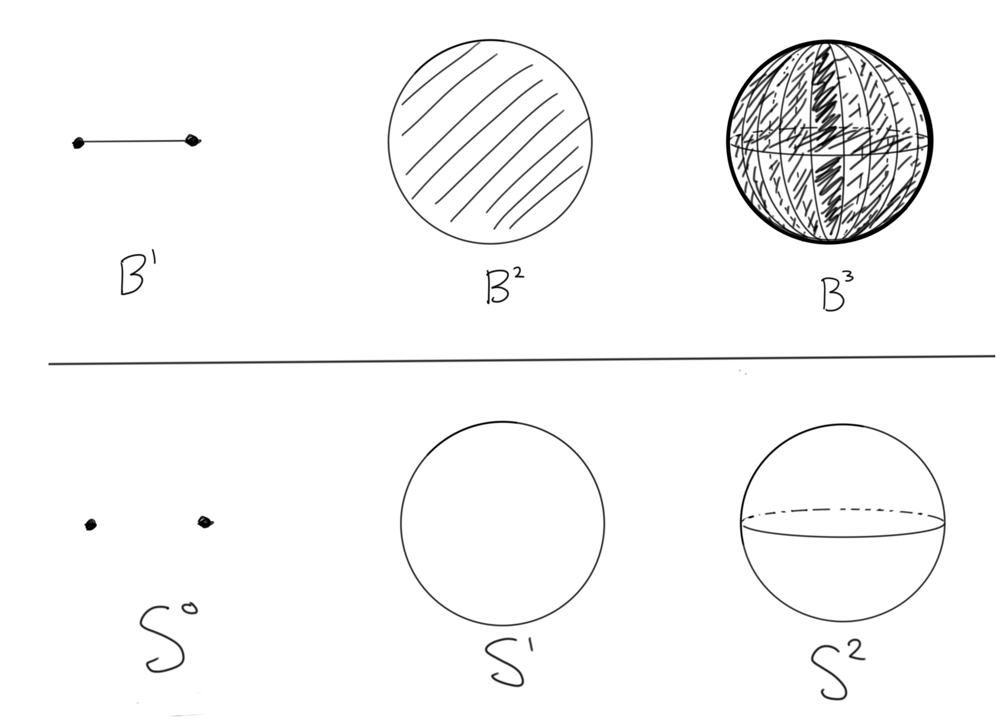

## Conventions

* $\pi_0(X)$ is the set of path components of $X$, and I write $\pi_0(X) = \ZZ$ if $X$ is path-connected (although it is not a group). Similarly, $H_0(X)$ is a free abelian group on the set of path components of $X$.

* Lists start at entry 1, since all spaces are connected here and thus $\pi_0 = H_0 = \ZZ$. That is,
	* $\pi_*(X) = [\pi_1(X), \pi_2(X), \pi_3(X), \cdots]$
	* $H_*(X) = [H_1(X), H_2(X), H_3(X), \cdots]$

*   For a finite index set $I$, $\prod_I G = \bigoplus_I G$ in $\mathbf{Grp}$, i.e. the finite direct product and finite direct sum coincide. 

    Otherwise, if $I$ is infinite, the direct sum requires cofinitely many zero entries (i.e. finitely many nonzero entries), so here we always use $\prod$. 

    In other words, there is an injective map $$\bigoplus_I G \injects \prod_I G$$ which is an isomorphism when $\abs{I} < \infty$

* The free abelian group of rank $n$: 
  $$
  \ZZ^n \definedas \prod_{i=1}^n \ZZ = \ZZ \times \ZZ \times \ldots \ZZ
  .$$ 
	- $x \in \ZZ^n = \left< a_1, \cdots, a_n\right> \implies x = \sum_n c_i a_i$ for some $c_i \in \ZZ$ , i.e. $a_i$ form a basis.
	- Example: $x = 2a_1 + 4a_2 + a_1 - a_2 = 3a_1 + 3a_2$.

* The **free product** of $n$ free abelian groups:
  $$
  \ZZ^{\ast n} \definedas \Conv_{i=1}^n \ZZ = \ZZ \ast \ZZ \ast \ldots \ZZ
  $$ 
  This is a free *nonabelian* group on $n$ generators.

	- $x \in \ZZ^{\ast n} = \left< a_1, \ldots, a_n\right>$ implies that $x$ is a finite word in the noncommuting symbols $a_i^k$ for $k\in \ZZ$.
	- Example: $x = a_1^2 a_2^4 a_1 a_2^{-2}$

* $K(G, n)$ is an Eilenberg-MacLane space, the homotopy-unique space satisfying 
$$
\pi_k(K(G, n)) = 
\begin{cases}
G & k=n, \\ 
0 & k\neq n.
\end{cases}
$$
	- $K(\ZZ, 1) = S^1$
	- $K(\ZZ, 2) = \CP^\infty$
	- $K(\ZZ/2\ZZ, 1) = \RP^\infty$

* $M(G, n)$ is a Moore space, the homotopy-unique space satisfying 
$$
H_k(M(G, n); G) = 
\begin{cases}
G & k=n, \\ 
0 & k\neq n.
\end{cases}
$$
	- $M(\ZZ, n) = S^n$
	- $M(\ZZ/2\ZZ, 1) = \RP^2$
	- $M(\ZZ/p\ZZ, n)$ is made by attaching $e^{n+1}$ to $S^n$ via a degree $p$ map.

* $B^n = \theset{\vector{v} \in \RR^n \mid \norm{\vector{v}} \leq 1} \subset \RR^n$

* $S^{n-1} = \del B^{n} = \theset{\vector{v} \in \RR^{n} \mid \norm{\vector{v}} = 1} \subset \RR^n$

* $\mathbb{RP}^n = S^n /S^0 = S^n / \ZZ/2\ZZ$

* $\mathbb{CP}^n = S^{2n+1} / S^1$

* $T^n = \prod_n S^1$ is the $n\dash$torus

* $D(k, X)$ is the space $X$ with $k\in \NN$ distinct points deleted, i.e. the punctured space $X - \theset{x_1, x_2, \ldots x_k}$ where each $x_i \in X$.

# Table of Homotopy and Homology Structures

\scriptsize

| $X$                           | $\pi_*(X)$                                     | $H_*(X)$                                                           | CW Structure                                       | $H^*(X)$                                           |
| ----------------------------- | ---------------------------------------------- | ------------------------------------------------------------------ | -------------------------------------------------- | ---------------------------------------            |
| $\RR^1$                       | $0$                                            | $0$                                                                | $\ZZ\cdot 1 + \ZZ \cdot x$                         | 0                                                  |
| $\RR^n$                       | $0$                                            | $0$                                                                | $(\ZZ \cdot 1 + \ZZ \cdot x)^n$                    | 0                                                  |
| $D(k, \RR^n)$                 | $\pi_*\bigvee^k S^1$                           | $\bigoplus_k H_* M(\ZZ, 1)$                                        | $1 + kx$                                           | ?                                                  |
| $B^n$                         | $\pi_*(\RR^n)$                                 | $H_*(\RR^n)$                                                       | $1 + x^n + x^{n+1}$                                | 0                                                  |
| $S^n$                         | $[0 \ldots , \ZZ, ? \ldots]$                   | $H_*M(\ZZ, n)$                                                     | $1 + x^n$                                          | $\ZZ[{}_{n}x]/(x^2)$                               |
| $D(k, S^n)$                   | $\pi_*\bigvee^{k-1}S^1$                        | $\bigoplus_{k-1}H_*M(\ZZ, 1)$                                      | $1 + (k-1)x^1$                                     | ?                                                  |
| $T^2$                         | $\pi_*S^1 \times \pi_* S^1$                    | $(H_* M(\ZZ, 1))^2  \times H_* M(\ZZ, 2)$                          | $1 + 2x + x^2$                                     | $\Lambda({}_{1}x_1, {}_{1}x_2)$                    |
| $T^n$                         | $\prod^n \pi_* S^1$                            | $\prod_{i=1}^n (H_* M(\ZZ, i))^{n\choose i}$                       | $(1 + x)^n$                                        | $\Lambda({}_{1}x_1, {}_{1}x_2, \ldots {}_{1}x_n)$  |
| $D(k, T^n)$                   | $[0, 0, 0, 0, \ldots]$?                        | $[0, 0, 0, 0, \ldots]$?                                            | $1 + x$                                            | ?                                                  |
| $S^1 \vee S^1$                | $\pi_*S^1 \ast \pi_* S^1$                      | $(H_*M(\ZZ, 1))^2$                                                 | $1 + 2x$                                           | ?                                                  |
| $\bigvee^n S^1$               | $\bigast^n \pi_* S^1$                          | $\prod H_* M(\ZZ, 1)$                                              | $1 + x$                                            | ?                                                  |
| $\RP^1$                       | $\pi_* S^1$                                    | $H_* M(\ZZ, 1)$                                                    | $1 + x$                                            | ${}_{0}\ZZ \times {}_{1}\ZZ$                       |
| $\RP^2$                       | $\pi_*K(\ZZ/2\ZZ, 1)+ \pi_* S^2$               | $H_*M(\ZZ/2\ZZ, 1)$                                                   | $1 + x + x^2$                                      | ${}_{0}\ZZ \times {}_{2}\ZZ/2\ZZ$                  |
| $\RP^3$                       | $\pi_*K(\ZZ/2\ZZ, 1)+  \pi_* S^3$              | $H_*M(\ZZ/2\ZZ, 1) + H_*M(\ZZ, 3)$                                    | $1 + x + x^2 + x^3$                                | ${}_{0}\ZZ \times {}_{2}\ZZ/2\ZZ \times {}_{3}\ZZ$ |
| $\RP^4$                       | $\pi_*K(\ZZ/2\ZZ, 1)+ \pi_* S^4$               | $H_*M(\ZZ/2\ZZ, 1) + H_*M(\ZZ/2\ZZ, 3)$                                  | $1 + x + x^2 + x^3 + x^4$                          | ${}_{0}\ZZ \times ({}_{2}\ZZ/2\ZZ)^2$              |
| $\RP^n, n \geq 4$ even        | $\pi_*K(\ZZ/2\ZZ, 1)+ \pi_*S^n$                | $\prod_{\text{odd}~i < n} H_*M(\ZZ/2\ZZ, i)$                          | $\sum_{i=1}^n x^i$                                 | ${}_{0}\ZZ \times \prod_{i=1}^{n/2}{}_{2}\ZZ/2\ZZ$ |
| $\RP^n, n \geq 4$ odd         | $\pi_*K(\ZZ/2\ZZ, 1)+ \pi_*S^n$                | $\prod_{\text{odd}~ i \leq n-2} H_*M(\ZZ/2\ZZ, i) \times H_* S^n$     | $\sum_{i=1}^n x^i$                                 | $H^*(\RP^{n-1}) \times {}_{n}\ZZ$                  |
| $\CP^1$                       | $\pi_*K(\ZZ, 2)  + \pi_* S^3$                  | $H_* S^2$                                                          | $x^0 + x^2$                                        | $\ZZ[{}_{2}x]/({}_2x^{2})$                         |
| $\CP^2$                       | $\pi_*K(\ZZ, 2)  + \pi_* S^5$                  | $H_*S^2 \times H_* S^4$                                            | $x^0 + x^2 + x^4$                                  | $\ZZ[{}_{2}x]/({}_2x^{3})$                         |
| $\CP^n, n \geq 2$             | $\pi_*K(\ZZ, 2)  + \pi_*S^{2n+1}$              | $\prod_{i=1}^n H_* S^{2i}$                                         | $\sum_{i=1}^n x^{2i}$                              | $\ZZ[{}_{2}x]/({}_2x^{n+1})$                       |
| Mobius Band                   | $\pi_* S^1$                                    | $H_* S^1$                                                          | $1 + x$                                            | ?                                                  |
| Klein Bottle                  | $K(\ZZ\semidirect_{-1} \ZZ, 1)$                | $H_*S^1 \times H_* \RP^\infty$                                     | $1 + 2x + x^2$                                     | ?                                                  |

\normalsize

Facts used to compute the above table:

- $\RR^n$ is a contractible space, and so $[S^m, \RR^n] = 0$ for all $n, m$ which makes its homotopy groups all zero.

- $D(k, \RR^n) = \RR^n - \theset{x_1 \ldots x_k} \homotopic \bigvee_{i=1}^k S^1$ by a deformation retract.

- $S^n \cong B^n / \del B^n$ and employs an attaching map 
  \begin{align*}
  \phi: (D^n, \del D^n) &\to S^n \\ 
  (D^n, \del D^n) &\mapsto (e^n, e^0)
  .\end{align*}

- $B^n \homotopic \RR^n$ by normalizing vectors.

- Use the inclusion $S^n \injects B^{n+1}$ as the attaching map.

- $\CP^1 \cong S^2$.

- $\RP^1 \cong S^1$.

- Use $\left[ \pi_1, \prod \right]= 0$ and the universal cover $\RR^1 \surjects S^1$ to yield the cover $\RR^n \surjects T^n$.

- Take the universal double cover $S^n \surjects^{\times 2} \RP^n$ to get equality in $\pi_{i\geq 2}$.

- Use $\CP^n = S^{2n+1} / S^1$

- Alternatively, the fundamental group is $\ZZ\ast\ZZ/ bab^{-1}a$. Use the fact the $\tilde K = \RR^2$.

- $M \homotopic S^1$ by deformation-retracting onto the center circle.

- $D(1, S^n) \cong \RR^n$ and thus $D(k, S^n) \cong D(k-1, \RR^n) \cong \bigvee^{k-1} S^1$

# Euler Characteristics

- Only surfaces with positive $\chi$:
	- $\chi S^2 = 2$
	- $\chi \RP^2 = 1$
	- $\chi B^2 = 1$
- Manifolds with zero $\chi$
	- $T^2, K, M, S^1 \cross I$
- Manifolds with negative $\chi$
	- $\Sigma_{g \geq 2}$ by $\chi(X) = 2-2g$.

# Useful Facts and Techniques

* Homotopy Groups
  * Hurewicz map

* Homology
  * Mayer-Vietoris
    * $(X = A \union B) \mapsto (\intersect, \oplus, \union)$ in homology
  * LES of a pair
	  - $(A \injects X) \mapsto (A, X, X/A)$
  * Excision

* $\pi_{i\geq 2}(X)$ is always abelian.

* The ranks of $\pi_0$ and $H_0$ are the number of path components, and $\pi_0(X) = \ZZ$ iff $X$ is simply connected.
	* $X$ simply connected $\implies \pi_k(X) \cong H_k(X)$ up to and including the first nonvanishing $H_k$
	* $H_1(X) = \pi_1 X / [\pi_1X, \pi_1X]$, the abelianization.

* General mantra: homotopy plays nicely with products, homology with wedge products.[^pullbacks]

> In general, homotopy groups behave nicely under homotopy pull-backs (e.g., fibrations and products), but not homotopy push-outs (e.g., cofibrations and wedges). Homology is the opposite.

* $\pi_k\prod X = \prod \pi_k X$ by LES.[^homotopyproduct]
* $H_k \prod X \neq \prod H_k X$ due to torsion.
  * Nice case: $H_k (A\cross B) = \prod_{i+j=k} H_i A \tensor H_j B$ by Kunneth when all groups are torsion-free.[^kunneth]
* $H_k \bigvee X = \prod H_k X$ by Mayer-Vietoris.[^wedge]
* $\pi_k \bigvee X \neq \prod \pi_k X$ (counterexample: $S^1 \vee S^2$)
  * Nice case: $\pi_1\bigvee X = \bigast \pi_1 X$ by Van Kampen.

* $\pi_i(\hat X) \cong \pi_i(X)$ for $i\geq 2$ whenever $\hat X \surjects X$ is a universal cover.

* Groups and Group Actions
	* $\pi_0(G) = G$ for $G$ a discrete topological group.
	* $\pi_k(G/H) = \pi_k(G)$ if $\pi_k(H) = \pi_{k-1}(H) = 0$.
	* $\pi_1(X/G) = \pi_0(G)$ when $G$ acts freely/transitively on $X$.

* Manifolds
	* $H^n(M^n) = \ZZ$ if $M^n$ is orientable and zero if $M^n$ is nonorientable.
	* Poincare Duality: $H_i M^n =\cong H^{n-i} M^n$ iff $M^n$ is closed and orientable.

# Other Interesting Things To Consider

* The "generalized uniform bouquet"? $\mathcal{B}^n(m) = \bigvee_{i=1}^n S^m$

* Lie Groups
  * The real general linear group, $\GL_n(\RR)$
    * The real special linear group $SL_n(\RR)$
    * The real orthogonal group, $O_n(\RR)$
      * The real special orthogonal group, $SO_n(\RR)$
    * The real unitary group, $U_n(\RR)$
      * The real special unitary group, $SU_n(\RR)$
    * The real symplectic group $Sp(n)$

* "Geometric" Stuff
  * Affine $n$-space over a field $\Af^n(k) = k^n \semidirect GL_n(k)$
  * The projective space $\PP^n(k)$
    * The projective linear group over a ring $R$, $PGL_n(R)$
    * The projective special linear group over a ring $R$, $PSL_n(R)$
    * The modular groups $PSL_n(\ZZ)$
      * Specifically $PSL_2(\ZZ)$

* The real Grassmannian, $Gr(n, k, \RR)$, i.e. the set of $k$ dimensional subspaces of $\RR^n$

* The Stiefel manifold $V_n(k)$

* Possible modifications to a space $X$:
	* Remove $k$ points by taking $D(k, X)$
	* Remove a line segment
	* Remove an entire line/axis
	* Remove a hole
	* Quotient by a group action (e.g. antipodal map, or rotation)
	* Remove a knot
	* Take complement in ambient space

* Assorted info about other Lie Groups:
 * $O_n, U_n, SO_n, SU_n, Sp_n$

* $\pi_k(U_n) = \ZZ\cdot\indic{k~\text{odd}}$
  * $\pi_1(U_n) = 1$

* $\pi_k(SU_n) = \ZZ\cdot\indic{k~\text{odd}}$
  * $\pi_1(SU_n) = 0$

* $\pi_k(U_n) = \ZZ/2\ZZ\cdot\indic{k = 0,1\mod 8} + \ZZ\cdot\indic{k = 3,7 \mod 8}$

* $\pi_k(SP_n) = \ZZ/2\ZZ\cdot\indic{k = 4,5\mod 8} + \ZZ\cdot\indic{k = 3,7 \mod 8}$

# Spheres

* $\pi_i(S^n) = 0$ for $i < n$, $\pi_n(S^n) = \ZZ$
  * Not necessarily true that $\pi_i(S^n) = 0$ when $i > n$!!!
    * E.g. $\pi_3(S^2) = \ZZ$ by Hopf fibration

* $H_i(S^n) = \indic{i \in \theset{0, n}}$

* $H_n(\bigvee_i X_i) \cong \prod_i H_n(X_i)$ for "good pairs"
  * Corollary: $H_n(\bigvee_k S^n) = \ZZ^k$

* $S^n / S^k \homotopic S^n \vee \Sigma S^{k}$
  * $\Sigma S^n = S^{n+1}$

* $S^n$ has the CW complex structure of 2 $k$-cells for each $0\leq k \leq n$.

[^kunneth]: The generalization of Kunneth is as follows: write $\mathcal{P}(n, k)$ be the set of partitions of $n$ into $k$ parts, i.e. $\mathbb{x} \in \mathcal{P}(n,k) \implies \mathbb{x} = (x_1, x_2, \ldots, x_k)$ where $\sum x_i  = n$. Then
$$
H_n(\prod_{j=1}^k X_j) = \bigoplus_{\mathbb{x} \in \mathcal{P}(n,k)} \bigotimes_{i=1}^{k} H_{x_i}(X_i).
$$
[^wedge]: $\bigvee$ is the coproduct in the category $\mathbf{Top}_0$ of pointed topological spaces, and alternatively, $X\vee Y$ is the pushout in $\mathbf{Top}$ of $X \from \pt \to Y$

[^homotopyproduct]: This follows because $X\cross Y \surjects X$ is a fiber bundle, so use LES in homotopy and the fact that $\pi_{i\geq 2} \in \mathbf{Ab}$.

[^pullbacks]: More generally, in $\mathbf{Top}$, we can look at $A \from \pt \to B$ -- then $A\cross B$ is the pullback and $A \vee B$ is the pushout. In this case, homology $h: \mathbf{Top} \to \mathbf{Grp}$ takes pushouts to pullbacks but doesn't behave well with pullbacks. Similarly, while $\pi$ takes pullbacks to pullbacks, it doesn't behave nicely with pushouts.

