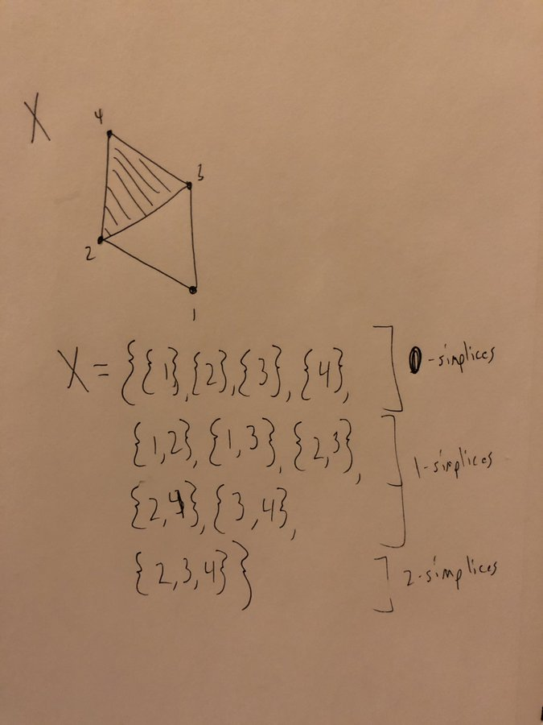

# Examples

## Common Spaces and Operations

Point-Set:

- Finite discrete sets with the discrete topology 
- Subspaces of $\RR$: $(a, b), (a, b], (a, \infty)$, etc.
  - $\ts{0} \union \ts{{1 \over n}\suchthat n\in \ZZ^{\geq 1}}$
- $\QQ$
- The topologist's sine curve
- One-point compactifications
- $\RR^\omega$
- Hawaiian earring
- Cantor set

Non-Hausdorff spaces:

- The cofinite topology on any infinite set.
- $\RR/\QQ$
- The line with two origins.

General Spaces:
\begin{align*}
S^n, \DD^n, T^n, \RP^n, \CP^n, \mathbb{M}, \mathbb{K}, \Sigma_g, \RP^\infty, \CP^\infty
.\end{align*}

"Constructed" Spaces

- Knot complements in $S^3$
- Covering spaces (hyperbolic geometry)
- Lens spaces
- Matrix groups
- Prism spaces
- Pair of pants
- Seifert surfaces
- Surgery

- Simplicial Complexes
  - Nice minimal example:
  
 

Exotic/Pathological Spaces

- $\HP^n$
- Dunce Cap
- Horned sphere

Operations

- Cartesian product $A\cross B$
- Wedge product $A \vee B$
- Connect Sum $A \# B$
- Quotienting $A/B$
- Puncturing $A\setminus \theset{a_i}$
- Smash product
- Join
- Cones
- Suspension
- Loop space
-  Identifying a finite number of points

## Alternative Topologies

- Discrete
- Cofinite
- Discrete and Indiscrete
- Uniform

The cofinite topology:

- Non-Hausdorff
- Compact

The discrete topology:

- Discrete iff points are open
- Always Hausdorff
- Compact iff finite
- Totally disconnected
- If the domain, every map is continuous

The indiscrete topology:

- Only open sets are $\emptyset, X$
- Non-Hausdorff
- If the codomain, every map is continuous
- Compact
