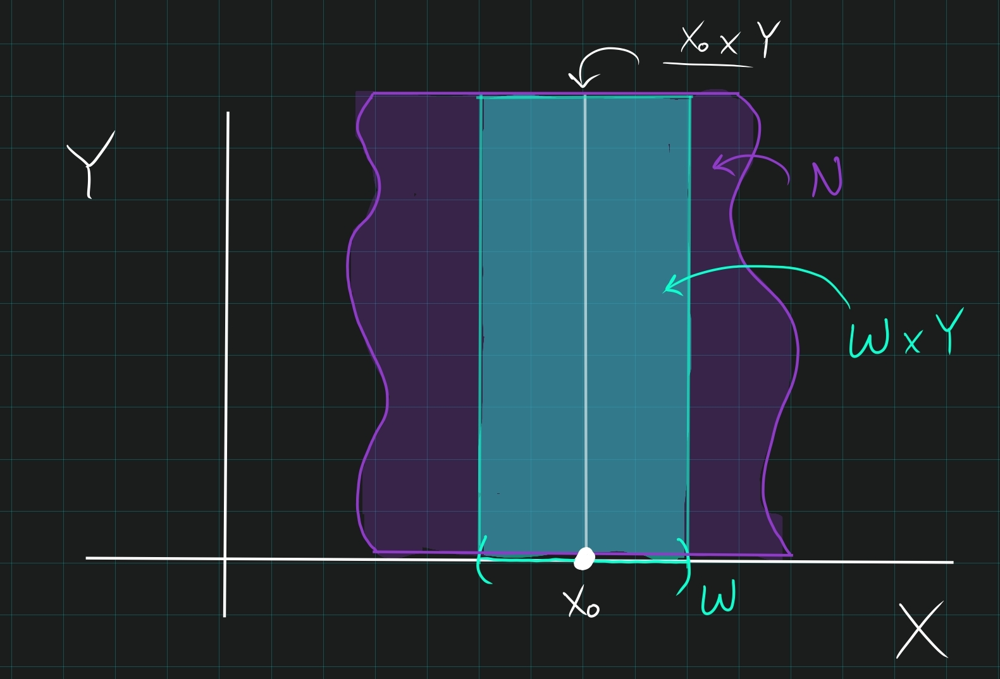
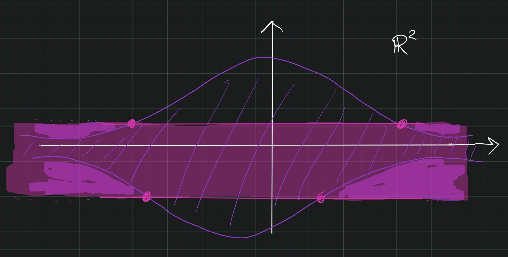

# Theorems

:::{.proposition title="The continuous image of a..."}
The following properties are "pushed forward" through continuous maps, in the sense that if property $P$ holds for $X$ and $f:X\to Y$, then $f(X)$ also satisfies $P$:

- Compactness
- Separability
- If $f$ is surjective:
  - Connectedness 
  - Density 

The following are **not preserved**:

- Openness
- Closedness

> [See more here.](https://people.clas.ufl.edu/groisser/files/cont_img_preimg.pdf)

:::

## Metric Spaces and Analysis

:::{.theorem title="Cantor's Intersection Theorem"}
A bounded collection of nested closed sets $C_1 \supset C_2 \supset \cdots$ in a metric space $X$ is nonempty $\iff X$ is complete.
:::

:::{.theorem title="Cantor's Nested Intervals Theorem"}
If $\theset{[a_n, b_n] \suchthat n\in \ZZ^{\geq 0}}$ is a nested sequence of compact intervals in a topological space $X$, then their intersection is nonempty.

If $X$ is a complete metric space and the diameters $\diam([a_n, b_n]) \converges{n\to\infty}\too 0$, then their intersection contains exactly one point.
:::

:::{.proposition title="Continuous on compact $\implies$ uniformly continuous"}
A continuous function on a compact set is uniformly continuous.
:::

:::{.proof title="?"}
Take $\theset{B_{\eps \over 2}(y) \suchthat y\in Y}\covers Y$, pull back to an open cover of $X$, has Lebesgue number $\delta_L > 0$, then $x' \in B_{\delta_L}(x) \implies f(x), f(x') \in B_{\eps \over 2}(y)$ for some $y$. 
:::

:::{.corollary title="Lipschitz implies uniformly continuous"}
Lipschitz continuity implies uniform continuity (take $\delta = \eps/C$)
:::

:::{.remark}
Counterexample to the converse: $f(x) = \sqrt x$ on $[0, 1]$ has unbounded derivative.
:::

:::{.theorem title="Extreme Value Theorem"}
For $f:X \to Y$ continuous with $X$ compact and $Y$ ordered in the order topology, there exist points $c, d\in X$ such that $f(x) \in [f(c), f(d)]$ for every $x$.
:::

:::{.theorem title="Sequentially compact if and only if complete and totally bounded"}
A metric space $X$ is sequentially compact iff it is complete and totally bounded.
:::

:::{.theorem title="Totally bounded if and only if Cauchy subsequences exist"}
A metric space is totally bounded iff every sequence has a Cauchy subsequence.
:::

:::{.theorem title="Compact if and only if complete and totally bounded"}
A metric space is compact iff it is complete and totally bounded.
:::

:::{.theorem title="Baire"}
If $X$ is a complete metric space, $X$ is a **Baire space**: the intersection of countably many dense open sets in $X$ is again dense in $X$.
:::

## Compactness

:::{.theorem title="Closed if and only if compact in Hausdorff spaces"}
$U\subset X$ a Hausdorff spaces is closed $\iff$ it is compact. 
:::

:::{.theorem title="Closed subset of compact is compact"}
A closed subset $A$ of a compact set $B$ is compact.
:::

:::{.proof title="?"}
\envlist

- Let $\theset{A_i} \rightrightarrows A$ be a covering of $A$ by sets open in $A$.
- Each $A_i = B_i \intersect A$ for some $B_i$ open in $B$ (definition of subspace topology)
- Define $V = \theset{B_i}$, then $V \rightrightarrows A$ is an open cover.
- Since $A$ is closed, $W\definedas B\setminus A$ is open
- Then $V\union W$ is an open cover of $B$, and has a finite subcover $\theset{V_i}$
- Then $\theset{V_i \intersect A}$ is a finite open cover of $A$.
:::

:::{.theorem title="Continuous image of compact is compact"}
The continuous image of a compact set is compact.
:::

:::{.proof title="?"}
Let $f:X\to f(X)$ be continuous.
Take an open covering $\mathcal{U} \covers f(X)$, then $f\inv(\mathcal{U}) \covers X$, which is cover by opens since $f$ is continuous.
Take a finite subcover by compactness of $X$, then they push forward to a finite subcover of $f(X)$.
:::

:::{.theorem title="Closed in Hausdorff $\implies$ compact"}
A closed subset of a Hausdorff space is compact.
:::

## Separability

:::{.proposition title="Properties preserved under retracts"}
A retract of a Hausdorff/connected/compact space is closed/connected/compact respectively.
:::

:::{.proposition title="?"}
Points are closed in $T_1$ spaces.
:::

## Maps and Homeomorphism

:::{.theorem title="Continuous bijections from compact to Hausdorff are homeomorphisms"}
A continuous bijection $f: X\to Y$ with $X$ is compact and $Y$ is Hausdorff is a homeomorphism.
:::

:::{.proof title="?"}
Show that $f\inv$ is continuous by showing $f$ is a closed map.
If $A\subseteq X$ is closed in a compact space, $A$ is compact.
The continuous image of a compact set is compact, so $f(A)$ is compact.
A compact set in a Hausdorff space is closed, so $f(A)$ is closed in $Y$.

:::

:::{.remark title="On retractions"}
Every space has at least one retraction - for example, the constant map $r:X \into \theset{x_0}$ for any $x\_0 \in X$.
:::

:::{.theorem title="When open maps are homeomorphisms"}
A continuous bijective open map is a homeomorphism.
:::

:::{.theorem title="Characterizations of continuous maps, Munkres 18.1"}
For $f:X\to Y$, TFAE:

- $f$ is continuous
- $A\subset X \implies f(\cl_X(A)) \subset \cl_X(f(A))$
- $B$ closed in $Y \implies f\inv(B)$ closed in $X$.
- For each $x\in X$ and each neighborhood $V \ni f(x)$, there is a neighborhood $U\ni x$ such that $f(U) \subset V$.
:::

:::{.proof title="?"}
See Munkres page 104.
:::

:::{.theorem title="Maps from compact to Hausdorff spaces, Lee A.52"}
If $f:X\to Y$ is continuous where $X$ is compact and $Y$ is Hausdorff, then 

- $f$ is a closed map.
- If $f$ is surjective, $f$ is a quotient map.
- If $f$ is injective, $f$ is a topological embedding.
- If $f$ is bijective, it is a homeomorphism.
:::

## The Tube Lemma

:::{.theorem title="The Tube Lemma"}
Let $X, Y$ be spaces with $Y$ compact, and let $x_0\in X$.
Let $N\subseteq X\cross Y$ be an open set containing the slice $x_0 \cross Y$, then there is a neighborhood $W\ni x$ in $X$ such that $N \supset W\cross Y$:

:::

:::{.remark}
Compactness in one factor is a necessary condition.
For a counterexample, $\RR^2$ and let $N$ be the set contained between a Gaussian and its reflection across the $x\dash$axis.
Then no tube about $y=0$ is entirely contained within $N$:

:::

:::{.proof title="Sketch"}
\envlist

- For each $y\in Y$ choose neighborhoods $A_y, B_y \subseteq Y$ such that 
\[
(x, y) \in A_y \cross B_y \subseteq U
.\]
- By compactness of $Y$, reduce this to finitely many $B_y \covers Y$ so $Y = \Union_{j=1}^n B_{y_j}$
- Set $O\da \intersect_{j=1}^n B_{y_j}$; this works.

:::

:::{.proof title="Detailed proof of the Tube Lemma"}

\todo[inline]{Check this proof!}

- Let $\theset{U_j\cross V_j \suchthat j\in J} \covers X\cross Y$. 
- Fix a point $x_0\in X$, then $\theset{x_0}\cross Y \subset N$ for some open set $N$.
- By the tube lemma, there is a $U^x \subset X$ such that the tube $U^x \cross Y \subset N$.
- Since $\theset{x_0}\cross Y \cong Y$ which is compact, there is a finite subcover $\theset{U_j \cross V_j \suchthat j\leq n} \covers \theset{x_0}\cross Y$. 
-   "Integrate the $X$": write 
    $$W = \intersect_{j=1}^n U_j,$$ 
    then $x_0 \in W$ and $W$ is a finite intersection of open sets and thus open.
- Claim: $\theset{U_j \cross V_j \suchthat j\leq n}\covers W\cross Y$
  - Let $(x, y) \in W\cross Y$; want to show $(x, y)\in U_j \cross V_j$ for some $j\leq n$.
  - Then $(x_0, y) \in \theset{x_0}\cross Y$ is on the same horizontal line
  - $(x_0, y)\in U_j \cross V_j$ for some $j$ by construction
  - So $y\in V_j$ for this $j$
  - Since $x\in W$, $x\in U_j$ for *every* $j$, thus $x\in U_j$.
  - So $(x, y) \in U_j \cross V_j$
:::

