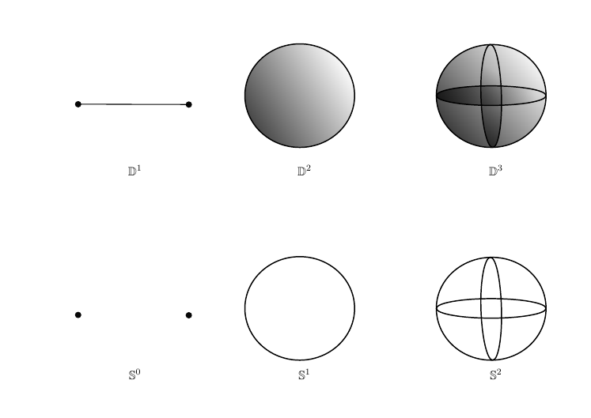

# Examples: Algebraic Topology

## Standard Spaces and Modifications

:::{.example title="Spheres and Balls"}
\[
\DD^n = \mathbb{B}^n &\da \ts{ \vector x \in \RR^{n} \st \norm{\vector x} \leq 1}
\SS^n &\da \ts{ \vector x \in \RR^{n+1} \st \norm{\vector x} = 1} = \bd \DD^n \\
.\]

> Note: I'll immediately drop the blackboard notation, this is just to emphasize that they're "canonical" objects.

The sphere can be constructed in several equivalent ways:

- $S^n \cong D^n / \bd D^n$: collapsing the boundary of a disc is homeomorphic to a sphere.
- $S^n \cong D^n \Disjoint_{\bd D^n} D^n$: gluing two discs along their boundary.

Note the subtle differences in dimension: $S^n$ is a manifold of dimension $n$ embedded in a space of dimension $n+1$.

<!--\begin{tikzpicture}-->
<!--\node (node_one) at (0,0) {-->
<!--\includegraphics{/home/zack/SparkleShare/github.com/Qual-Review-and-Solutions/Topology/Review\ Doc/sections/figures/spheres_and_balls}-->
<!--};-->

<!--\node at (-5.6, 1) {$\DD^1$};-->
<!--\node at (-0.2, 1) {$\DD^2$};-->
<!--\node at (5.9, 1) {$\DD^3$};-->

<!--\node at (-5.6, -5.5) {$\SS^0$};-->
<!--\node at (-0.2, -5.5) {$\SS^1$};-->
<!--\node at (5.9, -5.5) {$\SS^2$};-->
<!--\end{tikzpicture}-->

:::

:::{.example title="Real Projective Space"}
Constructed in one of several equivalent ways:

- $S^n/\sim$ where $\vector x \sim -\vector x$, i.e. antipodal points are identified.
- The space of lines in $\RR^{n+1}$.

One can also define $\RP^ \infty \da \directlim_{n} \RP^n$.
Fits into a fiber bundle of the form

\begin{tikzcd}
S^0 
  \ar[r] 
& 
S^n
  \ar[d] 
\\
& 
\RP^n 
\end{tikzcd}

:::

:::{.example title="Complex Projective Space"}
Defined in a similar ways, 

- Taking the unit sphere in $\CC^n$ and identifying $\vector z \sim -\vector z$.
- The space of lines in $\CC^{n+1}$

Can similarly define $\CP^ \infty \da \directlim_n \CP^n$.
Fits into a fiber bundle of the form

\begin{tikzcd}
S^1 
  \ar[r] 
& 
S^{2n+1}
  \ar[d] 
\\
& 
\CP^n 
\end{tikzcd}

:::

:::{.example title="Torii"}
The $n\dash$torus, defined as 
\[
T^n \da \prod_{j=1}^n S^1 = S^1 \times S^1 \times \cdots
.\]
:::

:::{.example title="Grassmannians"}
The real Grassmannian, $\Gr(n, k)_{/\RR}$, i.e. the set of $k$ dimensional subspaces of $\RR^n$.
One can similar define $\Gr(n, k)_{\CC}$ for complex subspaces.
Note that $\RP^n = \Gr(n, 1)_{\RR}$ and $\CP^n = \Gr(n, 1)_{/\CC}$.

:::

:::{.example title="Stiefel Manifolds"}
The Stiefel manifold $V_{n}(k)_{\RR}$, the space of orthonormal $k\dash$frames in $\RR^n$?
:::

:::{.example title="Lie Groups"}
Lie Groups:

* The general linear group, $\GL_{n}(\RR)$
  * The special linear group $SL_{n}(\RR)$
* The orthogonal group, $O_{n}(\RR)$
  * The special orthogonal group, $SO_{n}(\RR)$
* The real unitary group, $U_{n}(\CC)$
  * The special unitary group, $SU_{n}(\RR)$
* The symplectic group $Sp(2n)$

:::

:::{.example title="More random geometric examples"}
Some other spaces that show up, but don't usually have great algebraic topological properties:

* Affine $n$-space over a field $\Af^n(k) = k^n \semidirect GL_{n}(k)$
* The projective space $\PP^n(k)$
* The projective linear group over a ring $R$, $PGL_{n}(R)$
* The projective special linear group over a ring $R$, $PSL_{n}(R)$
* The modular groups $PSL_{n}(\ZZ)$
  * Specifically $PSL_{2}(\ZZ)$
:::

:::{.example title="Eilenberg-MacLane Spaces"}
$K(G, n)$ is an Eilenberg-MacLane space, the homotopy-unique space satisfying 
\[
\pi_{k}(K(G, n)) = 
\begin{cases}
G & k=n, \\ 
0 & \text{else}
\end{cases}
\]

Some known examples:

- $K(\ZZ, 1) = S^1$
- $K(\ZZ, 2) = \CP^\infty$
- $K(\ZZ/2\ZZ, 1) = \RP^\infty$

:::

:::{.example title="Moore Spaces"}
$M(G, n)$ is a Moore space, the homotopy-unique space satisfying 
\[
H_{k}(M(G, n); G) = 
\begin{cases}
G & k=n, \\ 
0 & k\neq n.
\end{cases}
\]

Some known examples:

- $M(\ZZ, n) = S^n$
- $M(\ZZ/2\ZZ, 1) = \RP^2$
- $M(\ZZ/p\ZZ, n)$ is made by attaching $e^{n+1}$ to $S^n$ via a degree $p$ map.

:::

:::{.fact title="about standard low-dimensional spaces"}
\envlist

- $\MM \homotopic S^1$ where $\MM$ is the Mobius band.
- $\CP^n = \CC^n \coprod \CP^{n-1} = \coprod_{i=0}^n \CC^i$
- $\CP^n = S^{2n+1} / S^n$
- $S^n / S^k \homotopic S^n \vee \Sigma S^k$.

:::

:::{.remark title="Accidental isomorphisms"}
In low dimensions, there are some "accidental" homeomorphisms:

- $\RP^1 \cong S^1$
- $\CP^1 \cong S^2$
- $\SO(3) \cong \RP^2$?

:::

## Modifying Known Spaces

:::{.example title="Deleting points"}
Write $D(k, X)$ for the space $X$ with $k\in \NN$ distinct points deleted, i.e. the punctured space $X - \theset{x_{1}, x_{2}, \ldots x_{k}}$ where each $x_{i} \in X$.
:::

:::{.example title="Bouquets of Spheres"}
The "generalized uniform bouquet"? $\mathcal{B}^n(m) = \bigvee_{i=1}^n S^m$.
There's no standard name for this, but it's an interesting enough object to consider!
:::

:::{.example title="Other ways to modify a known space"}
Possible modifications to a space $X$:

* Remove a line segment
* Remove an entire line/axis
* Remove a hole
* Quotient by a group action (e.g. antipodal map, or rotation)
* Remove a knot
* Take complement in ambient space

:::

# Low Dimensional Homology Examples

:::{.fact title="Table of low-dimensional homology"}
\[
\begin{array}{cccccccccc}
S^1   &=  &[&\ZZ, &\ZZ,               &0,    &0,      &0,    &0\rightarrow & ]\\
\MM   &=  &[&\ZZ, &\ZZ,               &0,    &0,      &0,    &0\rightarrow & ]\\
\RP^1 &=  &[&\ZZ, &\ZZ,               &0,    &0,      &0,    &0\rightarrow & ]\\
\RP^2 &=  &[&\ZZ, &\ZZ_{2},             &0,    &0,      &0,    &0\rightarrow & ]\\
\RP^3 &=  &[&\ZZ, &\ZZ_{2},             &0,    &\ZZ,    &0,    &0\rightarrow & ]\\
\RP^4 &=  &[&\ZZ, &\ZZ_{2},             &0,    &\ZZ_{2},  &0,    &0\rightarrow & ]\\
 S^2  &=  &[&\ZZ, &0,                 &\ZZ,  &0,      &0,    &0\rightarrow & ]\\
\TT^2 &=  &[&\ZZ, &\ZZ^2,             &\ZZ,  &0,      &0,    &0\rightarrow & ]\\
\KK   &=  &[&\ZZ, &\ZZ \oplus \ZZ_{2},  &0,    &0,      &0,    &0\rightarrow & ]\\
\CP^1 &=  &[&\ZZ, &0,                 &\ZZ,  &0,      &0,    &0\rightarrow & ]\\
\CP^2 &=  &[&\ZZ, &0,                 &\ZZ,  &0,      &\ZZ,  &0\rightarrow & ]\\
\end{array}
.\]

:::

# Table of Homotopy and Homology Structures

:::{.remark}
The following is a giant list of known homology/homotopy.

\scriptsize

| $X$                           | $\pi_*(X)$                                     | $H_*(X)$                                                           | CW Structure                                       | $H^*(X)$                                           |
| ----------------------------- | ---------------------------------------------- | ------------------------------------------------------------------ | -------------------------------------------------- | ---------------------------------------            |
| $\RR^1$                       | $0$                                            | $0$                                                                | $\ZZ\cdot 1 + \ZZ \cdot x$                         | 0                                                  |
| $\RR^n$                       | $0$                                            | $0$                                                                | $(\ZZ \cdot 1 + \ZZ \cdot x)^n$                    | 0                                                  |
| $D(k, \RR^n)$                 | $\pi_*\bigvee^k S^1$                           | $\bigoplus_{k} H_* M(\ZZ, 1)$                                        | $1 + kx$                                           | ?                                                  |
| $B^n$                         | $\pi_*(\RR^n)$                                 | $H_*(\RR^n)$                                                       | $1 + x^n + x^{n+1}$                                | 0                                                  |
| $S^n$                         | $[0 \ldots , \ZZ, ? \ldots]$                   | $H_*M(\ZZ, n)$                                                     | $1 + x^n$ or $\sum_{i=0}^n 2x^i$                   | $\ZZ[{}_{n}x]/(x^2)$                               |
| $D(k, S^n)$                   | $\pi_*\bigvee^{k-1}S^1$                        | $\bigoplus_{k-1}H_*M(\ZZ, 1)$                                      | $1 + (k-1)x^1$                                     | ?                                                  |
| $T^2$                         | $\pi_*S^1 \times \pi_* S^1$                    | $(H_* M(\ZZ, 1))^2  \times H_* M(\ZZ, 2)$                          | $1 + 2x + x^2$                                     | $\Lambda({}_{1}x_{1}, {}_{1}x_{2})$                    |
| $T^n$                         | $\prod^n \pi_* S^1$                            | $\prod_{i=1}^n (H_* M(\ZZ, i))^{n\choose i}$                       | $(1 + x)^n$                                        | $\Lambda({}_{1}x_{1}, {}_{1}x_{2}, \ldots {}_{1}x_{n})$  |
| $D(k, T^n)$                   | $[0, 0, 0, 0, \ldots]$?                        | $[0, 0, 0, 0, \ldots]$?                                            | $1 + x$                                            | ?                                                  |
| $S^1 \vee S^1$                | $\pi_*S^1 \ast \pi_* S^1$                      | $(H_*M(\ZZ, 1))^2$                                                 | $1 + 2x$                                           | ?                                                  |
| $\bigvee^n S^1$               | $\ast^n \pi_* S^1$                          | $\prod H_* M(\ZZ, 1)$                                              | $1 + x$                                            | ?                                                  |
| $\RP^1$                       | $\pi_* S^1$                                    | $H_* M(\ZZ, 1)$                                                    | $1 + x$                                            | ${}_{0}\ZZ \times {}_{1}\ZZ$                       |
| $\RP^2$                       | $\pi_*K(\ZZ/2\ZZ, 1)+ \pi_* S^2$               | $H_*M(\ZZ/2\ZZ, 1)$                                                | $1 + x + x^2$                                      | ${}_{0}\ZZ \times {}_{2}\ZZ/2\ZZ$                  |
| $\RP^3$                       | $\pi_*K(\ZZ/2\ZZ, 1)+  \pi_* S^3$              | $H_*M(\ZZ/2\ZZ, 1) + H_*M(\ZZ, 3)$                                 | $1 + x + x^2 + x^3$                                | ${}_{0}\ZZ \times {}_{2}\ZZ/2\ZZ \times {}_{3}\ZZ$ |
| $\RP^4$                       | $\pi_*K(\ZZ/2\ZZ, 1)+ \pi_* S^4$               | $H_*M(\ZZ/2\ZZ, 1) + H_*M(\ZZ/2\ZZ, 3)$                            | $1 + x + x^2 + x^3 + x^4$                          | ${}_{0}\ZZ \times ({}_{2}\ZZ/2\ZZ)^2$              |
| $\RP^n, n \geq 4$ even        | $\pi_*K(\ZZ/2\ZZ, 1)+ \pi_*S^n$                | $\prod_{\text{odd}~i < n} H_*M(\ZZ/2\ZZ, i)$                       | $\sum_{i=1}^n x^i$                                 | ${}_{0}\ZZ \times \prod_{i=1}^{n/2}{}_{2}\ZZ/2\ZZ$ |
| $\RP^n, n \geq 4$ odd         | $\pi_*K(\ZZ/2\ZZ, 1)+ \pi_*S^n$                | $\prod_{\text{odd}~ i \leq n-2} H_*M(\ZZ/2\ZZ, i) \times H_* S^n$  | $\sum_{i=1}^n x^i$                                 | $H^*(\RP^{n-1}) \times {}_{n}\ZZ$                  |
| $\CP^1$                       | $\pi_*K(\ZZ, 2)  + \pi_* S^3$                  | $H_* S^2$                                                          | $x^0 + x^2$                                        | $\ZZ[{}_{2}x]/({}_2x^{2})$                         |
| $\CP^2$                       | $\pi_*K(\ZZ, 2)  + \pi_* S^5$                  | $H_*S^2 \times H_* S^4$                                            | $x^0 + x^2 + x^4$                                  | $\ZZ[{}_{2}x]/({}_2x^{3})$                         |
| $\CP^n, n \geq 2$             | $\pi_*K(\ZZ, 2)  + \pi_*S^{2n+1}$              | $\prod_{i=1}^n H_* S^{2i}$                                         | $\sum_{i=1}^n x^{2i}$                              | $\ZZ[{}_{2}x]/({}_2x^{n+1})$                       |
| Mobius Band                   | $\pi_* S^1$                                    | $H_* S^1$                                                          | $1 + x$                                            | ?                                                  |
| Klein Bottle                  | $K(\ZZ\semidirect_{-1} \ZZ, 1)$                | $H_*S^1 \times H_* \RP^\infty$                                     | $1 + 2x + x^2$                                     | ?                                                  |

\normalsize

:::

:::{.fact title="used to fill out the above table"}
\envlist

- $\RR^n$ is a contractible space, and so $[S^m, \RR^n] = 0$ for all $n, m$ which makes its homotopy groups all zero.

- $D(k, \RR^n) = \RR^n - \theset{x_{1} \ldots x_{k}} \homotopic \bigvee_{i=1}^k S^1$ by a deformation retract.

- $S^n \cong B^n / \del B^n$ and employs an attaching map 

\[
\phi: (D^n, \del D^n) &\to S^n \\ 
(D^n, \del D^n) &\mapsto (e^n, e^0)
.\]

- $B^n \homotopic \RR^n$ by normalizing vectors.

- Use the inclusion $S^n \injects B^{n+1}$ as the attaching map.

- $\CP^1 \cong S^2$.

- $\RP^1 \cong S^1$.

- Use $\left[ \pi_{1}, \prod \right]= 0$ and the universal cover $\RR^1 \surjects S^1$ to yield the cover $\RR^n \surjects T^n$.

- Take the universal double cover $S^n \surjects^{\times 2} \RP^n$ to get equality in $\pi_{i\geq 2}$.

- Use $\CP^n = S^{2n+1} / S^1$

- Alternatively, the fundamental group is $\ZZ\ast\ZZ/ bab^{-1}a$. Use the fact the $\tilde K = \RR^2$.

- $M \homotopic S^1$ by deformation-retracting onto the center circle.

- $D(1, S^n) \cong \RR^n$ and thus $D(k, S^n) \cong D(k-1, \RR^n) \cong \bigvee^{k-1} S^1$

:::

