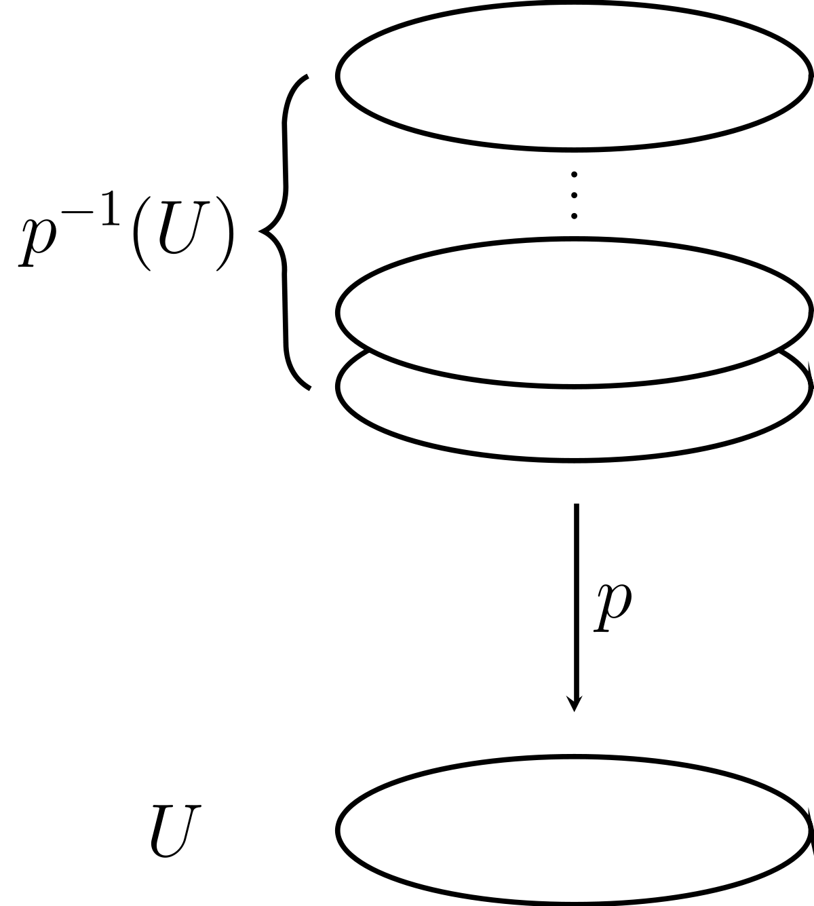
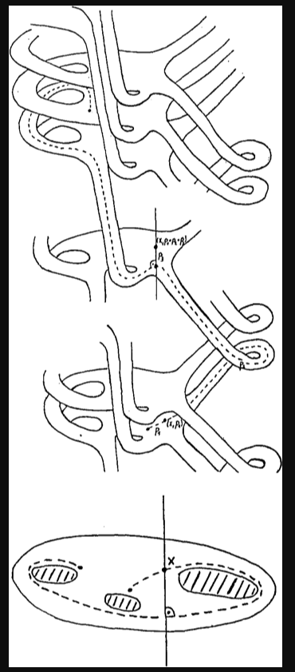
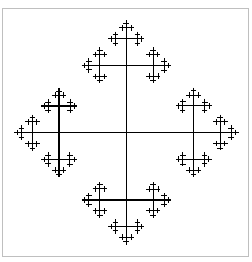
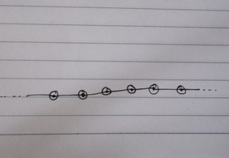
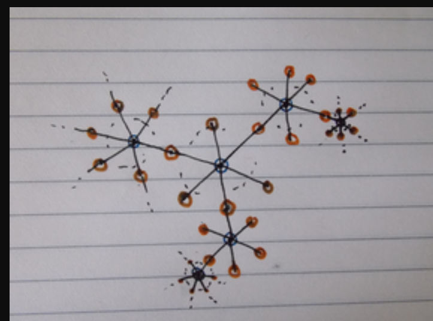

# Covering Spaces

Some pictures to keep in mind when it comes to covers and path lifting: 

## Useful Facts

:::{.remark}
When covering spaces are involved in any way, try computing Euler characteristics - this sometimes yields nice numerical constraints.
:::

:::{.fact title="Euler characteristics are multiplicative on covering spaces"}
For $p: A \mapsvia{} B$ an $n\dash$fold cover,
\[
\chi(A) = n\, \chi(B)
.\]

:::

:::{.fact}
Covering spaces of orientable manifolds are orientable.
:::

:::{.fact}
The preimage of a boundary point under a covering map must also be a boundary point
:::

:::{.fact}
Normal subgroups correspond to *normal/regular* coverings, where automorphisms act freely/transitively.
These are "maximally symmetric".
:::

## Universal Covers

:::{.definition title="Galois/normal/regular covers"}
A covering $\tilde X \mapsvia{p} X$ is **Galois** (or **normal/regular**) over $(X, x_0)$ iff $\Deck(\tilde X)$ acts transitively on the fibers: for any two lifts $\tilde x_1, \tilde x_2\in \tilde X$ of $x_0 \in X$, there is a $\psi\in \Deck(\tilde X)$ with $\psi(\tilde x_1) = \tilde x_2$.
:::

:::{.proposition title="Fundamental theorem of covering spaces, Hatcher 1.39"}
If $X$ is 

- Path-connected,
- Locally path-connected, and
- Semilocally simply connected,

then $X$ admits a universal cover $\hat{X} \to X$: if $C \mapsvia{q} X$ is any other covering map with $C$ connected, then there exists a covering map $\tilde p: \hat{X} \to C$ making the following diagram commute:

\begin{tikzcd}
	{C} && {\hat X} \\
	\\
	{X}
	\arrow["{q}", from=1-1, to=3-1, two heads]
	\arrow["{p}", from=1-3, to=3-1, two heads]
	\arrow["{\tilde p}"', from=1-3, to=1-1, dashed, two heads]
\end{tikzcd}
> [Link to diagram](https://q.uiver.app/?q=WzAsMyxbMCwyLCJYIl0sWzAsMCwiQyJdLFsyLDAsIlxcdGlsZGUgWCJdLFsxLDAsInEiLDAseyJzdHlsZSI6eyJoZWFkIjp7Im5hbWUiOiJlcGkifX19XSxbMiwwLCJwIiwwLHsic3R5bGUiOnsiaGVhZCI6eyJuYW1lIjoiZXBpIn19fV0sWzIsMSwiXFx0aWxkZSBwIiwyLHsic3R5bGUiOnsiYm9keSI6eyJuYW1lIjoiZGFzaGVkIn0sImhlYWQiOnsibmFtZSI6ImVwaSJ9fX1dXQ==)

That is, any other cover $C$ of $X$ is itself covered by $\hat X$.
Note that by the universal property, $\hat X$ is unique up to homeomorphism when it exists.

Moreover, letting $\tilde X \to X$ be an arbitrary path-connected cover and $H\da p_* \pi_1(\tilde X; \tilde x_0), G\da \pi_1(X; x_0)$,

- The $\tilde X\to X$ is Galois iff $H\normal G$,
- $\Deck(\tilde X\to X) \cong N_{G}(H)/H$ where $N$ is the normalizer in $G$ of $H$,
- $\Deck(\tilde X\to X) \cong G/H$ if $\tilde X\to X$ is Galois,
- $\Deck(\hat{X} \to X) \cong G$.

:::

:::{.remark}
A Galois cover $\tilde X\to X$ with $\Deck(\tilde X) = G$ is equivalently a principal $G\dash$bundle for a discrete $G$:

\begin{tikzcd}
G 
  \ar[r] 
& 
\tilde X
  \ar[d] 
\\
& 
X 
\end{tikzcd}

:::

:::{.remark}
Covering spaces of $X$ are classified by subgroups of $\pi_1(X)$:
\[
\correspond{
  \text{Covering spaces $\tilde X\to X$}
}/\text{Isomorphisms over }X
&\mapstofrom
\correspond{
  \text{Subgroups } H\leq \pi_1(X)
}/\text{Conjugacy}
\\ \\
\correspond{
  \text{Galois covering spaces $\tilde X\to X$}
}
&\mapstofrom
\correspond{
  \text{Normal subgroups } H \normal \pi_1(X)
}
\]

:::

:::{.theorem title="Homotopy lifting property for covers, Hatcher 1.30"}
Let $p:\tilde X \to X$ be any covering space, $F: Y \cross I \to X$ be any homotopy, and $\tilde F_0: Y\to \tilde X$ be any lift of $F_0$.
Then there exists a unique homotopy $\tilde F:Y\to \tilde X$ of $\tilde F_0$ that lifts $F$:

\begin{tikzcd}
	{Y} && {\tilde X} \\
	\\
	{Y\cross I} && {X}
	\arrow["{p}", from=1-3, to=3-3]
	\arrow["{F}"', from=3-1, to=3-3]
	\arrow["{\tilde F_0}", from=1-1, to=1-3]
	\arrow["{\exists \tilde F}", from=3-1, to=1-3, dashed]
	\arrow["{y \mapsto (y, 0)}"', from=1-1, to=3-1, hook]
\end{tikzcd}
> [Link to diagram](https://q.uiver.app/?q=WzAsNCxbMiwwLCJcXHRpbGRlIFgiXSxbMiwyLCJYIl0sWzAsMiwiWVxcY3Jvc3MgSSJdLFswLDAsIlkiXSxbMCwxLCJwIl0sWzIsMSwiRiIsMl0sWzMsMCwiXFx0aWxkZSBGXzAiXSxbMiwwLCJcXGV4aXN0cyBcXHRpbGRlIEYiLDAseyJzdHlsZSI6eyJib2R5Ijp7Im5hbWUiOiJkYXNoZWQifX19XSxbMywyLCJ5IFxcbWFwc3RvICh5LCAwKSIsMix7InN0eWxlIjp7InRhaWwiOnsibmFtZSI6Imhvb2siLCJzaWRlIjoidG9wIn19fV1d)

:::

:::{.theorem title="Lifting criterion for covers, Hatcher 1.33"}
If $f: Y\to X$ with $Y$ path-connected and locally path-connected, then there exists a unique lift $\tilde f: Y\to \tilde X$ if and only if $f_*(\pi_1(Y)) \subset \pi_*(\pi_1 (\tilde X))$:

\begin{tikzcd}
	&& {\tilde X} \\
	\\
	{Y} && {X}
	\arrow["{p}", from=1-3, to=3-3]
	\arrow["{f}"', from=3-1, to=3-3]
	\arrow["{\tilde f}", from=3-1, to=1-3, dashed]
\end{tikzcd}
> [Link to diagram](https://q.uiver.app/?q=WzAsMyxbMCwyLCJZIl0sWzIsMiwiWCJdLFsyLDAsIlxcdGlsZGUgWCJdLFsyLDEsInAiXSxbMCwxLCJmIiwyXSxbMCwyLCJcXHRpbGRlIGYiLDAseyJzdHlsZSI6eyJib2R5Ijp7Im5hbWUiOiJkYXNoZWQifX19XV0=)

Moreover, lifts are *unique* if they agree at a single point.
:::

:::{.remark title="Automatic lifts"}
Note that if $Y$ is simply connected, then $\pi_1(Y) = 0$ and this holds automatically!
:::

:::{.proposition title="Covering spaces induce injections on $\pi_1$, Hatcher 1.31"}
Given a covering space $\tilde X \mapsvia{p} X$, the induced map $p^*: \pi_1(\tilde X) \to \pi_1(X)$ is injective.
The image consists of classes $[\gamma]$ whose lifts to $\tilde X$ are again loops.
:::

:::{.theorem title="Fundamental theorem of covering spaces, Hatcher 1.39"}
For $\tilde X \mapsvia{p} X$ a covering space with

- $\tilde X$ path-connected,
- $X$ path-connected and locally path-connected,

letting $H$ be the image of $\pi_1(\tilde X)$ in $\pi_1(X)$, we have

1. $\tilde X$ is normal if and only if $H\normal \pi_1(X)$,

2. $G(\tilde X) \cong \Aut_{\mathrm{Cov}(\tilde X) } N_{\pi_1(X)}(H)$, the normalizer of $H$ in $\pi_1(X)$.

In particular, if $\tilde X$ is normal, $\Aut(\tilde X) \cong \pi_1(X) / H$, and if $\tilde X$ is the universal cover, $\Aut(\tilde X) = \pi_1(X)$.
:::

:::{.fact}
There is a contravariant bijective correspondence
\[
\correspond{
  \text{Connected covering spaces} \\
  p: \tilde X \mapsvia{} X
}_{/\sim}
&\mapstofrom
\correspond{
  \text{Conjugacy classes of subgroups} \\
  \text{of } \pi_1(X)
}
.\]
If one fixes $\tilde x_0$ as a basepoint for $\pi_1(\tilde X)$, this yields
\[
\correspond{
  \text{Connected covering spaces} \\
  p: \tilde X \mapsvia{} X
}_{/\sim}
&\mapstofrom
\correspond{
  \text{Subgroups of } \pi_1(X)
}
.\]

:::

:::{.proposition title="Number of sheets in a covering space, Hatcher 1.32"}
For $X, \tilde X$ both path-connected, 
the number of sheets of a covering space is equal to the index
\[
[p^*(\pi_1(\tilde X)): \pi_1(X)]
.\]

Note that the number of sheets is always equal to the cardinality of $p ^{-1} (x_0)$.

:::

### Examples

:::{.fact title="Some common covering spaces"}
\begin{tikzcd}
2\pi \ZZ \cong \ZZ
  \ar[r] 
& 
\hat{S^1} = \RR
  \ar[d, "t\mapsto e^{i t}"] 
\\
& 
S^1 
\end{tikzcd}

Any subgroup $H \leq \pi_1(S^1; 1) = \ZZ$ is of the form $H = n\ZZ$, so intermediate covers are obtained from $\hat{S^1}/n\ZZ = \RR/n\ZZ \cong S^1$ by pulling back the universal bundle:

\begin{tikzcd}
	& \ZZ && {\hat{S^1} = \RR} \\
	n\ZZ && {\hat{S^1}/n\ZZ \cong S^1} \\
	&&& {S^1} \\
	&& {S^1}
	\arrow[from=1-2, to=1-4]
	\arrow[from=1-4, to=3-4]
	\arrow[from=2-1, to=2-3]
	\arrow[from=2-3, to=4-3]
	\arrow[dashed, from=2-1, to=1-2]
	\arrow[dashed, from=2-3, to=1-4]
	\arrow[dotted, from=4-3, to=3-4]
\end{tikzcd}

> [Link to Diagram](https://q.uiver.app/?q=WzAsNixbMSwwLCJcXFpaIl0sWzMsMCwiXFxoYXR7U14xfSA9IFxcUlIiXSxbMywyLCJTXjEiXSxbMCwxLCJuXFxaWiJdLFsyLDEsIlxcaGF0e1NeMX0vblxcWlogXFxjb25nIFNeMSJdLFsyLDMsIlNeMSJdLFswLDFdLFsxLDJdLFszLDRdLFs0LDVdLFszLDAsIiIsMSx7InN0eWxlIjp7ImJvZHkiOnsibmFtZSI6ImRhc2hlZCJ9fX1dLFs0LDEsIiIsMSx7InN0eWxlIjp7ImJvZHkiOnsibmFtZSI6ImRhc2hlZCJ9fX1dLFs1LDIsIiIsMSx7InN0eWxlIjp7ImJvZHkiOnsibmFtZSI6ImRvdHRlZCJ9fX1dXQ==)

\begin{tikzcd}
n\ZZ \cong \ZZ
  \ar[r] 
& 
S^1
  \ar[d, "z\mapsto z^n"] 
\\
& 
S^1 
\end{tikzcd}

\begin{tikzcd}
2\pi i \ZZ \cong \ZZ
  \ar[r] 
& 
\hat{\CC\units} = \CC
  \ar[d, "z\mapsto e^{z}"] 
\\
& 
\CC\units
\end{tikzcd}

\begin{tikzcd}
 \ZZ^{\times n}
  \ar[r] 
& 
\hat{\TT^n} =\RR^n
  \ar[d] 
\\
& 
\TT^n 
\end{tikzcd}

\begin{tikzcd}
\ZZ/2
  \ar[r] 
& 
\hat{\RP^n} = S^n
  \ar[d] 
\\
& 
\RP^n 
\end{tikzcd}

\begin{tikzcd}
\ZZ^{\ast n} 
  \ar[r] 
& 
\hat{(S^1)^{\wedgeprod n}} = \mathrm{Cayley}(n)
  \ar[d] 
\\
& 
(S^1)^{\wedgeprod n}
\end{tikzcd}
given by the $n\dash$valent Cayley graph covering a wedge of circles.

\begin{tikzcd}
\ZZ/n
  \ar[r] 
& 
  \CC\units
  \ar[d, "z\mapsto z^n"] 
\\
& 
\CC
\end{tikzcd}

\begin{tikzcd}
\ZZ/q
  \ar[r] 
& 
  S^3
  \ar[d, "{(z, w) \mapsto (e^{2\pi i \over q} z, e^{2\pi i p \over q}) w}"] 
\\
& 
L(p, q)
\end{tikzcd}

- $T^2 \mapsvia{\times 2} \KK$

:::
:::{.example title="The circle $S^1$"}
Identify $S^1 \subset \CC$, then every map $p_n: S^1 \into S^1$ given by $z\mapsto z^n$ a yields a covering space $\tilde X_n$.
The induced map can be described on generators as
\[
p_n^*: \pi_1(S^1) &\to \pi_1(S^1) \\
[\omega_1] &\mapsto [\omega_n] = n[\omega_1]
\]
and so the image is isomorphic to $n\ZZ$ and thus
\[
p_n^*(\pi_1(S^1)) = \Aut_{\mathrm{Cov} }(\tilde X_n) = \ZZ/n\ZZ
.\]
where the deck transformations are rotations of the circle by $2\pi/n$.
The universal cover of $S^1$ is $\RR$; this is an infinitely sheeted cover, and the fiber above $x_0$ has cardinality $\abs{\ZZ}$. 

:::

:::{.example title="Projective $n\dash$space $\RP^n$"}
The universal cover of $\RP^n$ is $S^n$; this is a two-sheeted cover. 
The fiber above $x_0$ contains the two antipodal points.
:::

:::{.example title="The torus $S^1 \cross S^1$"}
The universal cover of $T = S^1 \cross S^1$ is $\tilde X =\RR \cross \RR$. 
The fiber above the base point contains every point on the integer lattice $\ZZ \cross \ZZ = \pi_1(T) = \text{Aut}(\tilde X)$
:::

:::{.proposition title="General construction for wedge products"}
For a wedge product $X = \bigvee_i^n \tilde X_i$, the covering space $\tilde X$ is constructed as a infinite tree with $n\dash$colored vertices:

- Each vertex corresponds to one of the universal covers $\tilde X_i$,
- The color corresponds to which summand $\tilde X_i$ appears,
- T
The neighborhood of each colored vertex has edges corresponding (not bijectively) to generators of $\pi_1(X_i)$.
:::

:::{.example title="$S^1 \wedgeprod S^1$"}
The fundamental group of $S^1 \vee S^1$ is $\ZZ \ast \ZZ$ by van Kampen, and the universal cover is the following 4-valent Cayley graph:

See Hatcher p.58 for other covers.

:::

:::{.corollary title="Every subgroup of a free group is free"}
Idea for a particular case: use the fact that $\pi_1\qty{\bigvee^k S^1} = \ZZ^{\ast k}$, so if $G \leq \ZZ^{\ast k}$ then there is a covering space $X \surjects \bigvee^k S^1$ such that $\pi_1(X) = G$. 
Since $X$ can be explicitly constructed as a graph, i.e. a CW complex with only a 1-skeleton, $\pi_1(X)$ is free on the edges in the complement of a maximal tree. 

:::

:::{.example title="$\RP^2 \wedgeprod \RP^2$"}
The fundamental group of $\RP^2 \vee \RP^2$ is $\ZZ_2 \ast \ZZ_2$, corresponding to an infinite string of copies of 2-valent $S^2$s:

:::

:::{.example title="$\RP^2 \wedgeprod T^2$"}
The fundamental group of $\RP^2 \vee T^2$ is $\ZZ_2 \ast \ZZ$, and the universal cover is shown in the following image.
Each red vertex corresponds to a copy of $S^2$ covering $\RP^2$ (having exactly 2 neighbors each), and each blue vertex corresponds to $\RR^2$ cover $\TT^2$, with $\abs{\ZZ^2}$ many vertices as neighbors.

:::

### Applications 

:::{.theorem title="Maps into contractible spaces are always nullhomotopic"}
If $X$ is contractible, every map $f: Y \into X$ is nullhomotopic.
:::

:::{.proof title="?"}
If $X$ is contractible, there is a homotopy $H: X\cross I \into X$ between $\id_X$ and a constant map $c: x \mapsto x_0$. 
So construct 
\[
H': Y\cross I &\to X \\
H'(y, t) 
&\da 
\begin{cases}
H(f(y), 0) = (\id_X \circ f)(y) = f(y) & t=0 \\
H(f(y), 1) = (c \circ f)(y) = c(y) = x_0 & t=1 \\
H(f(y), t) & \text{else}.
\end{cases}
\]
Then $H'$ is a homotopy between $f$ and a constant map, and $f$ is nullhomotopic.
:::

:::{.corollary title="Factoring through a contractible space implies nullhomotopic"}
Any map $f:X\to Y$ that factors through a contractible space $Z$ is nullhomotopic.
:::

:::{.proof title="?"}
We have the following situation
where $f = p \circ \tilde f$:

\begin{tikzcd}
	&& {Z} \\
	\\
	{Y} && {X}
	\arrow["{p}", from=1-3, to=3-3]
	\arrow["{\tilde f}", from=3-1, to=1-3, dashed]
	\arrow["{f}"', from=3-1, to=3-3]
\end{tikzcd}

> [Link to diagram](https://q.uiver.app/?q=WzAsMyxbMCwyLCJZIl0sWzIsMiwiWCJdLFsyLDAsIloiXSxbMiwxLCJwIl0sWzAsMiwiXFx0aWxkZSBmIiwwLHsic3R5bGUiOnsiYm9keSI6eyJuYW1lIjoiZGFzaGVkIn19fV0sWzAsMSwiZiIsMl1d)

Since every map into a contractible space is nullhomotopic, there is a homotopy $\tilde H: Y\cross I \into Z$ from $\tilde f$ to a constant map $c: Y\to Z$, say $c(y) = z_0$ for all $y$. 
But then $p\circ \tilde H: X \cross I \into Y$ is also a homotopy from $f$ to the map $p\circ c$, which satisfies $(p\circ c)(y) = p(z_0) = x_0$ for some $x_0 \in X$, and is in particular a constant map.
:::

:::{.proposition title="Showing one space can not cover another"}
There is no covering map $p: \RP^2 \to \TT^2$.
:::

:::{.proof title="?"}
\envlist

- Use the fact that $\pi_1(\TT^2) \cong \ZZ^2$ and $\pi_1(\RP^2) = \ZZ/2\ZZ$ are known.
- The universal cover of $\TT^2$ is $\RR^2$, which is contractible.
- Using the following two facts, $p_*$ is the trivial map:
  - By the previous results, $p$ is thus nullhomotopic.
  - Since $p$ is a covering map, $p_*: \ZZ/2\ZZ \injects \ZZ^2$ is injective.
- Since $p$ was supposed a cover, this can be used to imply that $\id_{\TT^2}$ is nullhomotopic.
- Covering maps induce injections on $\pi_1$, and the only way the trivial map can be injective is if $\pi_1(T^2) = 0$, a contradiction. 
:::

:::{.theorem title="When actions yield covering maps onto their quotients, Hatcher 1.40"}
If $G\actson X$ is a free and properly discontinuous action, then 

1. The quotient map $p:X \to X/G$ given by $p(y) = Gy$ is a normal covering space,

2. If $X$ is path-connected, then $G = \Aut_{\mathrm{Cov}} (X)$ is the group of deck transformations for the cover $p$,

3. If $X$ is path-connected and locally path-connected, then $G\cong \pi_1(X/G) / p_*(\pi_1(X))$.

:::

:::{.fact}
If $f:X\to Y$ is a covering map of degree 1, then $f$ is necessarily a homeomorphism.
:::

