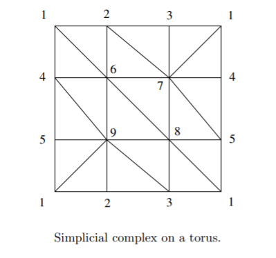

#  CW and Simplicial Complexes

\todo[inline]{Missing a lot on CW complexes}

## Degrees 

## Examples of CW Complexes/Structures 

:::{.example title="Spheres"}
$S^n = e^0 \union e^n$: a point and an $n\dash$cell.
:::

:::{.example title="Real Projective Space"}
$\RP^n = e^1 \cup e^2 \cup \cdots \cup e^n$: one cell in each dimension.
:::

:::{.example title="Complex Projective Space"}
$\mathbb{CP}^n =e^2 \cup e^4 \cup \cdots e^{2n}$
:::

:::{.example title="Surfaces"}

:::

## Examples of Simplicial Complexes

:::{.remark}
To write down a simplicial complex, label the vertices with increasing integers. 
Then each $n$-cell will correspond to a set of $n+1$ of these integers - throw them in a list.
:::

:::{.example title="Torus"}

:::

:::{.example title="Klein Bottle and $\RP^2$"}

:::

:::{.example title="Non-example"}
For counterexamples, note that this fails to be a triangulation of $T$:

This fails - for example, the specification of a simplex $[1,2,1]$ does not uniquely determine a triangle in the this picture.
:::

## Cellular Homology

* $S^n$ has the CW complex structure of 2 $k$-cells for each $0\leq k \leq n$.

How to compute:

1. Write cellular complex $$0 \to C^n \to C^{n-1} \to \cdots C^2 \to C^1 \to C^0 \to 0$$

2. Compute differentials $\del_{i}: C^i \to C^{i-1}$

3. *Note: if $C^0$ is a point, $\del_{1}$ is the zero map.*

4. *Note: $H_{n} X = 0 \iff C^n = \emptyset$.*

5. Compute degrees: Use $\del_{n}(e_{i}^n) = \sum_{i} d_{i} e_{i}^{n-1}$ where $$d_{i} = \deg(\text{Attach }e_{i}^n \to \text{Collapse } X^{n-1}\dash\text{skeleton}),$$ which is a map $S^{n-1} \to S^{n-1}$.

  Alternatively, choose orientations for both spheres. Then pick a point in the target, and look at points in the fiber. Sum them up with a weight of +1 if the orientations match and -1 otherwise.

6. Note that $\ZZ^m \mapsvia{f} \ZZ^n$ has an $n\times m$ matrix

7. Row reduce, image is span of rows with pivots. Kernel can be easily found by taking RREF, padding with zeros so matrix is square and has all diagonals, then reading down diagonal - if a zero is encountered on $n$th element, take that column vector as a basis element with $-1$ substituted in for the $n$th entry.

  For example:
\[
\begin{matrix}
\mathbf1&2&0&2\\0&0&\mathbf1&-1\\0&0&0&\mathbf0
\end{matrix} 
\to
\begin{matrix}
\mathbf1&2&0&2\\0&\mathbf0&0&0\\0&0&\mathbf1&-1\\0&0&0&\mathbf0
\end{matrix}
\begin{matrix}
\mathbf1&2&0&2\\0&\mathbf0&0&0\\0&0&\mathbf1&-1\\0&0&0&\mathbf0
\end{matrix} \\
\ker = 
\begin{matrix}
2\\-1\\0\\0
\end{matrix} 
\begin{matrix}
3\\0\\-1\\-1
\end{matrix}\\
\im = \generators{a+2b+2d,c-d}
.\]
  
6. Or look at elementary divisors, say $n_{i}$, then the image is isomorphic to $\bigoplus n_{i} \ZZ$

## Constructing a CW Complex with Prescribed Homology

Given $G = \bigoplus G_{i}$, and want a space such that $H_{i} X = G$? Construct $X = \bigvee X_{i}$ and then $H_{i} (\bigvee X_{i}) = \bigoplus H_{i} X_{i}$. Reduces problem to: given a group $H$, find a space $Y$ such that $H_{n}(Y) = G$.
By the structure theorem of finitely generated abelian groups, it suffices to know how to do this for $\ZZ$ and $\ZZ/n\ZZ$, since their powers are just obtained by wedging (previous remark).
Recipe:

1. Attach an $e^n$ to a point to get $H_{n} = \ZZ$

2. Attach an $e^{n+1}$ with attaching map of degree $d$ to get $H_{n} = \ZZ_{d}$

## Exercises

:::{.problem title="?"}
Let $X$ be $S^1$ with two 2-cells attached via $z\mapsto z^5$ and $z\mapsto z^3$.

- Compute $\pi_1(X)$ and $H^*(X)$ as a ring.
- Show that $X$ is not homeomorphic to $S^2$.

:::

:::{.solution}
\envlist

- $X$ is path-connected, so $H_0(X) = \ZZ$.
- $X$ is a CW complex with only one 1-cell, so $\pi_1(X^{(1)}) = \ZZ$ for the 1-skeleton.
  - Use that $3\ZZ + 5\ZZ = 1\ZZ$ as a ring, so the attached cells kill off all 1-homotopy and $\pi_1(X) = 1$.
- By Hurewicz, $H_1(X) = 1$.
- By UCT, $H^1(X) = H_1(X)\dual = \Hom_\ZZ(1, \ZZ) = 1$
- By UCT, $H^2(X) = H_2(X)\dual$
- We can compute $H_2$ directly: 
\[
C^*(X) 
= (0 \to C_2(X) \mapsvia{d_2} C_1(X) \mapsvia{d_1} C_0(X) )
= (0 \to \ZZ\adjoin{e_1, e_2} \mapsvia{\substack{e_1\mapsto 3e \\ e_2 \mapsto 5e} } \ZZ\adjoin{e} \mapsvia{d_1} \ZZ\adjoin{\pt} )
.\]
- $\ker d_2 = \gens{ 5e_1, -3e_2 }$, so $H_2 = \ZZ$.
- Thus $H^*(X) = \Extalgebra_\ZZ(x)$ where $\abs{x} = 2$.
- $X\not\cong S^2$: delete a point $p$ in the interior of the 2-cell corresponding to $z^3$, then use that $S^2\sm\ts{\pt} \cong \RR^2$ is contractible but $\pi_1 X\sm\ts{\pt} = \ZZ/5$. 

:::

