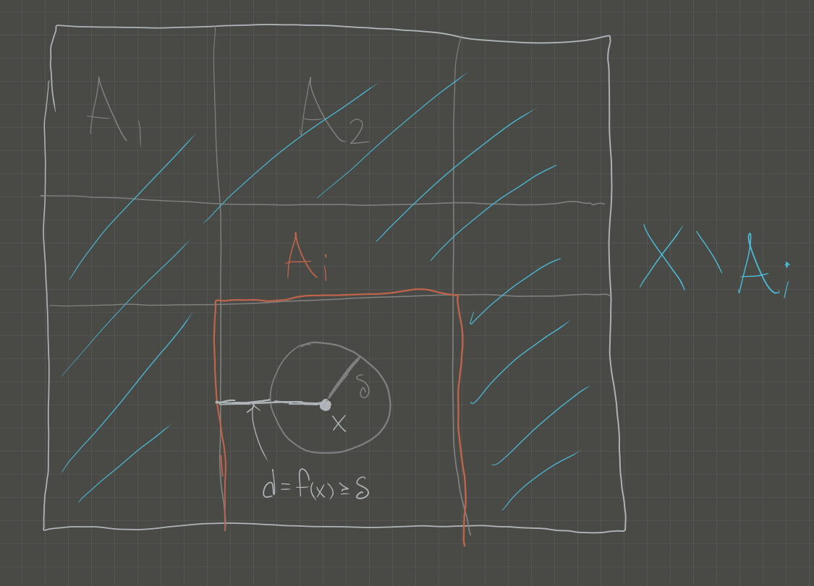
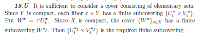

# Definitions

- Closed (several characterizations)
- Bounded
- Compact
- Connectedness: 
  There does not exist a disconnecting set $X = A\disjoint B$ such that $\emptyset \neq A, B \subsetneq$, i.e. $X$ is the union of two proper disjoint nonempty sets.
  Equivalently, $X$ contains no proper nonempty clopen sets.
- Subspace topology
- Retract: A subspace $A \subset X$ is a *retract* of $X$ iff there exists a continuous map $f: X\to A$ such that $f\mid_{A} = \id_A$. Equivalently it is a *left* inverse to the inclusion.

# Theorems

- Closed subsets of Hausdorff spaces are compact? (check)
- Cantor's intersection theorem?
- Tube lemma
- Properties pushed forward through continuous maps:
  - Compactness?
  - Connectedness (when surjective)
  - Separability
  - Density **only when** $f$ is surjective
  - **Not** openness
  - **Not** closedness
- Results that only work for metric spaces
  - ?
- A retract of a Hausdroff/connected/compact space is closed/connected/compact respectively.

# General Topology

## 2

Statement: state the definition of compactness, determine if the sets $\theset{0} \union \theset{1 \over n}, (0, 1]$ are compact.

i.  A topological space $(X, \tau)$ is **compact** if every open cover has a *finite* subcover.
    That is, if $\theset{U_j \suchthat j\in J} \subset \tau$ is a collection of open sets such that $X \subseteq \union_{j\in J} U_j$, then there exists a *finite* subset $J' \subset J$ such that $X \subseteq \union_{j\in J'} U_j$.

ii. Use Heine-Borel theorem: a set $U\subset \RR^n$ is compact $\iff U$ is *closed* and *bounded*.
    - $X$ is closed in $\RR$, since we can write its complement as an arbitrary union of open intervals:
    $$X^c = (-\infty, 0) \union \qty{\union_{n\in \ZZ^+} \qty{{1\over n}, {1\over n+1}} } \union (1, \infty)$$
    - $X$ is *bounded*, since we can pick $r=1$, then $x, y\in X \implies d(x, y) \leq r = 1$.

iii. Use Heine-Borel again: $X$ is not closed because it does not contain all of its limit points, e.g. the sequence $\theset{x_n \definedas {1 \over n} \suchthat n\in \ZZ^{\geq 1}} \subset X$ but $x_n \converges{n\to\infty}\to 0 \in X^c$. Thus is is **not** compact.

### Alternate Proof of (ii)

> See Munkres p.164

- Let $\theset{U_i \suchthat j\in J}\covers X$; then $0\in U_j$ for some $j\in J$.
- In the subspace topology, $U_i$ is given by some $V\in \tau(\RR)$ such that $V\intersect X = U_i$
  - A basis for the subspace topology on $\RR$ is open intervals, so write $V$ as a union of open intervals $V = \union_{k\in K} I_k$.
  - Since $0\in U_j$, $0\in I_k$ for some $k$.
- Since $I_k$ is an interval, it contains infinitely many points of the form $x_n = {1 \over n} \in X$
- Then $I_k \intersect X \subset U_j$ contains infinitely many such points.
- So there are only *finitely* many points in $X\setminus U_j$, each of which is in $U_{j(n)}$ for some $j(n) \in J$ depending on $n$.
- So $U_j$ and the *finitely* many $U_{j(n)}$ form a finite subcover of $X$. $\qed$

## 4

Statement: show that the *Lebesgue number* is well-defined for compact metric spaces.

> Note: this is a question about the *Lebesgue Number*. See Wikipedia for detailed proof.

- Write $U = \theset{U_i \suchthat i\in I}$, then $X \subseteq \union_{i\in I} U_i$. Need to construct a $\delta > 0$.
- By compactness of $X$, choose a finite subcover $U_1, \cdots, U_n$.
- Define the distance between a point $x$ and a set $Y\subset X$: $d(x, Y) = \inf_{y\in Y} d(x, y)$.
  - **Claim**: the function $d(\wait, Y): X\to \RR$ is continuous for a fixed set.
  - Proof: Todo, not obvious.

- Define a function
\begin{align*}
f: X &\to \RR \\
x &\mapsto {1\over n} \sum_{i=1}^n d(x, X\setminus U_i) 
.\end{align*}
  - Note this is a sum of continuous functions and thus continuous.

- **Claim**: $$\delta \definedas \inf_{x\in X}f(x) = \min_{x\in X}f(x) = f(x_{\text{min}}) > 0$$ suffices.
  - That the infimum is a minimum: $f$ is a continuous function on a compact set, apply the extreme value theorem: it attains its minimum.
  - That $\delta > 0$: otherwise, $\delta = 0 \implies \exists x_0$ such that $d(x_0, X\setminus U_i) = 0$ for all $i$.
    - Forces $x_0 \in X\setminus U_i$ for all $i$, but $X\setminus \union U_i = \emptyset$ since the $U_i$ cover $X$.
  - That it satisfies the Lebesgue condition:
  $$\forall x\in X, \exists i \qtext{such that} B_\delta(x) \subset U_i$$
    - Let $B_\delta(x) \ni x$; then by minimality $f(x) \geq \delta$.
    - Thus it can *not* be the case that $d(x, X\setminus U_i) < \delta$ for *every* $i$, otherwise 
    $$f(x) \leq {1\over n}\qty{ \delta + \cdots + \delta} = {n\delta \over n} = \delta$$
    - So there is some particular $i$ such that $d(x, X\setminus U_i) \geq \delta$.
    - But then $B_\delta \subseteq U_i$ as desired.

## 6

Statement: prove that $[0, 1] \subset \RR$ is compact.

### Proof 1 (DZG)

Todo: find a direct proof.

## 8

> Topic: proof of the tube lemma.

Statement: show $X, Y \in \Top_{\cpt} \iff X\cross Y\in \Top_\cpt$

### Proof 1 (DZG)

$\impliedby$:

- By universal properties, the product $X\cross Y$ is equipped with continuous projections
- The continuous image of a compact set is compact, and $\pi_1(X\cross Y) = X, p_2(X\cross Y) = Y$
- So $X, Y$ are compact.

$\implies$:

Proof of Tube Lemma:

- Let $\theset{U_j\cross V_j \suchthat j\in J} \covers X\cross Y$. 
- Fix a point $x_0\in X$, then $\theset{x_0}\cross Y \subset N$ for some open set $N$.
- By the tube lemma, there is a $U^x \subset X$ such that the tube $U^x \cross Y \subset N$.
- Since $\theset{x_0}\cross Y \cong Y$ which is compact, there is a finite subcover $\theset{U_j \cross V_j \suchthat j\leq n} \covers \theset{x_0}\cross Y$. 
-   "Integrate the $X$": write 
    $$W = \intersect_{j=1}^n U_j,$$ 
    then $x_0 \in W$ and $W$ is a finite intersection of open sets and thus open.
- Claim: $\theset{U_j \cross V_j \suchthat j\leq n}\covers W\cross Y$
  - Let $(x, y) \in W\cross Y$; want to show $(x, y)\in U_j \cross V_j$ for some $j\leq n$.
  - Then $(x_0, y) \in \theset{x_0}\cross Y$ is on the same horizontal line
  - $(x_0, y)\in U_j \cross V_j$ for some $j$ by construction
  - So $y\in V_j$ for this $j$
  - Since $x\in W$, $x\in U_j$ for *every* $j$, thus $x\in U_j$.
  - So $(x, y) \in U_j \cross V_j$

Actual Proof:

- Let $\theset{U_j \suchthat j\in J} \covers X\cross Y$. 
- Fix $x_0\in X$, the slice $\theset{x_0} \cross Y$ is compact and can be covered by finitely many elements $\theset{U_j\suchthat j\leq m} \covers \theset{x_0} \cross Y$.
  - Sum: write $N = \union_{j=1}^m U_j$; then $\theset{x_0} \cross Y \subset N$.
  - Apply the tube lemma to $N$: produce $\theset{x_0} \cross Y \in W\cross Y \subset N$; then $\theset{U_j \suchthat j\leq m}\covers W\cross Y$.
- Now let $x\in X$ vary: for each $x\in X$, produce $W_x \cross Y$ as above, then $\theset{W_x\cross Y\suchthat x\in X}\covers X$. 
  - By above argument, every tube $W_x \cross Y$ can be covered by *finitely* many $U_j$.
- Since $\theset{W_x\suchthat x\in X}\covers X$ and $X$ is compact, produce a finite subset $\theset{W_k \suchthat k\leq m'} \covers X$. 
- Then $\theset{W_k\cross Y\suchthat k\leq m'} \covers X\cross Y$; the claim is that it is a finite cover.
  - Finitely many $k$
  - For each $k$, the tube $W_k \cross Y$ is covered by finitely by $U_j$
  - And finite $\times$ finite = finite. $\qed$

Shorter mnemonic:

# 10

$X$ is connected:

- Write $X = L\disjoint G$ where $L = \theset{0} \cross [-1, 1]$ and $G = \theset{\Gamma(\sin(x)) \suchthat x\in (0, 1]}$ is the graph of $\sin(x)$.
- $L \cong [0, 1]$ which is connected
  - Claim: Every interval is connected (todo)
- Claim: $G$ is connected 
  - The function 
  \begin{align*}
  f: (0, 1] &\to [-1, 1] \\
  x &\mapsto \sin(x)
  \end{align*}
  is continuous (how to prove?)
  - Claim: The diagonal map $\Delta: Y\to Y\cross Y$ where $\Delta(t) = (t, t)$ is continuous for any $Y$ since $\Delta = (\id, \id)$
  - The composition of continuous function is continuous
  - So the composition is continuous:
  \begin{align*}
  F : (0, 1] &\mapsvia{\Delta} (0, 1]^2 \mapsvia{(\id, f)} (0, 1] \cross [-1, 1]  \\
  t &\mapsto (t, t) \mapsto (t, f(t))
  \end{align*}
  - Then $G = F((0, 1])$ is the continuous image of a connected set and thus connected.

- Claim: $X$ is connected
  - Suppose there is a disconnecting cover $X = A\disjoint B$ such that $\bar A \intersect B = A\intersect \bar B = \emptyset$ and $A, B \neq \emptyset$.
  - WLOG suppose $(x, \sin(x))\in B$ for $x>0$.
  - Claim: $B = G$
    - It can't be the case that $A$ intersects $G$: otherwise $X = A\disjoint B \implies G = (A\intersect G) \disjoint (B \intersect V)$ disconnects $G$. 
      So $A\intersect G = \emptyset$, forcing $A \subseteq L$
    - Similarly $L$ can not be disconnected, so $B\intersect L = \emptyset$ forcing $B \subset G$
    - So $A \subset L$ and $B\subset G$, and since $X = A\disjoint B$, this forces $A = L$ and $B = G$.
  - But any open set $U$ in the subspace topology $L\subset \RR^2$ (generated by open balls) containing $(0, 0) \in L$ is the restriction of a ball $V \subset \RR^2$ of positive radius $r>0$, i.e. $U = V \intersect X$. 
    - But any such ball contains points of $G$: namely take $n$ large enough such that ${1 \over n\pi} < r$.
    - So $U \intersect L \intersect G \neq \emptyset$, contradicting $L\intersect G = \emptyset$.

# 12

- Using the fact that $[0, \infty) \subset \RR$ is Hausdorff, any retract must be closed, so any closed interval $[\eps, N]$ for $0\leq \eps \leq N \leq \infty$. 
  - Note that $\eps = N$ yields all one point sets $\theset{x_0}$ for $x_0 \geq 0$.
- No finite discrete sets occur, since the retract of a connected set is connected.
- ?

# 14

- Take two connected sets $X, Y$; then there exists $p\in X\intersect Y$.
- Write $X\union Y = A \disjoint B$ with both $A, B \subset A\disjoint B$ open.
-   Since $p\in X \union Y = A\disjoint B$, WLOG $p\in A$. 
    We will show $B$ must be empty.
- Claim: $A\intersect X$ is clopen in $X$.
  - $A\intersect X$ is open in $X$: ?
  - $A\intersect X$ is closed in $X$: ?
- The only clopen sets of a connected set are empty or the entire thing, and since $p\in A$, we must have $A\intersect X = X$.
- By the same argument, $A\intersect Y = Y$.
- So $A\intersect \qty{X\union Y} = \qty{A\intersect X} \union \qty{A\intersect Y} = X\union Y$
- Since $A\subset X\union Y$, $A\intersect \qty{X\union Y} = A$
- Thus $A = X\union Y$, forcing $B = \emptyset$.

