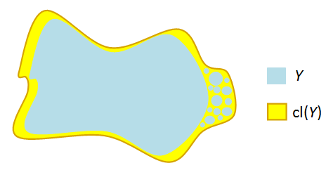

# Problems to Revisit

- 4
- 6 (Without Heine-Borel)
- 8
- 10
- 11
- 14

# Definitions

- Hausdorff
- Second Countable: admits a countable basis.
- Closed (several characterizations)
 - Closure in a subspace: $Y\subset X \implies \cl_Y(A) \definedas \cl_X(A)\intersect Y$.
- Bounded
- Compact:
    A topological space $(X, \tau)$ is **compact** if every open cover has a *finite* subcover.
    That is, if $\theset{U_j \suchthat j\in J} \subset \tau$ is a collection of open sets such that $X \subseteq \union_{j\in J} U_j$, then there exists a *finite* subset $J' \subset J$ such that $X \subseteq \union_{j\in J'} U_j$.

- Locally compact
  For every $x\in X$, there exists a $K_x \ni x$ such that $K_x$ is compact.
- Connected: 
  There does not exist a disconnecting set $X = A\disjoint B$ such that $\emptyset \neq A, B \subsetneq$, i.e. $X$ is the union of two proper disjoint nonempty sets.
  Equivalently, $X$ contains no proper nonempty clopen sets.
  - Additional condition for a subspace $Y\subset X$: $\cl_Y(A) \intersect V = A \intersect \cl_Y(B) = \emptyset$.
- Locally connected:
  A space is locally connected at a point $x$ iff $\forall N_x \ni x$, there exists a $U\subset N_x$ containing $x$ that is connected.
  
- Retract: A subspace $A \subset X$ is a *retract* of $X$ iff there exists a continuous map $f: X\to A$ such that $f\mid_{A} = \id_A$. Equivalently it is a *left* inverse to the inclusion.
- Uniform Continuity: For $f: (X, d_x) \to (Y, d_Y)$ metric spaces,
\begin{align*}
\forall \eps > 0, ~\exists \delta > 0 \text{ such that } \quad d_X(x_1, x_2) < \delta \implies d_Y(f(x_1), f(x_2)) < \eps
.\end{align*} 
- Lebesgue number: For $(X, d)$ a compact metric space and $\theset{U_\alpha}\covers X$, there exist $\delta_L > 0$ such that 
\begin{align*}
A\subset X, ~ \diam(A) < \delta_L \implies A\subseteq U_\alpha \text{ for some } \alpha
.\end{align*}
- Paracompact
- Components: 
  Set $x\sim y$ iff there exists a connected set $U\ni x, y$ and take equivalence classes
- Path Components:
  Set $x\sim y$ iff there exists a path-connected set $U\ni x, y$ and take equivalence classes
- Separable: countable dense subset.
- Limit Point:
    For $A\subset X$, $x$ is a limit point of $A$ if every punctured neighborhood $P_x$ of $x$ satisfies $P_x \intersect A \neq \emptyset$, i.e. every neighborhood of $x$ intersects $A$ in some point other than $x$ itself.
    Equivalently, $x$ is a limit point of $A$ iff $x\in \cl_X(A\setminus\theset{x})$.

# Theorems

- Closed subsets of Hausdorff spaces are compact? (check)
- Cantor's intersection theorem?
- Tube lemma
- Properties pushed forward through continuous maps:
  - Compactness?
  - Connectedness (when surjective)
  - Separability
  - Density **only when** $f$ is surjective
  - **Not** openness
  - **Not** closedness
- Results that only work for metric spaces
  - ?
- A retract of a Hausdroff/connected/compact space is closed/connected/compact respectively.
- A continuous function on a compact set is uniformly continuous.
  - Proof: take $\theset{B_{\eps \over 2}(y) \suchthat y\in Y}\covers Y$, pull back to an open cover of $X$, has Lebesgue number $\delta_L > 0$, then $x' \in B_{\delta_L}(x) \implies f(x), f(x') \in B_{\eps \over 2}(y)$ for some $y$. 
- Lipschitz continuity implies uniform continuity (take $\delta = \eps/C$)
  - Counterexample to converse: $f(x) = \sqrt x$ on $[0, 1]$ has unbounded derivative.
- Extreme Value Theorem: for $f:X \to Y$ continuous with $X$ compact and $Y$ ordered in the order topology, there exist points $c, d\in X$ such that $f(x) \in [f(c), f(d)]$ for every $x$.

# Sandbox of Spaces

- Finite discrete sets with the discrete topology 
- Subspaces of $\RR$: $(a, b), (a, b], (a, \infty)$, etc.
  - $\ts{0} \union \ts{1 \over n\suchthat n\in \ZZ^{\geq 1}}$
- $\QQ$
- The topologist's sine curve
- One-point compactifications
- $\RR^\omega$

Alternative topologies to consider:

- Cofinite
- Discrete and Indiscrete
- Uniform

# General Topology

## 2

i.  See definition section.

ii. Use Heine-Borel theorem: a set $U\subset \RR^n$ is compact $\iff U$ is *closed* and *bounded*.
    - $X$ is closed in $\RR$, since we can write its complement as an arbitrary union of open intervals:
    $$X^c = (-\infty, 0) \union \qty{\union_{n\in \ZZ^+} \qty{{1\over n}, {1\over n+1}} } \union (1, \infty)$$
    - $X$ is *bounded*, since we can pick $r=1$, then $x, y\in X \implies d(x, y) \leq r = 1$.

iii. Use Heine-Borel again: $X$ is not closed because it does not contain all of its limit points, e.g. the sequence $\theset{x_n \definedas {1 \over n} \suchthat n\in \ZZ^{\geq 1}} \subset X$ but $x_n \converges{n\to\infty}\to 0 \in X^c$. Thus is is **not** compact.

### Alternate Proof of (ii)

> See Munkres p.164

- Let $\theset{U_i \suchthat j\in J}\covers X$; then $0\in U_j$ for some $j\in J$.
- In the subspace topology, $U_i$ is given by some $V\in \tau(\RR)$ such that $V\intersect X = U_i$
  - A basis for the subspace topology on $\RR$ is open intervals, so write $V$ as a union of open intervals $V = \union_{k\in K} I_k$.
  - Since $0\in U_j$, $0\in I_k$ for some $k$.
- Since $I_k$ is an interval, it contains infinitely many points of the form $x_n = {1 \over n} \in X$
- Then $I_k \intersect X \subset U_j$ contains infinitely many such points.
- So there are only *finitely* many points in $X\setminus U_j$, each of which is in $U_{j(n)}$ for some $j(n) \in J$ depending on $n$.
- So $U_j$ and the *finitely* many $U_{j(n)}$ form a finite subcover of $X$. $\qed$

## 4

Statement: show that the *Lebesgue number* is well-defined for compact metric spaces.

> Note: this is a question about the *Lebesgue Number*. See Wikipedia for detailed proof.

- Write $U = \theset{U_i \suchthat i\in I}$, then $X \subseteq \union_{i\in I} U_i$. Need to construct a $\delta > 0$.
- By compactness of $X$, choose a finite subcover $U_1, \cdots, U_n$.
- Define the distance between a point $x$ and a set $Y\subset X$: $d(x, Y) = \inf_{y\in Y} d(x, y)$.
  - **Claim**: the function $d(\wait, Y): X\to \RR$ is continuous for a fixed set.
  - Proof: Todo, not obvious.

- Define a function
\begin{align*}
f: X &\to \RR \\
x &\mapsto {1\over n} \sum_{i=1}^n d(x, X\setminus U_i) 
.\end{align*}
  - Note this is a sum of continuous functions and thus continuous.

- **Claim**: $$\delta \definedas \inf_{x\in X}f(x) = \min_{x\in X}f(x) = f(x_{\text{min}}) > 0$$ suffices.
  - That the infimum is a minimum: $f$ is a continuous function on a compact set, apply the extreme value theorem: it attains its minimum.
  - That $\delta > 0$: otherwise, $\delta = 0 \implies \exists x_0$ such that $d(x_0, X\setminus U_i) = 0$ for all $i$.
    - Forces $x_0 \in X\setminus U_i$ for all $i$, but $X\setminus \union U_i = \emptyset$ since the $U_i$ cover $X$.
  - That it satisfies the Lebesgue condition:
  $$\forall x\in X, \exists i \qtext{such that} B_\delta(x) \subset U_i$$
    - Let $B_\delta(x) \ni x$; then by minimality $f(x) \geq \delta$.
    - Thus it can *not* be the case that $d(x, X\setminus U_i) < \delta$ for *every* $i$, otherwise 
    $$f(x) \leq {1\over n}\qty{ \delta + \cdots + \delta} = {n\delta \over n} = \delta$$
    - So there is some particular $i$ such that $d(x, X\setminus U_i) \geq \delta$.
    - But then $B_\delta \subseteq U_i$ as desired.

## 6

Statement: prove that $[0, 1] \subset \RR$ is compact.

### Proof 1: Direct (DZG)

- Let $I = [0, 1] = A\union B$ be a disconnection, so
  - $A, B \neq \emptyset$
  - $A \disjoint B = I$
  - $\cl_I(A) \intersect B = A \intersect \cl_I(B) = \emptyset$.
- Let $a\in A$ and $b\in B$ where WLOG $a<b$ (since either $a<b$ or $b<a$, and $a\neq b$ since $A, B$ are disjoint)
- Let $K = [a, b]$ and define $A_K \definedas A\intersect K$ and $B_K \definedas B\intersect K$.
- Now $A_K, B_K$ is a disconnection of $K$.
- Let $s = \sup(A_K)$, which exists since $\RR$ is complete and has the LUB property
- Claim: $s \in \cl_I(A_K)$. Proof:
  - If $s\in A_K$ there's nothing to show since $A_K \subset \cl_I(A_K)$, so assume $s\in I\setminus A_K$.
  - Now let $N_s$ be an arbitrary neighborhood of $s$, then using ??? we can find an $\eps>0$ such that $B_\eps(s) \subset N_s$
  - Since $s$ is a supremum, there exists an $a\in A_K$ such that $s-\eps < a$.
  - But then $a \in B_\eps(s)$ and $a\in N_s$ with $a\neq s$.
  - Since $N_s$ was arbitrary, every $N_s$ contains a point of $A_K$ not equal to $s$, so $s$ is a limit point by definition.
- Since $s\in \cl_I(A_K)$ and $\cl_I(A_K)\intersect B_K = \emptyset$, we have $s\not \in B_K$.
- Then the subinterval $(x, b] \intersect A_K = \emptyset$ for every $x>c$ since $c \definedas \sup A_K$.
- But since $A_K \disjoint B_K = K$, we must have $(x, b] \subset B_K$, and thus $s\in \cl_I(B_K)$.
- Since $A_K, B_K$ were assumed disconnecting, $s\not \in A_K$
- But then $s\in K$ but $s\not\in A_K \disjoint B_K = K$, a contradiction.

## 8

> Topic: proof of the tube lemma.

Statement: show $X, Y \in \Top_{\cpt} \iff X\cross Y\in \Top_\cpt$

### Proof 1 (DZG)

$\impliedby$:

- By universal properties, the product $X\cross Y$ is equipped with continuous projections
- The continuous image of a compact set is compact, and $\pi_1(X\cross Y) = X, p_2(X\cross Y) = Y$
- So $X, Y$ are compact.

$\implies$:

Proof of Tube Lemma:

- Let $\theset{U_j\cross V_j \suchthat j\in J} \covers X\cross Y$. 
- Fix a point $x_0\in X$, then $\theset{x_0}\cross Y \subset N$ for some open set $N$.
- By the tube lemma, there is a $U^x \subset X$ such that the tube $U^x \cross Y \subset N$.
- Since $\theset{x_0}\cross Y \cong Y$ which is compact, there is a finite subcover $\theset{U_j \cross V_j \suchthat j\leq n} \covers \theset{x_0}\cross Y$. 
-   "Integrate the $X$": write 
    $$W = \intersect_{j=1}^n U_j,$$ 
    then $x_0 \in W$ and $W$ is a finite intersection of open sets and thus open.
- Claim: $\theset{U_j \cross V_j \suchthat j\leq n}\covers W\cross Y$
  - Let $(x, y) \in W\cross Y$; want to show $(x, y)\in U_j \cross V_j$ for some $j\leq n$.
  - Then $(x_0, y) \in \theset{x_0}\cross Y$ is on the same horizontal line
  - $(x_0, y)\in U_j \cross V_j$ for some $j$ by construction
  - So $y\in V_j$ for this $j$
  - Since $x\in W$, $x\in U_j$ for *every* $j$, thus $x\in U_j$.
  - So $(x, y) \in U_j \cross V_j$

Actual Proof:

- Let $\theset{U_j \suchthat j\in J} \covers X\cross Y$. 
- Fix $x_0\in X$, the slice $\theset{x_0} \cross Y$ is compact and can be covered by finitely many elements $\theset{U_j\suchthat j\leq m} \covers \theset{x_0} \cross Y$.
  - Sum: write $N = \union_{j=1}^m U_j$; then $\theset{x_0} \cross Y \subset N$.
  - Apply the tube lemma to $N$: produce $\theset{x_0} \cross Y \in W\cross Y \subset N$; then $\theset{U_j \suchthat j\leq m}\covers W\cross Y$.
- Now let $x\in X$ vary: for each $x\in X$, produce $W_x \cross Y$ as above, then $\theset{W_x\cross Y\suchthat x\in X}\covers X$. 
  - By above argument, every tube $W_x \cross Y$ can be covered by *finitely* many $U_j$.
- Since $\theset{W_x\suchthat x\in X}\covers X$ and $X$ is compact, produce a finite subset $\theset{W_k \suchthat k\leq m'} \covers X$. 
- Then $\theset{W_k\cross Y\suchthat k\leq m'} \covers X\cross Y$; the claim is that it is a finite cover.
  - Finitely many $k$
  - For each $k$, the tube $W_k \cross Y$ is covered by finitely by $U_j$
  - And finite $\times$ finite = finite. $\qed$

Shorter mnemonic:

## 10

$X$ is connected:

- Write $X = L\disjoint G$ where $L = \theset{0} \cross [-1, 1]$ and $G = \theset{\Gamma(\sin(x)) \suchthat x\in (0, 1]}$ is the graph of $\sin(x)$.
- $L \cong [0, 1]$ which is connected
  - Claim: Every interval is connected (todo)
- Claim: $G$ is connected 
  - The function 
  \begin{align*}
  f: (0, 1] &\to [-1, 1] \\
  x &\mapsto \sin(x)
  \end{align*}
  is continuous (how to prove?)
  - Claim: The diagonal map $\Delta: Y\to Y\cross Y$ where $\Delta(t) = (t, t)$ is continuous for any $Y$ since $\Delta = (\id, \id)$
  - The composition of continuous function is continuous
  - So the composition is continuous:
  \begin{align*}
  F : (0, 1] &\mapsvia{\Delta} (0, 1]^2 \mapsvia{(\id, f)} (0, 1] \cross [-1, 1]  \\
  t &\mapsto (t, t) \mapsto (t, f(t))
  \end{align*}
  - Then $G = F((0, 1])$ is the continuous image of a connected set and thus connected.

- Claim: $X$ is connected
  - Suppose there is a disconnecting cover $X = A\disjoint B$ such that $\bar A \intersect B = A\intersect \bar B = \emptyset$ and $A, B \neq \emptyset$.
  - WLOG suppose $(x, \sin(x))\in B$ for $x>0$.
  - Claim: $B = G$
    - It can't be the case that $A$ intersects $G$: otherwise $X = A\disjoint B \implies G = (A\intersect G) \disjoint (B \intersect V)$ disconnects $G$. 
      So $A\intersect G = \emptyset$, forcing $A \subseteq L$
    - Similarly $L$ can not be disconnected, so $B\intersect L = \emptyset$ forcing $B \subset G$
    - So $A \subset L$ and $B\subset G$, and since $X = A\disjoint B$, this forces $A = L$ and $B = G$.
  - But any open set $U$ in the subspace topology $L\subset \RR^2$ (generated by open balls) containing $(0, 0) \in L$ is the restriction of a ball $V \subset \RR^2$ of positive radius $r>0$, i.e. $U = V \intersect X$. 
    - But any such ball contains points of $G$: namely take $n$ large enough such that ${1 \over n\pi} < r$.
    - So $U \intersect L \intersect G \neq \emptyset$, contradicting $L\intersect G = \emptyset$.

## 12

- Using the fact that $[0, \infty) \subset \RR$ is Hausdorff, any retract must be closed, so any closed interval $[\eps, N]$ for $0\leq \eps \leq N \leq \infty$. 
  - Note that $\eps = N$ yields all one point sets $\theset{x_0}$ for $x_0 \geq 0$.
- No finite discrete sets occur, since the retract of a connected set is connected.
- ?

## 14

- Take two connected sets $X, Y$; then there exists $p\in X\intersect Y$.
- Write $X\union Y = A \disjoint B$ with both $A, B \subset A\disjoint B$ open.
-   Since $p\in X \union Y = A\disjoint B$, WLOG $p\in A$. 
    We will show $B$ must be empty.
- Claim: $A\intersect X$ is clopen in $X$.
  - $A\intersect X$ is open in $X$: ?
  - $A\intersect X$ is closed in $X$: ?
- The only clopen sets of a connected set are empty or the entire thing, and since $p\in A$, we must have $A\intersect X = X$.
- By the same argument, $A\intersect Y = Y$.
- So $A\intersect \qty{X\union Y} = \qty{A\intersect X} \union \qty{A\intersect Y} = X\union Y$
- Since $A\subset X\union Y$, $A\intersect \qty{X\union Y} = A$
- Thus $A = X\union Y$, forcing $B = \emptyset$.

## 16

> Topic: closure and connectedness in the subspace topology.
> See Munkres p.148

- $S\subset X$ is **not ** connected if $S$ with the subspace topology is not connected.
  - I.e. there exist $A, B \subset S$ such that 
    - $A, B \neq \emptyset$,
    - $A\intersect B = \emptyset$,
    - $A \disjoint B = S$.
- Or equivalently, there exists a nontrivial $A\subset S$ that is clopen in $S$.

Show stronger statement: this is an iff.

$\implies$:

- Suppose $S$ is not connected; we then have sets $A \union B = S$ from above and it suffices to show $\cl_Y(A) \intersect B = A \intersect \cl_X(B) = \emptyset$. 
- $A$ is open by assumption and $Y\setminus A = B$ is closed in $Y$, so $A$ is clopen.
- Write $\cl_Y(A) \definedas \cl_X(A) \intersect Y$.
- Since $A$ is closed in $Y$, $A = \cl_Y(A)$ by definition, so $A = \cl_Y(A) = \cl_X(A) \intersect Y$.
- Since $A\intersect B = \emptyset$, we then have $\cl_Y(A) \intersect B = \emptyset$.
- The same argument applies to $B$, so $\cl_Y(B) \intersect A = \emptyset$.

$\impliedby$:

- Suppose displayed condition holds; given such $A, B$ we will show they are clopen in $Y$.
- Since $\cl_Y(A) \intersect B = \emptyset$, (claim) we have $\cl_Y(A) = A$ and thus $A$ is closed in $Y$.
  - Why?
  \begin{align*}
  \cl_Y(A) &\definedas \cl_X(A) \intersect Y \\ 
  &= \cl_X(A) \intersect \qty{A\disjoint B} \\ 
  &= \qty{\cl_X(A) \intersect A} \disjoint \qty{\cl_X(A) \intersect B} \\
  &= A  \disjoint \qty{\cl_X(A) \intersect B} 
  \quad\text{since } A \subset \cl_Y(A) \\
  &= A \disjoint \qty{\cl_Y(A) \intersect B} 
  \quad \text{since } B \subset Y \\
  &= A \disjoint \emptyset \quad\text{using the assumption} \\
  &= A
  .\end{align*}
- But $A = Y\setminus B$ where $B$ is closed, so $A$ is open and thus a nontrivial clopen subset.

$\qed$

## 18

- Define a new function
\begin{align*}
g: X \to \RR \\
x &\mapsto d_X(x, f(x))
.\end{align*}

- Attempt to minimize. Claim: $g$ is a continuous function.
- Given claim, a continuous function on a compact space attains its infimum, so set 
    \begin{align*}
    m \definedas \inf_{x\in X} g(x) 
    \end{align*} 
    and produce $x_0\in X$ such that $g(x) = m$.
- Then 
  \begin{align*}
  m> 0 \iff d(x_0, f(x_0)) > 0 \iff x_0 \neq f(x_0)
  .\end{align*} 
- Now apply $f$ and use the assumption that $f$ is a contraction to contradict minimality of $m$:
\begin{align*}
d(f(f(x_0)), f(x_0)) 
&\leq C\cdot d(f(x_0), x_0) \\ 
&< d(f(x_0), x_0) \quad\text{since } C<1\\
&\leq m
\end{align*}

- Proof that $g$ is continuous: use the definition of $g$, the triangle inequality, and that $f$ is a contraction:
\begin{align*}
d(x, f(x)) &\leq d(x, y) + d(y, f(y)) + d(f(x), f(y)) \\
\implies d(x, f(x)) - d(y, f(y)) &\leq d(x, y) + d(f(x), f(y)) \\
\implies g(x) - g(y) &\leq d(x, y) + C\cdot d(x, y)  = (C+1) \cdot d(x, y)\\
\end{align*}
  - This shows that $g$ is Lipschitz continuous with constant $C+1$ (implies uniformly continuous, but not used).

## 20

| Space                  | Connected  | Locally Connected |
| ------                 | ---------  | ----------------- |
| $\RR$                  | \checkmark | \checkmark        |
| $[0, 1] \union [2, 3]$ |            | \checkmark        |
| Sine Curve             | \checkmark |                   |
| $\QQ$                  |            |                   |

a. See definitions in intro.

b. Claim: the Topologist's sine curve $X$ suffices.

Proof:

- Claim 1: $X$ is connected.
  - Intervals and graphs of cts functions are connected, so the only problem point is $0$.
- Claim 2: $X$ is **not** locally path connected.
    - Take any $B_\eps(0) \in \RR^2$; then $\pi_X B_\eps(0)$ yields infinitely many arcs, each intersecting the graph at two points on $\bd B_\eps(0)$.
    - These are homeomorphic to a collection of disjoint embedded open intervals, and any disjoint union of intervals is clearly not connected.
$\qed$

Todo: what's the picture?

  

