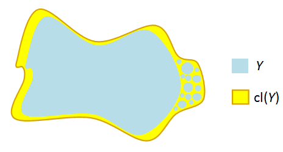

---
title: "Solutions to Mike's Compendium of Problems"
---

# Point-Set 

## 2

> See Munkres p.164, especially for (ii).

i.  See definitions in review doc.

ii. Direct proof: 

  - Let $\theset{U_i \suchthat j\in J}\covers X$; then $0\in U_j$ for some $j\in J$.
  - In the subspace topology, $U_i$ is given by some $V\in \tau(\RR)$ such that $V\intersect X = U_i$
    - A basis for the subspace topology on $\RR$ is open intervals, so write $V$ as a union of open intervals $V = \union_{k\in K} I_k$.
    - Since $0\in U_j$, $0\in I_k$ for some $k$.
  - Since $I_k$ is an interval, it contains infinitely many points of the form $x_n = {1 \over n} \in X$
  - Then $I_k \intersect X \subset U_j$ contains infinitely many such points.
  - So there are only *finitely* many points in $X\setminus U_j$, each of which is in $U_{j(n)}$ for some $j(n) \in J$ depending on $n$.
  - So $U_j$ and the *finitely* many $U_{j(n)}$ form a finite subcover of $X$. $\qed$

iii. Todo: Need direct proof. 

## 4

Statement: show that the *Lebesgue number* is well-defined for compact metric spaces.

> Note: this is a question about the *Lebesgue Number*. See Wikipedia for detailed proof.

- Write $U = \theset{U_i \suchthat i\in I}$, then $X \subseteq \union_{i\in I} U_i$. Need to construct a $\delta > 0$.
- By compactness of $X$, choose a finite subcover $U_1, \cdots, U_n$.
- Define the distance between a point $x$ and a set $Y\subset X$: $d(x, Y) = \inf_{y\in Y} d(x, y)$.
  - **Claim**: the function $d(\wait, Y): X\to \RR$ is continuous for a fixed set.
  - Proof: Todo, not obvious.

- Define a function
\begin{align*}
f: X &\to \RR \\
x &\mapsto {1\over n} \sum_{i=1}^n d(x, X\setminus U_i) 
.\end{align*}
  - Note this is a sum of continuous functions and thus continuous.

- **Claim**: $$\delta \definedas \inf_{x\in X}f(x) = \min_{x\in X}f(x) = f(x_{\text{min}}) > 0$$ suffices.
  - That the infimum is a minimum: $f$ is a continuous function on a compact set, apply the extreme value theorem: it attains its minimum.
  - That $\delta > 0$: otherwise, $\delta = 0 \implies \exists x_0$ such that $d(x_0, X\setminus U_i) = 0$ for all $i$.
    - Forces $x_0 \in X\setminus U_i$ for all $i$, but $X\setminus \union U_i = \emptyset$ since the $U_i$ cover $X$.
  - That it satisfies the Lebesgue condition:
  $$\forall x\in X, \exists i \qtext{such that} B_\delta(x) \subset U_i$$
    - Let $B_\delta(x) \ni x$; then by minimality $f(x) \geq \delta$.
    - Thus it can *not* be the case that $d(x, X\setminus U_i) < \delta$ for *every* $i$, otherwise 
    $$f(x) \leq {1\over n}\qty{ \delta + \cdots + \delta} = {n\delta \over n} = \delta$$
    - So there is some particular $i$ such that $d(x, X\setminus U_i) \geq \delta$.
    - But then $B_\delta \subseteq U_i$ as desired.

## 6

> Facts used: 
>
> - Cantor's Intersection Theorem
> - Bases for standard topology on $\RR$.
> - Definition of compactness

- Toward a contradiction, let $\theset{U_\alpha} \covers [0, 1]$ be an open cover with no finite subcover.
- Then either $[0, {1\over 2}]$ or $[{1\over 2}, 1]$ has no finite subcover; WLOG assume it is $[0, {1\over 2}]$.
- Then either $[0, {1\over 4}]$ or $[{1\over 4}, {1\over 2}]$ has no finite subcover
- Inductively defining $[a_n, b_n]$ this way yields a sequence of closed, bounded, nested intervals (each with no finite subcover) with $\diam([a_n, b_n]) \leq {1 \over 2^n} \to 0$, so Cantor's Nested Interval theorem applies and the intersection contains exactly one point $p \in [0, 1]$.
- Since $p\in [0, 1]$, $p\in U_\alpha$ for some $\alpha$.
- Since a basis for $\tau(\RR)$ is given by open intervals, we can find an $\eps>0$ such that $(p-\eps, p+\eps) \subseteq U_\alpha$
- Then if ${1\over 2^N} < \eps$, for $n\geq N$ we have $$[a_n, b_n] \subseteq (p-\eps, p+\eps) \subseteq U_\alpha.$$
- But then $U_\alpha \covers [a_n, b_n]$, yielding a finite subcover of $[a_n, b_n]$, a contradiction.

## 8

> Topic: proof of the tube lemma.

Statement: show $X, Y \in \Top_{\cpt} \iff X\cross Y\in \Top_\cpt$

### Proof 1

$\impliedby$:

- By universal properties, the product $X\cross Y$ is equipped with continuous projections
- The continuous image of a compact set is compact, and $\pi_1(X\cross Y) = X, p_2(X\cross Y) = Y$
- So $X, Y$ are compact.

$\implies$:

- Let $\theset{U_j \suchthat j\in J} \covers X\cross Y$. 
- Fix $x_0\in X$, the slice $\theset{x_0} \cross Y$ is compact and can be covered by finitely many elements $\theset{U_j\suchthat j\leq m} \covers \theset{x_0} \cross Y$.
  - Sum: write $N = \union_{j=1}^m U_j$; then $\theset{x_0} \cross Y \subset N$.
  - Apply the tube lemma to $N$: produce $\theset{x_0} \cross Y \in W\cross Y \subset N$; then $\theset{U_j \suchthat j\leq m}\covers W\cross Y$.
- Now let $x\in X$ vary: for each $x\in X$, produce $W_x \cross Y$ as above, then $\theset{W_x\cross Y\suchthat x\in X}\covers X$. 
  - By above argument, every tube $W_x \cross Y$ can be covered by *finitely* many $U_j$.
- Since $\theset{W_x\suchthat x\in X}\covers X$ and $X$ is compact, produce a finite subset $\theset{W_k \suchthat k\leq m'} \covers X$. 
- Then $\theset{W_k\cross Y\suchthat k\leq m'} \covers X\cross Y$; the claim is that it is a finite cover.
  - Finitely many $k$
  - For each $k$, the tube $W_k \cross Y$ is covered by finitely by $U_j$
  - And finite $\times$ finite = finite. $\qed$

Shorter mnemonic:

### Proof 2

Let $\pi_X, \pi_Y$ denote the canonical projections, which we can note are continuous and preserve open sets.

$\implies$:
Suppose $X\cross Y$ is compact, and let $\theset{U_\alpha}, \theset{V_\beta}$ be open covers of $X$ and $Y$ respectively.

Let $T_{\alpha\beta} = U_\alpha \cross V_\beta$; then $\theset{T_{\alpha\beta}}$ is an open cover of $X\cross Y$.
So there is a finite subcover $\theset{T_{ij}}$, $\theset{\pi_X(T_{ij})}$ is an open cover of $X$, and similarly for $Y$.
So both $X,Y$ are compact.

$\impliedby$:
Suppose $X$ and $Y$ are compact, and let $U_\alpha \rightrightarrows X\cross Y$ be an open cover.
Let $\pi_Y: X\cross Y \to Y$ be the canonical projection; then $\theset{\pi_Y(U_\alpha)}\rightrightarrows Y$ and by compactness of $Y$ there is a finite subcover of the form $\theset{\pi_Y(U_i) \suchthat 1\leq i \leq n}$.
Then $\theset{V_{x, i} \definedas \theset{x} \cross U_i}$ is an open cover of $\theset{x} \cross Y$ for any fixed $x$. 

So if we fix an $x\in X$, we can let $V_{x, i} \rightrightarrows \theset{x} \cross Y$ be any finite subcollection covering this slice.
By the Tube Lemma, there is an open set $W_x$ such that $\theset{x} \cross Y \subset W_x \cross Y \subset \union V_{x, i} = \theset{x} \cross Y$.

Then $\theset{W_x} \rightrightarrows X$ as $x$ varies is an open cover of $X$, and by compactness of $X$, there are finitely many $x_j \in X$ such that $W_{x_j} \rightrightarrows X$.
But then $X \cross Y = \union_{j} W_{x_j} \cross Y = \union_j \union_i W_{x_j} \cross V_{x_j, i} \subset \union_\alpha U_\alpha$ is a finite cover.

### Proof of Tube Lemma (Todo: Check)

Proof of Tube Lemma:

- Let $\theset{U_j\cross V_j \suchthat j\in J} \covers X\cross Y$. 
- Fix a point $x_0\in X$, then $\theset{x_0}\cross Y \subset N$ for some open set $N$.
- By the tube lemma, there is a $U^x \subset X$ such that the tube $U^x \cross Y \subset N$.
- Since $\theset{x_0}\cross Y \cong Y$ which is compact, there is a finite subcover $\theset{U_j \cross V_j \suchthat j\leq n} \covers \theset{x_0}\cross Y$. 
-   "Integrate the $X$": write 
    $$W = \intersect_{j=1}^n U_j,$$ 
    then $x_0 \in W$ and $W$ is a finite intersection of open sets and thus open.
- Claim: $\theset{U_j \cross V_j \suchthat j\leq n}\covers W\cross Y$
  - Let $(x, y) \in W\cross Y$; want to show $(x, y)\in U_j \cross V_j$ for some $j\leq n$.
  - Then $(x_0, y) \in \theset{x_0}\cross Y$ is on the same horizontal line
  - $(x_0, y)\in U_j \cross V_j$ for some $j$ by construction
  - So $y\in V_j$ for this $j$
  - Since $x\in W$, $x\in U_j$ for *every* $j$, thus $x\in U_j$.
  - So $(x, y) \in U_j \cross V_j$

## 9

## 10

### Proof 1

$X$ is connected:

- Write $X = L\disjoint G$ where $L = \theset{0} \cross [-1, 1]$ and $G = \theset{\Gamma(\sin(x)) \suchthat x\in (0, 1]}$ is the graph of $\sin(x)$.
- $L \cong [0, 1]$ which is connected
  - Claim: Every interval is connected (todo)
- Claim: $G$ is connected (i.e. as the graph of a continuous function on a connected set)
  - The function 
  \begin{align*}
  f: (0, 1] &\to [-1, 1] \\
  x &\mapsto \sin(x)
  \end{align*}
  is continuous (how to prove?)
  - Products of continuous functions are continuous iff all of the components are continuous.
  - Claim: The diagonal map $\Delta: Y\to Y\cross Y$ where $\Delta(t) = (t, t)$ is continuous for any $Y$ since $\Delta = (\id, \id)$
    - Product of identity functions, which are continuous.
  - The composition of continuous function is continuous, therefore
  \begin{align*}
  F : (0, 1] &\mapsvia{\Delta} (0, 1]^2 \mapsvia{(\id, f)} (0, 1] \cross [-1, 1]  \\
  t &\mapsto (t, t) \mapsto (t, f(t))
  \end{align*}
  - Then $G = F((0, 1])$ is the continuous image of a connected set and thus connected.

- Claim: $X$ is connected
  - Suppose there is a disconnecting cover $X = A\disjoint B$ such that $\bar A \intersect B = A\intersect \bar B = \emptyset$ and $A, B \neq \emptyset$.
  - WLOG let $(x, \sin(x))\in B$ for $x>0$ (otherwise just relabeling $A, B$)
  - Claim: $B = G$
    - It can't be the case that $A$ intersects $G$: otherwise $$X = A\disjoint B \implies G = (A\intersect G) \disjoint (B \intersect V)$$ disconnects $G$. 
      So $A\intersect G = \emptyset$, forcing $A \subseteq L$
    - Similarly $L$ can not be disconnected, so $B\intersect L = \emptyset$ forcing $B \subset G$
    - So $A \subset L$ and $B\subset G$, and since $X = A\disjoint B$, this forces $A = L$ and $B = G$.
  - But any open set $U$ in the subspace topology $L\subset \RR^2$ (generated by open balls) containing $(0, 0) \in L$ is the restriction of a ball $V \subset \RR^2$ of radius $r>0$, i.e. $U = V \intersect X$. 
    - But any such ball contains points of $G$: $$n\gg 0 \implies {1 \over n\pi} < r \implies \exists g\in G \text{ s.t. } g\in U.$$
    - So $U \intersect L \intersect G \neq \emptyset$, contradicting $L\intersect G = \emptyset$.

- Claim: $X$ is *not* path-connected.
  - Todo: "can't get from $L$ to $G$ in finite time".
  - Toward a contradiction, choose a continuous function $f:I \to X$ with $f(0) \in G$ and $f(1) \in L$.
    - Since $L \cong [0, 1]$, use path-connectedness to create a path $f(1) \to (0, 1)$
    - Concatenate paths and reparameterize to obtain $f(1) = (0, 1) \in L \subset \RR^2$.
  - Let $\eps = {1\over 2}$; by continuity there exists a $\delta\in I$ such that 
    $$
    t\in B_\delta(1) \subset I \implies f(t) \in B_\eps(\vector 0) \in X
    $$
  - Using the fact that $[1-\delta, 1]$ is connected, $f([1-\delta, 1]) \subset X$ is connected.
  - Let $f(1-\delta) = \vector x_0 = (x_0, y_0) \subset X\subset \RR^2$.
  - Define a composite map 
    \begin{align*}
    F: [0, 1] &\to \RR
    F &\definedas \pr_{x\dash\text{axis}} \circ f
    .\end{align*}

    - $F$ is continuous as a composition of continuous functions.
  - Then $F([1-\delta, 1]) \subset \RR$ is connected and thus must be an interval $(a, b)$
  - Since $f(1) = \vector 0$ which has $x\dash$component zero, $[0, b] \subset (a, b)$.
  - Since $f(1-\delta) = \vector x$, $F(\vector x) = x_0$ and this $[0, x_0] \subset (a, b)$.
  - Thus for all $x \in (0, x_0]$ there exists a $t\in [1-\delta, 1]$ such that $f(t) = (x, \sin\qty{1\over x})$.
  - Now toward the contradiction, choose $x = {1 \over 2n\pi - \pi/2} \in \RR$ with $n$ large enough such that $x\in (0, x_0)$.
    - Note that $\sin\qty{1\over x} = -1$ by construction.
    - Apply the previous statement: there exists a $t$ such that $f(t) = (x, \sin\qty{1\over x}) = (x, -1)$.
    - But then 
      $$
      \norm{f(t) - f(x)} = \norm{(x, -1) - (0, 1)} = \norm{(x, 2)} > {1\over 2}
      ,$$
      contradicting continuity of $f$.

### Proof 2?

Let $X = A \union B$ with $A = \theset{(0, y) \suchthat y\in [-1, 1] }$ and $B = \theset{(x, \sin(1/x)) \suchthat x\in (0, 1]}$.
Since $B$ is the graph of a continuous function, which is always connected.
Moreover, $X = \bar{A}$, and the closure of a connected set is still connected.

> Alternative direct argument: the subspace $X' = B \union \theset{\vector 0}$ is not connected. 
> If it were, write $X' = U \disjoint V$, where wlog $\vector 0 \in U$.
> Then there is an open such that $\vector 0 \in N_r(\vector 0) \subset U$.
> But any neighborhood about zero intersects $B$, so we must have $V \subset B$ as a strict inclusion.
> But then $U \intersect B$ and $V$ disconnects $B$, a connected set, which is a contradiction.

To see that $X$ is not path-connected, suppose toward a contradiction that there is a continuous function $f: I \to X \subset \RR^2$.
In particular, $f$ is continuous at $\vector 0$, and so

\begin{align*}
\forall \varepsilon \quad \exists \delta \suchthat \norm{\vector x} < \delta \implies \norm{f(\vector x)} < \varepsilon
.\end{align*}

where the norm is the standard Euclidean norm. 

However, we can pick $\varepsilon < 1$, say, and consider points of the form $\vector x_n = (\frac{1}{2n\pi}, 0)$.
In particular, we can pick $n$ large enough such that $\norm{\vector x_n}$ is as small as we like, whereas $\norm{f(\vector x_n)} = 1 > \varepsilon$ for all $n$, a contradiction.

## 11

Consider the (continuous) projection $\pi: \RR^2 \to \RP^1$ given by $(x, y) \mapsto [y/x, 1]$ in homogeneous coordinates.
(I.e. this sends points to lines through the origin with rational slope).

Note that the image of $\pi$ is $\RP^1\setminus\theset{\infty}$, which is homeomorphic to $\RR$.

If we now define $f = \restrictionof{\pi}{X}$, we have $f(X) \surjects \QQ \subset \RR$.
If $X$ were connected, then $f(X)$ would also be connected, but $\QQ \subset \RR$ is disconnected, a contradiction.

## 12 (Todo: Not Finished)

- Using the fact that $[0, \infty) \subset \RR$ is Hausdorff, any retract must be closed, so any closed interval $[\eps, N]$ for $0\leq \eps \leq N \leq \infty$. 
  - Note that $\eps = N$ yields all one point sets $\theset{x_0}$ for $x_0 \geq 0$.
- No finite discrete sets occur, since the retract of a connected set is connected.
- ?

## 14 

### Proof 1

- Take two connected sets $X, Y$; then there exists $p\in X\intersect Y$.
- Toward a contradiction: write $X\union Y = A \disjoint B$ with both $A, B \subset A\disjoint B$ open.
-   Since $p\in X \union Y = A\disjoint B$, WLOG $p\in A$. 
    We will show $B$ must be empty.
- Claim: $A\intersect X$ is clopen in $X$.
  - $A\intersect X$ is open in $X$: ?
  - $A\intersect X$ is closed in $X$: ?
- The only clopen sets of a connected set are empty or the entire thing, and since $p\in A$, we must have $A\intersect X = X$.
- By the same argument, $A\intersect Y = Y$.
- So $A\intersect \qty{X\union Y} = \qty{A\intersect X} \union \qty{A\intersect Y} = X\union Y$
- Since $A\subset X\union Y$, $A\intersect \qty{X\union Y} = A$
- Thus $A = X\union Y$, forcing $B = \emptyset$.

### Proof 2?

Let $X \definedas \union_\alpha X_\alpha$, and let $p\in \intersect X_\alpha$.
Suppose toward a contradiction that $X = A \disjoint B$ with $A,B$ nonempty, disjoint, and relatively open as subspaces of $X$.
Wlog, suppose $p\in A$, so let $q\in B$ be arbitrary.

Then $q\in X_\alpha$ for some $\alpha$, so $q\in B \intersect X_\alpha$.
We also have $p\in A \intersect X_\alpha$.

But then these two sets disconnect $X_\alpha$, which was assumed to be connected --  a contradiction.

## 16

### Proof 1

> Topic: closure and connectedness in the subspace topology.
> See Munkres p.148

- $S\subset X$ is **not ** connected if $S$ with the subspace topology is not connected.
  - I.e. there exist $A, B \subset S$ such that 
    - $A, B \neq \emptyset$,
    - $A\intersect B = \emptyset$,
    - $A \disjoint B = S$.
- Or equivalently, there exists a nontrivial $A\subset S$ that is clopen in $S$.

Show stronger statement: this is an iff.

$\implies$:

- Suppose $S$ is not connected; we then have sets $A \union B = S$ from above and it suffices to show $\cl_Y(A) \intersect B = A \intersect \cl_X(B) = \emptyset$. 
- $A$ is open by assumption and $Y\setminus A = B$ is closed in $Y$, so $A$ is clopen.
- Write $\cl_Y(A) \definedas \cl_X(A) \intersect Y$.
- Since $A$ is closed in $Y$, $A = \cl_Y(A)$ by definition, so $A = \cl_Y(A) = \cl_X(A) \intersect Y$.
- Since $A\intersect B = \emptyset$, we then have $\cl_Y(A) \intersect B = \emptyset$.
- The same argument applies to $B$, so $\cl_Y(B) \intersect A = \emptyset$.

$\impliedby$:

- Suppose displayed condition holds; given such $A, B$ we will show they are clopen in $Y$.
- Since $\cl_Y(A) \intersect B = \emptyset$, (claim) we have $\cl_Y(A) = A$ and thus $A$ is closed in $Y$.
  - Why?
  \begin{align*}
  \cl_Y(A) &\definedas \cl_X(A) \intersect Y \\ 
  &= \cl_X(A) \intersect \qty{A\disjoint B} \\ 
  &= \qty{\cl_X(A) \intersect A} \disjoint \qty{\cl_X(A) \intersect B} \\
  &= A  \disjoint \qty{\cl_X(A) \intersect B} 
  \quad\text{since } A \subset \cl_Y(A) \\
  &= A \disjoint \qty{\cl_Y(A) \intersect B} 
  \quad \text{since } B \subset Y \\
  &= A \disjoint \emptyset \quad\text{using the assumption} \\
  &= A
  .\end{align*}
- But $A = Y\setminus B$ where $B$ is closed, so $A$ is open and thus a nontrivial clopen subset.

$\qed$

### Proof 2

> Lemma: $X$ is connected iff the only subsets of $X$ that are closed and open are $\emptyset, X$.

If $S\subset X$ is not connected, then there exists a subset $A\subset S$ that is both open and closed in the subspace topology, where $A\neq \emptyset, S$.

Suppose $S$ is not connected, then choose $A$ as above.
Then $B = S\setminus A$ yields a pair $A, B$ that disconnects $S$.
Since $A$ is closed in $S$, $\bar A = A$ and thus $\bar A \cap B = A \cap B = \emptyset$.
Similarly, since $A$ is open, $B$ is closed, and $\bar B = B \implies \bar B \cap A = B \cap A = \emptyset$.

## 18

- Define a new function
\begin{align*}
g: X \to \RR \\
x &\mapsto d_X(x, f(x))
.\end{align*}

- Attempt to minimize. Claim: $g$ is a continuous function.
- Given claim, a continuous function on a compact space attains its infimum, so set 
    \begin{align*}
    m \definedas \inf_{x\in X} g(x) 
    \end{align*} 
    and produce $x_0\in X$ such that $g(x) = m$.
- Then 
  \begin{align*}
  m> 0 \iff d(x_0, f(x_0)) > 0 \iff x_0 \neq f(x_0)
  .\end{align*} 
- Now apply $f$ and use the assumption that $f$ is a contraction to contradict minimality of $m$:
\begin{align*}
d(f(f(x_0)), f(x_0)) 
&\leq C\cdot d(f(x_0), x_0) \\ 
&< d(f(x_0), x_0) \quad\text{since } C<1\\
&\leq m
\end{align*}

- Proof that $g$ is continuous: use the definition of $g$, the triangle inequality, and that $f$ is a contraction:
\begin{align*}
d(x, f(x)) &\leq d(x, y) + d(y, f(y)) + d(f(x), f(y)) \\
\implies d(x, f(x)) - d(y, f(y)) &\leq d(x, y) + d(f(x), f(y)) \\
\implies g(x) - g(y) &\leq d(x, y) + C\cdot d(x, y)  = (C+1) \cdot d(x, y)\\
\end{align*}
  - This shows that $g$ is Lipschitz continuous with constant $C+1$ (implies uniformly continuous, but not used).

## 19 

Statement: prove that the product of two connected spaces is connected.

**Solution:**

Use the fact that a union of spaces containing a common point is still connected.
Fix a point $(a, b) \in X \cross Y$.
Since the horizontal slice $X_b\definedas X \cross \theset{b}$ is homeomorphic to $X$ which is connected, as are all of the vertical slices $Y_x \definedas \theset{x} \cross Y \cong Y$ (for any $x$), the "T-shaped" space $T_x \definedas X_b \union Y_x$ is connected for each $x$.

Note that $(a, b) \in T_x$ for every $x$, so $\union_{x\in X} T_x = X \cross Y$ is connected.

\

## 20

a. See definitions in intro.

b. Claim: the Topologist's sine curve $X$ suffices.

Proof:

- Claim 1: $X$ is connected.
  - Intervals and graphs of cts functions are connected, so the only problem point is $0$.
- Claim 2: $X$ is **not** locally connected.
    - Take any $B_\eps(0) \in \RR^2$; then projecting onto the subspace $\pi_X(B_\eps(0))$ yields infinitely many arcs, each intersecting the graph at two points on $\bd B_\eps(0)$.
    - These are homeomorphic to a collection of disjoint embedded open intervals, and any disjoint union of intervals is clearly not connected.
$\qed$

| Space                  | Connected  | Locally Connected |
| ------                 | ---------  | ----------------- |
| $\RR$                  | \checkmark | \checkmark        |
| $[0, 1] \union [2, 3]$ |            | \checkmark        |
| Sine Curve             | \checkmark |                   |
| $\QQ$                  |            |                   |

> Todo: what's the picture?

## 23

Note: this is precisely the cofinite topology.

1. $\RR\in \tau$ since $\RR\setminus \RR = \emptyset$ is trivially a finite set, and $\emptyset \in \tau$ by definition.
2. If $U_i \in \tau$ then $(\union_i U_i)^c = \intersect U_i^c$ is an intersection of finite sets and thus finite, so $\union_i U_i \in \tau$.
3. If $U_i \in \tau$, then $(\intersect_{i=1}^n U_i)^c = \union_{i=1}^n U_i^c$ is a finite union of finite sets and thus finite, so $\intersect U_i \in \tau$.

So $\tau$ forms a topology.

To see that $(\RR, \tau)$ is compact, let $\theset{U_i} \rightrightarrows \RR$ be an open cover by elements in $\tau$.

Fix any $U_\alpha$, then $U_\alpha^c = \theset{p_1, \cdots, p_n}$ is finite, say of size $n$.
So pick $U_1 \ni p_1, \cdots, U_n \ni p_n$; then $\RR \subset U_\alpha \union_{i=1}^n U_i$ is a finite cover.

  
## 27

> Notes: use diagonal trick to construct the Cauchy sequence.

### a

$\implies$:

If $X$ is totally bounded, let $\varepsilon  = \frac 1 n$ for each $n$, and let $\theset{x_i}$ be an arbitrary sequence.
For $n=1$, pick a finite open cover $\theset{U_i}_n$ such that $\diam{U_i} < \frac 1 n$ for every $i$.

Choose $V_1$ such that there are infinitely many $x_i \in V_1$. (Why?)
Note that $\diam V_i < 1$.
Now choose $x_i \in V_1$ arbitrarily and define it to be $y_1$.

Then since $V_1$ is totally bounded, repeat this process to obtain $V_2 \subseteq V_1$ with $\diam(V_2)< \frac 1 2$, and choose $x_i \in V_2$ arbitrarily and define it to be $y_2$.

This yields a nested family of sets $V_1 \supseteq V_2 \supseteq \cdots$ and a sequence $\theset{y_i}$ such that $d(y_i, y_j) < \max(\frac 1 i, \frac 1 j) \to 0$, so $\theset{y_i}$ is a Cauchy subsequence.

$\impliedby$:

Then fix $\varepsilon > 0$ and pick $x_1$ arbitrarily and define $S_1 = B(\varepsilon, x_1)$.
Then pick $x_2 \in S_1^c$ and define $S_2 = S_1 \union B(\varepsilon, x_2)$, and so on.
Continue by picking $x_{n+1} \in S_n^c$ (Since $X$ is not totally bounded, this can always be done) and defining $S_{n+1} = S_n \union B(\varepsilon, x_{n+1})$.

Then $\theset{x_n}$ is not Cauchy, because $d(x_i, x_j) > \varepsilon$ for every $i\neq j$.

### b

Take $X = C^0([0, 1])$ with the sup-norm, then $f_n(x) = x^n$ are all bounded by 1, but $\norm{f_i - f_j} = 1$ for every $i, j$, so no subsequence can be Cauchy, so $X$ can not be totally bounded.

Moreover, $\theset{f_n}$ is closed. (Why?)

## 30

Let $A \subset X$ be compact, and pick a fixed $x\in X\setminus A$.
Since $X$ is Hausdorff, for arbitrary $a\in A$, there exists opens $U_{a} \ni a$ and $U_{x,a}\ni x$ such that $V_{a} \intersect U_{x,a} = \emptyset$.
Then $\theset{U_{a} \suchthat a\in A} \rightrightarrows A$, so by compactness there is a finite subcover $\theset{U_{a_i}} \rightrightarrows A$.

Now take $U = \union_i U_{a_i}$ and $V_x = \intersect_i V_{a_i, x}$, so $U\intersect V = \emptyset$.
Note that both $U$ and $V_x$ are open.

But then defining $V \definedas \union_{x\in X\setminus A} V_x$, we have $X\setminus A \subset V$ and $V\intersect A = \emptyset$, so $V = X\setminus A$, which is open and thus $A$ is closed.

## 31

### a

Theorems used:

- Continuous bijection + open map (or closed map) $\implies$ homeomorphism.
- **Closed** subsets of compact sets are compact.
- The continuous image of a compact set is compact.
- Closed subsets of Hausdorff spaces are compact.

So we'll show that $f$ is a closed map.

Let $U \in X$ be closed. 

- Since $X$ is compact, $U$ is compact
- Since $f$ is continuous, $f(U)$ is compact
- Since $Y$ is Hausdorff, $f(U)$ is closed.

### b

Note that any finite space is clearly compact.

Take $f: ([2], \tau_1) \to ([2], \tau_2)$ to be the identity map, where $\tau_1$ is the discrete topology and $\tau_2$ is the indiscrete topology.
Any map into an indiscrete topology is continuous, and $f$ is clearly a bijection.

Let $g$ be the inverse map; then note that $1 \in \tau_1$ but $g\inv(1) = 1$ is not in $\tau_2$, so $g$ is not continuous.

$\qed$

## 32

$\implies$:

- Let $p\in X^2\setminus \Delta$.
- Then $p$ is of the form $(x, y)$ where $x\neq y$ and $x,y\in X$.
- Since $X$ is Hausdorff, pick $N_x, N_y$ in $X$ such that $N_x \intersect N_y = \emptyset$.
- Then $N_p\definedas N_x \cross N_y$ is an open set in $X^2$ containing $p$.
- Claim: $N_p \intersect \Delta = \emptyset$.
  - If $q \in N_p \intersect \Delta$, then $q = (z, z)$ where $z\in X$, and $q\in N_p \implies q\in N_x \intersect N_y = \emptyset$.
- Then $X^2\setminus \Delta = \union_p N_p$ is open.
 
$\impliedby$:

- Let $x\neq y\in X$.
- Consider $(x, y) \in \Delta^c \subset X^2$, which is open.
- Thus $(x, y) \in B$ for some box in the product topology.
- $B = U \cross V$ where $U\ni x, V\ni y$ are open in $X$, and $B \subset X^2\setminus \Delta$.
- Claim: $U\intersect V = \emptyset$.
  - Otherwise, $z\in U\intersect V \implies (z, z) \in B\intersect \Delta$, but $B \subset X^2\setminus \Delta \implies B \intersect \Delta = \emptyset$. 

## 38

$\RR$ is clearly Hausdorff, and $\RR/\QQ$ has the indiscrete topology, and is thus non-Hausdorff.
So take the quotient map $\pi:\RR \to \RR/\QQ$.

Direct proof that $\RR/\QQ$ isn't Hausdorff:

- Pick $[x] \subset U \neq [y] \subset V \in \RR/\QQ$ and suppose $U\cap V = \emptyset$.
- Pull back $U\to A, V\to B$ open disjoint sets in $\RR$
- Both $A, B$ contain intervals, so they contain rationals $p\in A, q\in B$
- Then $[p] = [q] \in U\intersect V$.

## 42

Proof that $\RR/\QQ$ has the indiscrete topology:

- Let $U \subset \RR/\QQ$ be open and nonempty, show $U = \RR/\QQ$.
- Let $[x] \in U$, then $x \in \pi\inv(U) \definedas V \subset\RR$ is open.
- Then $V$ contains an interval $(a, b)$
- Every $y\in V$ satisfies $y+q \in V$ for all $q\in \QQ$, since $y+q-y \in \QQ \implies [y+q] = [y]$. 
- So $(a-q, b+q) \in V$ for all $q\in \QQ$.
- So $\union_{q\in \QQ}(a-q, b+q) \in V \implies \RR \subset V$.
- So $\pi(V) = \RR/\QQ = U$, and thus the only open sets are the entire space and the empty set.

## 44

### a

- Suppose $X$ has a countable basis $B = \theset{B_i}$.
- Choose an arbitrary $x_i \in B_i$ for each $i$. Define $Q = \theset{x_i}$.
- Let $y\in N_y \subset X$.
- By definition of a basis, there exists some $B_i$ such that $y\in B_i \subset N_y$.
- Since $x_i \in B_i$, $Q\intersect N_y \neq \emptyset$.
- Thus $Q$ is dense in $X$.

### b

- Let $\theset{q_i}$ be a countable dense subset.
- Define $B_{i, j} = B_{\frac 1 i}(q_j)$, which is still countable.
- Property 1: Every $x\in B_{i, j}$
  - Take $x\in N_{\frac 1 2}(x) \ni q_j$ by density.
  - Then $x\in B_{\frac 1 2, j}$.
- Property 2: $x\in B_{i_1, j_1} \intersect B_{i_2, j_2} \implies x\in B_{i_3, j_3} \subset B_{i_1, j_1} \cap B_{i_2, j_2}$:
  - Take $i < \min(i_1, i_2)$, then $N_i(x) \ni q_j$. for some $j$.
  - Thus $x\in B_{i, j}$.

# 2: Fundamental Group

## 1

Proposition:
$\gamma_1 \homotopic \gamma_2 \iff \gamma_1, \gamma_2$ are conjugate in $\pi_1(X, x_0)$, i.e. $\exists [\alpha] \in \pi_1$ such that $[\gamma_1] = [\alpha][\gamma_2][\alpha]\inv$.

Proof:

$\implies$:
Clear, since $\gamma_1 \sim \gamma_2 \implies [\gamma_1] = [\gamma_2] \in \pi_1(X)$, so take $\alpha(t) = x_0$ the constant loop for all $t$.

$\impliedby$:
? Forgot how these arguments go.

\

$\qed$

Counterexample where homotopic loops are not equal in $\pi_1$, but just conjugate:

\

# Covering Spaces

## 1b

Homotopy lifting property:

\begin{center}
\begin{tikzcd}
                                                                   &  & \tilde X \arrow[dd, "\pi"] \\
                                                                   &  &                            \\
Y\cross I \arrow[rr, "H"] \arrow[rruu, "\exists \tilde H", dashed] &  & X                         
\end{tikzcd}
\end{center}

$\pi$ clearly induces a map $p_*$ on $\pi_1$ by functoriality, so we'll show that $\ker p_*$ is trivial.
Let $\gamma: S^1 \to \tilde X \in \pi_1(\tilde X)$ and suppose $\alpha \definedas p_*(\gamma) = [e] \in \pi_1(X)$. 
We'll show $\gamma \homotopic [e]$ in $\pi_1(\tilde X)$.

Since $\alpha = [e]$, $\alpha \homotopic \const$ and thus there is a homotopy $H: I\cross S^1 \to X$ such that $H_0 = \const(x_0)$ and $H_1 = \gamma$.
By the HLP, this lifts to $\tilde H: I\cross S^1 \to \tilde X$.
Noting that $\pi\inv(\const(x_0))$ is still a constant loop, this says that $\gamma$ is homotopic to a constant loop and thus nullhomotopic. 

## 1c

Since both spaces are path-connected, the degree o the covering map $\pi$ is precisely the index of the included fundamental group.
This forces $\pi$ to be a degree 1 covering and hence a homeomorphism.

## 6

Note $\pi_1 \RP^2 = \ZZ/2\ZZ$, so $\pi_1 X = (\ZZ/2\ZZ)^2$.

The pullback of any neighborhood of the basepoint needs to be locally homeomorphic to one of

- $S^2 \vee S^2$
- $\RP^2 \vee S^2$

And so *all* possibilities for regular covering spaces are given by

- $\bigvee^{2k} S^2$ "beads" wrapped into a necklace for any $k \geq 1$
- $\RP^2 \vee (\bigvee^k S^2) \vee \RP^2$
- $\vee^\infty S^2$, the universal cover

To get a threefold cover, we want the basepoint to lift to three preimages, so we can take

- $S^2 \vee S^2 \vee S^2$ wrapped
- $\RP^2 \vee S^2 \vee \RP^2$.

## 7

- $\RP_3 \vee S^2 \vee \RP^3$, which has $\pi_2 = 0 \ast \ZZ \ast 0 = \ZZ$ since $\pi_{i\geq 1} X = \pi_{i\geq 1}\tilde X$ and $\tilde \RP^3 = S^3$.
- $\RP^2 \vee S^3 \vee \RP^2$, which was $\pi_2 = \ZZ \ast 0 \ast \ZZ = \ZZ\ast \ZZ \neq \ZZ$

## 8

Yes,

# Misc

# Extra Problem Solutions

## Point Set

### Connectedness

#### 1. 

> [Reference](https://sites.math.washington.edu/~morrow/334_16/connected.pdf)
>
> [A potentially shorter proof](https://math.stackexchange.com/questions/934421/proof-of-that-every-interval-is-connected)

- Let $I = [0, 1] = A\union B$ be a disconnection, so
  - $A, B \neq \emptyset$
  - $A \disjoint B = I$
  - $\cl_I(A) \intersect B = A \intersect \cl_I(B) = \emptyset$.
- Let $a\in A$ and $b\in B$ where WLOG $a<b$ 
  - (since either $a<b$ or $b<a$, and $a\neq b$ since $A, B$ are disjoint)
- Let $K = [a, b]$ and define $A_K \definedas A\intersect K$ and $B_K \definedas B\intersect K$.
- Now $A_K, B_K$ is a disconnection of $K$.
- Let $s = \sup(A_K)$, which exists since $\RR$ is complete and has the LUB property
- Claim: $s \in \cl_I(A_K)$. Proof:
  - If $s\in A_K$ there's nothing to show since $A_K \subset \cl_I(A_K)$, so assume $s\in I\setminus A_K$.
  - Now let $N_s$ be an arbitrary neighborhood of $s$, then using ??? we can find an $\eps>0$ such that $B_\eps(s) \subset N_s$
  - Since $s$ is a supremum, there exists an $a\in A_K$ such that $s-\eps < a$.
  - But then $a \in B_\eps(s)$ and $a\in N_s$ with $a\neq s$.
  - Since $N_s$ was arbitrary, every $N_s$ contains a point of $A_K$ not equal to $s$, so $s$ is a limit point by definition.
- Since $s\in \cl_I(A_K)$ and $\cl_I(A_K)\intersect B_K = \emptyset$, we have $s\not \in B_K$.
- Then the subinterval $(x, b] \intersect A_K = \emptyset$ for every $x>c$ since $c \definedas \sup A_K$.
- But since $A_K \disjoint B_K = K$, we must have $(x, b] \subset B_K$, and thus $s\in \cl_I(B_K)$.
- Since $A_K, B_K$ were assumed disconnecting, $s\not \in A_K$
- But then $s\in K$ but $s\not\in A_K \disjoint B_K = K$, a contradiction.

$\qed$

## From Problem Sessions

### 1

- Let $X$ be compact, $A\subset X$ closed, and $\theset{U_\alpha} \covers A$ be an open cover.
- By definition of the subspace topology, each $U_\alpha = V_\alpha \intersect A$ for some open $V_\alpha \subset X$, and $A\subset \union_\alpha V_\alpha$.
- Since $A$ is closed in $X$, $X\setminus A$ is open.
- Then $\theset{V_\alpha}\union \theset{X\setminus A}\covers X$ is an open cover, since every point is either in $A$ or $X\setminus A$.
- By compactness of $X$, there is a finite subcover $\theset{U_j \suchthat j\leq N}\union \theset{X\setminus A}$
- Then $\qty{\theset{U_j} \union \theset{X\setminus A}} \intersect A \definedas \theset{V_j}$ is a finite cover of $A$.

### 2

- Let $f:X\to Y$ be continuous with $X$ compact, and $\theset{U_\alpha} \covers f(X)$ be an open cover.
- Then $\theset{f\inv(U_\alpha)} \covers X$ is an open cover of $X$, since $x\in X \implies f(x) \in f(X) \implies f(x) \in U_\alpha$ for some $\alpha$, so $x\in f\inv(U_\alpha)$ by definition.
- By compactness of $X$ there is a finite subcover $\theset{f\inv(U_j) \suchthat j\leq N} \covers X$.
- Then the finite subcover $\theset{U_j\suchthat j\leq N} \covers f(X)$, since if $y\in f(X)$, $y\in U_\alpha$ for some $\alpha$ and thus $f\inv(y) \in f\inv(U_j)$ for some $j$ since $\theset{U_j}$ is a cover of $X$.

### 3

> Note, alternative definition of "open":

- Let $A$ be a compact subset of $X$ a Hausdorff space, we will show $X\setminus A$ is open
- Fix $x\in X\setminus A$.
- Since $X$ is Hausdorff, for every $y\in A$ we can find $U_y \ni y$ and $V_x(y) \ni x$ depending on $y$ such that $U_x(y) \intersect U_y = \emptyset$.
- Then $\theset{U_y \suchthat y\in A} \covers A$, and by compactness of $A$ there is a finite subcover corresponding to a finite collection $\theset{y_1, \cdots, y_n}$.
- **Magic Step**: set $U = \union U_{y_i}$ and $V = \intersect V_x(y_i)$; 
  - Note $A\subset U$ and $x\in V$
  - Note $U\intersect V = \emptyset$.
- Done: for every $x\in X\setminus A$, we have found an open set $V\ni x$ such that $V\intersect A = \emptyset$, so $x$ is an interior point and a set is open iff every point is an interior point.

 

 

### 4 

- It suffices to show that $f$ is a closed map, i.e. if $U\subseteq X$ is closed then $f(U)\subseteq Y$ is again closed.
- Let $U\in X$ be closed; since $X$ is closed, $U$ is compact 
  - Since closed subsets of compact spaces are compact.
- Since $f$ is continuous, $f(U)$ is compact
  - Since the continuous image of a compact set is compact.
- Since $Y$ is Hausdorff and $f(U)$ is compact, $f(U)$ is closed 
  - Since compact subsets of Hausdorff spaces are closed.

### 6

- Take $[0, 1] \subset [0, 1] \subset \RR$.
  Then $[0, 1]$ is tautologically open in $[0, 1]$ as it is the entire space, but $[0, 1]$ is not open in $\RR$ since (e.g.) $\theset{1}$ is not an interior point (every neighborhood intersects the complement $\RR\setminus[0, 1]$).

# Spring 2019

## Problem 1
Complete and **totally** bounded $\implies$ compact.
-  Definition: A space $X$ is *totally bounded* if for every $\varepsilon >0$, there is a finite cover $X \subseteq \union_\alpha B_\alpha(\varepsilon)$ such that the radius of each ball is less than $\varepsilon$.
- Definition: A subset of a space $S \subset X$ is *bounded* if there exists a $B(r)$ such that $r<\infty$ and $S \subseteq B(r)$ 
- Totally bounded $\implies$ bounded 
    - Counterexample to converse: $\NN$ with the discrete metric.
    - Equivalent for Euclidean metric
- Compact $\implies$ totally bounded.

Counterexample for problem: the unit ball in any Hilbert (or Banach) space of infinite dimenion is closed, bounded, and not compact.

> Proof: Inductively, let $\vector x_1 \in B(1, \vector 0)$ and $A_1 = \spanof{(\vector x_1)}$, 
> then choose $s = \vector x + A_1 \in B(1,0)/A_1$ such that $\norm{s} = \frac 1 2$ 
> and then a representative $\vector x_2$ such that $\norm{\vector x_2} \leq 1$. 
> Then $\norm{\vector x_2 - \vector x_1} \geq \frac 1 2$ 
>
> Then, let $A_2 = \mathrm{span}(\vector x_1, \vector x_2)$, (which is closed) and repeat this for $s = \vector x + A_2 \in B(1, \vector 0)/ A_2$ to get an $\vector x_3$ such that $\norm{\vector x_3 - \vector x_{\leq 2}} \geq \frac 1 2$.
> 
> This produces a non-convergent sequence in the closed ball, so it can not be compact.

Second counterexample: $(\RR, (x,y) \mapsto \frac{\abs{x-y}}{1 + \abs{x-y}})$. 

Best counterexample: $X = \left(\ZZ, ~\rho ( x , y ) = \left\{ \begin{array} { l l } { 1 } & { \text { if } x \neq y } \\ { 0 } & { \text { if } x = y } \end{array} \right.\right)$. This metric makes $X$ complete for any $X$, then take $\NN \subset X$. All sets are closed, and bounded, so we have a complete, closed, bounded set that is not compact -- take that cover $U_i = B(1, i)$.

Useful tool: $(X, d) \cong_{\text{Top}} (X, \min{(d(x,y), 1)}$ where the RHS is now a bounded space. This preserves all topological properties (e.g. compactness).

## Problem 2
Definition: $(X, \tau)$ where $\tau \subseteq \mathcal P(X)$ is a *topological space* iff

- $\emptyset, X \in \tau$
- $\theset{U_i}_{i\in I} \subseteq \tau \implies \union_{i\in I} U_i \in \tau$
- $\theset{U_i}_{i\in \NN} \subseteq \tau \implies \intersect_{i\in \NN} U_i \in \tau$

We can write $\overline{(X, \tau)} = (X \disjoint \pt , \tau \union \tau')$ where $\tau' = \theset{U\disjoint \pt \suchthat X-U ~\text{is compact}}$. We need to show that $T \definedas \tau \union \tau'$ forms a topology. 

- We have $\emptyset,X \in \tau \implies \emptyset, X \in \tau \union \tau'$.
- We just need to check that $\tau'$ is closed under arbitrary unions. Let $\theset{U_i} \subset \tau'$, so $X-U_i = K_i$ a compact set for each $i$. Then $\union_{i} U_i = \union_i X- (X-U_i)= \union_i X - K_i = X - \union_i K_i$

## 7 

Let $f: S^1 \mapsvia{\times k} S^1$.

**Claim:**
The inclusion $S^1 \into C_\phi$ induces an isomorphism $\pi_1(C_\phi) \cong \pi_1(S^1) / H$ where $H = N_{\pi_1(S^1)}(\generators{f^*})$ is the normal subgroup generated by the induced map $f^* \pi_1(S^1) \to \pi_1(S^1)$.

Since $f$ is a $k\dash$fold cover, the induced map is multiplication by $k$ on the generator $\alpha \in \pi_1(S^1)$, i.e. $\alpha \mapsto \alpha^k$.
But then $\pi_1(S^1) \cong \ZZ$ and $H \cong k\ZZ$, so $\pi_1(C_\phi) \cong \ZZ/m\ZZ$.

$\qed$
