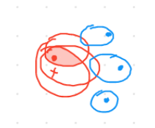
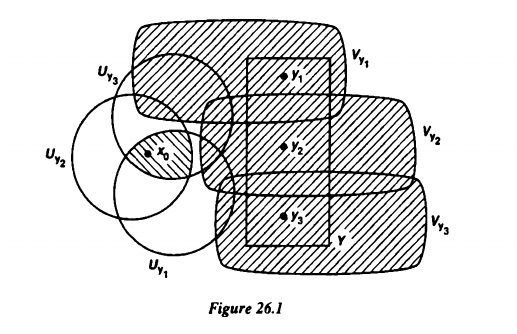

## Basics

### Exercise  $\work$
Show that for $A\subseteq X$, $\cl_X(A)$ is the smallest closed subset containing $A$.

### Exercise $\done$
Give an example of spaces $A\subseteq B \subseteq X$ such that $A$ is open in $B$ but $A$ is *not* open in $X$.

:::{.solution}
\hfill
:::{.concept}
\hfill

:::
No: Take $[0, 1] \subset [0, 1] \subset \RR$.
Then $[0, 1]$ is tautologically open in $[0, 1]$ as it is the entire space, 
But $[0, 1]$ is not open in $\RR$:
  - E.g. $\theset{1}$ is not an interior point (every neighborhood intersects the complement $\RR\setminus[0, 1]$).
:::

### Exercise  $\work$
Show that the diagonal map $\Delta(x) = (x, x)$ is continuous.

### Exercise  $\work$
Show that if $A_i \subseteq X$, then $\cl_X(\union_i A_i) = \union_i \cl_X(A_i)$.

### Exercise  $\work$
Show that $\RR$ is not homeomorphic to $[0, \infty)$.

### Exercise $\work$
Show that the set $(x, y) \in \RR^2$ such that at least one of $x, y$ is rational with the subspace topology is a connected space.

## Connectedness

### Exercise  $\work$
Prove that $X$ is connected iff the only clopen subsets are $\emptyset, X$.

### Exercise $\work$
Let $A \subset X$ be a connected subspace.

Show that if $B\subset X$ satisfies $A\subseteq B \subseteq \bar{A}$, then $B$ is connected.

### Exercise  $\work$
Show that:
  - Connected does not imply path connected
  - Connected and locally path connected *does* imply path connected
  - Path connected implies connected

### Exercise  $\work$
Use the fact that intervals are connected to prove the intermediate value theorem.

### Exercise  $\work$
Prove that the continuous image of a connected set is connected.

### Exercise  $\work$
Show that if $X$ is locally path connected, then 

- Every open subset of $X$ is again locally path-connected.
- $X$ is connected $\iff X$ is path-connected.
- Every path component of $X$ is a connected component of $X$.
- Every connected component of $X$ is open in $X$.

### Exercise $\done$
Show that $[0, 1]$ is connected.

:::{.solution}
\hfill
:::{.concept}
\hfill
[Reference](https://sites.math.washington.edu/~morrow/334_16/connected.pdf)
[A potentially shorter proof](https://math.stackexchange.com/questions/934421/proof-of-that-every-interval-is-connected)
:::

Let $I = [0, 1] = A\union B$ be a disconnection, so
  - $A, B \neq \emptyset$
  - $A \disjoint B = I$
  - $\cl_I(A) \intersect B = A \intersect \cl_I(B) = \emptyset$.
Let $a\in A$ and $b\in B$ where WLOG $a<b$ 
  - (since either $a<b$ or $b<a$, and $a\neq b$ since $A, B$ are disjoint)
Let $K = [a, b]$ and define $A_K \definedas A\intersect K$ and $B_K \definedas B\intersect K$.
Now $A_K, B_K$ is a disconnection of $K$.
Let $s = \sup(A_K)$, which exists since $\RR$ is complete and has the LUB property
Claim: $s \in \cl_I(A_K)$. Proof:
  - If $s\in A_K$ there's nothing to show since $A_K \subset \cl_I(A_K)$, so assume $s\in I\setminus A_K$.
  - Now let $N_s$ be an arbitrary neighborhood of $s$, then using ??? we can find an $\eps>0$ such that $B_\eps(s) \subset N_s$
  - Since $s$ is a supremum, there exists an $a\in A_K$ such that $s-\eps < a$.
  - But then $a \in B_\eps(s)$ and $a\in N_s$ with $a\neq s$.
  - Since $N_s$ was arbitrary, every $N_s$ contains a point of $A_K$ not equal to $s$, so $s$ is a limit point by definition.
Since $s\in \cl_I(A_K)$ and $\cl_I(A_K)\intersect B_K = \emptyset$, we have $s\not \in B_K$.
Then the subinterval $(x, b] \intersect A_K = \emptyset$ for every $x>c$ since $c \definedas \sup A_K$.
But since $A_K \disjoint B_K = K$, we must have $(x, b] \subset B_K$, and thus $s\in \cl_I(B_K)$.
Since $A_K, B_K$ were assumed disconnecting, $s\not \in A_K$
But then $s\in K$ but $s\not\in A_K \disjoint B_K = K$, a contradiction.
:::

## Compactness

### $\star$ Exercise $\done$
Let $X$ be a compact space and let $A$ be a closed subspace. 
Show that $A$ is compact. 

:::{.solution}
\hfill
:::{.concept}
\hfill

:::
Let $X$ be compact, $A\subset X$ closed, and $\theset{U_\alpha} \covers A$ be an open cover.
By definition of the subspace topology, each $U_\alpha = V_\alpha \intersect A$ for some open $V_\alpha \subset X$, and $A\subset \union_\alpha V_\alpha$.
Since $A$ is closed in $X$, $X\setminus A$ is open.
Then $\theset{V_\alpha}\union \theset{X\setminus A}\covers X$ is an open cover, since every point is either in $A$ or $X\setminus A$.
By compactness of $X$, there is a finite subcover $\theset{U_j \suchthat j\leq N}\union \theset{X\setminus A}$
Then $\qty{\theset{U_j} \union \theset{X\setminus A}} \intersect A \definedas \theset{V_j}$ is a finite cover of $A$.
:::
  
### $\star$ Exercise $\done$
Let $f : X \to Y$ be a continuous function, with $X$ compact. 
Show that $f(X)$ is compact.

:::{.solution}
\hfill
:::{.concept}
\hfill

:::
Let $f:X\to Y$ be continuous with $X$ compact, and $\theset{U_\alpha} \covers f(X)$ be an open cover.
Then $\theset{f\inv(U_\alpha)} \covers X$ is an open cover of $X$, since $x\in X \implies f(x) \in f(X) \implies f(x) \in U_\alpha$ for some $\alpha$, so $x\in f\inv(U_\alpha)$ by definition.
By compactness of $X$ there is a finite subcover $\theset{f\inv(U_j) \suchthat j\leq N} \covers X$.
Then the finite subcover $\theset{U_j\suchthat j\leq N} \covers f(X)$, since if $y\in f(X)$, $y\in U_\alpha$ for some $\alpha$ and thus $f\inv(y) \in f\inv(U_j)$ for some $j$ since $\theset{U_j}$ is a cover of $X$.

:::
 
Let $A$ be a compact subspace of a Hausdorff space $X$. 
Show that $A$ is closed.

### Exercise  $\work$
Show that any infinite set with the cofinite topology is compact.

### Exercise  $\work$
Show that every compact metric space is complete.

### Exercise  $\work$
Show that if $X$ is second countable and Hausdorff, or a metric space, then TFAE:

- $X$ is compact
- Every infinite subset $A\subseteq X$ has a limit point in $X$.
- Every sequence in $X$ has a convergent subsequence in $X$. 

### Exercise  $\work$
Show that if $f: A\to B$ is a continuous map between metric spaces and $K\subset A$ is compact, then $\restrictionof{f}{K}$ is uniformly continuous.

### Exercise  $\work$
Show that if $f:X\to Y$ is continuous and $X$ is compact then $f(X)$ is compact.

### Exercise  $\work$
Show that if $f:X\to \RR$ and $X$ is compact then $f$ is bounded and attains its min/max.

### Exercise  $\work$
Show that a finite product or union compact spaces is again compact.

### Exercise  $\work$
Show that a quotient of a compact space is again compact.

### Exercise  $\work$
Show that if $X$ is compact and $A\subseteq X$ is closed then $A$ is compact.

### Exercise  $\work$
Show that if $X$ is Hausdorff and $A\subseteq X$ is compact then $A$ is closed.

### Exercise  $\work$
Show that if $X$ is a metric space and $A\subseteq X$ is compact then $A$ is bounded.

### Exercise  $\work$
Show that a continuous map from a compact space to a Hausdorff space is closed.

### Exercise  $\work$
Show that an injective continuous map from a compact space to a Hausdorff space is an embedding (a homeomorphism onto its image).

### Exercise  $\work$
Show that $[0, 1]$ is compact.

### Exercise  $\work$
Show that a compact Hausdorff space is is metrizable iff it is second-countable.

### Exercise  $\work$
Show that if $X$ is metrizable, then $X$ is compact

### Exercise  $\work$
Give an example of a space that is compact but not sequentially compact, and vice versa.

### Exercise  $\work$
Show that a sequentially compact space is totally bounded.

### Exercise  $\work$
Show that $\RR$ with the cofinite topology is compact.

### Exercise  $\work$
Show that $[0, 1]$ is compact without using the Heine-Borel theorem.

## Separation

### Exercise  $\work$
Show that $X$ is Hausdorff iff $\Delta(X)$ is closed in $X\cross X$.

### Exercise  $\work$
Prove that $X, Y$ are Hausdorff iff $X\cross Y$ is Hausdorff.

### Exercise  $\work$
Show that $\RR$ is separable.

### Exercise  $\work$
Show that any space with the indiscrete topology is separable.

### Exercise  $\work$
Show that any countable space with the discrete topology is separable.

### Exercise  $\work$
Show that the minimal uncountable order with the order topology is not separable.

### Exercise  $\work$
Show that every first countable space is second countable.

### Exercise  $\work$
Show that every metric space is Hausdorff in its metric topology.

## Hausdorff Spaces

### Exercise $\done$
Let $A\subset X$ with $A$ closed and $X$ compact, and show that $A$ is compact.
:::{.solution}
\hfill
:::{.concept}
\hfill
Alternative definition of "open":
:::

Let $A$ be a compact subset of $X$ a Hausdorff space, we will show $X\setminus A$ is open
Fix $x\in X\setminus A$.
Since $X$ is Hausdorff, for every $y\in A$ we can find $U_y \ni y$ and $V_x(y) \ni x$ depending on $y$ such that $U_x(y) \intersect U_y = \emptyset$.
Then $\theset{U_y \suchthat y\in A} \covers A$, and by compactness of $A$ there is a finite subcover corresponding to a finite collection $\theset{y_1, \cdots, y_n}$.
**Magic Step**: set $U = \union U_{y_i}$ and $V = \intersect V_x(y_i)$; 
  - Note $A\subset U$ and $x\in V$
  - Note $U\intersect V = \emptyset$.
Done: for every $x\in X\setminus A$, we have found an open set $V\ni x$ such that $V\intersect A = \emptyset$, so $x$ is an interior point and a set is open iff every point is an interior point.

 

 
:::

### Exercise $\done$
Show that a continuous bijection from a compact space to a Hausdorff space is a homeomorphism.

:::{.solution}
\hfill
:::{.concept}
\hfill

:::
It suffices to show that $f$ is a closed map, i.e. if $U\subseteq X$ is closed then $f(U)\subseteq Y$ is again closed.
Let $U\in X$ be closed; since $X$ is closed, $U$ is compact 
  - Since closed subsets of compact spaces are compact.
Since $f$ is continuous, $f(U)$ is compact
  - Since the continuous image of a compact set is compact.
Since $Y$ is Hausdorff and $f(U)$ is compact, $f(U)$ is closed 
  - Since compact subsets of Hausdorff spaces are closed.
:::

### Exercise  $\work$
Show that a closed subset of a Hausdorff space need not be compact.

### Exercise  $\work$
Show that in a *compact* Hausdorff space, $A$ is closed iff $A$ is compact.

### Exercise  $\work$
Show that a local homeomorphism between compact Hausdorff spaces is a covering space.

