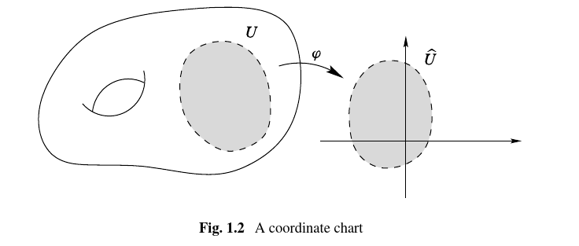
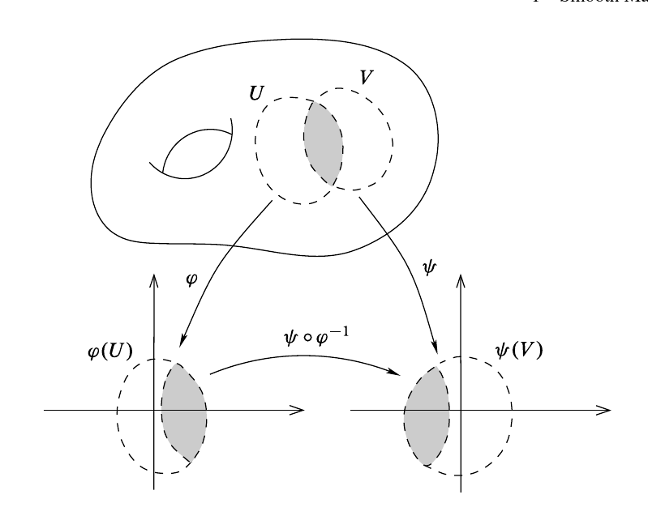

# General Notes to Self

Interesting things to know:

- The Whitney embedding theorem
- The Jordan-Brouwer separation theorem
- The Poincare-Hopf theorem
- The Hopf degree theorem
- Generalized Stokes' Theorem
- Sard's Theorem
- The Frobenius Integrability Theorem

# Preface: Point Set Review

## Quotients 

Definition (Saturated)
:   A subset $A\subseteq X$ is *saturated* with respect to $p:X\to Y$ if whenever $p\inv(\theset{y}) \intersect A \neq \emptyset$, then $p\inv(\theset{y}) \subseteq A$.

Equivalently, $A = p\inv(B)$ for some $B\subseteq Y$, i.e. it is a complete inverse image of some subset of $Y$, i.e. $A$ is a union of fibers $p\inv(b)$.

Definition (Quotient Map)
:   A continuous surjective map $p: X\surjects Y$ is a *quotient map* if $U\subseteq Y$ is open **iff** $p\inv(U) \subset X$ is open.

> Note that $\implies$ comes from the definition of continuity of $p$, but $\impliedby$ is a stronger condition.

Equivalently, $p$ maps saturated subsets of $X$ to open subsets of $Y$.

Definition (Universal Property of Quotients)
:   For $\pi :X\to Y$ a quotient map, if $g:X\to Z$ is a map that is constant on each $p\inv(\theset{y})$, then there is a unique map $f$ making the following diagram commute:

    \begin{center}
    \begin{tikzcd}
    X \ar[d, "\pi"] \ar[rd, "g"] & \\
    Y \ar[r, "f", dotted] & Z
    \end{tikzcd}
    \end{center}

Fact: an injective quotient map is a homeomorphism.

Fact: a product of quotient maps need not be a quotient map.

## Subspaces

Definition (The Subspace Topology)
: $U\subset A$ is open iff $U = V\intersect A$ for some open $V\subseteq X$.

Proposition (Universal Property of Subspaces)
:   If $X$ and $\iota_S: S\injects Y$ is a subspace, then every continuous map $f: X\to S$ lifts to a continuous map $\tilde f: X\to Y$ where $\tilde f \definedas \iota_S \circ f$:

    \begin{center}
    \begin{tikzcd}
     & Y \\
    X \ar[r, "f"] \ar[ur, "\exists! \tilde f", dotted] & S \ar[u, "\iota_S"', hook]
    \end{tikzcd}
    \end{center}

    Note that we can view $\iota_S \definedas \restrictionof{\id_Y}{S}$.
    The subspace topology is the unique topology for which this property holds.

Some properties of subspace:

- The inclusion $\iota_S$ is a topological embedding.
- Restricting a continuous map to a subspace is still continuous.
- A basis for the subspace topology for $A\subset X$ can be obtained by intersecting basis elements of $X$ with $A$.
- If $X$ is Hausdorff/first/second-countable, then so is $A$.

## Products 

Definition (The Product Topology)
: The coarsest topology such that every projection map $p_\alpha: \prod_\beta X_\beta \to X_\alpha$ is continuous, i.e. for every $U_\alpha \subseteq X_\alpha$ open, $p_\alpha\inv(U_\alpha)\in \prod X_\beta$ is open.
  For finite index sets, we can take the box topology: the collection of sets of the form $\prod_{i=1}^N U_i$ with each $U_i$ open in $X_i$ forms a basis for the product topology on $\prod_{i=1}^N X_i$.

> Why these differ: in $\RR^\infty$, the set $S = \prod (-1, 1)$ is open in the box topology but not the product topology, since $\theset{0}^\infty$ is not contained in any basic open neighborhood contained in $S$.

Some properties of products:

- Projections $\pi_i$ are continuous by definition.
- A basis for the product topology can be obtained by taking the product of bases.
- A map $f: X \into \prod Y_i$ *into* a product is continuous iff each component function $F_i \definedas \pi_i \circ f: X\to Y_i$ is continuous.
  - I.e. if we have continuous maps $f_i:X\to Y_i$ then the composite map $F = \thevector{f_1, f_2, \cdots }$ is continuous.
- Separate continuity does not imply joint continuity: A map $f: \prod X_i \to Y$ *out* of a product need not be continuous even if (defining $\iota_j: X_j \injects \prod X_i$) the map $f\circ \iota_j: X_j \to Y$ is continuous for all arbitrary inclusions $\iota_j$.
- Any map of the form $f_{\vector{a}_j}: X_j \to \prod_{i=1}^n X_i$ where $x\mapsto (a_1, \cdots, a_{j-1}, x, a_{j+1}, \cdots a_n)$ is a topological embedding.
- If $X_i$ are Hausdorff/first/second-countable, then so is $\prod_{i=1}^n X_i$.

## Misc

Definition (Precompact)
: A subset $A\subseteq X$ is *precompact* iff its closure $\cl_X(A)$ is compact in $X$.

Definition (Locally Compact
: A space $X$ is *locally compact* iff every $x\in X$ has a neighborhood which is contained in some compact subset of $X$.

## Analysis Review

Definition (Derivative, Real Valued)
:   A function $f:(a, b) \to \RR$ is differentiable at $x$ iff there is a number $y \in \RR$ such that
    \begin{align*}
    \qty{ {f(x+h) - f(x) \over h} - y } \converges{h\to 0}\to 0
    \end{align*}
    where $h\in \RR$.

    The number $f'(x) \definedas y$ is the *derivative* of $f$ at $x$.

    Note that this equivalently says
    \begin{align*}
    f(x+h) - f(x) = f'(x)h + r(h) \text{ where } {r(h) \over h}\converges{h\to 0}\to 0
    .\end{align*}

Definition (Derivative, Vector Valued)
:   For $\vector{f}: (a,b) \to \RR^n$, $\vector \vector{f}'(x)$ is the vector $\vector y \in \RR^n$ such that
    \begin{align*}
    \qty{ {\vector{f}(x+h) - \vector f(x) \over h} - \vector{y} } \converges{h\to 0}\to 0 \iff {\abs{ \vector f(x+h) - \vector f(x) - h \vector \vector y} \over \abs{h}}  \converges{h\to 0}\to 0
    \end{align*}
    where $h\in \RR$.

    The vector $\nabla f \definedas \vector y$ is the *derivative* (or *gradient*) of $f$ at $\vector x$.
    

    Note that this equivalently says
    \begin{align*}
    \vector f(x + h) - \vector f(x) = h\nabla \vector f + \vector r(h) \quad\text{ where } {\vector r(h) \over h}\converges{h\to 0}\to \vector 0
    .\end{align*}

Definition (Derivative, General Case)
:   A function $\vector{f}: \RR^n \to \RR^m$ is differentiable iff there exists a linear transformation $\vector Y$ such that 
    \begin{align*}
    {\norm{ \vector f(\vector x+ \vector h) - \vector f(\vector x) - \vector Y \vector h}_{\RR^m} \over \norm{\vector h}_{\RR^n} }  \converges{\vector h \to \vector 0}\to 0
    .\end{align*}

    The matrix $D_f(\vector x) \definedas \vector Y$ is the *total derivative* of $f$ at $\vector x$.
    
    Note that this equivalently says
    \begin{align*}
    \vector f(\vector x + \vector h) - \vector f( \vector x) = D_f \vector h + \vector r(\vector h) \quad\text{ where } { \norm{\vector r(\vector h)} \over \norm{\vector h} }\converges{\vector h\to \vector 0}\to \vector 0
    .\end{align*}

> Note that we can write $(\nabla f)(\vector x) = \sum_{i=1}^n \dd{f}{x_i} \vector e_i$.

Theorem (Chain Rule)
: If $E\subset \RR^n$ and $f:\RR^n \to \RR^m$ with $E \mapsvia{f} f(E) \mapsvia{g} g(f(E))$ with $f$ differentiable at $\vector x_0$ and $g$ differentiable at $f(\vector x_0)$, then the map $F(\vector x)\definedas g(f(\vector x))$ is differentiable at $\vector x_0$ with derivative $$D_F(\vector x_0) = D_g(f(\vector x_0)) \cdot D_f(\vector x_0).$$

Definition (Components of a Function)
:   If $\mcb_n \definedas \theset{\vector e_i} \subset\RR^n$ and $\mcb_m \definedas \theset{\vector u_i}\subset \RR^m$ are standard bases and $\vector f: \RR^n\to \RR^m$, then the *components* of $\vector f$ are the functions $f_i: \RR^n \to \RR$ defined by
    \begin{align*}
    \vector f(\vector x) = \sum_{i=1}^m f_i(\vector x)\vector u_i = \thevector{f_1(\vector x), \cdots, f_m(\vector x)}_{\mcb_m} 
    .\end{align*}

Definition (Partial Derivative)
:   For $\theset{{\vector e_j}}$ the standard orthonormal basis of $\RR^n$, define
    \begin{align*}
    \dd{f_i}{x_j} = (D_j f_i)(\vector x) = \lim_{t\to 0} {f_i(\vector x + t {\vector e_j}) - f_i(\vector x) \over t}
    .\end{align*}

> Warning: $f$ continuous and existence of all $\dd{f_i}{x_j}$ does not imply differentiability.
> If $f$ is differentiable, however, then $D_f$ is the Jacobian matrix.

Theorem (Derivative Equals Jacobian)
: If $f$ is differentiable at $\vector x_0$, then its derivative is an $m\times n$ matrix, its partial derivatives exist, and
\begin{align*}
D_f(\vector x)\vector e_j &= \sum_{i=1}^m \dd{f_i}{x_j} \vector u_i \hfill \\
= \thevector{ \dd{\vector f}{x_1}, \cdots, \dd{\vector f}{x_n} }
&= 
\begin{bmatrix}
\nabla f_1 & \to \\
\nabla f_2 & \to \\
\vdots & \vdots \\
\nabla f_m & \to
\end{bmatrix}
= \thevector{ \nabla f_1^t, \cdots, \nabla f_m^t}^t
=\left[\begin{array}{ccc}
\frac{\partial f_{1}}{\partial x_{1}} & \cdots & \frac{\partial f_{1}}{\partial x_{n}} \\
\vdots & \ddots & \vdots \\
\frac{\partial f_{m}}{\partial x_{1}} & \cdots & \frac{\partial f_{m}}{\partial x_{n}}
\end{array}\right]
.\end{align*}

Remark
: This implies that
\begin{align*}
D_f(\vector x) \vector h = \sum_{i=1}^m \sum_{j=1}^n \dd{f_i}{x_j} h_j \vector u_i
.\end{align*}

Theorem (Inverse Function Theorem)
:   Suppose $f\in C^1(\RR^n, \RR^n)$ and $D_f(\vector a) \in \Gl(n, \RR)$ for some $\vector a$ and $\vector b = f(\vector a)$.
      
    Then there exist $U\ni \vector a$ and $V\ni \vector b$ such that $f(U) = V$ and $\restrictionof{f}{U}$ is bijective with inverse $g\in C^1(V)$.

Theorem
: If $f\in C^1(\RR^n)$ and $D_f(\vector x)\in \Gl(n,\RR)$ for all $\vector x\in \RR^n$, then $f$ is an open map (and thus *locally injective*)

Theorem (Implicit Function Theorem)
:   Let $A: \RR^n\cross \RR^m \to \RR^n$ and suppose $A_x: \RR^n\to \RR^n$ is invertible.

    Then for every $\vector k\in \RR^m$ there exists a unique $\vector h\in \RR^n$ such that
    \begin{align*}
    A(\vector h, \vector k) = \vector 0 \qtext{and} \vector h = -A_x\inv A_y \vector k
    .\end{align*}

# Chapter 1: Point-Set Properties of Topological Manifolds

Pages 1- 29.

## Notes Part 1

Definition (Topological Manifold)
:   A topological space $M$ that satisfies

    1. $M$ is Hausdorff, i.e. points can be separated by open sets
    2. $M$ is second-countable, i.e. has a countable basis
    3. $M$ is locally Euclidean, i.e. every point has a neighborhood homeomorphic to an open subset $\hat U$ of $\RR^n$ for some fixed $n$.

The last property says $p\in M \implies \exists U$ with $p\in U \subseteq M$, $\hat U\subseteq \RR^n$, and a homeomorphism $\phi: U \to \hat U$.

> Note that second countability is primarily needed for existence of partitions of unity.

Exercise
: Show that the in the last condition, $\hat U$ can equivalently be required to be an open ball or $\RR^n$ itself.

Theorem (Topological Invariance of Dimension)
: Two nonempty topological manifolds of different dimensions can not be homeomorphic.

Exercise
: Show that in a Hausdorff space, finite subsets are closed and limits of convergent sequences are unique.

Exercise 
: Show that subspaces and finite products of Hausdorff (resp. second countable) spaces are again Hausdorff (resp. second countable).\label{ex:subspaces_and_products_of_hausdorff}

Thus any open subset of a topological manifold with the subspace topology is again a topological manifold.

Exercise
: Give an example of a connected, locally Euclidean Hausdorff space that is not second countable.

Definition (Charts)
: A chart on $M$ is a pair $(U, \phi)$ where $U\subseteq M$ is open and $\phi: U \to \hat U$ is a homeormohpsim from $U$ to $\hat U = \phi(U) \subseteq \RR^n$.
  If $p\in M$ and $\phi(p) = 0 \in \bar U$, then the chart is said to be *centered* at $p$.
  Note that any chart about $p$ can be modified to a chart $(\phi_1, \hat U_1)$ that is centered at $p$ by defining $\phi_1(x) = x - \phi(v)$.
  
  

  $U$ is the *coordinate domain* and $\phi$ is the *coordinate map*.

  Note that we can write $\phi$ in components as $\phi(p) = \thevector{x^1(p), \cdots, x^n(p)}$ where each $x^i$ is a map $x^i: U \to \RR$.
  The component functions $x^i$ are the *local coordinates* on $U$.

Shorthand notation: $\thevector{x^i} \definedas \thevector{x^1, \cdots, x^n}$.

Example (Graphs of Continuous Functions)
:   Define 
    \begin{align*}
    \Gamma(f) = \theset{(x, y) \in \RR^{n} \cross \RR^{k} \suchthat x\in U,~ y = f(x) \in \hat U }
    .\end{align*}

    This is a topological manifold since we can take $\phi: \Gamma(f) \to U$ by restricting $\pi_1: \RR^{n}\cross \RR^k \to \RR^n$ to the subspace $\Gamma(f)$.
    Projections are continuous, restrictions of continuous functions are continuous.\todo{Thus graphs of continuous functions $f: \RR^n \rightarrow \RR^k$ are locally Euclidean?}
    
    This is a homeomorphism because the map $g: x \mapsto (x, f(x))$ is continuous and $g\circ \pi_1 = \id_{\RR^n}$ is continuous with $\pi_1 \circ g = \id_{\Gamma(f)}$.
    Note that $U \cong \Gamma(f)$, and thus $(U, \phi) = (\Gamma(f), \phi)$ is a single *global* coordinate chart, called the *graph coordinates* of $f$.

Note that this works in greater generality:: 
\todo{Coordinates as numbers vs functions?} 
"The same observation applies to any subset of $\RR^{n+k}$ by setting *any* $k$ of the coordinates equal to some continuous function of the other $n$."

Example (Spheres)
:   $S^n$ is a subspace of $\RR^{n+1}$ and is thus Hausdorff and second-countable by exercise \ref{ex:subspaces_and_products_of_hausdorff}.\label{ex:sphere_is_a_manifold}

     
    
    To see that it's locally Euclidean, take
    \begin{align*}
    U_i^+ &\definedas \theset{\thevector{x^1, \cdots, x^n} \in \RR^{n+1} \suchthat x^i > 0} \qtext{for} 1 \leq i \leq n+1 \\
    U_i^- &\definedas \theset{\thevector{x^1, \cdots, x^n} \in \RR^{n+1} \suchthat x^i < 0} \qtext{for} 1 \leq i \leq n+1
    .\end{align*}

    Define
    \begin{align*}
    f: \RR^{n} &\to \RR^{\geq 0} \\
    \vector x &\mapsto \sqrt{1 - \norm{\vector x}^2}
    .\end{align*}

    Note that we immediately need to restrict the domain to $\DD^n \subset \RR^n$, where $\norm{x}^2 \leq 1\implies 1 - \norm{x}^2 \geq 0$, to have a well-defined real function $f: \DD^n \to \RR^{\geq 0}$.

    Then (claim) 
    \begin{align*}
    U_i^+ \intersect S^n \qtext{is the graph of} & x^i = f(x^1, \cdots, \hat{x^i}, \cdots, x^{n+1}) \\
    U_i^- \intersect S^n \qtext{is the graph of} &x^i = -f(x^1, \cdots, \hat{x^i}, \cdots, x^{n+1})
    .\end{align*}

    This is because 
    \begin{align*}
  \Gamma(x^i) 
    &\definedas \theset{(\vector x, f(\vector x)) \subseteq \RR^n \cross \RR} \\
    &= \theset{ \thevector{x_1, \cdots, \hat{x^i}, \cdots, x^{n+1}}, f\qty{\thevector{x_1, \cdots, \hat{x^i}, \cdots, x^{n+1} }}\subseteq \RR^n \cross \RR } \\
    &= 
    \theset{ \thevector{x_1, \cdots, \hat{x^i}, \cdots, x^{n+1} }, 
    \qty{1 - \sum_{\substack{j=1 \\ j\neq i}}^{n+1} (x^j)^2}^{1\over 2} 
    \subseteq \RR^n \cross \RR } \\
    \end{align*}

    and any vector in this set has norm satisfying
    \begin{align*}
    \norm{(\vector x, y)}^2 =
    \sum_{\substack{j=1 \\ j\neq i}}^{n+1} (x^j)^2 + 
    \qty{1 - \sum_{\substack{j=1 \\ j\neq i}}^{n+1} (x^j)^2} = 1
    \end{align*}
    and is thus in $S^n$.

    To see that any such point also has positive $i$ coordinate and is thus in $U_i^+$, 
    we can rearrange (?) coordinates to put the value of $f$ in the $i$th coordinate to obtain
    \todo[fancyline]{Seems like $f$ is always the *last* coordinate in the graph} 
    \begin{align*}
    \Gamma(x_i) = \theset{\thevector{x^1, \cdots, f(x^1, \cdots, \hat{x^i}, \cdots, x^n), \cdots, x^n  }}
    \end{align*}
    and note that the square root only takes on positive values.

    Thus each $U_i^{\pm} \intersect S^n$ is the graph of a continuous function and thus locally Euclidean, and we can define chart maps
    \begin{align*}
    \phi_i^{\pm}: U_i^{\pm} \intersect S^n &\to \DD^n \\
    \thevector{x^1, \cdots, x^n} &\mapsto [x^1, \cdots, \hat{x^i}, \cdots, x^{n+1}]
    \end{align*}
    yield $2(n+1)$ charts that are graph coordinates for $S^n$.

Example (Projective Space)
:   Define $\RP^n$ as the space of 1-dimensional subspaces of $\RR^{n+1}$ with the quotient topology determined by the map
    \hspace{10em} \todo[fancyline]{How is this map a quotient map?}
    \begin{align*}
    \pi: \RR^{n+1}\smz &\to \RP^n\\
    \vector x &\mapsto \spanof_\RR\theset{\vector x}
    .\end{align*} 

    Notation: for $\vector x \in \RR^{n+1}\smz$ write $[\vector x] \definedas \pi(\vector x)$, the line spanned by $\vector x$.

    Define charts:
    \begin{align*}
    \tilde U_i \definedas \theset{\vector x \in \RR^{n+1}\smz \suchthat x^i \neq 0}, \quad U_i = \pi(\tilde U_i) \subseteq \RP^n \\
    .\end{align*}

    and chart maps
    \begin{align*}
    \tilde \phi_i: \tilde U_i &\to \RR^n \\
    \thevector{x^1, \cdots, x^{n+1}} &\mapsto \thevector{{x^1 \over x^i}, \cdots \hat{x^i}, \cdots {x^{n+1} \over x^i}  }
    .\end{align*}

    Then (claim) this descends to a continuous map $\phi_i: U_i \to \RR^n$ by the universal property of the quotient:

    \begin{center}
    \begin{tikzcd}
    \tilde U_i \ar[d, "\pi_U"'] \ar[rd, "\tilde \phi_i"] & \\
    U_i \ar[r, "\phi_i", dotted] & \RR^n
    \end{tikzcd}
    \end{center}

    - The restriction $\pi_U: \tilde U_i \to U_i$ of $\pi$ is still a quotient map because $\tilde U_i = \pi_U\inv(U_i)$ where $U_i\subseteq \RP^n$ is open in the quotient topology and thus $\tilde U_i$ is saturated.
    
      Thus $\pi_U$ sends saturated sets to open sets and is thus a quotient map.
    
    - $\tilde \phi_i$ is constant on preimages under $\pi_U$: fix $y\in U_i$, then $\pi_U\inv(\theset{y}) = \theset{\lambda \vector y \suchthat \lambda \in \RR\smz}$, i.e. the point $y \in \RP^n$ pulls back to every nonzero point on the line spanned by $\vector y\in \RR^n$.

      But 
      \begin{align*}
      \tilde \phi_i(\lambda \vector y) 
      &= \phi_i \qty{ \thevector{\lambda y^1, \cdots, \lambda y^i, \cdots, \lambda y^n} } \\
      &= \thevector{{\lambda y^1 \over \lambda y^i}, \cdots, \hat{\lambda y^i}, \cdots, {\lambda y^{n+1} \over \lambda y^i}} \\
      &= \thevector{{y^1 \over y^i}, \cdots, \hat{y^i}, \cdots, {y^{n+1} \over y^i}} \\
      &= \tilde \phi_i(\vector y)
      .\end{align*}

  So this yields a continuous map
  \begin{align*}
  \phi_i: U_i \to \RR^n
  .\end{align*}

  We can now verify that $\phi$ is a homeomorphism since it has a continuous inverse given by
  
  \begin{align*}
  \phi_i\inv: \RR^n &\to U_i \subseteq \RP^n \\
  \vector u \definedas \thevector{u^1, \cdots, u^n } &\mapsto \thevector{u^1, \cdots, u^{i-1}, {\color{red}1}, u^{i+1}, \cdots, u^n}
  .\end{align*}

  It remains to check: \todo{Exercise}

  1. The $n+1$ sets $U_1, \cdots, U_{n+1}$ cover $\RP^n$.
  2. $\RP^n$ is Hausdorff
  3. $\RP^n$ is second-countable.

   
Exercise (1.6)
: Show that $\RP^n$ is Hausdorff and second countable.

Exercise (1.7)
: Show that $\RP^n$ is compact. (Hint: show that $\pi$ restricted to $S^n$ is surjective.)

Definition (Topological Embedding)
: A continuous map $f:X\to Y$ is a *topological embedding* iff it is injective and $\tilde f:X\to f(X)$ is a homeomorphism.

Example (Product Manifolds)
:   Let $M \definedas M_1 \times \cdots \times M_k$ be a product of manifolds of dimensions $n_1, \cdots, n_k$ respectively.
    A product of Hausdorff/second-countable spaces is still Hausdorff/second-countable, so just need to check that it's locally Euclidean.

    - Let $\vector p \in \prod_{i=1}^N M_i$, so $p_i \in M_i$
    - Choose a chart $(U_i, \phi_i)$ with $p_i\in U_i$ and assymble a product map:
    \begin{align*}
    \Phi \definedas \prod \phi_i: \prod U_i \to \prod R^{n_i} \cong \RR^{\Sigma n_i} \definedas \RR^N
    .\end{align*}

    - Claim: $\Phi$ is a homeomorphism onto its image in $R^N$.
      - Each $\phi_i$ is a homeomorphism onto $\phi_i(U_i)$ (by the definition of a chart on $M_i$) 
      - It suffices to show that that $\Phi\inv$ exists and is continuous, where 
      \begin{align*}
      \Phi\inv(V) \definedas \qty{\prod \phi_i}\inv \qty{\prod V_i}
      .\end{align*}
      - $\Phi$ is a product of continuous functions and thus continuous.
      - $\Phi\inv \definedas \qty{\prod \phi_i}\inv = \prod \phi_i\inv$, which are all assumed continuous since $\phi_i$ were homeomorphisms.
    
Example (Torii)
:   $T^n \definedas \prod_{i=1}^n S^1$ is a topological $n\dash$manifold.

Definition (Precompact)
: A subset $A\subseteq X$ is *precompact* iff its closure $\cl_X(A)$ is compact in $X$.

Proposition
: Every topological manifold has a countable basis of precompact coordinate balls.

Proposition
:   Let $M$ be a topological manifold.

    - $M$ is locally path-connected.
    - $M$ is connected $\iff M$ is path-connected
    - The connected components and path components of $M$ coincide.
    - $\pi_0(M)$ is countable and each component is open and a connected topological manifold.

Proposition
: Every topological manifold $M$ is locally compact.

Proof
: $M$ has a basis of precompact open sets.

Theorem (Manifolds are Paracompact)
: Given any open cover $\mcu \covers M$ of a topological manifold and any basis $\mcb$ for the topology on $M$, there exists a countable locally finite open refinement of $\mcu$ consisting of elements of $\mcb$.

Proposition
: $\pi_1(M)$ is countable.

## Notes Part 2

Definition (Smooth Functions)
: A function $f:\RR^n \to \RR^m$ given by $\thevector{f_1(\vector x^n), f_2(\vector x^n), \cdots, f_m(\vector x^n)}$ (or any subsets thereof) is said to be $C^\infty$ or **smooth** iff each $f_i$ has continuous partial derivatives of all orders.

Definition (Diffeomorphism)
: A smooth bijective map with a smooth inverse is a *diffeomorphism*.

Remark
: A diffeomorphism is necessarily a homeomorphism, but not conversely.

Definition (Transition Maps)
:   If $(U, \phi), (V, \psi)$ are two charts on $M$ such that $U\intersect V \neq \emptyset$, the composite map $\psi \circ \phi\inv: \phi(U\intersect V) \to \psi(U\intersect V)$ is a function $\RR^n\to\RR^n$ and is called the *transition map* from $\phi$ to $\psi$.
    
    Two charts are *smoothly compatible* iff $U\intersect V = \emptyset$ or $\psi \circ \phi\inv$ is a diffeomorphism.

Definition
:   A collection of charts $\mca \definedas \theset{(U_\alpha, \phi_\alpha)}$ is an *atlas* for $M$ iff $\theset{U_\alpha} \covers M$, and is a *smooth atlas* iff all of the charts it contains are pairwise smoothly compatible.

Remark
: To show an atlas is smooth, it suffices to show that an arbitrary $\psi \circ \phi\inv$ is smooth.
  This is because this immediately implies that its inverse is smooth, and these these are diffeomorphisms.
  Alternatively, one can show that $\psi\circ\phi\inv$ is smooth, injective, and has nonsingular Jacobian at each point.

Remark
:   Attempting to define a function $f: M\to \RR$ to be smooth iff $f\circ \phi\inv: \RR^n \to \RR$ is smooth for each $\phi$ may not work because many atlases give the "same" smooth structure in the sense that they all determine the same collection of smooth functions on $M$. \todo{What does "determine the same collection of smooth functions" mean?}

    For example, take the following two atlases on $\RR^n$:
    \begin{align*}
    \begin{array}{l}
    {\mca}_{1}=\left\{\left(\mathbb{R}^{n}, \operatorname{Id}_{\mathbb{R}^{n}}\right)\right\} \\
    {\mca}_{2}=\left\{\left(\DD_{1}(\vector x), \id_{\DD_{1}(\vector x)}\right)\suchthat \vector x \in \mathbb{R}^{n}\right\}
    \end{array}
    .\end{align*}

    Claim: a function $f:\RR^n \to \RR$ is smooth wrt either atlas iff it is smooth in the usual sense.

Definition (Maximal or Complete Atlas)
: A smooth atlas on $M$ is *maximal* iff it is not properly contained in any larger smooth atlas.

Remark
: Not every topological manifold admits a smooth structure.
  See Kervaire's 10-dimensional manifold from 1960.

Definition (Smooth Structures and Smooth Manifolds)
: If $M$ is a topological manifold, a maximal smooth atlas $\mca$ is a *smooth structure* on $M$. 
  The triple $(M, \tau, \mca)$ where $\mca$ is a smooth structure is a *smooth manifold*.

Remark
:   To show that two smooth structures are *distinct*, it suffices to show that they are not smoothly compatible, i.e. one of the transition functions $\psi\circ \phi\inv$ is not smooth.
    This is because any maximal atlas $\mca_1$ must contain $\psi$ and likewise $\mca_2$ contains $\phi\inv$, but no maximal atlas can contain $\phi$ *and* $\psi$ because all charts in a maximal atlas are smoothly compatible by definition.

Proposition
:   Let $M$ be a topological manifold.

    1. Every smooth atlas $\mca$ for $M$ is contained in a unique maximal smooth atlas, called the *smooth structure determined by $\mca$*.
    2. Two smooth atlases for $M$ determine the same smooth structure $\iff$ their union is a smooth atlas.

Remark
: That we can place many requirements on the functions $\psi \circ \phi\inv$ and get various other structures: $C^k$, real-analytic, complex-analytic, etc.
  $C^0$ structures recover topological manifolds.

Definition (Smooth Charts, Maps, Domains)
: If $(M,\ \tau, \mca)$ is a smooth manifold, any chart $(U, \phi)\in \mca$ is a *smooth chart*, where $U$ is a *smooth coordinate domain* and $\phi$ is a *smooth coordinate map*. 
  A *smooth coordinate ball* is a smooth coordinate domain $U$ such that $\phi(U) = \DD^n$.

Definition (Regular Coordinate Ball)
:   A set $B\subseteq M$ is a *regular coordinate ball* if there is a smooth coordinate ball $B'$ such that $\cl_M(B) \subseteq B'$, and a smooth coordinate map $\phi: B'\to \RR^n$ such that for some positive numbers $r < r'$,

    - $\phi(B) = \DD_r(\vector 0)$, 
    - $\phi(B') = \DD_{r'}(\vector 0)$, and 
    - $\phi(\cl_M(B)) = \cl_{\RR^n}(\DD_r(\vector 0))$.

    This says $B$ "sits nicely" insane a larger coordinate ball.

Remark 
: $\cl_M(B) \cong_{\Top} \cl_{\RR^n}(\DD_r(\vector 0))$ which is closed and bounded and thus compact, so $\cl_M(B)$ is compact.
  Thus every regular coordinate ball in $M$ is precompact.

Proposition
: Every smooth manifold has a countable basis of regular coordinate balls.

Remark
: There is only one 0-dimensional smooth manifold, up to equivalence of smooth structures.

Definition (Standard Smooth Structure on \$\\RR^n\$)
: Define the atlas $\mca_0 = \theset{(\RR^n, \id_{\RR^n})}$ and take the smooth structure it generates, this is the *standard smooth structure* on $\RR^n$.

Proposition
:   There are at least two distinct smooth structures on $\RR^n$.

Proof
:   Define $\psi(x) = x^3$; then $\mca_1 \definedas \theset{(\RR^n, \phi)}$ defines a smooth structure.

    Then $\mca_1 \neq \mca_0$, which follows because $\qty{\id_{\RR^n} \circ \phi\inv}(x) = x^{1\over 3}$, which is not smooth at $\vector 0$.

## Recommended Problems

> Note: helpful theorem, two smooth structures induced by two smooth atlases $\mca_1, \mca_2$ are equivalent iff $\mca_1 \union \mca_2$ is again a smooth atlas.
> So it suffices to check pairwise compatibility of charts.

Exercise (Problem 1.6) 
:   Show that if $M^n\neq \emptyset$ is a topological manifold of dimension $n\geq 1$ and $M$ has a smooth structure, then it has uncountably many distinct ones. \todo{Recommended problem}

    > Hint: show that for any $s> 0$ that $F_s(x) \definedas \abs{x}^{s-1}x$ defines a homeomorphism $F_x: \DD^n \to \DD^n$ which is a diffeomorphism iff $s=1$.

Solution:

Define
\begin{align*}
F_s: \RR^n &\to \RR^n \\
\vector x &\mapsto \norm{\vector x}^{s-1} \vector x 
.\end{align*}

Claim: $F_s$ restricted to $\DD^n$ is a continuous map $\DD^n \to \DD^n$.

- Note that if $\norm{\vector x}\leq \eps < 1$ then $$\norm{F_s(\vector x)} = \norm{ \norm{\vector x}^s \hat{\vector x} } = \norm{\vector x}^s \leq \norm{\vector x} \leq \eps < 1,$$
  so $F_s(\DD^n) \subseteq \DD^n$ and moreover $F_s(\DD_\eps^n) \subseteq \DD_\eps^n$.

  - We'll use the fact that $F_s\inv = F_{1\over s}$ is of the same form, and thus $F_s\inv(\DD^n) \subseteq \DD^n$, forcing $F_s(\DD^n) = \DD^n$.

- This is a continuous function on the punctured disc $\DD_0^n \definedas \DD^n\setminus\theset{\vector 0}$, since it can be written as a composition of smooth functions:
   \begin{center}
   \begin{tikzcd}
\DD_0^n \ar[r, "\Delta"] & \DD_0^n \cross \DD_0^n \ar[r, "{(\norm{\wait}, ~\id_{\DD_0^n})}", outer sep=5pt] & \DD_0^n \cross \DD_0^n \ar[r, "{(\qty{\wait }^{s-1}, ~\id_{\DD_0^n})}", outer sep=5pt] & \DD_0^1 \cross \DD_0^n \ar[r, "{(a,b)\mapsto ab}", outer sep=5pt]& \DD_0^n \\
    \vector x \ar[r] & (\vector x, \vector x) \ar[r] & (\norm{\vector x}, \vector x) \ar[r] & (\norm{\vector x}^{s-1}, \vector x)\ar[r] & \norm{\vector x}^{s-1} \vector x
   \end{tikzcd}
   \end{center}

    For any $s\geq 0$, continuity at zero follows from the fact that $\norm{F_s(\vector x)} \leq \norm{\vector x} \to 0$, so $\lim_{\vector x \to \vector 0}F_s(\vector x) = \vector 0$ and the sequential definition of continuity applies. So $F_s$ is continuous on $\DD^n$ for every $s$.

    > Here we are taking for granted the fact that taking norms, exponentiating, and multiplying are all smooth functions away from zero.

Claim: $F_s$ is a bijection $\DD^n\setminus{\vector 0}\selfmap$ that extends to a bijection $\DD^n\selfmap$.

We can note that
\begin{align*}
F_s(\vector x) = 
\begin{dcases}
\norm{\vector x}^s{\vector x \over \norm{\vector x}} \definedas \norm{\vector x}^s \hat{\vector x} & \text{if } \norm{\vector x} \neq 0 \\
\vector 0 & \text{if } \norm{\vector x } = 0
\end{dcases}
\end{align*}

This follows because we can construct a two-sided inverse that composes to the identity, namely $F_{1\over s}$, for $\vector x\neq \vector 0$, and note that $F_s(\vector 0) = \vector 0$.
Using the fact that $\norm{t \vector x} = t\norm{\vector x}$ for any scalar $t$, we can check that
\begin{align*}
\qty{F_s \circ F_{1\over s}}(\vector x)
&= F_s(\norm{\vector x}^{1\over s} \hat{\vector x}) \\
&= \norm{ \norm{\vector x}^{1\over s} \hat{\vector x} }^{s} \cdot \hat{\norm{\vector x}^{1\over s} \hat{\vector x}} \\
&= \qty{ \norm{\vector x}^{1\over s}}^s \cdot \norm{ \hat{\vector x} }^{s} \cdot { \norm{\vector x}^{1\over s} \hat{\vector x} \over \norm{ \norm{\vector x}^{1\over s} \hat{\vector x}  } } \\
&= \norm{\vector x} \cdot 1^s \cdot \qty{\norm{\vector x}^{1\over s} \over \norm{\vector x}^{1\over s}} \cdot {\hat{\vector x} \over \norm{\hat{\vector x}} } \\
&= \norm{\vector x} \hat{\vector x} \\
&= \vector x
.\end{align*}

and similarly
\begin{align*}
\qty{F_{1\over s} \circ F_s}(\vector x) 
&= F_{1\over s} \qty{ \norm{\vector x}^s \hat{\vector x}  } \\
&= \norm{\norm{\vector x}^s \hat{\vector x}  }^{1\over s} \cdot \hat{ \norm{\vector x}^s \hat{\vector x}  } \\
&= \qty{\norm{\vector x}^s}^{1\over s} \norm{\hat{\vector x} }^{1\over s} \cdot {\norm{\vector x}^s \hat{\vector x} \over \norm{ \norm{\vector x}^s \hat{\vector x} }  } \\
&= \norm{\vector x} \cdot 1^{1-s} \cdot \qty{\norm{\vector x}^s \over \norm{\vector x}^s } \cdot {\hat{\vector x} \over \norm{\hat{\vector x}}} \\
&= \norm{\vector x} \hat{\vector x} \\
&= \vector x
.\end{align*}

Claim: $F_s$ is a homeomorphism for all $s$.

This follows from the fact that the domain $\DD^n$ is compact and the codomain $\DD^n$ is Hausdorff, and a continuous bijection between such spaces is a homeomorphism.

Claim: $F_s$ is a diffeomorphism iff $s=1$.

If $s=1$, $F_s = \id_{\DD^n}$ which is clearly a diffeomorphism.

Otherwise, we claim that $F_s$ is not a diffeomorphism because either $F_s$ or $F_s\inv$ will fail to be smooth at $\vector x = \vector 0$.

- If $0\leq s < 1$, then $F_s$ fails to be differentiable at zero. \todo{Why? Should boil down to $x\mapsto x^t$ for $0\leq t< 1$ failing to be differentiable at 0 in $\RR$}
- If $1<s< \infty$ then $0 \leq {1\over s} < 1$ and the same argument applies to $F_s\inv \definedas F_{1\over s}$.

We now show that we can produce infinitely many distinct maximal atlases on $M$.
Let $\mca$ by any smooth atlas on $M$ and fix $p_0\in M$.

Claim: We can modify $\mca$ to obtain an atlas $\mca'$ where $p_0$ is in exactly one chart $(V, \psi)$ with $\psi(p_0) = \vector 0 \in \RR^n$.

- Pick a chart containing $p_0$, say $(U, \phi)$ where $\phi(p_0) \definedas \vector p$
- Since $\phi(U)\subseteq \RR^n$ is open, find a disc containing $\vector p$, say $\DD_R(\vector p) \subset \phi(U)$.
- Define $V\subseteq M$ as $V\definedas \phi\inv(\DD_R(\vector p))$.
- Define $\psi: U\to \RR^n$ by 
  \begin{align*}
  \psi: U &\to \RR^n \\
  x &\mapsto {\phi(x) - \phi(p_0) \over R}
  .\end{align*}
  - Note: this is constructed precisely so that $\psi(V) = \DD_1(\vector 0) \in \RR^n$ and $\psi(p) = 0$.
  - This is a homeomorphism onto its image since we can write $$\psi = \delta_{1\over R}\circ \tau_{\vector p} \circ \phi$$ is a composition of continuous functions, where $\delta, \tau$ are dilations/translations in $\RR^n$ which are known to be continuous, and $$\psi\inv = \phi\inv \circ \tau_{- \vector p} \circ \delta_R$$ is again a composition of smooth (and in particular, continuous) functions.
- Define $\mca^1 \definedas \mca \union \theset{ (V, \restrictionof{\psi}{V})}$
  - This is a smooth atlas: any pair of charts coming from $\mca$ are smoothly compatible, so it suffices to check that an arbitrary chart from $\mca$ is smoothly compatible with the new chart.
  - Let $(T, \xi)$ be any other chart, then if $T\intersect V\neq \emptyset$, the transition function $$\psi \circ \xi\inv =  \delta_{1\over R} \tau_{\vector p} \circ \phi \circ \xi\inv$$ is a composition of smooth functions and thus smooth, and similarly for $\xi\circ \psi\inv$.
  - Since the charts from $\mca$ cover $M$, so do the charts of $\mca^1$ since $\mca \subseteq \mca^1$.
- For every $(U_\alpha, \phi_\alpha)\in \mca^1$, define a new chart $(U_\alpha \setminus\theset p, \restrictionof{\phi_\alpha}{U_\alpha \setminus\theset p})$ and define this set of charts as $\mca^2$.
  - This still covers $M$: $p$ is in the chart $(V, \psi\mid_V)$, and if $q\neq p$, then $q\in U_\alpha$ for some $\alpha$ since $\mca$ was an atlas, and $q\in U_\alpha\setminus\theset{p}$.
  - The coordinate maps are still homeomorphisms onto their images, because the restriction of a homeomorphism is again a homeomorphism.
  - The transition functions are still smooth because the restriction of a smooth function is again smooth.

Claim: We can define a new atlas $\mca_s$ from $\mca^2$ by only replacing the single chart $(V, \psi)$ with $(V, F_s \circ \psi)$.

- $\mca_s$ still covers $M$, since we haven't changed the coordinate domains
- All coordinate functions are still a homeomorphisms onto their images, since the only change is $\psi$ is replaced with $F_s \circ \psi$ and we've shown that $F_s$ is a homeomorphism; a composition of homeomorphisms is again a homeomorphism.
- The chart $(V, F_s\circ \psi)$ is still a valid chart, since $F_s: \DD_n\selfmap$ and $\psi(V) \cong \DD^n$ by construction.
- All charts in $\mca_s$ are still smoothly compatible:
  - If suffices to check compatibility between an arbitrary $(U_\alpha, \phi_\alpha)$ and $(V, F_s\circ \psi)$, so we consider $F_s\circ \psi\circ \phi_\alpha\inv$
  - By construction, $p\not\in U_\alpha$, and we know $F_s$ is smooth away from $\vector 0$, so this is a smooth function.

Claim: If $s\neq t$ then $\mca_s$ and $\mca_t$ are not smoothly compatible, and thus generate distinct maximal smooth atlases.

- If $\mca_s, \mca_t$ define the same smooth structure, then in particular $(V, F_s\circ \psi)$ must be smoothly compatible with $(V, F_t \circ \psi)$.
- We can compute the transition function
\begin{align*}
\qty{F_s\circ \psi} \circ (F_t\circ \psi)\inv = F_s\circ \psi \circ \psi\inv \circ F_t\inv = F_s\circ F_t\inv = F_s \circ F_{1\over t} = F_{s\over t}
.\end{align*}
- From above, we know this is smooth iff ${s\over t} = 1$, i.e. $s=t$.
- So if $s\neq t$, then the maximal atlases correspond to $\mca_s, \mca_t$ each contain a chart that is not smoothly compatible with the other, and so these are distinct smooth structures.

$\qed$

Exercise (Problem 1.7)
:   Let $N\definedas \thevector{0, \cdots, 1} \in S^n$ and $S\definedas \thevector{0, \cdots, -1}$ and define the stereographic projection
    \todo{Recommended problem}
    \begin{align*}
    \sigma: S^n\setminus N &\to \RR^n \\
    \thevector{x^1, \cdots, x^{n+1}} &\mapsto {1 \over 1-x^{n+1}} \thevector{x^1, \cdots, x^n}
    \end{align*}
    and set $\tilde\sigma(x) = -\sigma(-x)$ for $x\in S^n\setminus S$ (projection from the South pole) \todo{Note that the figure should say $\theset{x^{n+1} = 0}$ instead of $x^n$.}
    
    

    1. For any $x\in S^n\setminus N$ show that $\sigma(x) = \vector u$ where $(\vector u, 0)$ is the point where the line through $N$ and $x$ intersects the linear subspace $H_{n+1} \definedas \theset{x^{n+1} = 0}$.
  
        Similarly show that $\tilde \sigma(x)$ is the point where the line through $S$ and $x$ intersects $H_{n+1}$.
  
    2. Show that $\sigma$ is bijective and 
    \begin{align*}
    \sigma\inv(\vector u) = \sigma\inv\qty{\thevector{u^1, \cdots, u^n }} = {1\over \norm{\vector u}^2 + 1} \thevector{2u^1, \cdots, 2u^n, \norm{\vector u}^2 - 1}
    .\end{align*}
  
    3. Compute the transition map $\tilde \sigma \circ \sigma\inv$ and verify that the atlas
    \begin{align*}
    \mca \definedas \theset{(S^n\setminus N, \sigma), (S^n\setminus S, \tilde \sigma)  }
    \end{align*}
    define a smooth structure on $S^n$.
  
    4. Show that this smooth structure is equivalent to the standard smooth structure:
        Put graph coordinates on $S^n$ as outlined in \ref{ex:sphere_is_a_manifold} to obtain $\theset{(U_i^\pm, \phi_i^{\pm})}$.
      
        For indices $i<j$, show that
        \begin{align*}
        \phi_i^\pm \circ (\phi_j^\pm)\inv \thevector{u^1, \cdots, u^n} = \thevector{u^1, \cdots, \hat{u^i}, \cdots, \pm\sqrt{1 - \norm{\vector u}^2}  ,\cdots u^n}
        \end{align*}
        where the square root appears in the $j$th position.
        Find a similar formula for $i>j$.
        Show that if $i=j$, then
        \begin{align*}
        \phi_i^\pm \circ (\phi_j^\pm)\inv = \phi_i^- \circ (\phi_i^+)\inv = \id_{\DD^n} 
        .\end{align*}
      
        Show that these yield a smooth atlas.

    

Solution (1):

- Parameterize the line through $\vector x\in S^n$ and $\vector N$: 
 \begin{align*}
  \ell_{N, \vector x}(t) 
  &= t\vector x + (1-t) \vector N \\
  &= t\thevector{x^1, \cdots, x^n, x^{n+1}} + (1-t)\thevector{0, \cdots, 1} \\
  &= \thevector{tx^1, \cdots, x^n, tx^{n+1} + (1-t)} \\
  &= \thevector{tx^1, \cdots, x^n, 1 - t\qty{1-x^{n+1}}} \\
 .\end{align*}

- Evaluate at $t = {1 \over 1 - x^{n+1}}$ to obtain ${1\over x^{n+1}}\thevector{x^1, \cdots, x^n, 0} = \thevector{ \sigma(\vector x), 0}$.
- For $\tilde \sigma(\vector x)$: Todo \todo{Todo}.

Solution (2):

- How to derive this formula: no clue. \todo{Figure out how to invert.}
  - Start with $\vector u \in \RR^n$, parameterize the line $\ell_{N, \vector u}(t)$, solve for where $\norm{\ell_{N, \vector u}(t)} = 1$ and $\vector u \neq N$
  - Should yield $t^2 \norm{u} + (1-t)^2 = 1$, solve for nonzero $t$; should get $t = {2 \over \norm{\vector u} + 1}$, so $x^i = 2u^i/(\norm{\vector u} + 1)$ and $x^{n+1} = \qty{2 \over \norm{\vector u} + 1} -1$.
- Compute compositions $\sigma \circ \sigma\inv$: Todo. \todo{Messy computations that didn't work out.}

Solution (3):

- Computing the transition maps:
\begin{align*}
(\tilde \sigma \circ \sigma\inv)(\vector u) 
&= -\sigma\qty{\qty{-1 \over \norm{\vector u}^2 + 1} \thevector{2u^1, \cdots, 2u^n, \norm{\vector u}^2 - 1}  } \\
&= -1 \cdot \thevector{ {{ -2 u^1 \over \norm{\vector u}^2 + 1} \over 1 - {1 - \norm{\vector u}^2 \over 1 + \norm{\vector u}^2 }}  , \cdots_n } \\
&= \thevector{ {2u^1 \over \norm{\vector u}^2 + 1} \cdot {1 + \norm{\vector u}^2 \over 1 + \norm{\vector u}^2 - (1 - \norm{\vector u}^2)}, \cdots_n} \\
&= \thevector{ {2u^1 \over 2\norm{\vector u}^2}, \cdots_n } \\
&= {\vector u \over \norm{\vector u}^2} \\
&\definedas \hat{\vector u}
,\end{align*}
  which is a smooth function on $\RR^n\setminus\theset{\vector 0}$.

- Todo: computing $(\sigma \circ \tilde\sigma\inv)(\vector u) = \hat{\vector u}$\todo{Computation.}
- Todo: argue that it suffices that these are smooth on $\RR^n\setminus\theset{\vector 0}$ \todo{What are the actual domains and ranges of the transition functions? It seems like you pull back $\RR^n$ to $S^n\setminus N$, then push $S^n\setminus\theset{N, S}$ to $R^n\setminus 0$, but this yields $\RR^n\to\RR^{n}\setminus 0$ where we haven't deleted zero in the domain (problem: not smooth!).}

Solution (4):

We want to argue that these define the same maximal smooth atlas, for which it suffices to the charts from each are pairwise smoothly compatible.

- Define $\phi_i\qty{\thevector{x^1, \cdots, x^n}} = \thevector{x^1, \cdots, \hat{x^i}, \cdots, x^n}$ and $\phi_i\inv\qty{\thevector{x^1, \cdots, x^{n-1}}} = \thevector{x^1, \cdots_i, \sqrt{1 - \norm{\vector x}}, \cdots, x^n }$.
- Compute $(\phi_i \circ \sigma\inv)(\vector u) = {1 \over \norm{\vector u} + 1}\thevector{2 u^1, \cdots \hat{u^i}, \cdots, 2u^n, \norm{\vector u}^2 - 1}$, which is (clearly) smooth?
- Compute $(\sigma \circ \phi_i\inv)(\vector u) = \sigma\qty{\thevector{u^1, \cdots_i, \sqrt{1 - \norm{\vector u}^2}, \cdots, u^n } }$, which is ${1\over 1-u^n}\thevector{u^1, \cdots_i, \sqrt{1-\norm{\vector u}^2}, \cdots, u^{n-1}}$.
  - This is smooth if $u^n\neq 1$, but this corresponds to $\vector N$ in $S^2$, in which case $\phi_i\inv(\vector u)$ isn't in the domain of $\sigma$ to begin with.

Exercise (Problem 1.8)
:   Define an *angle function* on $U\subset S^1$ as any continuous function $\theta:U\to\RR$ such that $e^{i\theta(z)} = z$ for all $z\in U$.

    Show that $U$ admits an angle function iff $U\neq S^1$, and for any such function $\theta$, $(U, \theta)$ is a smooth coordinate chart for $S^1$ with its standard smooth structure.

Note that $f: \RR\to S^1$ given by $f(x) = e^{ix}$ is a covering map (in fact the universal cover). \todo{Some way to do this just with covering spaces?}

$\implies$: 

- Suppose there exists an angle function $\theta: U \to \RR$.
- Then $f\circ \restrictionof{\theta}{U} = \id_U$ by assumption, since $u \mapsvia{\restrictionof{\theta}{U}} \theta(u) \mapsvia{f} e^{i\theta(u)} = u$. 
- So $\theta$ has a left-inverse and is thus injective.
- Suppose $U = S^1$, which is compact.
- Then $\theta$ is an injective continuous map on a compact set, so its image $\theta(S^1) \subseteq \RR$ is compact.
- Lemma: a continuous map from a compact space to a Hausdorff space is a closed map.
- Since $\theta$ is injective and is surjective onto its image, since it is continuous it is a homeomorphism onto its image and $S^1 \cong \theta(S^1)$.
- Since $S^1$ is connected, $\theta(S^1)$ is connected, and the only connected subsets of $\RR$ are intervals. 
- Since $\theta(S^1)$ is compact, it must be a closed and bounded subset, so $\theta(S^1) = [a, b] \subset \RR$.
- But this forces $S^1 \cong [a, b]$ is a homeomorphism, which is a contradiction: removing one point from $S^1$ yields one connected component, while removing ${1\over 2}(b-a)$ from $[a, b]$ produces a disconnected set.

$\impliedby$:

- Suppose $U\neq S^1$, then there exists a point $p\in S^1\setminus U$; wlog suppose $p=1$.
- Then $U \subseteq S^1\setminus\theset{1}$
- Note that $f\inv(\theset{1}) = \theset{2k\pi \suchthat k\in \ZZ}$.
- Take the interval $I = [0, 2\pi]$ and set $\tilde f = \restrictionof{f}{I}$.
- Since $U\neq S^1$, $\tilde f\inv(U) \subsetneq I$.
- Then $\tilde f$ restricted to $f\inv(U)$ is injective, since $\tilde f$ only fails injectivity at $0, 2\pi$.
- Then the restricted map $\hat f \definedas  \restrictionof{f}{f\inv(U)}: f\inv(U) \to U$ is a continuous injection and surjects onto its image, thus a bijection
- Claim: $\hat f$ is a homeomorphism
  - Define a candidate inverse $\theta = \hat f \inv: S^1 \to \RR$.
  - Then $f\circ \theta = \id_{S^1}$ implies $e^{i\theta(x)} = x$ for all $x\in U$.
  - Letting $V \subseteq f\inv(U)$ be open, we have $\theta\inv(V) = \hat f(V)$ which (claim?) is open since ???
  - So $\theta$ is continuous.

Alternatively:

- Take $I = (0, 2\pi)$.
- Then $\tilde f(I) = S^1\setminus\theset{1}$, so $U \subseteq \tilde f(I)$.
- Claim: $f: S^1\setminus\theset{1} \to I$ is a homeomorphism.
- Set $\theta(x) = \restrictionof{\tilde f}{I}\inv{U}(x)$; the claim is that this works.
  - Taking a branch cut $\theset{x + iy \suchthat x\in [0, \infty), y = 0}$ for the complex logarithm defines an inverse. \todo{How to prove?}

$(U, \theta)$ is a smooth coordinate chart:

- Let $\theta$ be arbitrary with $e^{i\theta(z)} = z$ and $\theta\subsetneq S^1$.
- $U\subseteq S^1$ is open by assumption.
- We need to show that $\theta: U \to \phi(U)$ is a homeomorphism

Exercise (Problem 1.9)
:   Show that $\CP^n$ is a compact $2n\dash$dimensional topological manifold, and show how to equip it with a smooth structure, using the correspondence
    \todo{Recommended problem}
    \begin{align*}
    \RR^{2n} &\iff \CC^n \\
    \thevector{x^1, y^1, \cdots, x^n, y^n} &\iff \thevector{x^1 + iy^1, \cdots, x^n + iy^n}
    .\end{align*}

# Chapter 2: Smooth Structures

## Notes

Definition (Smooth Functionals on Manifolds)
: A function $f: M^n\to \RR^k$ is *smooth* iff for every $p\in M$ there exists a smooth chart $(U, \phi)$ about $p$ such that $f\circ \phi\inv: \phi(U) \to \RR^k$ is smooth as a real function.

Fact: $C^\infty(M) \definedas \theset{f:M\to \RR }$ is a vector space

Definition (Coordinate Representations of Functions)
: Given a function $f:M\to \RR^k$, the function $\hat f: \phi(U) \to \RR^k$ where $\hat f(x) = (f\circ \phi\inv)(x)$ is a *coordinate representation* of $f$.

Fact: $f$ is smooth $\iff$ $f$ is smooth (in the above sense) in *some* smooth chart about each point.

Definition (Smooth Maps Between Manifolds)
: $F:M\to N$ is *smooth* iff for every $p\in M$ there exists charts $p\in (U, \phi)$ and $F(p) \in (V, \psi)$ such that $F(U) \subseteq V$ and $\psi \circ F \circ \phi\inv: \phi(U) \to \psi(V)$ is smooth.

Fact: taking $N = V = \RR^k$ and $\psi=\id$ recovers the previous definition.

Proposition
: Every smooth map between manifolds is continuous.

Proposition (Smoothness is Local)
:   If $F:M\to N$, then

    1. If every $p\in M$ has a neighborhood $U\ni p$ such that $F$ restricted to $U$ is smooth, then $F$ is smooth.
    2. If $F$ is smooth, then its restriction to every open subset is smooth.

Definition
: For $F:M\to N$ and $(U, \phi)$, $(V, \psi)$ smooth charts in $M, N$ respectively, then $\hat F \definedas \psi \circ F \circ \phi\inv$ is the *coordinate representation* of $F$.

Proposition
:   \hfill

    1. Constant maps $c:M\to N$, $c(x) = n_0$ are smooth
    2. The identity is smooth
    3. Inclusion of open submanifolds $U \injects M$ is smooth
    4. $F:M\to N$ and $G:N\to P$ smooth implies $G\circ F$ is smooth.

Proposition
: A map $F:N \to \prod_{i=1}^k M_i$ with at most one $i$ such that $\del M_i \neq \emptyset$ is smooth iff each component map $\pi_i \circ F: N\to M_i$ is smooth.

Proving a map between manifolds is smooth:

1. Write the map as a composition of known smooth functions.
2. Write in *smooth local coordinates* and recognize the component functions as compositions of smooth functions

Fact: projection maps from products are smooth

- Every closed subset $A\subseteq M$ of a smooth manifold is the level set of some smooth nonnegative functional $f: M\to \RR$, i.e. $f\inv(0) = A$.

# Chapter 3: Tangent Vectors

## Notes

Definition
: For a fixed point $\vector a \in \RR^n$, define the *geometric tangent space* at $\vector a$ to be the set
  \begin{align*}
  \RR^n_{\vector a} \definedas \theset{\vector a} \cross \RR^n = \theset{(\vector a, \vector v) \suchthat \vector p \in \RR^n}
  .\end{align*}

Notation: $\vector v_a$ denotes the tangent vector at $\vector v$, i.e. the pair $(\vector a, \vector v)$.
Think of this as a vector with its base at the point $\vector a$.

Remark
: There is a natural isomorphism $\RR^n_a \cong \RR^n$ given by $(\vector a, \vector v) \mapsto \vector v$.\todo{This map is not explicitly stated.}

Proposition
: $D_v\evalfrom_a$ satisfies the product rule:
\begin{align*}
D_v\evalfrom_a(fg) = f(a) \cdot D_v\evalfrom_{a}g + D_v\evalfrom_{a}f \cdot g(a)
.\end{align*}

Picking the standard basis for $\RR^n_a = \theset{\vector e_{i, a}}_{i=1}^n$ and expanding $\vector v = \sum_{i=1}^n v^i \vector e_{i, a}$, we can explicitly write
\begin{align*}
D_v\evalfrom_a f = \sum_{i=1}^n v^i \dd{f}{x^i}(a)
.\end{align*}

Definition
:   Denote the space of all derivations of $C^\infty(\RR^n)$ at $a$ as 
    
    \begin{align*}
    T_a \RR^n \definedas \theset{w \in \hom_{\RR\dash\text{mod}}(C^\infty(\RR^n), \RR) \suchthat w(fg) = f(a)w(g) + g(a)w(f)}
    ,\end{align*}
    i.e. a derivation $w$ is an $\RR\dash$linear map satisfying the Leibniz Rule (LR).
    
\todo{What does this equality mean? Is $w(fg)$ a real number? Does $wg = w(g)$, so this is a number too?}

Facts:

1. If $f$ is a constant function then $v(f) = 0\in \RR$.
2. If $f(p) = g(p)$ for $p\in M$ then $v(fg) = 0\in \RR$.

Example
:   Claim: if $f\in C^\infty(\RR^n)$ is constant, say $f(\vector p) = 1$ for all $\vector p\in \RR^n$, then $w(f) = 0$ for any derivation $w$.

    Proof: WLOG suppose $f(\vector p) = 1\in \RR$.
    Note that $f(\vector p) = f(\vector p) \cdot f(\vector p)$, so
    \begin{align*}
    w(f) = w(f\cdot f) \equalsbecause{LR} f(\vector p)w(f) + w(f)f(\vector p) = 2f(\vector p)w(f) = 2w(f) \quad\text{since } f(\vector p) = 1
    ,\end{align*}
    and thus $w(f) = 2w(f) \in \RR$ forcing $w(f) = 0$.

Remark
:   A geometric tangent vector provides a way of taking directional derivatives via the correspondence
  \begin{align*}
  \RR^n_a &\to C^\infty(\RR^n)\dual \\
  \vector v_a &\mapsto \restrictionof{D_{\vector v}}{a}
  \end{align*}
  where
  \begin{align*}
  \restrictionof{D_{\vector v}}{a}: C^\infty(\RR^n) &\to \RR \\
  f &\mapsto D_{\vector v} f(\vector a) \definedas \dd{}{t}\evalfrom_{t=0} f(\vector a + t\vector v)
  .\end{align*}

More precisely,

Proposition (Space of Derivations is Isomorphic to Geometric Tangent Space)
: For each geometric tangent vector $\vector v_a \in \RR^n_a$, the map $D_{\vector v}\evalfrom_a$ is a derivation at $a$, and the map $\vector v_a \mapsto D_{\vector v}\evalfrom_a$ is an isomorphism.

Theorem (Basis of Tangent Space)
: For any $\vector p\in \RR^n$, there is a basis for $T_{\vector p}\RR^n$ given by
$\theset{\dd{}{x^i}\evalfrom_{\vector p} \suchthat 1\leq i \leq n} \subset C^\infty(\RR^n, \RR)$ which are defined as
\begin{align*}
\dd{}{x^i}: \RR^n &\to \RR \\
f &\mapsto \dd{f}{x^i}(\vector p)
.\end{align*}

Definition (Tangent Vector on a Manifold)
: Let $M$ be smooth and $p\in M$, then 
\begin{align*}
T_p M \definedas \theset{v:C^\infty(M) \to \RR \suchthat v(fg) = f(p) vg + g(p) vg }
.\end{align*}

Definition (Differential of a Map)
:   For $F:M\to N$ a smooth map, for each $p\in M$, we define the *differential* of $f$ at $p$ as
    \begin{align*}
    dF_p: T_p M &\to T_{F(p)}N \\
    v &\mapsto (DF_p(v): f \mapsto v(f\circ F))
    .\end{align*}

Note that $f\in C^\infty(N)$ implies that $f\circ F \in C^\infty(M)$, and since $v\in T_p M$ is a functional in $C^\infty(M)\dual$, $v$ can act on such objects..
Moreover, $dF_p(v)$ is in fact a derivation at $F(p)$, since
\begin{align*}
dF_p(v)(fg) &= v((fg) \circ F) \\
&= v((f\circ F) \cdot (g\circ F) ) \hspace{8em}{Why?} \\
&= (f \circ F)(p) \cdot v(g\circ F) + v(f\circ F) \cdot (g \circ F)(p) \quad\text{since $v$ is a derivation}\\
&\definedas (f\circ F)(p) dF_p(v)(g) + (g\circ F)(p) dF_p(v)(f) \\
&\definedas f(F(p)) dF_p(v)(g) + g(F(p)) dF_p(v)(f) 
,\end{align*}
which puts it in the form $\bd(fg) = f(q)\bd(g) + \bd(f) g(q)$ where $q = F(p)$.

Facts:

- $dF_p$ is a linear map.
- $d(G\circ F)_p = dG_{F(p)} \circ dF_p$.
- If $F$ is a diffeomorphism, then $dF_p$ is an isomorphism with $(dF_p)\inv = d(F\inv)_{F(p)}$.

Proposition (Tangent Vectors Act Locally)
: If $f, g\in C^\infty(M)$ agree on any neighborhood of $p\in M$, then $v(f) = v(g)$.

Warning: the action of a derivation depends only on the values of a function in arbitrarily small neighborhoods, and in particular, can only be applied to functions defined in a neighborhood of $p$ (not necessarily on all of $M$).

Remark
: The tangent space of an $n\dash$manifolds is $n\dash$dimensional, even on boundary point.

Theorem
: If $U\subset M$ is an open subset of a manifold and $\iota:U\injects M$ is the inclusions, then for every $p\in M$, the differential $d\iota_p: T_p U \to T_p M$ is an isomorphism.

In words: the tangent space of any submanifold is isomorphic to the tangent space of the ambient manifold.

For a vector space $V$, there is a natural smooth structure (Example 1.24) and for any $\vector a, \vector v\in V$ we can similarly define a map
\begin{align*}
D_{\vector v}\evalfrom_{\vector a}: C^\infty(V) &\to \RR \\
f &\mapsto D_{\vector v}f(\vector a)\definedas \dd{}{t}\evalfrom_{t = 0} f(\vector a + t\vector v)
.\end{align*}

Proposition
: If $V$ is a vector space, for any $\vector a\in V$, the map $\vector a \mapsto D_{\vector v}\evalfrom_{\vector a}$ yields an isomorphism $V\cong T_{\vector a}V$.
Thus tangent vectors in $V$ are routinely identified with elements of $V$.

Example
: Combined with the fact that tangent spaces of submanifolds are isomorphic to tangent spaces of the entire manifold, note that $\mat(n\times n, \RR)$ is a vector space and thus identified with its own tangent space. 
Since $\Gl(n, \RR) \subset \mat(n\times n, \RR)$ is an open submanifold, if $p\in \Gl(n, \RR)$ then we can identify $T_p \Gl(n, \RR) \cong \mat(n\times n, \RR)$.

Definition
: The *tangent bundle* of a manifold is defined as $TM \definedas \disjoint_{p\in M} T_p M$.
Points in $TM$ are often written as $(p, v)$, and there is a natural projection map $\pi:TM \to M$ given by $(p, v) \mapsto p$.

Proposition
: If $F:M\to N$ is smooth with $p\in M$ and $v\in T_p M$, then $dF_p(v) = (F\circ \gamma)(0)$ where $\gamma: (-a, b)\to M$ is any smooth curve with $\gamma(0) = p$ and $\gamma'(0) = v$.

Definition (Germ of a Function)
: The *germ* of a function $f$ at $p$ is the equivalence class of ordered pairs $(f, U)$ where $U\subseteq M$ is open and $f\in C^\infty(U, \RR)$, where $(f, U) \sim (g, V)$ iff there exists a neighborhood $N \subset U\intersect V$ containing $p$ such that $\restrictionof{f}{N} \equiv \restrictionof{g}{N}$.
The set of germs of functions at $p$ is denoted $C_p^\infty(M)$ and is an associative $\RR\dash$algebra.

Remark
: This definition is the only one available for real or complex analytic manifolds, since there do not exist analytic bump functions.

## Recommended Problems 

Exercise (3-7)
:   Let $p\in M$ and $C_p^\infty(M, \RR)$ be the $\RR\dash$algebra of germs of functions at $p$.
    Let $D_p M$ denote the vector space of derivations of $C_p^\infty(M, \RR)$.
    Show that the map

    \begin{align*}
    \Phi: D_p M &\to T_p M \\
    \qty{\Phi_v} f &= v([f]_p)
    \end{align*}
    is an isomorphism.

Solution
:   \hfill
    First, clarify that this is the map
    \begin{align*}
    \Phi: D_p M &\to T_p M \\
    v &\mapsto \qty{ f \mapsto v([(f, U)]_p) }
    ,\end{align*}
    where $\Phi_v$ is the image of $v$ and $[(f, U)]$ is a germ, i.e. an equivalence class of ordered pairs.

    We note that $v: C_p^\infty(M) \to \RR$.
    For $w\in T_p M$, we have $w: C^{\infty}(M) \to \RR$, so define an inverse map
    \begin{align*}
    \Phi\inv: T_p M &\to D_p M \\
    w &\mapsto \qty{ [(f, U)] \mapsto w(\tilde f) }
    ,\end{align*}
    where $\tilde f$ is to be defined.

    Note that $w$ can't act directly on $f$, since $f$ is only defined on a subset $U\subseteq M$ whereas $w$ needs to act on functions defined on all of $M$.
    So take $\tilde f: M\to \RR$ to be $f$ extended by smooth bump functions to all of $M$.

    Things to check:

    - $\Phi$ is well-defined.
    - $\Phi$ is linear.
    - $\Phi\inv$ is well-defined.
    - $\Phi\inv$ is linear
    - $\Phi \circ \Phi\inv = \id_{T_p M}$ and $\Phi\inv \circ \Phi = \id_{D_p M}$.

Exercise (3-8)
:   Let $p\in M$ and $V_p M = \theset{\text{Curves starting at } p}/\sim$ where $\gamma_1\sim \gamma_2 \iff$ for every $f\in C^\infty(M, \RR)$, $\dd{(f\circ \gamma_1)}{t}(0) = \dd{(f\circ \gamma_2)}{t}(0)$.
    Show that the following map is well-defined and bijective:
    \begin{align*}
    \Psi: V_p M &\to T_p M \\
    \gamma &\mapsto \dd{\gamma}{t}(0)
    .\end{align*}

# Chapter 4: 'Mersions

## Notes

Three categories of maps:

- Submersions: everywhere surjective differentials (analogy: quotient maps)
- Immersions: everywhere injective differentials,
- Embeddings: injective immersions that are homeomorphisms onto their images (special case of immersion).

:::{.definition title="Rank"}
If $F:M \to N$ is a smooth map of manifolds and $p\in M$, then the *rank of $F$ at $p$* is the rank of the linear map $dF_p: T_p M \to T_{F(p)} N$
:::
This is equivalently the rank of the Jacobian of $F$ in any chart, or the dimension of $\im dF_p \subseteq T_{F(p)}N$.
The rank may vary from point to point.

The positive integer $\rank(F)$ is bounded above by $\min \theset{\dim M, \dim N}$; if it achieves this maximum we say $F$ has *full rank*.

:::{.definition title="Submersion"}
A smooth map $F:M\to N$ is a *submersion* iff $dF_p$ is surjective for every $p\in M$, or equivalently $F$ has constant rank $\rank(F) = \dim N$.
:::
Analogy: surjective linear maps.

:::{.definition title="Immersion"}
A smooth map $F:M\to N$ is an *immersion* iff $dF_p$ is injective for every $p\in M$, or equivalently $F$ is of constant rank $\rank(F) = \dim M$.
:::
Analogy: injective linear maps.

Proposition (\$\\dash\$jective Differential Implies Local \$\\dash\$mersion)
: If $F:M\to N$ and $dF_p$ is surjective (resp. injective) at a point, then there exists a neighborhood $U \ni p$ such that $F$ restricted to $U$ is a submersion (resp. immersion).

Proof
: Go to charts.
  The set of $m\times n$ matrices of full rank is open in $\mat(m\times n, \RR)$ and the Jacobian is a continuous function of its entries.

Examples
:   \hfill

    - Coordinate projections $\pi_i: \prod_{j=1}^n M_j \to M_i$ are smooth submersions.
    - $\gamma: I \to M$ a smooth surve is a smooth immersion $\iff \gamma'(t) \neq 0$ for all $t\in I$.
    - The projection $TM\to M$ is a smooth submersion. 

Exercise
: Show that smooth submersions are closed under composition, as are smooth immersions, but not maps of constant rank.

Definition (Local Diffeomorphism)
: A map $F:M\to N$ is a *local diffeomorphism* iff every $p\in M$ has a neighborhood $U\ni p$ such that $F(U) \subseteq N$ is open and $\restrictionof{F}{U}:U\to F(U)$ is a diffeomorphism.

Theorem (Inverse Function Theorem)
: If $p\in M$ and $dF_p$ is invertible, then there are connected neighborhoods $U\ni p$ and $V\ni F(p)$ such that $\restrictionof{F}{U}:U\to V$ is a diffeomorphism.

Theorem (Inverse Function Theorem, Rudin's Version)
: If $f$ is a $C^1$ mapping of open subsets $M\subseteq \RR^m\to \RR^n\supseteq N$ and $f'(p)$ is invertible for some $p\in M$, then there exists $U\ni p$ and $V\ni f(p)$ such that $\restrictionof{f}{U}:U\to V$ is a bijection with $C^1$ inverse.

Note that this can fail if $\bd M \neq \emptyset$, but will hold when $F(M)\subseteq N^\circ$.
This always happens at points $p$ where $dF_p$ is invertible.

Proposition
:   \hfill

    1. $F$ is a local diffeomorphism $\iff F$ is an immersion and a submersion.
    2. If $\dim M = \dim N$ and $F$ is *either* an immersion or a submersion, then $F$ is a local diffeomorphism.

Proof
:   \hfill

    1. Find a neighborhood $U\ni p$ on which $F: U \to F(U)$ is a diffeomorphism, then $dF_p: T_p M \mapsvia{\cong} T_{F(p)}N$ is an isomorphism, so $\rank(F) = \dim M = \dim N$ and $F$ is an immersion and a submersion.

      Conversely, if $dF_p$ is an isomorphism at each point, the inverse function theorem supplies neighborhoods on which $F$ is a diffeomorphism.

    2. If $\dim M = \dim N$ then either injectivity or surjectivity of $dF_p$ implies bijectivity.

Theorem (Rank Theorem)
:   If $F:M\to N$ with $\dim(M) = m,~\dim(N) = n$ and about each $p\in M$ there exist charts for which $F$ has a coordinate representation

    \begin{align*}
    \hat F(x^1, \cdots, x^r, x^{r+1}, \cdots, x^m) &= (x^1, \cdots, x^r, 0, \cdots, 0) \\
    \hat F(x^1, \cdots, x^n, x^{n+1}, \cdots, x^m) &= (x^1, \cdots, x^n) \quad\text{if $F$ is a submersion} \\
    \hat F(x^1, \cdots, x^n, x^{n+1}, \cdots, x^m) &= (x^1, \cdots, x^m, 0, \cdots, 0) \quad\text{if $F$ is an immersion}\\
    .\end{align*}

    I.e., submersions are projections onto the first $n = \dim N$ coordinates, and immersions are inclusions of the first $m=\dim M$ coordinates.

Proposition
:   Suppose $F:M\to N$ and $M$ is connected, then TFAE:

    - $F$ has constant rank.
    - For each $p\in M$ there are charts such that $F$ is linear.

I.e. constant rank maps locally behave like their differentials.

Theorem (Global Rank Theorem)
:   Let $F:M \to N$ be smooth of constant rank, then

    1. $F$ surjective $\implies F$ is a submersion,
    2. $F$ injective $\implies F$ is a immersion,
    3. $F$ bijective $\implies F$ is a diffeomorphism.

One additional more general case: manifolds with boundary, where the domain includes a boundary point.
In this case, if $F:M\to N$ is an immersion with $p\in \bd M$ then there exist charts such that $F$ has a coordinate representation of inclusion of the first $m$ coordinates.
The situation is more complicated when the codomain includes boundary points, since the image may intersect $\bd N$ in unpredictable ways.

Definition (Embedding)
: A *smooth embedding* $F:M\to N$ is an immersion that is also a topological embedding, i.e. a homeomorphism onto its image.

> Note that this is not just a smooth topological embedding, it additionally must be an immersion.

Examples:

- Subset inclusions $U \injects M$.
- "Insertion of coordinate" maps $\iota_j: M_j \to \prod_{i=1}^N M_i$ where $q \mapsto (p_1, \cdots, p_{j-1}, q, p_{j+1}, \cdots, p_k)$ for any choices of $p_i$.
- $\RR^n \injects \RR^{n+k}$ by $(x^1, \cdots, x^n) \mapsto (x^1, \cdots, x^n, 0, \cdots, 0)$.

Counterexamples:

- Failing immersion: The curve $\gamma: \RR \to \RR^2$ where $t\mapsto \thevector{t^3, 0}$ is a smooth topological embedding but not a smooth embedding since $\gamma'(0)= 0$ (so it fails to be an immersion).

- Failing topological embedding: the figure-eight curve $\beta: (-\pi ,\pi) \to \RR^2$ where $t\mapsto \thevector{\sin(2t), \sin(t)}$ is an injective smooth immersion since $\beta'(t) \neq 0$ for any $t$, but not an embedding because its image is compact and its domain is not.

- Failing topological embedding: the curve $\gamma: \RR\to T^2$ given by $t \mapsto \thevector{e^{2\pi i t}, e^{2\pi i \alpha t}}$ where $\alpha$ is irrational is a smooth immersion since $\gamma'(t) \neq 0$ and injective since $\gamma(t) = \gamma(s) \implies t-s, \alpha(t-s) \in \ZZ$ which can not happen.

    But one can use Dirichlet's approximation theorem to show that $\gamma(0)$ is a limit point of $\gamma(\ZZ)$, whereas $\ZZ$ has no limit points in $\RR$, so $\gamma$ can not be a homeomorphism onto its image.

Theorem (Dirichlet's Approximation Theorem)
: For $\alpha\in \RR, N\in \ZZ^{> 0}$, there exist $n, m$ such that $1\leq n \leq N$ and $\abs{n\alpha - m} < {1\over N}$.

Proposition
:   If any of the following hold for $F:M\to N$, then $F$ is a smooth embedding:

    - $F$ is an open or a closed map.
    - $F$ is a proper map.
    - $M$ is compact.
    - $\bd M = \emptyset$ and $\dim M = \dim N$.

Application: $\iota: S^n \injects \RR^{n+1}$ is smooth and $d\iota_p$ is injective at every $p\in S^n$. 
Since $S^n$ is compact, $\iota$ is a smooth embedding.

Theorem (Local Embedding Theorem)
: $F$ is a smooth immersion $\iff F$ is locally a smooth embedding: every $p\in M$ admits a neighborhood $U\ni p$ such that $\restrictionof{F}{U}:U\to N$ is a smooth embedding.

This leads to formulating the following definition:

Definition (Topological Immersion)
: A continuous map $F:X\to Y$ is a *topological immersion* iff every $p\in X$ admits a neighborhood on which $F$ is a topological embedding.

Definition (Local Sections)
: A *local section* $\sigma$ of a continuous map $\pi:M\to N$ is a continuous map $\sigma: U\to M$ for some open $U\subseteq N$ such that $\pi \circ \sigma = \id_U$.

Theorem (Local Section Theorem)
: $\pi:M\to N$ is a smooth submersion $\iff$ every $p\in M$ is in the image of a smooth local section of $\pi$.

I.e., smooth submersions admit enough smooth local sections.

Definition (Topological Submersions)
: A continuous map $\pi:X\to Y$ is a topological submersion iff every point is in the image of a continuous local section of $\pi$.

Proposition
: If $\pi:M\to N$ is a submersion then $\pi$ is an open map, and if $\pi$ is additionally surjective then $\pi$ is a quotient map.

Note: a surjective smooth submersion is a topological quotient map.

Theorem (Characteristic Property of Surjective Smooth Submersions)
: If $\pi:M\to N$ is a surjective submersion, a map $F:N\to P$ is smooth $\iff F\circ \pi$ is smooth, as in the following diagram
\begin{center}
\begin{tikzcd}
M \ar[d, "\pi"] \ar[rd, "F\circ \pi"] & \\
N \ar[r, "F"] & P
\end{tikzcd}
\end{center}

\todo{See problem 4.7 for a description of why this is "characteristic".}

Theorem (When Smooth Maps Factor Through Submersions)
: If $F:M\to P$ is constant on the fibers of $\pi:M\to N$ then it descends to a map $\tilde F: N\to P$:
\begin{center}
\begin{tikzcd}
M \ar[d, "\pi"] \ar[rd, "F"] & \\
N \ar[r, "\tilde F", dotted] & P
\end{tikzcd}
\end{center}

Proof
: Surjective smooth submersions are topological quotient maps, to $\tilde F$ exists as a continuous map. 
$\tilde F$ is smooth by the previous proposition.

Proposition
: If $\pi_1:M\to N_1$ and $\pi_2:M\to N_2$ with each constant on the fibers of the other, there is a unique diffeomorphism $F:N_1 \to N_2$.

\todo{How is this used?}

Definition (Topological Covering Map)
: A surjective continuous map $\pi:E\to M$ between connect and locally path-connected spaces such that each $p\in M$ is *evenly covered*, i.e. each connected component of $\pi\inv(U)$ is mapped to $U$ homeomorphically.

Definition (Smooth Covering Map
: If $E, M$ are connected smooth manifolds with or without boundary, $\pi:E\to M$ is a *smooth covering map* iff $\pi$ is a smooth surjection such that each $p\in M$ admits a neighborhood $U\ni p$ such that $\pi\inv(U)$ is mapped diffeomorphically to $U$.

> Need the sheets to be mapped diffeomorphically, as opposed to just smooth homeomorphisms.

Note that if $E$ is simply connected, then $E$ is the universal cover of $M$.

Proposition
:   \hfill

    1. Every smooth covering map is:
      
      - A local diffeomorphism
      - A smooth submersion
      - An open map
      - A quotient map

    2. An injective smooth covering map is a diffeomorphism

    3. A topological covering map is a smooth covering map $\iff$ it is a local diffeomorphism.

> Note that smooth covering maps are surjective smooth submersions, so all previous theorems work.
  E.g. theorems about descending to submersions can be used to define maps out of the base of a covering space.

\todo{Uses of this?}

Proposition (Strengthened Local Section Theorem for Covering Maps)
: If $\pi:E\to M$ is a smooth covering map, given any evenly covered open $U\subseteq M$, $q\in U$, $p\in \pi\inv(q)$, there exists a unique smooth local section $\sigma: U\to E$.

Exercises:

- Every local section of a smooth covering map is smooth.
- Finitely many $\pi_i: E_i \to M_i$ smooth covering maps implies $$\prod \pi_i: \prod E_i \to \prod M_i$$ is a smooth covering map.

Proposition (Existence of Universal Covers)
: If $\pi:E\to M$ is a topological covering map with $M$ a connected smooth $n\dash$manifold, then $E$ is a topological $n\dash$manifold with a unique smooth structure such that $\pi$ is a smooth covering map.

Proposition (Uniqueness of Universal Covers)
:   If $M$ is a connected smooth manifold, then there exists a simply-connected smooth manifold $\tilde M$, its universal cover, and a smooth covering map $\pi \tilde M\to M$. 

    It is unique in the sense that if $\tilde M'$ is any other such cover, there exists a diffeomorphism $\Phi: \tilde M \to \tilde M'$ such that $\pi' \circ \Phi = \pi$.

\begin{center}
\begin{tikzcd}
\tilde M \ar[dr, "\pi"] \ar[rr, "\exists \Phi", dotted] & & \tilde M' \ar[dl, "\pi'"] \\
& M & 
\end{tikzcd}
\end{center}

Even if a map is known to be a surjective local diffeomorphism, it is difficult to tell if it is a smooth covering map.

Proposition (Sufficient Condition for Local Diffeomorphisms to be Coverings)
: If $E, M$ are nonempty and connected with $\pi:E\to M$ a proper local diffeomorphism, then $\pi$ is a smooth covering map.

> Proof uses the fact that local diffeomorphisms are open and proper maps are closed.

## Exercise

Todo

# Chapter 5: Submanifolds 

## When Submanifolds are Embedded

The most important type of manifolds: embedded submanifolds.
Most often described as the *level set* of a smooth map, but needs extra conditions.
The level sets of constant rank maps are always embedded submanifolds.

More general: immersed submanifolds.
Locally embedded, but may have global topology different than the subspace topology.

:::{.definition title="Embedded Submanifolds"}
For $S\subseteq M$ in the subspace topology, with a smooth structure such that the inclusion $S\injects M$ is smooth.
If $S\injects M$ is a proper map, then $S$ is **properly embedded**.
:::

:::{.definition title="Embedded Hypersurface"}
An embedded submanifold of codimension 1.
:::

:::{.proposition title="Embedded Codimension 0 Subsets are Open Submanifolds"}
A subset $S\subseteq M$ of codimension zero is an embedded submanifold iff $S$ is an open submanifold.
:::

A way to produce submanifolds:
:::{.proposition}
If $F:N\to M$, then $F(N)$ is a submanifold of $M$ with the subspace topology and a unique smooth structure making $F$ a diffeomorphism onto its image and $F(N)\injects M$ and embedding. 
:::

Thus every embedded submanifold is the image of an embedding, namely its inclusion.

Embedded submanifolds are exactly the images of smooth embeddings:
:::{.proposition}
The slices $M\cross\theset{p}$ for $p\in N$ are embedded submanifolds of $M\cross N$ diffeomorphic to $M$.
:::

:::{.proposition}
For $f:U\to N$ with $U\subseteq M$,
\[  
\Gamma(f) \definedas \theset{(x, f(x)) \in M\cross N \suchthat x\in U} \injects M\cross N
\]
is an embedded submanifold.
:::

Note: any manifold that is locally the graph of a smooth function is an embedded submanifold.

:::{.proposition}
$S\injects M$ is a properly embedded submanifolds $\iff$ $S$ is a closed subset of $M$.
Thus every compact embedded submanifold is properly embedded.
:::

## The Slice Condition

Embedded submanifolds are locally modeled on the standard embedding $\RR^k \injects \RR^n$ where $\vector x \mapsto \thevector{\vector x, \vector 0}$.

:::{.proposition title="Local $k\dash$slice Condition"}
$S\subseteq M$ satisfies the **local $k\dash$slice condition** iff each $s\in S$ is in the domain of a smooth chart $(U, \phi)$ such that $S\intersect U$ is a single $k\dash$slice in $U$.
:::

:::{.proposition title="Local Slice Criterion for Embeddings"}
$S\injects M$ is an embedded $k\dash$dimensional submanifold $\iff$ $S$ satisfies the local $k\dash$slice condition.
Moreover, there is a unique smooth structure on $S$ for which this holds.
:::

For manifolds with boundary, $\bd M \injects M$ is a proper embedding.
Every such manifold can be embedded in a larger manifold $\tilde M$ without boundary.

## Level Sets

:::{.definition title="Level Sets"}
For $\phi:M\to N$ and $c\in N$, $\phi^{-1}(c)$ is a *level set* of $\phi$.
:::

Examples:

- $f(x, y) = x^2-y$, then $V(f) \injects \RR^2$ is an embedding since it is the graph of the smooth function $x\mapsto x^2$.
- $f(x, y) = x^2 - y^2$ is not an embedded submanifold.
- $f(x, y) = x^2 - y^3$ is not an embedded submanifold.

Every closed $S\subset M$ is the zero set of some smooth function $M\to \RR$.

:::{.theorem title="Constant Rank Level Set Theorem"}
For $\phi: M\to N$ with constant rank $r$, each level set of $\phi$ is a properly embedded codimension $r$ submanifold.
:::

:::{.corollary title="Submersion Level Set Theorem"}
If $\phi: M\to N$ is a smooth submersion, then the level sets are properly embedded of codimension $\dim N$.
:::

:::{.proof}
Every smooth submersion has constant rank equal to the dimension of the codomain.
:::

Analogy: for $L:\RR^m\to \RR^r$ a surjective linear map, $\ker L \leq \RR^m$ has codimension $r$ by rank-nullity.
Surjective linear maps are analogous to smooth submersions.

:::{.definition title="Regular and Critical Points"}
If $\phi: M\to N$ is smooth, $p\in M$ is a **regular point** if $d\phi$ is surjective and a **critical point** otherwise.
A point $c\in N$ is a **regular value** if every point in $\phi^{-1}(c)$ is a regular point, and a **critical value** otherwise.
A set $\phi^{-1}(c)$ is a **regular level set** iff $c$ is a regular value.
:::

Note that if every point of $M$ is critical then $\dim M < \dim N$, and every point is regular $\iff$ $F$ is a submersion.
The set of regular points is always open.

:::{.theorem title="Regular Level Set Theorem"}
Every regular level set of a smooth map $\phi: M\to N$ is a properly embedded submanifold of codimension $\dim N$.
:::

:::{.definition title="Defining Map for an Embedding"}
If $S\injects M$ is an embedded submanifold, a **defining map** for $S$ is the smooth map $\phi: M\to N$ such that $S$ is a regular level set of $\phi$, if such a map exists.
:::

Example: $f(\vector x) = \norm{\vector x}^2$ is the defining map for $S^n$.

Not every embedded submanifold is the level set of a smooth submersion globally, but this does hold locally.
I.e., every embedded submanifold admits a local defining map:
:::{.proposition}
$S_k\injects M_m$ is an embedded $k\dash$dimensional submanifold $\iff$ every $s\in S$ admits a neighborhood $U$ such that $U\intersect S$ is the level set of a smooth submersion $U\to \RR^{m-k}$.
:::

## Immersed Submanifolds

Immersed submanifolds: more general than embedded submanifolds.
Encountered when studying Lie subgroups, where subsets will be the images of injective immersions but not necessarily embeddings (example: figure eight curve).

:::{.definition title="Immersed Submanifold"}
A subset $S\subseteq M$ equipped with some topology for which the inclusion $S\injects M$ is a smooth immersion is said to be an **immersed submanifold**.
:::

Convention: smooth submanifolds always denote immersions, whereas embeddings are a special case.

# Chapter 6: Sard's Theorem

