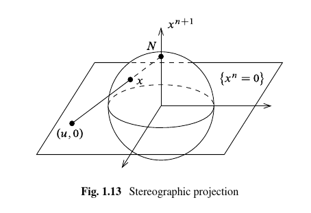

[Smooth Manifolds](Smooth%20Manifolds)
[LeeManifolds](../LeeManifolds.md)

Tags: #manifolds #exercises

## Recommended Problems

> Note: helpful theorem, two smooth structures induced by two smooth atlases $\mca_1, \mca_2$ are equivalent iff $\mca_1 \union \mca_2$ is again a smooth atlas.
> So it suffices to check pairwise compatibility of charts.

Exercise (Problem 1.6) 
:   Show that if $M^n\neq \emptyset$ is a topological manifold of dimension $n\geq 1$ and $M$ has a smooth structure, then it has uncountably many distinct ones. \todo{Recommended problem}

    > Hint: show that for any $s> 0$ that $F_s(x) \definedas \abs{x}^{s-1}x$ defines a homeomorphism $F_x: \DD^n \to \DD^n$ which is a diffeomorphism iff $s=1$.

Solution:

Define
\begin{align*}
F_s: \RR^n &\to \RR^n \\
\vector x &\mapsto \norm{\vector x}^{s-1} \vector x 
.\end{align*}

Claim: $F_s$ restricted to $\DD^n$ is a continuous map $\DD^n \to \DD^n$.

- Note that if $\norm{\vector x}\leq \eps < 1$ then $$\norm{F_s(\vector x)} = \norm{ \norm{\vector x}^s \hat{\vector x} } = \norm{\vector x}^s \leq \norm{\vector x} \leq \eps < 1,$$
  so $F_s(\DD^n) \subseteq \DD^n$ and moreover $F_s(\DD_\eps^n) \subseteq \DD_\eps^n$.

  - We'll use the fact that $F_s\inv = F_{1\over s}$ is of the same form, and thus $F_s\inv(\DD^n) \subseteq \DD^n$, forcing $F_s(\DD^n) = \DD^n$.

- This is a continuous function on the punctured disc $\DD_0^n \definedas \DD^n\setminus\theset{\vector 0}$, since it can be written as a composition of smooth functions:
   \begin{center}
   \begin{tikzcd}
\DD_0^n \ar[r, "\Delta"] & \DD_0^n \cross \DD_0^n \ar[r, "{(\norm{\wait}, ~\id_{\DD_0^n})}", outer sep=5pt] & \DD_0^n \cross \DD_0^n \ar[r, "{(\qty{\wait }^{s-1}, ~\id_{\DD_0^n})}", outer sep=5pt] & \DD_0^1 \cross \DD_0^n \ar[r, "{(a,b)\mapsto ab}", outer sep=5pt]& \DD_0^n \\
    \vector x \ar[r] & (\vector x, \vector x) \ar[r] & (\norm{\vector x}, \vector x) \ar[r] & (\norm{\vector x}^{s-1}, \vector x)\ar[r] & \norm{\vector x}^{s-1} \vector x
   \end{tikzcd}
   \end{center}

    For any $s\geq 0$, continuity at zero follows from the fact that $\norm{F_s(\vector x)} \leq \norm{\vector x} \to 0$, so $\lim_{\vector x \to \vector 0}F_s(\vector x) = \vector 0$ and the sequential definition of continuity applies. So $F_s$ is continuous on $\DD^n$ for every $s$.

    > Here we are taking for granted the fact that taking norms, exponentiating, and multiplying are all smooth functions away from zero.

Claim: $F_s$ is a bijection $\DD^n\setminus{\vector 0}\selfmap$ that extends to a bijection $\DD^n\selfmap$.

We can note that
\begin{align*}
F_s(\vector x) = 
\begin{dcases}
\norm{\vector x}^s{\vector x \over \norm{\vector x}} \definedas \norm{\vector x}^s \hat{\vector x} & \text{if } \norm{\vector x} \neq 0 \\
\vector 0 & \text{if } \norm{\vector x } = 0
\end{dcases}
\end{align*}

This follows because we can construct a two-sided inverse that composes to the identity, namely $F_{1\over s}$, for $\vector x\neq \vector 0$, and note that $F_s(\vector 0) = \vector 0$.
Using the fact that $\norm{t \vector x} = t\norm{\vector x}$ for any scalar $t$, we can check that
\begin{align*}
\qty{F_s \circ F_{1\over s}}(\vector x)
&= F_s(\norm{\vector x}^{1\over s} \hat{\vector x}) \\
&= \norm{ \norm{\vector x}^{1\over s} \hat{\vector x} }^{s} \cdot \hat{\norm{\vector x}^{1\over s} \hat{\vector x}} \\
&= \qty{ \norm{\vector x}^{1\over s}}^s \cdot \norm{ \hat{\vector x} }^{s} \cdot { \norm{\vector x}^{1\over s} \hat{\vector x} \over \norm{ \norm{\vector x}^{1\over s} \hat{\vector x}  } } \\
&= \norm{\vector x} \cdot 1^s \cdot \qty{\norm{\vector x}^{1\over s} \over \norm{\vector x}^{1\over s}} \cdot {\hat{\vector x} \over \norm{\hat{\vector x}} } \\
&= \norm{\vector x} \hat{\vector x} \\
&= \vector x
.\end{align*}

and similarly
\begin{align*}
\qty{F_{1\over s} \circ F_s}(\vector x) 
&= F_{1\over s} \qty{ \norm{\vector x}^s \hat{\vector x}  } \\
&= \norm{\norm{\vector x}^s \hat{\vector x}  }^{1\over s} \cdot \hat{ \norm{\vector x}^s \hat{\vector x}  } \\
&= \qty{\norm{\vector x}^s}^{1\over s} \norm{\hat{\vector x} }^{1\over s} \cdot {\norm{\vector x}^s \hat{\vector x} \over \norm{ \norm{\vector x}^s \hat{\vector x} }  } \\
&= \norm{\vector x} \cdot 1^{1-s} \cdot \qty{\norm{\vector x}^s \over \norm{\vector x}^s } \cdot {\hat{\vector x} \over \norm{\hat{\vector x}}} \\
&= \norm{\vector x} \hat{\vector x} \\
&= \vector x
.\end{align*}

Claim: $F_s$ is a homeomorphism for all $s$.

This follows from the fact that the domain $\DD^n$ is compact and the codomain $\DD^n$ is Hausdorff, and a continuous bijection between such spaces is a homeomorphism.

Claim: $F_s$ is a diffeomorphism iff $s=1$.

If $s=1$, $F_s = \id_{\DD^n}$ which is clearly a diffeomorphism.

Otherwise, we claim that $F_s$ is not a diffeomorphism because either $F_s$ or $F_s\inv$ will fail to be smooth at $\vector x = \vector 0$.

- If $0\leq s < 1$, then $F_s$ fails to be differentiable at zero. \todo{Why? Should boil down to $x\mapsto x^t$ for $0\leq t< 1$ failing to be differentiable at 0 in $\RR$}
- If $1<s< \infty$ then $0 \leq {1\over s} < 1$ and the same argument applies to $F_s\inv \definedas F_{1\over s}$.

We now show that we can produce infinitely many distinct maximal atlases on $M$.
Let $\mca$ by any smooth atlas on $M$ and fix $p_0\in M$.

Claim: We can modify $\mca$ to obtain an atlas $\mca'$ where $p_0$ is in exactly one chart $(V, \psi)$ with $\psi(p_0) = \vector 0 \in \RR^n$.

- Pick a chart containing $p_0$, say $(U, \phi)$ where $\phi(p_0) \definedas \vector p$
- Since $\phi(U)\subseteq \RR^n$ is open, find a disc containing $\vector p$, say $\DD_R(\vector p) \subset \phi(U)$.
- Define $V\subseteq M$ as $V\definedas \phi\inv(\DD_R(\vector p))$.
- Define $\psi: U\to \RR^n$ by 
  \begin{align*}
  \psi: U &\to \RR^n \\
  x &\mapsto {\phi(x) - \phi(p_0) \over R}
  .\end{align*}
  - Note: this is constructed precisely so that $\psi(V) = \DD_1(\vector 0) \in \RR^n$ and $\psi(p) = 0$.
  - This is a homeomorphism onto its image since we can write $$\psi = \delta_{1\over R}\circ \tau_{\vector p} \circ \phi$$ is a composition of continuous functions, where $\delta, \tau$ are dilations/translations in $\RR^n$ which are known to be continuous, and $$\psi\inv = \phi\inv \circ \tau_{- \vector p} \circ \delta_R$$ is again a composition of smooth (and in particular, continuous) functions.
- Define $\mca^1 \definedas \mca \union \theset{ (V, \restrictionof{\psi}{V})}$
  - This is a smooth atlas: any pair of charts coming from $\mca$ are smoothly compatible, so it suffices to check that an arbitrary chart from $\mca$ is smoothly compatible with the new chart.
  - Let $(T, \xi)$ be any other chart, then if $T\intersect V\neq \emptyset$, the transition function $$\psi \circ \xi\inv =  \delta_{1\over R} \tau_{\vector p} \circ \phi \circ \xi\inv$$ is a composition of smooth functions and thus smooth, and similarly for $\xi\circ \psi\inv$.
  - Since the charts from $\mca$ cover $M$, so do the charts of $\mca^1$ since $\mca \subseteq \mca^1$.
- For every $(U_\alpha, \phi_\alpha)\in \mca^1$, define a new chart $(U_\alpha \setminus\theset p, \restrictionof{\phi_\alpha}{U_\alpha \setminus\theset p})$ and define this set of charts as $\mca^2$.
  - This still covers $M$: $p$ is in the chart $(V, \psi\mid_V)$, and if $q\neq p$, then $q\in U_\alpha$ for some $\alpha$ since $\mca$ was an atlas, and $q\in U_\alpha\setminus\theset{p}$.
  - The coordinate maps are still homeomorphisms onto their images, because the restriction of a homeomorphism is again a homeomorphism.
  - The transition functions are still smooth because the restriction of a smooth function is again smooth.

Claim: We can define a new atlas $\mca_s$ from $\mca^2$ by only replacing the single chart $(V, \psi)$ with $(V, F_s \circ \psi)$.

- $\mca_s$ still covers $M$, since we haven't changed the coordinate domains
- All coordinate functions are still a homeomorphisms onto their images, since the only change is $\psi$ is replaced with $F_s \circ \psi$ and we've shown that $F_s$ is a homeomorphism; a composition of homeomorphisms is again a homeomorphism.
- The chart $(V, F_s\circ \psi)$ is still a valid chart, since $F_s: \DD_n\selfmap$ and $\psi(V) \cong \DD^n$ by construction.
- All charts in $\mca_s$ are still smoothly compatible:
  - If suffices to check compatibility between an arbitrary $(U_\alpha, \phi_\alpha)$ and $(V, F_s\circ \psi)$, so we consider $F_s\circ \psi\circ \phi_\alpha\inv$
  - By construction, $p\not\in U_\alpha$, and we know $F_s$ is smooth away from $\vector 0$, so this is a smooth function.

Claim: If $s\neq t$ then $\mca_s$ and $\mca_t$ are not smoothly compatible, and thus generate distinct maximal smooth atlases.

- If $\mca_s, \mca_t$ define the same smooth structure, then in particular $(V, F_s\circ \psi)$ must be smoothly compatible with $(V, F_t \circ \psi)$.
- We can compute the transition function
\begin{align*}
\qty{F_s\circ \psi} \circ (F_t\circ \psi)\inv = F_s\circ \psi \circ \psi\inv \circ F_t\inv = F_s\circ F_t\inv = F_s \circ F_{1\over t} = F_{s\over t}
.\end{align*}
- From above, we know this is smooth iff ${s\over t} = 1$, i.e. $s=t$.
- So if $s\neq t$, then the maximal atlases correspond to $\mca_s, \mca_t$ each contain a chart that is not smoothly compatible with the other, and so these are distinct smooth structures.

$\qed$

Exercise (Problem 1.7)
:   Let $N\definedas \thevector{0, \cdots, 1} \in S^n$ and $S\definedas \thevector{0, \cdots, -1}$ and define the stereographic projection
    \todo{Recommended problem}
    \begin{align*}
    \sigma: S^n\setminus N &\to \RR^n \\
    \thevector{x^1, \cdots, x^{n+1}} &\mapsto {1 \over 1-x^{n+1}} \thevector{x^1, \cdots, x^n}
    \end{align*}
    and set $\tilde\sigma(x) = -\sigma(-x)$ for $x\in S^n\setminus S$ (projection from the South pole) \todo{Note that the figure should say $\theset{x^{n+1} = 0}$ instead of $x^n$.}
    
    

    1. For any $x\in S^n\setminus N$ show that $\sigma(x) = \vector u$ where $(\vector u, 0)$ is the point where the line through $N$ and $x$ intersects the linear subspace $H_{n+1} \definedas \theset{x^{n+1} = 0}$.
  
        Similarly show that $\tilde \sigma(x)$ is the point where the line through $S$ and $x$ intersects $H_{n+1}$.
  
    2. Show that $\sigma$ is bijective and 
    \begin{align*}
    \sigma\inv(\vector u) = \sigma\inv\qty{\thevector{u^1, \cdots, u^n }} = {1\over \norm{\vector u}^2 + 1} \thevector{2u^1, \cdots, 2u^n, \norm{\vector u}^2 - 1}
    .\end{align*}
  
    3. Compute the transition map $\tilde \sigma \circ \sigma\inv$ and verify that the atlas
    \begin{align*}
    \mca \definedas \theset{(S^n\setminus N, \sigma), (S^n\setminus S, \tilde \sigma)  }
    \end{align*}
    define a smooth structure on $S^n$.
  
    4. Show that this smooth structure is equivalent to the standard smooth structure:
        Put graph coordinates on $S^n$ as outlined in \ref{ex:sphere_is_a_manifold} to obtain $\theset{(U_i^\pm, \phi_i^{\pm})}$.
      
        For indices $i<j$, show that
        \begin{align*}
        \phi_i^\pm \circ (\phi_j^\pm)\inv \thevector{u^1, \cdots, u^n} = \thevector{u^1, \cdots, \hat{u^i}, \cdots, \pm\sqrt{1 - \norm{\vector u}^2}  ,\cdots u^n}
        \end{align*}
        where the square root appears in the $j$th position.
        Find a similar formula for $i>j$.
        Show that if $i=j$, then
        \begin{align*}
        \phi_i^\pm \circ (\phi_j^\pm)\inv = \phi_i^- \circ (\phi_i^+)\inv = \id_{\DD^n} 
        .\end{align*}
      
        Show that these yield a smooth atlas.

    

Solution (1):

- Parameterize the line through $\vector x\in S^n$ and $\vector N$: 
 \begin{align*}
  \ell_{N, \vector x}(t) 
  &= t\vector x + (1-t) \vector N \\
  &= t\thevector{x^1, \cdots, x^n, x^{n+1}} + (1-t)\thevector{0, \cdots, 1} \\
  &= \thevector{tx^1, \cdots, x^n, tx^{n+1} + (1-t)} \\
  &= \thevector{tx^1, \cdots, x^n, 1 - t\qty{1-x^{n+1}}} \\
 .\end{align*}

- Evaluate at $t = {1 \over 1 - x^{n+1}}$ to obtain ${1\over x^{n+1}}\thevector{x^1, \cdots, x^n, 0} = \thevector{ \sigma(\vector x), 0}$.
- For $\tilde \sigma(\vector x)$: Todo \todo{Todo}.

Solution (2):

- How to derive this formula: no clue. \todo{Figure out how to invert.}
  - Start with $\vector u \in \RR^n$, parameterize the line $\ell_{N, \vector u}(t)$, solve for where $\norm{\ell_{N, \vector u}(t)} = 1$ and $\vector u \neq N$
  - Should yield $t^2 \norm{u} + (1-t)^2 = 1$, solve for nonzero $t$; should get $t = {2 \over \norm{\vector u} + 1}$, so $x^i = 2u^i/(\norm{\vector u} + 1)$ and $x^{n+1} = \qty{2 \over \norm{\vector u} + 1} -1$.
- Compute compositions $\sigma \circ \sigma\inv$: Todo. \todo{Messy computations that didn't work out.}

Solution (3):

- Computing the transition maps:
\begin{align*}
(\tilde \sigma \circ \sigma\inv)(\vector u) 
&= -\sigma\qty{\qty{-1 \over \norm{\vector u}^2 + 1} \thevector{2u^1, \cdots, 2u^n, \norm{\vector u}^2 - 1}  } \\
&= -1 \cdot \thevector{ {{ -2 u^1 \over \norm{\vector u}^2 + 1} \over 1 - {1 - \norm{\vector u}^2 \over 1 + \norm{\vector u}^2 }}  , \cdots_n } \\
&= \thevector{ {2u^1 \over \norm{\vector u}^2 + 1} \cdot {1 + \norm{\vector u}^2 \over 1 + \norm{\vector u}^2 - (1 - \norm{\vector u}^2)}, \cdots_n} \\
&= \thevector{ {2u^1 \over 2\norm{\vector u}^2}, \cdots_n } \\
&= {\vector u \over \norm{\vector u}^2} \\
&\definedas \hat{\vector u}
,\end{align*}
  which is a smooth function on $\RR^n\setminus\theset{\vector 0}$.

- Todo: computing $(\sigma \circ \tilde\sigma\inv)(\vector u) = \hat{\vector u}$\todo{Computation.}
- Todo: argue that it suffices that these are smooth on $\RR^n\setminus\theset{\vector 0}$ \todo{What are the actual domains and ranges of the transition functions? It seems like you pull back $\RR^n$ to $S^n\setminus N$, then push $S^n\setminus\theset{N, S}$ to $R^n\setminus 0$, but this yields $\RR^n\to\RR^{n}\setminus 0$ where we haven't deleted zero in the domain (problem: not smooth!).}

Solution (4):

We want to argue that these define the same maximal smooth atlas, for which it suffices to the charts from each are pairwise smoothly compatible.

- Define $\phi_i\qty{\thevector{x^1, \cdots, x^n}} = \thevector{x^1, \cdots, \hat{x^i}, \cdots, x^n}$ and $\phi_i\inv\qty{\thevector{x^1, \cdots, x^{n-1}}} = \thevector{x^1, \cdots_i, \sqrt{1 - \norm{\vector x}}, \cdots, x^n }$.
- Compute $(\phi_i \circ \sigma\inv)(\vector u) = {1 \over \norm{\vector u} + 1}\thevector{2 u^1, \cdots \hat{u^i}, \cdots, 2u^n, \norm{\vector u}^2 - 1}$, which is (clearly) smooth?
- Compute $(\sigma \circ \phi_i\inv)(\vector u) = \sigma\qty{\thevector{u^1, \cdots_i, \sqrt{1 - \norm{\vector u}^2}, \cdots, u^n } }$, which is ${1\over 1-u^n}\thevector{u^1, \cdots_i, \sqrt{1-\norm{\vector u}^2}, \cdots, u^{n-1}}$.
  - This is smooth if $u^n\neq 1$, but this corresponds to $\vector N$ in $S^2$, in which case $\phi_i\inv(\vector u)$ isn't in the domain of $\sigma$ to begin with.

Exercise (Problem 1.8)
:   Define an *angle function* on $U\subset S^1$ as any continuous function $\theta:U\to\RR$ such that $e^{i\theta(z)} = z$ for all $z\in U$.

    Show that $U$ admits an angle function iff $U\neq S^1$, and for any such function $\theta$, $(U, \theta)$ is a smooth coordinate chart for $S^1$ with its standard smooth structure.

Note that $f: \RR\to S^1$ given by $f(x) = e^{ix}$ is a covering map (in fact the universal cover). \todo{Some way to do this just with covering spaces?}

$\implies$: 

- Suppose there exists an angle function $\theta: U \to \RR$.
- Then $f\circ \restrictionof{\theta}{U} = \id_U$ by assumption, since $u \mapsvia{\restrictionof{\theta}{U}} \theta(u) \mapsvia{f} e^{i\theta(u)} = u$. 
- So $\theta$ has a left-inverse and is thus injective.
- Suppose $U = S^1$, which is compact.
- Then $\theta$ is an injective continuous map on a compact set, so its image $\theta(S^1) \subseteq \RR$ is compact.
- Lemma: a continuous map from a compact space to a Hausdorff space is a closed map.
- Since $\theta$ is injective and is surjective onto its image, since it is continuous it is a homeomorphism onto its image and $S^1 \cong \theta(S^1)$.
- Since $S^1$ is connected, $\theta(S^1)$ is connected, and the only connected subsets of $\RR$ are intervals. 
- Since $\theta(S^1)$ is compact, it must be a closed and bounded subset, so $\theta(S^1) = [a, b] \subset \RR$.
- But this forces $S^1 \cong [a, b]$ is a homeomorphism, which is a contradiction: removing one point from $S^1$ yields one connected component, while removing ${1\over 2}(b-a)$ from $[a, b]$ produces a disconnected set.

$\impliedby$:

- Suppose $U\neq S^1$, then there exists a point $p\in S^1\setminus U$; wlog suppose $p=1$.
- Then $U \subseteq S^1\setminus\theset{1}$
- Note that $f\inv(\theset{1}) = \theset{2k\pi \suchthat k\in \ZZ}$.
- Take the interval $I = [0, 2\pi]$ and set $\tilde f = \restrictionof{f}{I}$.
- Since $U\neq S^1$, $\tilde f\inv(U) \subsetneq I$.
- Then $\tilde f$ restricted to $f\inv(U)$ is injective, since $\tilde f$ only fails injectivity at $0, 2\pi$.
- Then the restricted map $\hat f \definedas  \restrictionof{f}{f\inv(U)}: f\inv(U) \to U$ is a continuous injection and surjects onto its image, thus a bijection
- Claim: $\hat f$ is a homeomorphism
  - Define a candidate inverse $\theta = \hat f \inv: S^1 \to \RR$.
  - Then $f\circ \theta = \id_{S^1}$ implies $e^{i\theta(x)} = x$ for all $x\in U$.
  - Letting $V \subseteq f\inv(U)$ be open, we have $\theta\inv(V) = \hat f(V)$ which (claim?) is open since ???
  - So $\theta$ is continuous.

Alternatively:

- Take $I = (0, 2\pi)$.
- Then $\tilde f(I) = S^1\setminus\theset{1}$, so $U \subseteq \tilde f(I)$.
- Claim: $f: S^1\setminus\theset{1} \to I$ is a homeomorphism.
- Set $\theta(x) = \restrictionof{\tilde f}{I}\inv{U}(x)$; the claim is that this works.
  - Taking a branch cut $\theset{x + iy \suchthat x\in [0, \infty), y = 0}$ for the complex logarithm defines an inverse. \todo{How to prove?}

$(U, \theta)$ is a smooth coordinate chart:

- Let $\theta$ be arbitrary with $e^{i\theta(z)} = z$ and $\theta\subsetneq S^1$.
- $U\subseteq S^1$ is open by assumption.
- We need to show that $\theta: U \to \phi(U)$ is a homeomorphism

Exercise (Problem 1.9)
:   Show that $\CP^n$ is a compact $2n\dash$dimensional topological manifold, and show how to equip it with a smooth structure, using the correspondence
    \todo{Recommended problem}
    \begin{align*}
    \RR^{2n} &\iff \CC^n \\
    \thevector{x^1, y^1, \cdots, x^n, y^n} &\iff \thevector{x^1 + iy^1, \cdots, x^n + iy^n}
    .\end{align*}

