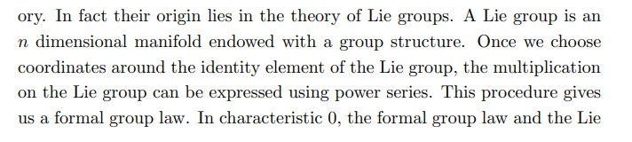

# Formal Groups and Spectra

Formal group law stuff

- [Notes](https://math.mit.edu/juvitop/pastseminars/notes_2020_Spring/Levy.pdf)

- [Survey Paper](http://people.math.harvard.edu/~lurie/papers/survey.pdf)

---

## Formal Groups

### Basics
- Motivation: why should one care about formal groups?
	- Idea: substitute for Lie algebras in positive characteristic
	- Formal group and lie algebra carry the same info in char 0
	- Functor: LieGroups (or AlgGrp) → LieAlgebras factors through FormalGroups
	 
  
- Motivation: if a formal group were for sale, why might you buy it?
	- 
- What is a formal group law?
	- 
		
		
		
- Why is the group law called "formal"?
    - 
- How "should" one think of a formal group?
	- 
- What is a formal exponential and formal logarithm?
	- 
		
		
		
		
- What are examples of formal groups? What is a morphism? When are they isomorphic?
   - 
- What are the additive and multiplicative formal groups?
  - 
- How are the additive and multiplicative formal groups related?
  - 
- What is the height of a formal group?
  - 
    
- How can one extend formal groups over R to R-algebras?
  - 
- What is the formal scheme interpretation of formal groups?
  - 
- How does iterated K-theory show up in the theory of formal groups?
  - 

## Other Connections to Elliptic Curves

- What is the invariant differential of an elliptic curve?
  - 
- How does one extract the formal group of an elliptic curve using differential forms?
  - 
- How does the formal group of a curve relate to torsion and the Mordell-Weil theorem?
  - 
- How do formal groups arise from elliptic curves?
  - 
- What can a formal group tell you about your curve?
  - 
    

## Lazard Ring

- What is the Lazard ring?
  - 
- What does it mean to be a "universal" coefficient ring?
  - 
- How exactly is the Lazard ring universal?
  - 
- How are formal groups related to spectra?
- What is MU?
- How are formal groups related to cobordism?
  - 
    
- What is a complex oriented cohomology theory?
   - 
- How is the Lazard ring directly related to cobordism classification?
   - 
- What is the moduli stack of formal groups?
  - 

---

## Stable Homotopy

### tmf

- How is tmf related to modular forms?
  - 
- How is tmf defined in terms of the moduli stack of elliptic curves?
   - 
   

### K-Theories

- How is the algebraic K-theory of a commutative ring defined/constructed in terms of monoidal categories?
   - 
    
