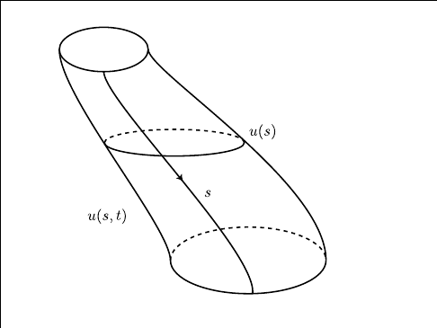
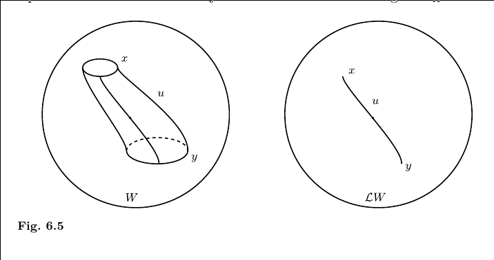

[Floer Reading Group Fall 2020](../../../../zets/Floer%20Reading%20Group%20Fall%202020.md)

From the text:

- $(W, \omega \in \Omega_2(W))$ is a (compact?) symplectic manifold

- $C^\infty(A, B)$ is the space of smooth maps with the $C^\infty$ topology (idea: uniform convergence of a function and all derivatives on compact subsets)
- $C^\infty_\loc(A, B)$ is the space with the $C^\infty$ uniform convergence topology on compact subsets of $A$

- $H \in C^\infty(W; \RR)$ a Hamiltonian with $X_H$ its vector field.

- $H \in C^\infty(W\cross \RR; \RR)$ given by $H_t \in C^\infty(W; \RR)$ is a time-dependent Hamiltonian.

- The action functional is given by
  \begin{align*}
  \mca_H: \mcl W &\to \RR\\
  x &\mapsto -\int_{\DD} u^* \omega + \int_0^1 H_t(x(t)) ~dt
  \end{align*}
  where $\mcl W$ is the contractible loop space of $W$,
  $u: \DD \to W$ is an extension of $x: S^1\to W$ to the disc with $u(\exp(2\pi i t)) = x(t)$.
  - Example: $W = \RR^{2n} \implies A_H(x) = \int_0^1 \qty{H_t ~dt - p~dq}$. 

- Critical points of the action functional $\mca_H$ are given by orbits, i.e. contractible loops $x, y \in \mcl W$
- In general, $x, y$ are two periodic orbits of $H$ of period 1.

- The Floer equation is given by
  \begin{align*}
  \frac{\partial u}{\partial s}+J(u) \frac{\partial u}{\partial t}+\operatorname{grad} H_{t}(u)=0
  .\end{align*}
  This is a first-order perturbation of the Cauchy-Riemann equations, for which solutions would be $J\dash$holomorphic curves.

- Solutions are functions $u \in C^\infty(\RR \cross S^1; W) = C^\infty(\RR; \mcl W)$
  - They correspond to "embedded cylinders" with sides $u$ and contractible caps $x, y$ regarded as loops in $W$.
  - They also correspond to paths in $\mcl W$ from $x\to y$ (precisely: trajectories of the vector field $-\grad \mca_H$)

    \
    
    \

    Here $u(s) \in \mcl W$ is a loop with value at time $t$ given by $u(s, t)$, and $\lim_{s\to - \infty} u_s(t) = x, \lim_{s\to \infty} u_s(t) = y$.

- The energy of a solution is $E(u) = \int_{\RR\cross S^1} \abs{\del_s u}^2 ~ds dt$.
- $\mcm = \theset{u \in C^\infty(\RR; \mcl W) \suchthat E(u) < \infty}$ (contractible solutions of finite energy), which is compact.

- $\mcm(x, y)$ is the space of solutions of the Floer equation connecting orbits $x$ and $y$.

- $C_{\searrow}(x, y)$:
  \begin{align*}
  C_{\searrow}(x, y) \definedas \{
  u \in C^\infty(\RR\cross S^1; W) \suchthat 
  &\lim_{s\to -\infty}u(s, t) = x(t),\quad 
  \lim_{s\to\infty}u(s, t) = y(t), \\
  &\left|\frac{\partial u}{\partial s}(s, t)\right| \leq K e^{-\delta|s|},\quad 
  \quad\left|\frac{\partial u}{\partial t}(s, t)-X_{H}(u)\right| \leq K e^{-\delta|s|}
  \}
  \end{align*}
  where $K, \delta > 0$ are constants depending on $u$.
  So 
  $$
  \abs{\del_s u(s, t)}, \abs{\del_t u(s, t) - X_H(u)}  \sim e^{\abs{s}}
  .$$

From the Appendices

- Relatively compact: has compact closure.
- Compact operator: the image of bounded sets are relatively compact.
- Index of an operator: $\dim \ker - \dim \coker$.
- Fredholm operators: those for which the index makes sense, i.e. $\dim \ker < \infty , \dim \coker < \infty$.
- Elliptic operators: generalize the Laplacian $\Delta$, coefficients of highest order derivatives are positive, principal symbol is invertible (???)
- Locally integrable: integrable on every compact subset
- Sobolev spaces: in dimension 1, define $\norm{u(t)}_{s, p} = \sum_{i=0}^s \norm{\del_t^i u(t)}_{L^p}$ on $C^\infty(\bar U)$, then take the completion and denote $W^{s, p}(\bar U)$.
  Yields a distribution space, elements are functions with weak derivatives.
- Distribution: $C_c^\infty(U)\dual$, the dual of the space of smooth compactly supported functions on an open set $U \subset \RR^n$.
