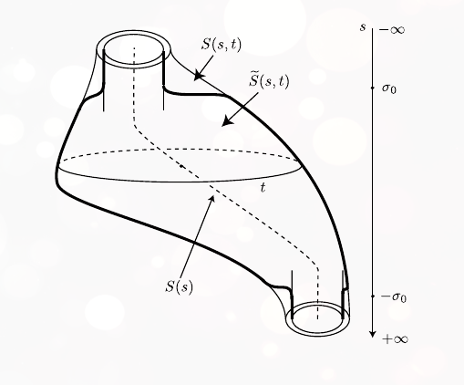

[Floer Reading Group Fall 2020](../../../../zets/Floer%20Reading%20Group%20Fall%202020.md)

What we're trying to prove:

- 8.1.5: $(d\mcf)_u$ is a Fredholm operator of index $\mu(x) - \mu(y)$.

- Define
\begin{align*}
L: W^{1, p}\left(\mathbb{R} \times S^{1} ; \mathbb{R}^{2 n}\right) & \longrightarrow L^{p}\left(\mathbb{R} \times S^{1} ; \mathbb{R}^{2 n}\right) \\
Y & \longmapsto \frac{\partial Y}{\partial s}+J_{0} \frac{\partial Y}{\partial t}+S(s, t) Y
\end{align*}
where we have uniform convergence in $t$ of
\begin{align*}
S: \RR\cross S^1 &\to \mat(2n; \RR) \\
S(s, t) &\converges{s\to\pm\infty}\to S^\pm(t)
.\end{align*}

- 8.7: Shows $L$ is Fredholm

- By the end of 8.8: replace $L$ by $L_1$ with the same *index* 
  - *(not the same kernel/cokernel)*
- Compute $\ind L_1$: explicitly describe $\ker L_1, \coker L_1$. 

- Replace in two steps:
  - $L \leadsto L_0$, modified outside $B_{\sigma_0}(0)$ in $s$. 
    - Replace $S(s, t)$ by a matrix 
    \begin{align*}
    \tilde S(s, t) = 
    \begin{cases}
    S^-(t)   & s\leq -\sigma_0 \\
    S^+(t)   & s\geq \sigma_0 \\
    \end{cases}
    .\end{align*}
    - Idea: approximate by cylinders at infinity.
    - Use invariance of index under small perturbations.
  - $L_0 \leadsto L_1$ by a homotopy, where $S_\lambda: S \leadsto S(s)$ a diagonal matrix that is a constant matrix *outside* $B_\eps(0)$.
    - Use invariance of index under homotopy.

## Main Results

- Theorem 8.8.1:  
  \begin{align*}
  \ind(L) = \mu\left(R^{-}(t)\right)-\mu\left(R^{+}(t)\right)=\mu(x)-\mu(y)
  .\end{align*}

- Prop 8.8.2: Reducing $L$ to $L_1$ 
  Construct an operator
  \begin{align*}
  L_{1}: W^{1, p}\left(\mathbb{R} \times S^{1} ; \mathbb{R}^{2 n}\right) & \longrightarrow L^{p}\left(\mathbb{R} \times S^{1} ; \mathbb{R}^{2 n}\right) \\
  Y & \longmapsto \frac{\partial Y}{\partial s}+J_{0} \frac{\partial Y}{\partial t}+S(s) Y
  \end{align*}
  where $S: \RR \to\mat(2n; \RR)$ is a path of diagonal matrices depending on $\ind(R^\pm(t))$; then 
  $$\ind(L) = \ind(L_1) = \ind(R^-(t)) - \ind (R^+(t)).$$

- Prop 8.8.3: Reducing $L_1$ to $R^\pm$.
  Let $k^\pm \definedas \ind(R^\pm)$; then $\ind(L_1) = k^- - k^+$.

- Lemma 8.8.4: $\ind(L_0) = \ind(L)$.

- Han's Talk:
  - Prop 8.8.3, using Lemma 8.8.5
- Me
  - Proof of 8.8.5

## 8.8.5: 

Used in the proof of 8.8.3, $\ind(L_1) = k^- - k^+$.

Setup:

We have
\begin{align*}
J_0^1 = 
\left[\begin{array}{cc}
0 & -1 \\
1 & 0
\end{array}\right]
\implies
J_0 = 
\begin{bmatrix}
J_0^1           &       &        & \\
                & J_0^1 &        & \\
                &       & \ddots & \\
                &       &        & J_0^1
\end{bmatrix} \in \bigoplus_{i=1}^n \mat(2; \RR) 
.\end{align*}

We had a path of diagonal matrices of the form:
\begin{align*}
S(s) \definedas \left(\begin{array}{cc}
a_{1}(s) & 0 \\
0 & a_{2}(s)
\end{array}\right), \quad \text { with } a_{i}(s)\definedas_? \left\{\begin{array}{ll}
a_{i}^{-} & \text {if } s \leq-s_{0} \\
a_{i}^{+} & \text {if } s \geq s_{0}
\end{array}\right.
.\end{align*}

Statement: let $p>2$ and define
\begin{align*}
F: W^{1, p}\left(\mathbb{R} \times S^{1} ; \mathbb{R}^{2}\right) &\longrightarrow L^{p}\left(\mathbb{R} \times S^{1} ; \mathbb{R}^{2}\right) \\
Y &\mapsto \frac{\partial Y}{\partial s}+J_{0} \frac{\partial Y}{\partial t}+S(s) Y
.\end{align*}

> This looks like $L_1$ for $n=1$?

1.  Suppose $a_1(s) = a_2(s)$ and define $a^\pm \definedas a_1^\pm = a_2^\pm$.
    Then
    \begin{align*}
      \operatorname{dim} \operatorname{Ker} F &=
      2 \cdot \#\left\{\ell \in \mathbf{Z} | a^{-} < 2 \pi \ell < a^{+}\right \} \\
      \operatorname{dim} \operatorname{Ker} F^{\star} &=
      2 \cdot \#\left\{\ell \in \mathbf{Z} | a^{+}<2 \pi \ell<a^{-}\right\}
    .\end{align*}

2.  Suppose $\sup_{s\in \RR} \norm{S(s)} < 1$, then
    \begin{align*}
    \operatorname{dim} \operatorname{Ker} F &= 
    \#\left\{i \in\{1,2\} \suchthat ~a_{i}^{-}<0 \text { and } a_{i}^{+}>0\right\}\\
    \operatorname{dim} \operatorname{Ker} F^{\star} 
    &=\#\left\{i \in\{1,2\} \suchthat ~ a_{i}^{+}<0 \text { and } a_{i}^{-}>0\right\}
    .\end{align*}

Remark: Resembles formula for computing index in Morse case, number of eigenvalues that change sign.

Remark: Proof will proceed by explicitly computing kernel.

## Proof

### Assertion 1

**Assertion 1**: 
  Suppose $a_1(s) = a_2(s)$ and define $a^\pm \definedas a_1^\pm = a_2^\pm$.
  Then
  \begin{align*}
    \operatorname{dim} \operatorname{Ker} F &=
    2 \cdot \#\left\{\ell \in \mathbf{Z} | a^{-} < 2 \pi \ell < a^{+}\right \} \\
    \operatorname{dim} \operatorname{Ker} F^{\star} &=
    2 \cdot \#\left\{\ell \in \mathbf{Z} | a^{+}<2 \pi \ell<a^{-}\right\}
  .\end{align*}

Step 1: Transform to Cauchy-Riemann Equations

- Write $a(s) = a_1(s) = a_2(s)$.
- Start with equation on $\RR^2$, $$Y(s, t) = \qty{ Y_1(s, t), Y_2(s, t) }$$
- Replace with equation on $\CC$: $$Y(s, y) = Y_1(s, t) + i Y_2(s, t)$$.
- Rewrite the PDE $F(Y) = 0$ as $\bar \del Y + S(s) Y = 0$, i.e.
\begin{align*}
\frac{\partial}{\partial s}\left(\begin{array}{l}
Y_{1} \\
Y_{2}
\end{array}\right)+\left(\begin{array}{cc}
0 & -1 \\
1 & 0
\end{array}\right) \frac{\partial}{\partial t}\left(\begin{array}{l}
Y_{1} \\
Y_{2}
\end{array}\right)+\left(\begin{array}{cc}
a(s) & 0 \\
0 & a(s)
\end{array}\right)\left(\begin{array}{l}
Y_{1} \\
Y_{2}
\end{array}\right)=0
.\end{align*}

- Change of variables: let $Y  = B\tilde Y$ where $B \in \GL(1, \CC)$ satisfies $\qty{\bar\del + S}B = 0$ to obtain $\bar \del \tilde Y = 0$.

  - Can choose $B = \begin{bmatrix}
  b(s) ) 0 \\
  0 & b(s)
  \end{bmatrix}$ where $\dd{b}{s} = -a(s)b(s)$.
  - Explicitly, we can take the integral 
    $b(s) = e^{\int_0^s -a(t) ~dt} = e^{-A(s)}$
- Remark: for some constants $C_i$, we have
\begin{align*}
A(s) = \begin{cases}
C_1 + a^- s & s \leq -\sigma_0 \\
C_2 + a^+ s & s \geq \sigma_0 \\
\end{cases}
.\end{align*}

- Remark: the new $\tilde Y$ satisfies CR. 
  It is continuous and $L^1_{\text{loc}}$ and thus by elliptic regularity $C^\infty$.
  Its real/imaginary parts are $C^\infty$ and harmonic.

Step 2: ?

- Identify $s+it \in \RR\cross S^1$ with $u = e^{2\pi z}$
- Apply Laurent's theorem to $\tilde Y(u)$ on $\CC\smz$ to obtain an expansion of $\tilde Y$ in $z$. 

- Deduce that the solutions of the system are given by
  \begin{align*}
  \tilde{Y}(s+i t)=\sum_{\ell \in \mathbf{Z}} c_{\ell} e^{(s+i t) 2 \pi \ell}
  .\end{align*}
  where $c_\ell \in \CC$ and this sequence converges for all $s, t$.
- Write in real coordinates as
  \begin{align*}
  \tilde{Y}(s, t)=\sum_{\ell \in \mathbf{Z}} e^{2 \pi s \ell}\left(\alpha_{\ell}\left(\begin{array}{c}
  \cos 2 \pi \ell t \\
  \sin 2 \pi \ell t
  \end{array}\right)+\beta_{\ell}\left(\begin{array}{c}
  -\sin 2 \pi \ell t \\
  \cos 2 \pi \ell t
  \end{array}\right)\right)
  .\end{align*}

- Return to $Y = B\tilde Y$:
\begin{align*}
Y(s, t)=\sum_{\ell \in \mathbf{Z}} e^{2 \pi s \ell}\left(\alpha_{\ell}\left(\begin{array}{c}
e^{-A(s)} \cos 2 \pi \ell t \\
e^{-A(s)} \sin 2 \pi \ell t
\end{array}\right)+\beta_{\ell}\left(\begin{array}{c}
-e^{-A(s)} \sin 2 \pi \ell t \\
e^{-A(s)} \cos 2 \pi \ell t
\end{array}\right)\right)
.\end{align*}

- For $s \geq s_0$, for some constants $K_i$ we can write
\begin{align*}
Y(s, t)=\sum_{\ell \in \mathbf{Z}}\left(\begin{array}{c}
e^{\left(2 \pi \ell-a^{-}\right) s+K}\left(\alpha_{\ell} \cos 2 \pi \ell t-\beta_{\ell} \sin 2 \pi \ell t\right) \\
e^{\left(2 \pi \ell-a^{-}\right) s+K^{\prime}}\left(\alpha_{\ell} \sin 2 \pi \ell t+\beta_{\ell} \cos 2 \pi \ell t\right)
\end{array}\right)
.\end{align*}
and for $s \geq s_0$
\begin{align*}
Y(s, t)=\sum_{\ell \in \mathbf{Z}}\left(\begin{array}{c}
e^{\left(2 \pi \ell-a^{+}\right) s+C}\left(\alpha_{\ell} \cos 2 \pi \ell t-\beta_{\ell} \sin 2 \pi \ell t\right) \\
e^{\left(2 \pi \ell-a^{+}\right) s+C^{\prime}}\left(\alpha_{\ell} \sin 2 \pi \ell t+\beta_{\ell} \cos 2 \pi \ell t\right)
\end{array}\right)
.\end{align*}

- Then $Y\in L^p \iff$ the exponential terms die at infinity.
  Forces the conditions:

  - $\ell \neq 0 \implies \alpha_\ell = \beta_\ell = 0$ *or* $2\pi \ell < a^+$.
  - $\ell = 0 \implies \qty{a_0 = 0 \text{ or } a^+ > 0}$ *and* $\qty{\beta_0 = 0 \text{ or } a^+ >. 0}$.

This further forces
\begin{align*}
\begin{cases}
\alpha_\ell = \beta_\ell = 0 \text{ or } a^- < 2\pi \ell < a^+ & \ell\neq 0 \\
\qty{\alpha_0 = 0 \txor a^- < 0 < a^+} \txand \qty{\beta_0 = 0 \txor a^- < 0 < a^+} & \ell = 0
\end{cases}
.\end{align*}

- Finitely many such $\ell$ that satisfy these conditions
- Sufficient conditions for $Y(s, t) \in W^{1, p}$.

\begin{align*}
F: W^{1, p}\left(\mathbb{R} \times S^{1} ; \mathbb{R}^{2}\right) &\longrightarrow L^{p}\left(\mathbb{R} \times S^{1} ; \mathbb{R}^{2}\right) \\
Y &\mapsto \frac{\partial Y}{\partial s}+J_{0} \frac{\partial Y}{\partial t}+S(s) Y
.\end{align*}

I.e. $F = \dd{}{s} + J_0 \dd{}{t} + S(s)$.

- Compute dimension of space of solutions:
\begin{align*}
\operatorname{dim} \operatorname{Ker} F 
&=2 \#\theset{\ell \in \mathbf{Z}^{\star} | a^{-}<2 \pi \ell<a^{+}} 
&=2 \#\left\{\ell \in \mathbf{Z} | a^{-}<2 \pi \ell<a^{+}\right\}
.\end{align*}

Test: 
\begin{align*}
\indic{\theset{ x}}
.\end{align*}

Use this to deduce $\dim \ker F^*$:

- $Y\in \ker F^* \iff Z(s, t) \definedas Y(-s, t)$ is in the kernel of the operator
\begin{align*}
\tilde F: W^{1, q}\left(\mathbb{R} \times S^{1} ; \mathbb{R}^{2}\right) &\longrightarrow L^{p}\left(\mathbb{R} \times S^{1} ; \mathbb{R}^{2}\right) \\
Z &\mapsto \frac{\partial Z}{\partial s}+J_{0} \frac{\partial Z}{\partial t}+S({\color{red}-s}) Y
.\end{align*}

- Obtain $\ker F^* \cong \ker \tilde F$.

$\qed_1$

### Assertion 2

**Assertion 2**:
  Suppose $\sup_{s\in \RR} \norm{S(s)} < 1$, then
  \begin{align*}
  \operatorname{dim} \operatorname{Ker} F &= 
  \#\left\{i \in\{1,2\} \suchthat ~a_{i}^{-}<0 \text { and } a_{i}^{+}>0\right\}\\
  \operatorname{dim} \operatorname{Ker} F^{\star} 
  &=\#\left\{i \in\{1,2\} \suchthat ~ a_{i}^{+}<0 \text { and } a_{i}^{-}>0\right\}
  .\end{align*}

We use the following lemma

- Lemma 8.8.7: 
$$
\sup_{s\in \RR} \norm{ S(s) } < 1 \implies \text{the elements in }\ker F,~ \ker F^* \text{ are independent of }t
.$$

- Proof: see Proposition 10.1.7, in subsection 10.4.a.

- We know (?) 
\begin{align*}
\vector a(s) \definedas
\begin{bmatrix}
a_1(s) \\
a_2(s)
\end{bmatrix}, \quad 
\vector Y \definedas
\begin{bmatrix}
Y_1  \\
Y_2 
\end{bmatrix} \in \ker F \implies 
\dd{\vector Y}{s} = -\vector a(s) \vector Y
.\end{align*}

- Therefore we can solve to obtain
\begin{align*}
\vector Y(s) = \vector c \exp{-\vector A(s)}, \quad \vector A(s) = \int_0^s -\vector a(\sigma) ~d\sigma
.\end{align*}

- Explicitly,
\begin{align*}
\begin{dcases}
\dd{Y_1}{s} &= -a_1(s) Y_1 \\
\dd{Y_s}{s} &= -a_s(s) Y_2 \\
\end{dcases}
\quad \implies \quad
Y_i(s) = c_i e^{-A_i(s)}, \quad
A_i(s) &= \int_0^s -a_i(\sigma) ~d\sigma
.\end{align*}

- As before,
\begin{align*}
A_i(s) = 
\begin{dcases}
C_{1, i} + a_i^-\cdot s & s \leq -\sigma_0 \\
C_{2, i} + a_i^+\cdot s & s \geq  \sigma_0 \\
\end{dcases}
.\end{align*}

- Thus $Y_i \in W^{1, p} \iff 0 \in (a_i^-, a_i^+)$, establishing the formula for $\dim \ker F$.
- Get formula for $\dim \ker F^*$ using $\tilde F$ as before.

$\qed_2$

(End of Chapter)

# 8.8.3: 

- Previously: we replaced $S$ with a path of diagonal matrices only depending on $s$.

- Obtained an operator $L_1$.
- Statement: Prop 8.8.3: Reducing $L_1$ to $R^\pm$.
  Let $k^\pm \definedas \ind(R^\pm)$; then $\ind(L_1) = k^- - k^+$.

## Proof

- From section 8.7: $\coker L_1 \cong \ker L_1^*$:

- Recall definition of $L_1$:
\begin{align*}
L_{1}: W^{1, p}\left(\mathbb{R} \times S^{1} ; \mathbb{R}^{2 n}\right) & \longrightarrow L^{p}\left(\mathbb{R} \times S^{1} ; \mathbb{R}^{2 n}\right) \\
Y & \longmapsto \frac{\partial Y}{\partial s}+J_{0} \frac{\partial Y}{\partial t}+S(s) Y
\end{align*}

- We can write the adjoint:
\begin{align*}
L_{1}^{\star}: W^{1, {\color{blue}q}}\left(\mathbb{R} \times S^{1} ; \mathbb{R}^{2 n}\right) & \longrightarrow L^{\color{blue}q}\left(\mathbb{R} \times S^{1} ; \mathbb{R}^{2 n}\right) \\
Z & \longmapsto {\color{blue}-} \frac{\partial Z}{\partial s}+J_{0} \frac{\partial Z}{\partial t}+ S^{\color{blue} T}(s) Z
\end{align*}
where ${1\over p} + {1\over q} = 1$ are conjugate exponents.

- Now apply Lemma 8.8.3, which computes the kernels explicity
- Consider four cases, depending on parity of $k^\pm - n$, show all 4 lead to $\ind(L_1) = k^- - k^+$.
    $S_{k^\pm}$ are certain diagonal matrices, and

1. $k^- \equiv k^+ \equiv n \mod 2$.
2. $k^- \equiv n, k^+ \equiv n-1 \mod 2$
3. $k^- \equiv n-1, k^+ \equiv n \mod 2$. 
4. $k^- \equiv k^+ \equiv n-1 \mod 2$

| $k^-$      | $k^+$      | $n$        |
| ---        | ---        | ---        |
| \checkmark | \checkmark | \checkmark |
| \checkmark |            | \checkmark |
|            | \checkmark | \checkmark |
| \checkmark | \checkmark |            |

\scriptsize

Case 1
\begin{align*}
S_{k^-}          & = \begin{bmatrix}
-\pi             &                   &        &  &      &      &              & \\
                 & -\pi              &        &  &      &      &              & \\
                 &                   & \ddots &  &      &      &              & \\
                 &                   &        &  & -\pi &      &              & \\
                 &                   &        &  &      & -\pi &              & \\
                 &                   &        &  &      &      & (n-1-k^-)\pi & \\
                 &                   &        &  &      &      &              & (n-1-k^-)\pi \\
\end{bmatrix} \\
S_{k^+}          & = \begin{bmatrix}
-\pi             &                   &        &  &      &      &              & \\
                 & -\pi              &        &  &      &      &              & \\
                 &                   & \ddots &  &      &      &              & \\
                 &                   &        &  & -\pi &      &              & \\
                 &                   &        &  &      & -\pi &              & \\
                 &                   &        &  &      &      & (n-1-k^+)\pi & \\
                 &                   &        &  &      &      &              & (n-1-k^+)\pi \\
\end{bmatrix}
.\end{align*}

Case 2
\begin{align*}
S_{k-}           & = \begin{bmatrix}
-\pi             &                   &        &  &          &          &              & \\
                 & -\pi              &        &  &          &          &              & \\
                 &                   & \ddots &  &          &          &              & \\
                 &                   &        &  & -\eps\pi &          &              & \\
                 &                   &        &  &          & -\eps\pi &              & \\
                 &                   &        &  &          &          & (n-1-k^-)\pi & \\
                 &                   &        &  &          &          &              & (n-1-k^-)\pi \\
\end{bmatrix} \\
S_{k^+}          & = \begin{bmatrix}
-\pi             &                   &        &  &          &          &              & \\
                 & -\pi              &        &  &          &          &              & \\
                 &                   & \ddots &  &          &          &              & \\
                 &                   &        &  & \eps     &          &              & \\
                 &                   &        &  &          & -\eps    &              & \\
                 &                   &        &  &          &          & (n-2-k^+)\pi & \\
                 &                   &        &  &          &          &              & (n-2-k^+)\pi \\
\end{bmatrix}
.\end{align*}

Case 3: switches order of case 2.
\begin{align*}
S_{k-}&= 
\begin{bmatrix}
-\pi             &      &        &  &          &          &              & \\
                 & -\pi &        &  &          &          &              & \\
                 &      & \ddots &  &          &          &              & \\
                 &      &        &  & \eps     &          &              & \\
                 &      &        &  &          & -\eps    &              & \\
                 &      &        &  &          &          & (n-2-k^-)\pi & \\
                 &      &        &  &          &          &              & (n-2-k^-)\pi \\
\end{bmatrix}\\
S_{k+}           & =
\begin{bmatrix}
-\pi             &      &        &  &          &          &              & \\
                 & -\pi &        &  &          &          &              & \\
                 &      & \ddots &  &          &          &              & \\
                 &      &        &  & -\eps\pi &          &              & \\
                 &      &        &  &          & -\eps\pi &              & \\
                 &      &        &  &          &          & (n-1-k^+)\pi & \\
                 &      &        &  &          &          &              & (n-1-k^+)\pi \\
\end{bmatrix}
.\end{align*}

Case 4
\begin{align*}
S_{k-}&= 
\begin{bmatrix}
-\pi             &      &        &  &   &    &              & \\
                 & -\pi &        &  &   &    &              & \\
                 &      & \ddots &  &   &    &              & \\
                 &      &        &  & 1 &    &              & \\
                 &      &        &  &   & -1 &              & \\
                 &      &        &  &   &    & (n-2-k^-)\pi & \\
                 &      &        &  &   &    &              & (n-2-k^-)\pi \\
\end{bmatrix} \\
S_{k+}           & =
\begin{bmatrix}
-\pi             &      &        &  &   &    &              & \\
                 & -\pi &        &  &   &    &              & \\
                 &      & \ddots &  &   &    &              & \\
                 &      &        &  & 1 &    &              & \\
                 &      &        &  &   & -1 &              & \\
                 &      &        &  &   &    & (n-s-k^+)\pi & \\
                 &      &        &  &   &    &              & (n-2-k^+)\pi \\
\end{bmatrix}
.\end{align*}
\normalsize
