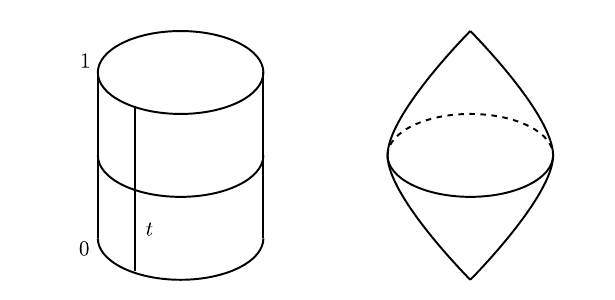
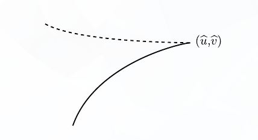
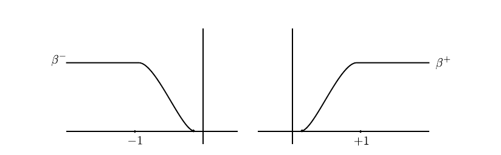
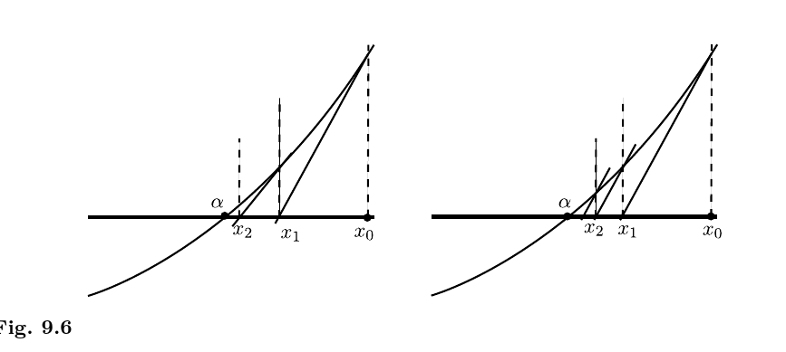
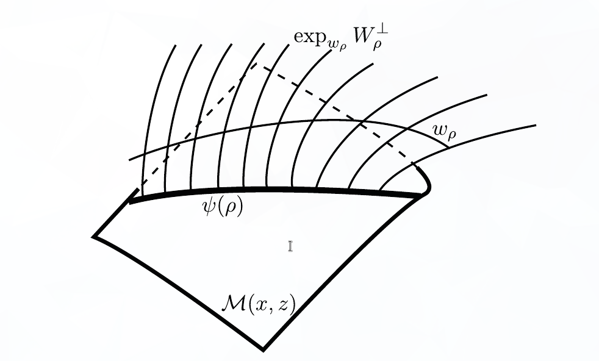

[Audin-Damian Morse Theory and Floer Homology](../../../Book%20Notes/Audin-Damian%20Morse%20Theory%20and%20Floer%20Homology/Audin-Damian%20Morse%20Theory%20and%20Floer%20Homology.md)
Tags: #symplectic 

# Background, Notation, Setup

**Goals**

:::{.theorem title="Arnold Conjecture (Symplectic Morse Inequalities?)"}
Let $(W, \omega)$ be a compact symplectic manifold  and 
\[  
H: W\to \RR
\]
a time-dependent Hamiltonian with nondegenerate 1-periodic solutions.
Then
\[  
\# \ts{\text{1-Periodic trajectories of }X_H} \geq \sum_{k\in \ZZ} \dim_{?} HM_k(W; \, \ZZ/2\ZZ)
.\]

> Here $HM_*(W)$ is the Morse homology, and *nondegenerate* means the differential of the flow at time 1 has no fixed vectors.

:::

**Important Ideas for This Chapter**:

:::{.theorem title="Use Broken Trajectories to Compactify"}
$\mathcal{L}(x, y)$ is compact, where the compactification is given by adding in 
\[
\bd \mathcal{L}(x, y) = \ts{\text{"Broken Trajectories"}}
\]
:::

:::{.theorem title="Gluing Yields a Chain Complex"}
\[
\del^2 = 0
\]
:::

\newpage

**Strategy**:

> In the background, have a Hamiltonian $H: W\to \RR$.
> Basic idea: cook up a gradient flow.

1. Define the action functional $\mathcal{A}_H$ 
  
  > On an infinite-dimensional space, critical points are periodic solutions of $H$

2. Construct the chain complex (graded vector space) $CF_*$.

  > Uses analog of the *index* of a critical point.

3. Define the vector field $X_H$ using $-\grad \mathcal{A}_H$.

  > This will be used to define $\del$ later. 

4. Count the trajectories of $X_H$

5. Show finite-energy trajectories connect critical points of $\mathcal{A}_H$.

6. Show *Gromov Compactness* for space of trajectories of finite energy

7. Define $\del$ 

  > Uses another compactness property

8. Show space of trajectories is a manifold, plus analog of "Smale property"

9. \textbf{Show that} $\del^2 = 0$ using a gluing property

10. Show that $HF_*$ doesn't depend on $\mathcal{A}_H$ or $X_H$

11. Show $HF_* \cong HM_*$, and compare dimensions of the vector spaces $CM_*$ and $CF_*$. 

\newpage

**Ingredients**:

- $(W, \omega, J)$ with $\omega \in \Omega^2(W)$ is a symplectic manifold 
  - With $J: T_p W \to T_p W$ an almost complex structure, so $J^2 = -\id$.
- $H \in C^\infty(W; \RR)$ a Hamiltonian
  - $X_H$ the corresponding symplectic gradient.
  - Defined by how it acts on tangent vectors in $T_x M$:
  \[  
  \omega_x(\wait , X_H(x)) = (dH)_x(\wait) 
  .\]
  - Zeros of vector field $X_H$ correspond to critical points of $H$:
  \[  
  X_H(x) = 0 \iff (dH)_x = 0
  .\]
  - Take the associated flow, assumed 1-periodic:
  \[
  \psi^t \in C^\infty(W, W) \qquad \psi^1 = \id
  ,\] 
  - Critical points of $H$ are periodic trajectories.
  

- $u \in C^\infty(\RR\cross S^1; W)$ is a solution to the Floer equation.

- The Floer equation and its linearization:
\begin{align*}
\mcf(u) &= \dd{u}{s} + J \dd{u}{t} + \grad_u(H) = 0 \\
\qty{d\mcf}_u(Y) &= \dd{Y}{s} + J_0 \dd{Y}{t} + S\cdot Y \\ \\ \\
&Y\in u^* TW,~ S \in C^\infty(\RR\cross S^1; \endo(\RR^{2n}))
.\end{align*}

\newpage

- $\mcl W$ is the *free loop space* on $W$, i.e. space of contractible loops on $W$, i.e. $C^\infty(S^1; W)$ with the $C^\infty$ topology
  - Elements $x\in \mcl W$ can be viewed as maps $S^1\to W$.
  - Can extend to maps from a closed disc, $u: \bar \DD^2 \to M$.
  - Loops in $\mcl W$ can be viewed as maps $S^2\to W$, since they're maps $I\cross S^1\to W$ with the boundaries pinched:

  

- The action functional is given by
  \begin{align*}
  \mca_H: \mcl W &\to \RR\\
  x &\mapsto -\int_{\DD} u^* \omega + \int_0^1 H_t(x(t)) ~dt
  \end{align*}

  - Example: $W = \RR^{2n} \implies A_H(x) = \int_0^1 \qty{H_t ~dt - p~dq}$. 

  - A correspondence
  \[  
  \correspond{\text{Solutions to the } \\\text{Floer equation}}
  \iff
  \correspond{\text{Trajectories} \\ \text{of } \grad \mathcal{A}_H}
  .\]

- $x, y$ periodic orbits of $H$ (nondegenerate, contractible), equivalently critical points of $\mathcal{A}_H$.

\newpage

- Assumption of *symplectic asphericity*, i.e. the symplectic form is zero on spheres. 
  Statement: for every $u\in C^\infty(S^2, W)$,
\[  
\int_{S^2} u^* \omega = 0 \qtext{or equivalently} \inner{\omega}{\pi_2 W} = 0
.\]

- Assumption of *symplectic trivialization*: for every $u\in C^\infty(S^2; M)$ there exists a symplectic trivialization of the fiber bundle $u^* TM$, equivalently
\[  
\inner{c_1 TW}{\pi_2 W} = 0
.\]
  
  > Locally a product of base and fiber, transition functions are symplectomorphisms.

- Maslov index: used the fact that 
  - Every path in $\gamma: I\to \Sp(2n, \RR)$ can be assigned an integer coming from a map $\tilde \gamma: I \to S^1$ and taking (approximately) its winding number.

- $\mathcal{M}(x, y)$, the moduli space of contractible finite-energy solutions to the Floer equation connecting $x, y$.

  - After perturbing $H$ to get transversality, get a manifold 

    - Dimension:
    \[  
    \dim \mcm(x, y) = \mu(x) - \mu(y)
    .\]

  - How we did it: 
    - Describe as zeros of a section of a vector bundle over $\mathcal{P}^{1, p}(x, y)$ 

      (Banach manifold modeled on the Sobolev spaces $W^{1, p}$), 
    
    - Apply Sard-Smale to show $\mathcal{M}(x, y)$ is the inverse image of a regular value of some map.
  
  - Needed tangent maps to be Fredholm operators, proved in Ch. 8 and used to show transversality.
  
    - Showed $(d\mathcal{F})_u$ is a Fredholm operator of index $\mu(x) - \mu(y)$.

$\qed$

\newpage

# Reminder of Goals

**Overall Goal**:

:::{.theorem title="Symplectic Morse Inequalities"}
\[  
\# \ts{\text{1-Periodic trajectories of }X_H} \geq \sum_{k\in \ZZ} HM_k(W; \, \ZZ/2\ZZ)
.\]
:::

---

**Important Ideas for This Chapter**:

:::{.theorem title="Using Broken Trajectories to Compactify"}
$\mathcal{L}(x, y)$ is compact, 
\[
\bd \mathcal{L}(x, y) = \ts{\text{"Broken Trajectories"}}
\]
:::

:::{.theorem title="Using Gluing to Get a Chain Complex"}
\[
\del^2 = 0
\]
:::

\newpage

# 9.1 and Review

- Defined moduli space of (parameterized) **solutions**:
\[  
\mathcal{M}(x, y) &= \ts{\text{Contractible finite-energy solutions connecting }x, y } 
\\ \\
\mcm &= \ts{\text{\textbf{All} contractible finite-energy solutions to the Floer equation}} \\
&= \bigcup_{x, y} \mathcal{M}(x, y)
.\]

- The moduli space of (unparameterized) **trajectories** connecting $x, y$:
\[  
\mathcal{L}(x, y) \da \mathcal{M}(x, y) / \RR
.\]

  - Use the quotient topology, define sequentially:
  \[  
  \tilde u_n \converges{n\to\infty}\too \tilde u 
  \quad\iff\quad 
  \exists \ts{s_n}\subset \RR \text{ such that } u_n(s_n + s, \wait) \converges{n\to\infty}\too u(s, \wait)
  .\]

  - When $\abs{\mu(x) - \mu(y)} = 1$, get a compact 0-manifold, so the number of trajectories $$n(x, y) \da \# \mathcal{L}(x, y)$$ is well-defined.

- $C_k(H) \da \ZZ/2\ZZ[\ts{\text{Periodic orbits of } X_H \text{ of Maslov index } k }]$.

  - Finitely many since they are nondegeneracy implies they are isolated.

:::{.remark}
Some notation:
\begin{center}
\begin{tikzcd}
\RR \ar[r] & \mathcal{M}(x, z)\ar[d, "\pi"] \\
 & \mathcal{L}(x, z) \\
\end{tikzcd}
\end{center}

Hats will generally denote maps induced on quotient.
:::

- Defined a differential
\[  
\del: C_k(H) &\to C_{k-1}(H) \\
x &\mapsto \sum_{\mu(y) = k-1} n(x, y) y \\ \\
n(x, y) &\da \# \ts{\text{Trajectories of } \grad \mathcal{A}_H \text{ connecting } x, y} \mod 2 \\
&= \# \mathcal{L}(x, y) \mod 2
.\]

- Examined $\del^2$:

\[  
\del^2: C_{k}(H) &\to C_{k-2}(H) \\
x &\mapsto \del(\del(x)) \\
&= \del \qty{\sum_{\mu(y) = \mu(x)-1} n(x, y) y} \\ \\
&= \sum_{\mu(y) = \mu(x) - 1} n(x, y) \del(y) \\ \\
&= \sum_{\mu(y) = \mu(x) - 1} n(x, y) \qty{\sum_{\mu(z) = \mu(y)-1} n(y, z) z} \\ \\
&= \sum_{\mu(y) = \mu(x) - 1} \,\,\sum_{\mu(z) = \mu(y)-1} n(x, y)  n(y, z) \,z \\
&= \sum_{\mu(z) = \mu(y) - 1} \qty{\sum_{\mu(y) = \mu(x)-1} n(x, y)  n(y, z)}\,z \hspace{4em} \text{(finite sums, swap order)}
,\]
  so it suffices to show
\[  
\sum_{\mu(y) = \mu(x)-1} n(x, y)  n(y, z) = 0 \qtext{when} \mu(z) = \mu(x) - 2 
.\]

  > Easier to examine parity, so we'll show it's zero mod 2.

\newpage

  - When $\mu(z) = \mu(x) - 2$, $\mathcal{L}(x, z)$ is a non-compact 1-manifold, so we compactify by adding in *broken trajectories* to get $\bar{\mathcal{L}}(x, y)$.
  
  - We'll then have
  \[  
  \bar{\mathcal{L}}(x, z) = \mathcal{L}(x, z) \union \bd \bar{\mathcal{L}}(x, z), \qquad \bd \bar{L}(x, z) = \bigcup_{\mu(y) = \mu(x) - 1} \mathcal{L}(x, y) \cross \mathcal{L}(y, z)
  ,\]
  which "space-ifies" the equation we want.

  - We'll show $\bd \bar{\mathcal{L}}(x, z)$ is a 1-manifold, which must have an even number of points, and thus
  \[  
  \sum_{\mu(y) = \mu(x)-1} n(x, y)  n(y, z) = 
  \# \qty{\bd \bar{\mathcal{L}}(x, z)} \equiv 0 \mod 2
  .\]

> Image here of relations between spaces!

$\qed$

\newpage

# Three Important Theorems

## First Theorem: Convergence to Broken Trajectories

- Recall: *broken trajectories* are unions of intermediate trajectories connecting intermediate critical points.

- Shown last time: a sequence of trajectories can converge to a broken trajectory, i.e. there are broken trajectories in the closure of $\mathcal{L}(x, z)$.

- This theorem describes their behavior: 

:::{.theorem title="9.1.7: Convergence to Broken Trajectories"}
Let $\ts{u_n}$ be a sequence in $\mathcal{M}(x, z)$, then there exist
\

- A subsequence $\ts{u_{n_j}}$
\
- Critical points $\ts{x_0, x_1, \cdots, x_{\ell+1}}$ with $x_0=x$ and $x_{\ell+1} = z$
\
- Sequences $\ts{s_n^1}, \ts{s_n^2}, \cdots, \ts{s_n^\ell}$.
\
- Elements $u^k \in \mathcal{M}(x_k, x_{k+1})$ such that for every $0\leq k \leq \ell$,
\[  
u_{n_j} \cdot s_n^k \converges{n\to\infty}\too u^k
.\]
:::

- Upshots:
  - Every sequence upstairs has a subsequence which (after reparameterizing) converges
  - This descends to actual convergence after quotienting by $\RR$?
  - Yields uniqueness of limits in $\mathcal{L}(x, z)$, thus a separated topology
  - Sequentially compact $\iff$ compact since $\mathcal{L}(x, z)$ is a metric space?

:::{.corollary title="Compactness"}
$\bar{\mathcal{L}}(x, z)$ is compact.
:::

\newpage

## Second Theorem: Compactness of $\bar{\mathcal{L}}(x, z)$

:::{.definition title="Regular Pair"}
For an almost complex structure $J$ and a Hamiltonian $H$, the pair $(H, J)$ is **regular** if the Floer map $\mathcal{F}$ is transverse to the zero section in the following vector bundle:
\

\begin{center}
\begin{tikzcd}
E_u \da \ts{\text{Vector fields tangent to $M$ along $u$}} \ar[r] & C^\infty(\RR\cross S^1; TM)\ar[dd] \\ 
 & \\
 &  C^\infty(\RR\cross S^1; M) \ar[uu, bend left, "\mathcal{F}", dotted] \ar[uu, bend right, "\mathbf{0}"', dotted]\\
\end{tikzcd}
\end{center}

:::

Most of chapter 9 is spent proving this theorem:

:::{.theorem title="9.2.1"}
Let $(H, J)$ be a regular pair with $H$ nondegenerate and $x, z$ be two periodic trajectories of $H$ such that
\[  
\mu(x) = \mu(z) + 2
.\]

Then $\bar{\mathcal{L}}(x, z)$ is a compact 1-manifold with boundary with
\[  
\bd \bar{\mathcal{L}}(x, z) = \bigcup_{y\in \mathcal{I}(x, z)} \mathcal{L}(x ,y) \cross \mathcal{L}(y, z)  \\ 
\text{where}\qquad \mathcal{I}(x, z) = 
\ts{
y \st \mu(x) < \mu(y) < \mu(z)
}
.\]

> Note: possibly a typo in the book? Has $x, y$ on the LHS.
:::

:::{.corollary}
\[\bd^2 = 0.\]
:::

\newpage

## Third Theorem: Gluing

:::{.theorem title="9.2.3: Gluing"}
Let $x,y,z$ be three critical points of $\mathcal{A}_H$ with three consecutive indices
\[  
\mu(x) = \mu(y)+1 = \mu(z) + 2
.\]

and let 
\[  
(u, v) \in \mathcal{M}(x, y) \cross \mathcal{M}(y, z) \quad\leadsto\quad (\hat u, \hat v)\in \mathcal{L}(x, y) \cross \mathcal{L}(y, z)
.\]

Then

1. There exists a $\rho_0 > 0$ and a differentiable map 
  \[  
  \psi: [\rho_0, \infty) &\to \mathcal{M}(x, z) 
  \]
  such that $\hat \psi$, the induced map on the quotient
  \begin{center}
  \begin{tikzcd}
  {[\rho_0, \infty)} \ar[r, "\psi"] \ar[rd, "\hat\psi"', dotted] & \mathcal{M}(x, z)\ar[d, "\pi"] \\
  & \mathcal{L}(x, z) \\
  \end{tikzcd}
  \end{center}
    is an embedding that satisfies 
  \[  
  \hat\psi(\rho) \converges{\rho\to\infty}\too (\hat u, \hat v) \in \bar{\mathcal{L}}(x, z)
  .\]

\newpage 

2. ("Uniqueness") For any sequence $\ts{\ell_n}\subseteq \mathcal{L}(x, z)$,
\[  
\ell_n \converges{n\to\infty}\too (\hat u, \hat v) \quad\implies\quad \ell_n \in \im(\hat \psi) \text{ for } n \gg 0
.\]

:::

- We already know that $\bar{\mathcal{L}}(x, z)$ is compact and $\mathcal{L}(x, z)$ is a 1-manifold, so we look at neighborhoods of boundary points.

- Why unique: will show that the broken trajectory $(\hat u, \hat v)$ is the endpoint of an embedded interval in $\bar{\mathcal{L}}(x, z)$.

    - Then show that any other sequence converging to $(\hat u, \hat v)$ must approach via this interval, otherwise could have cuspidal points:

  

$\qed$
\newpage

# Gluing Theorem 

Broken into three steps:

1. **Pre-gluing**: 
  - Get a function $w_\rho$ which interpolates between $u$ and $v$ in the parameter $\rho$.

    - Not exactly a solution itself, just an "approximation". 

2. **Newton's Method**:
  - Apply the Newton-Picard method to $w_p$ to construct a true solution 
  \[  
  \psi: [-\rho, \infty) &\to \mathcal{M}(x, z) \\
  \rho &\mapsto  \oldexp_{w_p}\qty{\gamma(p)}  \\ \\
  \text{for some } \gamma(p) &\in W^{1, p}(w_p^*\, TW) = T_{w_p} \mathcal{P}(x, z)
  \]
  - [GIF of Newton's Method](https://www.maplesoft.com/support/help/content/4702/plot552.gif)
  

3. **Project and Verify Properties**:

  - Check that the projection $\hat \psi = \pi \circ \psi$ satisfies the conditions from the theorem.

$\qed$
\newpage

# 9.3: Pre-gluing, Construction of $w_\rho$

- Choose (once and for all) a bump function $\beta$ on $B_{\eps}(0)^c \subset \RR \to [0, 1]$ which is 1 on $\abs{x} \geq 1$ and $0$ on $\abs{x} < \eps$
- Split into positive and negative parts $\beta^\pm(s)$:

- Define an interpolation $w_\rho$ from $u$ to $v$ in the following way: let 
  - $\oldexp \left[ \wait \right] \da \oldexp_{y(t)}(\wait)$ and 
  - $\ln(\wait) \da \oldexp\inv_{y(t)}(\wait)$, 

  then
  \[  
  w_\rho: x &\to z \\
  w_\rho(s,t) &\da 
  \begin{cases}
  {\color{blue} u(s+\rho, t)} & s\in (-\infty, -1] \\ \\
  \oldexp\left[ \beta^-(s)\ln({\color{blue} u(s+\rho, t) }) + \beta^+(s)\ln({\color{purple} u(s-\rho, t)} )\right] & s\in [-1, 1] \\ \\
  {\color{purple} u(s-\rho, t)} & s\in [1, \infty)
  \end{cases}
  .\]

- Why does this make sense?
\[  
  \abs{s}\leq 1 \implies u(s\pm \rho, t) \in 
  \ts{\oldexp_{y(t)} Y(t) \st \sup_{t\in S^1} \norm{Y(t)}\leq r_0 } \subseteq \im \oldexp_{y(t)} (\wait)
,\]
  so we can apply $\oldexp_{y(t)}\inv(\wait)$.

- Can make $\abs{s}\leq 1$ for large $\rho$, since 
  \[  
  u(s, t) \converges{s\to\infty}\too \quad &y(t) \\
  v(s, t) \converges{s\to-\infty}\too \quad &y(t)
  .\]

  - So pick a $\rho_0$ such that this holds for $\rho > \rho_0$.

  - Might have to increase $\rho_0$ later in the proof, so $\rho > \rho_0$ just means $\rho \gg 0$.

- Some properties:

  - $w_\rho \in C^\infty(x, z)$ and is differentiable in $\rho$.
  - $s\in [-\eps, \eps] \implies w_\rho(s, t) = y(t)$.
  \[  
  w_\rho(s-\rho, t) &\converges{\rho\to\infty}\too u(s, t)\qtext{in} C^\infty_\loc \\ \\
  w_\rho(s, t) &\converges{\rho\to\infty}\too y(t) \qtext{in} C^\infty_\loc
  .\]

- Now carry out the linearized version on tangent vectors, to which we will apply Newton-Picard:

  - Let $Y\in T_u \mathcal{P}(x, y)$
  - Let $Z\in T_v \mathcal{P}(x, y)$
  - Replace $w_\rho$ with the interpolation
  \[  
  Y\#_\rho Z \in T_{w_\rho} \mathcal{P}(x, y) = W^{1, p}(w_\rho^* TW)
  .\]
  defined by
  \[  
  (Y\#_\rho Z) (s, t) = 
  \begin{cases}
  {\color{blue} Y(s+\rho, t)} & s\in (-\infty, -1] \\ \\
  \oldexp_T\left[ \beta^-(s) \ln_T({\color{blue} Y(s+\rho, t) }) \, + \beta^+(s) \ln_T({\color{purple} Z(s-\rho, t)} )\right] & s\in [-1, 1] \\ \\
  {\color{purple} Z(s-\rho, t)} & s\in [1, \infty)
  \end{cases}
  ,\]
  where the subscript $T$ indicates taking tangents of the exponential maps at appropriate points.

$\qed$
\newpage

# 9.4: Construction of $\psi$.

## Summary

- Newton-Picard method, general idea:

  - Allows finding zeros of $f$ given an approximate zero $x_0$, using the extra information of the 1st derivative $f'$.
  
  - Original method and variant: find the limit of a sequence
  \[  
  x_{n+1} = x_n - {f(x_n) \over f'(x_n)}
  ,\qquad x_{n+1} = x_n - {f(x_n) \over f'({\color{red} x_0} )}
  .\]

  - Second variant more useful: only need derivative at one point:

\newpage

- Pregluing function $w_\rho \in C^\infty_{\searrow}(x, z)$ from previous section 
  - Exponential decay

- Want to construct true solution $\psi_\rho \in \mathcal{M}(x, z)$, so $\mathcal{F}(\psi_p) = 0$.

  - Suffices to get a weak solution
  - Automatic continuity + elliptic regularity $\implies$ strong solution

- Define $\mathcal{F}_\rho$ as $\mathcal{F} \circ \oldexp_{w_\rho}$ expanded bases $Z_i$ from trivialization of $TW$.

- $L_\rho = (d\mathcal{F}_\rho)_0$ will be the linearization of the Floer operator at zero.

\vspace{5em}

- Adapting Newton-Picard to operators:
  - $L_\rho$ won't be invertible on entire space, but
  \[ {1\over f'(x_0)} \iff L_\rho^{-1}, \]

  - Decompose 
  \[
  T_{w_\rho} \mathcal{P}(x, z) 
  = W^{1, p}(w_\rho^* TW) 
  = W^{1, p}(\RR\cross S^1; \RR^{2n}) 
  = \ker(L_{\rho}) \oplus W_{\rho}\perp,
  \]
  where $L_\rho$ will have a right inverse on $W_\rho\perp$.
    - Where does $W_\rho\perp$ come from?
      Essentially the kernel of some linear functional given by an integral:
  \[  
  W_\rho\perp \da \ts{Y\in W^{1, p} \st \int_{\RR\cross S^1} \inner{Y}{\cdots}\,ds\,dt = 0,\, \text{ plus conditions}}
  .\]

  - Run Newton-Picard in $W_{\rho}\perp$

- Will obtain for every $\rho \geq \rho_0$ an element $\gamma(\rho) \in W_\rho\perp$ with
\[  
\mathcal{F}_\rho(\gamma(\rho)) = 0
.\]

\newpage

  - Where does $\gamma$ come from? 
  Intersection-theoretic interpretation on page 320:
  \[  
  \qty{\oldexp_{w_\rho}}\inv \mathcal{M}(x, z) \intersect W_{\rho}\perp &\subseteq T_{w_\rho}\mathcal{P}(x, z) &\leadsto \gamma
  \\ 
  \mathcal{M}(x, z) \cap \ts{\oldexp_{w_\rho} W_\rho\perp \st \rho\geq \rho_0}&\subseteq \mathcal{P}(x, z) &\leadsto \psi(\rho)
  ,\]
  which we get by exponentiating.

- This gives a codimension 1 subspace in $\mathcal{M}(x, z)$, which we take to be $\psi(\rho)$:

\newpage

> Schematic picture here for $\gamma, \psi(\rho)$.

\newpage

- Apply the implicit function theorem to show differentiability of $\gamma$ in $\rho$.

- Use a trivialization $Z_i^\rho$ of $TW$ to get a vector field along $w_\rho$ 

  - This is exactly an element of $T_{w_\rho}\mathcal{P}(x, z)$

- Exponentiate to get an element of $\mathcal{M}(x, z)$:

\[  
\psi(\rho) \da \oldexp_{w_\rho}\qty{\gamma(\rho)}
.\]

- **Final Result**: project onto $\mathcal{L}(x, z)$ to get $\hat \psi$.

\vspace{4em} 

**Checking Properties**:

- Existence: show $\hat \psi$ is a proper injective immersion $\implies$ embedding. 
- Uniqueness: show the broken trajectory $(\hat u, \hat v)$ is the endpoint of an embedded interval in $\bar{\mathcal{L}}(x, z)$.

  - Show that any other sequence converging to $(\hat u, \hat v)$ must approach via this interval, otherwise could have cuspidal points:

 

> Probably not worth going farther than this! Extremely detailed analysis.

$\qed$
\newpage

